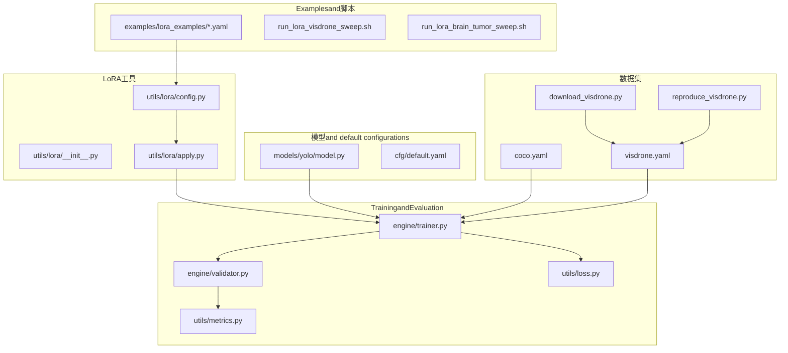
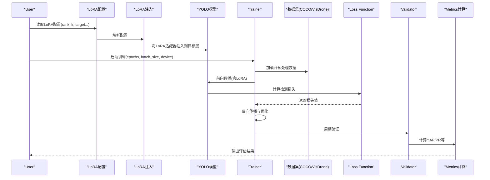
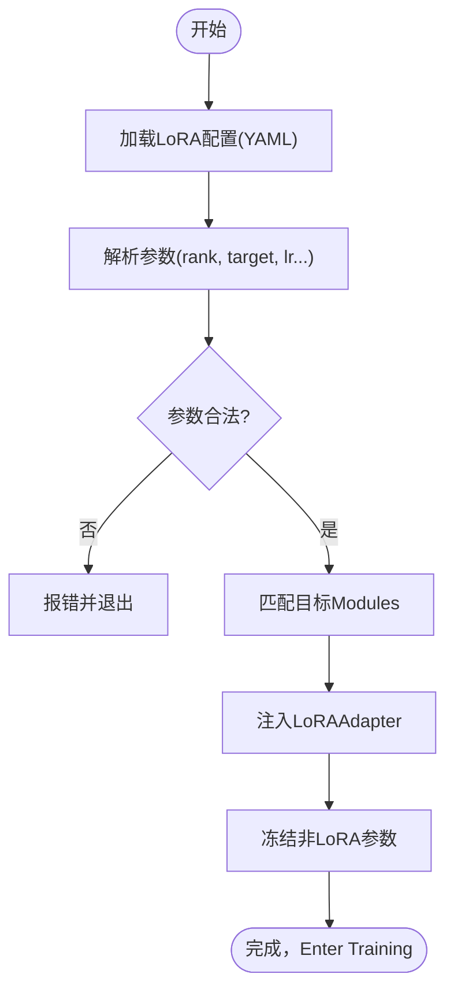
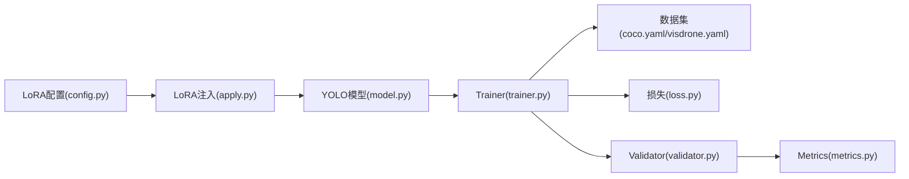

# Object DetectionPEFT配置

<cite>
**Files Referenced in This Document**
- [examples/lora_examples/yolov8_lora.yaml](file://examples/lora_examples/yolov8_lora.yaml)
- [examples/lora_examples/yolo11_lora.yaml](file://examples/lora_examples/yolo11_lora.yaml)
- [examples/lora_examples/yolo12_lora.yaml](file://examples/lora_examples/yolo12_lora.yaml)
- [examples/lora_examples/yolo_master_visdrone_lora.yaml](file://examples/lora_examples/yolo_master_visdrone_lora.yaml)
- [examples/lora_examples/yolo_master_brain_tumor_lora.yaml](file://examples/lora_examples/yolo_master_brain_tumor_lora.yaml)
- [examples/lora_examples/run_lora_visdrone_sweep.sh](file://examples/lora_examples/run_lora_visdrone_sweep.sh)
- [examples/lora_examples/run_lora_brain_tumor_sweep.sh](file://examples/lora_examples/run_lora_brain_tumor_sweep.sh)
- [ultralytics/cfg/datasets/detect/coco.yaml](file://ultralytics/cfg/datasets/detect/coco.yaml)
- [ultralytics/cfg/datasets/detect/visdrone.yaml](file://ultralytics/cfg/datasets/detect/visdrone.yaml)
- [scripts/download_visdrone.py](file://scripts/download_visdrone.py)
- [scripts/reproduce_visdrone.py](file://scripts/reproduce_visdrone.py)
- [scripts/fewshot_lora_quick.py](file://scripts/fewshot_lora_quick.py)
- [scripts/fewshot_lora_verify.py](file://scripts/fewshot_lora_verify.py)
- [ultralytics/utils/lora/__init__.py](file://ultralytics/utils/lora/__init__.py)
- [ultralytics/utils/lora/config.py](file://ultralytics/utils/lora/config.py)
- [ultralytics/utils/lora/apply.py](file://ultralytics/utils/lora/apply.py)
- [ultralytics/engine/trainer.py](file://ultralytics/engine/trainer.py)
- [ultralytics/engine/validator.py](file://ultralytics/engine/validator.py)
- [ultralytics/utils/metrics.py](file://ultralytics/utils/metrics.py)
- [ultralytics/utils/loss.py](file://ultralytics/utils/loss.py)
- [ultralytics/models/yolo/model.py](file://ultralytics/models/yolo/model.py)
- [ultralytics/cfg/default.yaml](file://ultralytics/cfg/default.yaml)
</cite>

## Table of Contents
1. [Introduction](#Introduction)
2. [Project Structure](#Project Structure)
3. [Core Components](#Core Components)
4. [Architecture Overview](#Architecture Overview)
5. [Detailed Component Analysis](#Detailed Component Analysis)
6. [Dependency Analysis](#Dependency Analysis)
7. [Performance Considerations](#Performance Considerations)
8. [Troubleshooting Guide](#Troubleshooting Guide)
9. [Conclusion](#Conclusion)
10. [Appendix](#Appendix)

## Introduction
本文件targetingObject DetectionTasks，provides基于LoRA的PEFT（Parameter-Efficient Fine-Tuning）配置and调优指南。内容覆盖YOLOv8、YOLOv11、YOLOv12三类模型的LoRA配置方法，包括rank选择、Learning Rate设置andTraining超参调优；给出COCOandVisDrone数据集的微调Examples（数据格式、路径配置、类别映射）；并给出医学图像分析（脑肿瘤检测）的小样本学习and领域适应策略。同时说明Loss Function选择andEvaluationMetrics配置，并provides性能Optimization技巧and常见问题解决方案。

## Project Structure
围绕PEFTandObject Detection的关键Table of Contentsand文件：
- LoRAExamples配置and脚本：examples/lora_examples
- 数据集定义：ultralytics/cfg/datasets/detect
- 下载and复现实例：scripts
- LoRA工具and配置解析：ultralytics/utils/lora
- TrainingandValidation引擎：ultralytics/engine
- 模型入口and default configurations：ultralytics/models/yolo/model.py、ultralytics/cfg/default.yaml

Figure Source
- [examples/lora_examples/yolov8_lora.yaml](file://examples/lora_examples/yolov8_lora.yaml)
- [examples/lora_examples/yolo11_lora.yaml](file://examples/lora_examples/yolo11_lora.yaml)
- [examples/lora_examples/yolo12_lora.yaml](file://examples/lora_examples/yolo12_lora.yaml)
- [examples/lora_examples/yolo_master_visdrone_lora.yaml](file://examples/lora_examples/yolo_master_visdrone_lora.yaml)
- [examples/lora_examples/yolo_master_brain_tumor_lora.yaml](file://examples/lora_examples/yolo_master_brain_tumor_lora.yaml)
- [examples/lora_examples/run_lora_visdrone_sweep.sh](file://examples/lora_examples/run_lora_visdrone_sweep.sh)
- [examples/lora_examples/run_lora_brain_tumor_sweep.sh](file://examples/lora_examples/run_lora_brain_tumor_sweep.sh)
- [ultralytics/cfg/datasets/detect/coco.yaml](file://ultralytics/cfg/datasets/detect/coco.yaml)
- [ultralytics/cfg/datasets/detect/visdrone.yaml](file://ultralytics/cfg/datasets/detect/visdrone.yaml)
- [scripts/download_visdrone.py](file://scripts/download_visdrone.py)
- [scripts/reproduce_visdrone.py](file://scripts/reproduce_visdrone.py)
- [ultralytics/utils/lora/__init__.py](file://ultralytics/utils/lora/__init__.py)
- [ultralytics/utils/lora/config.py](file://ultralytics/utils/lora/config.py)
- [ultralytics/utils/lora/apply.py](file://ultralytics/utils/lora/apply.py)
- [ultralytics/engine/trainer.py](file://ultralytics/engine/trainer.py)
- [ultralytics/engine/validator.py](file://ultralytics/engine/validator.py)
- [ultralytics/utils/metrics.py](file://ultralytics/utils/metrics.py)
- [ultralytics/utils/loss.py](file://ultralytics/utils/loss.py)
- [ultralytics/models/yolo/model.py](file://ultralytics/models/yolo/model.py)
- [ultralytics/cfg/default.yaml](file://ultralytics/cfg/default.yaml)

Section Source
- [examples/lora_examples/yolov8_lora.yaml](file://examples/lora_examples/yolov8_lora.yaml)
- [examples/lora_examples/yolo11_lora.yaml](file://examples/lora_examples/yolo11_lora.yaml)
- [examples/lora_examples/yolo12_lora.yaml](file://examples/lora_examples/yolo12_lora.yaml)
- [ultralytics/cfg/datasets/detect/coco.yaml](file://ultralytics/cfg/datasets/detect/coco.yaml)
- [ultralytics/cfg/datasets/detect/visdrone.yaml](file://ultralytics/cfg/datasets/detect/visdrone.yaml)
- [ultralytics/utils/lora/config.py](file://ultralytics/utils/lora/config.py)
- [ultralytics/utils/lora/apply.py](file://ultralytics/utils/lora/apply.py)
- [ultralytics/engine/trainer.py](file://ultralytics/engine/trainer.py)
- [ultralytics/engine/validator.py](file://ultralytics/engine/validator.py)
- [ultralytics/utils/metrics.py](file://ultralytics/utils/metrics.py)
- [ultralytics/utils/loss.py](file://ultralytics/utils/loss.py)
- [ultralytics/models/yolo/model.py](file://ultralytics/models/yolo/model.py)
- [ultralytics/cfg/default.yaml](file://ultralytics/cfg/default.yaml)

## Core Components
- LoRA配置and注入
  - 配置文件：针对YOLOv8、YOLOv11、YOLOv12分别providesLoRAExamples配置，包含rank、targetModules、Learning Rateetc.关键项。
  - 配置解析and注入：ViaLoRA工具链加载配置并将Adapter应用to指定层或Modules。
- TrainingandValidation
  - Trainer：负责加载数据集、构建模型、应用LoRA、执行Forward/Backward PropagationandOptimization。
  - Validator：whileValidation集上计算mAP、precision、recalletc.Metrics，Supporting不同IoU阈值and类别统计。
- 损失andMetrics
  - 损失：Object Detection常用分类and定位损失的组合，可Via配置调整权重。
  - Metrics：mAP@0.5:0.95、mAP@0.5、precision、recalletc.。
- 数据集
  - COCO：标准通用Object Detection数据集，provides类别映射and路径模板。
  - VisDrone：无人机视角小Object Detection数据集，需按Yolo格式组织。

Section Source
- [ultralytics/utils/lora/config.py](file://ultralytics/utils/lora/config.py)
- [ultralytics/utils/lora/apply.py](file://ultralytics/utils/lora/apply.py)
- [ultralytics/engine/trainer.py](file://ultralytics/engine/trainer.py)
- [ultralytics/engine/validator.py](file://ultralytics/engine/validator.py)
- [ultralytics/utils/metrics.py](file://ultralytics/utils/metrics.py)
- [ultralytics/utils/loss.py](file://ultralytics/utils/loss.py)
- [ultralytics/cfg/datasets/detect/coco.yaml](file://ultralytics/cfg/datasets/detect/coco.yaml)
- [ultralytics/cfg/datasets/detect/visdrone.yaml](file://ultralytics/cfg/datasets/detect/visdrone.yaml)

## Architecture Overview
下图展示从LoRA配置toTraining、ValidationandMetrics计算的端to端流程。

Figure Source
- [examples/lora_examples/yolov8_lora.yaml](file://examples/lora_examples/yolov8_lora.yaml)
- [examples/lora_examples/yolo11_lora.yaml](file://examples/lora_examples/yolo11_lora.yaml)
- [examples/lora_examples/yolo12_lora.yaml](file://examples/lora_examples/yolo12_lora.yaml)
- [ultralytics/utils/lora/config.py](file://ultralytics/utils/lora/config.py)
- [ultralytics/utils/lora/apply.py](file://ultralytics/utils/lora/apply.py)
- [ultralytics/models/yolo/model.py](file://ultralytics/models/yolo/model.py)
- [ultralytics/engine/trainer.py](file://ultralytics/engine/trainer.py)
- [ultralytics/engine/validator.py](file://ultralytics/engine/validator.py)
- [ultralytics/utils/metrics.py](file://ultralytics/utils/metrics.py)
- [ultralytics/utils/loss.py](file://ultralytics/utils/loss.py)
- [ultralytics/cfg/datasets/detect/coco.yaml](file://ultralytics/cfg/datasets/detect/coco.yaml)
- [ultralytics/cfg/datasets/detect/visdrone.yaml](file://ultralytics/cfg/datasets/detect/visdrone.yaml)

## Detailed Component Analysis

### YOLO系列LoRA配置方法（YOLOv8 / v11 / v12）
- rank参数选择
  - 经验建议：小数据集或轻量模型Uses较小rank（such as4~16），较大数据集或复杂场景可尝试中etc.rank（such as16~64）。
  - 影响：rank越大可表达capabilities越强，但显存and计算开销增加，易过拟合风险上升。
- Learning Rate设置
  - 建议范围：1e-4 ~ 1e-3（根据rankand数据规模调整），Combined withwarmupand余弦退火更稳定。
  - andrank的关系：rank增大时适当降低Learning RateCentered on避免不稳定。
- 目标Modules选择
  - 常见选择：注意力层、卷积层或Detection Head部分Modules；优先选择对Tasks敏感的分支。
- Training超参
  - epochs：小样本10~50轮，常规数据50~150轮。
  - batch_size：受显存限制，尽量大Centered on提升稳定性。
  - Data Augmentation：几何变换、色彩抖动、MixUp/Copy-Pasteetc.有助于泛化。
- Refer toExamples配置
  - YOLOv8 LoRA配置Examples：[yolov8_lora.yaml](file://examples/lora_examples/yolov8_lora.yaml)
  - YOLOv11 LoRA配置Examples：[yolo11_lora.yaml](file://examples/lora_examples/yolo11_lora.yaml)
  - YOLOv12 LoRA配置Examples：[yolo12_lora.yaml](file://examples/lora_examples/yolo12_lora.yaml)

Section Source
- [examples/lora_examples/yolov8_lora.yaml](file://examples/lora_examples/yolov8_lora.yaml)
- [examples/lora_examples/yolo11_lora.yaml](file://examples/lora_examples/yolo11_lora.yaml)
- [examples/lora_examples/yolo12_lora.yaml](file://examples/lora_examples/yolo12_lora.yaml)

### 数据集微调Examples：COCOandVisDrone
- COCO数据集
  - 类别映射and路径模板由数据集配置文件管理，确保Training/Validation/测试路径正确。
  - Refer to：[coco.yaml](file://ultralytics/cfg/datasets/detect/coco.yaml)
- VisDrone数据集
  - 数据格式要求：遵循YOLO标注格式（每行一个目标，类别索引+归一化中心坐标+宽高）。
  - 路径配置：while数据集配置中声明train/val/testRoot Directoryand类别列表。
  - 下载and准备：can use脚本自动下载and整理。
  - Refer to：
    - 数据集配置：[visdrone.yaml](file://ultralytics/cfg/datasets/detect/visdrone.yaml)
    - 下载脚本：[download_visdrone.py](file://scripts/download_visdrone.py)
    - 复现实例：[reproduce_visdrone.py](file://scripts/reproduce_visdrone.py)
- LoRA微调Examples
  - VisDrone LoRA配置Examples：[yolo_master_visdrone_lora.yaml](file://examples/lora_examples/yolo_master_visdrone_lora.yaml)
  - 批量搜索脚本：[run_lora_visdrone_sweep.sh](file://examples/lora_examples/run_lora_visdrone_sweep.sh)

Section Source
- [ultralytics/cfg/datasets/detect/coco.yaml](file://ultralytics/cfg/datasets/detect/coco.yaml)
- [ultralytics/cfg/datasets/detect/visdrone.yaml](file://ultralytics/cfg/datasets/detect/visdrone.yaml)
- [scripts/download_visdrone.py](file://scripts/download_visdrone.py)
- [scripts/reproduce_visdrone.py](file://scripts/reproduce_visdrone.py)
- [examples/lora_examples/yolo_master_visdrone_lora.yaml](file://examples/lora_examples/yolo_master_visdrone_lora.yaml)
- [examples/lora_examples/run_lora_visdrone_sweep.sh](file://examples/lora_examples/run_lora_visdrone_sweep.sh)

### 医学图像分析：脑肿瘤检测（小样本学习and领域适应）
- 小样本学习策略
  - 低rank LoRA（such as4~8）+ 高正则化（权重衰减、早停）避免过拟合。
  - 强Data Augmentation：随机裁剪、翻转、亮度对比度变化、弹性形变etc.。
  - 课程学习：先易后难，逐步引入更多困难样本。
- 领域适应策略
  - Pre-trained Weights：Uses自然图像或相近模态的Pre-trained Weights进行初始化。
  - 特征对齐：while中间层加入域判别Auxiliary Loss（Optional），提升跨域鲁棒性。
  - Mixture精度andGradient累积：缓解显存压力，提高Training稳定性。
- Refer to配置and脚本
  - 脑肿瘤LoRA配置Examples：[yolo_master_brain_tumor_lora.yaml](file://examples/lora_examples/yolo_master_brain_tumor_lora.yaml)
  - 小样本快速脚本：[fewshot_lora_quick.py](file://scripts/fewshot_lora_quick.py)
  - 小样本Validation脚本：[fewshot_lora_verify.py](file://scripts/fewshot_lora_verify.py)
  - 批量搜索脚本：[run_lora_brain_tumor_sweep.sh](file://examples/lora_examples/run_lora_brain_tumor_sweep.sh)

Section Source
- [examples/lora_examples/yolo_master_brain_tumor_lora.yaml](file://examples/lora_examples/yolo_master_brain_tumor_lora.yaml)
- [scripts/fewshot_lora_quick.py](file://scripts/fewshot_lora_quick.py)
- [scripts/fewshot_lora_verify.py](file://scripts/fewshot_lora_verify.py)
- [examples/lora_examples/run_lora_brain_tumor_sweep.sh](file://examples/lora_examples/run_lora_brain_tumor_sweep.sh)

### Loss Function选择andEvaluationMetrics配置
- Loss Function
  - 分类损失and定位Loss combination，可Via配置调整权重Centered on平衡类别不平衡and小Object Detection。
  - Refer to：[loss.py](file://ultralytics/utils/loss.py)
- EvaluationMetrics
  - mAP@0.5:0.95、mAP@0.5、precision、recalletc.，Supporting多IoU阈值and逐类统计。
  - Refer to：[metrics.py](file://ultralytics/utils/metrics.py)
- TrainingandValidation流程
  - Trainer负责循环迭代、LoggingandCheckpoint保存。
  - ValidatorwhileValidation集上计算Metrics并输出报告。
  - Refer to：
    - [trainer.py](file://ultralytics/engine/trainer.py)
    - [validator.py](file://ultralytics/engine/validator.py)

Section Source
- [ultralytics/utils/loss.py](file://ultralytics/utils/loss.py)
- [ultralytics/utils/metrics.py](file://ultralytics/utils/metrics.py)
- [ultralytics/engine/trainer.py](file://ultralytics/engine/trainer.py)
- [ultralytics/engine/validator.py](file://ultralytics/engine/validator.py)

### LoRA配置解析and注入流程
- 配置解析
  - 从LoRA YAML读取rank、targetModules、Learning Rateetc.参数。
  - 校验参数合法性并生成内部配置对象。
- Adapter injection
  - 遍历模型结构，匹配目标Modules名称或类型，插入LoRAAdapter。
  - 冻结非LoRA参数，仅更新Adapter权重。
- Refer toimplementing
  - 配置解析：[config.py](file://ultralytics/utils/lora/config.py)
  - 注入逻辑：[apply.py](file://ultralytics/utils/lora/apply.py)
  - Modules入口：[__init__.py](file://ultralytics/utils/lora/__init__.py)

Figure Source
- [ultralytics/utils/lora/config.py](file://ultralytics/utils/lora/config.py)
- [ultralytics/utils/lora/apply.py](file://ultralytics/utils/lora/apply.py)
- [ultralytics/utils/lora/__init__.py](file://ultralytics/utils/lora/__init__.py)

## Dependency Analysis
- 组件耦合
  - LoRA配置and注入Modulesand模型结构紧密耦合，需准确识别目标Modules。
  - TrainerandValidator依赖数据集配置and损失/MetricsModules。
- External Dependencies
  - 数据集配置文件provides类别映射and路径模板，直接影响TrainingandEvaluation。
- Potential Cycles依赖
  - 当前结构清晰，未见明显循环依赖。

Figure Source
- [ultralytics/utils/lora/config.py](file://ultralytics/utils/lora/config.py)
- [ultralytics/utils/lora/apply.py](file://ultralytics/utils/lora/apply.py)
- [ultralytics/models/yolo/model.py](file://ultralytics/models/yolo/model.py)
- [ultralytics/engine/trainer.py](file://ultralytics/engine/trainer.py)
- [ultralytics/engine/validator.py](file://ultralytics/engine/validator.py)
- [ultralytics/utils/metrics.py](file://ultralytics/utils/metrics.py)
- [ultralytics/utils/loss.py](file://ultralytics/utils/loss.py)
- [ultralytics/cfg/datasets/detect/coco.yaml](file://ultralytics/cfg/datasets/detect/coco.yaml)
- [ultralytics/cfg/datasets/detect/visdrone.yaml](file://ultralytics/cfg/datasets/detect/visdrone.yaml)

Section Source
- [ultralytics/utils/lora/config.py](file://ultralytics/utils/lora/config.py)
- [ultralytics/utils/lora/apply.py](file://ultralytics/utils/lora/apply.py)
- [ultralytics/models/yolo/model.py](file://ultralytics/models/yolo/model.py)
- [ultralytics/engine/trainer.py](file://ultralytics/engine/trainer.py)
- [ultralytics/engine/validator.py](file://ultralytics/engine/validator.py)
- [ultralytics/utils/metrics.py](file://ultralytics/utils/metrics.py)
- [ultralytics/utils/loss.py](file://ultralytics/utils/loss.py)
- [ultralytics/cfg/datasets/detect/coco.yaml](file://ultralytics/cfg/datasets/detect/coco.yaml)
- [ultralytics/cfg/datasets/detect/visdrone.yaml](file://ultralytics/cfg/datasets/detect/visdrone.yaml)

## Performance Considerations
- 显存and吞吐
  - UsesMixture精度TrainingandGradient累积提升吞吐。
  - Set appropriatelybatch_sizeandnum_workers，避免I/Obottlenecks。
- Training稳定性
  - WarmupLearning Rate预热、余弦退火调度。
  - 早停andCheckpoint保存，防止过拟合。
- Data Augmentation
  - 针对小目标（such asVisDrone）采用Mosaic、Copy-Paste、缩放增强。
- Evaluation效率
  - 并行Validation、缓存Prediction结果，减少重复计算。

## Troubleshooting Guide
- 配置错误
  - 检查LoRA配置中的rank、targetModules名称是否and模型结构一致。
  - 确认数据集路径and类别映射正确。
- Training不收敛
  - 降低Learning Rate或缩短Warmup步数。
  - 增加正则化强度或减少rank。
- Metrics异常
  - 检查Validation集划分and标签格式是否符合YOLO规范。
  - 确认IoU阈值and类别统计配置。
- Refer toimplementingand脚本
  - LoRA工具：[config.py](file://ultralytics/utils/lora/config.py)、[apply.py](file://ultralytics/utils/lora/apply.py)
  - TrainingandValidation：[trainer.py](file://ultralytics/engine/trainer.py)、[validator.py](file://ultralytics/engine/validator.py)
  - Metricsand损失：[metrics.py](file://ultralytics/utils/metrics.py)、[loss.py](file://ultralytics/utils/loss.py)
  - 数据集：[coco.yaml](file://ultralytics/cfg/datasets/detect/coco.yaml)、[visdrone.yaml](file://ultralytics/cfg/datasets/detect/visdrone.yaml)

Section Source
- [ultralytics/utils/lora/config.py](file://ultralytics/utils/lora/config.py)
- [ultralytics/utils/lora/apply.py](file://ultralytics/utils/lora/apply.py)
- [ultralytics/engine/trainer.py](file://ultralytics/engine/trainer.py)
- [ultralytics/engine/validator.py](file://ultralytics/engine/validator.py)
- [ultralytics/utils/metrics.py](file://ultralytics/utils/metrics.py)
- [ultralytics/utils/loss.py](file://ultralytics/utils/loss.py)
- [ultralytics/cfg/datasets/detect/coco.yaml](file://ultralytics/cfg/datasets/detect/coco.yaml)
- [ultralytics/cfg/datasets/detect/visdrone.yaml](file://ultralytics/cfg/datasets/detect/visdrone.yaml)

## Conclusion
ViaLoRA进行Object Detection微调可While maintaining模型主干不变的前提下显著提升特定Tasks的适配capabilities。Combining合理的rank选择、Learning Rate调度andData Augmentation策略，能够whileCOCOandVisDroneetc.数据集上取得良好效果。对于医学图像etc.小样本场景，辅Centered on领域适应and正则化手段，可有效缓解过拟合并提升泛化性能。

## Appendix
- 默认Training ConfigurationRefer to：[default.yaml](file://ultralytics/cfg/default.yaml)
- 模型入口Refer to：[model.py](file://ultralytics/models/yolo/model.py)