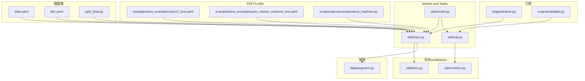
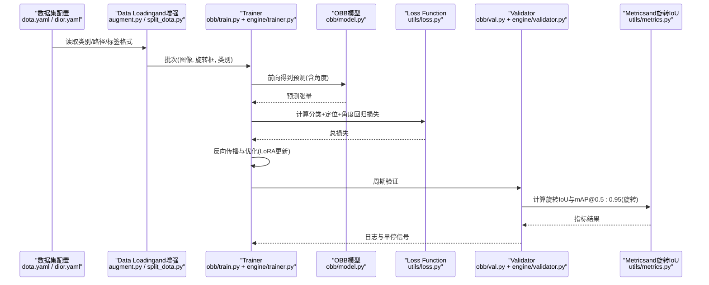
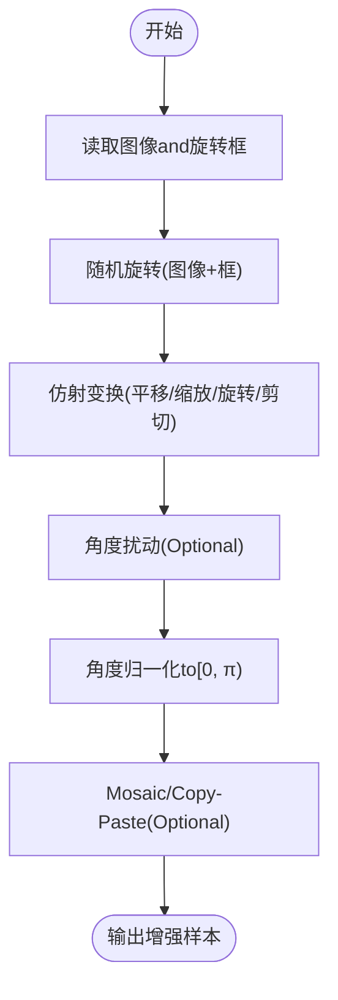
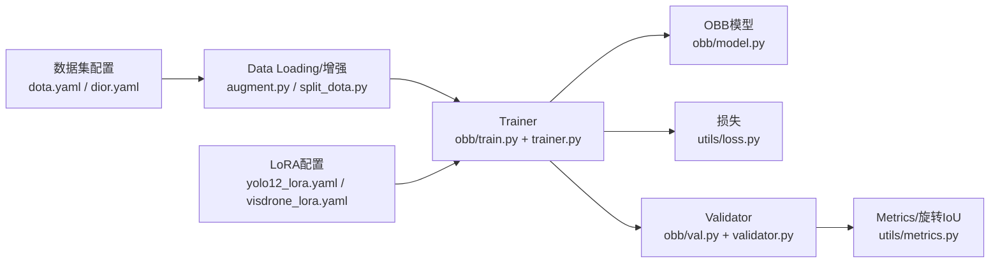

# 旋转边界框检测PEFT配置

<cite>
**Files Referenced in This Document**
- [ultralytics/cfg/datasets/obb/dota.yaml](file://ultralytics/cfg/datasets/obb/dota.yaml)
- [ultralytics/cfg/datasets/obb/dior.yaml](file://ultralytics/cfg/datasets/obb/dior.yaml)
- [ultralytics/data/split_dota.py](file://ultralytics/data/split_dota.py)
- [ultralytics/models/yolo/obb/model.py](file://ultralytics/models/yolo/obb/model.py)
- [ultralytics/models/yolo/obb/train.py](file://ultralytics/models/yolo/obb/train.py)
- [ultralytics/models/yolo/obb/val.py](file://ultralytics/models/yolo/obb/val.py)
- [ultralytics/utils/loss.py](file://ultralytics/utils/loss.py)
- [ultralytics/utils/metrics.py](file://ultralytics/utils/metrics.py)
- [ultralytics/data/augment.py](file://ultralytics/data/augment.py)
- [examples/lora_examples/yolo12_lora.yaml](file://examples/lora_examples/yolo12_lora.yaml)
- [examples/lora_examples/yolo_master_visdrone_lora.yaml](file://examples/lora_examples/yolo_master_visdrone_lora.yaml)
- [scripts/reproduce/reproduce_visdrone.py](file://scripts/reproduce/reproduce_visdrone.py)
- [ultralytics/engine/trainer.py](file://ultralytics/engine/trainer.py)
- [ultralytics/engine/validator.py](file://ultralytics/engine/validator.py)
</cite>

## Table of Contents
1. [Introduction](#Introduction)
2. [Project Structure](#Project Structure)
3. [Core Components](#Core Components)
4. [Architecture Overview](#Architecture Overview)
5. [Detailed Component Analysis](#Detailed Component Analysis)
6. [Dependency Analysis](#Dependency Analysis)
7. [Performance Considerations](#Performance Considerations)
8. [Troubleshooting Guide](#Troubleshooting Guide)
9. [Conclusion](#Conclusion)
10. [Appendix](#Appendix)

## Introduction
本文件targeting旋转边界框（OBB）检测Tasks的Parameter-Efficient Fine-Tuning（PEFT，Centered onLoRAfor主），聚焦Centered on下目标：
- 解释旋转检测and传统水平检测的差异，包括角度表示方法andIoU计算差异。
- 给出DOTAandDIOR数据集的LoRA适配配置要点，涵盖角度回归损失and方向敏感性处理策略。
- provides无人机航拍、遥感图像分析and船舶检测etc.场景的配置Examples。
- 说明旋转检测特殊Data Augmentation技术（随机旋转、仿射变换、角度扰动）。
- 给出旋转检测EvaluationMetrics配置（mAP@0.5:0.95 with rotation）and性能Optimization技巧。

## Project Structure
围绕OBBandPEFT的关键代码and配置分布such as下：
- 数据集配置：datasets/obb/dota.yaml、datasets/obb/dior.yaml
- OBB模型andTraining/Validation：models/yolo/obb/{model,train,val}.py
- 损失andMetrics：utils/loss.py、utils/metrics.py
- Data Augmentation：data/augment.py
- DOTA切分工具：data/split_dota.py
- LoRAExamplesand脚本：examples/lora_examples/*.yaml、scripts/reproduce/reproduce_visdrone.py
- Training/Validation引擎：engine/{trainer,validator}.py

Figure Source
- [ultralytics/cfg/datasets/obb/dota.yaml](file://ultralytics/cfg/datasets/obb/dota.yaml)
- [ultralytics/cfg/datasets/obb/dior.yaml](file://ultralytics/cfg/datasets/obb/dior.yaml)
- [ultralytics/data/split_dota.py](file://ultralytics/data/split_dota.py)
- [ultralytics/models/yolo/obb/model.py](file://ultralytics/models/yolo/obb/model.py)
- [ultralytics/models/yolo/obb/train.py](file://ultralytics/models/yolo/obb/train.py)
- [ultralytics/models/yolo/obb/val.py](file://ultralytics/models/yolo/obb/val.py)
- [ultralytics/utils/loss.py](file://ultralytics/utils/loss.py)
- [ultralytics/utils/metrics.py](file://ultralytics/utils/metrics.py)
- [ultralytics/data/augment.py](file://ultralytics/data/augment.py)
- [examples/lora_examples/yolo12_lora.yaml](file://examples/lora_examples/yolo12_lora.yaml)
- [examples/lora_examples/yolo_master_visdrone_lora.yaml](file://examples/lora_examples/yolo_master_visdrone_lora.yaml)
- [scripts/reproduce/reproduce_visdrone.py](file://scripts/reproduce/reproduce_visdrone.py)
- [ultralytics/engine/trainer.py](file://ultralytics/engine/trainer.py)
- [ultralytics/engine/validator.py](file://ultralytics/engine/validator.py)

Section Source
- [ultralytics/cfg/datasets/obb/dota.yaml](file://ultralytics/cfg/datasets/obb/dota.yaml)
- [ultralytics/cfg/datasets/obb/dior.yaml](file://ultralytics/cfg/datasets/obb/dior.yaml)
- [ultralytics/data/split_dota.py](file://ultralytics/data/split_dota.py)
- [ultralytics/models/yolo/obb/model.py](file://ultralytics/models/yolo/obb/model.py)
- [ultralytics/models/yolo/obb/train.py](file://ultralytics/models/yolo/obb/train.py)
- [ultralytics/models/yolo/obb/val.py](file://ultralytics/models/yolo/obb/val.py)
- [ultralytics/utils/loss.py](file://ultralytics/utils/loss.py)
- [ultralytics/utils/metrics.py](file://ultralytics/utils/metrics.py)
- [ultralytics/data/augment.py](file://ultralytics/data/augment.py)
- [examples/lora_examples/yolo12_lora.yaml](file://examples/lora_examples/yolo12_lora.yaml)
- [examples/lora_examples/yolo_master_visdrone_lora.yaml](file://examples/lora_examples/yolo_master_visdrone_lora.yaml)
- [scripts/reproduce/reproduce_visdrone.py](file://scripts/reproduce/reproduce_visdrone.py)
- [ultralytics/engine/trainer.py](file://ultralytics/engine/trainer.py)
- [ultralytics/engine/validator.py](file://ultralytics/engine/validator.py)

## Core Components
- 数据集配置（DOTA/DIOR）
  - 定义类别数、路径、标签格式andTasks类型（obb）。
  - 用于Training/Validation管线加载旋转标注and构建OBB专用数据流。
- OBB模型andTraining/Validation
  - 模型头输出包含类别置信度、中心点坐标、宽高Centered onand角度。
  - Training阶段组合分类损失、定位损失and角度回归损失；Validation阶段Uses旋转IoU进行NMSandmAP统计。
- 损失andMetrics
  - 损失Modulesprovides角度回归损失（such as平滑L1或周期性角度损失）and定位损失的权重配比。
  - MetricsModulesimplementing旋转IoU计算andmAP@0.5:0.95（旋转）统计。
- Data Augmentation
  - Supporting随机旋转、仿射变换、Mosaic/Copy-Pasteetc.对旋转框友好的增强。
- PEFT/LoRA
  - ViaLoRAAdapter injectionto主干或Detection Head关键层，冻结大部分权重，仅Training少量参数。
  - 针对角度敏感分支可单独设置秩andLearning Rate，提升方向表征capabilities。

Section Source
- [ultralytics/cfg/datasets/obb/dota.yaml](file://ultralytics/cfg/datasets/obb/dota.yaml)
- [ultralytics/cfg/datasets/obb/dior.yaml](file://ultralytics/cfg/datasets/obb/dior.yaml)
- [ultralytics/models/yolo/obb/train.py](file://ultralytics/models/yolo/obb/train.py)
- [ultralytics/models/yolo/obb/val.py](file://ultralytics/models/yolo/obb/val.py)
- [ultralytics/utils/loss.py](file://ultralytics/utils/loss.py)
- [ultralytics/utils/metrics.py](file://ultralytics/utils/metrics.py)
- [ultralytics/data/augment.py](file://ultralytics/data/augment.py)
- [examples/lora_examples/yolo12_lora.yaml](file://examples/lora_examples/yolo12_lora.yaml)
- [examples/lora_examples/yolo_master_visdrone_lora.yaml](file://examples/lora_examples/yolo_master_visdrone_lora.yaml)

## Architecture Overview
下图展示从Data Loading、增强、TrainingtoValidationandEvaluation的整体流程，并标注旋转检测特有的环节（角度回归、旋转IoU）。

Figure Source
- [ultralytics/cfg/datasets/obb/dota.yaml](file://ultralytics/cfg/datasets/obb/dota.yaml)
- [ultralytics/cfg/datasets/obb/dior.yaml](file://ultralytics/cfg/datasets/obb/dior.yaml)
- [ultralytics/data/augment.py](file://ultralytics/data/augment.py)
- [ultralytics/data/split_dota.py](file://ultralytics/data/split_dota.py)
- [ultralytics/models/yolo/obb/train.py](file://ultralytics/models/yolo/obb/train.py)
- [ultralytics/models/yolo/obb/val.py](file://ultralytics/models/yolo/obb/val.py)
- [ultralytics/utils/loss.py](file://ultralytics/utils/loss.py)
- [ultralytics/utils/metrics.py](file://ultralytics/utils/metrics.py)
- [ultralytics/engine/trainer.py](file://ultralytics/engine/trainer.py)
- [ultralytics/engine/validator.py](file://ultralytics/engine/validator.py)

## Detailed Component Analysis

### 旋转检测 vs 水平检测
- 标注and表示
  - 水平框：通常用(x_min, y_min, x_max, y_max)或中心点+宽高。
  - 旋转框：常用“中心点+宽高+角度”表示，角度定义需and数据集一致（见下节）。
- IoU计算
  - 水平IoU基于矩形交集面积。
  - 旋转IoU基于多边形交集，计算复杂度更高且对角度误差更敏感。
- 损失设计
  - 水平检测仅需定位and分类损失。
  - 旋转检测需额外角度回归损失，并对角度周期性进行处理（避免0°/360°跳变）。
- Evaluation
  - mAP@0.5:0.95需基于旋转IoU阈值集合统计。

Section Source
- [ultralytics/utils/metrics.py](file://ultralytics/utils/metrics.py)
- [ultralytics/utils/loss.py](file://ultralytics/utils/loss.py)
- [ultralytics/models/yolo/obb/val.py](file://ultralytics/models/yolo/obb/val.py)

### 角度表示方法and约定
- 常见约定
  - 中心角：Centered on图像中心forRefer to的绝对角度。
  - 左上角角：Centered on左上角顶点for基准的角度。
  - 顺时针角：角度正方向for顺时针。
- 数据集差异
  - DOTA：采用“中心点+宽高+角度”，角度范围通常for[0, π)，顺时针for正。
  - DIOR-R：同样for旋转框，但需注意其角度定义是否andDOTA一致。
- 工程建议
  - whileData Loadingand增强中统一角度归一化to[0, π)。
  - 角度回归损失Recommended to use周期性损失或wrap-around处理，避免0°/π附近Gradient不稳定。

Section Source
- [ultralytics/cfg/datasets/obb/dota.yaml](file://ultralytics/cfg/datasets/obb/dota.yaml)
- [ultralytics/cfg/datasets/obb/dior.yaml](file://ultralytics/cfg/datasets/obb/dior.yaml)
- [ultralytics/data/augment.py](file://ultralytics/data/augment.py)

### IoU计算方式（旋转）
- 旋转IoU基于多边形求交，需要稳定地处理退化情况（such as极小框、共线边）。
- 阈值扫描：mAP@0.5:0.95需while多个IoU阈值上累计精度-召回曲线。
- 数值稳定性：建议对角度做模运算and裁剪，避免浮点误差导致的非法多边形。

Section Source
- [ultralytics/utils/metrics.py](file://ultralytics/utils/metrics.py)
- [ultralytics/models/yolo/obb/val.py](file://ultralytics/models/yolo/obb/val.py)

### DOTA数据集的LoRA适配配置要点
- Data Preparation
  - UsesDOTA官方格式，确保角度范围for[0, π)且顺时针for正。
  - 若原始图像过大，can use切分脚本生成瓦片，保持旋转框相对坐标一致性。
- Models and Tasks
  - 选择OBBTasks头，输出包含角度通道。
- 损失and权重
  - 适当提高角度回归损失权重，保证方向敏感性。
- LoRA策略
  - 主干网络Low-Rank Adaptation（较小rank），Detection Head（尤其是角度分支）可独立设置较高rankandLearning Rate。
  - 冻结BN/统计量或UsesEMA稳定Training。
- 增强
  - 启用随机旋转、仿射变换、Mosaic/Copy-Paste，注意角度while增强后仍需归一化。
- Evaluation
  - Uses旋转IoU计算mAP@0.5:0.95。

Section Source
- [ultralytics/cfg/datasets/obb/dota.yaml](file://ultralytics/cfg/datasets/obb/dota.yaml)
- [ultralytics/data/split_dota.py](file://ultralytics/data/split_dota.py)
- [ultralytics/models/yolo/obb/train.py](file://ultralytics/models/yolo/obb/train.py)
- [ultralytics/utils/loss.py](file://ultralytics/utils/loss.py)
- [ultralytics/utils/metrics.py](file://ultralytics/utils/metrics.py)
- [ultralytics/data/augment.py](file://ultralytics/data/augment.py)
- [examples/lora_examples/yolo12_lora.yaml](file://examples/lora_examples/yolo12_lora.yaml)

### DIOR数据集的LoRA适配配置要点
- Data Preparation
  - 确认DIOR-R的标注格式and角度定义，必要时做角度映射to[0, π)。
- Models and Tasks
  - andDOTA一致的OBBTasks头and损失配置。
- LoRA策略
  - 若DIOR规模较小，可提高LoRA rank或增加正则化强度，防止过拟合。
- 增强
  - 针对遥感场景，适度控制仿射幅度，避免破坏尺度and纹理特征。
- Evaluation
  - 同样Uses旋转IoUandmAP@0.5:0.95。

Section Source
- [ultralytics/cfg/datasets/obb/dior.yaml](file://ultralytics/cfg/datasets/obb/dior.yaml)
- [ultralytics/models/yolo/obb/train.py](file://ultralytics/models/yolo/obb/train.py)
- [ultralytics/utils/loss.py](file://ultralytics/utils/loss.py)
- [ultralytics/utils/metrics.py](file://ultralytics/utils/metrics.py)
- [ultralytics/data/augment.py](file://ultralytics/data/augment.py)
- [examples/lora_examples/yolo12_lora.yaml](file://examples/lora_examples/yolo12_lora.yaml)

### 实际应用场景配置Examples
- 无人机航拍图像检测
  - 特点：目标密集、尺度变化大、视角倾斜明显。
  - 建议：增大随机旋转and仿射幅度；对角度分支LoRAUses中etc.rank；加强Mosaic/Copy-Paste。
- 遥感图像分析
  - 特点：背景复杂、类间相似度高、长尾分布。
  - 建议：引入类别平衡策略；角度损失权重略高；UsesEMA稳定Training。
- 船舶检测
  - 特点：细长目标、方向性强、水面背景干扰。
  - 建议：提高角度回归权重；限制仿射中的剪切幅度；Uses高分辨率输入and切片Inference。

Section Source
- [ultralytics/models/yolo/obb/train.py](file://ultralytics/models/yolo/obb/train.py)
- [ultralytics/utils/loss.py](file://ultralytics/utils/loss.py)
- [ultralytics/data/augment.py](file://ultralytics/data/augment.py)
- [examples/lora_examples/yolo_master_visdrone_lora.yaml](file://examples/lora_examples/yolo_master_visdrone_lora.yaml)

### 旋转检测的特殊Data Augmentation
- 随机旋转
  - while[0, 2π)范围内随机旋转图像and对应旋转框，Training后需将角度归一化to[0, π)。
- 仿射变换
  - 平移、缩放、旋转、剪切组合，注意保持旋转框几何一致性。
- 角度扰动
  - while标签层面添加微小角度噪声，提升角度回归鲁棒性。
- 其他
  - Mosaic/Copy-Paste有助于缓解小目标漏检and背景混淆。

Figure Source
- [ultralytics/data/augment.py](file://ultralytics/data/augment.py)

Section Source
- [ultralytics/data/augment.py](file://ultralytics/data/augment.py)

### EvaluationMetrics配置（mAP@0.5:0.95 with rotation）
- Metrics定义
  - 基于旋转IoUwhile不同阈值（0.5至0.95步进）上计算AP并平均。
- 配置要点
  - 确保Validation阶段Uses旋转IoU而非水平IoU。
  - Set appropriatelyNMS阈值andConfidence Threshold，避免过度抑制。
- 报告
  - 记录总体mAP、各IoU阈值下的AP、各类别APandPR曲线。

Section Source
- [ultralytics/utils/metrics.py](file://ultralytics/utils/metrics.py)
- [ultralytics/models/yolo/obb/val.py](file://ultralytics/models/yolo/obb/val.py)

### 性能Optimization技巧
- Training稳定性
  - UsesEMA平滑权重；对角度分支采用稍高的Learning Rateand正则化。
  - Mixture精度Training（AMP）加速，注意数值稳定性。
- 数据侧
  - 预切分大图（such asDOTA瓦片）减少I/Oand内存峰值。
  - 缓存预处理结果，避免重复计算。
- 模型侧
  - LoRA rank按层差异化设置；角度分支可更大rank。
  - 冻结非关键层，降低显存占用andTraining时间。
- Inference侧
  - 切片Inference（SAHI）Combining旋转NMS，提升小目标召回。
  - ExportONNX/TensorRT时固定输入尺寸，利用批处理。

Section Source
- [ultralytics/models/yolo/obb/train.py](file://ultralytics/models/yolo/obb/train.py)
- [ultralytics/utils/loss.py](file://ultralytics/utils/loss.py)
- [ultralytics/data/split_dota.py](file://ultralytics/data/split_dota.py)
- [examples/lora_examples/yolo12_lora.yaml](file://examples/lora_examples/yolo12_lora.yaml)

## Dependency Analysis
- 组件耦合
  - Trainer依赖OBB模型、损失and增强；Validator依赖Metricsand旋转IoU。
  - LoRA配置ViaTrainer注入to模型特定层。
- External Dependencies
  - 数据集配置文件drivers are installedData Loading；切分脚本辅助大规模Data processing。
- Potential Cycles
  - 当前结构分层清晰，未见直接循环依赖。

Figure Source
- [ultralytics/cfg/datasets/obb/dota.yaml](file://ultralytics/cfg/datasets/obb/dota.yaml)
- [ultralytics/cfg/datasets/obb/dior.yaml](file://ultralytics/cfg/datasets/obb/dior.yaml)
- [ultralytics/data/augment.py](file://ultralytics/data/augment.py)
- [ultralytics/data/split_dota.py](file://ultralytics/data/split_dota.py)
- [ultralytics/models/yolo/obb/train.py](file://ultralytics/models/yolo/obb/train.py)
- [ultralytics/models/yolo/obb/val.py](file://ultralytics/models/yolo/obb/val.py)
- [ultralytics/utils/loss.py](file://ultralytics/utils/loss.py)
- [ultralytics/utils/metrics.py](file://ultralytics/utils/metrics.py)
- [examples/lora_examples/yolo12_lora.yaml](file://examples/lora_examples/yolo12_lora.yaml)
- [examples/lora_examples/yolo_master_visdrone_lora.yaml](file://examples/lora_examples/yolo_master_visdrone_lora.yaml)
- [ultralytics/engine/trainer.py](file://ultralytics/engine/trainer.py)
- [ultralytics/engine/validator.py](file://ultralytics/engine/validator.py)

Section Source
- [ultralytics/models/yolo/obb/train.py](file://ultralytics/models/yolo/obb/train.py)
- [ultralytics/models/yolo/obb/val.py](file://ultralytics/models/yolo/obb/val.py)
- [ultralytics/utils/loss.py](file://ultralytics/utils/loss.py)
- [ultralytics/utils/metrics.py](file://ultralytics/utils/metrics.py)
- [ultralytics/data/augment.py](file://ultralytics/data/augment.py)
- [ultralytics/data/split_dota.py](file://ultralytics/data/split_dota.py)
- [examples/lora_examples/yolo12_lora.yaml](file://examples/lora_examples/yolo12_lora.yaml)
- [examples/lora_examples/yolo_master_visdrone_lora.yaml](file://examples/lora_examples/yolo_master_visdrone_lora.yaml)
- [ultralytics/engine/trainer.py](file://ultralytics/engine/trainer.py)
- [ultralytics/engine/validator.py](file://ultralytics/engine/validator.py)

## Performance Considerations
- Training效率
  - UsesAMPand多进程Data Loading；对大图先切分再Training。
  - LoRA冻结主干，仅TrainingAdapter，显著降低显存and时间成本。
- 收敛稳定性
  - 角度损失权重andLearning Rate需调优；UsesEMAandGradient裁剪。
- Inference速度
  - ExportOptimization格式（ONNX/TensorRT）；固定输入尺寸；Batch Inference。
- 资源受限部署
  - 量化and剪枝CombiningLoRA；边缘设备优先选择较小rankand精简增强。

[This section provides general guidance and does not directly analyze specific files]

## Troubleshooting Guide
- 角度异常
  - 现象：角度接近0°/π时损失震荡或Prediction翻转。
  - 排查：检查角度归一化and周期性损失；确认数据集角度定义。
- 旋转IoU不稳定
  - 现象：Validation阶段mAP波动大。
  - 排查：检查多边形求交的数值稳定性；调整NMS阈值andConfidence Threshold。
- LoRA未生效
  - 现象：Training集Metrics无提升。
  - 排查：确认LoRA目标层是否被正确注入；检查Learning Rateandrank设置。
- Data Augmentation导致标注错乱
  - 现象：Training初期损失异常升高。
  - 排查：Validation增强后旋转框and角度的一致性；确保角度归一化。

Section Source
- [ultralytics/utils/loss.py](file://ultralytics/utils/loss.py)
- [ultralytics/utils/metrics.py](file://ultralytics/utils/metrics.py)
- [ultralytics/data/augment.py](file://ultralytics/data/augment.py)
- [examples/lora_examples/yolo12_lora.yaml](file://examples/lora_examples/yolo12_lora.yaml)

## Conclusion
- 旋转检测的核心while于角度表示、角度回归损失and旋转IoU的协同设计。
- 针对DOTAandDIOR，应Strictly follow各自角度约定并进行归一化处理。
- LoRA适配建议对角度分支给予更高容量andLearning Rate，Combined with稳定的Training策略and合适的增强。
- while无人机航拍、遥感and船舶检测etc.场景中，可Via场景化增强and损失权重调优获得更好效果。
- Evaluation务必Uses旋转IoUandmAP@0.5:0.95，确保Metrics可比性and可靠性。

[This section is summary content and does not directly analyze specific files]

## Appendix
- 快速上手清单
  - 准备数据集配置（DOTA/DIOR）。
  - 选择OBBTasksandLoRA配置。
  - 启用随机旋转、仿射and角度扰动。
  - Training并监控角度损失andmAP@0.5:0.95（旋转）。
  - Exportand部署，必要时进行切片Inference。

Section Source
- [ultralytics/cfg/datasets/obb/dota.yaml](file://ultralytics/cfg/datasets/obb/dota.yaml)
- [ultralytics/cfg/datasets/obb/dior.yaml](file://ultralytics/cfg/datasets/obb/dior.yaml)
- [examples/lora_examples/yolo12_lora.yaml](file://examples/lora_examples/yolo12_lora.yaml)
- [examples/lora_examples/yolo_master_visdrone_lora.yaml](file://examples/lora_examples/yolo_master_visdrone_lora.yaml)
- [scripts/reproduce/reproduce_visdrone.py](file://scripts/reproduce/reproduce_visdrone.py)