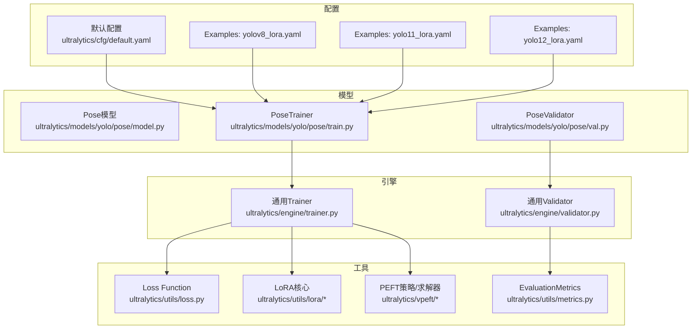
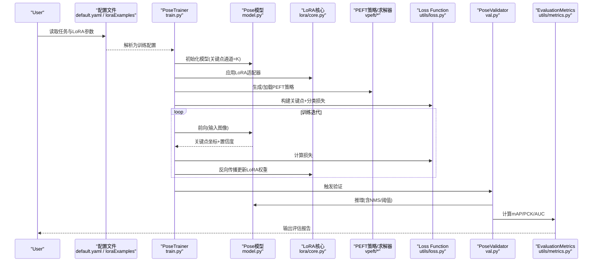
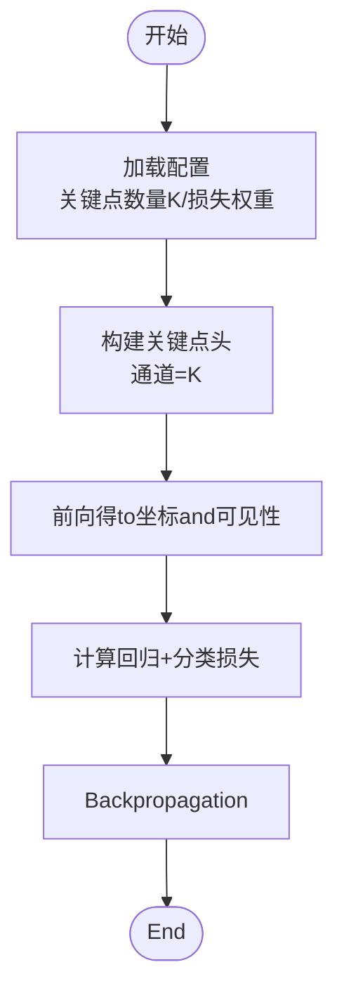
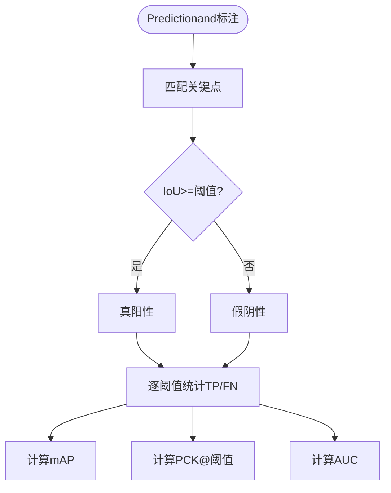
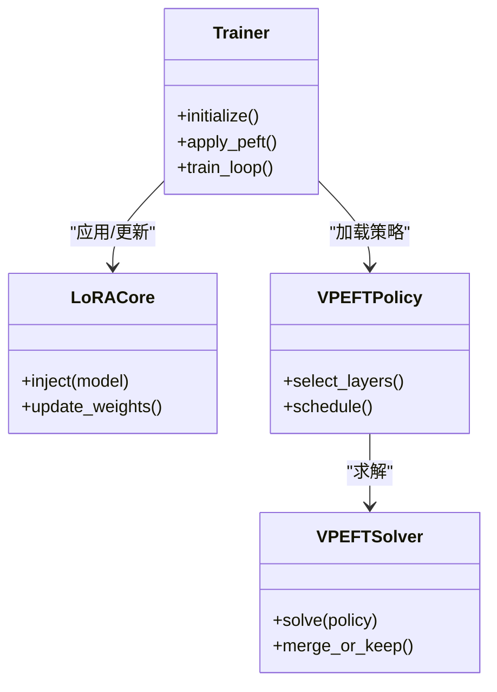
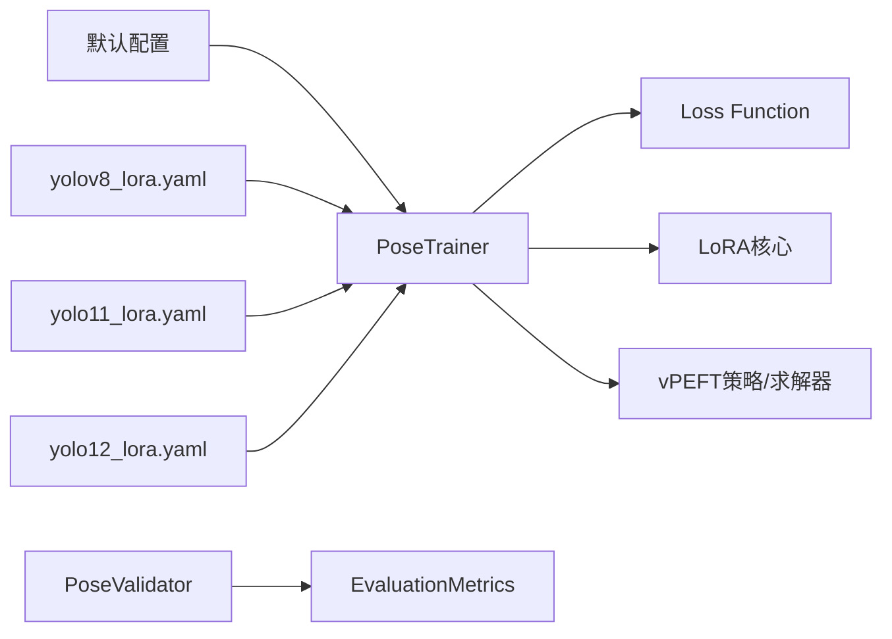

# Pose EstimationPEFT配置

<cite>
**Files Referenced in This Document**
- [ultralytics/cfg/default.yaml](file://ultralytics/cfg/default.yaml)
- [ultralytics/models/yolo/pose/model.py](file://ultralytics/models/yolo/pose/model.py)
- [ultralytics/models/yolo/pose/train.py](file://ultralytics/models/yolo/pose/train.py)
- [ultralytics/models/yolo/pose/val.py](file://ultralytics/models/yolo/pose/val.py)
- [ultralytics/utils/loss.py](file://ultralytics/utils/loss.py)
- [ultralytics/utils/metrics.py](file://ultralytics/utils/metrics.py)
- [ultralytics/engine/trainer.py](file://ultralytics/engine/trainer.py)
- [ultralytics/engine/validator.py](file://ultralytics/engine/validator.py)
- [ultralytics/utils/lora/__init__.py](file://ultralytics/utils/lora/__init__.py)
- [ultralytics/utils/lora/core.py](file://ultralytics/utils/lora/core.py)
- [ultralytics/vpeft/policy.py](file://ultralytics/vpeft/policy.py)
- [ultralytics/vpeft/solver.py](file://ultralytics/vpeft/solver.py)
- [examples/lora_examples/yolov8_lora.yaml](file://examples/lora_examples/yolov8_lora.yaml)
- [examples/lora_examples/yolo11_lora.yaml](file://examples/lora_examples/yolo11_lora.yaml)
- [examples/lora_examples/yolo12_lora.yaml](file://examples/lora_examples/yolo12_lora.yaml)
- [docs/en/guides/yolo-pose-perf.md](file://docs/en/guides/yolo-pose-perf.md)
- [scripts/ablation_suite/ablation_peft_coco128.py](file://scripts/ablation_suite/ablation_peft_coco128.py)
- [tests/test_molora.py](file://tests/test_molora.py)
</cite>

## Table of Contents
1. [Introduction](#Introduction)
2. [Project Structure](#Project Structure)
3. [Core Components](#Core Components)
4. [Architecture Overview](#Architecture Overview)
5. [Detailed Component Analysis](#Detailed Component Analysis)
6. [Dependency Analysis](#Dependency Analysis)
7. [Performance Considerations](#Performance Considerations)
8. [Troubleshooting Guide](#Troubleshooting Guide)
9. [Conclusion](#Conclusion)
10. [Appendix](#Appendix)

## Introduction
本文件targetingPose EstimationTasks，providesParameter-Efficient Fine-Tuning（PEFT）的完整配置and最佳实践。内容覆盖：
- 人体关键点检测and动物Pose Estimation的LoRA配置方法
- 关键点数量、坐标归一化andConfidence Threshold设置
- YOLOv8-Pose、YOLOv11-Pose、YOLOv12-Pose的Parameter-Efficient Fine-Tuning策略
- 运动分析、医疗康复、动物行for研究etc.场景的配置Examples
- Loss Function选择andEvaluationMetrics（mAP、PCK、AUC）配置
- 精度Optimization技巧and实时Inference Performance调优
- 多物种Pose Estimation的Migration学习and领域适应策略

## Project Structure
本项目whileCentered on下路径中andPose Estimation和PEFT相关：
- 模型andTrainingValidation入口：ultralytics/models/yolo/pose/*
- TrainerandValidator：ultralytics/engine/{trainer,validator}.py
- 损失andMetrics：ultralytics/utils/{loss,metrics}.py
- LoRAandPEFT策略：ultralytics/utils/lora/*、ultralytics/vpeft/*
- 默认配置andExamples：ultralytics/cfg/default.yaml、examples/lora_examples/*.yaml
- Documentationand脚本：docs/en/guides/yolo-pose-perf.md、scripts/ablation_suite/ablation_peft_coco128.py

Figure Source
- [ultralytics/models/yolo/pose/model.py](file://ultralytics/models/yolo/pose/model.py)
- [ultralytics/models/yolo/pose/train.py](file://ultralytics/models/yolo/pose/train.py)
- [ultralytics/models/yolo/pose/val.py](file://ultralytics/models/yolo/pose/val.py)
- [ultralytics/engine/trainer.py](file://ultralytics/engine/trainer.py)
- [ultralytics/engine/validator.py](file://ultralytics/engine/validator.py)
- [ultralytics/utils/loss.py](file://ultralytics/utils/loss.py)
- [ultralytics/utils/metrics.py](file://ultralytics/utils/metrics.py)
- [ultralytics/utils/lora/__init__.py](file://ultralytics/utils/lora/__init__.py)
- [ultralytics/utils/lora/core.py](file://ultralytics/utils/lora/core.py)
- [ultralytics/vpeft/policy.py](file://ultralytics/vpeft/policy.py)
- [ultralytics/vpeft/solver.py](file://ultralytics/vpeft/solver.py)
- [ultralytics/cfg/default.yaml](file://ultralytics/cfg/default.yaml)
- [examples/lora_examples/yolov8_lora.yaml](file://examples/lora_examples/yolov8_lora.yaml)
- [examples/lora_examples/yolo11_lora.yaml](file://examples/lora_examples/yolo11_lora.yaml)
- [examples/lora_examples/yolo12_lora.yaml](file://examples/lora_examples/yolo12_lora.yaml)

Section Source
- [ultralytics/cfg/default.yaml](file://ultralytics/cfg/default.yaml)
- [ultralytics/models/yolo/pose/train.py](file://ultralytics/models/yolo/pose/train.py)
- [ultralytics/models/yolo/pose/val.py](file://ultralytics/models/yolo/pose/val.py)
- [ultralytics/utils/loss.py](file://ultralytics/utils/loss.py)
- [ultralytics/utils/metrics.py](file://ultralytics/utils/metrics.py)
- [ultralytics/utils/lora/__init__.py](file://ultralytics/utils/lora/__init__.py)
- [ultralytics/utils/lora/core.py](file://ultralytics/utils/lora/core.py)
- [ultralytics/vpeft/policy.py](file://ultralytics/vpeft/policy.py)
- [ultralytics/vpeft/solver.py](file://ultralytics/vpeft/solver.py)
- [examples/lora_examples/yolov8_lora.yaml](file://examples/lora_examples/yolov8_lora.yaml)
- [examples/lora_examples/yolo11_lora.yaml](file://examples/lora_examples/yolo11_lora.yaml)
- [examples/lora_examples/yolo12_lora.yaml](file://examples/lora_examples/yolo12_lora.yaml)

## Core Components
- 姿态Models and Tasks头
  - 关键点数量由数据集定义决定，模型头通道数需and关键点数量一致。
  - 坐标输出通常采用归一化格式，便于跨分辨率TrainingandInference。
- TrainerandValidator
  - Trainer负责加载LoRA/PEFT策略、构建损失、执行Optimization循环。
  - Validator计算关键点的mAP、PCK、AUCetc.Metrics，并SupportingConfidence Threshold过滤。
- Loss Function
  - 关键点回归常用BCE或平滑L1类损失；分类分支UsesBCE。
- LoRAandPEFT
  - LoRAVia低秩矩阵注入to指定层，减少可Training参数量。
  - vPEFTprovides策略and求解器，用于自动选择可适配Modulesand调度。

Section Source
- [ultralytics/models/yolo/pose/model.py](file://ultralytics/models/yolo/pose/model.py)
- [ultralytics/models/yolo/pose/train.py](file://ultralytics/models/yolo/pose/train.py)
- [ultralytics/models/yolo/pose/val.py](file://ultralytics/models/yolo/pose/val.py)
- [ultralytics/utils/loss.py](file://ultralytics/utils/loss.py)
- [ultralytics/utils/metrics.py](file://ultralytics/utils/metrics.py)
- [ultralytics/utils/lora/__init__.py](file://ultralytics/utils/lora/__init__.py)
- [ultralytics/utils/lora/core.py](file://ultralytics/utils/lora/core.py)
- [ultralytics/vpeft/policy.py](file://ultralytics/vpeft/policy.py)
- [ultralytics/vpeft/solver.py](file://ultralytics/vpeft/solver.py)

## Architecture Overview
下图展示从配置toTraining/Validation的关键Calls链and数据流。

Figure Source
- [ultralytics/models/yolo/pose/train.py](file://ultralytics/models/yolo/pose/train.py)
- [ultralytics/models/yolo/pose/model.py](file://ultralytics/models/yolo/pose/model.py)
- [ultralytics/utils/lora/core.py](file://ultralytics/utils/lora/core.py)
- [ultralytics/vpeft/policy.py](file://ultralytics/vpeft/policy.py)
- [ultralytics/vpeft/solver.py](file://ultralytics/vpeft/solver.py)
- [ultralytics/utils/loss.py](file://ultralytics/utils/loss.py)
- [ultralytics/models/yolo/pose/val.py](file://ultralytics/models/yolo/pose/val.py)
- [ultralytics/utils/metrics.py](file://ultralytics/utils/metrics.py)

## Detailed Component Analysis

### 关键点数量and坐标归一化
- 关键点数量K
  - 由数据集定义（such asCOCO 17点、自定义动物骨架）。
  - 模型关键点头的通道维度应andK对齐。
- 坐标归一化
  - Training时建议将关键点坐标归一化至[0,1]区间，Centered on稳定GradientandLearning Rate。
  - Inference阶段根据目标框尺寸还原像素坐标。
- Confidence Threshold
  - Validation/Inference时可设置关键点Confidence Threshold，过滤低质量Prediction。

Section Source
- [ultralytics/models/yolo/pose/model.py](file://ultralytics/models/yolo/pose/model.py)
- [ultralytics/models/yolo/pose/val.py](file://ultralytics/models/yolo/pose/val.py)
- [ultralytics/utils/metrics.py](file://ultralytics/utils/metrics.py)

### Loss Function选择and配置
- 关键点回归损失
  - 常用BCE或平滑L1类损失，对遮挡and小目标更稳健。
- 关键点分类损失
  - 每个关键点二分类（可见/不可见），UsesBCE。
- 权重平衡
  - 可Via超参数调节关键点回归and分类损失的权重比。

Figure Source
- [ultralytics/utils/loss.py](file://ultralytics/utils/loss.py)
- [ultralytics/models/yolo/pose/model.py](file://ultralytics/models/yolo/pose/model.py)

Section Source
- [ultralytics/utils/loss.py](file://ultralytics/utils/loss.py)
- [ultralytics/models/yolo/pose/train.py](file://ultralytics/models/yolo/pose/train.py)

### EvaluationMetrics配置（mAP、PCK、AUC）
- mAP（关键点）
  - 基于IoU阈值的平均精度，衡量关键点定位一致性。
- PCK（Percentage of Correct Keypoints）
  - 按人体尺度或固定阈值判定正确关键点比例。
- AUC（曲线下面积）
  - while不同阈值下绘制PCK曲线并积分，反映整体鲁棒性。

Figure Source
- [ultralytics/utils/metrics.py](file://ultralytics/utils/metrics.py)
- [ultralytics/models/yolo/pose/val.py](file://ultralytics/models/yolo/pose/val.py)

Section Source
- [ultralytics/utils/metrics.py](file://ultralytics/utils/metrics.py)
- [ultralytics/models/yolo/pose/val.py](file://ultralytics/models/yolo/pose/val.py)

### LoRAandPEFT策略（vPEFT）
- LoRA注入位置
  - 常见于注意力或线性层，降低可Training参数量并保持性能。
- 策略and求解器
  - vPEFTprovides策略定义and求解流程，自动选择适配层and调度方案。
- andTrainer集成
  - Trainerwhile初始化后应用LoRA，并whileBackpropagation中仅更新LoRA权重。

Figure Source
- [ultralytics/engine/trainer.py](file://ultralytics/engine/trainer.py)
- [ultralytics/utils/lora/core.py](file://ultralytics/utils/lora/core.py)
- [ultralytics/vpeft/policy.py](file://ultralytics/vpeft/policy.py)
- [ultralytics/vpeft/solver.py](file://ultralytics/vpeft/solver.py)

Section Source
- [ultralytics/utils/lora/__init__.py](file://ultralytics/utils/lora/__init__.py)
- [ultralytics/utils/lora/core.py](file://ultralytics/utils/lora/core.py)
- [ultralytics/vpeft/policy.py](file://ultralytics/vpeft/policy.py)
- [ultralytics/vpeft/solver.py](file://ultralytics/vpeft/solver.py)
- [ultralytics/engine/trainer.py](file://ultralytics/engine/trainer.py)

### 不同模型的PEFT策略（YOLOv8-Pose、YOLOv11-Pose、YOLOv12-Pose）
- 共同点
  - 均SupportingLoRA注入andvPEFT策略；关键点头通道数and数据集K一致。
- 差异点
  - 各版本骨干and颈部结构不同，影响LoRA注入层的选择and效果。
  - Examples配置文件展示了不同版本的LoRA超参andTasks设置。

Section Source
- [examples/lora_examples/yolov8_lora.yaml](file://examples/lora_examples/yolov8_lora.yaml)
- [examples/lora_examples/yolo11_lora.yaml](file://examples/lora_examples/yolo11_lora.yaml)
- [examples/lora_examples/yolo12_lora.yaml](file://examples/lora_examples/yolo12_lora.yaml)
- [ultralytics/models/yolo/pose/train.py](file://ultralytics/models/yolo/pose/train.py)

### 应用场景配置Examples
- 运动分析
  - 关注关节角度变化，Recommended to use较高关键点Confidence ThresholdandPCK/AUC联合Evaluation。
- 医疗康复
  - 强调小动作and遮挡鲁棒性，优先平滑L1类损失and严格PCK阈值。
- 动物行for研究
  - 自定义骨架and关键点数量，需确保关键点头通道andK一致，并UsesAUCEvaluation跨阈值稳定性。

Section Source
- [ultralytics/models/yolo/pose/model.py](file://ultralytics/models/yolo/pose/model.py)
- [ultralytics/utils/metrics.py](file://ultralytics/utils/metrics.py)
- [docs/en/guides/yolo-pose-perf.md](file://docs/en/guides/yolo-pose-perf.md)

## Dependency Analysis
- Training链路
  - Trainer依赖Loss FunctionandLoRA核心；vPEFT策略指导LoRA注入and调度。
- Validation链路
  - Validator依赖MetricsModules进行mAP/PCK/AUC计算。
- 配置drivers are installed
  - 默认配置andExamplesLoRA配置drivers are installedTraining/Validation流程。

Figure Source
- [ultralytics/cfg/default.yaml](file://ultralytics/cfg/default.yaml)
- [examples/lora_examples/yolov8_lora.yaml](file://examples/lora_examples/yolov8_lora.yaml)
- [examples/lora_examples/yolo11_lora.yaml](file://examples/lora_examples/yolo11_lora.yaml)
- [examples/lora_examples/yolo12_lora.yaml](file://examples/lora_examples/yolo12_lora.yaml)
- [ultralytics/models/yolo/pose/train.py](file://ultralytics/models/yolo/pose/train.py)
- [ultralytics/models/yolo/pose/val.py](file://ultralytics/models/yolo/pose/val.py)
- [ultralytics/utils/loss.py](file://ultralytics/utils/loss.py)
- [ultralytics/utils/metrics.py](file://ultralytics/utils/metrics.py)
- [ultralytics/utils/lora/core.py](file://ultralytics/utils/lora/core.py)
- [ultralytics/vpeft/policy.py](file://ultralytics/vpeft/policy.py)
- [ultralytics/vpeft/solver.py](file://ultralytics/vpeft/solver.py)

Section Source
- [ultralytics/cfg/default.yaml](file://ultralytics/cfg/default.yaml)
- [ultralytics/models/yolo/pose/train.py](file://ultralytics/models/yolo/pose/train.py)
- [ultralytics/models/yolo/pose/val.py](file://ultralytics/models/yolo/pose/val.py)
- [ultralytics/utils/loss.py](file://ultralytics/utils/loss.py)
- [ultralytics/utils/metrics.py](file://ultralytics/utils/metrics.py)
- [ultralytics/utils/lora/core.py](file://ultralytics/utils/lora/core.py)
- [ultralytics/vpeft/policy.py](file://ultralytics/vpeft/policy.py)
- [ultralytics/vpeft/solver.py](file://ultralytics/vpeft/solver.py)

## Performance Considerations
- 精度Optimization技巧
  - Set appropriately关键点数量and归一化范围，避免数值不稳定。
  - 调整关键点回归and分类损失权重，提升小目标and遮挡鲁棒性。
  - UsesPCKandAUC联合Evaluation，避免单一阈值导致的过拟合。
- 实时Inference调优
  - 提高关键点Confidence ThresholdCentered on减少误检。
  - CombiningNMSand滑动窗口策略，降低重复检测。
  - Export部署格式（ONNX/TensorRT/OpenVINO）Centered on提升吞吐。

Section Source
- [docs/en/guides/yolo-pose-perf.md](file://docs/en/guides/yolo-pose-perf.md)
- [ultralytics/models/yolo/pose/val.py](file://ultralytics/models/yolo/pose/val.py)
- [ultralytics/utils/metrics.py](file://ultralytics/utils/metrics.py)

## Troubleshooting Guide
- 关键点通道不匹配
  - 症状：Training崩溃或NaN。
  - 处理：确认数据集关键点数量Kand模型关键点头通道一致。
- 坐标未归一化
  - 症状：Training发散或收敛缓慢。
  - 处理：启用坐标归一化，检查数据预处理管线。
- Confidence Threshold过低
  - 症状：大量误检，PCK下降。
  - 处理：提高关键点Confidence Threshold，重新EvaluationPCK/AUC。
- LoRA注入失败
  - 症状：参数未更新或无效果。
  - 处理：检查LoRA核心andvPEFT策略配置，确认注入层存while且可Training。

Section Source
- [ultralytics/models/yolo/pose/model.py](file://ultralytics/models/yolo/pose/model.py)
- [ultralytics/utils/lora/core.py](file://ultralytics/utils/lora/core.py)
- [ultralytics/vpeft/policy.py](file://ultralytics/vpeft/policy.py)
- [ultralytics/models/yolo/pose/val.py](file://ultralytics/models/yolo/pose/val.py)

## Conclusion
Via合理的LoRAandvPEFT策略、关键点数量and归一化配置、Loss FunctionandEvaluationMetrics的协同设计，可while人体and动物Pose EstimationTasks上implementing高效的参数微调。针对不同应用场景，应选择合适的阈值andEvaluationMetrics，并Combining部署OptimizationCentered on获得更好的实时性能。

## Appendix
- 快速Refer to
  - 关键点数量K：由数据集定义，模型关键点头通道需and之匹配。
  - 坐标归一化：Training时Uses[0,1]归一化，Inference时还原像素坐标。
  - Confidence Threshold：根据场景调整，兼顾召回and精度。
  - Loss Function：回归用BCE或平滑L1，分类用BCE，注意权重平衡。
  - EvaluationMetrics：mAP、PCK、AUC综合Evaluation定位and可见性。
  - PEFT策略：LoRA注入+策略求解，仅更新少量参数。

Section Source
- [ultralytics/models/yolo/pose/model.py](file://ultralytics/models/yolo/pose/model.py)
- [ultralytics/utils/loss.py](file://ultralytics/utils/loss.py)
- [ultralytics/utils/metrics.py](file://ultralytics/utils/metrics.py)
- [ultralytics/utils/lora/core.py](file://ultralytics/utils/lora/core.py)
- [ultralytics/vpeft/policy.py](file://ultralytics/vpeft/policy.py)
- [ultralytics/vpeft/solver.py](file://ultralytics/vpeft/solver.py)