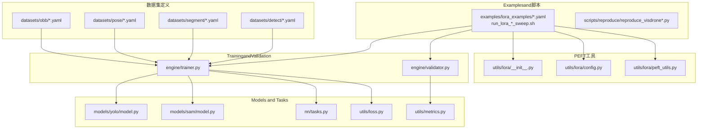
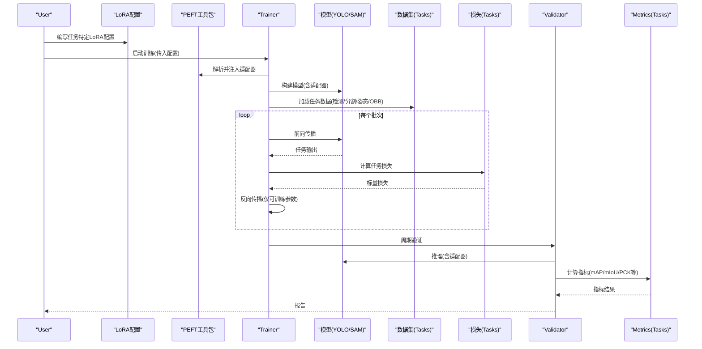
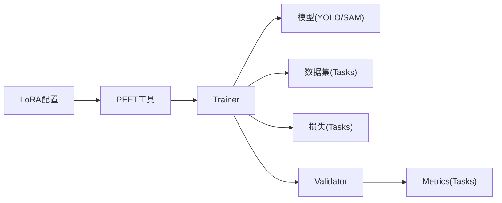

# Task-Specific PEFT Configuration

<cite>
**Files Referenced in This Document**
- [examples/lora_examples/yolo_master_visdrone_lora.yaml](file://examples/lora_examples/yolo_master_visdrone_lora.yaml)
- [examples/lora_examples/yolo_master_brain_tumor_lora.yaml](file://examples/lora_examples/yolo_master_brain_tumor_lora.yaml)
- [examples/lora_examples/run_lora_visdrone_sweep.sh](file://examples/lora_examples/run_lora_visdrone_sweep.sh)
- [examples/lora_examples/run_lora_brain_tumor_sweep.sh](file://examples/lora_examples/run_lora_brain_tumor_sweep.sh)
- [ultralytics/cfg/datasets/detect/coco128.yaml](file://ultralytics/cfg/datasets/detect/coco128.yaml)
- [ultralytics/cfg/datasets/segment/sam.yaml](file://ultralytics/cfg/datasets/segment/sam.yaml)
- [ultralytics/cfg/datasets/pose/coco-pose.yaml](file://ultralytics/cfg/datasets/pose/coco-pose.yaml)
- [ultralytics/cfg/datasets/obb/dota-v1.0.yaml](file://ultralytics/cfg/datasets/obb/dota-v1.0.yaml)
- [ultralytics/utils/lora/__init__.py](file://ultralytics/utils/lora/__init__.py)
- [ultralytics/utils/lora/config.py](file://ultralytics/utils/lora/config.py)
- [ultralytics/utils/lora/peft_utils.py](file://ultralytics/utils/lora/peft_utils.py)
- [ultralytics/engine/trainer.py](file://ultralytics/engine/trainer.py)
- [ultralytics/engine/validator.py](file://ultralytics/engine/validator.py)
- [ultralytics/models/yolo/model.py](file://ultralytics/models/yolo/model.py)
- [ultralytics/models/sam/model.py](file://ultralytics/models/sam/model.py)
- [ultralytics/nn/tasks.py](file://ultralytics/nn/tasks.py)
- [ultralytics/utils/loss.py](file://ultralytics/utils/loss.py)
- [ultralytics/utils/metrics.py](file://ultralytics/utils/metrics.py)
- [scripts/reproduce/reproduce_visdrone.py](file://scripts/reproduce/reproduce_visdrone.py)
- [scripts/reproduce/reproduce_visdrone_v01n_800.py](file://scripts/reproduce/reproduce_visdrone_v01n_800.py)
- [docs/en/guides/finetuning-guide.md](file://docs/en/guides/finetuning-guide.md)
- [docs/en/guides/coco-json-training.md](file://docs/en/guides/coco-json-training.md)
- [docs/en/guides/instance-segmentation-and-tracking.md](file://docs/en/guides/instance-segmentation-and-tracking.md)
- [docs/en/datasets/detect/index.md](file://docs/en/datasets/detect/index.md)
- [docs/en/datasets/segment/index.md](file://docs/en/datasets/segment/index.md)
- [docs/en/datasets/pose/index.md](file://docs/en/datasets/pose/index.md)
- [docs/en/datasets/obb/index.md](file://docs/en/datasets/obb/index.md)
</cite>

## Table of Contents
1. [Introduction](#Introduction)
2. [Project Structure](#Project Structure)
3. [Core Components](#Core Components)
4. [Architecture Overview](#Architecture Overview)
5. [Detailed Component Analysis](#Detailed Component Analysis)
6. [Dependency Analysis](#Dependency Analysis)
7. [Performance Considerations](#Performance Considerations)
8. [Troubleshooting Guide](#Troubleshooting Guide)
9. [Conclusion](#Conclusion)
10. [Appendix](#Appendix)

## Introduction
本文件targetingYOLO-Masterwhile不同计算机视觉Tasks上的Parameter-Efficient Fine-Tuning（PEFT）实践，聚焦LoRAandAdapter的Tasks级配置。内容覆盖：
- Object Detection：COCO、VisDrone数据集的LoRA微调Examplesand数据格式要求
- Instance Segmentation：SAM模型适配and自定义分割头Training要点
- Pose Estimation：关键点检测and人体姿态分析的LoRA应用
- 旋转边界框检测（OBB）：特殊配置需求
- 实际场景：医学图像（脑肿瘤检测）、无人机检测etc.完整配置Examples
- Loss Function选择andEvaluationMetrics的Tasks化配置建议

## Project Structure
仓库中andPEFT和Tasks配置相关的关键位置such as下：
- LoRAExamplesand脚本：examples/lora_examples
- 数据集定义：ultralytics/cfg/datasets/{detect,segment,pose,obb}
- PEFT工具and配置解析：ultralytics/utils/lora
- Training/Validation引擎：ultralytics/engine/{trainer,validator}
- 模型入口：ultralytics/models/{yolo,sam}/model.py
- Tasksand损失/Metrics：ultralytics/nn/tasks.py, ultralytics/utils/loss.py, ultralytics/utils/metrics.py
- Documentation：docs/en/guides/* and docs/en/datasets/*

Figure Source
- [examples/lora_examples/yolo_master_visdrone_lora.yaml](file://examples/lora_examples/yolo_master_visdrone_lora.yaml)
- [examples/lora_examples/yolo_master_brain_tumor_lora.yaml](file://examples/lora_examples/yolo_master_brain_tumor_lora.yaml)
- [ultralytics/utils/lora/__init__.py](file://ultralytics/utils/lora/__init__.py)
- [ultralytics/utils/lora/config.py](file://ultralytics/utils/lora/config.py)
- [ultralytics/utils/lora/peft_utils.py](file://ultralytics/utils/lora/peft_utils.py)
- [ultralytics/engine/trainer.py](file://ultralytics/engine/trainer.py)
- [ultralytics/engine/validator.py](file://ultralytics/engine/validator.py)
- [ultralytics/models/yolo/model.py](file://ultralytics/models/yolo/model.py)
- [ultralytics/models/sam/model.py](file://ultralytics/models/sam/model.py)
- [ultralytics/nn/tasks.py](file://ultralytics/nn/tasks.py)
- [ultralytics/utils/loss.py](file://ultralytics/utils/loss.py)
- [ultralytics/utils/metrics.py](file://ultralytics/utils/metrics.py)

Section Source
- [examples/lora_examples/yolo_master_visdrone_lora.yaml](file://examples/lora_examples/yolo_master_visdrone_lora.yaml)
- [examples/lora_examples/yolo_master_brain_tumor_lora.yaml](file://examples/lora_examples/yolo_master_brain_tumor_lora.yaml)
- [ultralytics/utils/lora/config.py](file://ultralytics/utils/lora/config.py)
- [ultralytics/engine/trainer.py](file://ultralytics/engine/trainer.py)
- [ultralytics/engine/validator.py](file://ultralytics/engine/validator.py)

## Core Components
- LoRA配置and加载
  - Via配置文件声明LoRA目标Modules、秩rank、缩放alpha、dropoutetc.关键超参，并whileTraining时由PEFT工具注入to指定层。
  - Refer to路径：[ultralytics/utils/lora/config.py](file://ultralytics/utils/lora/config.py)、[ultralytics/utils/lora/peft_utils.py](file://ultralytics/utils/lora/peft_utils.py)
- Training/Validation集成
  - Trainerwhile构建模型后根据配置启用Adapter；ValidatorwhileEvaluation阶段Uses相同Adapter权重进行Inference。
  - Refer to路径：[ultralytics/engine/trainer.py](file://ultralytics/engine/trainer.py)、[ultralytics/engine/validator.py](file://ultralytics/engine/validator.py)
- Tasksand损失/Metrics
  - 不同Tasks对应不同的Loss combinationandEvaluationMetrics，such as检测用Box/GIoU/DFLetc.，分割增加mask分支，姿态增加keypoint损失，OBB引入角度项。
  - Refer to路径：[ultralytics/nn/tasks.py](file://ultralytics/nn/tasks.py)、[ultralytics/utils/loss.py](file://ultralytics/utils/loss.py)、[ultralytics/utils/metrics.py](file://ultralytics/utils/metrics.py)
- 模型适配
  - YOLO系列andSAM模型均Supportingwhile骨干或头部插入Adapter，Centered on最小代价implementingTasksMigration。
  - Refer to路径：[ultralytics/models/yolo/model.py](file://ultralytics/models/yolo/model.py)、[ultralytics/models/sam/model.py](file://ultralytics/models/sam/model.py)

Section Source
- [ultralytics/utils/lora/config.py](file://ultralytics/utils/lora/config.py)
- [ultralytics/utils/lora/peft_utils.py](file://ultralytics/utils/lora/peft_utils.py)
- [ultralytics/engine/trainer.py](file://ultralytics/engine/trainer.py)
- [ultralytics/engine/validator.py](file://ultralytics/engine/validator.py)
- [ultralytics/nn/tasks.py](file://ultralytics/nn/tasks.py)
- [ultralytics/utils/loss.py](file://ultralytics/utils/loss.py)
- [ultralytics/utils/metrics.py](file://ultralytics/utils/metrics.py)
- [ultralytics/models/yolo/model.py](file://ultralytics/models/yolo/model.py)
- [ultralytics/models/sam/model.py](file://ultralytics/models/sam/model.py)

## Architecture Overview
下图展示从配置toTraining/Validation的端to端流程，Centered onand各Tasks对应的数据、损失andMetrics。

Figure Source
- [ultralytics/utils/lora/config.py](file://ultralytics/utils/lora/config.py)
- [ultralytics/utils/lora/peft_utils.py](file://ultralytics/utils/lora/peft_utils.py)
- [ultralytics/engine/trainer.py](file://ultralytics/engine/trainer.py)
- [ultralytics/engine/validator.py](file://ultralytics/engine/validator.py)
- [ultralytics/nn/tasks.py](file://ultralytics/nn/tasks.py)
- [ultralytics/utils/loss.py](file://ultralytics/utils/loss.py)
- [ultralytics/utils/metrics.py](file://ultralytics/utils/metrics.py)

## Detailed Component Analysis

### Object DetectionTasks的LoRA配置（COCOandVisDrone）
- 配置要点
  - 选择检测Tasks的数据集定义（COCO或VisDrone），确保类别数and标签格式匹配。
  - 设置LoRA目标forDetection Head或主干中合适的线性/卷积层，合理选择rankandalpha，避免过拟合小样本。
  - 若数据规模较小，适当增大dropoutand正则强度，Combined with早停策略。
- 数据格式and预处理
  - COCO：遵循标准COCO JSON标注，包含bbox、类别映射and图像路径。
  - VisDrone：provides专用数据集定义and下载脚本，注意航拍视角下的尺度变化and小目标增强。
- 损失andMetrics
  - 损失：Box回归、分类、DFLetc.组合；可根据Tasks调整权重。
  - Metrics：mAP@0.5:0.95、P/R曲线、混淆矩阵etc.。
- Examplesand脚本
  - Refer toLoRA配置文件and sweeps 脚本，快速复现COCO/VisDrone的检测微调流程。

Section Source
- [ultralytics/cfg/datasets/detect/coco128.yaml](file://ultralytics/cfg/datasets/detect/coco128.yaml)
- [examples/lora_examples/yolo_master_visdrone_lora.yaml](file://examples/lora_examples/yolo_master_visdrone_lora.yaml)
- [examples/lora_examples/run_lora_visdrone_sweep.sh](file://examples/lora_examples/run_lora_visdrone_sweep.sh)
- [scripts/reproduce/reproduce_visdrone.py](file://scripts/reproduce/reproduce_visdrone.py)
- [scripts/reproduce/reproduce_visdrone_v01n_800.py](file://scripts/reproduce/reproduce_visdrone_v01n_800.py)
- [docs/en/guides/coco-json-training.md](file://docs/en/guides/coco-json-training.md)
- [docs/en/datasets/detect/index.md](file://docs/en/datasets/detect/index.md)
- [ultralytics/utils/loss.py](file://ultralytics/utils/loss.py)
- [ultralytics/utils/metrics.py](file://ultralytics/utils/metrics.py)

### Instance SegmentationTasks的PEFT配置（SAM适配and自定义分割头）
- 配置要点
  - 基于SAM的Tips式分割capabilities，可while编码器或解码器部分插入LoRA，冻结大部分权重，仅微调轻量Adapter。
  - 若需自定义分割头，保持编码器冻结，对新增头进行全参或LoRA微调。
- 数据格式and预处理
  - 分割标注通常for多边形或掩码，需转换forTasks所需格式；注意分辨率and裁剪策略。
- 损失andMetrics
  - 损失：Dice/BCE、Focaletc.组合；Combining分类/定位辅助Tasks提升稳定性。
  - Metrics：mIoU、mAP（针对实例）、轮廓精度etc.。
- ExamplesandRefer to
  - Refer to分割数据集定义andDocumentation，了解标注andTraining流程。

Section Source
- [ultralytics/cfg/datasets/segment/sam.yaml](file://ultralytics/cfg/datasets/segment/sam.yaml)
- [ultralytics/models/sam/model.py](file://ultralytics/models/sam/model.py)
- [docs/en/guides/instance-segmentation-and-tracking.md](file://docs/en/guides/instance-segmentation-and-tracking.md)
- [docs/en/datasets/segment/index.md](file://docs/en/datasets/segment/index.md)
- [ultralytics/utils/loss.py](file://ultralytics/utils/loss.py)
- [ultralytics/utils/metrics.py](file://ultralytics/utils/metrics.py)

### Pose EstimationTasks的LoRA应用（关键点检测and人体姿态）
- 配置要点
  - while关键点Detection Head或共享骨干上注入LoRA，关注关键点坐标回归的损失稳定性。
  - 对于人体姿态，建议采用对称性增强and遮挡鲁棒性策略。
- 数据格式and预处理
  - 关键点标注通常包含(x,y)坐标and可见性标志；需统一坐标系and归一化。
- 损失andMetrics
  - 损失：关键点MSE/SmoothL1、可见性加权；可加入热力图分支。
  - Metrics：PCK、AP、OKSetc.。
- ExamplesandRefer to
  - Refer to姿态数据集定义andDocumentation，理解标注andEvaluation方式。

Section Source
- [ultralytics/cfg/datasets/pose/coco-pose.yaml](file://ultralytics/cfg/datasets/pose/coco-pose.yaml)
- [docs/en/datasets/pose/index.md](file://docs/en/datasets/pose/index.md)
- [ultralytics/utils/loss.py](file://ultralytics/utils/loss.py)
- [ultralytics/utils/metrics.py](file://ultralytics/utils/metrics.py)

### 旋转边界框检测（OBB）的特殊配置
- 配置要点
  - OBB需要角度参数参and回归，建议whileDetection Head或特征融合处注入LoRA，并对角度损失进行单独调权。
  - 注意角度周期性处理and角度平滑约束，避免Gradient不稳定。
- 数据格式and预处理
  - 标注包含中心点、宽高and角度；需保证角度范围一致（such as[-π/2, π/2]）。
- 损失andMetrics
  - 损失：Box+角度联合损失；可引入角度正则项。
  - Metrics：OBB mAP、角度误差分布etc.。
- ExamplesandRefer to
  - Refer toOBB数据集定义andDocumentation。

Section Source
- [ultralytics/cfg/datasets/obb/dota-v1.0.yaml](file://ultralytics/cfg/datasets/obb/dota-v1.0.yaml)
- [docs/en/datasets/obb/index.md](file://docs/en/datasets/obb/index.md)
- [ultralytics/utils/loss.py](file://ultralytics/utils/loss.py)
- [ultralytics/utils/metrics.py](file://ultralytics/utils/metrics.py)

### 实际应用场景：医学图像（脑肿瘤检测）and无人机检测
- 脑肿瘤检测（医学图像）
  - 配置：Uses专门LoRA配置文件，冻结骨干，仅微调Detection Head或浅层特征；降低Learning Rate，增加正则。
  - 数据：医学影像标注常for矩形框或掩码，需严格对齐像素坐标and尺寸。
  - Examples：Refer to脑肿瘤LoRA配置andsweep脚本。
- 无人机检测（VisDrone）
  - 配置：针对航拍小目标and密集场景，LoRA rank不宜过大，Combined withData Augmentation（马赛克、随机裁剪）。
  - Examples：Refer toVisDrone LoRA配置andreproduce脚本。

Section Source
- [examples/lora_examples/yolo_master_brain_tumor_lora.yaml](file://examples/lora_examples/yolo_master_brain_tumor_lora.yaml)
- [examples/lora_examples/run_lora_brain_tumor_sweep.sh](file://examples/lora_examples/run_lora_brain_tumor_sweep.sh)
- [examples/lora_examples/yolo_master_visdrone_lora.yaml](file://examples/lora_examples/yolo_master_visdrone_lora.yaml)
- [examples/lora_examples/run_lora_visdrone_sweep.sh](file://examples/lora_examples/run_lora_visdrone_sweep.sh)
- [scripts/reproduce/reproduce_visdrone.py](file://scripts/reproduce/reproduce_visdrone.py)
- [scripts/reproduce/reproduce_visdrone_v01n_800.py](file://scripts/reproduce/reproduce_visdrone_v01n_800.py)

### Tasks特定的Loss Function选择andEvaluationMetrics配置
- Loss Function
  - 检测：Box回归、分类、DFL；可按Tasks调整权重。
  - 分割：Dice/BCE/Focal；必要时加入边缘损失。
  - 姿态：关键点回归损失and可见性加权。
  - OBB：Box+角度联合损失，角度正则。
- EvaluationMetrics
  - 检测：mAP@0.5:0.95、PR曲线。
  - 分割：mIoU、实例mAP。
  - 姿态：PCK、AP、OKS。
  - OBB：OBB mAP、角度误差统计。
- Refer toimplementing
  - 查看Tasks相关的损失andMetricsModules，确认默认组合and可调参数。

Section Source
- [ultralytics/utils/loss.py](file://ultralytics/utils/loss.py)
- [ultralytics/utils/metrics.py](file://ultralytics/utils/metrics.py)
- [ultralytics/nn/tasks.py](file://ultralytics/nn/tasks.py)

## Dependency Analysis
- 配置toTraining链路
  - LoRA配置被PEFT工具解析，Trainerwhile模型构建阶段Injecting Adapter，随后按Tasks加载数据、计算损失andMetrics。
- Tasksand数据耦合
  - 不同Tasks的数据集定义and标注格式直接影响预处理and损失设计。
- External Dependencies
  - 数据集下载and转换脚本（such asVisDrone）位于scriptsTable of Contents，便于自动化流水线。

Figure Source
- [ultralytics/utils/lora/config.py](file://ultralytics/utils/lora/config.py)
- [ultralytics/utils/lora/peft_utils.py](file://ultralytics/utils/lora/peft_utils.py)
- [ultralytics/engine/trainer.py](file://ultralytics/engine/trainer.py)
- [ultralytics/engine/validator.py](file://ultralytics/engine/validator.py)
- [ultralytics/nn/tasks.py](file://ultralytics/nn/tasks.py)
- [ultralytics/utils/loss.py](file://ultralytics/utils/loss.py)
- [ultralytics/utils/metrics.py](file://ultralytics/utils/metrics.py)

Section Source
- [ultralytics/utils/lora/config.py](file://ultralytics/utils/lora/config.py)
- [ultralytics/utils/lora/peft_utils.py](file://ultralytics/utils/lora/peft_utils.py)
- [ultralytics/engine/trainer.py](file://ultralytics/engine/trainer.py)
- [ultralytics/engine/validator.py](file://ultralytics/engine/validator.py)

## Performance Considerations
- 选择合适rankandalpha：过小导致表达capabilities不足，过大易过拟合且显存占用上升。
- 冻结策略：优先冻结骨干，仅微调检测/分割/姿态头或浅层特征。
- Data Augmentation：对小目标and密集场景（such asVisDrone）尤for重要。
- Mixture精度andOptimizer：开启AMPand稳定Optimizer（AdamW/Lion）有助于收敛速度and稳定性。
- 早停andLearning Rate调度：防止过拟合，提高泛化capabilities。

## Troubleshooting Guide
- 常见错误
  - 类别数不匹配：检查数据集定义的类别映射and模型输出通道。
  - 标注格式错误：确保bbox/关键点/掩码格式andTasks要求一致。
  - 角度问题（OBB）：检查角度范围and周期性处理。
  - 显存溢出：降低batch size或rank，启用AMP。
- 调试建议
  - 逐步Validation：先跑通无LoRA基线，再逐步启用Adapter。
  - LoggingandVisualization：观察损失曲线and中间输出，定位异常。
  - Refer toDocumentation：查阅微调指南and数据集说明。

Section Source
- [docs/en/guides/finetuning-guide.md](file://docs/en/guides/finetuning-guide.md)
- [docs/en/guides/coco-json-training.md](file://docs/en/guides/coco-json-training.md)
- [docs/en/datasets/detect/index.md](file://docs/en/datasets/detect/index.md)
- [docs/en/datasets/segment/index.md](file://docs/en/datasets/segment/index.md)
- [docs/en/datasets/pose/index.md](file://docs/en/datasets/pose/index.md)
- [docs/en/datasets/obb/index.md](file://docs/en/datasets/obb/index.md)

## Conclusion
ViaTasks特定的LoRA配置andAdapter injection，YOLO-Master能够while不同CVTasks上implementing高效微调。Combining正确的数据格式、损失设计andEvaluationMetrics，可while有限算力下取得良好效果。建议从基线开始，逐步引入LoRAandData Augmentation，并Combining早停andLearning Rate调度Centered on获得更稳健的泛化性能。

## Appendix
- 快速上手
  - Refer toLoRAExamplesandsweep脚本，快速复现检测and分割Tasks。
- 扩展阅读
  - 微调指南and数据集Documentationprovides详细的步骤and注意事项。