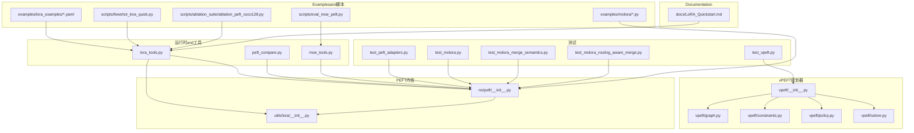
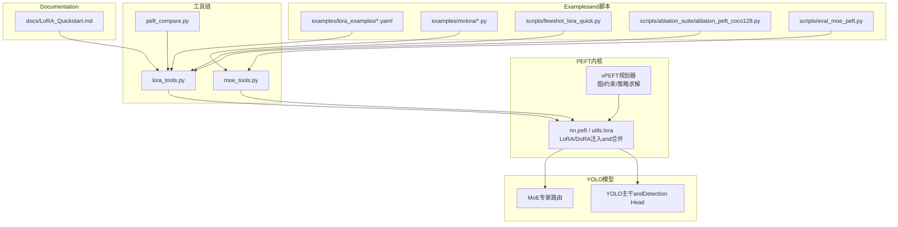
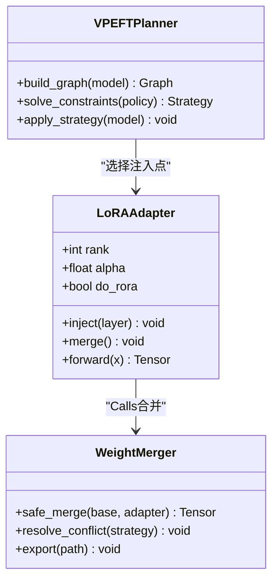
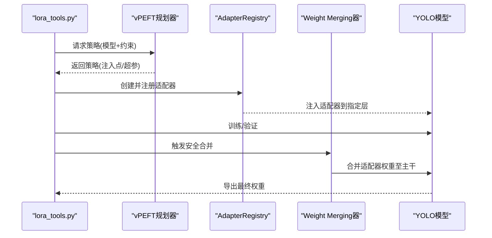
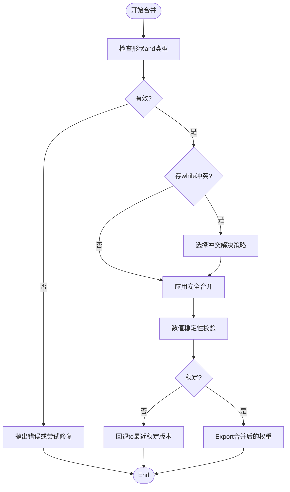
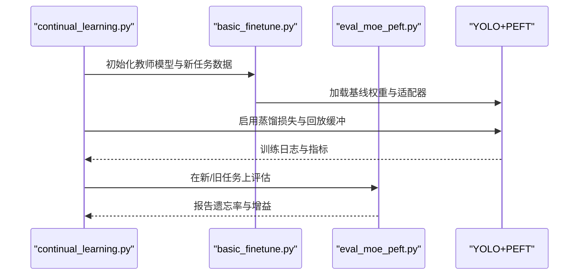
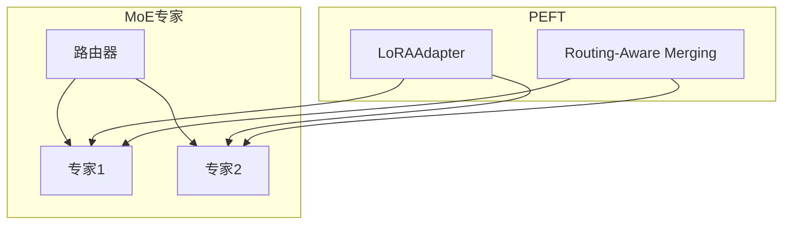
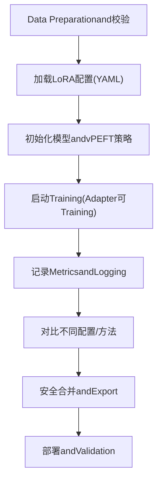
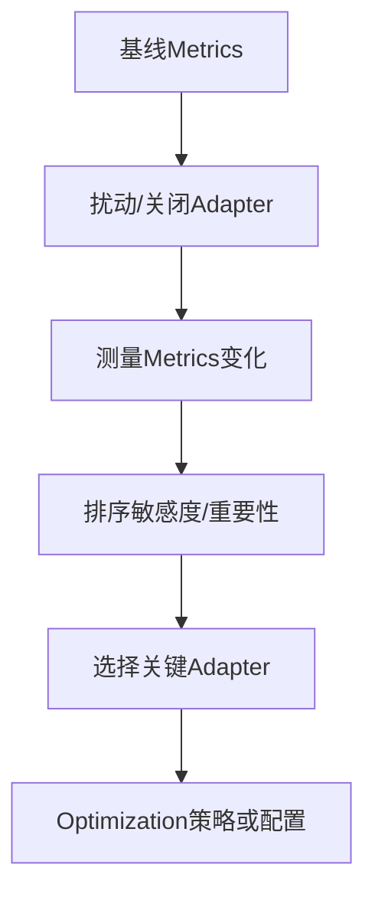
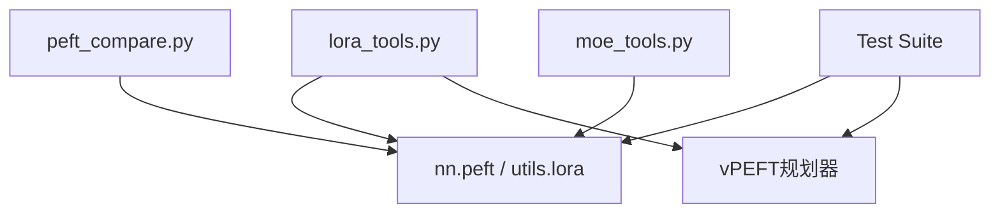

# PEFT System

<cite>
**Files Referenced in This Document**
- [lora_tools.py](file://agent/runtime/cli/lora_tools.py)
- [peft_compare.py](file://agent/runtime/cli/peft_compare.py)
- [moe_tools.py](file://agent/runtime/cli/moe_tools.py)
- [test_molora.py](file://tests/test_molora.py)
- [test_molora_merge_semantics.py](file://tests/test_molora_merge_semantics.py)
- [test_molora_routing_aware_merge.py](file://tests/test_molora_routing_aware_merge.py)
- [test_peft_adapters.py](file://tests/test_peft_adapters.py)
- [test_vpeft.py](file://tests/test_vpeft.py)
- [vpeft/__init__.py](file://ultralytics/vpeft/__init__.py)
- [vpeft/constraints.py](file://ultralytics/vpeft/constraints.py)
- [vpeft/graph.py](file://ultralytics/vpeft/graph.py)
- [vpeft/policy.py](file://ultralytics/vpeft/policy.py)
- [vpeft/solver.py](file://ultralytics/vpeft/solver.py)
- [nn/peft/__init__.py](file://ultralytics/nn/peft/__init__.py)
- [utils/lora/__init__.py](file://ultralytics/utils/lora/__init__.py)
- [examples/lora_examples/yolo_master_lora_README.md](file://examples/lora_examples/yolo_master_lora_README.md)
- [examples/lora_examples/yolo11_lora.yaml](file://examples/lora_examples/yolo11_lora.yaml)
- [examples/lora_examples/yolo12_lora.yaml](file://examples/lora_examples/yolo12_lora.yaml)
- [examples/lora_examples/yolov8_lora.yaml](file://examples/lora_examples/yolov8_lora.yaml)
- [examples/lora_examples/yolo_master_visdrone_lora.yaml](file://examples/lora_examples/yolo_master_visdrone_lora.yaml)
- [examples/molora/basic_finetune.py](file://examples/molora/basic_finetune.py)
- [examples/molora/continual_learning.py](file://examples/molora/continual_learning.py)
- [scripts/fewshot_lora_quick.py](file://scripts/fewshot_lora_quick.py)
- [scripts/fewshot_lora_verify.py](file://scripts/fewshot_lora_verify.py)
- [scripts/ablation_suite/ablation_peft_coco128.py](file://scripts/ablation_suite/ablation_peft_coco128.py)
- [scripts/eval_moe_peft.py](file://scripts/eval_moe_peft.py)
- [docs/LoRA_Quickstart.md](file://docs/LoRA_Quickstart.md)
</cite>

## Table of Contents
1. [Introduction](#Introduction)
2. [Project Structure](#Project Structure)
3. [Core Components](#Core Components)
4. [Architecture Overview](#Architecture Overview)
5. [Detailed Component Analysis](#Detailed Component Analysis)
6. [Dependency Analysis](#Dependency Analysis)
7. [性能考量](#性能考量)
8. [Troubleshooting Guide](#Troubleshooting Guide)
9. [Conclusion](#Conclusion)
10. [Appendix](#Appendix)

## Introduction
本技术DocumentationtargetingYOLO-Master的Parameter-Efficient Fine-Tuning（PEFT）子系统，聚焦Centered on下目标：
- 解释LoRAwhileYOLO中的implementing原理and适配方式，并说明DoRAetc.其他PEFT技术的集成and配置方法。
- 阐述Adapter Management System的架构，包括创建、注册、加载and合并机制。
- 解析Weight Merging算法的implementing细节，涵盖安全合并and冲突解决策略。
- 说明增量学习Supporting，包括灾难性遗忘缓解andKnowledge Distillation路径。
- 描述PEFTandMoE架构的集成方式and兼容性考虑。
- provides完整的LoRATraining工作流（Data Preparation、配置设置、Training监控）。
- 给出Adapter敏感性and重要性Evaluation方法。
- 总结PEFTModel Export and Deployment最佳实践。
- provides针对不同Tasks的PEFT配置Examplesand调优指南。

## Project Structure
围绕PEFTandLoRA的核心代码分布whilesuch as下位置：
- 运行时CLI工具：用于LoRATraining辅助、PEFT对比、MoE工具etc.
- vPEFT规划器：基于图and约束的策略求解器，负责选择可插拔Modulesand生成策略
- nn.peftandutils.lora：底层AdapterEncapsulates、Weight Mergingand调度逻辑
- Test Suite：覆盖MOLORARouting-Aware Merging、语义一致性、Adapter生命周期etc.
- Examplesand脚本：多TasksLoRA配置、少样本快速流程、消融实验and评测脚本
- Documentation：LoRAQuick Startand相关指南

Figure Source
- [lora_tools.py:1-200](file://agent/runtime/cli/lora_tools.py#L1-L200)
- [peft_compare.py:1-200](file://agent/runtime/cli/peft_compare.py#L1-L200)
- [moe_tools.py:1-200](file://agent/runtime/cli/moe_tools.py#L1-L200)
- [vpeft/__init__.py:1-200](file://ultralytics/vpeft/__init__.py#L1-L200)
- [vpeft/graph.py:1-200](file://ultralytics/vpeft/graph.py#L1-L200)
- [vpeft/constraints.py:1-200](file://ultralytics/vpeft/constraints.py#L1-L200)
- [vpeft/policy.py:1-200](file://ultralytics/vpeft/policy.py#L1-L200)
- [vpeft/solver.py:1-200](file://ultralytics/vpeft/solver.py#L1-L200)
- [nn/peft/__init__.py:1-200](file://ultralytics/nn/peft/__init__.py#L1-L200)
- [utils/lora/__init__.py:1-200](file://ultralytics/utils/lora/__init__.py#L1-L200)
- [test_peft_adapters.py:1-200](file://tests/test_peft_adapters.py#L1-L200)
- [test_molora.py:1-200](file://tests/test_molora.py#L1-L200)
- [test_molora_merge_semantics.py:1-200](file://tests/test_molora_merge_semantics.py#L1-L200)
- [test_molora_routing_aware_merge.py:1-200](file://tests/test_molora_routing_aware_merge.py#L1-L200)
- [test_vpeft.py:1-200](file://tests/test_vpeft.py#L1-L200)
- [examples/lora_examples/yolo11_lora.yaml:1-200](file://examples/lora_examples/yolo11_lora.yaml#L1-L200)
- [examples/lora_examples/yolo12_lora.yaml:1-200](file://examples/lora_examples/yolo12_lora.yaml#L1-L200)
- [examples/lora_examples/yolov8_lora.yaml:1-200](file://examples/lora_examples/yolov8_lora.yaml#L1-L200)
- [examples/lora_examples/yolo_master_visdrone_lora.yaml:1-200](file://examples/lora_examples/yolo_master_visdrone_lora.yaml#L1-L200)
- [examples/molora/basic_finetune.py:1-200](file://examples/molora/basic_finetune.py#L1-L200)
- [examples/molora/continual_learning.py:1-200](file://examples/molora/continual_learning.py#L1-L200)
- [scripts/fewshot_lora_quick.py:1-200](file://scripts/fewshot_lora_quick.py#L1-L200)
- [scripts/ablation_suite/ablation_peft_coco128.py:1-200](file://scripts/ablation_suite/ablation_peft_coco128.py#L1-L200)
- [scripts/eval_moe_peft.py:1-200](file://scripts/eval_moe_peft.py#L1-L200)
- [docs/LoRA_Quickstart.md:1-200](file://docs/LoRA_Quickstart.md#L1-L200)

Section Source
- [lora_tools.py:1-200](file://agent/runtime/cli/lora_tools.py#L1-L200)
- [peft_compare.py:1-200](file://agent/runtime/cli/peft_compare.py#L1-L200)
- [moe_tools.py:1-200](file://agent/runtime/cli/moe_tools.py#L1-L200)
- [vpeft/__init__.py:1-200](file://ultralytics/vpeft/__init__.py#L1-L200)
- [vpeft/graph.py:1-200](file://ultralytics/vpeft/graph.py#L1-L200)
- [vpeft/constraints.py:1-200](file://ultralytics/vpeft/constraints.py#L1-L200)
- [vpeft/policy.py:1-200](file://ultralytics/vpeft/policy.py#L1-L200)
- [vpeft/solver.py:1-200](file://ultralytics/vpeft/solver.py#L1-L200)
- [nn/peft/__init__.py:1-200](file://ultralytics/nn/peft/__init__.py#L1-L200)
- [utils/lora/__init__.py:1-200](file://ultralytics/utils/lora/__init__.py#L1-L200)
- [test_peft_adapters.py:1-200](file://tests/test_peft_adapters.py#L1-L200)
- [test_molora.py:1-200](file://tests/test_molora.py#L1-L200)
- [test_molora_merge_semantics.py:1-200](file://tests/test_molora_merge_semantics.py#L1-L200)
- [test_molora_routing_aware_merge.py:1-200](file://tests/test_molora_routing_aware_merge.py#L1-L200)
- [test_vpeft.py:1-200](file://tests/test_vpeft.py#L1-L200)
- [examples/lora_examples/yolo11_lora.yaml:1-200](file://examples/lora_examples/yolo11_lora.yaml#L1-L200)
- [examples/lora_examples/yolo12_lora.yaml:1-200](file://examples/lora_examples/yolo12_lora.yaml#L1-L200)
- [examples/lora_examples/yolov8_lora.yaml:1-200](file://examples/lora_examples/yolov8_lora.yaml#L1-L200)
- [examples/lora_examples/yolo_master_visdrone_lora.yaml:1-200](file://examples/lora_examples/yolo_master_visdrone_lora.yaml#L1-L200)
- [examples/molora/basic_finetune.py:1-200](file://examples/molora/basic_finetune.py#L1-L200)
- [examples/molora/continual_learning.py:1-200](file://examples/molora/continual_learning.py#L1-L200)
- [scripts/fewshot_lora_quick.py:1-200](file://scripts/fewshot_lora_quick.py#L1-L200)
- [scripts/ablation_suite/ablation_peft_coco128.py:1-200](file://scripts/ablation_suite/ablation_peft_coco128.py#L1-L200)
- [scripts/eval_moe_peft.py:1-200](file://scripts/eval_moe_peft.py#L1-L200)
- [docs/LoRA_Quickstart.md:1-200](file://docs/LoRA_Quickstart.md#L1-L200)

## Core Components
- LoRAandDoRAetc.PEFT内核
  - 位于nn.peftandutils.lora，provides低秩矩阵注入、Optional范数重缩放（DoRA）、Centered onandWeight Merging接口。
  - 关键职责：插入Adapter、维护可Training参数子集、执行前向时叠加更新、Export时安全合并。
- vPEFT规划器
  - Via图构建and约束求解，自动识别可插拔层and最优策略，输出策略清单供Trainingand合并Uses。
  - 关键职责：模型图扫描、候选集生成、约束校验、策略求解and回退。
- 运行时工具链
  - lora_tools：EncapsulatesLoRATraining辅助流程（Data Preparation、配置解析、Training启动、结果汇总）。
  - peft_compare：跨配置或跨方法的对比评测andVisualization。
  - moe_tools：andMoE专家路由协同的工具函数（such asRouting-Aware Merging、专家权重对齐）。
- 测试andValidation
  - 覆盖Adapter生命周期、MOLORARouting-Aware Merging语义、vPEFT策略正确性etc.。
- Examplesand脚本
  - provides多TasksLoRA配置模板、少样本快速流程、消融实验and评测脚本。

Section Source
- [nn/peft/__init__.py:1-200](file://ultralytics/nn/peft/__init__.py#L1-L200)
- [utils/lora/__init__.py:1-200](file://ultralytics/utils/lora/__init__.py#L1-L200)
- [vpeft/__init__.py:1-200](file://ultralytics/vpeft/__init__.py#L1-L200)
- [lora_tools.py:1-200](file://agent/runtime/cli/lora_tools.py#L1-L200)
- [peft_compare.py:1-200](file://agent/runtime/cli/peft_compare.py#L1-L200)
- [moe_tools.py:1-200](file://agent/runtime/cli/moe_tools.py#L1-L200)
- [test_peft_adapters.py:1-200](file://tests/test_peft_adapters.py#L1-L200)
- [test_molora.py:1-200](file://tests/test_molora.py#L1-L200)
- [test_molora_merge_semantics.py:1-200](file://tests/test_molora_merge_semantics.py#L1-L200)
- [test_molora_routing_aware_merge.py:1-200](file://tests/test_molora_routing_aware_merge.py#L1-L200)
- [test_vpeft.py:1-200](file://tests/test_vpeft.py#L1-L200)
- [examples/lora_examples/yolo11_lora.yaml:1-200](file://examples/lora_examples/yolo11_lora.yaml#L1-L200)
- [examples/lora_examples/yolo12_lora.yaml:1-200](file://examples/lora_examples/yolo12_lora.yaml#L1-L200)
- [examples/lora_examples/yolov8_lora.yaml:1-200](file://examples/lora_examples/yolov8_lora.yaml#L1-L200)
- [examples/lora_examples/yolo_master_visdrone_lora.yaml:1-200](file://examples/lora_examples/yolo_master_visdrone_lora.yaml#L1-L200)
- [examples/molora/basic_finetune.py:1-200](file://examples/molora/basic_finetune.py#L1-L200)
- [examples/molora/continual_learning.py:1-200](file://examples/molora/continual_learning.py#L1-L200)
- [scripts/fewshot_lora_quick.py:1-200](file://scripts/fewshot_lora_quick.py#L1-L200)
- [scripts/ablation_suite/ablation_peft_coco128.py:1-200](file://scripts/ablation_suite/ablation_peft_coco128.py#L1-L200)
- [scripts/eval_moe_peft.py:1-200](file://scripts/eval_moe_peft.py#L1-L200)
- [docs/LoRA_Quickstart.md:1-200](file://docs/LoRA_Quickstart.md#L1-L200)

## Architecture Overview
下图展示PEFT子系统andYOLO主干、MoEand工具链的交互关系。

Figure Source
- [lora_tools.py:1-200](file://agent/runtime/cli/lora_tools.py#L1-L200)
- [peft_compare.py:1-200](file://agent/runtime/cli/peft_compare.py#L1-L200)
- [moe_tools.py:1-200](file://agent/runtime/cli/moe_tools.py#L1-L200)
- [vpeft/__init__.py:1-200](file://ultralytics/vpeft/__init__.py#L1-L200)
- [nn/peft/__init__.py:1-200](file://ultralytics/nn/peft/__init__.py#L1-L200)
- [utils/lora/__init__.py:1-200](file://ultralytics/utils/lora/__init__.py#L1-L200)
- [examples/lora_examples/yolo11_lora.yaml:1-200](file://examples/lora_examples/yolo11_lora.yaml#L1-L200)
- [examples/molora/basic_finetune.py:1-200](file://examples/molora/basic_finetune.py#L1-L200)
- [scripts/fewshot_lora_quick.py:1-200](file://scripts/fewshot_lora_quick.py#L1-L200)
- [scripts/ablation_suite/ablation_peft_coco128.py:1-200](file://scripts/ablation_suite/ablation_peft_coco128.py#L1-L200)
- [scripts/eval_moe_peft.py:1-200](file://scripts/eval_moe_peft.py#L1-L200)
- [docs/LoRA_Quickstart.md:1-200](file://docs/LoRA_Quickstart.md#L1-L200)

## Detailed Component Analysis

### LoRAandDoRAimplementing原理andwhileYOLO中的应用
- 原理要点
  - LoRAViawhile特定层旁路注入低秩矩阵对，冻结原权重，仅Training小参数量Adapter，显著降低显存and计算开销。
  - DoRAwhileLoRA基础上引入范数重缩放，提升稳定性and收敛质量，适合视觉Tasks中特征尺度变化较大的场景。
- whileYOLO中的应用
  - 针对卷积层、注意力层或Detection Head线性层进行Adapter injection，保持Inference时可Via“安全合并”将Adapter权重融合进主干，避免额外开销。
  - CombiningvPEFT自动选择可插拔层，减少人工挑选成本。
- 关键implementing位置
  - Adapter injectionand合并接口：nn.peftandutils.lora
  - TrainingandExport流程：lora_toolsandExamples脚本

Figure Source
- [nn/peft/__init__.py:1-200](file://ultralytics/nn/peft/__init__.py#L1-L200)
- [utils/lora/__init__.py:1-200](file://ultralytics/utils/lora/__init__.py#L1-L200)
- [vpeft/__init__.py:1-200](file://ultralytics/vpeft/__init__.py#L1-L200)

Section Source
- [nn/peft/__init__.py:1-200](file://ultralytics/nn/peft/__init__.py#L1-L200)
- [utils/lora/__init__.py:1-200](file://ultralytics/utils/lora/__init__.py#L1-L200)
- [test_peft_adapters.py:1-200](file://tests/test_peft_adapters.py#L1-L200)

### Adapter Management System：创建、注册、加载and合并
- 创建and注册
  - ViavPEFT策略生成候选Adapter集合，并while模型上按命名空间注册，便于后续定位and批量操作。
- 加载and切换
  - Supporting从Checkpoint加载不同Tasks/数据集的Adapter权重，动态切换Centered on进行多TasksInference或while线A/B测试。
- 合并机制
  - provides安全合并接口，确保数值稳定and形状一致；当存while同名冲突时，采用策略化冲突解决（such as优先级、加权平均或Routing-Aware Merging）。
- 关键implementing位置
  - 管理器and合并逻辑：utils.loraandnn.peft
  - Routing-Aware Merging：moe_toolsandMOLORA测试用例

Figure Source
- [lora_tools.py:1-200](file://agent/runtime/cli/lora_tools.py#L1-L200)
- [vpeft/__init__.py:1-200](file://ultralytics/vpeft/__init__.py#L1-L200)
- [utils/lora/__init__.py:1-200](file://ultralytics/utils/lora/__init__.py#L1-L200)
- [moe_tools.py:1-200](file://agent/runtime/cli/moe_tools.py#L1-L200)

Section Source
- [lora_tools.py:1-200](file://agent/runtime/cli/lora_tools.py#L1-L200)
- [utils/lora/__init__.py:1-200](file://ultralytics/utils/lora/__init__.py#L1-L200)
- [moe_tools.py:1-200](file://agent/runtime/cli/moe_tools.py#L1-L200)
- [test_peft_adapters.py:1-200](file://tests/test_peft_adapters.py#L1-L200)

### Weight Merging算法and安全合并、冲突解决
- 安全合并
  - while合并前进行形状and数据类型校验，必要时进行广播或类型转换，防止运行时错误。
  - 对DoRA范数项进行特殊处理，确保合并后仍满足范数约束。
- 冲突解决策略
  - 优先级策略：根据Tasks或版本标签决定保留哪个权重。
  - 加权平均：while多Tasks共享主干时，按权重比例融合。
  - Routing-Aware Merging：CombiningMoE路由统计，对专家权重进行选择性融合，避免破坏路由capabilities。
- 关键implementing位置
  - 合并and冲突解决：utils.loraandmoe_tools
  - 语义一致性测试：test_molora_merge_semanticsandtest_molora_routing_aware_merge

Figure Source
- [utils/lora/__init__.py:1-200](file://ultralytics/utils/lora/__init__.py#L1-L200)
- [moe_tools.py:1-200](file://agent/runtime/cli/moe_tools.py#L1-L200)
- [test_molora_merge_semantics.py:1-200](file://tests/test_molora_merge_semantics.py#L1-L200)
- [test_molora_routing_aware_merge.py:1-200](file://tests/test_molora_routing_aware_merge.py#L1-L200)

Section Source
- [utils/lora/__init__.py:1-200](file://ultralytics/utils/lora/__init__.py#L1-L200)
- [moe_tools.py:1-200](file://agent/runtime/cli/moe_tools.py#L1-L200)
- [test_molora_merge_semantics.py:1-200](file://tests/test_molora_merge_semantics.py#L1-L200)
- [test_molora_routing_aware_merge.py:1-200](file://tests/test_molora_routing_aware_merge.py#L1-L200)

### 增量学习andKnowledge Distillation
- 灾难性遗忘缓解
  - Via限制主干更新范围（仅微调Adapter），并Combining正则化或回放缓冲区，降低旧Tasks性能退化。
- Knowledge Distillation路径
  - 利用教师模型（预Training或上一阶段模型）的输出作for软标签，指导新TasksAdapter学习，提高泛化and稳定性。
- 关键implementing位置
  - 持续学习Examples：examples/molora/continual_learning.py
  - 基础微调入口：examples/molora/basic_finetune.py
  - 评测脚本：scripts/eval_moe_peft.py

Figure Source
- [examples/molora/continual_learning.py:1-200](file://examples/molora/continual_learning.py#L1-L200)
- [examples/molora/basic_finetune.py:1-200](file://examples/molora/basic_finetune.py#L1-L200)
- [scripts/eval_moe_peft.py:1-200](file://scripts/eval_moe_peft.py#L1-L200)

Section Source
- [examples/molora/continual_learning.py:1-200](file://examples/molora/continual_learning.py#L1-L200)
- [examples/molora/basic_finetune.py:1-200](file://examples/molora/basic_finetune.py#L1-L200)
- [scripts/eval_moe_peft.py:1-200](file://scripts/eval_moe_peft.py#L1-L200)

### PEFTandMoE架构的集成and兼容性
- 集成方式
  - whileMoE专家层附近Injecting Adapter，使Tasks特定知识while不破坏路由的前提下增强专家表征。
  - Routing-Aware Merging：依据路由统计and专家Uses频率，选择性融合专家权重，维持路由均衡。
- 兼容性考虑
  - 确保Adapter维度and专家输入输出匹配；whileDDP或多卡环境下保证Gradient同步and状态一致性。
- 关键implementing位置
  - MoE工具：moe_tools
  - MOLORARouting-Aware Merging测试：test_molora_routing_aware_mergeandtest_molora

Figure Source
- [moe_tools.py:1-200](file://agent/runtime/cli/moe_tools.py#L1-L200)
- [test_molora.py:1-200](file://tests/test_molora.py#L1-L200)
- [test_molora_routing_aware_merge.py:1-200](file://tests/test_molora_routing_aware_merge.py#L1-L200)

Section Source
- [moe_tools.py:1-200](file://agent/runtime/cli/moe_tools.py#L1-L200)
- [test_molora.py:1-200](file://tests/test_molora.py#L1-L200)
- [test_molora_routing_aware_merge.py:1-200](file://tests/test_molora_routing_aware_merge.py#L1-L200)

### LoRATraining完整工作流
- Data Preparation
  - UsesYOLO格式数据集，确保标注规范and划分合理；Refer toQuick StartDocumentationandExamples配置。
- 配置设置
  - ViaYAML定义LoRA超参（rank、alpha、target_layersetc.），可按Tasks定制。
- Trainingand监控
  - Useslora_tools启动Training，Combiningpeft_compare进行对比分析andVisualization。
- 关键implementing位置
  - Quick Start：docs/LoRA_Quickstart.md
  - Examples配置：examples/lora_examples/*.yaml
  - 少样本流程：scripts/fewshot_lora_quick.pyandfewshot_lora_verify.py
  - 对比评测：peft_compare.py

Figure Source
- [docs/LoRA_Quickstart.md:1-200](file://docs/LoRA_Quickstart.md#L1-L200)
- [examples/lora_examples/yolo11_lora.yaml:1-200](file://examples/lora_examples/yolo11_lora.yaml#L1-L200)
- [examples/lora_examples/yolo12_lora.yaml:1-200](file://examples/lora_examples/yolo12_lora.yaml#L1-L200)
- [examples/lora_examples/yolov8_lora.yaml:1-200](file://examples/lora_examples/yolov8_lora.yaml#L1-L200)
- [examples/lora_examples/yolo_master_visdrone_lora.yaml:1-200](file://examples/lora_examples/yolo_master_visdrone_lora.yaml#L1-L200)
- [scripts/fewshot_lora_quick.py:1-200](file://scripts/fewshot_lora_quick.py#L1-L200)
- [scripts/fewshot_lora_verify.py:1-200](file://scripts/fewshot_lora_verify.py#L1-L200)
- [peft_compare.py:1-200](file://agent/runtime/cli/peft_compare.py#L1-L200)

Section Source
- [docs/LoRA_Quickstart.md:1-200](file://docs/LoRA_Quickstart.md#L1-L200)
- [examples/lora_examples/yolo11_lora.yaml:1-200](file://examples/lora_examples/yolo11_lora.yaml#L1-L200)
- [examples/lora_examples/yolo12_lora.yaml:1-200](file://examples/lora_examples/yolo12_lora.yaml#L1-L200)
- [examples/lora_examples/yolov8_lora.yaml:1-200](file://examples/lora_examples/yolov8_lora.yaml#L1-L200)
- [examples/lora_examples/yolo_master_visdrone_lora.yaml:1-200](file://examples/lora_examples/yolo_master_visdrone_lora.yaml#L1-L200)
- [scripts/fewshot_lora_quick.py:1-200](file://scripts/fewshot_lora_quick.py#L1-L200)
- [scripts/fewshot_lora_verify.py:1-200](file://scripts/fewshot_lora_verify.py#L1-L200)
- [peft_compare.py:1-200](file://agent/runtime/cli/peft_compare.py#L1-L200)

### Adapter敏感性and重要性Evaluation
- 敏感性分析
  - Via扰动Adapter权重或关闭部分Adapter，观察TasksMetrics变化，识别关键层and高敏区域。
- 重要性度量
  - 基于Gradient范数、激活方差或路由Uses频率，量化各Adapter对Tasks贡献度。
- 关键implementing位置
  - Adapter测试：test_peft_adapters
  - vPEFT策略and约束：vpeft/*
  - 对比评测：peft_compare.py

Figure Source
- [test_peft_adapters.py:1-200](file://tests/test_peft_adapters.py#L1-L200)
- [vpeft/constraints.py:1-200](file://ultralytics/vpeft/constraints.py#L1-L200)
- [vpeft/policy.py:1-200](file://ultralytics/vpeft/policy.py#L1-L200)
- [peft_compare.py:1-200](file://agent/runtime/cli/peft_compare.py#L1-L200)

Section Source
- [test_peft_adapters.py:1-200](file://tests/test_peft_adapters.py#L1-L200)
- [vpeft/constraints.py:1-200](file://ultralytics/vpeft/constraints.py#L1-L200)
- [vpeft/policy.py:1-200](file://ultralytics/vpeft/policy.py#L1-L200)
- [peft_compare.py:1-200](file://agent/runtime/cli/peft_compare.py#L1-L200)

### PEFTModel Export and Deployment最佳实践
- Export前检查
  - 确认所有Adapter已安全合并，形状and类型一致，无未闭合的上下文状态。
- 平台适配
  - 针对不同后端（ONNX、TensorRT、OpenVINOetc.）进行预检andValidation，确保算子兼容and精度对齐。
- 部署建议
  - Prefer合并后的静态权重Centered on降低Inference延迟；while多Tasks场景下按需加载Adapter，避免全量切换带来的开销。
- 关键implementing位置
  - Exportand预检：utils/export_*（由工具链Calls）
  - 对比andValidation：peft_compare.pyandTest Suite

Section Source
- [peft_compare.py:1-200](file://agent/runtime/cli/peft_compare.py#L1-L200)
- [test_exports.py:1-200](file://tests/test_exports.py#L1-L200)
- [test_export_preflight.py:1-200](file://tests/test_export_preflight.py#L1-L200)

### 不同Tasks的PEFT配置Examplesand调优指南
- Examples配置
  - providesYOLO11、YOLO12、YOLOv8andVisDroneTasks的LoRA配置模板，便于快速上手。
- 调优建议
  - 从小rank开始逐步增大，CombiningLearning RateandBatch Size进行网格搜索；关注DoRA开启and否对收敛的影响。
  - 针对MoE场景，调整Routing-Aware Merging强度，平衡专家多样性andTasks性能。
- 关键implementing位置
  - Examples配置：examples/lora_examples/*.yaml
  - Quick Start：docs/LoRA_Quickstart.md

Section Source
- [examples/lora_examples/yolo11_lora.yaml:1-200](file://examples/lora_examples/yolo11_lora.yaml#L1-L200)
- [examples/lora_examples/yolo12_lora.yaml:1-200](file://examples/lora_examples/yolo12_lora.yaml#L1-L200)
- [examples/lora_examples/yolov8_lora.yaml:1-200](file://examples/lora_examples/yolov8_lora.yaml#L1-L200)
- [examples/lora_examples/yolo_master_visdrone_lora.yaml:1-200](file://examples/lora_examples/yolo_master_visdrone_lora.yaml#L1-L200)
- [docs/LoRA_Quickstart.md:1-200](file://docs/LoRA_Quickstart.md#L1-L200)

## Dependency Analysis
- 组件耦合
  - lora_toolsandnn.peft/utils.lora强耦合，负责Trainingand合并；vPEFTfor上游策略provides者。
  - moe_toolsandMOLORA测试用例共同保障Routing-Aware Merging的正确性。
- External Dependencies
  - PyTorch张量运算、YOLO模型结构andExport Backends。
- Potential Cycles依赖
  - Via分层设计（工具层、内核层、规划层）避免直接循环导入。

Figure Source
- [lora_tools.py:1-200](file://agent/runtime/cli/lora_tools.py#L1-L200)
- [peft_compare.py:1-200](file://agent/runtime/cli/peft_compare.py#L1-L200)
- [moe_tools.py:1-200](file://agent/runtime/cli/moe_tools.py#L1-L200)
- [nn/peft/__init__.py:1-200](file://ultralytics/nn/peft/__init__.py#L1-L200)
- [utils/lora/__init__.py:1-200](file://ultralytics/utils/lora/__init__.py#L1-L200)
- [vpeft/__init__.py:1-200](file://ultralytics/vpeft/__init__.py#L1-L200)
- [test_peft_adapters.py:1-200](file://tests/test_peft_adapters.py#L1-L200)
- [test_molora.py:1-200](file://tests/test_molora.py#L1-L200)
- [test_molora_merge_semantics.py:1-200](file://tests/test_molora_merge_semantics.py#L1-L200)
- [test_molora_routing_aware_merge.py:1-200](file://tests/test_molora_routing_aware_merge.py#L1-L200)
- [test_vpeft.py:1-200](file://tests/test_vpeft.py#L1-L200)

Section Source
- [lora_tools.py:1-200](file://agent/runtime/cli/lora_tools.py#L1-L200)
- [peft_compare.py:1-200](file://agent/runtime/cli/peft_compare.py#L1-L200)
- [moe_tools.py:1-200](file://agent/runtime/cli/moe_tools.py#L1-L200)
- [nn/peft/__init__.py:1-200](file://ultralytics/nn/peft/__init__.py#L1-L200)
- [utils/lora/__init__.py:1-200](file://ultralytics/utils/lora/__init__.py#L1-L200)
- [vpeft/__init__.py:1-200](file://ultralytics/vpeft/__init__.py#L1-L200)
- [test_peft_adapters.py:1-200](file://tests/test_peft_adapters.py#L1-L200)
- [test_molora.py:1-200](file://tests/test_molora.py#L1-L200)
- [test_molora_merge_semantics.py:1-200](file://tests/test_molora_merge_semantics.py#L1-L200)
- [test_molora_routing_aware_merge.py:1-200](file://tests/test_molora_routing_aware_merge.py#L1-L200)
- [test_vpeft.py:1-200](file://tests/test_vpeft.py#L1-L200)

## 性能考量
- 内存and计算
  - LoRA/DoRA显著降低可Training参数量，适合资源受限环境；DoRA可能带来轻微额外计算，但有助于收敛稳定性。
- 合并andInference
  - 安全合并后可获得and原始模型一致的Inference路径，避免运行时开销；多Tasks场景下按需加载Adapter可减少切换成本。
- 并行and分布式
  - whileDDP环境下需确保AdapterGradient同步and状态一致性；MOLORARouting-Aware Merging需考虑收集统计量的通信开销。

## Troubleshooting Guide
- 常见错误
  - 形状不匹配：检查Adapter维度and目标层是否一致。
  - 数值不稳定：启用DoRA或降低Learning Rate；检查合并前的数值范围。
  - 路由异常：查看路由统计and专家Uses分布，调整Routing-Aware Merging强度。
- 诊断工具
  - Usespeft_compare进行对比分析；借助Test Suite复现问题路径。
- 关键implementing位置
  - 对比and诊断：peft_compare.py
  - 测试用例：test_peft_adapters、test_molora_*、test_vpeft

Section Source
- [peft_compare.py:1-200](file://agent/runtime/cli/peft_compare.py#L1-L200)
- [test_peft_adapters.py:1-200](file://tests/test_peft_adapters.py#L1-L200)
- [test_molora.py:1-200](file://tests/test_molora.py#L1-L200)
- [test_molora_merge_semantics.py:1-200](file://tests/test_molora_merge_semantics.py#L1-L200)
- [test_molora_routing_aware_merge.py:1-200](file://tests/test_molora_routing_aware_merge.py#L1-L200)
- [test_vpeft.py:1-200](file://tests/test_vpeft.py#L1-L200)

## Conclusion
YOLO-Master的PEFT子系统ViaLoRA/DoRA注入、vPEFT自动策略andRouting-Aware Merging，implementing了高效、稳定且可扩展的微调capabilities。Combined with完善的工具链andTest Suite，User可while多TasksandMoE场景下快速落地，并获得良好的性能and部署体验。

## Appendix
- Quick StartandExamples
  - Refer toLoRAQuick StartDocumentationand各TasksYAML配置，Combining少样本脚本快速Validation。
- 更多阅读
  - Documentationand计划文件中包含更深入的架构设计and演进路线。