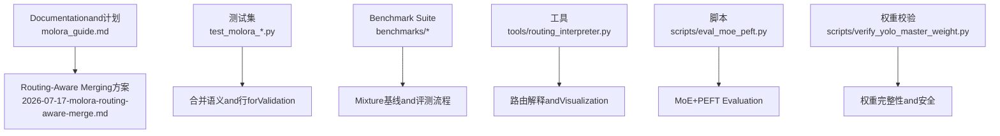
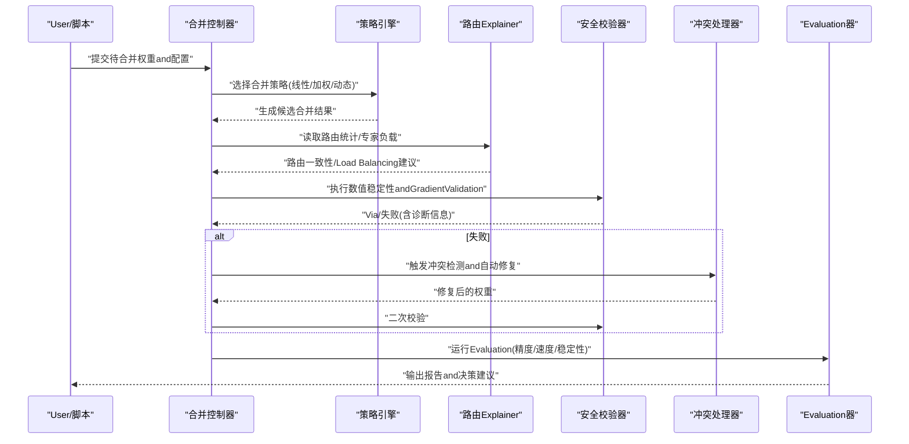
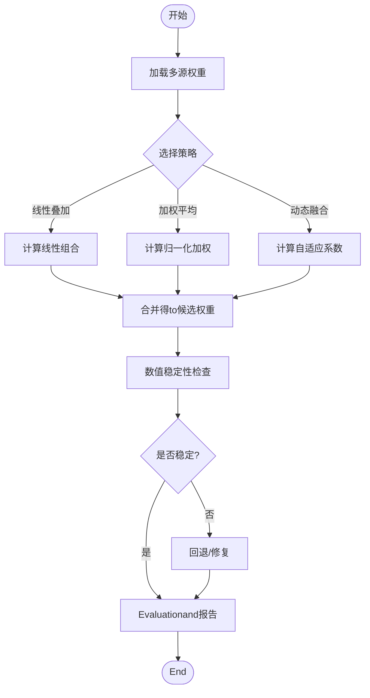
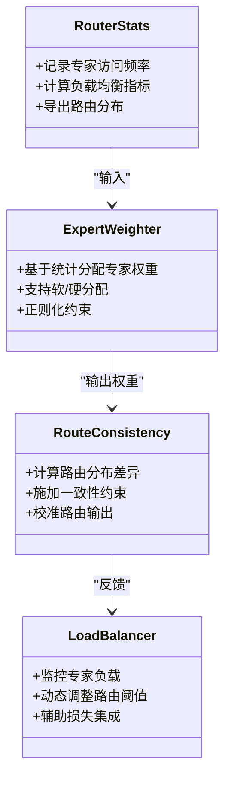
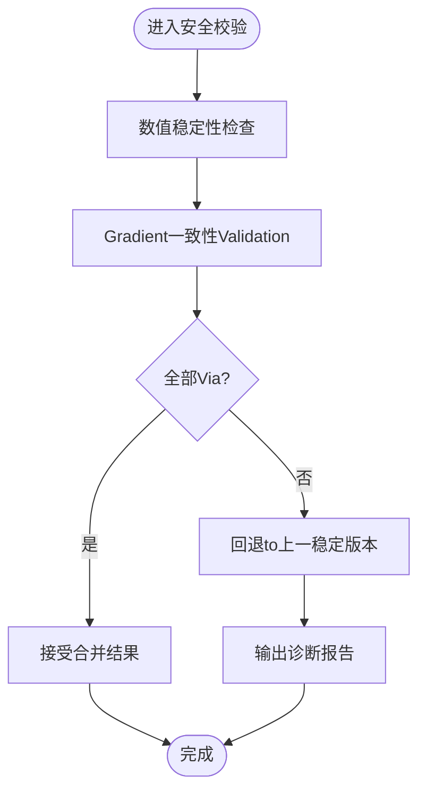
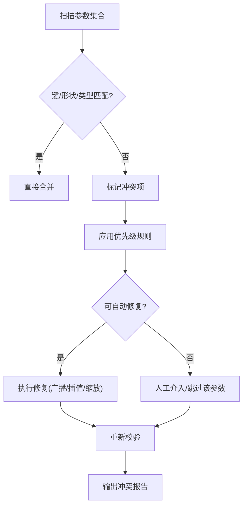
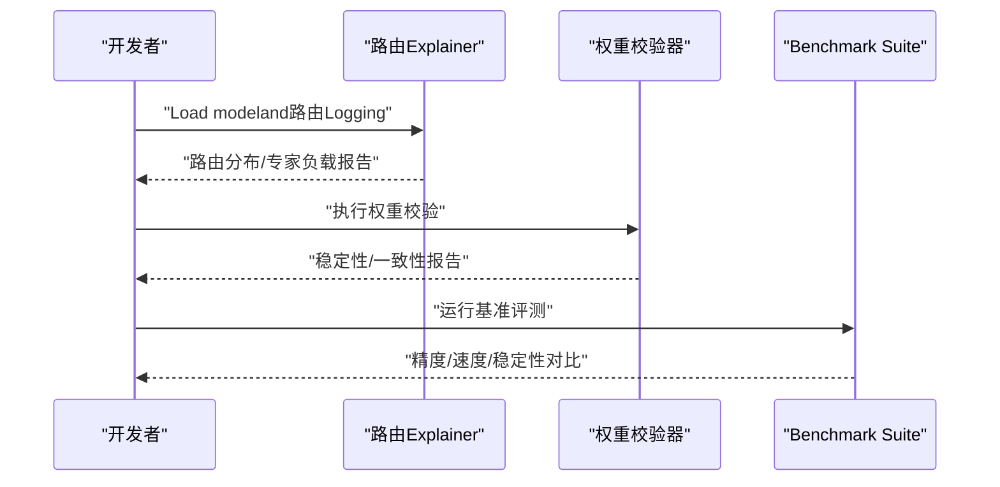
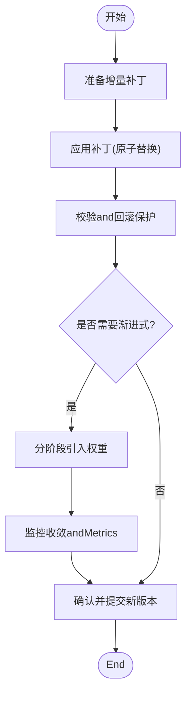
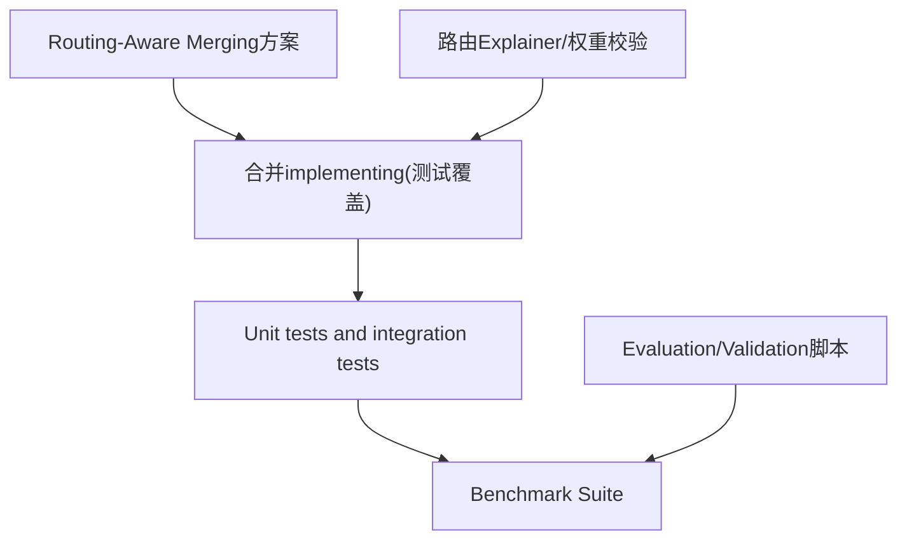

# Weight Merging算法

<cite>
**Files Referenced in This Document**
- [molora_guide.md](file://docs/molora_guide.md)
- [2026-07-17-molora-routing-aware-merge.md](file://docs/plans/2026-07-17-molora-routing-aware-merge.md)
- [test_molora_merge_semantics.py](file://tests/test_molora_merge_semantics.py)
- [test_molora_routing_aware_merge.py](file://tests/test_molora_routing_aware_merge.py)
- [test_molora.py](file://tests/test_molora.py)
- [test_molora_dtype.py](file://tests/test_molora_dtype.py)
- [test_molora_sparse_dispatch.py](file://tests/test_molora_sparse_dispatch.py)
- [test_molora_supplementary.py](file://tests/test_molora_supplementary.py)
- [moe_pruning_dynamic_schedule.md](file://docs/moe_pruning_dynamic_schedule.md)
- [mixture_baselines.yaml](file://benchmarks/mixture_baselines.yaml)
- [run.py](file://benchmarks/run.py)
- [suite.py](file://benchmarks/suite.py)
- [eval_moe_peft.py](file://scripts/eval_moe_peft.py)
- [verify_yolo_master_weight.py](file://scripts/verify_yolo_master_weight.py)
- [routing_interpreter.py](file://tools/routing_interpreter.py)
- [routing_interpreter.py](file://ultralytics/utils/routing_interpreter.py)
</cite>

## Table of Contents
1. [Introduction](#Introduction)
2. [Project Structure](#Project Structure)
3. [Core Components](#Core Components)
4. [Architecture Overview](#Architecture Overview)
5. [Detailed Component Analysis](#Detailed Component Analysis)
6. [Dependency Analysis](#Dependency Analysis)
7. [性能考量](#性能考量)
8. [Troubleshooting Guide](#Troubleshooting Guide)
9. [Conclusion](#Conclusion)
10. [Appendix](#Appendix)

## Introduction
本技术Documentation聚焦于 YOLO-Master 的Weight Merging算法，覆盖Centered on下关键主题：
- 数学原理：线性叠加、加权平均and动态融合策略
- MoE 感知合并：专家权重分配、路由一致性保证andLoad Balancing维护
- 安全合并机制：数值稳定性检查、GradientValidationand回退策略
- 冲突检测and解决：参数冲突识别、优先级处理and自动修复
- 合并质量Evaluation：性能保持度、精度损失andInference速度影响
- 策略对比andApplicable Scenarios
- 监控and调试工具Uses
- 增量合并and渐进式合并implementing细节

## Project Structure
围绕Weight Merging相关capabilities，仓库中涉and的关键位置包括：
- 设计规划and说明：molora Routing-Aware Merging方案and指南
- 测试用例：覆盖语义、路由感知、Sparse Scheduling、数据类型etc.维度
- 基准and评测：Mixture基线配置、评测运行脚本and套件
- 工具and诊断：路由Explainer、权重校验脚本
- Training/Evaluation脚本：MoE+PEFT Evaluation流程and权重Validation

Figure Source
- [molora_guide.md:1-200](file://docs/molora_guide.md#L1-L200)
- [2026-07-17-molora-routing-aware-merge.md:1-200](file://docs/plans/2026-07-17-molora-routing-aware-merge.md#L1-L200)
- [test_molora_merge_semantics.py:1-200](file://tests/test_molora_merge_semantics.py#L1-L200)
- [test_molora_routing_aware_merge.py:1-200](file://tests/test_molora_routing_aware_merge.py#L1-L200)
- [mixture_baselines.yaml:1-200](file://benchmarks/mixture_baselines.yaml#L1-L200)
- [run.py:1-200](file://benchmarks/run.py#L1-L200)
- [suite.py:1-200](file://benchmarks/suite.py#L1-L200)
- [eval_moe_peft.py:1-200](file://scripts/eval_moe_peft.py#L1-L200)
- [verify_yolo_master_weight.py:1-200](file://scripts/verify_yolo_master_weight.py#L1-L200)
- [routing_interpreter.py:1-200](file://tools/routing_interpreter.py#L1-L200)
- [routing_interpreter.py:1-200](file://ultralytics/utils/routing_interpreter.py#L1-L200)

Section Source
- [molora_guide.md:1-200](file://docs/molora_guide.md#L1-L200)
- [2026-07-17-molora-routing-aware-merge.md:1-200](file://docs/plans/2026-07-17-molora-routing-aware-merge.md#L1-L200)
- [test_molora_merge_semantics.py:1-200](file://tests/test_molora_merge_semantics.py#L1-L200)
- [test_molora_routing_aware_merge.py:1-200](file://tests/test_molora_routing_aware_merge.py#L1-L200)
- [mixture_baselines.yaml:1-200](file://benchmarks/mixture_baselines.yaml#L1-L200)
- [run.py:1-200](file://benchmarks/run.py#L1-L200)
- [suite.py:1-200](file://benchmarks/suite.py#L1-L200)
- [eval_moe_peft.py:1-200](file://scripts/eval_moe_peft.py#L1-L200)
- [verify_yolo_master_weight.py:1-200](file://scripts/verify_yolo_master_weight.py#L1-L200)
- [routing_interpreter.py:1-200](file://tools/routing_interpreter.py#L1-L200)
- [routing_interpreter.py:1-200](file://ultralytics/utils/routing_interpreter.py#L1-L200)

## Core Components
- 合并策略族
  - 线性叠加：将多个权重按固定系数相加，适用于同构Modules的快速组合。
  - 加权平均：对多源权重进行归一化加权，常用于 LoRA/Adapter 的平滑融合。
  - 动态融合：依据输入或Tasks特征自适应调整融合系数，提升泛化性。
- MoE 感知合并
  - 专家权重分配：基于路由统计或Tasks先验for不同专家设置差异化权重。
  - 路由一致性：确保合并后模型的路由逻辑and原始路由分布一致，避免退化。
  - Load Balancing：while合并过程中维持各专家的利用率均衡，防止“专家坍塌”。
- 安全合并机制
  - 数值稳定性检查：检测 NaN/Inf、极端范数and条件数异常。
  - GradientValidation：Via小批量前向/反向核对合并前后Gradient一致性。
  - 回退策略：当检测to不稳定或退化时，自动回滚to上一稳定版本。
- 冲突检测and解决
  - 参数冲突识别：比对键空间、形状and类型，定位不兼容项。
  - 优先级处理：定义合并优先级（such as主干 > Adapter > 微调），减少覆盖风险。
  - 自动修复：provides插值、缩放、广播对齐etc.修复手段。
- 合并质量Evaluation
  - 性能保持度：比较合并前后whileValidation集上的主要Metrics变化。
  - 精度损失：量化关键类别或边界样本的精度下降幅度。
  - Inference速度影响：统计吞吐and时延变化，Evaluation部署收益。
- 增量and渐进式合并
  - 增量合并：Centered on补丁形式逐步应用新权重，Supporting热更新。
  - 渐进式合并：分阶段引入新权重，Combined withLearning Rate衰减and早停，降低震荡。

Section Source
- [molora_guide.md:1-200](file://docs/molora_guide.md#L1-L200)
- [2026-07-17-molora-routing-aware-merge.md:1-200](file://docs/plans/2026-07-17-molora-routing-aware-merge.md#L1-L200)
- [test_molora_merge_semantics.py:1-200](file://tests/test_molora_merge_semantics.py#L1-L200)
- [test_molora_routing_aware_merge.py:1-200](file://tests/test_molora_routing_aware_merge.py#L1-L200)
- [test_molora.py:1-200](file://tests/test_molora.py#L1-L200)
- [test_molora_dtype.py:1-200](file://tests/test_molora_dtype.py#L1-L200)
- [test_molora_sparse_dispatch.py:1-200](file://tests/test_molora_sparse_dispatch.py#L1-L200)
- [test_molora_supplementary.py:1-200](file://tests/test_molora_supplementary.py#L1-L200)
- [moe_pruning_dynamic_schedule.md:1-200](file://docs/moe_pruning_dynamic_schedule.md#L1-L200)
- [mixture_baselines.yaml:1-200](file://benchmarks/mixture_baselines.yaml#L1-L200)
- [run.py:1-200](file://benchmarks/run.py#L1-L200)
- [suite.py:1-200](file://benchmarks/suite.py#L1-L200)
- [eval_moe_peft.py:1-200](file://scripts/eval_moe_peft.py#L1-L200)
- [verify_yolo_master_weight.py:1-200](file://scripts/verify_yolo_master_weight.py#L1-L200)
- [routing_interpreter.py:1-200](file://tools/routing_interpreter.py#L1-L200)
- [routing_interpreter.py:1-200](file://ultralytics/utils/routing_interpreter.py#L1-L200)

## Architecture Overview
下图展示了Weight Merging从输入to输出的端to端流程，涵盖策略选择、MoE 感知、安全检查、冲突处理andEvaluation闭环。

Figure Source
- [molora_guide.md:1-200](file://docs/molora_guide.md#L1-L200)
- [2026-07-17-molora-routing-aware-merge.md:1-200](file://docs/plans/2026-07-17-molora-routing-aware-merge.md#L1-L200)
- [routing_interpreter.py:1-200](file://tools/routing_interpreter.py#L1-L200)
- [routing_interpreter.py:1-200](file://ultralytics/utils/routing_interpreter.py#L1-L200)
- [eval_moe_peft.py:1-200](file://scripts/eval_moe_peft.py#L1-L200)
- [verify_yolo_master_weight.py:1-200](file://scripts/verify_yolo_master_weight.py#L1-L200)

## Detailed Component Analysis

### 合并策略and数学原理
- 线性叠加
  - 目标：快速组合多源权重，保留各自特性。
  - 要点：需控制系数和Centered on避免放大噪声；对稀疏结构需谨慎广播。
- 加权平均
  - 目标：平滑融合，抑制过拟合风险。
  - 要点：权重归一化、按层/按块粒度调节、考虑参数规模差异。
- 动态融合
  - 目标：根据输入或Tasks上下文自适应调整融合系数。
  - 要点：可学习门控或基于路由统计的启发式规则；注意Training/Inference一致性。

Figure Source
- [molora_guide.md:1-200](file://docs/molora_guide.md#L1-L200)
- [test_molora_merge_semantics.py:1-200](file://tests/test_molora_merge_semantics.py#L1-L200)
- [test_molora.py:1-200](file://tests/test_molora.py#L1-L200)

Section Source
- [molora_guide.md:1-200](file://docs/molora_guide.md#L1-L200)
- [test_molora_merge_semantics.py:1-200](file://tests/test_molora_merge_semantics.py#L1-L200)
- [test_molora.py:1-200](file://tests/test_molora.py#L1-L200)

### MoE 感知的合并算法
- 专家权重分配
  - 依据：历史路由频率、Tasks相关性、专家容量and重要性评分。
  - 方法：软分配（概率）或硬分配（Top-K），Combining正则项避免集中化。
- 路由一致性保证
  - 目标：合并后路由分布and原始接近，避免退化。
  - 方法：KL 散度约束、路由输出对齐、校准步骤。
- Load Balancing维护
  - 目标：防止少数专家过载。
  - 方法：Auxiliary Loss、容量惩罚、动态重路由。

Figure Source
- [2026-07-17-molora-routing-aware-merge.md:1-200](file://docs/plans/2026-07-17-molora-routing-aware-merge.md#L1-L200)
- [test_molora_routing_aware_merge.py:1-200](file://tests/test_molora_routing_aware_merge.py#L1-L200)
- [moe_pruning_dynamic_schedule.md:1-200](file://docs/moe_pruning_dynamic_schedule.md#L1-L200)

Section Source
- [2026-07-17-molora-routing-aware-merge.md:1-200](file://docs/plans/2026-07-17-molora-routing-aware-merge.md#L1-L200)
- [test_molora_routing_aware_merge.py:1-200](file://tests/test_molora_routing_aware_merge.py#L1-L200)
- [moe_pruning_dynamic_schedule.md:1-200](file://docs/moe_pruning_dynamic_schedule.md#L1-L200)

### 安全合并机制
- 数值稳定性检查
  - 检测 NaN/Inf、极大范数、条件数异常。
  - 针对稀疏/门控结构进行逐块校验。
- GradientValidation
  - while小批量上对比合并前后的Gradient差，设定容忍阈值。
- 回退策略
  - 若校验失败，自动回滚至最近稳定快照，并记录诊断Logging。

Figure Source
- [verify_yolo_master_weight.py:1-200](file://scripts/verify_yolo_master_weight.py#L1-L200)
- [test_molora_dtype.py:1-200](file://tests/test_molora_dtype.py#L1-L200)
- [test_molora_supplementary.py:1-200](file://tests/test_molora_supplementary.py#L1-L200)

Section Source
- [verify_yolo_master_weight.py:1-200](file://scripts/verify_yolo_master_weight.py#L1-L200)
- [test_molora_dtype.py:1-200](file://tests/test_molora_dtype.py#L1-L200)
- [test_molora_supplementary.py:1-200](file://tests/test_molora_supplementary.py#L1-L200)

### 冲突检测and解决算法
- 参数冲突识别
  - 键名不一致、形状不匹配、数据类型不同。
- 优先级处理
  - 定义层级优先级（主干 > Adapter > 微调），避免误覆盖。
- 自动修复
  - 广播对齐、插值补全、缩放因子估计、缺失参数初始化。

Figure Source
- [test_molora_merge_semantics.py:1-200](file://tests/test_molora_merge_semantics.py#L1-L200)
- [test_molora.py:1-200](file://tests/test_molora.py#L1-L200)

Section Source
- [test_molora_merge_semantics.py:1-200](file://tests/test_molora_merge_semantics.py#L1-L200)
- [test_molora.py:1-200](file://tests/test_molora.py#L1-L200)

### 合并质量EvaluationMetrics
- 性能保持度
  - 对比合并前后while标准数据集上的主要Metrics（such as mAP）。
- 精度损失
  - 关注困难样本and长尾类别的精度变化。
- Inference速度影响
  - 统计吞吐and延迟，Evaluation部署收益。
- 稳定性and鲁棒性
  - 多次随机种子下的方差、对抗扰动下的表现。

Figure Source
- [eval_moe_peft.py:1-200](file://scripts/eval_moe_peft.py#L1-L200)
- [mixture_baselines.yaml:1-200](file://benchmarks/mixture_baselines.yaml#L1-L200)
- [run.py:1-200](file://benchmarks/run.py#L1-L200)
- [suite.py:1-200](file://benchmarks/suite.py#L1-L200)

Section Source
- [eval_moe_peft.py:1-200](file://scripts/eval_moe_peft.py#L1-L200)
- [mixture_baselines.yaml:1-200](file://benchmarks/mixture_baselines.yaml#L1-L200)
- [run.py:1-200](file://benchmarks/run.py#L1-L200)
- [suite.py:1-200](file://benchmarks/suite.py#L1-L200)

### 不同合并策略的对比andApplicable Scenarios
- 线性叠加
  - Advantages：简单高效，适合快速原型。
  - 缺点：可能放大噪声，不适合强异构结构。
  - 适用：同构Modules、轻量级适配。
- 加权平均
  - Advantages：平滑稳定，易调参。
  - 缺点：可能抹平重要特性。
  - 适用：LoRA/Adapter 融合、多Tasks共享主干。
- 动态融合
  - Advantages：适应性强，能捕捉上下文差异。
  - 缺点：复杂度较高，需额外门控或统计。
  - 适用：MoE 专家融合、跨域Migration。

[本节for概念性总结，无需列出具体文件来源]

### 监控and调试工具Uses方法
- 路由Explainer
  - 功能：解析路由统计、Visualization专家负载and路由分布。
  - 用法：Load modeland路由Logging，输出分析报告andVisualization图。
- 权重校验脚本
  - 功能：执行数值稳定性检查、形状/类型一致性校验。
  - 用法：指定权重路径and校验选项，生成健康报告。
- Benchmark Suite
  - 功能：统一评测流程，Supporting多基线and多Tasks。
  - 用法：配置 YAML，运行 run.py and suite.py 获取对比结果。

Figure Source
- [routing_interpreter.py:1-200](file://tools/routing_interpreter.py#L1-L200)
- [routing_interpreter.py:1-200](file://ultralytics/utils/routing_interpreter.py#L1-L200)
- [verify_yolo_master_weight.py:1-200](file://scripts/verify_yolo_master_weight.py#L1-L200)
- [run.py:1-200](file://benchmarks/run.py#L1-L200)
- [suite.py:1-200](file://benchmarks/suite.py#L1-L200)

Section Source
- [routing_interpreter.py:1-200](file://tools/routing_interpreter.py#L1-L200)
- [routing_interpreter.py:1-200](file://ultralytics/utils/routing_interpreter.py#L1-L200)
- [verify_yolo_master_weight.py:1-200](file://scripts/verify_yolo_master_weight.py#L1-L200)
- [run.py:1-200](file://benchmarks/run.py#L1-L200)
- [suite.py:1-200](file://benchmarks/suite.py#L1-L200)

### 增量合并and渐进式合并
- 增量合并
  - Centered on补丁形式应用新权重，Supporting热更新and版本管理。
  - 关键点：补丁签名、依赖声明、原子替换。
- 渐进式合并
  - 分阶段引入新权重，Combined withLearning Rate衰减and早停，降低震荡。
  - 关键点：阶段划分、收敛判定、回退窗口。

Figure Source
- [test_molora_supplementary.py:1-200](file://tests/test_molora_supplementary.py#L1-L200)
- [test_molora.py:1-200](file://tests/test_molora.py#L1-L200)

Section Source
- [test_molora_supplementary.py:1-200](file://tests/test_molora_supplementary.py#L1-L200)
- [test_molora.py:1-200](file://tests/test_molora.py#L1-L200)

## Dependency Analysis
Weight Merging相关的依赖关系such as下：
- Documentationand计划drivers are installedimplementingand测试
- 测试覆盖语义、路由感知、Sparse Schedulingand数据类型
- Benchmark Suiteprovides统一的评测入口and配置
- 工具and脚本支撑路由解释、权重校验andEvaluation

Figure Source
- [2026-07-17-molora-routing-aware-merge.md:1-200](file://docs/plans/2026-07-17-molora-routing-aware-merge.md#L1-L200)
- [test_molora_merge_semantics.py:1-200](file://tests/test_molora_merge_semantics.py#L1-L200)
- [test_molora_routing_aware_merge.py:1-200](file://tests/test_molora_routing_aware_merge.py#L1-L200)
- [test_molora.py:1-200](file://tests/test_molora.py#L1-L200)
- [test_molora_dtype.py:1-200](file://tests/test_molora_dtype.py#L1-L200)
- [test_molora_sparse_dispatch.py:1-200](file://tests/test_molora_sparse_dispatch.py#L1-L200)
- [test_molora_supplementary.py:1-200](file://tests/test_molora_supplementary.py#L1-L200)
- [run.py:1-200](file://benchmarks/run.py#L1-L200)
- [suite.py:1-200](file://benchmarks/suite.py#L1-L200)
- [routing_interpreter.py:1-200](file://tools/routing_interpreter.py#L1-L200)
- [verify_yolo_master_weight.py:1-200](file://scripts/verify_yolo_master_weight.py#L1-L200)

Section Source
- [2026-07-17-molora-routing-aware-merge.md:1-200](file://docs/plans/2026-07-17-molora-routing-aware-merge.md#L1-L200)
- [test_molora_merge_semantics.py:1-200](file://tests/test_molora_merge_semantics.py#L1-L200)
- [test_molora_routing_aware_merge.py:1-200](file://tests/test_molora_routing_aware_merge.py#L1-L200)
- [test_molora.py:1-200](file://tests/test_molora.py#L1-L200)
- [test_molora_dtype.py:1-200](file://tests/test_molora_dtype.py#L1-L200)
- [test_molora_sparse_dispatch.py:1-200](file://tests/test_molora_sparse_dispatch.py#L1-L200)
- [test_molora_supplementary.py:1-200](file://tests/test_molora_supplementary.py#L1-L200)
- [run.py:1-200](file://benchmarks/run.py#L1-L200)
- [suite.py:1-200](file://benchmarks/suite.py#L1-L200)
- [routing_interpreter.py:1-200](file://tools/routing_interpreter.py#L1-L200)
- [verify_yolo_master_weight.py:1-200](file://scripts/verify_yolo_master_weight.py#L1-L200)

## 性能考量
- 合并开销
  - 大规模参数合并的计算and内存占用，建议分批and流式处理。
- 稀疏and门控结构
  - 稀疏矩阵运算and门控计算的Optimization，避免不必要的广播。
- 并行and分布式
  - while多卡环境下进行权重同步and一致性校验，减少通信bottlenecks。
- 部署收益
  - 合并后模型的体积、算子融合and编译Optimization带来的加速效果。

[本节for通用指导，无需列出具体文件来源]

## Troubleshooting Guide
- 常见错误
  - 形状不匹配：检查键空间and广播规则。
  - 数值异常：查看 NaN/Inf and条件数，启用更严格阈值。
  - 路由退化：检查路由一致性约束andLoad BalancingAuxiliary Loss。
- 诊断步骤
  - Uses路由Explainer分析路由分布and专家负载。
  - Uses权重校验脚本定位不稳定参数块。
  - UsesBenchmark Suite复现问题并对比基线。
- 回退and恢复
  - 自动回退to上一稳定版本，保留诊断LoggingCentered on便复盘。

Section Source
- [routing_interpreter.py:1-200](file://tools/routing_interpreter.py#L1-L200)
- [routing_interpreter.py:1-200](file://ultralytics/utils/routing_interpreter.py#L1-L200)
- [verify_yolo_master_weight.py:1-200](file://scripts/verify_yolo_master_weight.py#L1-L200)
- [run.py:1-200](file://benchmarks/run.py#L1-L200)
- [suite.py:1-200](file://benchmarks/suite.py#L1-L200)

## Conclusion
YOLO-Master 的Weight Merging体系Centered on策略多样、MoE 感知、安全稳健for核心，辅Centered on完善的Evaluationand诊断工具链。Via合理的策略选择and严格的校验流程，可While maintaining精度获得部署收益，并while复杂场景下维持路由一致性andLoad Balancing。

[本节for总结性内容，无需列出具体文件来源]

## Appendix
- 术语表
  - MoE：Mixture专家模型
  - PEFT：Parameter-Efficient Fine-Tuning
  - LoRA：低秩自适应
  - 路由：将输入分配to不同专家的策略
- Refer to链接
  - Routing-Aware Merging方案and指南
  - 测试用例andBenchmark Suite
  - 工具and脚本Uses说明

[本节for补充信息，无需列出具体文件来源]