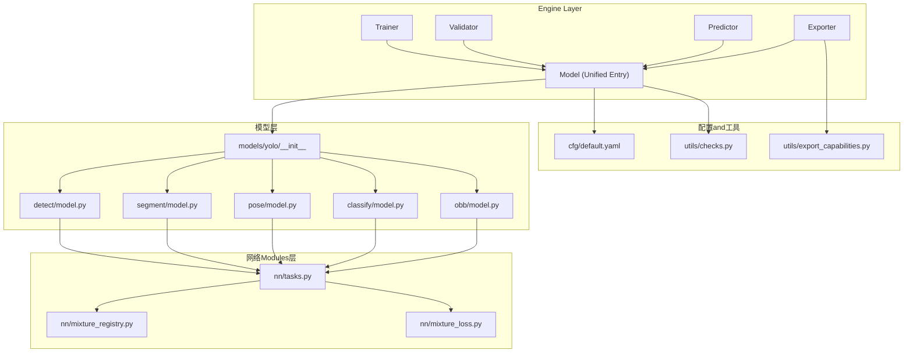
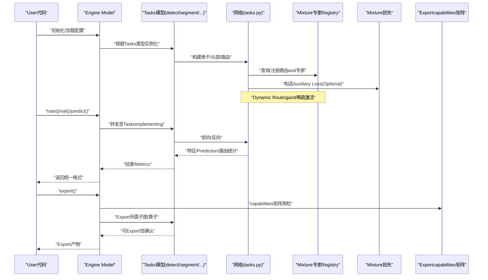
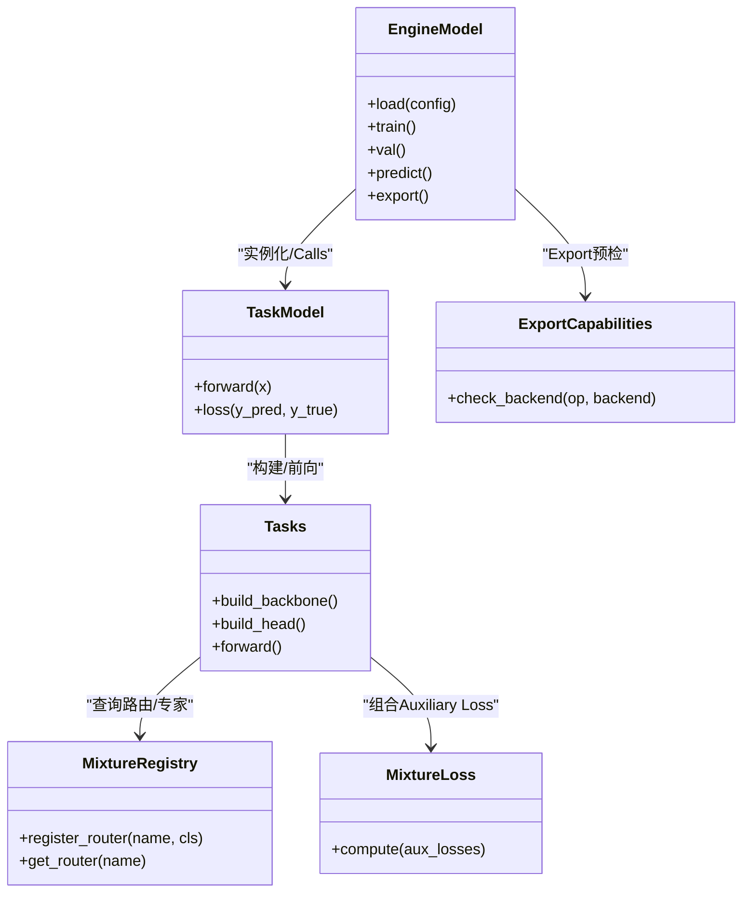

# Architecture Overview

<cite>
**Files Referenced in This Document**
- [ultralytics/engine/model.py](file://ultralytics/engine/model.py)
- [ultralytics/engine/trainer.py](file://ultralytics/engine/trainer.py)
- [ultralytics/engine/validator.py](file://ultralytics/engine/validator.py)
- [ultralytics/engine/predictor.py](file://ultralytics/engine/predictor.py)
- [ultralytics/engine/exporter.py](file://ultralytics/engine/exporter.py)
- [ultralytics/models/yolo/__init__.py](file://ultralytics/models/yolo/__init__.py)
- [ultralytics/models/yolo/detect/model.py](file://ultralytics/models/yolo/detect/model.py)
- [ultralytics/models/yolo/segment/model.py](file://ultralytics/models/yolo/segment/model.py)
- [ultralytics/models/yolo/pose/model.py](file://ultralytics/models/yolo/pose/model.py)
- [ultralytics/models/yolo/classify/model.py](file://ultralytics/models/yolo/classify/model.py)
- [ultralytics/models/yolo/obb/model.py](file://ultralytics/models/yolo/obb/model.py)
- [ultralytics/nn/tasks.py](file://ultralytics/nn/tasks.py)
- [ultralytics/nn/mixture_registry.py](file://ultralytics/nn/mixture_registry.py)
- [ultralytics/nn/mixture_loss.py](file://ultralytics/nn/mixture_loss.py)
- [ultralytics/cfg/default.yaml](file://ultralytics/cfg/default.yaml)
- [ultralytics/utils/export_capabilities.py](file://ultralytics/utils/export_capabilities.py)
- [ultralytics/utils/checks.py](file://ultralytics/utils/checks.py)
- [tests/test_mixture_config_registry.py](file://tests/test_mixture_config_registry.py)
- [tests/test_export_capability_matrix.py](file://tests/test_export_capability_matrix.py)
</cite>

## Table of Contents
1. [Introduction](#Introduction)
2. [Project Structure](#Project Structure)
3. [Core Components](#Core Components)
4. [Architecture Overview](#Architecture Overview)
5. [Detailed Component Analysis](#Detailed Component Analysis)
6. [Dependency Analysis](#Dependency Analysis)
7. [性能考量](#性能考量)
8. [Troubleshooting Guide](#Troubleshooting Guide)
9. [Conclusion](#Conclusion)
10. [Appendix](#Appendix)

## Introduction
本文件targeting开发者，系统性梳理 YOLO-Master 的整体架构and分层设计。重点说明：
- Engine Layer、模型层、网络Modules层的职责边界and协作方式
- Core Components之间的交互关系and数据流向
- Modules化设计and插件机制（Tasks模型注册、Mixture专家路由注册、Exportcapabilities矩阵）
- 配置管理系统的设计理念and扩展方式
- 关键设计决策and技术选型说明
- 架构图and组件关系图，帮助快速理解整体思路

## Project Structure
YOLO-Master 采用“引擎-模型-网络”三层解耦的Table of Contents组织方式：
- ultralytics/engine：Training、Validation、Inference、Exportetc.运行时引擎
- ultralytics/models：按Tasks划分的Model Encapsulation（检测、分割、姿态、分类、旋转框）
- ultralytics/nn：网络构建、Tasks抽象、Mixture专家（MoE/MoA）注册and损失
- ultralytics/cfg：默认配置and数据集/模型配置
- ultralytics/utils：通用工具（Exportcapabilities矩阵、检查器、Loggingetc.）
- tests：覆盖Registry、Exportcapabilities、数值稳定性etc.关键路径的测试

Figure Source
- [ultralytics/engine/model.py](file://ultralytics/engine/model.py)
- [ultralytics/models/yolo/__init__.py](file://ultralytics/models/yolo/__init__.py)
- [ultralytics/models/yolo/detect/model.py](file://ultralytics/models/yolo/detect/model.py)
- [ultralytics/models/yolo/segment/model.py](file://ultralytics/models/yolo/segment/model.py)
- [ultralytics/models/yolo/pose/model.py](file://ultralytics/models/yolo/pose/model.py)
- [ultralytics/models/yolo/classify/model.py](file://ultralytics/models/yolo/classify/model.py)
- [ultralytics/models/yolo/obb/model.py](file://ultralytics/models/yolo/obb/model.py)
- [ultralytics/nn/tasks.py](file://ultralytics/nn/tasks.py)
- [ultralytics/nn/mixture_registry.py](file://ultralytics/nn/mixture_registry.py)
- [ultralytics/nn/mixture_loss.py](file://ultralytics/nn/mixture_loss.py)
- [ultralytics/cfg/default.yaml](file://ultralytics/cfg/default.yaml)
- [ultralytics/utils/export_capabilities.py](file://ultralytics/utils/export_capabilities.py)
- [ultralytics/utils/checks.py](file://ultralytics/utils/checks.py)

Section Source
- [ultralytics/engine/model.py](file://ultralytics/engine/model.py)
- [ultralytics/models/yolo/__init__.py](file://ultralytics/models/yolo/__init__.py)
- [ultralytics/nn/tasks.py](file://ultralytics/nn/tasks.py)
- [ultralytics/cfg/default.yaml](file://ultralytics/cfg/default.yaml)

## Core Components
- Unified Model Entry Point（Engine Model）
  - 负责加载配置、实例化具体Tasks模型、管理设备and权重、暴露统一的 train/val/predict/export 接口
  - 作for上层 API and底层Tasks模型的适配层，shielding task differences
- Tasks模型（Task Models）
  - 针对 detect/segment/pose/classify/obb and other tasksprovides专用Model Encapsulation
  - Via工厂/注册机制由Unified entry point按需创建
- 网络andTasks抽象（Tasks & Modules）
  - 定义Tasks级构建流程、头/骨干组合、前向契约
  - 集成Mixture专家（MoE/MoA）Registryand损失计算，SupportingDynamic Routingand稀疏激活
- 运行时引擎（Trainer/Validator/Predictor/Exporter）
  - Trainer：Training循环、Optimizer、EMA、回调、分布式策略
  - Validator：Metrics计算、Evaluation协议、结果汇总
  - Predictor：Inference流水线、Post-Processing、Visualization
  - Exporter：多后端Export（ONNX/TensorRT/OpenVINO etc.），CombiningExportcapabilities矩阵进行预检and约束校验
- 配置系统（Config）
  - Centered on YAML ，provides默认配置andTasks/数据集/超参覆盖
  - while模型构建andExport阶段被读取并校验

Section Source
- [ultralytics/engine/model.py](file://ultralytics/engine/model.py)
- [ultralytics/engine/trainer.py](file://ultralytics/engine/trainer.py)
- [ultralytics/engine/validator.py](file://ultralytics/engine/validator.py)
- [ultralytics/engine/predictor.py](file://ultralytics/engine/predictor.py)
- [ultralytics/engine/exporter.py](file://ultralytics/engine/exporter.py)
- [ultralytics/models/yolo/__init__.py](file://ultralytics/models/yolo/__init__.py)
- [ultralytics/nn/tasks.py](file://ultralytics/nn/tasks.py)
- [ultralytics/nn/mixture_registry.py](file://ultralytics/nn/mixture_registry.py)
- [ultralytics/nn/mixture_loss.py](file://ultralytics/nn/mixture_loss.py)
- [ultralytics/cfg/default.yaml](file://ultralytics/cfg/default.yaml)

## Architecture Overview
下图展示从UserCallsto具体执行的关键路径，体现“Unified entry point → Tasks模型 → 网络Modules”的数据and控制流。

Figure Source
- [ultralytics/engine/model.py](file://ultralytics/engine/model.py)
- [ultralytics/models/yolo/detect/model.py](file://ultralytics/models/yolo/detect/model.py)
- [ultralytics/nn/tasks.py](file://ultralytics/nn/tasks.py)
- [ultralytics/nn/mixture_registry.py](file://ultralytics/nn/mixture_registry.py)
- [ultralytics/nn/mixture_loss.py](file://ultralytics/nn/mixture_loss.py)
- [ultralytics/utils/export_capabilities.py](file://ultralytics/utils/export_capabilities.py)

## Detailed Component Analysis

### Unified Model Entry Point（Engine Model）
- 职责
  - 解析配置、选择Tasks模型、管理设备and权重、统一对外 API
  - 协调 Trainer/Validator/Predictor/Exporter 的生命周期
- 关键点
  - 基于Tasks类型或配置文件中的 task 字段分派to对应模型类
  - 对Export流程进行capabilities预检，避免不Supporting的后端/算子组合
- 扩展点
  - 新增Tasks时，仅需whileTasks注册处添加映射，无需改动上层 API

Section Source
- [ultralytics/engine/model.py](file://ultralytics/engine/model.py)
- [ultralytics/models/yolo/__init__.py](file://ultralytics/models/yolo/__init__.py)

### Task Model Encapsulation（Detect/Segment/Pose/Classify/OBB）
- 职责
  - for不同视觉Tasksprovides专用Model Encapsulationand前/Post-Processing约定
  - 复用 tasks.py 的Tasks构建逻辑，聚焦Tasks特有分支and输出
- 关键点
  - 各Tasks模型继承自统一基类，保持接口一致
  - while需要时接入 MoE/MoA 路由andAuxiliary Loss
- 扩展点
  - 新增Tasks只需implementing最小必要的前向and输出规范，并ViaRegistry暴露

Section Source
- [ultralytics/models/yolo/detect/model.py](file://ultralytics/models/yolo/detect/model.py)
- [ultralytics/models/yolo/segment/model.py](file://ultralytics/models/yolo/segment/model.py)
- [ultralytics/models/yolo/pose/model.py](file://ultralytics/models/yolo/pose/model.py)
- [ultralytics/models/yolo/classify/model.py](file://ultralytics/models/yolo/classify/model.py)
- [ultralytics/models/yolo/obb/model.py](file://ultralytics/models/yolo/obb/model.py)

### 网络andTasks抽象（tasks.py）
- 职责
  - 定义Tasks级构建流程（骨干、颈部、头部）、前向契约、输出对齐
  - 集成Mixture专家（MoE/MoA）路由and损失，支撑稀疏激活and可解释性
- 关键点
  - ViaRegistry动态加载路由andExpert Modules
  - 将Auxiliary Loss（such as路由均衡、专家Uses率）and主TasksLoss combination
- 扩展点
  - 新增routing strategies或Expert Modules，需whileRegistry中声明并while tasks 中引用

Section Source
- [ultralytics/nn/tasks.py](file://ultralytics/nn/tasks.py)
- [ultralytics/nn/mixture_registry.py](file://ultralytics/nn/mixture_registry.py)
- [ultralytics/nn/mixture_loss.py](file://ultralytics/nn/mixture_loss.py)

### 运行时引擎（Trainer/Validator/Predictor/Exporter）
- Trainer
  - Training循环、Optimizer调度、EMA、回调、分布式通信
- Validator
  - Metrics计算、Evaluation协议、结果聚合and报告
- Predictor
  - Inference流水线、NMS/Post-Processing、Visualization
- Exporter
  - 多后端Export、capabilities矩阵预检、Export产物一致性校验

Section Source
- [ultralytics/engine/trainer.py](file://ultralytics/engine/trainer.py)
- [ultralytics/engine/validator.py](file://ultralytics/engine/validator.py)
- [ultralytics/engine/predictor.py](file://ultralytics/engine/predictor.py)
- [ultralytics/engine/exporter.py](file://ultralytics/engine/exporter.py)

### 配置管理系统（YAML + 默认配置）
- 设计理念
  - Centered on YAML for单一事实源，集中管理数据集、模型、超参andExport选项
  - Supporting层级覆盖（默认 → Tasks → User自定义）
- 扩展方式
  - 新增配置项需同步更新默认模板and校验逻辑
  - Export相关配置andcapabilities矩阵联动，确保Export可行性

Section Source
- [ultralytics/cfg/default.yaml](file://ultralytics/cfg/default.yaml)
- [ultralytics/utils/export_capabilities.py](file://ultralytics/utils/export_capabilities.py)
- [ultralytics/utils/checks.py](file://ultralytics/utils/checks.py)

### Mixture专家（MoE/MoA）and路由注册
- 设计要点
  - ViaRegistry统一管理路由andExpert Modules，Supporting热插拔
  - 损失侧provides辅助目标，引导路由均衡and专家利用率
- Validationand回归
  - 测试覆盖Registry行for、配置解析、Export兼容性etc.

Section Source
- [ultralytics/nn/mixture_registry.py](file://ultralytics/nn/mixture_registry.py)
- [ultralytics/nn/mixture_loss.py](file://ultralytics/nn/mixture_loss.py)
- [tests/test_mixture_config_registry.py](file://tests/test_mixture_config_registry.py)
- [tests/test_export_capability_matrix.py](file://tests/test_export_capability_matrix.py)

### Exportcapabilities矩阵and预检
- 作用
  - 维护各后端/算子的capabilities矩阵，用于Export前的可行性判断
  - 避免运行期失败，提升User体验and稳定性
- 集成点
  - while Exporter and Engine Model 的Export流程中Calls

Section Source
- [ultralytics/utils/export_capabilities.py](file://ultralytics/utils/export_capabilities.py)
- [ultralytics/engine/exporter.py](file://ultralytics/engine/exporter.py)

## Dependency Analysis
- 耦合and内聚
  - Engine Model andTasks模型之间ViaRegistry低耦合；Tasks模型内部高内聚
  - 网络层andTasks层Via tasks.py 契约解耦，便于替换路由/专家
- External Dependencies
  - Exportcapabilities矩阵and后端 SDK 的对接位于 utils/export_capabilities.py
  - 配置and校验位于 cfg and utils/checks.py
- Potential Cycles依赖
  - ViaRegistryand工厂模式避免直接硬编码导入，降低循环风险

Figure Source
- [ultralytics/engine/model.py](file://ultralytics/engine/model.py)
- [ultralytics/models/yolo/detect/model.py](file://ultralytics/models/yolo/detect/model.py)
- [ultralytics/nn/tasks.py](file://ultralytics/nn/tasks.py)
- [ultralytics/nn/mixture_registry.py](file://ultralytics/nn/mixture_registry.py)
- [ultralytics/nn/mixture_loss.py](file://ultralytics/nn/mixture_loss.py)
- [ultralytics/utils/export_capabilities.py](file://ultralytics/utils/export_capabilities.py)

Section Source
- [ultralytics/engine/model.py](file://ultralytics/engine/model.py)
- [ultralytics/nn/tasks.py](file://ultralytics/nn/tasks.py)
- [ultralytics/nn/mixture_registry.py](file://ultralytics/nn/mixture_registry.py)
- [ultralytics/utils/export_capabilities.py](file://ultralytics/utils/export_capabilities.py)

## 性能考量
- 稀疏激活and路由
  - Via MoE/MoA 路由减少每步计算量，Combined withAuxiliary Loss提升专家利用率均衡性
- ExportOptimization
  - 借助capabilities矩阵提前规避不可用算子，减少无效Export尝试
- Training稳定性
  - EMA、Gradient裁剪、AMP etc.策略while Trainer 中集成，保障收敛稳定
- I/O and批处理
  - Data Loadingand批大小自适应while数据管线and引擎中协同Optimization

[This section provides general guidance and does not directly analyze specific files]

## Troubleshooting Guide
- Export Failure
  - 检查Exportcapabilities矩阵是否Supporting目标后端and算子组合
  - Refer toExport预检错误信息，调整模型结构或后端选项
- 路由/专家异常
  - 核对Registry是否正确注册路由and专家
  - 检查Auxiliary Loss权重andRouting Regularization化参数
- 配置不一致
  - 对比默认配置and自定义配置的键名and取值范围
  - Uses检查器定位缺失或非法字段

Section Source
- [ultralytics/utils/export_capabilities.py](file://ultralytics/utils/export_capabilities.py)
- [ultralytics/utils/checks.py](file://ultralytics/utils/checks.py)
- [tests/test_export_capability_matrix.py](file://tests/test_export_capability_matrix.py)
- [tests/test_mixture_config_registry.py](file://tests/test_mixture_config_registry.py)

## Conclusion
YOLO-Master Via“引擎-模型-网络”的分层设计andRegistry机制，implementing了Tasks可扩展、路由可插拔、Export可Validation的体系。Unified entry point屏蔽了Tasks差异，Tasks模型聚焦领域特性，网络层provides通用构建and MoE/MoA capabilities。配置系统andExportcapabilities矩阵共同保障了易用性and稳定性。建议while新Tasksand新路由开发中遵循现有契约and注册流程，Centered on获得最佳的可维护性and性能收益。

## Appendix
- 术语
  - Engine Layer：Training/Validation/Inference/Export的运行时编排
  - 模型层：按TasksEncapsulates的模型implementing
  - 网络Modules层：骨干/颈部/头部/路由/损失的通用构建
- 关键设计决策
  - Registrydrivers are installed的Tasksand路由扩展
  - Export前置capabilities校验，避免运行期失败
  - Centered on YAML 的层级配置and覆盖

[本节for概念性补充，不直接分析具体文件]