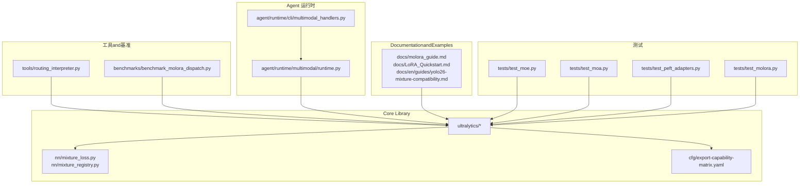
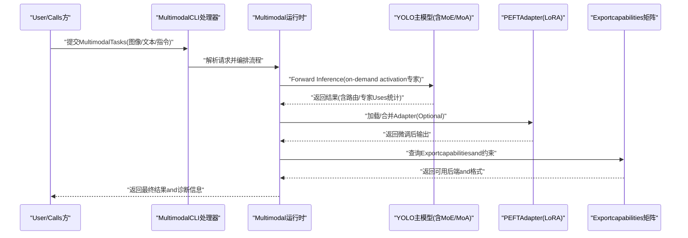
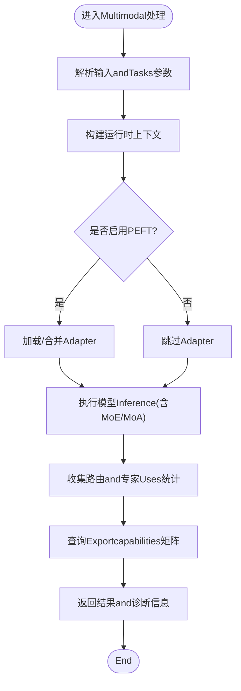
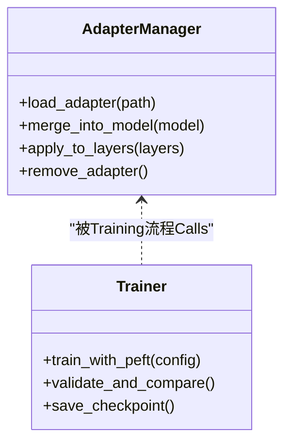
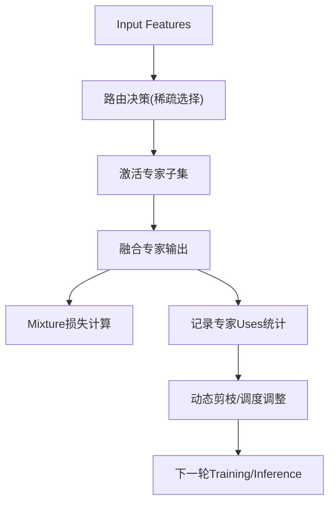
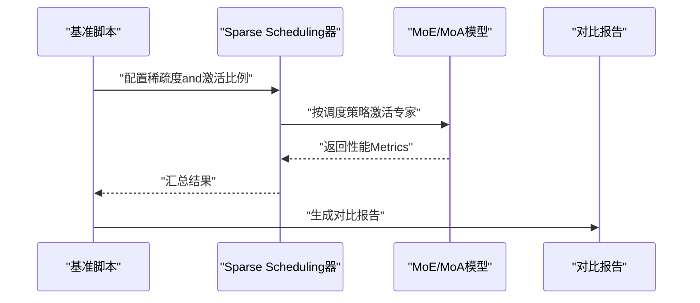
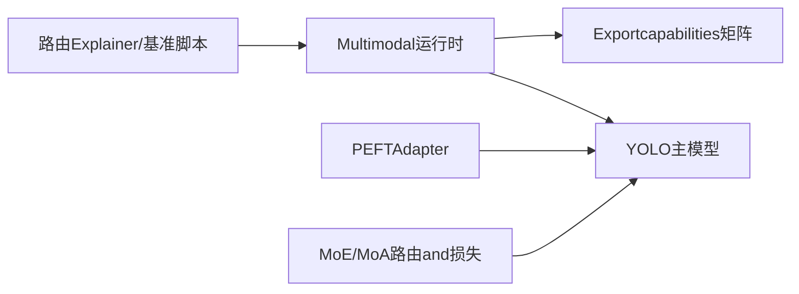

# Core Features

<cite>
**Files Referenced in This Document**
- [README.md](file://README.md)
- [YOLO-Master-v260721-MoA-MoE-MoT-PEFT-Planner-深度分析-v4.md](file://YOLO-Master-v260721-MoA-MoE-MoT-PEFT-Planner-深度分析-v4.md)
- [molora_guide.md](file://docs/molora_guide.md)
- [LoRA_Quickstart.md](file://docs/LoRA_Quickstart.md)
- [yolo26-mixture-compatibility.md](file://docs/en/guides/yolo26-mixture-compatibility.md)
- [moe_pruning_dynamic_schedule.md](file://docs/moe_pruning_dynamic_schedule.md)
- [routing_interpreter.py](file://tools/routing_interpreter.py)
- [test_moe.py](file://tests/test_moe.py)
- [test_molora.py](file://tests/test_molora.py)
- [test_moa.py](file://tests/test_moa.py)
- [test_peft_adapters.py](file://tests/test_peft_adapters.py)
- [mixture_loss.py](file://ultralytics/nn/mixture_loss.py)
- [mixture_registry.py](file://ultralytics/nn/mixture_registry.py)
- [export-capability-matrix.yaml](file://ultralytics/cfg/export-capability-matrix.yaml)
- [benchmark_molora_dispatch.py](file://benchmarks/benchmark_molora_dispatch.py)
- [compare_open_world_profiles.py](file://agent/runtime/cli/compare_open_world_profiles.py)
- [multimodal_handlers.py](file://agent/runtime/cli/multimodal_handlers.py)
- [runtime.py](file://agent/runtime/multimodal/runtime.py)
</cite>

## Table of Contents
1. [Introduction](#Introduction)
2. [Project Structure](#Project Structure)
3. [Core Features](#Core Features)
4. [Architecture Overview](#Architecture Overview)
5. [Detailed Component Analysis](#Detailed Component Analysis)
6. [Dependency Analysis](#Dependency Analysis)
7. [性能考量](#性能考量)
8. [Troubleshooting Guide](#Troubleshooting Guide)
9. [Conclusion](#Conclusion)
10. [Appendix](#Appendix)

## Introduction
本文件聚焦于 YOLO-Master-v260720 的Core Featuresand技术优势，围绕Multimodal计算机视觉Supporting、Parameter-Efficient Fine-Tuning（PEFT）、Mixture of Experts（MoE/MoA）etc.创新点unfold。Documentation从系统架构、关键Modules、数据流and处理逻辑、集成点、错误处理and性能特征etc.多维度进行系统化说明，并provides特性对比、推荐配置and最佳实践，帮助User快速选择合适的技术方案并落地应用。

## Project Structure
The repository adopts a modular organization：
- 模型andTrainingInference核心位于 ultralytics 子包，包含Tasks定义、Loss Function、Exportcapabilities矩阵、Mixture 相关implementingetc.。
- 工具and基准测试位于 tools、benchmarks Table of Contents，provides路由Explainer、调度and基准脚本。
- Agent 运行时while agent Table of Contents下，Encapsulates了Multimodal处理、CLI 入口andEvaluation流程。
- DocumentationandExamples位于 docs、examples，涵盖 LoRA Quick Start、Molora 指南、Yolo26 Mixture 兼容性说明etc.。
- 测试覆盖 MoE、MoA、PEFT、Molora etc.关键路径，确保稳定性and契约一致性。

Figure Source
- [mixture_loss.py](file://ultralytics/nn/mixture_loss.py)
- [mixture_registry.py](file://ultralytics/nn/mixture_registry.py)
- [export-capability-matrix.yaml](file://ultralytics/cfg/export-capability-matrix.yaml)
- [routing_interpreter.py](file://tools/routing_interpreter.py)
- [benchmark_molora_dispatch.py](file://benchmarks/benchmark_molora_dispatch.py)
- [multimodal_handlers.py](file://agent/runtime/cli/multimodal_handlers.py)
- [runtime.py](file://agent/runtime/multimodal/runtime.py)
- [molora_guide.md](file://docs/molora_guide.md)
- [LoRA_Quickstart.md](file://docs/LoRA_Quickstart.md)
- [yolo26-mixture-compatibility.md](file://docs/en/guides/yolo26-mixture-compatibility.md)
- [test_moe.py](file://tests/test_moe.py)
- [test_moa.py](file://tests/test_moa.py)
- [test_peft_adapters.py](file://tests/test_peft_adapters.py)
- [test_molora.py](file://tests/test_molora.py)

Section Source
- [README.md](file://README.md)
- [YOLO-Master-v260721-MoA-MoE-MoT-PEFT-Planner-深度分析-v4.md](file://YOLO-Master-v260721-MoA-MoE-MoT-PEFT-Planner-深度分析-v4.md)

## Core Features
本节概述三大创新特性and其技术原理、应用场景and性能优势。

- Multimodal计算机视觉Supporting
  - 技术要点：统一的Multimodal运行时and处理器，Supporting图像、文本etc.多源输入；Via运行时编排and融合策略，将不同模态的特征对齐and组合，提升开放世界理解and跨模态Tasks表现。
  - 应用场景：开放世界检测、图文检索、指令跟随的视觉问答、跨模态标注and评测。
  - 性能优势：减少多模型拼接带来的延迟and内存开销；ViaUnified Interfaceand批处理Optimization，提高吞吐and可Extensibility。
  - Refer toimplementingand入口：Multimodal CLI 处理器and运行时编排。

- Parameter-Efficient Fine-Tuning（PEFT）
  - 技术要点：Centered onLow-Rank Adaptation（LoRA）for代表的Adapter机制，冻结主干网络，仅Training少量可Training参数；Combining规划器andValidation流程，implementing领域Migrationand少样本快速适配。
  - 应用场景：垂直领域Object Detection、小样本场景、资源受限环境下的快速迭代。
  - 性能优势：显著降低显存占用andTraining成本；保持主干泛化capabilities提升下游Tasks精度。
  - Refer toimplementingand入口：Adapter测试and LoRA Quick StartDocumentation。

- Mixture of Experts（MoE/MoA）
  - 技术要点：引入稀疏路由andExpert Network，按输入动态激活部分专家；配套路由Explainer、动态剪枝and调度策略，平衡精度and计算量；Mixture 损失andRegistry管理多专家组合。
  - 应用场景：大规模Open-Vocabulary Detection、复杂场景下的细粒度识别、长尾类别增强。
  - 性能优势：while相近或更低计算预算下获得更高精度；Via稀疏激活and动态调度，implementing弹性算力利用。
  - Refer toimplementingand入口：Mixture 损失andRegistry、MoE/MoA 测试、路由Explainerand动态剪枝Documentation。

Section Source
- [multimodal_handlers.py](file://agent/runtime/cli/multimodal_handlers.py)
- [runtime.py](file://agent/runtime/multimodal/runtime.py)
- [LoRA_Quickstart.md](file://docs/LoRA_Quickstart.md)
- [molora_guide.md](file://docs/molora_guide.md)
- [mixture_loss.py](file://ultralytics/nn/mixture_loss.py)
- [mixture_registry.py](file://ultralytics/nn/mixture_registry.py)
- [routing_interpreter.py](file://tools/routing_interpreter.py)
- [moe_pruning_dynamic_schedule.md](file://docs/moe_pruning_dynamic_schedule.md)

## Architecture Overview
下图展示Multimodal、PEFT and MoE/MoA while系统中的交互关系and数据流。

Figure Source
- [multimodal_handlers.py](file://agent/runtime/cli/multimodal_handlers.py)
- [runtime.py](file://agent/runtime/multimodal/runtime.py)
- [mixture_loss.py](file://ultralytics/nn/mixture_loss.py)
- [mixture_registry.py](file://ultralytics/nn/mixture_registry.py)
- [export-capability-matrix.yaml](file://ultralytics/cfg/export-capability-matrix.yaml)

## Detailed Component Analysis

### Multimodal运行时and处理器
- 职责and流程
  - 接收Multimodal输入，解析Tasks类型and参数，构建运行时上下文。
  - 协调模型Inference、Adapter加载andExportcapabilities查询，形成End-to-end pipeline。
  - 收集路由and专家Uses统计，便于后续分析and调优。
- 关键implementing位置
  - Multimodal CLI 处理器and运行时编排。

Figure Source
- [multimodal_handlers.py](file://agent/runtime/cli/multimodal_handlers.py)
- [runtime.py](file://agent/runtime/multimodal/runtime.py)
- [export-capability-matrix.yaml](file://ultralytics/cfg/export-capability-matrix.yaml)

Section Source
- [multimodal_handlers.py](file://agent/runtime/cli/multimodal_handlers.py)
- [runtime.py](file://agent/runtime/multimodal/runtime.py)

### Parameter-Efficient Fine-Tuning（PEFT/LoRA）
- 设计要点
  - 冻结主干权重，注入Low-Rank Adaptation器，仅更新少量参数。
  - provides规划器andValidation流程，Supporting rank 选择、收敛监控and结果对比。
- Applicable Scenarios
  - 垂直领域检测、少样本快速适配、Edge Device Deployment前的轻量化微调。
- Refer toimplementingand入口
  - Adapter测试and LoRA Quick StartDocumentation。

Figure Source
- [test_peft_adapters.py](file://tests/test_peft_adapters.py)
- [LoRA_Quickstart.md](file://docs/LoRA_Quickstart.md)

Section Source
- [test_peft_adapters.py](file://tests/test_peft_adapters.py)
- [LoRA_Quickstart.md](file://docs/LoRA_Quickstart.md)

### Mixture of Experts（MoE/MoA）and路由解释
- 设计要点
  - 稀疏路由选择专家，动态激活Centered on降低计算量。
  - 配套路由Explainerand动态剪枝策略，平衡精度and效率。
  - Mixture 损失andRegistry管理多专家组合andExportcapabilities。
- Applicable Scenarios
  - Open-Vocabulary Detection、复杂场景细粒度识别、长尾类别增强。
- Refer toimplementingand入口
  - Mixture 损失andRegistry、路由Explainer、动态剪枝Documentation、MoE/MoA 测试。

Figure Source
- [mixture_loss.py](file://ultralytics/nn/mixture_loss.py)
- [mixture_registry.py](file://ultralytics/nn/mixture_registry.py)
- [routing_interpreter.py](file://tools/routing_interpreter.py)
- [moe_pruning_dynamic_schedule.md](file://docs/moe_pruning_dynamic_schedule.md)
- [test_moe.py](file://tests/test_moe.py)
- [test_moa.py](file://tests/test_moa.py)

Section Source
- [mixture_loss.py](file://ultralytics/nn/mixture_loss.py)
- [mixture_registry.py](file://ultralytics/nn/mixture_registry.py)
- [routing_interpreter.py](file://tools/routing_interpreter.py)
- [moe_pruning_dynamic_schedule.md](file://docs/moe_pruning_dynamic_schedule.md)
- [test_moe.py](file://tests/test_moe.py)
- [test_moa.py](file://tests/test_moa.py)

### Molora andSparse Scheduling
- 设计要点
  - 针对 MoE/MoA 的Sparse Schedulingand合并语义，提升Training稳定性andInference效率。
  - provides基准脚本and对比报告，辅助参数选择and方案Evaluation。
- Applicable Scenarios
  - 大规模数据集上的高效Training、边缘侧部署前的压缩and加速。
- Refer toimplementingand入口
  - Molora 指南and基准脚本。

Figure Source
- [benchmark_molora_dispatch.py](file://benchmarks/benchmark_molora_dispatch.py)
- [molora_guide.md](file://docs/molora_guide.md)
- [test_molora.py](file://tests/test_molora.py)

Section Source
- [benchmark_molora_dispatch.py](file://benchmarks/benchmark_molora_dispatch.py)
- [molora_guide.md](file://docs/molora_guide.md)
- [test_molora.py](file://tests/test_molora.py)

## Dependency Analysis
- 组件耦合and内聚
  - Multimodal运行时and处理器对模型andExportcapabilities矩阵存while直接依赖。
  - PEFT AdapterandTraining流程解耦良好，可Via管理器灵活加载and移除。
  - MoE/MoA 的路由and损失Modules相对独立，便于替换and扩展。
- External Dependenciesand集成点
  - Exportcapabilities矩阵作forUnified Interface，屏蔽后端差异，便于Cross-Platform Deployment。
  - 路由Explainerand基准脚本for调试andEvaluationprovides工具链支撑。

Figure Source
- [multimodal_handlers.py](file://agent/runtime/cli/multimodal_handlers.py)
- [runtime.py](file://agent/runtime/multimodal/runtime.py)
- [export-capability-matrix.yaml](file://ultralytics/cfg/export-capability-matrix.yaml)
- [routing_interpreter.py](file://tools/routing_interpreter.py)
- [benchmark_molora_dispatch.py](file://benchmarks/benchmark_molora_dispatch.py)

Section Source
- [export-capability-matrix.yaml](file://ultralytics/cfg/export-capability-matrix.yaml)
- [routing_interpreter.py](file://tools/routing_interpreter.py)
- [benchmark_molora_dispatch.py](file://benchmarks/benchmark_molora_dispatch.py)

## 性能考量
- MultimodalInference
  - 建议开启批处理and缓存策略，减少重复计算and I/O 开销。
  - 根据Tasks复杂度选择合适的前端预处理分辨率and裁剪策略。
- PEFT 微调
  - Set appropriately LoRA rank andLearning Rate，避免过拟合andGradient不稳定。
  - UsesValidation对比流程监控收敛and泛化效果。
- MoE/MoA 调度
  - Via动态剪枝and路由阈值调节，控制专家激活比例，平衡精度and延迟。
  - Combining基准脚本进行参数扫描，找to最优稀疏度and激活策略。

[This section provides general guidance and does not directly analyze specific files]

## Troubleshooting Guide
- Multimodal运行时异常
  - 检查输入解析and上下文构建是否正确，确认Tasks参数and后端capabilities匹配。
  - 查看路由and专家Uses统计，定位异常激活或路由崩溃。
- PEFT Adapter问题
  - 确认Adapter路径and版本兼容，避免加载失败或形状不匹配。
  - UsesValidation对比流程复现问题，逐步缩小范围。
- MoE/MoA 路由and损失
  - Uses路由Explainer分析路由分布and专家负载，发现热点或冷点。
  - 检查 Mixture 损失数值稳定性，必要时调整正则或Gradient裁剪。

Section Source
- [compare_open_world_profiles.py](file://agent/runtime/cli/compare_open_world_profiles.py)
- [routing_interpreter.py](file://tools/routing_interpreter.py)
- [mixture_loss.py](file://ultralytics/nn/mixture_loss.py)

## Conclusion
YOLO-Master-v260720 whileMultimodal Support、PEFT and MoE/MoA 方面provides了完整的技术栈and工程化capabilities。through a unified运行时、灵活的Adapter管理and稀疏路由调度，系统while精度、效率and可Extensibility之间取得良好平衡。建议while实际项目中Combining基准and诊断工具，选择合适的参数and策略，Centered onimplementing最佳性能and成本效益。

[This section is summary content and does not directly analyze specific files]

## Appendix
- 特性对比and建议
  - Multimodal vs 单模态：Multimodal适合开放世界and跨模态Tasks，但需关注融合策略and延迟。
  - PEFT vs 全量微调：PEFT 成本低、速度快，适合小样本and快速迭代；全量微调适合数据充足且追求极致精度的场景。
  - MoE/MoA vs 稠密模型：MoE/MoA while相同计算预算下可获得更高精度，但需精细调参and调度。
- 推荐配置and最佳实践
  - Multimodal：Prefer统一运行时andExportcapabilities矩阵，简化部署流程。
  - PEFT：从小 rank 起步，逐步增加复杂度，Combined withValidation对比流程。
  - MoE/MoA：Uses路由Explainerand动态剪枝，定期Evaluation专家Usesand性能Metrics。
- and其他版本的差异and改进
  - 新增Multimodal运行时and处理器，提升跨模态TasksSupporting。
  - 完善 PEFT 规划器andValidation流程，增强可复现性and易用性。
  - 强化 MoE/MoA 路由and损失Modules，provides更丰富的调度and诊断工具。

Section Source
- [YOLO-Master-v260721-MoA-MoE-MoT-PEFT-Planner-深度分析-v4.md](file://YOLO-Master-v260721-MoA-MoE-MoT-PEFT-Planner-深度分析-v4.md)
- [yolo26-mixture-compatibility.md](file://docs/en/guides/yolo26-mixture-compatibility.md)