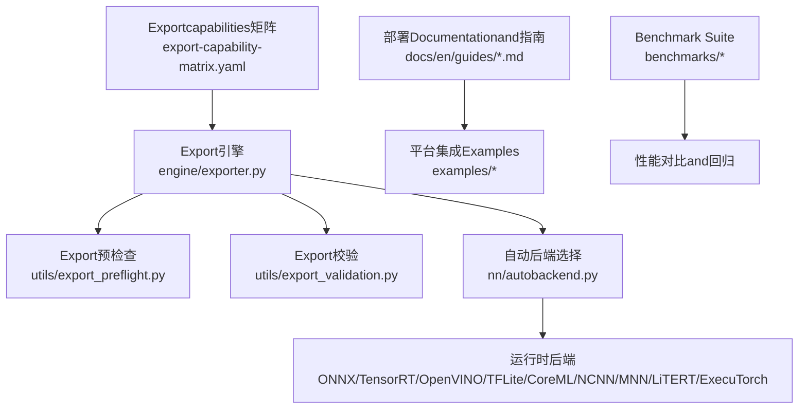
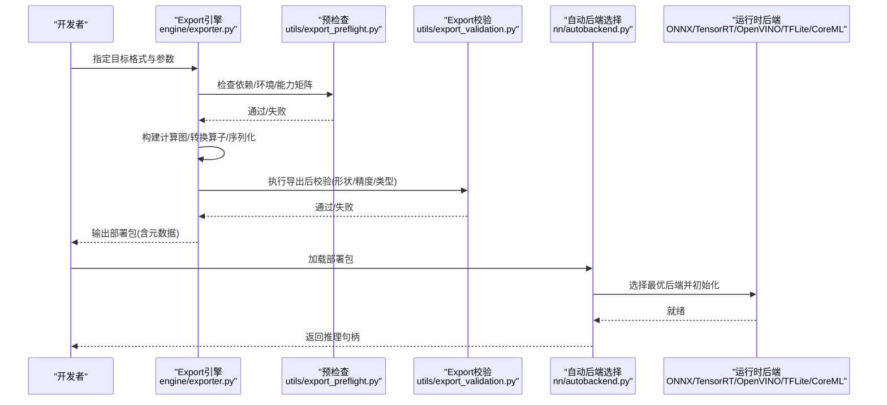
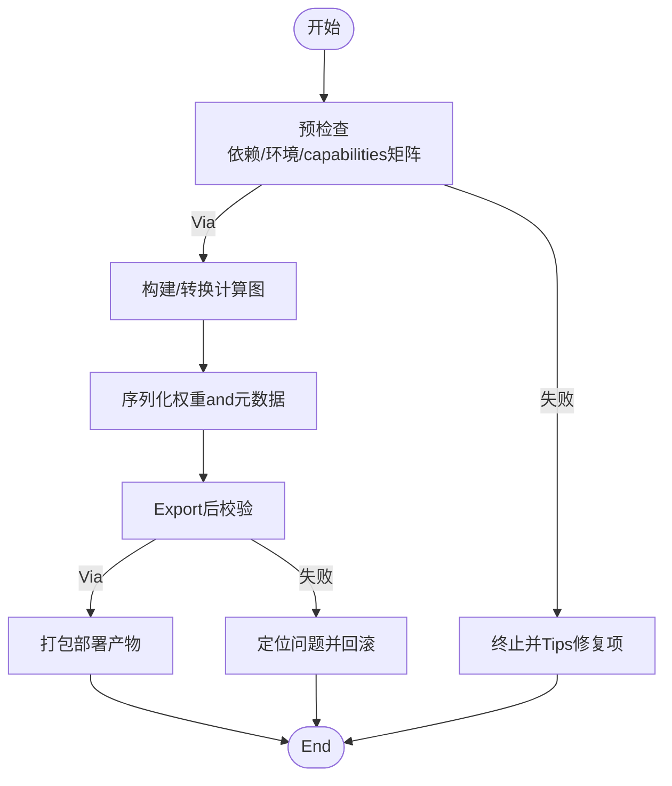
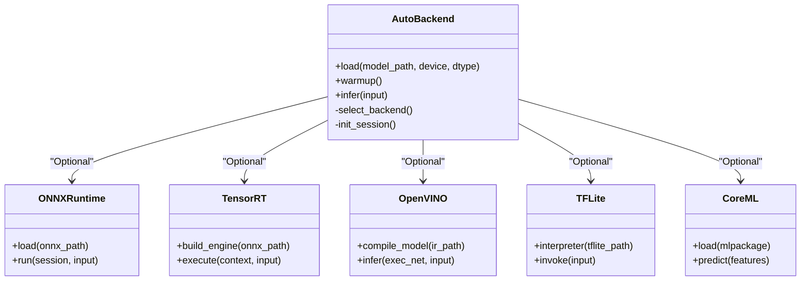
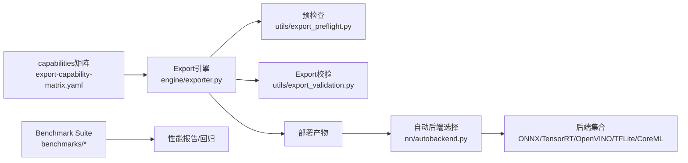

# Cross-Platform Deployment

<cite>
**Files Referenced in This Document**
- [README.md](file://README.md)
- [export-capability-matrix.yaml](file://ultralytics/cfg/export-capability-matrix.yaml)
- [exporter.py](file://ultralytics/engine/exporter.py)
- [autobackend.py](file://ultralytics/nn/autobackend.py)
- [export_capabilities.py](file://ultralytics/utils/export_capabilities.py)
- [export_preflight.py](file://ultralytics/utils/export_preflight.py)
- [export_validation.py](file://ultralytics/utils/export_validation.py)
- [benchmark_molora_dispatch.py](file://benchmarks/benchmark_molora_dispatch.py)
- [benchmark_mot_dispatch.py](file://benchmarks/benchmark_mot_dispatch.py)
- [run.py](file://benchmarks/run.py)
- [suite.py](file://benchmarks/suite.py)
- [suites.yaml](file://benchmarks/suites.yaml)
- [Dockerfile](file://docker/Dockerfile)
- [model-deployment-options.md](file://docs/en/guides/model-deployment-options.md)
- [model-deployment-practices.md](file://docs/en/guides/model-deployment-practices.md)
- [onnx.md](file://docs/en/integrations/onnx.md)
- [tensorrt.md](file://docs/en/integrations/tensorrt.md)
- [openvino.md](file://docs/en/integrations/openvino.md)
- [tflite.md](file://docs/en/integrations/tflite.md)
- [coreml.md](file://docs/en/integrations/coreml.md)
- [ncnn.md](file://docs/en/integrations/ncnn.md)
- [mnn.md](file://docs/en/integrations/mnn.md)
- [litert.md](file://docs/en/integrations/litert.md)
- [executorch.md](file://docs/en/integrations/executorch.md)
- [deepstream-nvidia-jetson.md](file://docs/en/guides/deepstream-nvidia-jetson.md)
- [nvidia-jetson.md](file://docs/en/guides/nvidia-jetson.md)
- [raspberry-pi.md](file://docs/en/guides/raspberry-pi.md)
- [coral-edge-tpu-on-raspberry-pi.md](file://docs/en/guides/coral-edge-tpu-on-raspberry-pi.md)
- [dlstreamer-intel.md](file://docs/en/guides/dlstreamer-intel.md)
- [triton-inference-server.md](file://docs/en/guides/triton-inference-server.md)
- [vertex-ai-deployment-with-docker.md](file://docs/en/guides/vertex-ai-deployment-with-docker.md)
- [YOLO-Master-Cross-Platform-Edge-Deployment/README.md](file://examples/YOLO-Master-Cross-Platform-Edge-Deployment/README.md)
- [YOLO-Master-Cross-Platform-Edge-Deployment/TECHNICAL_REPORT.md](file://examples/YOLO-Master-Cross-Platform-Edge-Deployment/TECHNICAL_REPORT.md)
- [YOLOv8-ONNXRuntime-CPP/main.cpp](file://examples/YOLOv8-ONNXRuntime-CPP/main.cpp)
- [YOLOv8-OpenVINO-CPP-Inference/main.cc](file://examples/YOLOv8-OpenVINO-CPP-Inference/main.cc)
- [YOLO-Series-ONNXRuntime-Rust/Cargo.toml](file://examples/YOLO-Series-ONNXRuntime-Rust/Cargo.toml)
- [YOLOv8-ONNXRuntime-Rust/src/lib.rs](file://examples/YOLOv8-ONNXRuntime-Rust/src/lib.rs)
</cite>

## Table of Contents
1. [Introduction](#Introduction)
2. [Project Structure](#Project Structure)
3. [Core Components](#Core Components)
4. [Architecture Overview](#Architecture Overview)
5. [Detailed Component Analysis](#Detailed Component Analysis)
6. [Dependency Analysis](#Dependency Analysis)
7. [性能考量](#性能考量)
8. [Troubleshooting Guide](#Troubleshooting Guide)
9. [Conclusion](#Conclusion)
10. [Appendix](#Appendix)

## Introduction
本文件聚焦于 YOLO-Master 的Cross-Platform Deploymentcapabilities，系统梳理Supporting的Export格式（ONNX、TensorRT、OpenVINO、TFLite、CoreML etc.），并给出边缘设备（移动端、嵌入式、IoT）部署方案andOptimization策略。同时provides C++、Rust etc.多语言Inference接口Uses指引，说明Containerized Deployment、云服务集成and生产环境最佳实践，并总结性能Optimization技巧、内存管理and资源调度方法，最后展示不同平台的部署案例and性能对比Refer to。

## Project Structure
围绕“Export—适配—运行”的主线，仓库中andCross-Platform Deployment相关的关键位置such as下：
- Exportcapabilities矩阵and配置：定义各后端/目标平台的capabilities覆盖and约束
- Export引擎and预检查/校验：统一Export入口、前置条件检查andExport后Validation
- 自动后端选择：根据模型and运行时环境自动选择最优Inference后端
- DocumentationandExamples：多平台部署指南、C++/Rust InferenceExamples、容器and云服务集成

Figure Source
- [export-capability-matrix.yaml:1-200](file://ultralytics/cfg/export-capability-matrix.yaml#L1-L200)
- [exporter.py:1-200](file://ultralytics/engine/exporter.py#L1-L200)
- [export_preflight.py:1-200](file://ultralytics/utils/export_preflight.py#L1-L200)
- [export_validation.py:1-200](file://ultralytics/utils/export_validation.py#L1-L200)
- [autobackend.py:1-200](file://ultralytics/nn/autobackend.py#L1-L200)

Section Source
- [export-capability-matrix.yaml:1-200](file://ultralytics/cfg/export-capability-matrix.yaml#L1-L200)
- [exporter.py:1-200](file://ultralytics/engine/exporter.py#L1-L200)
- [autobackend.py:1-200](file://ultralytics/nn/autobackend.py#L1-L200)

## Core Components
- Exportcapabilities矩阵：集中描述各Tasks/模型对Export格式的Supporting度、限制and推荐场景，便于while CI/CD 中做capabilities门禁and兼容性校验。
- Export引擎：统一的Export入口，负责参数解析、图转换、算子映射、权重序列化and产物打包。
- 预检查and校验：whileExport前进行环境and依赖检查，whileExport后进行数值一致性、形状and类型校验，降低线上风险。
- 自动后端选择：whileInference阶段根据可用库and硬件特性自动选择最优后端（such as TensorRT、OpenVINO、ONNX Runtime、TFLite、CoreML etc.）。
- Benchmark Suite：provides跨平台/跨后端的性能回归测试and对比基线，支撑持续Optimization。

Section Source
- [export-capability-matrix.yaml:1-200](file://ultralytics/cfg/export-capability-matrix.yaml#L1-L200)
- [exporter.py:1-200](file://ultralytics/engine/exporter.py#L1-L200)
- [export_capabilities.py:1-200](file://ultralytics/utils/export_capabilities.py#L1-L200)
- [export_preflight.py:1-200](file://ultralytics/utils/export_preflight.py#L1-L200)
- [export_validation.py:1-200](file://ultralytics/utils/export_validation.py#L1-L200)
- [autobackend.py:1-200](file://ultralytics/nn/autobackend.py#L1-L200)
- [run.py:1-200](file://benchmarks/run.py#L1-L200)
- [suite.py:1-200](file://benchmarks/suite.py#L1-L200)
- [suites.yaml:1-200](file://benchmarks/suites.yaml#L1-L200)

## Architecture Overview
下图展示了从Training权重to多平台部署产物的端to端流程，Centered onandInference阶段的自动后端选择机制。

Figure Source
- [exporter.py:1-200](file://ultralytics/engine/exporter.py#L1-L200)
- [export_preflight.py:1-200](file://ultralytics/utils/export_preflight.py#L1-L200)
- [export_validation.py:1-200](file://ultralytics/utils/export_validation.py#L1-L200)
- [autobackend.py:1-200](file://ultralytics/nn/autobackend.py#L1-L200)

## Detailed Component Analysis

### Exportcapabilities矩阵and兼容性
- 作用：Centered on结构化方式声明各Tasks/模型对Export格式的Supporting情况，包括是否Supporting、限制条件and推荐场景。
- Uses方式：whileExport前由预检查Modules读取，用于快速判断目标平台可行性；while CI 中作forcapabilities门禁。
- 典型字段：Tasks类型、模型规模、Export格式、输入尺寸范围、数据类型、算子覆盖、平台约束etc.。

Section Source
- [export-capability-matrix.yaml:1-200](file://ultralytics/cfg/export-capability-matrix.yaml#L1-L200)
- [export_capabilities.py:1-200](file://ultralytics/utils/export_capabilities.py#L1-L200)

### Export引擎and流程
- Unified entry point：接收目标格式、输入形状、量化/Optimization选项etc.参数，协调预检查、图转换、权重序列化and产物打包。
- 关键步骤：
  - 预检查：依赖库版本、平台capabilities、capabilities矩阵匹配
  - 图构建and转换：将 PyTorch 图转换for目标 IR（such as ONNX、TensorRT Engine、OpenVINO IR、TFLite、CoreML）
  - Export校验：形状/类型/数值一致性校验，确保可移植性
- 产物：包含模型权重、元数据andOptional的配置文件，便于下游加载器直接消费。

Figure Source
- [exporter.py:1-200](file://ultralytics/engine/exporter.py#L1-L200)
- [export_preflight.py:1-200](file://ultralytics/utils/export_preflight.py#L1-L200)
- [export_validation.py:1-200](file://ultralytics/utils/export_validation.py#L1-L200)

Section Source
- [exporter.py:1-200](file://ultralytics/engine/exporter.py#L1-L200)
- [export_preflight.py:1-200](file://ultralytics/utils/export_preflight.py#L1-L200)
- [export_validation.py:1-200](file://ultralytics/utils/export_validation.py#L1-L200)

### 自动后端选择and运行时
- 目标：while部署端根据可用库and硬件特性自动选择最优后端，屏蔽差异，简化Calls。
- 选择依据：已安装的后端库、GPU/加速器可用性、Model Format、输入形状and精度要求。
- 行for：初始化后端会话/引擎、预热、暴露统一Inference接口。

Figure Source
- [autobackend.py:1-200](file://ultralytics/nn/autobackend.py#L1-L200)

Section Source
- [autobackend.py:1-200](file://ultralytics/nn/autobackend.py#L1-L200)

### 多语言Inference接口（C++、Rust）
- C++ Examples：基于 ONNX Runtime 或 OpenVINO 的Inferenceimplementing，演示such as何Load model、预处理、InferenceandPost-Processing。
- Rust Examples：基于 ONNX Runtime 的 Rust 绑定，展示such as何while Cargo 项目中引入并CallsInference。
- 建议：Prefer统一后端抽象（AutoBackend）Encapsulates差异，上层业务仅依赖稳定接口。

Section Source
- [YOLOv8-ONNXRuntime-CPP/main.cpp:1-200](file://examples/YOLOv8-ONNXRuntime-CPP/main.cpp#L1-L200)
- [YOLOv8-OpenVINO-CPP-Inference/main.cc:1-200](file://examples/YOLOv8-OpenVINO-CPP-Inference/main.cc#L1-L200)
- [YOLO-Series-ONNXRuntime-Rust/Cargo.toml:1-200](file://examples/YOLO-Series-ONNXRuntime-Rust/Cargo.toml#L1-L200)
- [YOLOv8-ONNXRuntime-Rust/src/lib.rs:1-200](file://examples/YOLOv8-ONNXRuntime-Rust/src/lib.rs#L1-L200)

### Edge Device Deployment方案（移动端、嵌入式、IoT）
- 移动端：TFLite、CoreML、NCNN、MNN、LitERT、ExecuTorch etc.后端，Combining量化and图Optimization提升吞吐and降低延迟。
- 嵌入式/NPU：TensorRT（Jetson）、OpenVINO（Intel VPU/iGPU）、DL Streamer（Intel 视频管线）、Edge TPU（Coral）。
- IoT：轻量级后端（ONNX Runtime、NCNN、MNN）Combined with小模型and低精度Inference，满足功耗and体积约束。
- Refer to指南：
  - NVIDIA Jetson and DeepStream 集成
  - Raspberry Pi and Edge TPU 部署
  - Intel DL Streamer 视频流加速
  - 通用部署实践and注意事项

Section Source
- [deepstream-nvidia-jetson.md:1-200](file://docs/en/guides/deepstream-nvidia-jetson.md#L1-L200)
- [nvidia-jetson.md:1-200](file://docs/en/guides/nvidia-jetson.md#L1-L200)
- [raspberry-pi.md:1-200](file://docs/en/guides/raspberry-pi.md#L1-L200)
- [coral-edge-tpu-on-raspberry-pi.md:1-200](file://docs/en/guides/coral-edge-tpu-on-raspberry-pi.md#L1-L200)
- [dlstreamer-intel.md:1-200](file://docs/en/guides/dlstreamer-intel.md#L1-L200)
- [model-deployment-practices.md:1-200](file://docs/en/guides/model-deployment-practices.md#L1-L200)

### Containerized Deploymentand云服务集成
- Container Images：provides Dockerfile 用于构建标准化Inference镜像，固化依赖and运行时。
- 云服务：Vertex AI 部署Examples，Combining容器and云端 GPU/TPU 资源弹性伸缩。
- Inference服务：Triton Inference Server 集成，Supporting高并发、动态批处理and多模型管理。

Section Source
- [Dockerfile:1-200](file://docker/Dockerfile#L1-L200)
- [vertex-ai-deployment-with-docker.md:1-200](file://docs/en/guides/vertex-ai-deployment-with-docker.md#L1-L200)
- [triton-inference-server.md:1-200](file://docs/en/guides/triton-inference-server.md#L1-L200)

### 性能Optimization技巧、内存管理and资源调度
- 模型侧：
  - 选择合适的Export格式and量化策略（INT8/FP16）
  - 针对目标平台启用图Optimizationand内核融合
- 运行时侧：
  - Set appropriately线程数、批大小and内存池
  - Uses后端专属Optimization开关（such as TensorRT Optimization级别、OpenVINO 模式）
- 工程侧：
  - 预热and懒加载，避免冷启动抖动
  - 监控Metricsand回归基线，纳入 CI 持续Evaluation

Section Source
- [benchmark_molora_dispatch.py:1-200](file://benchmarks/benchmark_molora_dispatch.py#L1-L200)
- [benchmark_mot_dispatch.py:1-200](file://benchmarks/benchmark_mot_dispatch.py#L1-L200)
- [run.py:1-200](file://benchmarks/run.py#L1-L200)
- [suite.py:1-200](file://benchmarks/suite.py#L1-L200)
- [suites.yaml:1-200](file://benchmarks/suites.yaml#L1-L200)

### 不同平台部署案例and性能对比
- 交叉平台部署Examples：涵盖多平台脚本and报告，provides端to端复现路径。
- 性能对比：ViaBenchmark Suitewhile不同后端/设备上运行，产出延迟、吞吐and资源占用对比，辅助选型and调优。

Section Source
- [YOLO-Master-Cross-Platform-Edge-Deployment/README.md:1-200](file://examples/YOLO-Master-Cross-Platform-Edge-Deployment/README.md#L1-L200)
- [YOLO-Master-Cross-Platform-Edge-Deployment/TECHNICAL_REPORT.md:1-200](file://examples/YOLO-Master-Cross-Platform-Edge-Deployment/TECHNICAL_REPORT.md#L1-L200)
- [run.py:1-200](file://benchmarks/run.py#L1-L200)
- [suite.py:1-200](file://benchmarks/suite.py#L1-L200)
- [suites.yaml:1-200](file://benchmarks/suites.yaml#L1-L200)

## Dependency Analysis
- Export链路：Exportcapabilities矩阵 → Export引擎 → 预检查 → 图转换 → Export校验 → 产物打包
- Inference链路：自动后端选择 → 后端初始化 → Inference执行
- 基准链路：Benchmark Suite → 多后端/多设备运行 → 结果汇总and回归

Figure Source
- [export-capability-matrix.yaml:1-200](file://ultralytics/cfg/export-capability-matrix.yaml#L1-L200)
- [exporter.py:1-200](file://ultralytics/engine/exporter.py#L1-L200)
- [export_preflight.py:1-200](file://ultralytics/utils/export_preflight.py#L1-L200)
- [export_validation.py:1-200](file://ultralytics/utils/export_validation.py#L1-L200)
- [autobackend.py:1-200](file://ultralytics/nn/autobackend.py#L1-L200)
- [run.py:1-200](file://benchmarks/run.py#L1-L200)
- [suite.py:1-200](file://benchmarks/suite.py#L1-L200)
- [suites.yaml:1-200](file://benchmarks/suites.yaml#L1-L200)

Section Source
- [export-capability-matrix.yaml:1-200](file://ultralytics/cfg/export-capability-matrix.yaml#L1-L200)
- [exporter.py:1-200](file://ultralytics/engine/exporter.py#L1-L200)
- [autobackend.py:1-200](file://ultralytics/nn/autobackend.py#L1-L200)
- [run.py:1-200](file://benchmarks/run.py#L1-L200)
- [suite.py:1-200](file://benchmarks/suite.py#L1-L200)
- [suites.yaml:1-200](file://benchmarks/suites.yaml#L1-L200)

## 性能考量
- Export阶段：
  - 选择合适的数据类型and量化策略，平衡精度and速度
  - 利用capabilities矩阵规避不Supporting的算子组合
- Inference阶段：
  - 按设备特性调整线程数、批大小and内存池
  - Uses后端专属Optimization开关（such as TensorRT Optimization级别、OpenVINO 模式）
- 持续Optimization：
  - 建立Benchmark Suiteand回归基线，纳入 CI
  - 定期更新capabilities矩阵and兼容性清单

[This section provides general guidance and does not directly analyze specific files]

## Troubleshooting Guide
- Export Failure常见原因：
  - 依赖缺失或版本不兼容（预检查会Tips）
  - capabilities矩阵不匹配（目标格式/输入尺寸/数据类型不Supporting）
  - Export后校验失败（形状/类型/数值不一致）
- Inference异常常见原因：
  - 后端未正确安装或初始化失败
  - 模型and后端不兼容（such as算子不Supporting）
  - 资源不足（显存/内存/线程数）
- 定位手段：
  - 查看预检查andExport校验Logging
  - UsesBenchmark Suite复现并缩小范围
  - 切换后端或降级精度进行隔离

Section Source
- [export_preflight.py:1-200](file://ultralytics/utils/export_preflight.py#L1-L200)
- [export_validation.py:1-200](file://ultralytics/utils/export_validation.py#L1-L200)
- [autobackend.py:1-200](file://ultralytics/nn/autobackend.py#L1-L200)
- [run.py:1-200](file://benchmarks/run.py#L1-L200)

## Conclusion
YOLO-Master provides了从Exportto部署的Integrated Capabilities：Centered oncapabilities矩阵drivers are installed兼容性控制，Centered on统一Export引擎保障产物质量，Centered on自动后端选择简化多平台集成。Combining丰富的DocumentationandExamples，可while移动端、嵌入式and IoT etc.平台高效落地，并ViaBenchmark Suiteand容器化/云服务集成implementing生产级交付and持续Optimization。

[本节for总结，不直接分析具体文件]

## Appendix
- 多后端集成Documentation索引：
  - ONNX：[onnx.md](file://docs/en/integrations/onnx.md)
  - TensorRT：[tensorrt.md](file://docs/en/integrations/tensorrt.md)
  - OpenVINO：[openvino.md](file://docs/en/integrations/openvino.md)
  - TFLite：[tflite.md](file://docs/en/integrations/tflite.md)
  - CoreML：[coreml.md](file://docs/en/integrations/coreml.md)
  - NCNN：[ncnn.md](file://docs/en/integrations/ncnn.md)
  - MNN：[mnn.md](file://docs/en/integrations/mnn.md)
  - LitERT：[litert.md](file://docs/en/integrations/litert.md)
  - ExecuTorch：[executorch.md](file://docs/en/integrations/executorch.md)
- 部署选项and实践：
  - [model-deployment-options.md](file://docs/en/guides/model-deployment-options.md)
  - [model-deployment-practices.md](file://docs/en/guides/model-deployment-practices.md)