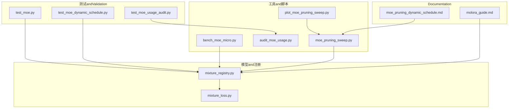
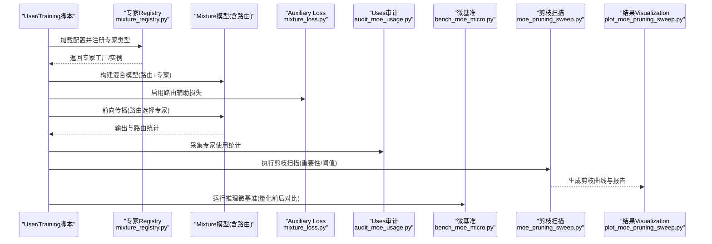
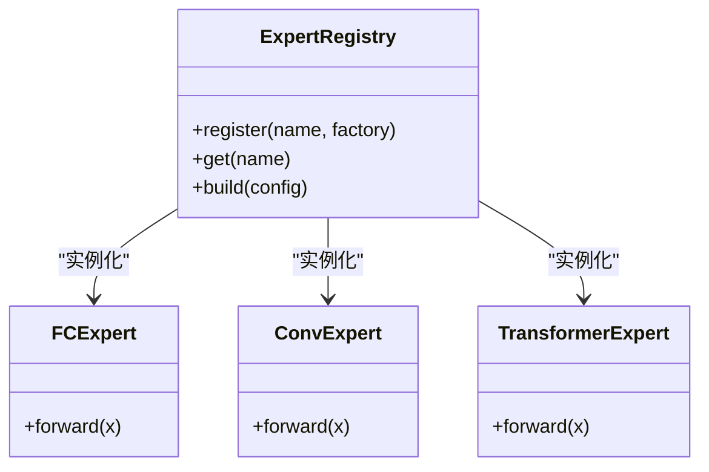
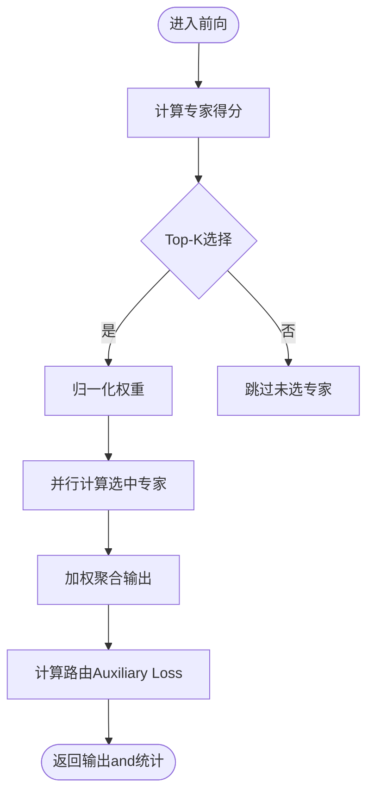
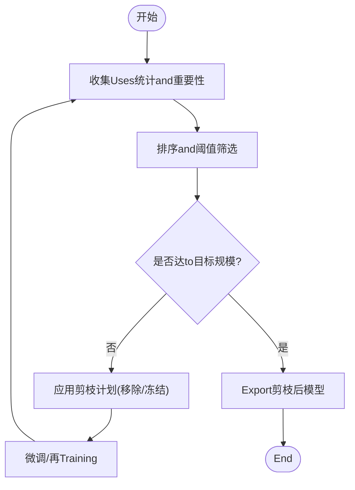
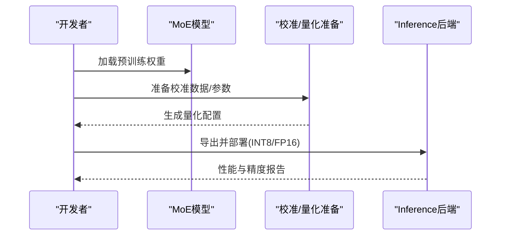
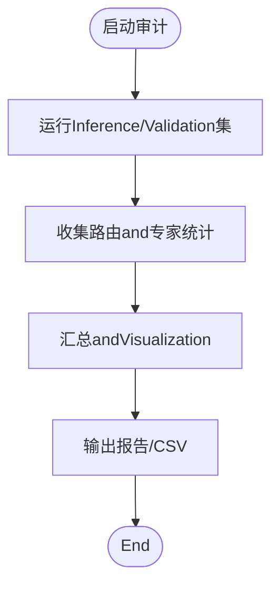
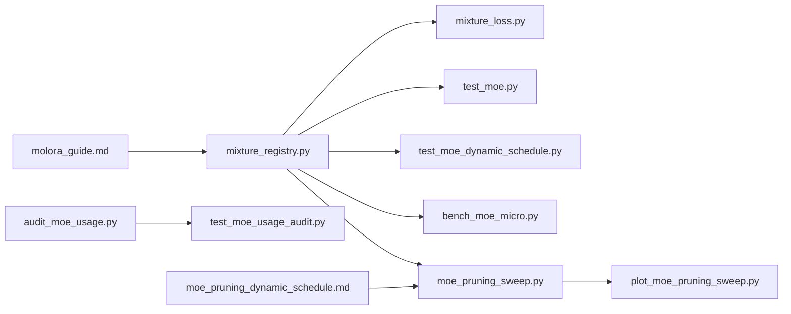

# Expert Network Management

<cite>
**Files Referenced in This Document**
- [mixture_loss.py](file://ultralytics/nn/mixture_loss.py)
- [mixture_registry.py](file://ultralytics/nn/mixture_registry.py)
- [test_moe.py](file://tests/test_moe.py)
- [test_moe_dynamic_schedule.py](file://tests/test_moe_dynamic_schedule.py)
- [test_moe_usage_audit.py](file://tests/test_moe_usage_audit.py)
- [bench_moe_micro.py](file://scripts/bench_moe_micro.py)
- [audit_moe_usage.py](file://scripts/audit_moe_usage.py)
- [moe_pruning_sweep.py](file://scripts/moe_pruning_sweep.py)
- [plot_moe_pruning_sweep.py](file://scripts/plot_moe_pruning_sweep.py)
- [issue52_pruning_results.csv](file://scripts/issue52_pruning_results.csv)
- [issue52_expert_usage_gini.csv](file://scripts/issue52_expert_usage_gini.csv)
- [issue52_per_layer_experts.csv](file://scripts/issue52_per_layer_experts.csv)
- [molora_guide.md](file://docs/molora_guide.md)
- [moe_pruning_dynamic_schedule.md](file://docs/moe_pruning_dynamic_schedule.md)
</cite>

## Table of Contents
1. [Introduction](#Introduction)
2. [Project Structure](#Project Structure)
3. [Core Components](#Core Components)
4. [Architecture Overview](#Architecture Overview)
5. [Detailed Component Analysis](#Detailed Component Analysis)
6. [Dependency Analysis](#Dependency Analysis)
7. [性能考量](#性能考量)
8. [Troubleshooting Guide](#Troubleshooting Guide)
9. [Conclusion](#Conclusion)
10. [Appendix](#Appendix)

## Introduction
本文件围绕“Expert Network（Mixture of Experts, MoE）”的创建、管理andOptimization机制unfold，聚焦Centered on下目标：
- 不同类型专家的implementingand选择：全连接专家、卷积专家、Transformer专家。
- 专家剪枝技术：重要性Evaluation、结构化剪枝and渐进式压缩。
- 专家量化技术：INT8andFP16对Inference速度and内存占用的影响andimplementing要点。
- 权重初始化策略、微调方法andMigration学习Supporting。
- Uses统计分析and性能调优指南。

for便于读者理解，Documentationwhile高层概览后逐步深入to代码级implementingand测试Validation路径，并辅Centered on流程图and时序图说明关键流程。

## Project Structure
本项目中andMoE相关的核心capabilities分布whilesuch as下位置：
- 模型and注册：Mixture路由and专家注册接口位于 nn Modules下，负责专家类型发现、实例化and生命周期管理。
- 损失and辅助项：MixtureTraining中的路由Auxiliary LossandLoad Balancingetc.逻辑集中while mixture_loss 中。
- 工具and脚本：provides微基准、Uses审计、剪枝扫描andVisualization脚本，用于Evaluationand调优。
- Documentationand计划：包含动态调度剪枝and MOLORA 相关指南，指导实践and实验设计。

Figure Source
- [mixture_registry.py](file://ultralytics/nn/mixture_registry.py)
- [mixture_loss.py](file://ultralytics/nn/mixture_loss.py)
- [test_moe.py](file://tests/test_moe.py)
- [test_moe_dynamic_schedule.py](file://tests/test_moe_dynamic_schedule.py)
- [test_moe_usage_audit.py](file://tests/test_moe_usage_audit.py)
- [bench_moe_micro.py](file://scripts/bench_moe_micro.py)
- [audit_moe_usage.py](file://scripts/audit_moe_usage.py)
- [moe_pruning_sweep.py](file://scripts/moe_pruning_sweep.py)
- [plot_moe_pruning_sweep.py](file://scripts/plot_moe_pruning_sweep.py)
- [molora_guide.md](file://docs/molora_guide.md)
- [moe_pruning_dynamic_schedule.md](file://docs/moe_pruning_dynamic_schedule.md)

Section Source
- [mixture_registry.py](file://ultralytics/nn/mixture_registry.py)
- [mixture_loss.py](file://ultralytics/nn/mixture_loss.py)
- [test_moe.py](file://tests/test_moe.py)
- [test_moe_dynamic_schedule.py](file://tests/test_moe_dynamic_schedule.py)
- [test_moe_usage_audit.py](file://tests/test_moe_usage_audit.py)
- [bench_moe_micro.py](file://scripts/bench_moe_micro.py)
- [audit_moe_usage.py](file://scripts/audit_moe_usage.py)
- [moe_pruning_sweep.py](file://scripts/moe_pruning_sweep.py)
- [plot_moe_pruning_sweep.py](file://scripts/plot_moe_pruning_sweep.py)
- [molora_guide.md](file://docs/molora_guide.md)
- [moe_pruning_dynamic_schedule.md](file://docs/moe_pruning_dynamic_schedule.md)

## Core Components
- 专家Registryand工厂：集中管理专家类型的注册、查找and实例化，屏蔽不同专家implementing的差异，统一对外接口。
- 路由andAuxiliary Loss：whileTraining阶段Via路由Auxiliary Loss促进Load Balancingand稳定收敛，避免“赢家通吃”。
- 动态调度and剪枝：基于Uses统计and重要性Metrics，动态调整每层专家数量或激活规模，implementing渐进式压缩。
- 量化andExport：whileInference阶段对专家权重进行精度转换（such asINT8/FP16），Combining后端加速提升吞吐并降低显存占用。
- 统计and可观测性：收集专家被Calls频次、负载分布and路由置信度，支撑诊断and调参。

Section Source
- [mixture_registry.py](file://ultralytics/nn/mixture_registry.py)
- [mixture_loss.py](file://ultralytics/nn/mixture_loss.py)
- [test_moe_dynamic_schedule.py](file://tests/test_moe_dynamic_schedule.py)
- [test_moe_usage_audit.py](file://tests/test_moe_usage_audit.py)

## Architecture Overview
下图展示了从配置toTraining、剪枝、量化的端to端流程，Centered onand各组件之间的交互关系。

Figure Source
- [mixture_registry.py](file://ultralytics/nn/mixture_registry.py)
- [mixture_loss.py](file://ultralytics/nn/mixture_loss.py)
- [audit_moe_usage.py](file://scripts/audit_moe_usage.py)
- [bench_moe_micro.py](file://scripts/bench_moe_micro.py)
- [moe_pruning_sweep.py](file://scripts/moe_pruning_sweep.py)
- [plot_moe_pruning_sweep.py](file://scripts/plot_moe_pruning_sweep.py)

## Detailed Component Analysis

### 专家类型andimplementing（全连接、卷积、Transformer）
- 全连接专家：Centered on线性变换for核心，适合通道维度的特征融合andTasks特定映射。
- 卷积专家：while空间维度上提取局部模式，常用于视觉Tasks的特征增强。
- Transformer专家：引入自注意力或多头Attention Mechanism，擅长建模长程依赖and跨模态交互。

上述三类专家through a unifiedRegistry接口暴露，外部无需关心具体implementing细节，即可按需组合and替换。

Figure Source
- [mixture_registry.py](file://ultralytics/nn/mixture_registry.py)

Section Source
- [mixture_registry.py](file://ultralytics/nn/mixture_registry.py)

### 路由andAuxiliary Loss
- 路由：根据Input Features计算每个专家的得分，按Top-K选择参and计算的专家集合，并进行加权聚合。
- Auxiliary Loss：whileTraining阶段加入路由辅助项，鼓励Load Balancingand多样性，防止少数专家垄断流量。

Figure Source
- [mixture_loss.py](file://ultralytics/nn/mixture_loss.py)

Section Source
- [mixture_loss.py](file://ultralytics/nn/mixture_loss.py)

### 动态调度and渐进式剪枝
- 重要性Evaluation：基于专家Uses频率、Gradient范数或激活幅度etc.Metrics衡量专家贡献。
- 结构化剪枝：按层或按专家粒度移除低重要性单元，保持张量结构的规整性，利于部署。
- 渐进式压缩：while多轮Training中逐步提高剪枝强度，Combined with再Training恢复精度。

Figure Source
- [moe_pruning_sweep.py](file://scripts/moe_pruning_sweep.py)
- [plot_moe_pruning_sweep.py](file://scripts/plot_moe_pruning_sweep.py)
- [moe_pruning_dynamic_schedule.md](file://docs/moe_pruning_dynamic_schedule.md)

Section Source
- [test_moe_dynamic_schedule.py](file://tests/test_moe_dynamic_schedule.py)
- [moe_pruning_sweep.py](file://scripts/moe_pruning_sweep.py)
- [plot_moe_pruning_sweep.py](file://scripts/plot_moe_pruning_sweep.py)
- [moe_pruning_dynamic_schedule.md](file://docs/moe_pruning_dynamic_schedule.md)

### 量化andInferenceOptimization（INT8/FP16）
- FP16：减少显存带宽压力，提升吞吐；需关注数值稳定性and溢出问题。
- INT8：进一步压缩权重and激活，显著降低内存and算力需求；需要校准集and量化感知Training（QAT）Centered on获得更好精度。
- 后端集成：CombiningONNX/TensorRT/OpenVINOetc.后端，利用hardware acceleration算子获得端to端收益。

Figure Source
- [bench_moe_micro.py](file://scripts/bench_moe_micro.py)
- [molora_guide.md](file://docs/molora_guide.md)

Section Source
- [bench_moe_micro.py](file://scripts/bench_moe_micro.py)
- [molora_guide.md](file://docs/molora_guide.md)

### 权重初始化、微调andMigration学习
- 初始化策略：针对不同类型专家采用合适的初始化（such asXavier/Kaiming），保证初始激活方差稳定。
- 微调方法：冻结主干或路由，仅Training专家andAdapter；或UsesLoRA/MOLORAetc.Parameter-Efficient Fine-Tuning方案。
- Migration学习：while不同数据集或Tasks间复用已Training专家，Combining路由重校准快速适配新领域。

Section Source
- [molora_guide.md](file://docs/molora_guide.md)
- [test_moe.py](file://tests/test_moe.py)

### Uses统计分析and诊断
- 统计维度：专家被Calls次数、平均权重、Top-K命中率、Gini系数etc.。
- 诊断用途：识别“冷专家”and“热专家”，指导剪枝and再平衡策略。
- 自动化审计：Via审计脚本批量采集and分析，形成报告andVisualization。

Figure Source
- [audit_moe_usage.py](file://scripts/audit_moe_usage.py)
- [test_moe_usage_audit.py](file://tests/test_moe_usage_audit.py)

Section Source
- [audit_moe_usage.py](file://scripts/audit_moe_usage.py)
- [test_moe_usage_audit.py](file://tests/test_moe_usage_audit.py)

## Dependency Analysis
- Registryand损失：Registry负责专家实例化，损失ModuleswhileTraining时注入路由辅助项，二者共同保障MoE的可Training性and可Extensibility。
- 测试and脚本：单元测试覆盖注册、动态调度andUses审计；脚本provides微基准、剪枝扫描andVisualization，形成闭环Validation。
- Documentationand计划：动态调度剪枝andMOLORA指南for工程实践provides方法论and参数建议。

Figure Source
- [mixture_registry.py](file://ultralytics/nn/mixture_registry.py)
- [mixture_loss.py](file://ultralytics/nn/mixture_loss.py)
- [test_moe.py](file://tests/test_moe.py)
- [test_moe_dynamic_schedule.py](file://tests/test_moe_dynamic_schedule.py)
- [test_moe_usage_audit.py](file://tests/test_moe_usage_audit.py)
- [bench_moe_micro.py](file://scripts/bench_moe_micro.py)
- [audit_moe_usage.py](file://scripts/audit_moe_usage.py)
- [moe_pruning_sweep.py](file://scripts/moe_pruning_sweep.py)
- [plot_moe_pruning_sweep.py](file://scripts/plot_moe_pruning_sweep.py)
- [molora_guide.md](file://docs/molora_guide.md)
- [moe_pruning_dynamic_schedule.md](file://docs/moe_pruning_dynamic_schedule.md)

Section Source
- [mixture_registry.py](file://ultralytics/nn/mixture_registry.py)
- [mixture_loss.py](file://ultralytics/nn/mixture_loss.py)
- [test_moe.py](file://tests/test_moe.py)
- [test_moe_dynamic_schedule.py](file://tests/test_moe_dynamic_schedule.py)
- [test_moe_usage_audit.py](file://tests/test_moe_usage_audit.py)
- [bench_moe_micro.py](file://scripts/bench_moe_micro.py)
- [audit_moe_usage.py](file://scripts/audit_moe_usage.py)
- [moe_pruning_sweep.py](file://scripts/moe_pruning_sweep.py)
- [plot_moe_pruning_sweep.py](file://scripts/plot_moe_pruning_sweep.py)
- [molora_guide.md](file://docs/molora_guide.md)
- [moe_pruning_dynamic_schedule.md](file://docs/moe_pruning_dynamic_schedule.md)

## 性能考量
- 路由开销：Top-K选择and加权聚合带来额外计算，应控制K值and专家数量，避免bottlenecks。
- 并行度：确保专家计算能充分利用GPU并行，必要时分片或流水线化。
- 量化收益：FP16通常无精度损失且提速明显；INT8需校准and可能的QAT，收益取决于后端and硬件。
- 剪枝权衡：渐进式剪枝可while维持精度降低规模，但需足够微调步数andLearning Rate策略。
- 监控and回归：建立微基准and回归测试，Tracking延迟、吞吐and精度变化。

[This section provides general guidance and does not directly analyze specific files]

## Troubleshooting Guide
- 路由不稳定或NaN：检查Auxiliary Loss权重、Learning Rateand数值稳定性；确认路由得分范围and归一化。
- 专家冷/热不均：观察Uses统计andGini系数，适当调整路由温度或Auxiliary Loss强度。
- 剪枝后精度下降：降低剪枝强度、增加微调轮次或采用渐进式策略；重新校准量化参数。
- 量化异常：核对校准集代表性、量化范围and后端兼容性；必要时回退至FP16或半精度QAT。
- Export Failure：检查算子Supportingand图重写规则，确保路由and专家结构兼容目标后端。

Section Source
- [test_moe.py](file://tests/test_moe.py)
- [test_moe_dynamic_schedule.py](file://tests/test_moe_dynamic_schedule.py)
- [test_moe_usage_audit.py](file://tests/test_moe_usage_audit.py)
- [bench_moe_micro.py](file://scripts/bench_moe_micro.py)

## Conclusion
本项目provides了完整的MoEExpert Network Managementcapabilities：多类型专家的统一注册and实例化、Training期路由Auxiliary Loss、动态调度and渐进式剪枝、量化andInferenceOptimization、Centered onand完善的统计and诊断工具链。Via合理配置路由andAuxiliary Loss、实施渐进式剪枝and量化，可While maintaining精度的前提下显著提升效率and可部署性。

[This section is summary content and does not directly analyze specific files]

## Appendix
- 剪枝andUses统计Examples数据（来自脚本输出）：
  - [issue52_pruning_results.csv](file://scripts/issue52_pruning_results.csv)
  - [issue52_expert_usage_gini.csv](file://scripts/issue52_expert_usage_gini.csv)
  - [issue52_per_layer_experts.csv](file://scripts/issue52_per_layer_experts.csv)

Section Source
- [issue52_pruning_results.csv](file://scripts/issue52_pruning_results.csv)
- [issue52_expert_usage_gini.csv](file://scripts/issue52_expert_usage_gini.csv)
- [issue52_per_layer_experts.csv](file://scripts/issue52_per_layer_experts.csv)