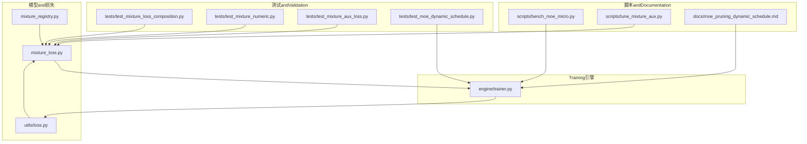
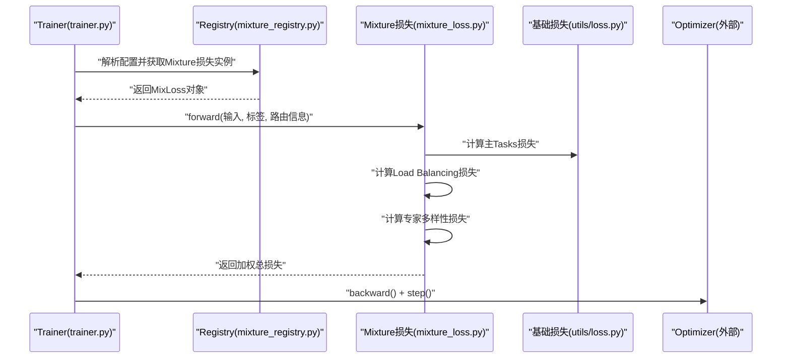
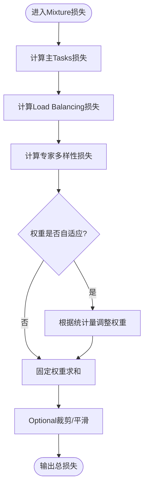
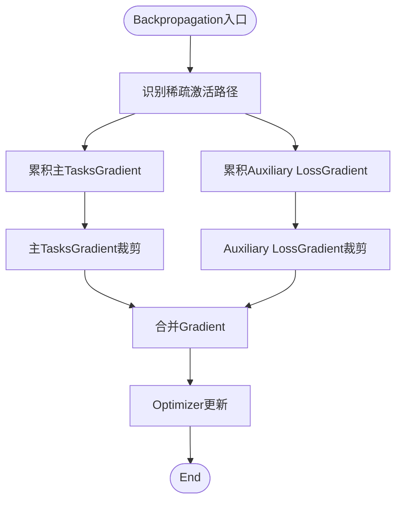
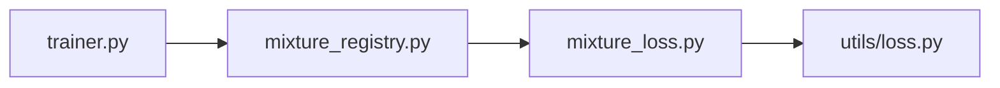

# Mixture Loss and Training Strategy

<cite>
**Files Referenced in This Document**
- [mixture_loss.py](file://ultralytics/nn/mixture_loss.py)
- [mixture_registry.py](file://ultralytics/nn/mixture_registry.py)
- [trainer.py](file://ultralytics/engine/trainer.py)
- [loss.py](file://ultralytics/utils/loss.py)
- [test_mixture_loss_composition.py](file://tests/test_mixture_loss_composition.py)
- [test_mixture_numeric.py](file://tests/test_mixture_numeric.py)
- [test_mixture_aux_loss.py](file://tests/test_mixture_aux_loss.py)
- [test_moe_dynamic_schedule.py](file://tests/test_moe_dynamic_schedule.py)
- [bench_moe_micro.py](file://scripts/bench_moe_micro.py)
- [tune_mixture_aux.py](file://scripts/tune_mixture_aux.py)
- [moe_pruning_dynamic_schedule.md](file://docs/moe_pruning_dynamic_schedule.md)
</cite>

## Table of Contents
1. [Introduction](#Introduction)
2. [Project Structure](#Project Structure)
3. [Core Components](#Core Components)
4. [Architecture Overview](#Architecture Overview)
5. [Detailed Component Analysis](#Detailed Component Analysis)
6. [Dependency Analysis](#Dependency Analysis)
7. [Performance Considerations](#Performance Considerations)
8. [Troubleshooting Guide](#Troubleshooting Guide)
9. [Conclusion](#Conclusion)
10. [Appendix](#Appendix)

## Introduction
本文件聚焦于MoE/MoA系统的Loss Function设计andTraining策略，围绕Centered on下目标unfold：
- 解释MixtureLoss Function的数学原理and组合方式（主Tasks损失、Load Balancing损失、专家多样性损失）
- 分析稀疏激活路径中的Gradient传播机制（裁剪、数值稳定性、收敛性保证）
- provides完整的Training ConfigurationExamples（Learning Rate调度、Batch Size、Distributed Training）
- 给出Training监控Metrics、收敛曲线分析and常见问题诊断方法

## Project Structure
andMoE/MoA损失和Training相关的关键代码位于such as下位置：
- 损失implementingand注册：ultralytics/nn/mixture_loss.py、ultralytics/nn/mixture_registry.py
- Training循环andOptimizer集成：ultralytics/engine/trainer.py
- 基础损失工具：ultralytics/utils/loss.py
- 测试andValidation：tests/test_mixture_*.py
- 基准and调参脚本：scripts/bench_moe_micro.py、scripts/tune_mixture_aux.py
- Documentationand策略说明：docs/moe_pruning_dynamic_schedule.md

Figure Source
- [mixture_loss.py](file://ultralytics/nn/mixture_loss.py)
- [mixture_registry.py](file://ultralytics/nn/mixture_registry.py)
- [trainer.py](file://ultralytics/engine/trainer.py)
- [loss.py](file://ultralytics/utils/loss.py)
- [test_mixture_loss_composition.py](file://tests/test_mixture_loss_composition.py)
- [test_mixture_numeric.py](file://tests/test_mixture_numeric.py)
- [test_mixture_aux_loss.py](file://tests/test_mixture_aux_loss.py)
- [test_moe_dynamic_schedule.py](file://tests/test_moe_dynamic_schedule.py)
- [bench_moe_micro.py](file://scripts/bench_moe_micro.py)
- [tune_mixture_aux.py](file://scripts/tune_mixture_aux.py)
- [moe_pruning_dynamic_schedule.md](file://docs/moe_pruning_dynamic_schedule.md)

Section Source
- [mixture_loss.py](file://ultralytics/nn/mixture_loss.py)
- [mixture_registry.py](file://ultralytics/nn/mixture_registry.py)
- [trainer.py](file://ultralytics/engine/trainer.py)
- [loss.py](file://ultralytics/utils/loss.py)
- [test_mixture_loss_composition.py](file://tests/test_mixture_loss_composition.py)
- [test_mixture_numeric.py](file://tests/test_mixture_numeric.py)
- [test_mixture_aux_loss.py](file://tests/test_mixture_aux_loss.py)
- [test_moe_dynamic_schedule.py](file://tests/test_moe_dynamic_schedule.py)
- [bench_moe_micro.py](file://scripts/bench_moe_micro.py)
- [tune_mixture_aux.py](file://scripts/tune_mixture_aux.py)
- [moe_pruning_dynamic_schedule.md](file://docs/moe_pruning_dynamic_schedule.md)

## Core Components
- Mixture损失Modules：负责将主Tasks损失、Load Balancing损失and专家多样性损失进行组合，并provides可插拔的注册机制。
- Registry：集中管理不同Mixture损失的变体and参数解析，便于whileTraining Configuration中动态选择。
- Trainer集成：whileTraining循环中计算并累加各项损失，执行BackpropagationandOptimizer更新，同时处理稀疏路径下的数值稳定andGradient裁剪。
- 辅助脚本and测试：provides微基准、超参搜索and回归测试，确保Loss combinationand数值行for符合预期。

Section Source
- [mixture_loss.py](file://ultralytics/nn/mixture_loss.py)
- [mixture_registry.py](file://ultralytics/nn/mixture_registry.py)
- [trainer.py](file://ultralytics/engine/trainer.py)
- [loss.py](file://ultralytics/utils/loss.py)

## Architecture Overview
下图展示了从Trainerto损失Modules的数据流and控制流，Centered onand各子损失的组合过程。

Figure Source
- [trainer.py](file://ultralytics/engine/trainer.py)
- [mixture_registry.py](file://ultralytics/nn/mixture_registry.py)
- [mixture_loss.py](file://ultralytics/nn/mixture_loss.py)
- [loss.py](file://ultralytics/utils/loss.py)

## Detailed Component Analysis

### MixtureLoss Function设计
- 主Tasks损失：由基础损失Modulesprovides，针对具体Tasks（检测、分割etc.）计算Predictionand标签之间的差异。
- Load Balancing损失：对专家Uses分布施加正则，避免少数专家被过度Uses，提升整体吞吐and泛化。
- 专家多样性损失：鼓励不同专家学习互补特征，降低同质化风险。
- 组合方式：采用加权求和形式，权重可Via配置或自适应策略调节；Supporting按层或全局聚合。

Figure Source
- [mixture_loss.py](file://ultralytics/nn/mixture_loss.py)
- [loss.py](file://ultralytics/utils/loss.py)

Section Source
- [mixture_loss.py](file://ultralytics/nn/mixture_loss.py)
- [loss.py](file://ultralytics/utils/loss.py)
- [test_mixture_loss_composition.py](file://tests/test_mixture_loss_composition.py)

### 稀疏激活路径的Gradient传播
- 稀疏路由：仅激活Top-K专家，其余专家不参and前向and反向，形成稀疏计算图。
- Gradient裁剪：对主TasksandAuxiliary Loss的Gradient分别进行范数裁剪，防止爆炸。
- 数值稳定性：whilesoftmax/门控概率计算中加入小常数，避免除零或对数溢出；对低Uses率专家引入平滑项。
- 收敛性保证：ViaLoad Balancingand多样性损失约束，减少“赢家通吃”现象，提高长期稳定性。

Figure Source
- [trainer.py](file://ultralytics/engine/trainer.py)
- [mixture_loss.py](file://ultralytics/nn/mixture_loss.py)

Section Source
- [trainer.py](file://ultralytics/engine/trainer.py)
- [mixture_loss.py](file://ultralytics/nn/mixture_loss.py)
- [test_mixture_numeric.py](file://tests/test_mixture_numeric.py)

### Training ConfigurationExamples
- Learning Rate调度：Recommended to use余弦退火或阶梯式衰减，Combined withWarmup阶段提升初期稳定性。
- Batch Size：依据显存and路由开销选择；MoE场景下可适当增大Centered on平衡专家利用率。
- Distributed Training：多卡DDP设置需关注路由统计的全局归约andLoad Balancing损失的跨设备一致性。
- 权重and开关：可配置Load Balancingand多样性损失的权重、Top-K、平滑系数、裁剪阈值etc.。

Section Source
- [trainer.py](file://ultralytics/engine/trainer.py)
- [mixture_registry.py](file://ultralytics/nn/mixture_registry.py)
- [moe_pruning_dynamic_schedule.md](file://docs/moe_pruning_dynamic_schedule.md)

### Training监控Metricsand收敛分析
- 关键Metrics：
  - 主Tasks损失and精度
  - Load Balancing损失and专家Uses分布（熵、Gini系数）
  - 专家多样性损失and相似度矩阵
  - Gradient范数and时延
- 收敛曲线：
  - 观察主Tasks损失下降andAuxiliary Loss波动是否同步
  - 检查专家Uses分布是否趋于均衡
  - 监控Gradient范数是否稳定while合理范围
- Visualization建议：
  - 绘制每步总损失、主Tasks损失、Auxiliary Loss分解
  - 绘制专家Uses热力图and时间序列
  - 记录并对比不同权重配置的收敛轨迹

Section Source
- [test_mixture_aux_loss.py](file://tests/test_mixture_aux_loss.py)
- [bench_moe_micro.py](file://scripts/bench_moe_micro.py)
- [tune_mixture_aux.py](file://scripts/tune_mixture_aux.py)

### 常见问题诊断
- 损失发散：检查数值稳定性（平滑常数）、Gradient裁剪阈值、Learning Rate过大。
- 专家饥饿：提高Load Balancing权重、增加Top-K、引入多样性损失。
- 收敛缓慢：调整权重比例、启用Warmup、增大批次或Uses更稳健的调度器。
- 分布式不一致：确认路由统计while全局归约时的正确性and一致性。

Section Source
- [test_mixture_numeric.py](file://tests/test_mixture_numeric.py)
- [test_moe_dynamic_schedule.py](file://tests/test_moe_dynamic_schedule.py)
- [moe_pruning_dynamic_schedule.md](file://docs/moe_pruning_dynamic_schedule.md)

## Dependency Analysis
- 耦合and内聚：
  - mixture_loss.pyandmixture_registry.py高内聚，职责清晰
  - trainer.py作for编排者，依赖Registryand损失Modules，保持松耦合
- 直接依赖：
  - trainer.py → mixture_registry.py → mixture_loss.py → utils/loss.py
- Potential Cycles：
  - Registry仅做工厂and参数解析，不反向依赖损失implementing，避免循环
- External Dependencies：
  - Optimizerand分布式通信库由Trainer统一接入

Figure Source
- [trainer.py](file://ultralytics/engine/trainer.py)
- [mixture_registry.py](file://ultralytics/nn/mixture_registry.py)
- [mixture_loss.py](file://ultralytics/nn/mixture_loss.py)
- [loss.py](file://ultralytics/utils/loss.py)

Section Source
- [trainer.py](file://ultralytics/engine/trainer.py)
- [mixture_registry.py](file://ultralytics/nn/mixture_registry.py)
- [mixture_loss.py](file://ultralytics/nn/mixture_loss.py)
- [loss.py](file://ultralytics/utils/loss.py)

## Performance Considerations
- 稀疏计算：Top-K路由显著降低FLOPs，但需注意路由开销and内存碎片
- 并行and归约：Load Balancing统计需要跨设备归约，应控制通信频率
- 数值稳定：对门控概率and对数操作加入epsilon，避免NaN/Inf
- 批大小andK值：while可用显存范围内增大批次Centered on提升吞吐；K值越大吞吐越高但计算成本上升

[本节for通用指导，无需特定文件引用]

## Troubleshooting Guide
- 定位问题：
  - Uses测试用例复现：test_mixture_loss_composition.py、test_mixture_numeric.py、test_mixture_aux_loss.py
  - 运行微基准：bench_moe_micro.py，检查时延and内存占用
  - 调参探索：tune_mixture_aux.py，扫描权重andK值组合
- 常见症状and对策：
  - NaN/Inf：检查epsilon、裁剪阈值、Learning Rate
  - 专家Uses不均：提高Load Balancing权重、调整Top-K、引入多样性损失
  - 收敛震荡：降低Learning Rate、启用Warmup、减小Auxiliary Loss权重

Section Source
- [test_mixture_loss_composition.py](file://tests/test_mixture_loss_composition.py)
- [test_mixture_numeric.py](file://tests/test_mixture_numeric.py)
- [test_mixture_aux_loss.py](file://tests/test_mixture_aux_loss.py)
- [bench_moe_micro.py](file://scripts/bench_moe_micro.py)
- [tune_mixture_aux.py](file://scripts/tune_mixture_aux.py)

## Conclusion
本系统Via可插拔的Mixture损失andRegistry机制，将主Tasks损失、Load Balancing损失and专家多样性损失有机组合，并whileTrainer中完成统一的BackpropagationandOptimization。Via合理的数值稳定andGradient裁剪策略，系统while稀疏激活路径下具备良好的稳定性and收敛性。配套的测试and脚本for调试and调参provides了有效支撑。

[本节for总结性内容，无需特定文件引用]

## Appendix
- 术语
  - MoE：Mixture of Experts，专家Mixture模型
  - MoA：Mixture of Attention，注意力Mixture
  - Top-K：每次激活前K个专家
  - Load Balancing：使专家Uses分布趋于均匀的正则项
  - 多样性：促使专家表征差异化的正则项
- Refer toDocumentation
  - 动态剪枝and调度策略参见：docs/moe_pruning_dynamic_schedule.md

[本节for补充信息，无需特定文件引用]