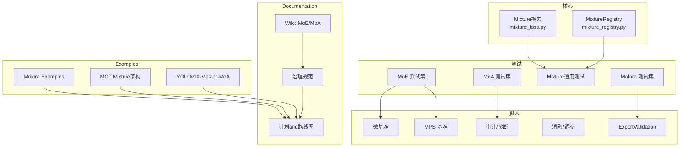
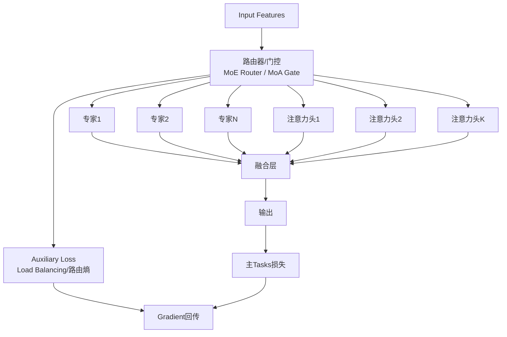
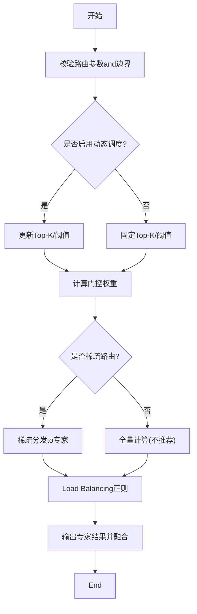
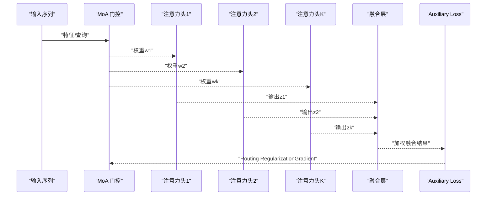
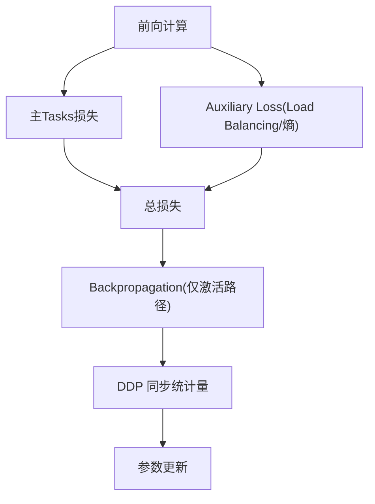
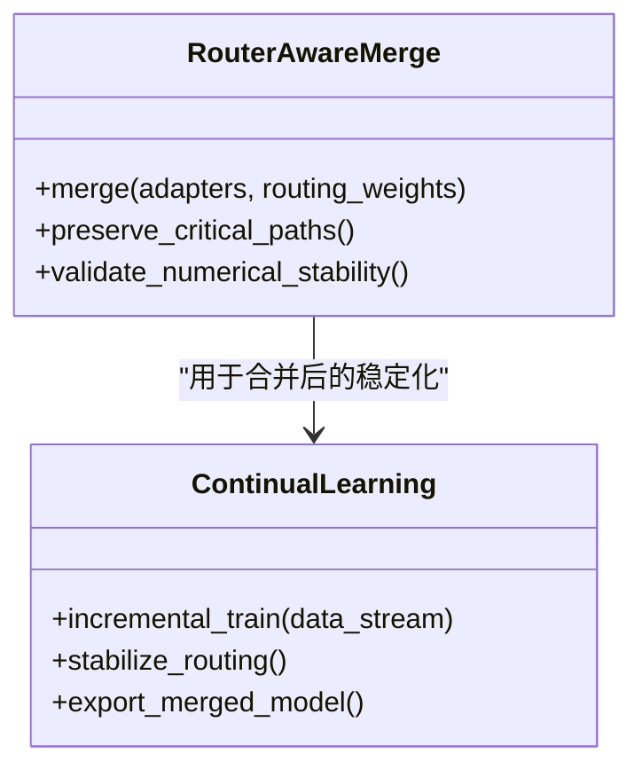
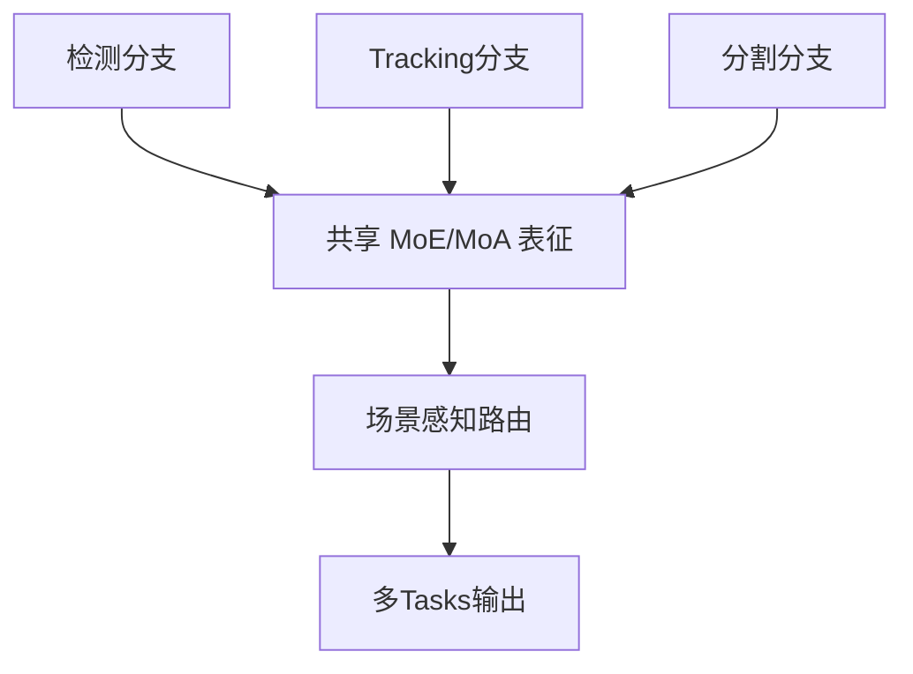
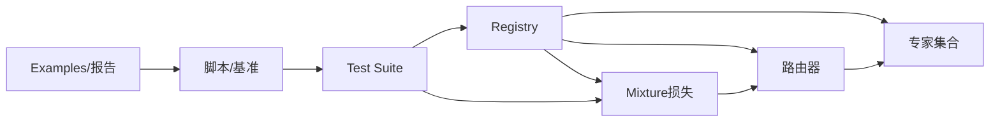

# Mixture of Experts System

<cite>
**Files Referenced in This Document**
- [mixture_loss.py](file://ultralytics/nn/mixture_loss.py)
- [mixture_registry.py](file://ultralytics/nn/mixture_registry.py)
- [test_moe.py](file://tests/test_moe.py)
- [test_moa.py](file://tests/test_moa.py)
- [test_mixture_config_resolution.py](file://tests/test_mixture_config_resolution.py)
- [test_mixture_numeric.py](file://tests/test_mixture_numeric.py)
- [test_mixture_export.py](file://tests/test_mixture_export.py)
- [test_mixture_model_registry.py](file://tests/test_mixture_model_registry.py)
- [test_mixture_loss_composition.py](file://tests/test_mixture_loss_composition.py)
- [test_mixture_compile.py](file://tests/test_mixture_compile.py)
- [test_mixture_aux_loss.py](file://tests/test_mixture_aux_loss.py)
- [test_moe_dynamic_schedule.py](file://tests/test_moe_dynamic_schedule.py)
- [test_moe_router_boundaries.py](file://tests/test_moe_router_boundaries.py)
- [test_moe_usage_audit.py](file://tests/test_moe_usage_audit.py)
- [test_moe_ddp_fixes.py](file://tests/test_moe_ddp_fixes.py)
- [test_moe_validation_collectives.py](file://tests/test_moe_validation_collectives.py)
- [test_moe_variant_contract.py](file://tests/test_moe_variant_contract.py)
- [test_molora.py](file://tests/test_molora.py)
- [test_molora_sparse_dispatch.py](file://tests/test_molora_sparse_dispatch.py)
- [test_molora_routing_aware_merge.py](file://tests/test_molora_routing_aware_merge.py)
- [test_molora_dtype.py](file://tests/test_molora_dtype.py)
- [test_molora_merge_semantics.py](file://tests/test_molora_merge_semantics.py)
- [test_molora_supplementary.py](file://tests/test_molora_supplementary.py)
- [test_moa_mot_ssot.py](file://tests/test_moa_mot_ssot.py)
- [test_moa_mot_ddp_math.py](file://tests/test_moa_mot_ddp_math.py)
- [test_moa.py](file://tests/test_moa.py)
- [bench_moe_micro.py](file://scripts/bench_moe_micro.py)
- [bench_moe_mps.py](file://scripts/bench_moe_mps.py)
- [audit_moe_usage.py](file://scripts/audit_moe_usage.py)
- [compare_moa_ablation.py](file://scripts/compare_moa_ablation.py)
- [diagnose_mot_routing.py](file://scripts/diagnose_mot_routing.py)
- [analyze_mot_routing.py](file://scripts/analyze_mot_routing.py)
- [prepare_mot_routing_scenes.py](file://scripts/prepare_mot_routing_scenes.py)
- [run_moe_dynamic_schedule_ablation.py](file://scripts/run_moe_dynamic_schedule_ablation.py)
- [tune_mixture_aux.py](file://scripts/tune_mixture_aux.py)
- [validate_routed_export.py](file://scripts/validate_routed_export.py)
- [moe_pruning_sweep.py](file://scripts/moe_pruning_sweep.py)
- [plot_moe_pruning_sweep.py](file://scripts/plot_moe_pruning_sweep.py)
- [issue52_expert_usage_gini.csv](file://scripts/issue52_expert_usage_gini.csv)
- [issue52_per_layer_experts.csv](file://scripts/issue52_per_layer_experts.csv)
- [issue52_pruning_results.csv](file://scripts/issue52_pruning_results.csv)
- [molora/basic_finetune.py](file://examples/molora/basic_finetune.py)
- [molora/continual_learning.py](file://examples/molora/continual_learning.py)
- [molora/compare_lora_molora.py](file://examples/molora/compare_lora_molora.py)
- [molora/compare_coco128.py](file://examples/molora/compare_coco128.py)
- [molora/compare_coco128_fast.py](file://examples/molora/compare_coco128_fast.py)
- [molora/comparison_report.md](file://examples/molora/comparison_report.md)
- [mot_hybrid_architecture/technical_summary.md](file://examples/mot_hybrid_architecture/technical_summary.md)
- [mot_hybrid_architecture/README.md](file://examples/mot_hybrid_architecture/README.md)
- [mot_hybrid_architecture/run_visdrone_mot_ablation.sh](file://examples/mot_hybrid_architecture/run_visdrone_mot_ablation.sh)
- [mot_hybrid_architecture/plot_mot_results.py](file://examples/mot_hybrid_architecture/plot_mot_results.py)
- [YOLOv10-Master-MoA/README.md](file://examples/YOLOv10-Master-MoA/README.md)
- [YOLOv10-Master-MoA/plot_visdrone_curves.py](file://examples/YOLOv10-Master-MoA/plot_visdrone_curves.py)
- [wiki/MoE/MoE_Routers_Experts.md](file://wiki/MoE/MoE_Routers_Experts.md)
- [wiki/MoE/MoE_Training_Loss_Pruning.md](file://wiki/MoE/MoE_Training_Loss_Pruning.md)
- [wiki/MoE/Mixture_of_Attention.md](file://wiki/MoE/Mixture_of_Attention.md)
- [wiki/MoE/MoE_Diagnostics_Analysis.md](file://wiki/MoE/MoE_Diagnostics_Analysis.md)
- [governance/routing-interpretability.md](file://docs/governance/routing-interpretability.md)
- [governance/moe-class-lifecycle.md](file://docs/governance/moe-class-lifecycle.md)
- [governance/performance-gates.md](file://docs/governance/performance-gates.md)
- [governance/mixture-preservation-manifest.yaml](file://docs/governance/mixture-preservation-manifest.yaml)
- [governance/config-drift-detection.md](file://docs/governance/config-drift-detection.md)
- [plans/moe_aware_peft_plan.md](file://docs/plans/moe_aware_peft_plan.md)
- [plans/mota-hybrid-architecture.md](file://docs/plans/mot-hybrid-architecture.md)
- [plans/molora-routing-aware-merge.md](file://docs/plans/molora-routing-aware-merge.md)
- [plans/mota-scene-aware-router.md](file://docs/plans/mot-scene-aware-router.md)
- [plans/routing-interpreter-toolkit.md](file://docs/plans/routing-interpreter-toolkit.md)
- [plans/standard-benchmark-suite-design.md](file://docs/plans/standard-benchmark-suite-design.md)
- [plans/standard-benchmark-suite.md](file://docs/plans/standard-benchmark-suite.md)
</cite>

## Table of Contents
1. [引言](#引言)
2. [Project Structure](#Project Structure)
3. [Core Components](#Core Components)
4. [Architecture Overview](#Architecture Overview)
5. [Detailed Component Analysis](#Detailed Component Analysis)
6. [Dependency Analysis](#Dependency Analysis)
7. [性能考量](#性能考量)
8. [故障排除指南](#故障排除指南)
9. [Conclusion](#Conclusion)
10. [Appendix](#Appendix)

## 引言
本文件聚焦于 YOLO-Master 的Mixture of Experts（MoE）andMixture注意力（MoA）两大核心机制，系统性解析其路由算法、Expert Network设计、Load Balancing策略、动态激活技术、注意力Mixtureand路由流程，并给出配置Examples、Training指南（Loss Function、Gradient传播、内存Optimization）、性能优势andExtensibilityEvaluation、调试工具and监控MetricsCentered onand常见问题的排查方法。DocumentationCentered on仓库中的implementingand测试for依据，辅Centered on治理Documentationand计划说明，帮助读者从工程and理论双视角理解andUses该系统。

## Project Structure
围绕 MoE/MoA 的关键代码and资产主要分布whileCentered on下位置：
- 核心implementingandRegistry
  - Mixture损失andRegistry：[mixture_loss.py](file://ultralytics/nn/mixture_loss.py)、[mixture_registry.py](file://ultralytics/nn/mixture_registry.py)
- Test Suite（覆盖数值稳定性、Export、DDP、动态调度、边界条件etc.）
  - MoE 相关：[test_moe.py](file://tests/test_moe.py)、[test_moe_dynamic_schedule.py](file://tests/test_moe_dynamic_schedule.py)、[test_moe_router_boundaries.py](file://tests/test_moe_router_boundaries.py)、[test_moe_ddp_fixes.py](file://tests/test_moe_ddp_fixes.py)、[test_moe_validation_collectives.py](file://tests/test_moe_validation_collectives.py)、[test_moe_variant_contract.py](file://tests/test_moe_variant_contract.py)、[test_moe_usage_audit.py](file://tests/test_moe_usage_audit.py)
  - MoA 相关：[test_moa.py](file://tests/test_moa.py)、[test_moa_mot_ssot.py](file://tests/test_moa_mot_ssot.py)、[test_moa_mot_ddp_math.py](file://tests/test_moa_mot_ddp_math.py)
  - Mixture通用capabilities：[test_mixture_config_resolution.py](file://tests/test_mixture_config_resolution.py)、[test_mixture_numeric.py](file://tests/test_mixture_numeric.py)、[test_mixture_export.py](file://tests/test_mixture_export.py)、[test_mixture_model_registry.py](file://tests/test_mixture_model_registry.py)、[test_mixture_loss_composition.py](file://tests/test_mixture_loss_composition.py)、[test_mixture_compile.py](file://tests/test_mixture_compile.py)、[test_mixture_aux_loss.py](file://tests/test_mixture_aux_loss.py)
  - Molora（稀疏Routing-Aware Merging）：[test_molora.py](file://tests/test_molora.py)、[test_molora_sparse_dispatch.py](file://tests/test_molora_sparse_dispatch.py)、[test_molora_routing_aware_merge.py](file://tests/test_molora_routing_aware_merge.py)、[test_molora_dtype.py](file://tests/test_molora_dtype.py)、[test_molora_merge_semantics.py](file://tests/test_molora_merge_semantics.py)、[test_molora_supplementary.py](file://tests/test_molora_supplementary.py)
- 脚本and基准
  - 微基准and MPS 加速：[bench_moe_micro.py](file://scripts/bench_moe_micro.py)、[bench_moe_mps.py](file://scripts/bench_moe_mps.py)
  - 审计and诊断：[audit_moe_usage.py](file://scripts/audit_moe_usage.py)、[diagnose_mot_routing.py](file://scripts/diagnose_mot_routing.py)、[analyze_mot_routing.py](file://scripts/analyze_mot_routing.py)、[prepare_mot_routing_scenes.py](file://scripts/prepare_mot_routing_scenes.py)
  - 消融and调参：[compare_moa_ablation.py](file://scripts/compare_moa_ablation.py)、[run_moe_dynamic_schedule_ablation.py](file://scripts/run_moe_dynamic_schedule_ablation.py)、[tune_mixture_aux.py](file://scripts/tune_mixture_aux.py)、[moe_pruning_sweep.py](file://scripts/moe_pruning_sweep.py)、[plot_moe_pruning_sweep.py](file://scripts/plot_moe_pruning_sweep.py)
  - ExportValidation：[validate_routed_export.py](file://scripts/validate_routed_export.py)
  - 统计结果：[issue52_expert_usage_gini.csv](file://scripts/issue52_expert_usage_gini.csv)、[issue52_per_layer_experts.csv](file://scripts/issue52_per_layer_experts.csv)、[issue52_pruning_results.csv](file://scripts/issue52_pruning_results.csv)
- Examples and Reports
  - Molora Examples：[examples/molora/*.py](file://examples/molora/)、[examples/molora/comparison_report.md](file://examples/molora/comparison_report.md)
  - MOT Mixture架构：[examples/mot_hybrid_architecture/*](file://examples/mot_hybrid_architecture/)
  - YOLOv10-Master-MoA：[examples/YOLOv10-Master-MoA/*](file://examples/YOLOv10-Master-MoA/)
- Documentationand治理
  - Wiki：[wiki/MoE/*](file://wiki/MoE/)
  - 治理规范：[docs/governance/*](file://docs/governance/)
  - 计划and路线图：[docs/plans/*](file://docs/plans/)

Figure Source
- [mixture_loss.py](file://ultralytics/nn/mixture_loss.py)
- [mixture_registry.py](file://ultralytics/nn/mixture_registry.py)
- [test_moe.py](file://tests/test_moe.py)
- [test_moa.py](file://tests/test_moa.py)
- [test_mixture_config_resolution.py](file://tests/test_mixture_config_resolution.py)
- [test_mixture_numeric.py](file://tests/test_mixture_numeric.py)
- [test_mixture_export.py](file://tests/test_mixture_export.py)
- [test_mixture_model_registry.py](file://tests/test_mixture_model_registry.py)
- [test_mixture_loss_composition.py](file://tests/test_mixture_loss_composition.py)
- [test_mixture_compile.py](file://tests/test_mixture_compile.py)
- [test_mixture_aux_loss.py](file://tests/test_mixture_aux_loss.py)
- [test_molora.py](file://tests/test_molora.py)
- [bench_moe_micro.py](file://scripts/bench_moe_micro.py)
- [bench_moe_mps.py](file://scripts/bench_moe_mps.py)
- [audit_moe_usage.py](file://scripts/audit_moe_usage.py)
- [compare_moa_ablation.py](file://scripts/compare_moa_ablation.py)
- [validate_routed_export.py](file://scripts/validate_routed_export.py)
- [examples/molora/comparison_report.md](file://examples/molora/comparison_report.md)
- [examples/mot_hybrid_architecture/README.md](file://examples/mot_hybrid_architecture/README.md)
- [examples/YOLOv10-Master-MoA/README.md](file://examples/YOLOv10-Master-MoA/README.md)
- [wiki/MoE/Mixture_of_Attention.md](file://wiki/MoE/Mixture_of_Attention.md)
- [docs/governance/routing-interpretability.md](file://docs/governance/routing-interpretability.md)
- [docs/plans/molora-routing-aware-merge.md](file://docs/plans/molora-routing-aware-merge.md)

Section Source
- [mixture_loss.py](file://ultralytics/nn/mixture_loss.py)
- [mixture_registry.py](file://ultralytics/nn/mixture_registry.py)
- [test_moe.py](file://tests/test_moe.py)
- [test_moa.py](file://tests/test_moa.py)
- [test_mixture_config_resolution.py](file://tests/test_mixture_config_resolution.py)
- [test_mixture_numeric.py](file://tests/test_mixture_numeric.py)
- [test_mixture_export.py](file://tests/test_mixture_export.py)
- [test_mixture_model_registry.py](file://tests/test_mixture_model_registry.py)
- [test_mixture_loss_composition.py](file://tests/test_mixture_loss_composition.py)
- [test_mixture_compile.py](file://tests/test_mixture_compile.py)
- [test_mixture_aux_loss.py](file://tests/test_mixture_aux_loss.py)
- [test_molora.py](file://tests/test_molora.py)
- [bench_moe_micro.py](file://scripts/bench_moe_micro.py)
- [bench_moe_mps.py](file://scripts/bench_moe_mps.py)
- [audit_moe_usage.py](file://scripts/audit_moe_usage.py)
- [compare_moa_ablation.py](file://scripts/compare_moa_ablation.py)
- [validate_routed_export.py](file://scripts/validate_routed_export.py)
- [examples/molora/comparison_report.md](file://examples/molora/comparison_report.md)
- [examples/mot_hybrid_architecture/README.md](file://examples/mot_hybrid_architecture/README.md)
- [examples/YOLOv10-Master-MoA/README.md](file://examples/YOLOv10-Master-MoA/README.md)
- [wiki/MoE/Mixture_of_Attention.md](file://wiki/MoE/Mixture_of_Attention.md)
- [docs/governance/routing-interpretability.md](file://docs/governance/routing-interpretability.md)
- [docs/plans/molora-routing-aware-merge.md](file://docs/plans/molora-routing-aware-merge.md)

## Core Components
- Mixture损失Modules
  - 负责组合Tasks主损失andAuxiliary Loss（such asLoad Balancing、路由熵、专家Uses均衡etc.），并provides可插拔的权重调度and归一化策略。
  - Refer to路径：[mixture_loss.py](file://ultralytics/nn/mixture_loss.py)
- MixtureRegistry
  - provides模型/路由/专家/损失的统一注册and解析机制，Supporting运行时选择and版本兼容。
  - Refer to路径：[mixture_registry.py](file://ultralytics/nn/mixture_registry.py)
- 测试and验收
  - 覆盖数值稳定、编译、Export、DDP、动态调度、边界条件、变体契约、Molora 稀疏路由and合并语义etc.。
  - Refer to路径：见“Project Structure”中测试清单

Section Source
- [mixture_loss.py](file://ultralytics/nn/mixture_loss.py)
- [mixture_registry.py](file://ultralytics/nn/mixture_registry.py)
- [test_mixture_config_resolution.py](file://tests/test_mixture_config_resolution.py)
- [test_mixture_numeric.py](file://tests/test_mixture_numeric.py)
- [test_mixture_export.py](file://tests/test_mixture_export.py)
- [test_mixture_model_registry.py](file://tests/test_mixture_model_registry.py)
- [test_mixture_loss_composition.py](file://tests/test_mixture_loss_composition.py)
- [test_mixture_compile.py](file://tests/test_mixture_compile.py)
- [test_mixture_aux_loss.py](file://tests/test_mixture_aux_loss.py)

## Architecture Overview
下图展示 MoE and MoA while YOLO-Master 中的整体交互关系：Input Features进入路由器，按门控权重选择专家或注意力头；被选中的子Modules并行计算后加权融合；Auxiliary Loss对路由分布进行正则；Training阶段Via DDP 同步统计量，Inference阶段on-demand activationCentered on降低延迟and显存占用。

Figure Source
- [mixture_loss.py](file://ultralytics/nn/mixture_loss.py)
- [mixture_registry.py](file://ultralytics/nn/mixture_registry.py)
- [wiki/MoE/Mixture_of_Attention.md](file://wiki/MoE/Mixture_of_Attention.md)
- [docs/governance/routing-interpretability.md](file://docs/governance/routing-interpretability.md)

## Detailed Component Analysis

### MoE Routing MechanismandExpert Network
- Routing Mechanism
  - 基于Input Features的软/硬选择策略，Combining Top-K 门控and温度缩放控制稀疏度。
  - Supporting动态调度（随Training步数调整 K 值或阈值），提升早期探索and后期收敛效率。
  - Refer to路径：[test_moe_dynamic_schedule.py](file://tests/test_moe_dynamic_schedule.py)、[test_moe_router_boundaries.py](file://tests/test_moe_router_boundaries.py)
- Expert Network设计
  - 专家通常for轻量前馈或卷积块，具备独立参数and局部容量，便于并行and裁剪。
  - Supporting专家级剪枝and动态激活，减少无效计算。
  - Refer to路径：[moe_pruning_sweep.py](file://scripts/moe_pruning_sweep.py)、[plot_moe_pruning_sweep.py](file://scripts/plot_moe_pruning_sweep.py)
- Load Balancing策略
  - ViaAuxiliary Loss（such as专家Uses率方差、Gini 系数、路由熵）抑制热点专家，促进均匀利用。
  - Refer to路径：[test_mixture_aux_loss.py](file://tests/test_mixture_aux_loss.py)、[issue52_expert_usage_gini.csv](file://scripts/issue52_expert_usage_gini.csv)
- 动态激活技术
  - 根据场景复杂度或置信度动态切换激活专家数量，兼顾精度and速度。
  - Refer to路径：[test_moe_dynamic_schedule.py](file://tests/test_moe_dynamic_schedule.py)、[run_moe_dynamic_schedule_ablation.py](file://scripts/run_moe_dynamic_schedule_ablation.py)

Figure Source
- [test_moe_dynamic_schedule.py](file://tests/test_moe_dynamic_schedule.py)
- [test_moe_router_boundaries.py](file://tests/test_moe_router_boundaries.py)
- [test_mixture_aux_loss.py](file://tests/test_mixture_aux_loss.py)
- [moe_pruning_sweep.py](file://scripts/moe_pruning_sweep.py)

Section Source
- [test_moe_dynamic_schedule.py](file://tests/test_moe_dynamic_schedule.py)
- [test_moe_router_boundaries.py](file://tests/test_moe_router_boundaries.py)
- [test_mixture_aux_loss.py](file://tests/test_mixture_aux_loss.py)
- [moe_pruning_sweep.py](file://scripts/moe_pruning_sweep.py)
- [plot_moe_pruning_sweep.py](file://scripts/plot_moe_pruning_sweep.py)
- [run_moe_dynamic_schedule_ablation.py](file://scripts/run_moe_dynamic_schedule_ablation.py)
- [issue52_expert_usage_gini.csv](file://scripts/issue52_expert_usage_gini.csv)

### MoA 注意力Mixtureand路由算法
- 注意力Mixture机制
  - 将多个注意力头作for“专家”，由门控网络for每个 token/区域分配权重，形成多头Mixture表示。
  - Refer to路径：[wiki/MoE/Mixture_of_Attention.md](file://wiki/MoE/Mixture_of_Attention.md)、[test_moa.py](file://tests/test_moa.py)
- 路由算法
  - 采用and MoE 相似的门控逻辑，但作用于注意力维度；Supporting跨Tasks/跨模态共享路由或专用路由。
  - Refer to路径：[test_moa_mot_ssot.py](file://tests/test_moa_mot_ssot.py)、[test_moa_mot_ddp_math.py](file://tests/test_moa_mot_ddp_math.py)
- 单源真相（SSOT）and一致性
  - 确保同一输入while不同分支（检测/Tracking/分割）的路由一致，避免表征漂移。
  - Refer to路径：[test_moa_mot_ssot.py](file://tests/test_moa_mot_ssot.py)

Figure Source
- [wiki/MoE/Mixture_of_Attention.md](file://wiki/MoE/Mixture_of_Attention.md)
- [test_moa.py](file://tests/test_moa.py)
- [test_moa_mot_ssot.py](file://tests/test_moa_mot_ssot.py)
- [test_moa_mot_ddp_math.py](file://tests/test_moa_mot_ddp_math.py)

Section Source
- [wiki/MoE/Mixture_of_Attention.md](file://wiki/MoE/Mixture_of_Attention.md)
- [test_moa.py](file://tests/test_moa.py)
- [test_moa_mot_ssot.py](file://tests/test_moa_mot_ssot.py)
- [test_moa_mot_ddp_math.py](file://tests/test_moa_mot_ddp_math.py)

### Mixture损失设计andGradient传播
- 损失组成
  - 主Tasks损失（检测/分割/姿态etc.）+ Auxiliary Loss（Load Balancing、路由熵、专家Uses率惩罚）。
  - 权重可按阶段或Tasks自适应调节。
  - Refer to路径：[mixture_loss.py](file://ultralytics/nn/mixture_loss.py)、[test_mixture_loss_composition.py](file://tests/test_mixture_loss_composition.py)
- Gradient传播
  - 仅对被激活的专家/注意力头Backpropagation，降低冗余计算；DDP 下需对齐路由统计量。
  - Refer to路径：[test_moe_ddp_fixes.py](file://tests/test_moe_ddp_fixes.py)、[test_moe_validation_collectives.py](file://tests/test_moe_validation_collectives.py)
- 数值稳定性
  - 温度缩放、门控权重截断、NaN/Inf 防护andLogging。
  - Refer to路径：[test_mixture_numeric.py](file://tests/test_mixture_numeric.py)

Figure Source
- [mixture_loss.py](file://ultralytics/nn/mixture_loss.py)
- [test_mixture_loss_composition.py](file://tests/test_mixture_loss_composition.py)
- [test_moe_ddp_fixes.py](file://tests/test_moe_ddp_fixes.py)
- [test_moe_validation_collectives.py](file://tests/test_moe_validation_collectives.py)
- [test_mixture_numeric.py](file://tests/test_mixture_numeric.py)

Section Source
- [mixture_loss.py](file://ultralytics/nn/mixture_loss.py)
- [test_mixture_loss_composition.py](file://tests/test_mixture_loss_composition.py)
- [test_moe_ddp_fixes.py](file://tests/test_moe_ddp_fixes.py)
- [test_moe_validation_collectives.py](file://tests/test_moe_validation_collectives.py)
- [test_mixture_numeric.py](file://tests/test_mixture_numeric.py)

### Molora：稀疏Routing-Aware Mergingand持续学习
- 稀疏Routing-Aware Merging
  - while合并 LoRA/Adapter时考虑路由权重，保留关键专家路径，避免性能退化。
  - Refer to路径：[test_molora_routing_aware_merge.py](file://tests/test_molora_routing_aware_merge.py)、[docs/plans/molora-routing-aware-merge.md](file://docs/plans/molora-routing-aware-merge.md)
- 持续学习and微调
  - Supporting增量数据and领域Migration，保持路由and专家的一致性。
  - Refer to路径：[examples/molora/continual_learning.py](file://examples/molora/continual_learning.py)、[examples/molora/basic_finetune.py](file://examples/molora/basic_finetune.py)
- 对比and报告
  - providesand标准 LoRA 的对比实验andVisualization报告。
  - Refer to路径：[examples/molora/compare_lora_molora.py](file://examples/molora/compare_lora_molora.py)、[examples/molora/comparison_report.md](file://examples/molora/comparison_report.md)

Figure Source
- [test_molora_routing_aware_merge.py](file://tests/test_molora_routing_aware_merge.py)
- [examples/molora/continual_learning.py](file://examples/molora/continual_learning.py)
- [examples/molora/basic_finetune.py](file://examples/molora/basic_finetune.py)
- [examples/molora/compare_lora_molora.py](file://examples/molora/compare_lora_molora.py)
- [examples/molora/comparison_report.md](file://examples/molora/comparison_report.md)
- [docs/plans/molora-routing-aware-merge.md](file://docs/plans/molora-routing-aware-merge.md)

Section Source
- [test_molora_routing_aware_merge.py](file://tests/test_molora_routing_aware_merge.py)
- [examples/molora/continual_learning.py](file://examples/molora/continual_learning.py)
- [examples/molora/basic_finetune.py](file://examples/molora/basic_finetune.py)
- [examples/molora/compare_lora_molora.py](file://examples/molora/compare_lora_molora.py)
- [examples/molora/comparison_report.md](file://examples/molora/comparison_report.md)
- [docs/plans/molora-routing-aware-merge.md](file://docs/plans/molora-routing-aware-merge.md)

### MOT Mixture架构and场景感知路由
- Mixture架构
  - 将检测、Tracking、分割etc.多Tasks共享 MoE/MoA 表征，Via场景感知路由提升跨Tasks一致性。
  - Refer to路径：[examples/mot_hybrid_architecture/README.md](file://examples/mot_hybrid_architecture/README.md)、[examples/mot_hybrid_architecture/technical_summary.md](file://examples/mot_hybrid_architecture/technical_summary.md)
- 场景感知路由
  - 依据场景复杂度或目标密度动态调整routing strategies，平衡精度and吞吐。
  - Refer to路径：[docs/plans/mot-scene-aware-router.md](file://docs/plans/mot-scene-aware-router.md)、[scripts/prepare_mot_routing_scenes.py](file://scripts/prepare_mot_routing_scenes.py)
- VisualizationandEvaluation
  - provides曲线绘制and结果汇总脚本。
  - Refer to路径：[examples/mot_hybrid_architecture/plot_mot_results.py](file://examples/mot_hybrid_architecture/plot_mot_results.py)、[examples/mot_hybrid_architecture/run_visdrone_mot_ablation.sh](file://examples/mot_hybrid_architecture/run_visdrone_mot_ablation.sh)

Figure Source
- [examples/mot_hybrid_architecture/README.md](file://examples/mot_hybrid_architecture/README.md)
- [examples/mot_hybrid_architecture/technical_summary.md](file://examples/mot_hybrid_architecture/technical_summary.md)
- [docs/plans/mot-scene-aware-router.md](file://docs/plans/mot-scene-aware-router.md)
- [scripts/prepare_mot_routing_scenes.py](file://scripts/prepare_mot_routing_scenes.py)
- [examples/mot_hybrid_architecture/plot_mot_results.py](file://examples/mot_hybrid_architecture/plot_mot_results.py)
- [examples/mot_hybrid_architecture/run_visdrone_mot_ablation.sh](file://examples/mot_hybrid_architecture/run_visdrone_mot_ablation.sh)

Section Source
- [examples/mot_hybrid_architecture/README.md](file://examples/mot_hybrid_architecture/README.md)
- [examples/mot_hybrid_architecture/technical_summary.md](file://examples/mot_hybrid_architecture/technical_summary.md)
- [docs/plans/mot-scene-aware-router.md](file://docs/plans/mot-scene-aware-router.md)
- [scripts/prepare_mot_routing_scenes.py](file://scripts/prepare_mot_routing_scenes.py)
- [examples/mot_hybrid_architecture/plot_mot_results.py](file://examples/mot_hybrid_architecture/plot_mot_results.py)
- [examples/mot_hybrid_architecture/run_visdrone_mot_ablation.sh](file://examples/mot_hybrid_architecture/run_visdrone_mot_ablation.sh)

### 配置ExamplesandTraining指南
- 配置要点
  - 路由 Top-K、温度、Load Balancing权重、专家数量and容量、动态调度策略、Molora 合并开关etc.。
  - Refer to路径：[test_mixture_config_resolution.py](file://tests/test_mixture_config_resolution.py)、[mixture_registry.py](file://ultralytics/nn/mixture_registry.py)
- Training步骤
  - 初始化Registryand模型 → 加载数据集 → 设置损失and辅助项 → 启动Training（DDP）→ 监控路由and专家Uses率 → ExportandValidation。
  - Refer to路径：[test_mixture_model_registry.py](file://tests/test_mixture_model_registry.py)、[test_moe_ddp_fixes.py](file://tests/test_moe_ddp_fixes.py)
- 损失and超参调优
  - Uses调参脚本扫描Auxiliary Loss权重and动态调度参数。
  - Refer to路径：[tune_mixture_aux.py](file://scripts/tune_mixture_aux.py)、[run_moe_dynamic_schedule_ablation.py](file://scripts/run_moe_dynamic_schedule_ablation.py)

Section Source
- [test_mixture_config_resolution.py](file://tests/test_mixture_config_resolution.py)
- [mixture_registry.py](file://ultralytics/nn/mixture_registry.py)
- [test_mixture_model_registry.py](file://tests/test_mixture_model_registry.py)
- [test_moe_ddp_fixes.py](file://tests/test_moe_ddp_fixes.py)
- [tune_mixture_aux.py](file://scripts/tune_mixture_aux.py)
- [run_moe_dynamic_schedule_ablation.py](file://scripts/run_moe_dynamic_schedule_ablation.py)

### 内存OptimizationandInference加速
- 稀疏激活and剪枝
  - 仅激活必要专家/注意力头，Combined with剪枝降低显存and计算开销。
  - Refer to路径：[moe_pruning_sweep.py](file://scripts/moe_pruning_sweep.py)、[plot_moe_pruning_sweep.py](file://scripts/plot_moe_pruning_sweep.py)
- 编译and后端Optimization
  - Uses torch.compile and MPS/CUDA 后端Optimization路径。
  - Refer to路径：[test_mixture_compile.py](file://tests/test_mixture_compile.py)、[bench_moe_micro.py](file://scripts/bench_moe_micro.py)、[bench_moe_mps.py](file://scripts/bench_moe_mps.py)
- Exportand部署
  - Validation路由感知的Export一致性，确保Inference端行forandTraining端一致。
  - Refer to路径：[test_mixture_export.py](file://tests/test_mixture_export.py)、[validate_routed_export.py](file://scripts/validate_routed_export.py)

Section Source
- [moe_pruning_sweep.py](file://scripts/moe_pruning_sweep.py)
- [plot_moe_pruning_sweep.py](file://scripts/plot_moe_pruning_sweep.py)
- [test_mixture_compile.py](file://tests/test_mixture_compile.py)
- [bench_moe_micro.py](file://scripts/bench_moe_micro.py)
- [bench_moe_mps.py](file://scripts/bench_moe_mps.py)
- [test_mixture_export.py](file://tests/test_mixture_export.py)
- [validate_routed_export.py](file://scripts/validate_routed_export.py)

## Dependency Analysis
- 组件耦合
  - Mixture损失andRegistryfor核心依赖，测试and脚本广泛引用；Molora and MOT Mixture架构while上层应用。
- External Dependencies
  - PyTorch/Distributed、torch.compile、MPS/CUDA 后端、ONNX/TensorRT etc.Export工具链。
- 循环依赖
  - ViaRegistry解耦路由/专家/损失，避免直接强耦合。

Figure Source
- [mixture_registry.py](file://ultralytics/nn/mixture_registry.py)
- [mixture_loss.py](file://ultralytics/nn/mixture_loss.py)
- [test_mixture_model_registry.py](file://tests/test_mixture_model_registry.py)
- [test_mixture_loss_composition.py](file://tests/test_mixture_loss_composition.py)
- [bench_moe_micro.py](file://scripts/bench_moe_micro.py)
- [examples/molora/comparison_report.md](file://examples/molora/comparison_report.md)

Section Source
- [mixture_registry.py](file://ultralytics/nn/mixture_registry.py)
- [mixture_loss.py](file://ultralytics/nn/mixture_loss.py)
- [test_mixture_model_registry.py](file://tests/test_mixture_model_registry.py)
- [test_mixture_loss_composition.py](file://tests/test_mixture_loss_composition.py)
- [bench_moe_micro.py](file://scripts/bench_moe_micro.py)
- [examples/molora/comparison_report.md](file://examples/molora/comparison_report.md)

## 性能考量
- 稀疏性and吞吐
  - Set appropriately Top-K and温度，最大化稀疏性同时保证精度；动态调度可while不同阶段自动调整。
- Load Balancingand热点抑制
  - ViaAuxiliary Lossand审计工具监控专家Uses率，避免少数专家过载。
- 编译and后端
  - Uses torch.compile and MPS/CUDA Optimization路径，显著降低延迟；注意算子兼容性。
- Exportand部署
  - 路由感知的ExportandValidation确保线上行for稳定；建议开启最小激活模式。

[本节for通用指导，无需特定文件来源]

## 故障排除指南
- 路由不稳定/NaN
  - 检查温度缩放and门控权重截断；查看数值稳定性测试andLogging。
  - Refer to路径：[test_mixture_numeric.py](file://tests/test_mixture_numeric.py)
- DDP 同步异常
  - 确认路由统计量的集体通信正确；Refer to修复用例。
  - Refer to路径：[test_moe_ddp_fixes.py](file://tests/test_moe_ddp_fixes.py)、[test_moe_validation_collectives.py](file://tests/test_moe_validation_collectives.py)
- Export不一致
  - UsesExportValidation脚本比对TrainingandInference端路由行for。
  - Refer to路径：[validate_routed_export.py](file://scripts/validate_routed_export.py)、[test_mixture_export.py](file://tests/test_mixture_export.py)
- 专家Uses不均
  - 借助审计and统计结果（Gini、每层专家分布）定位问题并调整Auxiliary Loss权重。
  - Refer to路径：[audit_moe_usage.py](file://scripts/audit_moe_usage.py)、[issue52_expert_usage_gini.csv](file://scripts/issue52_expert_usage_gini.csv)、[issue52_per_layer_experts.csv](file://scripts/issue52_per_layer_experts.csv)
- 路由解释性
  - Uses解释性工具and治理Documentation分析路由决策。
  - Refer to路径：[docs/governance/routing-interpretability.md](file://docs/governance/routing-interpretability.md)

Section Source
- [test_mixture_numeric.py](file://tests/test_mixture_numeric.py)
- [test_moe_ddp_fixes.py](file://tests/test_moe_ddp_fixes.py)
- [test_moe_validation_collectives.py](file://tests/test_moe_validation_collectives.py)
- [validate_routed_export.py](file://scripts/validate_routed_export.py)
- [test_mixture_export.py](file://tests/test_mixture_export.py)
- [audit_moe_usage.py](file://scripts/audit_moe_usage.py)
- [issue52_expert_usage_gini.csv](file://scripts/issue52_expert_usage_gini.csv)
- [issue52_per_layer_experts.csv](file://scripts/issue52_per_layer_experts.csv)
- [docs/governance/routing-interpretability.md](file://docs/governance/routing-interpretability.md)

## Conclusion
YOLO-Master 的 MoE/MoA 体系Via可插拔的路由and专家/注意力头设计，implementing了高可Extensibilityand灵活的Tasks适配。借助Auxiliary Lossand动态调度，系统while精度、吞吐and资源占用之间取得良好平衡；Molora and MOT Mixture架构进一步提升了持续学习and多Tasks一致性。完善的测试、基准and治理Documentation保障了工程落地and可维护性。

[本节for总结，无需特定文件来源]

## Appendix
- Refer toDocumentationand计划
  - Wiki：[wiki/MoE/MoE_Routers_Experts.md](file://wiki/MoE/MoE_Routers_Experts.md)、[wiki/MoE/MoE_Training_Loss_Pruning.md](file://wiki/MoE/MoE_Training_Loss_Pruning.md)、[wiki/MoE/MoE_Diagnostics_Analysis.md](file://wiki/MoE/MoE_Diagnostics_Analysis.md)
  - 治理：[docs/governance/moe-class-lifecycle.md](file://docs/governance/moe-class-lifecycle.md)、[docs/governance/performance-gates.md](file://docs/governance/performance-gates.md)、[docs/governance/mixture-preservation-manifest.yaml](file://docs/governance/mixture-preservation-manifest.yaml)、[docs/governance/config-drift-detection.md](file://docs/governance/config-drift-detection.md)
  - 计划：[docs/plans/moe_aware_peft_plan.md](file://docs/plans/moe_aware_peft_plan.md)、[docs/plans/mot-hybrid-architecture.md](file://docs/plans/mot-hybrid-architecture.md)、[docs/plans/routing-interpreter-toolkit.md](file://docs/plans/routing-interpreter-toolkit.md)、[docs/plans/standard-benchmark-suite-design.md](file://docs/plans/standard-benchmark-suite-design.md)、[docs/plans/standard-benchmark-suite.md](file://docs/plans/standard-benchmark-suite.md)
- Examples and Reports
  - Molora：[examples/molora/comparison_report.md](file://examples/molora/comparison_report.md)
  - MOT Mixture：[examples/mot_hybrid_architecture/README.md](file://examples/mot_hybrid_architecture/README.md)
  - YOLOv10-Master-MoA：[examples/YOLOv10-Master-MoA/README.md](file://examples/YOLOv10-Master-MoA/README.md)

[本节for索引，无需特定文件来源]