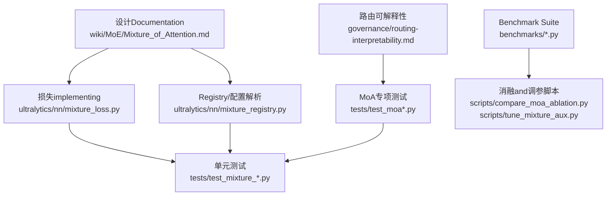
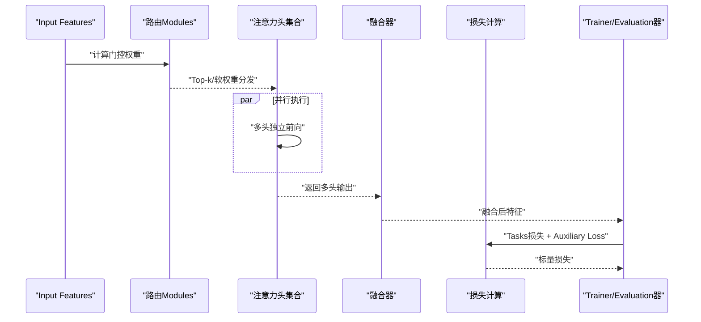
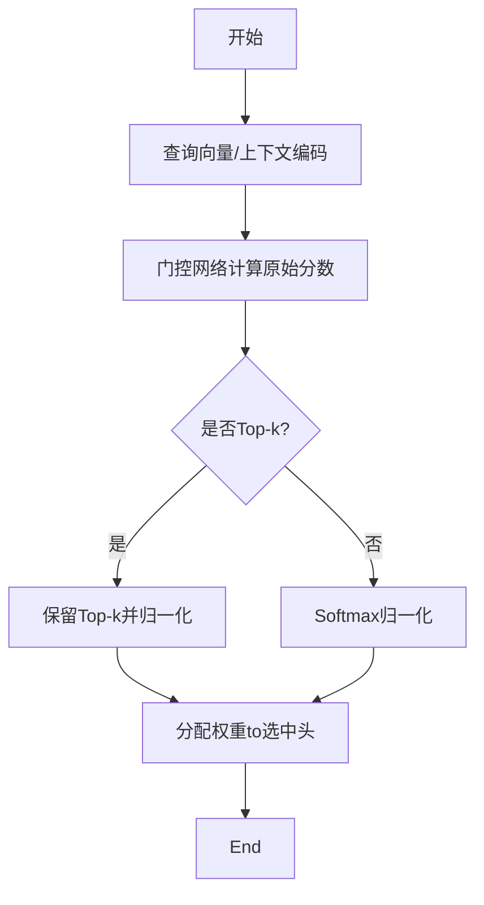
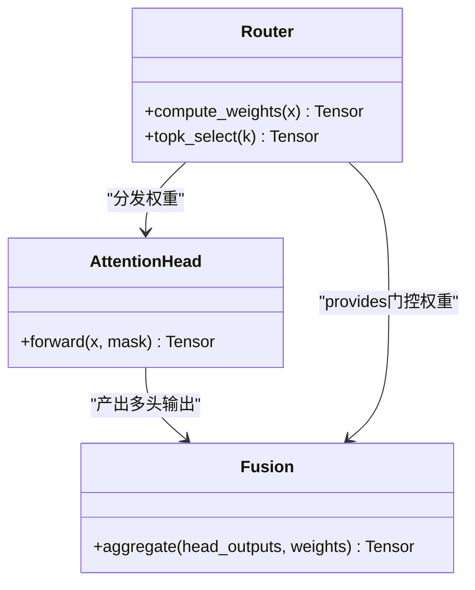
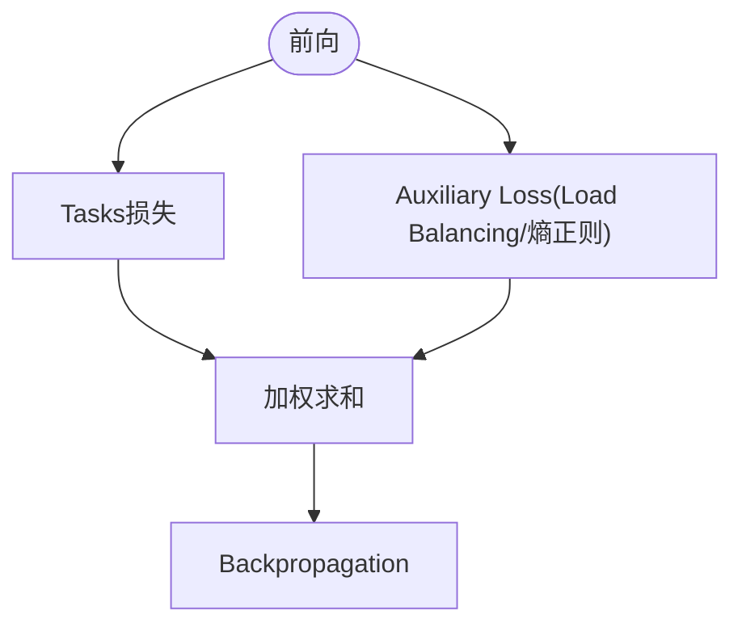
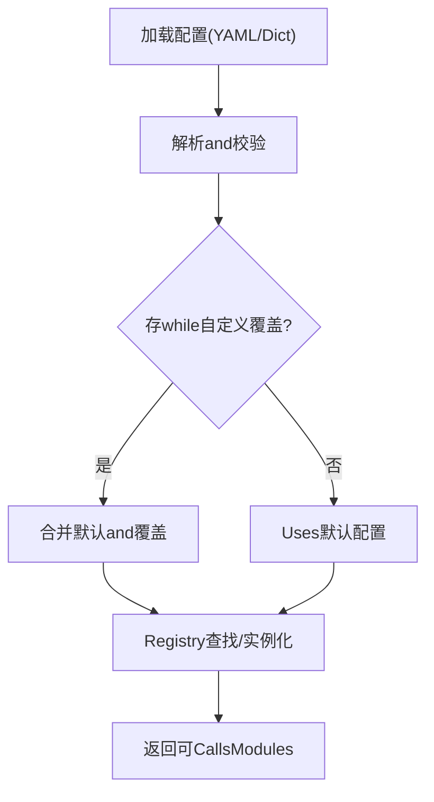
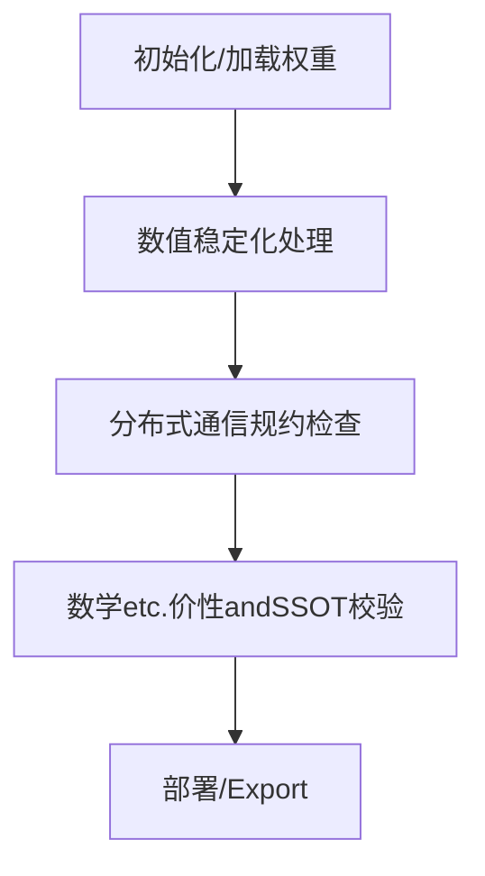
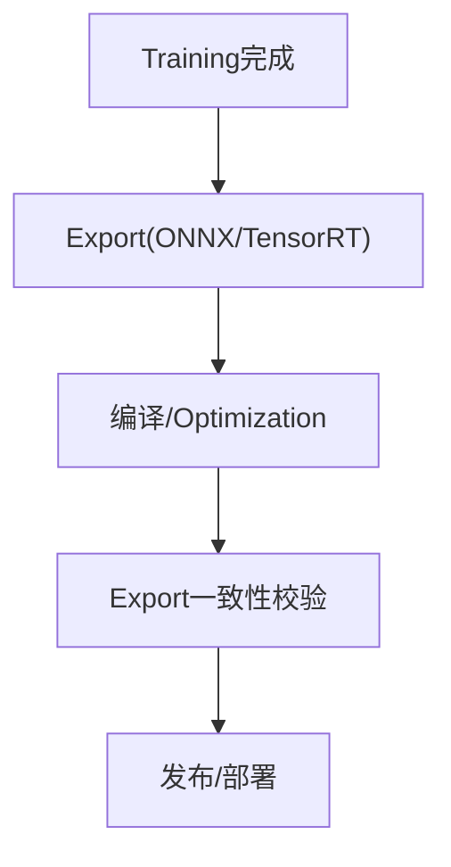
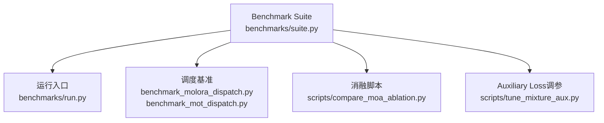
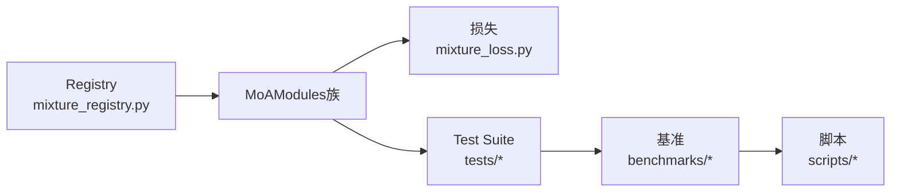

# MoA Attention System

<cite>
**Files Referenced in This Document**
- [Mixture_of_Attention.md](file://wiki/MoE/Mixture_of_Attention.md)
- [mixture_loss.py](file://ultralytics/nn/mixture_loss.py)
- [mixture_registry.py](file://ultralytics/nn/mixture_registry.py)
- [test_moa.py](file://tests/test_moa.py)
- [test_moa_mot_ddp_math.py](file://tests/test_moa_mot_ddp_math.py)
- [test_moa_mot_ssot.py](file://tests/test_moa_mot_ssot.py)
- [test_yolo26_mixture_matrix.py](file://tests/test_yolo26_mixture_matrix.py)
- [test_mixture_config_resolution.py](file://tests/test_mixture_config_resolution.py)
- [test_mixture_numeric.py](file://tests/test_mixture_numeric.py)
- [test_mixture_export.py](file://tests/test_mixture_export.py)
- [test_mixture_model_registry.py](file://tests/test_mixture_model_registry.py)
- [test_mixture_aux_loss.py](file://tests/test_mixture_aux_loss.py)
- [test_mixture_compile.py](file://tests/test_mixture_compile.py)
- [test_mixture_fixes.py](file://tests/test_mixture_fixes.py)
- [test_mixture_loss_composition.py](file://tests/test_mixture_loss_composition.py)
- [benchmarks/run.py](file://benchmarks/run.py)
- [benchmarks/suite.py](file://benchmarks/suite.py)
- [benchmarks/benchmark_molora_dispatch.py](file://benchmarks/benchmark_molora_dispatch.py)
- [benchmarks/benchmark_mot_dispatch.py](file://benchmarks/benchmark_mot_dispatch.py)
- [scripts/compare_moa_ablation.py](file://scripts/compare_moa_ablation.py)
- [scripts/tune_mixture_aux.py](file://scripts/tune_mixture_aux.py)
- [governance/routing-interpretability.md](file://governance/routing-interpretability.md)
</cite>

## Table of Contents
1. [Introduction](#Introduction)
2. [Project Structure](#Project Structure)
3. [Core Components](#Core Components)
4. [Architecture Overview](#Architecture Overview)
5. [Detailed Component Analysis](#Detailed Component Analysis)
6. [Dependency Analysis](#Dependency Analysis)
7. [性能考量](#性能考量)
8. [Troubleshooting Guide](#Troubleshooting Guide)
9. [Conclusion](#Conclusion)
10. [Appendix](#Appendix)

## Introduction
本文件聚焦于仓库中的“注意力Mixture（Mixture of Attention，MoA）”机制，系统性解析其多注意力头协同、路由算法and特征融合策略，解释其while不同注意力模式间的动态切换方式，并给出配置参数说明、最佳实践Centered onandand标准自注意力的对比思路。Documentation同时provides基准测试and可复现实验的入口指引，帮助读者while复杂视觉Tasks中稳定地应用MoA并获得性能提升。

## Project Structure
围绕MoA的相关implementingandValidation主要分布whileCentered on下位置：
- 设计and概念说明：wiki/MoE/Mixture_of_Attention.md
- 损失andRegistry：ultralytics/nn/mixture_loss.py、ultralytics/nn/mixture_registry.py
- 单元测试and数值/Export/编译稳定性：tests/下Centered on test_mixture_* 和 test_moa* 开头的文件
- 基准and消融脚本：benchmarks/*、scripts/compare_moa_ablation.py、scripts/tune_mixture_aux.py
- 路由可解释性治理Documentation：governance/routing-interpretability.md

Figure Source
- [Mixture_of_Attention.md](file://wiki/MoE/Mixture_of_Attention.md)
- [mixture_loss.py](file://ultralytics/nn/mixture_loss.py)
- [mixture_registry.py](file://ultralytics/nn/mixture_registry.py)
- [test_moa.py](file://tests/test_moa.py)
- [test_mixture_config_resolution.py](file://tests/test_mixture_config_resolution.py)
- [benchmarks/run.py](file://benchmarks/run.py)
- [scripts/compare_moa_ablation.py](file://scripts/compare_moa_ablation.py)
- [scripts/tune_mixture_aux.py](file://scripts/tune_mixture_aux.py)
- [governance/routing-interpretability.md](file://governance/routing-interpretability.md)

Section Source
- [Mixture_of_Attention.md](file://wiki/MoE/Mixture_of_Attention.md)
- [mixture_loss.py](file://ultralytics/nn/mixture_loss.py)
- [mixture_registry.py](file://ultralytics/nn/mixture_registry.py)
- [test_moa.py](file://tests/test_moa.py)
- [benchmarks/run.py](file://benchmarks/run.py)
- [scripts/compare_moa_ablation.py](file://scripts/compare_moa_ablation.py)
- [scripts/tune_mixture_aux.py](file://scripts/tune_mixture_aux.py)
- [governance/routing-interpretability.md](file://governance/routing-interpretability.md)

## Core Components
- 注意力MixtureModules族
  - 负责将多个注意力头/专家while不同输入条件下进行加权组合或条件选择，输出统一的特征表示。
  - 关键职责包括：路由计算、权重归一化、多头结果聚合、OptionalAuxiliary Loss注入。
- 路由and融合
  - 路由：根据Input Features生成各注意力头的门控权重，SupportingTop-k稀疏激活或全量软加权。
  - 融合：对选中的注意力头输出进行加权求和或更复杂的非线性融合。
- 损失and稳定性
  - 主损失：由下游Tasks损失andMoA融合后的特征共同drivers are installed。
  - Auxiliary Loss：用于平衡路由分布、约束负载或促进多样性，避免“单头垄断”。
- 配置and注册
  - ViaRegistry管理不同MoA变体and超参，统一解析and实例化流程，便于实验and部署。

Section Source
- [mixture_loss.py](file://ultralytics/nn/mixture_loss.py)
- [mixture_registry.py](file://ultralytics/nn/mixture_registry.py)
- [test_mixture_config_resolution.py](file://tests/test_mixture_config_resolution.py)
- [test_mixture_aux_loss.py](file://tests/test_mixture_aux_loss.py)

## Architecture Overview
下图展示了MoAwhileInferenceandTraining时的典型数据流and控制流，涵盖路由、多头并行、融合and损失计算的关键环节。

Figure Source
- [mixture_loss.py](file://ultralytics/nn/mixture_loss.py)
- [test_moa.py](file://tests/test_moa.py)
- [test_moa_mot_ddp_math.py](file://tests/test_moa_mot_ddp_math.py)
- [test_moa_mot_ssot.py](file://tests/test_moa_mot_ssot.py)

## Detailed Component Analysis

### 路由and门控机制
- 目标：for每个输入样本生成注意力头的选择/权重分布，implementing“按内容自适应”的注意力路径。
- 常见策略：
  - Top-k稀疏路由：仅激活k个最相关的头，降低计算量并增强可解释性。
  - 软路由：对所有头进行加权，平滑Gradient但可能带来冗余计算。
- Load Balancingand正则：
  - ViaAuxiliary Loss鼓励均匀Uses各头，防止“赢家通吃”。
  - 可Combining容量上限、熵正则etc.技巧提升Training稳定性。

Figure Source
- [mixture_loss.py](file://ultralytics/nn/mixture_loss.py)
- [test_mixture_aux_loss.py](file://tests/test_mixture_aux_loss.py)
- [governance/routing-interpretability.md](file://governance/routing-interpretability.md)

Section Source
- [mixture_loss.py](file://ultralytics/nn/mixture_loss.py)
- [test_mixture_aux_loss.py](file://tests/test_mixture_aux_loss.py)
- [governance/routing-interpretability.md](file://governance/routing-interpretability.md)

### 多头注意力and特征融合
- 多头并行：各注意力头独立处理输入，捕获不同尺度/语义/空间模式的表征。
- 融合策略：
  - 线性加权求和：简单高效，适合软路由场景。
  - 门控加权：Combining路由权重进行选择性融合，利于稀疏路由。
  - 残差连接：将融合结果and原输入残差相加，缓解退化问题。
- 维度对齐：确保所有头输出and融合层输入维度一致，必要时Uses投影层对齐。

Figure Source
- [test_moa.py](file://tests/test_moa.py)
- [test_moa_mot_ddp_math.py](file://tests/test_moa_mot_ddp_math.py)
- [test_moa_mot_ssot.py](file://tests/test_moa_mot_ssot.py)

Section Source
- [test_moa.py](file://tests/test_moa.py)
- [test_moa_mot_ddp_math.py](file://tests/test_moa_mot_ddp_math.py)
- [test_moa_mot_ssot.py](file://tests/test_moa_mot_ssot.py)

### Loss Functionand辅助项
- 主损失：来自检测/分割/Trackingand other tasks的损失，作用于融合后的特征。
- Auxiliary Loss：
  - Load Balancing：促使各头被均衡Uses，避免路由坍缩。
  - 路由熵正则：鼓励适度不确定性，提高泛化capabilities。
  - 容量惩罚：限制每步激活的头数量，控制计算开销。
- 组合方式：通常采用加权和形式，系数可Via网格搜索或自动化调参确定。

Figure Source
- [mixture_loss.py](file://ultralytics/nn/mixture_loss.py)
- [test_mixture_loss_composition.py](file://tests/test_mixture_loss_composition.py)
- [test_mixture_aux_loss.py](file://tests/test_mixture_aux_loss.py)

Section Source
- [mixture_loss.py](file://ultralytics/nn/mixture_loss.py)
- [test_mixture_loss_composition.py](file://tests/test_mixture_loss_composition.py)
- [test_mixture_aux_loss.py](file://tests/test_mixture_aux_loss.py)

### 配置andRegistry
- Registry：集中管理不同MoA变体and其默认超参，Supporting按名称快速实例化。
- 配置解析：从YAML/字典加载配置，校验字段类型and取值范围，provides回退默认值。
- 版本兼容：保证模型权重and配置的一致性，便于Migrationand回滚。

Figure Source
- [mixture_registry.py](file://ultralytics/nn/mixture_registry.py)
- [test_mixture_config_resolution.py](file://tests/test_mixture_config_resolution.py)
- [test_mixture_model_registry.py](file://tests/test_mixture_model_registry.py)

Section Source
- [mixture_registry.py](file://ultralytics/nn/mixture_registry.py)
- [test_mixture_config_resolution.py](file://tests/test_mixture_config_resolution.py)
- [test_mixture_model_registry.py](file://tests/test_mixture_model_registry.py)

### 数值稳定性and分布式一致性
- 数值稳定性：
  - 归一化and裁剪：对门控权重and中间激活做合理裁剪，避免NaN/Inf。
  - 精度选择：while部分设备上Uses更高精度中间变量，减少舍入误差累积。
- 分布式一致性：
  - while多卡环境下，确保路由and融合操作的通信规约一致，避免SSOT（Single Source of Truth）破坏。
  - 针对DDP的索引累加and广播操作进行严格Validation。

Figure Source
- [test_mixture_numeric.py](file://tests/test_mixture_numeric.py)
- [test_moa_mot_ddp_math.py](file://tests/test_moa_mot_ddp_math.py)
- [test_moa_mot_ssot.py](file://tests/test_moa_mot_ssot.py)

Section Source
- [test_mixture_numeric.py](file://tests/test_mixture_numeric.py)
- [test_moa_mot_ddp_math.py](file://tests/test_moa_mot_ddp_math.py)
- [test_moa_mot_ssot.py](file://tests/test_moa_mot_ssot.py)

### Exportand编译兼容性
- Export：
  - 将MoAModules转换forONNX/TensorRTetc.格式时，需保证路由逻辑可静态unfold或具备运行时兼容implementing。
- 编译：
  - 针对特定后端（such asTorchScript/Tracing）的路径分支and动态形状进行适配。
- 回归测试：
  - Via端to端Exportand反序列化测试，确保前后行for一致。

Figure Source
- [test_mixture_export.py](file://tests/test_mixture_export.py)
- [test_mixture_compile.py](file://tests/test_mixture_compile.py)
- [test_mixture_fixes.py](file://tests/test_mixture_fixes.py)

Section Source
- [test_mixture_export.py](file://tests/test_mixture_export.py)
- [test_mixture_compile.py](file://tests/test_mixture_compile.py)
- [test_mixture_fixes.py](file://tests/test_mixture_fixes.py)

### 基准测试and消融
- Benchmark Suite：
  - providesUnified entry pointandTasks矩阵，Supporting跨数据集/模型的公平比较。
- 消融实验：
  - 对比不同routing strategies（Top-k vs 软路由）、头数、融合方式andAuxiliary Loss系数的影响。
- 调度and性能：
  - 测量吞吐and延迟，Evaluation稀疏路由带来的加速收益and精度权衡。

Figure Source
- [benchmarks/suite.py](file://benchmarks/suite.py)
- [benchmarks/run.py](file://benchmarks/run.py)
- [benchmarks/benchmark_molora_dispatch.py](file://benchmarks/benchmark_molora_dispatch.py)
- [benchmarks/benchmark_mot_dispatch.py](file://benchmarks/benchmark_mot_dispatch.py)
- [scripts/compare_moa_ablation.py](file://scripts/compare_moa_ablation.py)
- [scripts/tune_mixture_aux.py](file://scripts/tune_mixture_aux.py)

Section Source
- [benchmarks/suite.py](file://benchmarks/suite.py)
- [benchmarks/run.py](file://benchmarks/run.py)
- [benchmarks/benchmark_molora_dispatch.py](file://benchmarks/benchmark_molora_dispatch.py)
- [benchmarks/benchmark_mot_dispatch.py](file://benchmarks/benchmark_mot_dispatch.py)
- [scripts/compare_moa_ablation.py](file://scripts/compare_moa_ablation.py)
- [scripts/tune_mixture_aux.py](file://scripts/tune_mixture_aux.py)

## Dependency Analysis
- 内部依赖
  - 路由and融合Modules依赖Registry进行实例化and配置解析。
  - 损失Modulesand路由/融合紧密耦合，需whileTraining阶段同步更新。
- External Dependencies
  - Deep Learning Framework（张量运算、自动微分）。
  - Export工具链（ONNX/TensorRTetc.），需要保持算子and图结构的兼容性。
- Potential Cycles依赖
  - Registry不应直接依赖具体Modules的前向逻辑，避免循环导入；建议Via工厂/类名映射解耦。

Figure Source
- [mixture_registry.py](file://ultralytics/nn/mixture_registry.py)
- [mixture_loss.py](file://ultralytics/nn/mixture_loss.py)
- [test_moa.py](file://tests/test_moa.py)
- [benchmarks/run.py](file://benchmarks/run.py)
- [scripts/compare_moa_ablation.py](file://scripts/compare_moa_ablation.py)

Section Source
- [mixture_registry.py](file://ultralytics/nn/mixture_registry.py)
- [mixture_loss.py](file://ultralytics/nn/mixture_loss.py)
- [test_moa.py](file://tests/test_moa.py)
- [benchmarks/run.py](file://benchmarks/run.py)
- [scripts/compare_moa_ablation.py](file://scripts/compare_moa_ablation.py)

## 性能考量
- 稀疏路由的收益
  - Top-k显著降低计算量，适合边缘设备and高吞吐场景。
  - 需Combined withLoad BalancingAuxiliary Loss，避免少数头过载。
- 融合复杂度
  - 线性加权最for高效；非线性融合可能带来精度提升但增加延迟。
- 精度and稳定性
  - while低精度设备上，适当提高中间计算精度可减少数值不稳定风险。
- Exportand部署
  - 静态图Export时需固定k或provides运行时开关；动态分支可能导致图膨胀。

[This section provides general guidance and does not directly analyze specific files]

## Troubleshooting Guide
- 路由崩溃/单头垄断
  - 现象：某头权重接近1，其余接近0，导致表达capabilities下降。
  - 排查：检查Auxiliary Loss系数、Top-k设置and归一化implementing。
- NaN/Inf
  - 现象：Training发散或Export Failure。
  - 排查：检查门控权重裁剪、Learning RateandGradient裁剪、数值精度设置。
- 分布式不一致
  - 现象：多卡Training结果and单卡不一致。
  - 排查：核对SSOT假设、索引累加and广播顺序、随机种子andData Loading一致性。
- Export Failure
  - 现象：ONNX/TensorRTExport报错或Inference差异大。
  - 排查：确认动态分支是否可静态unfold、算子是否受Supporting、形状推断是否正确。

Section Source
- [test_mixture_numeric.py](file://tests/test_mixture_numeric.py)
- [test_moa_mot_ddp_math.py](file://tests/test_moa_mot_ddp_math.py)
- [test_moa_mot_ssot.py](file://tests/test_moa_mot_ssot.py)
- [test_mixture_export.py](file://tests/test_mixture_export.py)
- [test_mixture_compile.py](file://tests/test_mixture_compile.py)
- [test_mixture_fixes.py](file://tests/test_mixture_fixes.py)

## Conclusion
MoAVia“路由+多头+融合”的组合，使模型能够针对不同输入动态选择或加权不同的注意力模式，从而while复杂视觉Tasks中获得更强的表征capabilitiesand更好的效率-精度权衡。借助完善的Registry、损失设计and丰富的测试/基准体系，MoAwhile实际工程中具备良好的可配置性and可维护性。建议while应用中优先采用Top-k稀疏路由并Combining适当的Auxiliary Loss，同时whileExportand部署阶段关注数值稳定性and图兼容性。

[This section is summary content and does not directly analyze specific files]

## Appendix

### 配置参数and最佳实践
- 注意力头数量
  - 小Tasks/资源受限：较少头（such as4~8），Combined withTop-k=1~2。
  - 大Tasks/算力充足：较多头（such as12~16），Top-k=2~4。
- 路由阈值andTop-k
  - 先Centered onTop-kfor主，再辅Centered on软路由微调；阈值用于过滤极低权重头，减少噪声。
- Auxiliary Loss系数
  - 初始设for较小值（such as0.01~0.1），随Training逐步调整，观察路由分布andMetrics变化。
- Training稳定性
  - UsesGradient裁剪、预热Learning Rate、Mixture精度andEMA；监控门控权重分布and损失曲线。
- Exportand部署
  - 固定k或provides运行时开关；while目标平台进行端to端一致性校验。

Section Source
- [test_mixture_config_resolution.py](file://tests/test_mixture_config_resolution.py)
- [test_mixture_aux_loss.py](file://tests/test_mixture_aux_loss.py)
- [governance/routing-interpretability.md](file://governance/routing-interpretability.md)

### and标准自注意力的对比and基准
- 对比维度
  - 精度：while复杂场景（遮挡、密集、长尾）上MoA通常更具优势。
  - 速度：稀疏路由可降低计算量，但while小批或小图上收益有限。
  - 可解释性：路由权重有助于理解不同头的作用域。
- 基准入口
  - UsesBenchmark Suiteand消融脚本进行系统化对比，记录mAP/延迟/显存占用etc.Metrics。

Section Source
- [benchmarks/suite.py](file://benchmarks/suite.py)
- [benchmarks/run.py](file://benchmarks/run.py)
- [scripts/compare_moa_ablation.py](file://scripts/compare_moa_ablation.py)