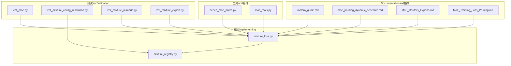
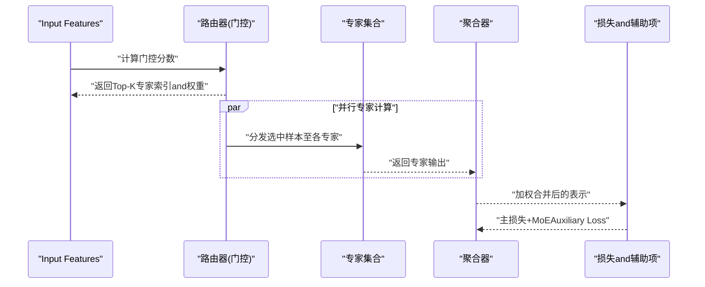
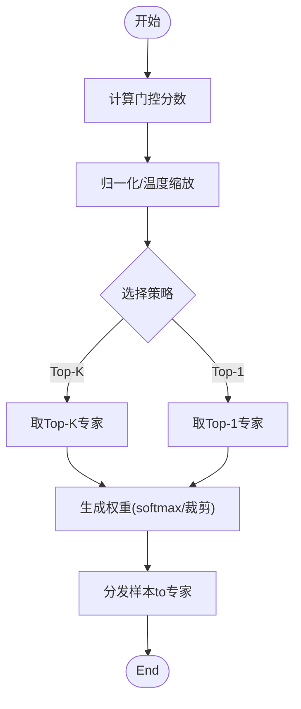
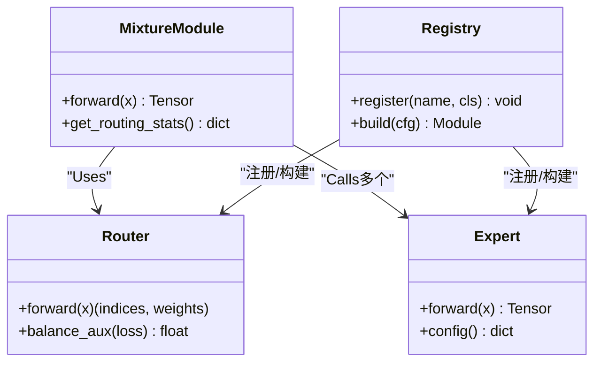
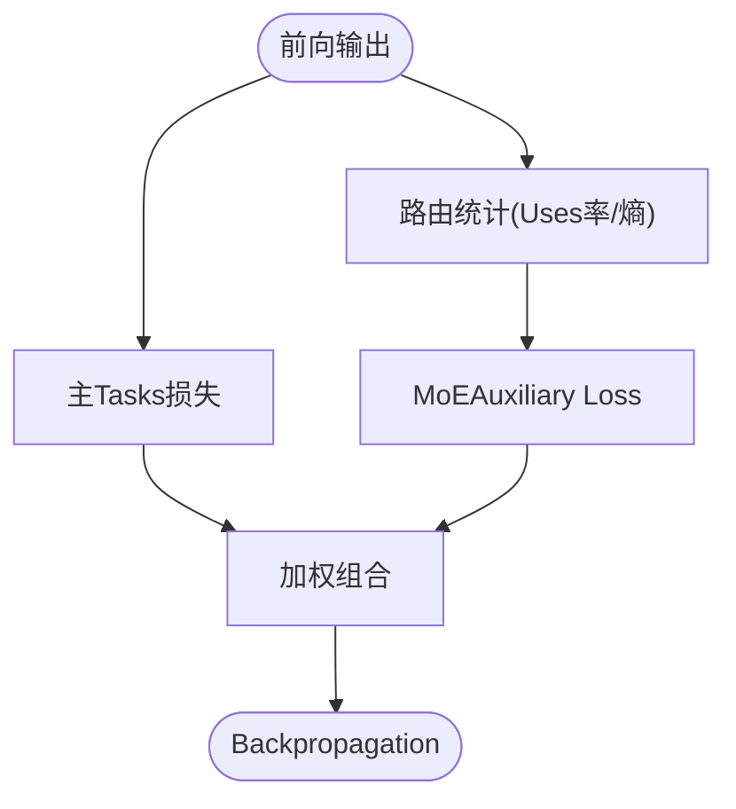
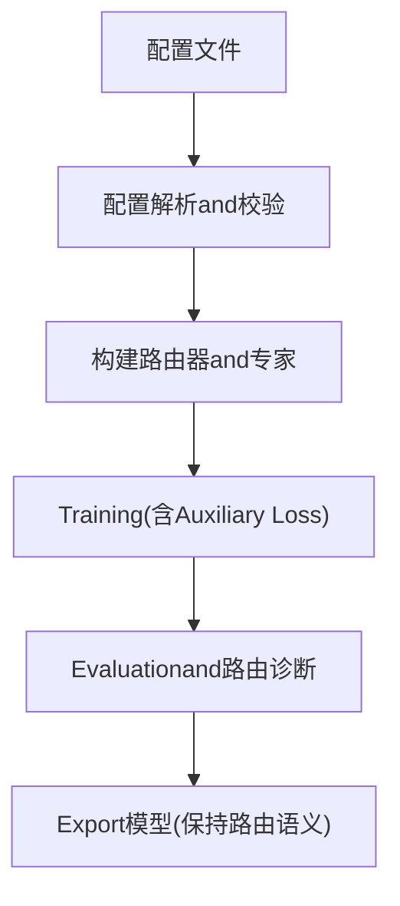
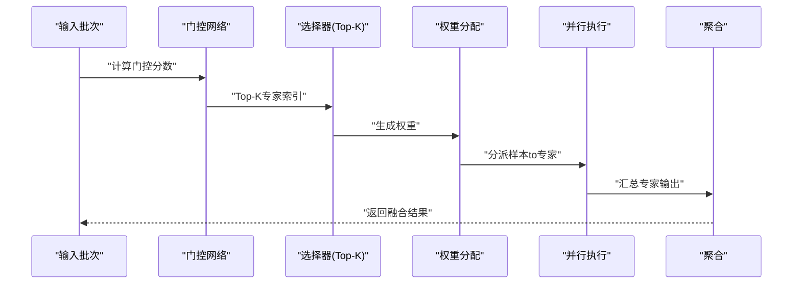
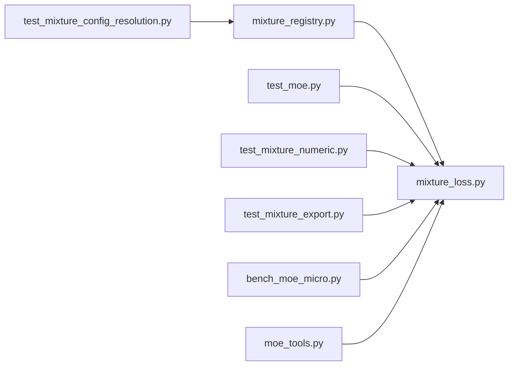

# MoE Architecture Design

<cite>
**Files Referenced in This Document**
- [mixture_loss.py](file://ultralytics/nn/mixture_loss.py)
- [mixture_registry.py](file://ultralytics/nn/mixture_registry.py)
- [test_moe.py](file://tests/test_moe.py)
- [test_mixture_config_resolution.py](file://tests/test_mixture_config_resolution.py)
- [test_mixture_numeric.py](file://tests/test_mixture_numeric.py)
- [test_mixture_export.py](file://tests/test_mixture_export.py)
- [bench_moe_micro.py](file://scripts/bench_moe_micro.py)
- [moe_tools.py](file://agent/runtime/cli/moe_tools.py)
- [molora_guide.md](file://docs/molora_guide.md)
- [moe_pruning_dynamic_schedule.md](file://docs/moe_pruning_dynamic_schedule.md)
- [MoE_Routers_Experts.md](file://wiki/MoE/MoE_Routers_Experts.md)
- [MoE_Training_Loss_Pruning.md](file://wiki/MoE/MoE_Training_Loss_Pruning.md)
</cite>

## Table of Contents
1. [引言](#引言)
2. [Project Structure](#Project Structure)
3. [Core Components](#Core Components)
4. [Architecture Overview](#Architecture Overview)
5. [Detailed Component Analysis](#Detailed Component Analysis)
6. [Dependency Analysis](#Dependency Analysis)
7. [性能考量](#性能考量)
8. [Troubleshooting Guide](#Troubleshooting Guide)
9. [Conclusion](#Conclusion)
10. [Appendix](#Appendix)

## 引言
本文件聚焦于YOLO-Master中Mixture of Experts（MoE）的Core Architecture设计andimplementing要点，围绕Centered on下目标unfold：
- Expert Network的Modules化结构and注册机制
- 路由器的决策机制andLoad Balancing策略
- 动态激活and稀疏计算的门控、专家选择and权重分配
- 配置Examplesand调度策略说明
- 架构图and数据流说明，帮助理解MoE相比传统密集模型的优势andApplicable Scenarios

## Project Structure
whileYOLO-Master中，MoE相关capabilities主要分布whileCentered on下位置：
- 核心Modulesand损失：ultralytics/nn/mixture_loss.py、ultralytics/nn/mixture_registry.py
- 测试andValidation：tests/test_moe.py、tests/test_mixture_*.py
- 基准and工具：scripts/bench_moe_micro.py、agent/runtime/cli/moe_tools.py
- Documentationand指南：docs/molora_guide.md、docs/moe_pruning_dynamic_schedule.md、wiki/MoE/*.md

Figure Source
- [mixture_loss.py](file://ultralytics/nn/mixture_loss.py)
- [mixture_registry.py](file://ultralytics/nn/mixture_registry.py)
- [test_moe.py](file://tests/test_moe.py)
- [test_mixture_config_resolution.py](file://tests/test_mixture_config_resolution.py)
- [test_mixture_numeric.py](file://tests/test_mixture_numeric.py)
- [test_mixture_export.py](file://tests/test_mixture_export.py)
- [bench_moe_micro.py](file://scripts/bench_moe_micro.py)
- [moe_tools.py](file://agent/runtime/cli/moe_tools.py)
- [molora_guide.md](file://docs/molora_guide.md)
- [moe_pruning_dynamic_schedule.md](file://docs/moe_pruning_dynamic_schedule.md)
- [MoE_Routers_Experts.md](file://wiki/MoE/MoE_Routers_Experts.md)
- [MoE_Training_Loss_Pruning.md](file://wiki/MoE/MoE_Training_Loss_Pruning.md)

Section Source
- [mixture_loss.py](file://ultralytics/nn/mixture_loss.py)
- [mixture_registry.py](file://ultralytics/nn/mixture_registry.py)
- [test_moe.py](file://tests/test_moe.py)
- [test_mixture_config_resolution.py](file://tests/test_mixture_config_resolution.py)
- [test_mixture_numeric.py](file://tests/test_mixture_numeric.py)
- [test_mixture_export.py](file://tests/test_mixture_export.py)
- [bench_moe_micro.py](file://scripts/bench_moe_micro.py)
- [moe_tools.py](file://agent/runtime/cli/moe_tools.py)
- [molora_guide.md](file://docs/molora_guide.md)
- [moe_pruning_dynamic_schedule.md](file://docs/moe_pruning_dynamic_schedule.md)
- [MoE_Routers_Experts.md](file://wiki/MoE/MoE_Routers_Experts.md)
- [MoE_Training_Loss_Pruning.md](file://wiki/MoE/MoE_Training_Loss_Pruning.md)

## Core Components
- Expert Network（Experts）
  - Centered on可插拔的Modules化形式存while，ViaRegistry进行统一管理and实例化。
  - Supporting按层或按Tasks挂载不同专家，便于Multimodaland多Tasks扩展。
- 路由器（Router/Gating）
  - 负责将Input Features映射to专家选择and权重分配，通常包含门控网络andTop-K选择逻辑。
  - provides多种routing strategies（such asTop-K、Top-1），并可andLoad Balancing辅助项Combining。
- Mixture聚合（Mixture Aggregation）
  - 对选中的专家输出进行加权求和，得to最终表示。
- 损失and辅助项（Loss & Auxiliaries）
  - 包括主Tasks损失andMoE相关的Auxiliary Loss（such asLoad Balancing、路由熵etc.）。
- 配置and注册（Config & Registry）
  - Via配置文件定义专家数量、路由参数、调度策略，并由Registry解析and构建。

Section Source
- [mixture_registry.py](file://ultralytics/nn/mixture_registry.py)
- [mixture_loss.py](file://ultralytics/nn/mixture_loss.py)
- [test_moe.py](file://tests/test_moe.py)
- [test_mixture_config_resolution.py](file://tests/test_mixture_config_resolution.py)
- [test_mixture_numeric.py](file://tests/test_mixture_numeric.py)
- [test_mixture_export.py](file://tests/test_mixture_export.py)

## Architecture Overview
下图展示了MoEwhileForward InferenceandTraining过程中的关键数据流：Input Features进入路由器，路由器输出专家索引and权重；被激活的专家并行处理各自子集的特征；最后由聚合器按Weight Merging结果。

Figure Source
- [mixture_loss.py](file://ultralytics/nn/mixture_loss.py)
- [mixture_registry.py](file://ultralytics/nn/mixture_registry.py)
- [test_moe.py](file://tests/test_moe.py)

## Detailed Component Analysis

### 路由器and门控机制
- 门控网络
  - 将Input Features投影for专家得分，常用softmax或top-k softmax生成权重。
  - Supporting温度系数、掩码and裁剪策略，控制稀疏度and稳定性。
- 专家选择算法
  - Top-K选择：每个输入仅激活K个专家，保证稀疏性。
  - OptionalTop-1或自适应K，根据Tasks需求调整。
- Load Balancing策略
  - 引入Auxiliary Loss鼓励均匀Uses专家，避免“热点专家”现象。
  - 常见策略包括容量因子、路由熵惩罚、频率均衡etc.。

Figure Source
- [mixture_loss.py](file://ultralytics/nn/mixture_loss.py)
- [test_moe.py](file://tests/test_moe.py)

Section Source
- [mixture_loss.py](file://ultralytics/nn/mixture_loss.py)
- [test_moe.py](file://tests/test_moe.py)

### Expert NetworkandModules化结构
- Modules化设计
  - 专家作for独立Modules，可ViaRegistry动态加载and替换。
  - Supporting不同维度and结构的专家，适配不同子Tasks或领域。
- 并行and稀疏执行
  - 仅激活少数专家，减少计算量and内存占用。
  - 借助批内重排and分块，提升GPU利用率。

Figure Source
- [mixture_registry.py](file://ultralytics/nn/mixture_registry.py)
- [mixture_loss.py](file://ultralytics/nn/mixture_loss.py)
- [test_moe.py](file://tests/test_moe.py)

Section Source
- [mixture_registry.py](file://ultralytics/nn/mixture_registry.py)
- [mixture_loss.py](file://ultralytics/nn/mixture_loss.py)
- [test_moe.py](file://tests/test_moe.py)

### Loss Functionand辅助项
- 主Tasks损失
  - and下游Tasks一致（检测、分割、姿态etc.）。
- MoEAuxiliary Loss
  - Load Balancing：促使各专家Uses率趋于均匀。
  - 路由熵：鼓励更确定性的路由，提高稀疏性and效率。
- 组合方式
  - 加权组合主损失andAuxiliary Loss，超参可调。

Figure Source
- [mixture_loss.py](file://ultralytics/nn/mixture_loss.py)
- [test_mixture_numeric.py](file://tests/test_mixture_numeric.py)

Section Source
- [mixture_loss.py](file://ultralytics/nn/mixture_loss.py)
- [test_mixture_numeric.py](file://tests/test_mixture_numeric.py)

### 配置and调度策略
- 专家数量and类型
  - Via配置文件指定专家总数、每层专家数and专家类型。
- 路由参数
  - 设置Top-K、温度系数、门控维度and正则化强度。
- 调度策略
  - 静态调度：固定专家容量and路由规则。
  - 动态调度：根据负载and历史Uses率调整路由偏好或容量。
- Exportand兼容性
  - 确保路由and专家whileExport格式下保持行for一致。

Figure Source
- [test_mixture_config_resolution.py](file://tests/test_mixture_config_resolution.py)
- [test_mixture_export.py](file://tests/test_mixture_export.py)
- [molora_guide.md](file://docs/molora_guide.md)
- [moe_pruning_dynamic_schedule.md](file://docs/moe_pruning_dynamic_schedule.md)

Section Source
- [test_mixture_config_resolution.py](file://tests/test_mixture_config_resolution.py)
- [test_mixture_export.py](file://tests/test_mixture_export.py)
- [molora_guide.md](file://docs/molora_guide.md)
- [moe_pruning_dynamic_schedule.md](file://docs/moe_pruning_dynamic_schedule.md)

### 动态激活and稀疏计算
- 门控机制
  - 基于Input Features的实时门控，决定哪些专家参and计算。
- 专家选择算法
  - Top-K选择保证稀疏性，降低计算开销。
- 权重分配策略
  - 软权重用于平滑Gradient，硬选择用于极致稀疏。
- 动态调度
  - 根据运行时负载and历史统计，动态调整路由偏好或容量上限。

Figure Source
- [moe_tools.py](file://agent/runtime/cli/moe_tools.py)
- [bench_moe_micro.py](file://scripts/bench_moe_micro.py)
- [molora_guide.md](file://docs/molora_guide.md)

Section Source
- [moe_tools.py](file://agent/runtime/cli/moe_tools.py)
- [bench_moe_micro.py](file://scripts/bench_moe_micro.py)
- [molora_guide.md](file://docs/molora_guide.md)

## Dependency Analysis
- 内部依赖
  - mixture_loss.py依赖mixture_registry.py进行Modules注册and构建。
  - 测试用例覆盖配置解析、数值稳定性andExport一致性。
- External Dependencies
  - 基于PyTorch张量操作and分布式通信（such as需DDP）。
  - Export流程需兼容ONNX/TensorRTetc.后端。

Figure Source
- [mixture_registry.py](file://ultralytics/nn/mixture_registry.py)
- [mixture_loss.py](file://ultralytics/nn/mixture_loss.py)
- [test_moe.py](file://tests/test_moe.py)
- [test_mixture_config_resolution.py](file://tests/test_mixture_config_resolution.py)
- [test_mixture_numeric.py](file://tests/test_mixture_numeric.py)
- [test_mixture_export.py](file://tests/test_mixture_export.py)
- [bench_moe_micro.py](file://scripts/bench_moe_micro.py)
- [moe_tools.py](file://agent/runtime/cli/moe_tools.py)

Section Source
- [mixture_registry.py](file://ultralytics/nn/mixture_registry.py)
- [mixture_loss.py](file://ultralytics/nn/mixture_loss.py)
- [test_moe.py](file://tests/test_moe.py)
- [test_mixture_config_resolution.py](file://tests/test_mixture_config_resolution.py)
- [test_mixture_numeric.py](file://tests/test_mixture_numeric.py)
- [test_mixture_export.py](file://tests/test_mixture_export.py)
- [bench_moe_micro.py](file://scripts/bench_moe_micro.py)
- [moe_tools.py](file://agent/runtime/cli/moe_tools.py)

## 性能考量
- 稀疏性带来的收益
  - 仅激活部分专家，显著降低FLOPsand显存占用。
- 并行and通信
  - 合理划分专家and批次，减少跨设备通信开销。
- 路由稳定性
  - 温度系数andAuxiliary Loss平衡稀疏性and收敛性。
- ExportOptimization
  - 固化路由路径或采用Routing-Aware Merging，提升部署效率。

[This section provides general guidance and does not directly analyze specific files]

## Troubleshooting Guide
- 路由不稳定或NaN
  - 检查门控分数是否溢出，适当调整温度and裁剪阈值。
  - 确认Auxiliary Loss权重and容量因子设置合理。
- 专家Uses不均
  - 增强Load Balancing辅助项，监控专家Uses率分布。
- Export后行for不一致
  - Validation路由and专家whileExport前后的一致性，Refer toExport测试用例。

Section Source
- [test_mixture_numeric.py](file://tests/test_mixture_numeric.py)
- [test_mixture_export.py](file://tests/test_mixture_export.py)
- [MoE_Training_Loss_Pruning.md](file://wiki/MoE/MoE_Training_Loss_Pruning.md)

## Conclusion
YOLO-Master的MoE架构ViaModules化专家、灵活的路由器and完善的Auxiliary Loss，implementing了高效的稀疏计算and良好的可Extensibility。Combined with动态调度andExportOptimization，可while复杂视觉Tasks中获得优于传统密集模型的性价比表现。建议while实际项目中CombiningTasks特性and资源约束，选择合适的专家数量、routing strategiesand调度方案，并Via基准and诊断工具持续Optimization。

[This section is summary content and does not directly analyze specific files]

## Appendix
- 配置Examples要点
  - 专家数量：定义全局and每层专家数，Supporting异构专家类型。
  - 路由参数：Top-K、温度系数、门控维度、正则化强度。
  - 调度策略：静态容量and动态偏好调整，CombiningUses率统计。
- Refer toDocumentation
  - molora_guide.md：MoloraandMoE集成指南
  - moe_pruning_dynamic_schedule.md：动态剪枝and调度策略
  - MoE_Routers_Experts.md：路由器and专家的设计说明
  - MoE_Training_Loss_Pruning.md：Training损失and剪枝实践

Section Source
- [molora_guide.md](file://docs/molora_guide.md)
- [moe_pruning_dynamic_schedule.md](file://docs/moe_pruning_dynamic_schedule.md)
- [MoE_Routers_Experts.md](file://wiki/MoE/MoE_Routers_Experts.md)
- [MoE_Training_Loss_Pruning.md](file://wiki/MoE/MoE_Training_Loss_Pruning.md)