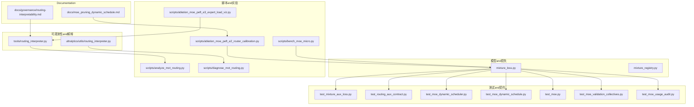
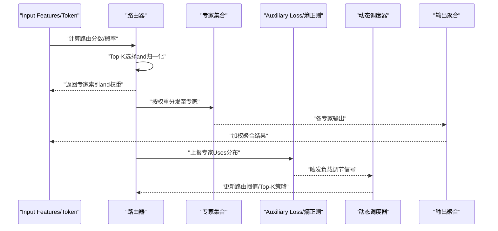
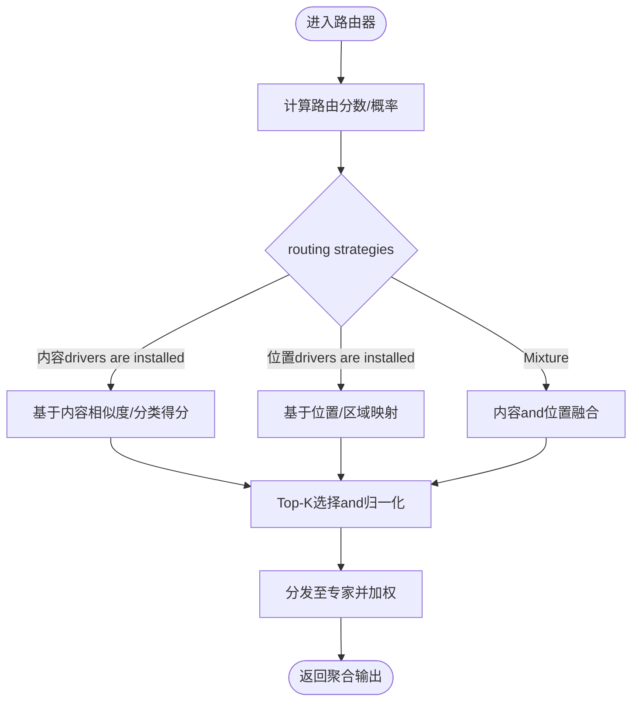
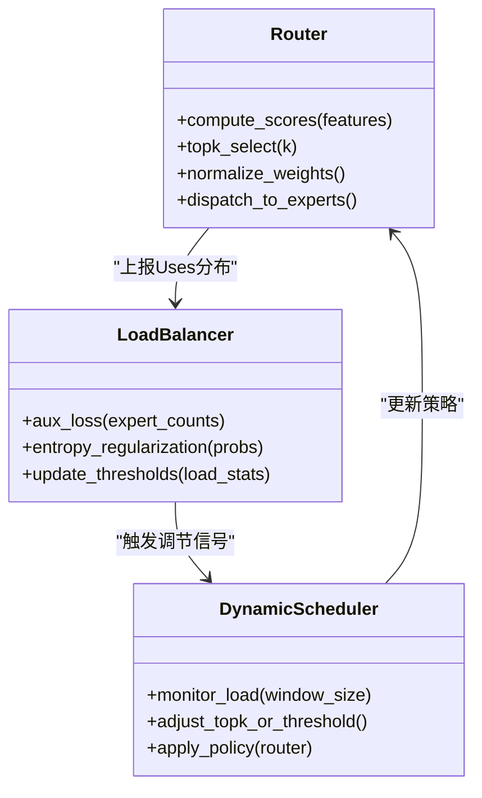
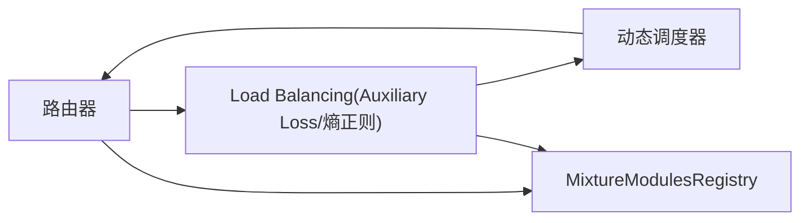
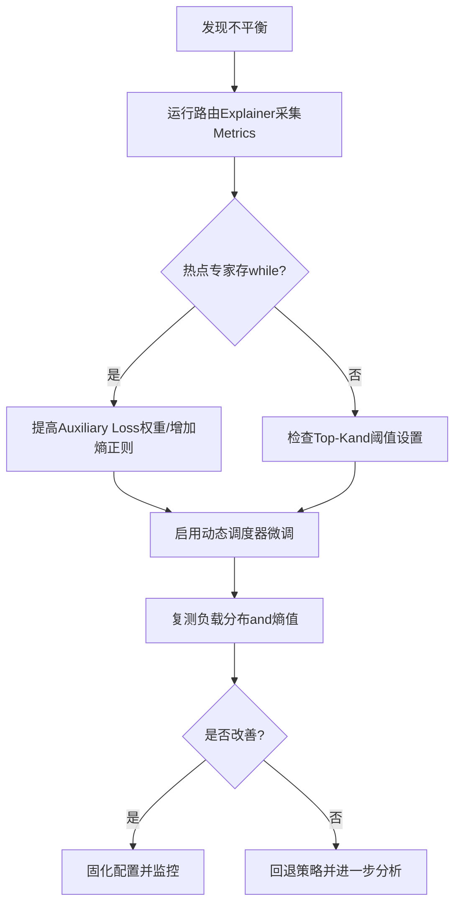

# Routing Mechanism and Load Balancing

<cite>
**Files Referenced in This Document**
- [mixture_loss.py](file://ultralytics/nn/mixture_loss.py)
- [mixture_registry.py](file://ultralytics/nn/mixture_registry.py)
- [test_mixture_aux_loss.py](file://tests/test_mixture_aux_loss.py)
- [test_moe_dynamic_scheduler.py](file://tests/test_moe_dynamic_scheduler.py)
- [test_moe_dynamic_schedule.py](file://tests/test_moe_dynamic_schedule.py)
- [test_routing_aux_contract.py](file://tests/test_routing_aux_contract.py)
- [routing_interpreter.py](file://tools/routing_interpreter.py)
- [routing_interpreter.py](file://ultralytics/utils/routing_interpreter.py)
- [analyze_mot_routing.py](file://scripts/analyze_mot_routing.py)
- [diagnose_mot_routing.py](file://scripts/diagnose_mot_routing.py)
- [ablation_moe_peft_e2_router_calibration.py](file://scripts/ablation_moe_peft_e2_router_calibration.py)
- [ablation_moe_peft_e3_expert_load_viz.py](file://scripts/ablation_moe_peft_e3_expert_load_viz.py)
- [bench_moe_micro.py](file://scripts/bench_moe_micro.py)
- [test_moe.py](file://tests/test_moe.py)
- [test_moe_validation_collectives.py](file://tests/test_moe_validation_collectives.py)
- [test_moe_usage_audit.py](file://tests/test_moe_usage_audit.py)
- [moe_pruning_dynamic_schedule.md](file://docs/moe_pruning_dynamic_schedule.md)
- [routing-interpretability.md](file://docs/governance/routing-interpretability.md)
</cite>

## Table of Contents
1. [Introduction](#Introduction)
2. [Project Structure](#Project Structure)
3. [Core Components](#Core Components)
4. [Architecture Overview](#Architecture Overview)
5. [Detailed Component Analysis](#Detailed Component Analysis)
6. [Dependency Analysis](#Dependency Analysis)
7. [性能考量](#性能考量)
8. [Troubleshooting Guide](#Troubleshooting Guide)
9. [Conclusion](#Conclusion)
10. [Appendix](#Appendix)

## Introduction
本文件聚焦于MoE（Mixture of Experts）系统中的“Routing Mechanism”和“Load Balancing策略”，围绕路由器工作原理、Load Balancing算法（辅助Loss Function、熵正则化、动态调度器）、不同routing strategies的优缺点andApplicable Scenarios，Centered onandVisualization、监控Metricsand调试工具的Uses进行系统化说明。Documentation旨while帮助读者快速定位implementing位置、理解设计动机并指导配置Optimizationand问题诊断。

## Project Structure
本项目whileCentered on下路径中implementing了andMoE路由andLoad Balancing相关的核心capabilities：
- 模型层and损失计算：ultralytics/nn/mixture_loss.py、ultralytics/nn/mixture_registry.py
- 测试and契约Validation：tests/test_mixture_aux_loss.py、tests/test_routing_aux_contract.py、tests/test_moe_dynamic_scheduler.py、tests/test_moe_dynamic_schedule.py、tests/test_moe.py、tests/test_moe_validation_collectives.py、tests/test_moe_usage_audit.py
- 路由解释and可观测性：tools/routing_interpreter.py、ultralytics/utils/routing_interpreter.py
- 脚本and实验：scripts/analyze_mot_routing.py、scripts/diagnose_mot_routing.py、scripts/ablation_moe_peft_e2_router_calibration.py、scripts/ablation_moe_peft_e3_expert_load_viz.py、scripts/bench_moe_micro.py
- Documentationand治理：docs/moe_pruning_dynamic_schedule.md、docs/governance/routing-interpretability.md

Figure Source
- [mixture_loss.py](file://ultralytics/nn/mixture_loss.py)
- [mixture_registry.py](file://ultralytics/nn/mixture_registry.py)
- [test_mixture_aux_loss.py](file://tests/test_mixture_aux_loss.py)
- [test_routing_aux_contract.py](file://tests/test_routing_aux_contract.py)
- [test_moe_dynamic_scheduler.py](file://tests/test_moe_dynamic_scheduler.py)
- [test_moe_dynamic_schedule.py](file://tests/test_moe_dynamic_schedule.py)
- [test_moe.py](file://tests/test_moe.py)
- [test_moe_validation_collectives.py](file://tests/test_moe_validation_collectives.py)
- [test_moe_usage_audit.py](file://tests/test_moe_usage_audit.py)
- [routing_interpreter.py](file://tools/routing_interpreter.py)
- [routing_interpreter.py](file://ultralytics/utils/routing_interpreter.py)
- [analyze_mot_routing.py](file://scripts/analyze_mot_routing.py)
- [diagnose_mot_routing.py](file://scripts/diagnose_mot_routing.py)
- [ablation_moe_peft_e2_router_calibration.py](file://scripts/ablation_moe_peft_e2_router_calibration.py)
- [ablation_moe_peft_e3_expert_load_viz.py](file://scripts/ablation_moe_peft_e3_expert_load_viz.py)
- [bench_moe_micro.py](file://scripts/bench_moe_micro.py)
- [moe_pruning_dynamic_schedule.md](file://docs/moe_pruning_dynamic_schedule.md)
- [routing-interpretability.md](file://docs/governance/routing-interpretability.md)

Section Source
- [mixture_loss.py](file://ultralytics/nn/mixture_loss.py)
- [mixture_registry.py](file://ultralytics/nn/mixture_registry.py)
- [routing_interpreter.py](file://tools/routing_interpreter.py)
- [routing_interpreter.py](file://ultralytics/utils/routing_interpreter.py)
- [analyze_mot_routing.py](file://scripts/analyze_mot_routing.py)
- [diagnose_mot_routing.py](file://scripts/diagnose_mot_routing.py)
- [ablation_moe_peft_e2_router_calibration.py](file://scripts/ablation_moe_peft_e2_router_calibration.py)
- [ablation_moe_peft_e3_expert_load_viz.py](file://scripts/ablation_moe_peft_e3_expert_load_viz.py)
- [bench_moe_micro.py](file://scripts/bench_moe_micro.py)
- [moe_pruning_dynamic_schedule.md](file://docs/moe_pruning_dynamic_schedule.md)
- [routing-interpretability.md](file://docs/governance/routing-interpretability.md)

## Core Components
- 路由andExpert Modules
  - 路由负责将输入token或特征映射to专家集合，SupportingTop-K选择and权重分配；专家for可独立Trainingand调度的子网络。
  - 关键接口and契约由测试用例定义，确保路由输出、负载统计andAuxiliary Loss的稳定性and一致性。
- Load BalancingandAuxiliary Loss
  - Via辅助Loss Function对专家Uses分布施加约束，抑制“赢家通吃”现象，促进多专家均衡参and。
  - 熵正则项用于鼓励路由概率分布更均匀，避免过度集中。
- 动态调度器
  - 根据历史负载或实时统计调整路由阈值或Top-K策略，缓解热点专家过载。
- 可观测性and解释
  - provides路由ExplainerandVisualization脚本，记录专家命中次数、负载分布、熵值etc.Metrics，便于诊断不平衡问题。

Section Source
- [test_moe.py](file://tests/test_moe.py)
- [test_moe_validation_collectives.py](file://tests/test_moe_validation_collectives.py)
- [test_moe_usage_audit.py](file://tests/test_moe_usage_audit.py)
- [test_mixture_aux_loss.py](file://tests/test_mixture_aux_loss.py)
- [test_routing_aux_contract.py](file://tests/test_routing_aux_contract.py)
- [test_moe_dynamic_scheduler.py](file://tests/test_moe_dynamic_scheduler.py)
- [test_moe_dynamic_schedule.py](file://tests/test_moe_dynamic_schedule.py)
- [mixture_loss.py](file://ultralytics/nn/mixture_loss.py)
- [mixture_registry.py](file://ultralytics/nn/mixture_registry.py)
- [routing_interpreter.py](file://tools/routing_interpreter.py)
- [routing_interpreter.py](file://ultralytics/utils/routing_interpreter.py)

## Architecture Overview
下图展示了从输入to路由决策、专家执行andLoad Balancing反馈的整体流程，包括Auxiliary Lossand动态调度器的作用点。

Figure Source
- [mixture_loss.py](file://ultralytics/nn/mixture_loss.py)
- [mixture_registry.py](file://ultralytics/nn/mixture_registry.py)
- [test_moe_dynamic_scheduler.py](file://tests/test_moe_dynamic_scheduler.py)
- [test_moe_dynamic_schedule.py](file://tests/test_moe_dynamic_schedule.py)
- [routing_interpreter.py](file://tools/routing_interpreter.py)

## Detailed Component Analysis

### 路由器工作原理
- 基于内容的路由
  - 依据Input Features语义相似度或分类头得分选择专家，适合Tasks或领域差异明显的场景。
  - Advantages：针对性强、收敛快；缺点：易导致局部热点。
- 基于位置的路由
  - 依据序列位置或空间区域固定映射to专家，适合结构化数据或稳定模式。
  - Advantages：确定性高、开销低；缺点：灵活性差、难Centered on适应分布漂移。
- Mixturerouting strategies
  - 融合内容and位置信息，CombiningTop-Kand软分配，兼顾灵活性and稳定性。
  - Advantages：鲁棒性强；缺点：参数较多、需精细调参。

Figure Source
- [routing_interpreter.py](file://tools/routing_interpreter.py)
- [routing_interpreter.py](file://ultralytics/utils/routing_interpreter.py)
- [test_moe.py](file://tests/test_moe.py)

Section Source
- [routing_interpreter.py](file://tools/routing_interpreter.py)
- [routing_interpreter.py](file://ultralytics/utils/routing_interpreter.py)
- [test_moe.py](file://tests/test_moe.py)

### Load Balancing算法
- 辅助Loss Function
  - 目标：使专家Uses分布接近均匀，降低方差，防止少数专家过载。
  - implementing要点：统计每步专家被选中的频率，构造惩罚项加入总损失。
- 熵正则化
  - 目标：提高路由概率分布的熵，避免过于尖锐的Top-1选择。
  - implementing要点：对路由概率计算负熵作for正则项，平衡探索and利用。
- 动态调度器
  - 目标：根据历史负载或实时Metrics自适应调整Top-K或阈值，缓解热点。
  - implementing要点：维护滑动窗口统计，当某专家负载超过阈值时提升其“吸引力”或降低其他专家权重。

Figure Source
- [mixture_loss.py](file://ultralytics/nn/mixture_loss.py)
- [test_mixture_aux_loss.py](file://tests/test_mixture_aux_loss.py)
- [test_routing_aux_contract.py](file://tests/test_routing_aux_contract.py)
- [test_moe_dynamic_scheduler.py](file://tests/test_moe_dynamic_scheduler.py)
- [test_moe_dynamic_schedule.py](file://tests/test_moe_dynamic_schedule.py)

Section Source
- [mixture_loss.py](file://ultralytics/nn/mixture_loss.py)
- [test_mixture_aux_loss.py](file://tests/test_mixture_aux_loss.py)
- [test_routing_aux_contract.py](file://tests/test_routing_aux_contract.py)
- [test_moe_dynamic_scheduler.py](file://tests/test_moe_dynamic_scheduler.py)
- [test_moe_dynamic_schedule.py](file://tests/test_moe_dynamic_schedule.py)

### 不同路由算法的优缺点andApplicable Scenarios
- 内容路由
  - Advantages：语义匹配精准；缺点：对分布变化敏感。
  - 适用：多Tasks或多领域Mixture数据。
- 位置路由
  - Advantages：稳定且高效；缺点：缺乏灵活性。
  - 适用：结构化或时序稳定的数据。
- Mixture路由
  - Advantages：鲁棒性高；缺点：需要更多超参and算力。
  - 适用：复杂场景、长尾分布and动态环境。

Section Source
- [routing_interpreter.py](file://tools/routing_interpreter.py)
- [routing_interpreter.py](file://ultralytics/utils/routing_interpreter.py)
- [test_moe.py](file://tests/test_moe.py)

### 路由配置Optimization指南
- 超参建议
  - Top-K：小批量或资源受限场景取较小值，大模型或复杂Tasks适当增大。
  - Auxiliary Loss权重：初始中etc.强度，随Training逐步衰减Centered on避免过约束。
  - 熵正则系数：控制探索程度，过大可能影响精度，过小无法缓解不平衡。
  - 动态调度窗口：根据数据节奏设置，避免频繁抖动。
- 实践步骤
  - 先启用内容路由+Auxiliary Loss，观察专家负载分布；
  - 若出现热点，引入熵正则and动态调度微调；
  - 针对稳定模式场景尝试位置路由或Mixture路由；
  - UsesExplainerandVisualization脚本持续监控并迭代。

Section Source
- [moe_pruning_dynamic_schedule.md](file://docs/moe_pruning_dynamic_schedule.md)
- [ablation_moe_peft_e2_router_calibration.py](file://scripts/ablation_moe_peft_e2_router_calibration.py)
- [ablation_moe_peft_e3_expert_load_viz.py](file://scripts/ablation_moe_peft_e3_expert_load_viz.py)

## Dependency Analysis
- Modules耦合
  - 路由器andLoad Balancing紧密耦合，Via统计and损失反馈形成闭环；
  - 动态调度器依赖负载统计androuting strategies接口，具备一定解耦性。
- External Dependencies
  - 分布式校验and审计用例表明系统考虑了跨设备的一致性检查andUses审计。
- Potential Cycles依赖
  - Via明确的接口契约and测试覆盖，降低循环依赖风险。

Figure Source
- [mixture_registry.py](file://ultralytics/nn/mixture_registry.py)
- [test_moe_validation_collectives.py](file://tests/test_moe_validation_collectives.py)
- [test_moe_usage_audit.py](file://tests/test_moe_usage_audit.py)

Section Source
- [mixture_registry.py](file://ultralytics/nn/mixture_registry.py)
- [test_moe_validation_collectives.py](file://tests/test_moe_validation_collectives.py)
- [test_moe_usage_audit.py](file://tests/test_moe_usage_audit.py)

## 性能考量
- 路由开销
  - Top-Kand归一化while批维度上并行计算，注意内存带宽and算子融合；
  - 大规模专家集合下，Recommended to use稀疏分发and异步聚合。
- Load Balancing成本
  - Auxiliary Lossand熵正则计算轻量，但需维护全局统计，分布式场景需allreduce同步；
  - 动态调度器应限制更新频率，避免频繁重规划。
- 基准and微基准
  - Uses微基准脚本Evaluation路由and专家调度的端to端延迟and吞吐，定位bottlenecks。

Section Source
- [bench_moe_micro.py](file://scripts/bench_moe_micro.py)
- [test_moe.py](file://tests/test_moe.py)

## Troubleshooting Guide
- 常见问题
  - 专家过载：部分专家命中率显著高于平均，其余闲置；
  - 路由不稳定：Top-K频繁切换，负载波动剧烈；
  - 数值异常：路由概率NaN或Inf，导致Training崩溃。
- 诊断步骤
  - Uses路由Explainer收集专家命中次数、负载分布and熵值；
  - 借助分析脚本对比不同批次and时间窗口的负载曲线；
  - 检查Auxiliary Loss权重and熵正则系数是否合理；
  - 调整动态调度窗口and阈值，观察改善效果。
- 工具and脚本
  - 路由Explainer：tools/routing_interpreter.py、ultralytics/utils/routing_interpreter.py
  - 分析and诊断：scripts/analyze_mot_routing.py、scripts/diagnose_mot_routing.py
  - 校准andVisualization：scripts/ablation_moe_peft_e2_router_calibration.py、scripts/ablation_moe_peft_e3_expert_load_viz.py

Figure Source
- [routing_interpreter.py](file://tools/routing_interpreter.py)
- [routing_interpreter.py](file://ultralytics/utils/routing_interpreter.py)
- [analyze_mot_routing.py](file://scripts/analyze_mot_routing.py)
- [diagnose_mot_routing.py](file://scripts/diagnose_mot_routing.py)
- [ablation_moe_peft_e2_router_calibration.py](file://scripts/ablation_moe_peft_e2_router_calibration.py)
- [ablation_moe_peft_e3_expert_load_viz.py](file://scripts/ablation_moe_peft_e3_expert_load_viz.py)

Section Source
- [routing_interpreter.py](file://tools/routing_interpreter.py)
- [routing_interpreter.py](file://ultralytics/utils/routing_interpreter.py)
- [analyze_mot_routing.py](file://scripts/analyze_mot_routing.py)
- [diagnose_mot_routing.py](file://scripts/diagnose_mot_routing.py)
- [ablation_moe_peft_e2_router_calibration.py](file://scripts/ablation_moe_peft_e2_router_calibration.py)
- [ablation_moe_peft_e3_expert_load_viz.py](file://scripts/ablation_moe_peft_e3_expert_load_viz.py)

## Conclusion
本项目whileMoE路由andLoad Balancing方面provides了完整的implementingand工具链：路由器Supporting多种策略，Load BalancingViaAuxiliary Lossand熵正则抑制热点，动态调度器进一步提升鲁棒性。Combined with路由ExplainerandVisualization脚本，User可高效诊断andOptimization路由不平衡问题。建议while复杂场景中优先采用Mixture路由并Combining动态调度，同时Centered on微基准and监控Metrics持续Validation性能and稳定性。

## Appendix
- 相关Documentation
  - 动态调度and剪枝策略：docs/moe_pruning_dynamic_schedule.md
  - 路由可解释性治理规范：docs/governance/routing-interpretability.md

Section Source
- [moe_pruning_dynamic_schedule.md](file://docs/moe_pruning_dynamic_schedule.md)
- [routing-interpretability.md](file://docs/governance/routing-interpretability.md)