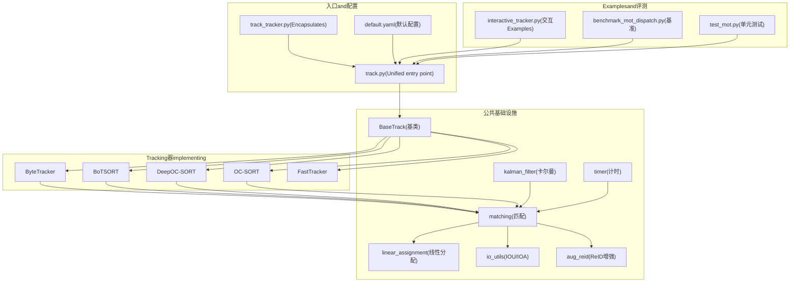
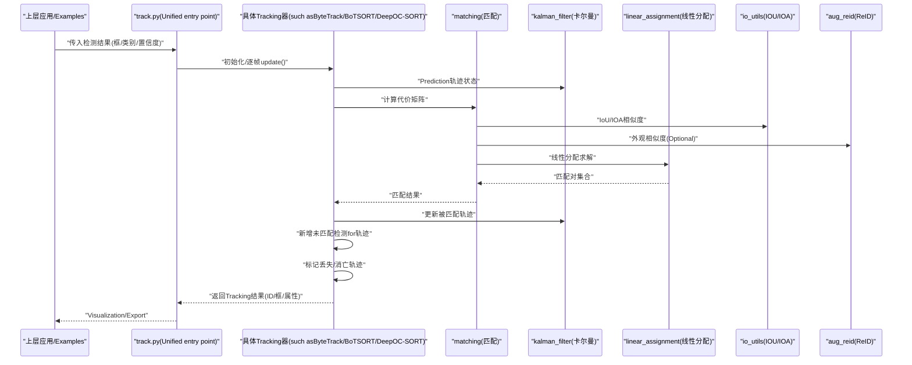
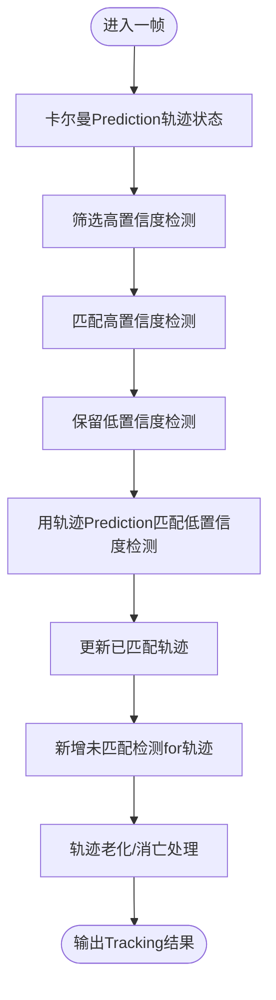
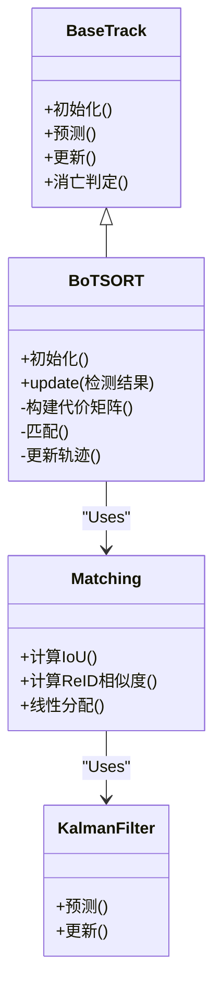
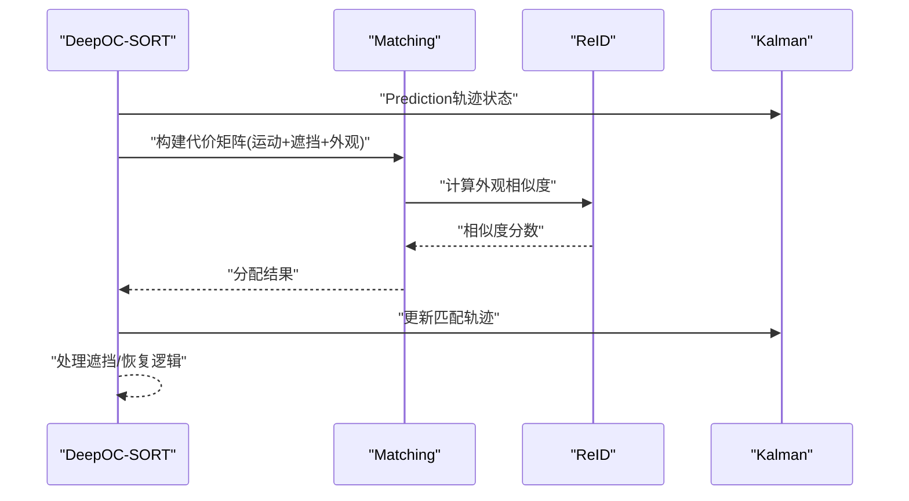
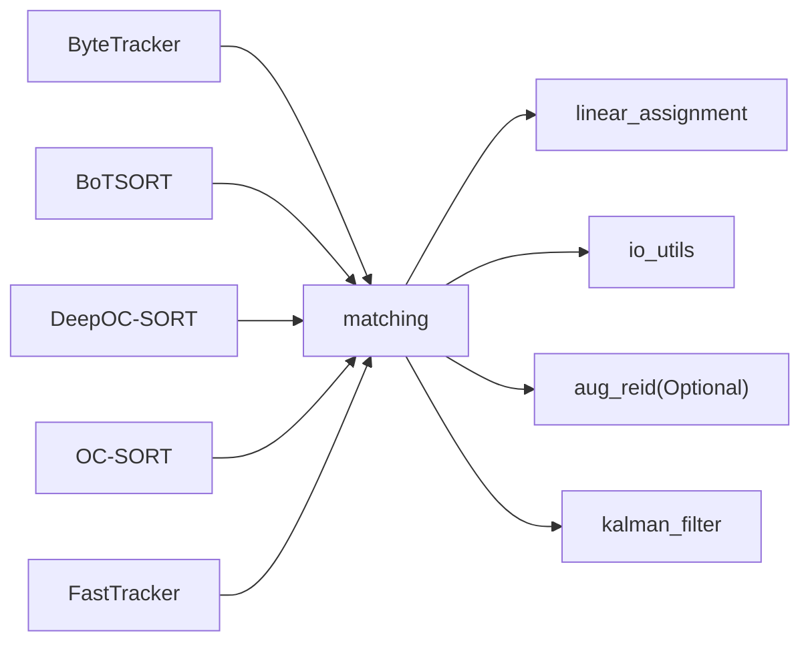

# Multi-Object Tracking

<cite>
**Files Referenced in This Document**
- [ultralytics/trackers/__init__.py](file://ultralytics/trackers/__init__.py)
- [ultralytics/trackers/basetrack.py](file://ultralytics/trackers/basetrack.py)
- [ultralytics/trackers/byte_tracker.py](file://ultralytics/trackers/byte_tracker.py)
- [ultralytics/trackers/bot_sort.py](file://ultralytics/trackers/bot_sort.py)
- [ultralytics/trackers/deep_oc_sort.py](file://ultralytics/trackers/deep_oc_sort.py)
- [ultralytics/trackers/fast_tracker.py](file://ultralytics/trackers/fast_tracker.py)
- [ultralytics/trackers/oc_sort.py](file://ultralytics/trackers/oc_sort.py)
- [ultralytics/trackers/track.py](file://ultralytics/trackers/track.py)
- [ultralytics/trackers/track_tracker.py](file://ultralytics/trackers/track_tracker.py)
- [ultralytics/trackers/utils/matching.py](file://ultralytics/trackers/utils/matching.py)
- [ultralytics/trackers/utils/kalman_filter.py](file://ultralytics/trackers/utils/kalman_filter.py)
- [ultralytics/trackers/utils/linear_assignment.py](file://ultralytics/trackers/utils/linear_assignment.py)
- [ultralytics/trackers/utils/io_utils.py](file://ultralytics/trackers/utils/io_utils.py)
- [ultralytics/trackers/utils/timer.py](file://ultralytics/trackers/utils/timer.py)
- [ultralytics/trackers/utils/aug_reid.py](file://ultralytics/trackers/utils/aug_reid.py)
- [ultralytics/cfg/trackers/default.yaml](file://ultralytics/cfg/trackers/default.yaml)
- [examples/YOLO-Interactive-Tracking-UI/interactive_tracker.py](file://examples/YOLO-Interactive-Tracking-UI/interactive_tracker.py)
- [benchmarks/benchmark_mot_dispatch.py](file://benchmarks/benchmark_mot_dispatch.py)
- [tests/test_mot.py](file://tests/test_mot.py)
</cite>

## Table of Contents
1. [Introduction](#Introduction)
2. [Project Structure](#Project Structure)
3. [Core Components](#Core Components)
4. [Architecture Overview](#Architecture Overview)
5. [Detailed Component Analysis](#Detailed Component Analysis)
6. [Dependency Analysis](#Dependency Analysis)
7. [性能考量](#性能考量)
8. [Troubleshooting Guide](#Troubleshooting Guide)
9. [Conclusion](#Conclusion)
10. [Appendix](#Appendix)

## Introduction
本文件系统性介绍 YOLO-Master 的Multi-Object Tracking（MoT）子系统，覆盖 ByteTrack、BoTSORT、DeepOC-SORT and other mainstream algorithms的implementing要点and差异，阐述 ID 分配策略、Re-Identification技术、轨迹管理and性能Optimization方法。Documentation同时给出端to端工作流程（模型集成、参数配置、实时处理、结果Visualization）、复杂场景挑战and解决方案，并provides基准测试、调优指南and实际应用案例的Refer to路径。

## Project Structure
YOLO-Master 的 MoT 子系统位于 ultralytics/trackers Table of Contents，采用“Unified Interface + 多implementing”的设计：所有Tracking器继承自基类，provides一致的初始化、更新and状态查询接口；匹配、卡尔曼滤波、线性分配、IOU/ID 特征工具etc.通用capabilities集中while utils 子Modules中；配置文件集中管理默认参数；Examplesand基准脚本用于演示and评测。

Figure Source
- [ultralytics/trackers/track.py](file://ultralytics/trackers/track.py)
- [ultralytics/trackers/track_tracker.py](file://ultralytics/trackers/track_tracker.py)
- [ultralytics/trackers/basetrack.py](file://ultralytics/trackers/basetrack.py)
- [ultralytics/trackers/byte_tracker.py](file://ultralytics/trackers/byte_tracker.py)
- [ultralytics/trackers/bot_sort.py](file://ultralytics/trackers/bot_sort.py)
- [ultralytics/trackers/deep_oc_sort.py](file://ultralytics/trackers/deep_oc_sort.py)
- [ultralytics/trackers/oc_sort.py](file://ultralytics/trackers/oc_sort.py)
- [ultralytics/trackers/fast_tracker.py](file://ultralytics/trackers/fast_tracker.py)
- [ultralytics/trackers/utils/matching.py](file://ultralytics/trackers/utils/matching.py)
- [ultralytics/trackers/utils/kalman_filter.py](file://ultralytics/trackers/utils/kalman_filter.py)
- [ultralytics/trackers/utils/linear_assignment.py](file://ultralytics/trackers/utils/linear_assignment.py)
- [ultralytics/trackers/utils/io_utils.py](file://ultralytics/trackers/utils/io_utils.py)
- [ultralytics/trackers/utils/timer.py](file://ultralytics/trackers/utils/timer.py)
- [ultralytics/trackers/utils/aug_reid.py](file://ultralytics/trackers/utils/aug_reid.py)
- [ultralytics/cfg/trackers/default.yaml](file://ultralytics/cfg/trackers/default.yaml)
- [examples/YOLO-Interactive-Tracking-UI/interactive_tracker.py](file://examples/YOLO-Interactive-Tracking-UI/interactive_tracker.py)
- [benchmarks/benchmark_mot_dispatch.py](file://benchmarks/benchmark_mot_dispatch.py)
- [tests/test_mot.py](file://tests/test_mot.py)

Section Source
- [ultralytics/trackers/__init__.py](file://ultralytics/trackers/__init__.py)
- [ultralytics/trackers/track.py](file://ultralytics/trackers/track.py)
- [ultralytics/trackers/track_tracker.py](file://ultralytics/trackers/track_tracker.py)
- [ultralytics/cfg/trackers/default.yaml](file://ultralytics/cfg/trackers/default.yaml)

## Core Components
- 统一Tracking接口and生命周期
  - through a unified初始化and逐帧 update 流程，屏蔽不同算法差异，便于whilePrediction管线中无缝替换。
  - SupportingOptional的Re-IdentificationFeature Extractionand融合，提升遮挡and长时Tracking稳定性。
- 轨迹对象and状态管理
  - 每个轨迹维护 ID、边界框、速度、置信度、可见性、年龄、缺失计数etc.元信息，并负责轨迹的创建、延续、消亡判定。
- 匹配and分配
  - 基于 IoU/IOA 的运动相似度andOptional ReID 外观相似度构建代价矩阵，Uses线性分配求解最优匹配。
- 运动建模
  - Uses卡尔曼滤波对目标位置and速度进行Predictionand更新，支撑遮挡恢复and短时插值。
- 计时and可观测性
  - provides细粒度计时and统计，便于定位bottlenecksandEvaluation吞吐/延迟。

Section Source
- [ultralytics/trackers/basetrack.py](file://ultralytics/trackers/basetrack.py)
- [ultralytics/trackers/utils/matching.py](file://ultralytics/trackers/utils/matching.py)
- [ultralytics/trackers/utils/kalman_filter.py](file://ultralytics/trackers/utils/kalman_filter.py)
- [ultralytics/trackers/utils/linear_assignment.py](file://ultralytics/trackers/utils/linear_assignment.py)
- [ultralytics/trackers/utils/timer.py](file://ultralytics/trackers/utils/timer.py)

## Architecture Overview
下图展示了从检测输出toTracking输出的完整数据流，Centered onand各Tracking器的选择andCalls方式。

Figure Source
- [ultralytics/trackers/track.py](file://ultralytics/trackers/track.py)
- [ultralytics/trackers/byte_tracker.py](file://ultralytics/trackers/byte_tracker.py)
- [ultralytics/trackers/bot_sort.py](file://ultralytics/trackers/bot_sort.py)
- [ultralytics/trackers/deep_oc_sort.py](file://ultralytics/trackers/deep_oc_sort.py)
- [ultralytics/trackers/utils/matching.py](file://ultralytics/trackers/utils/matching.py)
- [ultralytics/trackers/utils/kalman_filter.py](file://ultralytics/trackers/utils/kalman_filter.py)
- [ultralytics/trackers/utils/linear_assignment.py](file://ultralytics/trackers/utils/linear_assignment.py)
- [ultralytics/trackers/utils/io_utils.py](file://ultralytics/trackers/utils/io_utils.py)
- [ultralytics/trackers/utils/aug_reid.py](file://ultralytics/trackers/utils/aug_reid.py)

## Detailed Component Analysis

### ByteTrack implementingand特点
- 设计思想
  - 将低置信度检测也纳入Tracking，利用轨迹Predictionand检测的匹配关系区分真实目标and误检，从而提升召回率and连续性。
- ID 分配策略
  - 先匹配高置信度检测，再尝试用轨迹Prediction匹配剩余低置信度检测，避免 ID 频繁切换。
- Re-Identification
  - Optional开启Appearance Features辅助匹配，但while典型场景中主要依赖运动一致性。
- 轨迹管理
  - 对未匹配轨迹进行老化and消亡判定；对长时间未更新的轨迹进行删除或降级。
- 性能Optimization
  - 仅对必要轨迹执行卡尔曼更新；Set appropriately阈值Centered on减少不必要的匹配开销。

Figure Source
- [ultralytics/trackers/byte_tracker.py](file://ultralytics/trackers/byte_tracker.py)
- [ultralytics/trackers/utils/matching.py](file://ultralytics/trackers/utils/matching.py)
- [ultralytics/trackers/utils/kalman_filter.py](file://ultralytics/trackers/utils/kalman_filter.py)
- [ultralytics/trackers/utils/linear_assignment.py](file://ultralytics/trackers/utils/linear_assignment.py)

Section Source
- [ultralytics/trackers/byte_tracker.py](file://ultralytics/trackers/byte_tracker.py)
- [ultralytics/trackers/utils/matching.py](file://ultralytics/trackers/utils/matching.py)
- [ultralytics/trackers/utils/kalman_filter.py](file://ultralytics/trackers/utils/kalman_filter.py)
- [ultralytics/trackers/utils/linear_assignment.py](file://ultralytics/trackers/utils/linear_assignment.py)

### BoTSORT implementingand特点
- 设计思想
  - while SORT 基础上引入更强的运动模型andAppearance Features，Combining ReID 提升遮挡and密集场景下的鲁棒性。
- ID 分配策略
  - 联合运动and外观相似度构建代价矩阵，优先保证 ID 稳定and跨遮挡一致。
- Re-Identification
  - Uses外观嵌入进行相似度计算，Supportingwhile线更新外观库Centered on应对外观漂移。
- 轨迹管理
  - 更精细的轨迹生命周期控制，包括遮挡时长、最小可见时长、消亡阈值etc.。
- 性能Optimization
  - 按需加载 ReID 模型、缓存Appearance Features、限制候选轨迹数量Centered on降低计算量。

Figure Source
- [ultralytics/trackers/basetrack.py](file://ultralytics/trackers/basetrack.py)
- [ultralytics/trackers/bot_sort.py](file://ultralytics/trackers/bot_sort.py)
- [ultralytics/trackers/utils/matching.py](file://ultralytics/trackers/utils/matching.py)
- [ultralytics/trackers/utils/kalman_filter.py](file://ultralytics/trackers/utils/kalman_filter.py)

Section Source
- [ultralytics/trackers/bot_sort.py](file://ultralytics/trackers/bot_sort.py)
- [ultralytics/trackers/utils/matching.py](file://ultralytics/trackers/utils/matching.py)
- [ultralytics/trackers/utils/aug_reid.py](file://ultralytics/trackers/utils/aug_reid.py)

### DeepOC-SORT implementingand特点
- 设计思想
  - targeting严重遮挡场景，强化遮挡建模and外观判别capabilities，提高遮挡后重关联成功率。
- ID 分配策略
  - while匹配阶段引入遮挡感知机制，Combining外观and运动双重证据降低误匹配。
- Re-Identification
  - 深度Appearance Featuresand上下文信息融合，Supporting动态外观库更新。
- 轨迹管理
  - 针对遮挡恢复设置更宽容的匹配窗口and回溯策略。
- 性能Optimization
  - 选择性启用外观分支、批量化外观Inference、近似最近邻检索加速。

Figure Source
- [ultralytics/trackers/deep_oc_sort.py](file://ultralytics/trackers/deep_oc_sort.py)
- [ultralytics/trackers/utils/matching.py](file://ultralytics/trackers/utils/matching.py)
- [ultralytics/trackers/utils/aug_reid.py](file://ultralytics/trackers/utils/aug_reid.py)
- [ultralytics/trackers/utils/kalman_filter.py](file://ultralytics/trackers/utils/kalman_filter.py)

Section Source
- [ultralytics/trackers/deep_oc_sort.py](file://ultralytics/trackers/deep_oc_sort.py)
- [ultralytics/trackers/utils/matching.py](file://ultralytics/trackers/utils/matching.py)
- [ultralytics/trackers/utils/aug_reid.py](file://ultralytics/trackers/utils/aug_reid.py)

### OC-SORT and FastTracker
- OC-SORT
  - while SORT 基础上引入遮挡建模，提升遮挡后的轨迹连续性，适合中etc.复杂度场景。
- FastTracker
  - 轻量级Tracking器，侧重速度and资源受限环境，牺牲部分精度换取更高吞吐。

Section Source
- [ultralytics/trackers/oc_sort.py](file://ultralytics/trackers/oc_sort.py)
- [ultralytics/trackers/fast_tracker.py](file://ultralytics/trackers/fast_tracker.py)

### Unified entry pointandEncapsulates
- track.py
  - provides统一的初始化and逐帧更新接口，屏蔽底层Tracking器差异，便于whilePrediction管线中直接Calls。
- track_tracker.py
  - 对Tracking器进行二次Encapsulates，简化Calls方式，适配常见Tasks需求。

Section Source
- [ultralytics/trackers/track.py](file://ultralytics/trackers/track.py)
- [ultralytics/trackers/track_tracker.py](file://ultralytics/trackers/track_tracker.py)

## Dependency Analysis
- 组件耦合
  - Tracking器强依赖 matching、kalman_filter、linear_assignment etc.基础Modules；BoTSORT/DeepOC-SORT 额外依赖 aug_reid。
- External Dependencies
  - 数值计算and矩阵运算由底层张量库provides；Visualization和Logging由上层应用决定。
- Potential Cycles依赖
  - 当前结构清晰分层，未见明显循环依赖风险。

Figure Source
- [ultralytics/trackers/byte_tracker.py](file://ultralytics/trackers/byte_tracker.py)
- [ultralytics/trackers/bot_sort.py](file://ultralytics/trackers/bot_sort.py)
- [ultralytics/trackers/deep_oc_sort.py](file://ultralytics/trackers/deep_oc_sort.py)
- [ultralytics/trackers/oc_sort.py](file://ultralytics/trackers/oc_sort.py)
- [ultralytics/trackers/fast_tracker.py](file://ultralytics/trackers/fast_tracker.py)
- [ultralytics/trackers/utils/matching.py](file://ultralytics/trackers/utils/matching.py)
- [ultralytics/trackers/utils/linear_assignment.py](file://ultralytics/trackers/utils/linear_assignment.py)
- [ultralytics/trackers/utils/io_utils.py](file://ultralytics/trackers/utils/io_utils.py)
- [ultralytics/trackers/utils/aug_reid.py](file://ultralytics/trackers/utils/aug_reid.py)
- [ultralytics/trackers/utils/kalman_filter.py](file://ultralytics/trackers/utils/kalman_filter.py)

## 性能考量
- 匹配复杂度
  - 线性分配通常随轨迹数and检测数呈平方级增长，建议限制候选集规模and提前剪枝。
- Appearance Features开销
  - ReID Inference成本较高，可按需启用、批量化Inference、缓存特征或Uses近似检索。
- 卡尔曼更新频率
  - 仅对活跃轨迹进行更新，减少无效计算。
- 内存and缓存
  - 控制轨迹历史长度and外观库大小，避免内存泄漏。
- I/O andVisualization
  - 视频读写and绘图是常见bottlenecks，Recommended to use高效解码and异步渲染。

[This section provides general guidance and does not directly analyze specific files]

## Troubleshooting Guide
- 常见问题
  - ID 频繁切换：检查匹配阈值、外观相似度权重and轨迹消亡策略。
  - 遮挡后丢失：调整遮挡容忍度、增加Appearance Features权重、延长最小可见时长。
  - 漏检导致断轨：适当放宽低置信度检测参and匹配的策略（such as ByteTrack）。
  - 性能不足：关闭 ReID、限制候选轨迹、减少Visualization开销。
- 诊断手段
  - Uses计时Modules定位慢点；打印匹配代价分布；记录轨迹生命周期事件。
- 回归Validation
  - Uses单元测试and基准脚本复现实验条件，确保改动不影响关键Metrics。

Section Source
- [ultralytics/trackers/utils/timer.py](file://ultralytics/trackers/utils/timer.py)
- [tests/test_mot.py](file://tests/test_mot.py)
- [benchmarks/benchmark_mot_dispatch.py](file://benchmarks/benchmark_mot_dispatch.py)

## Conclusion
YOLO-Master 的 MoT 子系统Centered onUnified Interfacefor核心，整合了多种主流Tracking算法，兼顾精度and效率。Via合理的 ID 分配策略、Optional的外观Re-Identification、稳健的轨迹管理and细致的性能Optimization，能够while复杂场景中取得良好表现。User可根据实际场景选择合适的Tracking器and参数，并Combining基准and测试进行持续调优。

[This section is summary content and does not directly analyze specific files]

## Appendix

### 端to端工作流
- 模型集成
  - whilePrediction管线中获取每帧检测结果，Calls统一Tracking接口进行逐帧更新。
- 参数配置
  - Via默认配置文件统一管理阈值、外观权重、轨迹生命周期etc.关键参数。
- 实时处理
  - 控制输入帧率、Batch InferenceandVisualization渲染，确保端to端延迟满足要求。
- 结果Visualization
  - 绘制轨迹、ID 标签、速度向量and遮挡指示，便于人工校验and调试。

Section Source
- [ultralytics/cfg/trackers/default.yaml](file://ultralytics/cfg/trackers/default.yaml)
- [examples/YOLO-Interactive-Tracking-UI/interactive_tracker.py](file://examples/YOLO-Interactive-Tracking-UI/interactive_tracker.py)

### 复杂场景挑战and解决方案
- 密集人群and相互遮挡
  - Uses BoTSORT/DeepOC-SORT 的外观and遮挡建模；适度放宽匹配阈值；引入时序一致性约束。
- 快速运动and模糊
  - 增强卡尔曼运动模型；提高帧间时间步估计准确性；必要时降低帧率或提升曝光。
- 外观相似and身份混淆
  - 引入更强Appearance Features；Combining上下文and轨迹历史；Uses多假设Tracking或回溯修正。
- 资源受限设备
  - 选用 FastTracker；关闭或降采样 ReID；裁剪感兴趣区域；Uses更高效的数据通路。

[本节for概念性内容，不直接分析具体文件]

### 基准测试and调优指南
- 基准测试
  - Uses基准脚本while不同数据集and硬件上运行，收集吞吐、延迟and精度Metrics。
- 调优步骤
  - 先调运动相关阈值，再调外观权重；逐步放宽低置信度匹配；监控轨迹生命周期and ID 切换次数。
- 回归and对比
  - 固定随机种子and数据顺序；对比不同Tracking器and参数组合；记录关键Metrics变化。

Section Source
- [benchmarks/benchmark_mot_dispatch.py](file://benchmarks/benchmark_mot_dispatch.py)
- [tests/test_mot.py](file://tests/test_mot.py)

### 实际应用案例
- 交互式Tracking UI
  - ViaExamples程序加载视频/摄像头，实时显示Tracking结果，Supporting参数热调整andVisualization开关。
- 生产部署
  - Combining边缘设备ExportandInference后端，Optimization I/O and渲染链路，确保稳定低延迟。

Section Source
- [examples/YOLO-Interactive-Tracking-UI/interactive_tracker.py](file://examples/YOLO-Interactive-Tracking-UI/interactive_tracker.py)