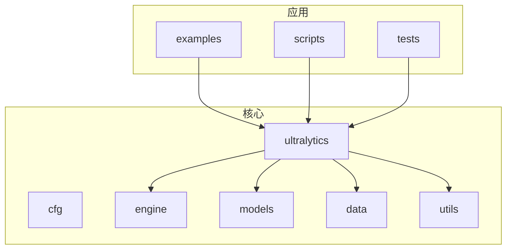
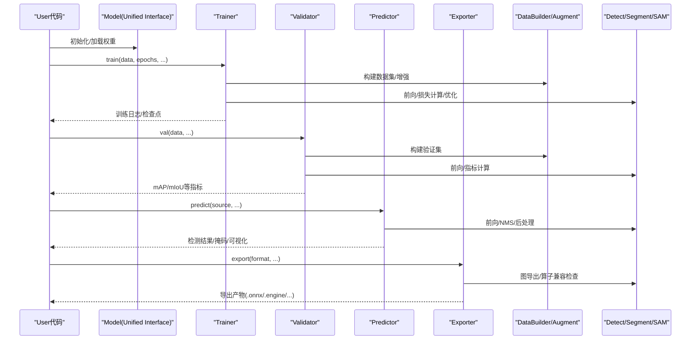
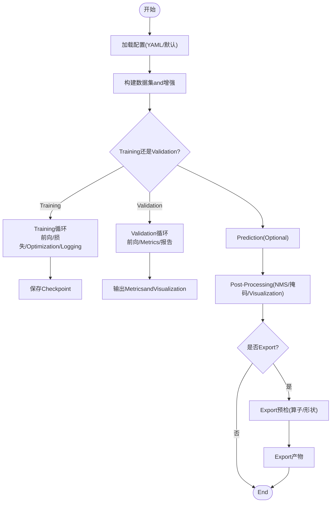
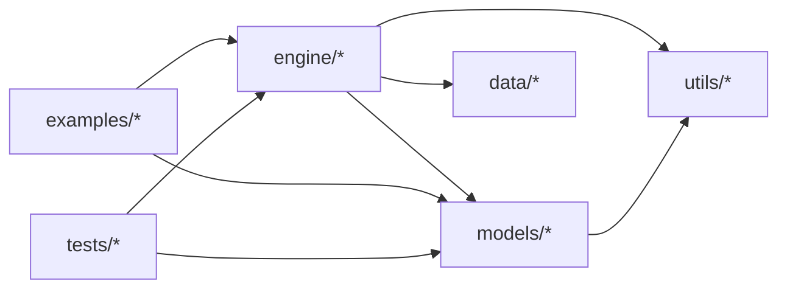

# Object Detection and Segmentation

<cite>
**Files Referenced in This Document**
- [README.md](file://README.md)
- [pyproject.toml](file://pyproject.toml)
- [ultralytics/__init__.py](file://ultralytics/__init__.py)
- [ultralytics/engine/model.py](file://ultralytics/engine/model.py)
- [ultralytics/engine/predictor.py](file://ultralytics/engine/predictor.py)
- [ultralytics/engine/trainer.py](file://ultralytics/engine/trainer.py)
- [ultralytics/engine/validator.py](file://ultralytics/engine/validator.py)
- [ultralytics/engine/exporter.py](file://ultralytics/engine/exporter.py)
- [ultralytics/models/yolo/detect/model.py](file://ultralytics/models/yolo/detect/model.py)
- [ultralytics/models/yolo/segment/model.py](file://ultralytics/models/yolo/segment/model.py)
- [ultralytics/models/sam/model.py](file://ultralytics/models/sam/model.py)
- [ultralytics/models/fastsam/model.py](file://ultralytics/models/fastsam/model.py)
- [ultralytics/cfg/default.yaml](file://ultralytics/cfg/default.yaml)
- [ultralytics/data/build.py](file://ultralytics/data/build.py)
- [ultralytics/data/augment.py](file://ultralytics/data/augment.py)
- [ultralytics/utils/export_capabilities.py](file://ultralytics/utils/export_capabilities.py)
- [examples/YOLOv8-ONNXRuntime-Python/main.py](file://examples/YOLOv8-ONNXRuntime-Python/main.py)
- [examples/YOLOv8-Segmentation-ONNXRuntime-Python/main.py](file://examples/YOLOv8-Segmentation-ONNXRuntime-Python/main.py)
- [examples/YOLO-Master-Cross-Platform-Edge-Deployment/scripts/export_edge_models.py](file://examples/YOLO-Master-Cross-Platform-Edge-Deployment/scripts/export_edge_models.py)
- [examples/YOLO-Master-Edge-Deployment/edge_utils.py](file://examples/YOLO-Master-Edge-Deployment/edge_utils.py)
- [examples/YOLO-Master-Edge-Deployment/cpp/inference.cpp](file://examples/YOLO-Master-Edge-Deployment/cpp/inference.cpp)
- [examples/YOLO11-Triton-CPP/main.cpp](file://examples/YOLO11-Triton-CPP/main.cpp)
- [examples/YOLO11-Triton-CPP/inference.cpp](file://examples/YOLO11-Triton-CPP/inference.cpp)
- [examples/YOLOv8-SAHI-Inference-Video/yolov8_sahi.py](file://examples/YOLOv8-SAHI-Inference-Video/yolov8_sahi.py)
- [examples/YOLOv8-Region-Counter/yolov8_region_counter.py](file://examples/YOLOv8-Region-Counter/yolov8_region_counter.py)
- [scripts/smoke_test_coco2017.py](file://scripts/smoke_test_coco2017.py)
- [tests/test_engine.py](file://tests/test_engine.py)
- [tests/test_export_preflight.py](file://tests/test_export_preflight.py)
- [tests/test_moe.py](file://tests/test_moe.py)
- [tests/test_molora.py](file://tests/test_molora.py)
- [tests/test_peft_adapters.py](file://tests/test_peft_adapters.py)
- [tests/test_mot.py](file://tests/test_mot.py)
- [tests/test_solutions.py](file://tests/test_solutions.py)
</cite>

## Table of Contents
1. [Introduction](#Introduction)
2. [Project Structure](#Project Structure)
3. [Core Components](#Core Components)
4. [Architecture Overview](#Architecture Overview)
5. [Detailed Component Analysis](#Detailed Component Analysis)
6. [Dependency Analysis](#Dependency Analysis)
7. [性能考量](#性能考量)
8. [Troubleshooting Guide](#Troubleshooting Guide)
9. [Conclusion](#Conclusion)
10. [Appendix](#Appendix)

## Introduction
本文件targetingYOLO-Master-v260720的Object DetectionandInstance Segmentationcapabilities，覆盖YOLOv8、YOLOv10、YOLOv11、YOLOv12etc.检测模型Centered onandSAM系列分割模型的implementing原理andUses方法。Documentation从系统架构、数据流、Training/Inference/部署流程、配置调优and性能Optimizationetc.方面unfold，并provides可复现的Examples路径and常见问题解决方案，帮助读者快速上手并高效落地。

## Project Structure
The repository adopts a modular layered organization：
- ultralytics：核心框架（模型、引擎、数据、工具）
- models：各Tasks模型implementing（yolo/detect、yolo/segment、sam、fastsametc.）
- engine：Training、Validation、Prediction、Exportetc.运行时管线
- data：数据集构建、增强and加载
- utils：通用工具（Exportcapabilities矩阵、Metrics、NMSetc.）
- examples：端to端Examples（ONNX/TensorRT/OpenVINO/C++/Triton/SAHIetc.）
- tests：单元and集成测试
- scripts：脚本化实验and基准
- docs：Documentation and References

Figure Source
- [ultralytics/__init__.py](file://ultralytics/__init__.py)
- [ultralytics/engine/model.py](file://ultralytics/engine/model.py)
- [ultralytics/models/yolo/detect/model.py](file://ultralytics/models/yolo/detect/model.py)
- [ultralytics/models/yolo/segment/model.py](file://ultralytics/models/yolo/segment/model.py)
- [ultralytics/models/sam/model.py](file://ultralytics/models/sam/model.py)
- [ultralytics/data/build.py](file://ultralytics/data/build.py)
- [ultralytics/utils/export_capabilities.py](file://ultralytics/utils/export_capabilities.py)

Section Source
- [README.md](file://README.md)
- [pyproject.toml](file://pyproject.toml)

## Core Components
- 统一模型接口：Via高层APIEncapsulatesTraining、Validation、Prediction、Exportetc.操作，屏蔽底层差异。
- Tasks模型族：
  - YOLO检测：Supporting多版本（v8/v10/v11/v12），provides分类头或回归头，适配不同精度/速度权衡。
  - YOLOInstance Segmentation：while检测基础上增加掩码分支，输出像素级掩码。
  - SAM系列分割：基于Tips（点/框/文本）的零样本/少样本分割capabilities，适合开放世界场景。
- Training/Validation/Prediction引擎：统一的Trainer/Validator/Predictor生命周期管理，Supporting分布式、Mixture精度、回调andLogging。
- Data Pipeline：构建YAML数据集描述、自动解析标注格式、while线增强and批处理。
- Exportand部署：Exporting toONNX/TensorRT/OpenVINO/TFLiteetc.，配套C++/PythonInferenceExamplesandEdge Deployment脚本。

Section Source
- [ultralytics/engine/model.py](file://ultralytics/engine/model.py)
- [ultralytics/engine/trainer.py](file://ultralytics/engine/trainer.py)
- [ultralytics/engine/validator.py](file://ultralytics/engine/validator.py)
- [ultralytics/engine/predictor.py](file://ultralytics/engine/predictor.py)
- [ultralytics/models/yolo/detect/model.py](file://ultralytics/models/yolo/detect/model.py)
- [ultralytics/models/yolo/segment/model.py](file://ultralytics/models/yolo/segment/model.py)
- [ultralytics/models/sam/model.py](file://ultralytics/models/sam/model.py)
- [ultralytics/data/build.py](file://ultralytics/data/build.py)

## Architecture Overview
下图展示从UserCallsto模型执行and结果输出的关键路径，涵盖Training、Validation、PredictionandExport。

Figure Source
- [ultralytics/engine/model.py](file://ultralytics/engine/model.py)
- [ultralytics/engine/trainer.py](file://ultralytics/engine/trainer.py)
- [ultralytics/engine/validator.py](file://ultralytics/engine/validator.py)
- [ultralytics/engine/predictor.py](file://ultralytics/engine/predictor.py)
- [ultralytics/engine/exporter.py](file://ultralytics/engine/exporter.py)
- [ultralytics/models/yolo/detect/model.py](file://ultralytics/models/yolo/detect/model.py)
- [ultralytics/models/yolo/segment/model.py](file://ultralytics/models/yolo/segment/model.py)
- [ultralytics/models/sam/model.py](file://ultralytics/models/sam/model.py)
- [ultralytics/data/build.py](file://ultralytics/data/build.py)

## Detailed Component Analysis

### YOLO检测模型（v8/v10/v11/v12）
- 特点andApplicable Scenarios
  - v8：成熟稳定，生态完善，适合多数工业场景。
  - v10：强调速度and精度的平衡，适合实时性要求高的场景。
  - v11：while特征融合and头部设计上进一步Optimization，适合复杂场景and小目标。
  - v12：进一步改进效率and鲁棒性，适合大规模部署and长尾分布。
- Training要点
  - Uses统一Training接口，指定数据集YAML、超参、设备and分布式策略。
  - CombiningData Augmentation（Mosaic、MixUp、随机仿射etc.）提升泛化。
- Inference要点
  - Supporting图像/视频/摄像头输入；可开启NMS、Confidence Threshold、类别过滤。
  - Exporting toONNX/TensorRT/OpenVINOCentered on加速部署。
- 性能对比建议
  - while相同数据集and评测协议下比较mAP@0.5:0.95、FPS、显存占用。
  - 针对小目标/密集场景优先Evaluation召回率and漏检率。

Section Source
- [ultralytics/models/yolo/detect/model.py](file://ultralytics/models/yolo/detect/model.py)
- [ultralytics/data/augment.py](file://ultralytics/data/augment.py)
- [ultralytics/engine/trainer.py](file://ultralytics/engine/trainer.py)
- [ultralytics/engine/predictor.py](file://ultralytics/engine/predictor.py)
- [ultralytics/utils/export_capabilities.py](file://ultralytics/utils/export_capabilities.py)

### YOLOInstance Segmentation（Segment）
- 特点andApplicable Scenarios
  - while检测基础上输出像素级掩码，适用于需要精确轮廓的场景（such as缺陷检测、医学影像）。
- Training要点
  - 标注需包含掩码（such asPNG/COCO JSON），确保类别数一致。
  - 适当调整掩码分支Learning Rateand正则化，避免过拟合。
- Inference要点
  - 输出包含边界框、类别、置信度and掩码；可CombiningSAHI进行大图分块Inference。
- 部署要点
  - Export时注意掩码Post-Processing算子兼容性；必要时whileExport后进行自定义Post-Processing。

Section Source
- [ultralytics/models/yolo/segment/model.py](file://ultralytics/models/yolo/segment/model.py)
- [examples/YOLOv8-Segmentation-ONNXRuntime-Python/main.py](file://examples/YOLOv8-Segmentation-ONNXRuntime-Python/main.py)
- [examples/YOLOv8-SAHI-Inference-Video/yolov8_sahi.py](file://examples/YOLOv8-SAHI-Inference-Video/yolov8_sahi.py)

### SAM系列分割模型（SAM/FastSAM/MobileSAM）
- 特点andApplicable Scenarios
  - 基于Tips（点/框/文本）的零样本/少样本分割，适合开放世界and动态类别。
  - FastSAM侧重速度，MobileSAM侧重Mobile Deployment。
- Trainingand微调
  - 通常无需全量Training，可ViaTips工程或少量样本微调获得更好效果。
- Inference要点
  - 输入图像+Tips生成掩码；可批量Tipsand交互式选择。
  - and大模型/视觉语言模型Combining，implementing“文本Tips→分割”的端to端流程。
- 部署要点
  - Export时需关注Tips编码and解码器算子；部分平台需自定义节点。

Section Source
- [ultralytics/models/sam/model.py](file://ultralytics/models/sam/model.py)
- [ultralytics/models/fastsam/model.py](file://ultralytics/models/fastsam/model.py)
- [ultralytics/utils/export_capabilities.py](file://ultralytics/utils/export_capabilities.py)

### 数据and增强
- 数据格式
  - 推荐YOLO格式（每类一个txt，行：class x_center y_center width height），或COCO JSON。
  - YAML中定义路径、类别名、Training/Validation划分。
- 增强策略
  - Mosaic、MixUp、随机裁剪/缩放/旋转、色彩抖动、噪声etc.。
  - 针对小目标/遮挡场景可调整增强强度and概率。
- 构建and加载
  - ViaDataBuilder解析YAML，构建Dataset/Dataloader，Supporting多进程and缓存。

Section Source
- [ultralytics/data/build.py](file://ultralytics/data/build.py)
- [ultralytics/data/augment.py](file://ultralytics/data/augment.py)
- [ultralytics/cfg/default.yaml](file://ultralytics/cfg/default.yaml)

### Training/Validation/Prediction/Export流水线
- Training
  - 设置epochs、batch size、Optimizer、Learning Rate调度、早停andCheckpoint保存。
  - 监控Metrics：loss、mAP、PR曲线、混淆矩阵。
- Validation
  - 标准COCO协议或自定义协议；Supporting多尺度andTTA。
- Prediction
  - Supporting单图/视频/摄像头；可叠加Visualization、计数、区域统计etc.。
- Export
  - 一键ExportONNX/TensorRT/OpenVINO/TFLite；Export前进行算子兼容性预检。

Figure Source
- [ultralytics/engine/trainer.py](file://ultralytics/engine/trainer.py)
- [ultralytics/engine/validator.py](file://ultralytics/engine/validator.py)
- [ultralytics/engine/predictor.py](file://ultralytics/engine/predictor.py)
- [ultralytics/engine/exporter.py](file://ultralytics/engine/exporter.py)
- [ultralytics/data/build.py](file://ultralytics/data/build.py)
- [ultralytics/utils/export_capabilities.py](file://ultralytics/utils/export_capabilities.py)

## Dependency Analysis
- Modules耦合
  - engineandmodels解耦良好，ViaUnified Interface交互；dataandutils被多处复用。
- External Dependencies
  - PyTorch生态、ONNX Runtime、TensorRT、OpenVINOetc.。
- 潜while风险
  - Export阶段算子不兼容；大模型Tips编码while特定后端不Supporting。
  - 多进程Data LoadingandGPU内存争用。

Figure Source
- [ultralytics/engine/model.py](file://ultralytics/engine/model.py)
- [ultralytics/models/yolo/detect/model.py](file://ultralytics/models/yolo/detect/model.py)
- [ultralytics/models/yolo/segment/model.py](file://ultralytics/models/yolo/segment/model.py)
- [ultralytics/models/sam/model.py](file://ultralytics/models/sam/model.py)
- [ultralytics/data/build.py](file://ultralytics/data/build.py)
- [ultralytics/utils/export_capabilities.py](file://ultralytics/utils/export_capabilities.py)

## 性能考量
- 硬件and后端
  - GPU优先；CPU可用OpenVINO/TensorRT CPU后端；移动端考虑TFLite/NCNN。
- 模型规模and精度
  - 根据场景选择s/m/l/x尺寸；权衡mAPand延迟。
- 数据and增强
  - 合理的数据配比and增强强度对收敛and泛化至关重要。
- ExportOptimization
  - 固定输入形状、启用FP16/INT8量化、算子融合and内核选择。
- 并发and吞吐
  - 批处理、异步I/O、线程池and队列管理提升吞吐。

[This section provides general guidance and does not directly analyze specific files]

## Troubleshooting Guide
- Training问题
  - 损失不降/NaN：检查数据标签、Learning Rate、Gradient裁剪and数值稳定性。
  - 显存不足：减小batch size、关闭不必要的Logging、UsesMixture精度。
- Inference问题
  - 无结果/低置信度：调整阈值、NMS参数、输入分辨率and增强。
  - 掩码异常：检查ExportPost-Processing、掩码通道and类别映射。
- Export问题
  - 算子不Supporting：查看Export预检报告，替换或禁用相关算子。
  - 形状不匹配：固定输入尺寸或Uses动态形状Export。
- 典型测试and脚本
  - Usessmoke测试and单元测试定位问题范围。
  - Refer toExamples脚本快速复现实验。

Section Source
- [tests/test_engine.py](file://tests/test_engine.py)
- [tests/test_export_preflight.py](file://tests/test_export_preflight.py)
- [scripts/smoke_test_coco2017.py](file://scripts/smoke_test_coco2017.py)

## Conclusion
YOLO-Master-v260720provides了统一、可扩展的检测and分割capabilities，覆盖主流YOLO家族andSAM系列。Via清晰的引擎抽象、完善的Export链路and丰富的Examples，能够快速完成从Data Preparation、TrainingValidationto部署落地的全流程。建议while实际项目中Combining业务场景选择合适的模型and后端，并Via系统化调参andExportOptimization达to最佳性能。

## Appendix

### 数据格式and配置要点
- 数据集YAML
  - 定义train/val路径、类别数and名称。
  - 标注格式：YOLO txt或COCO JSON。
- 常用超参
  - epochs、batch size、lr、optimizer、weight decay、mosaic/mixup比例。
- Validation协议
  - COCO mAP@0.5:0.95、PR曲线、混淆矩阵。

Section Source
- [ultralytics/cfg/default.yaml](file://ultralytics/cfg/default.yaml)
- [ultralytics/data/build.py](file://ultralytics/data/build.py)

### Training/Inference/部署Examples路径
- ONNXInference（检测）
  - [examples/YOLOv8-ONNXRuntime-Python/main.py](file://examples/YOLOv8-ONNXRuntime-Python/main.py)
- ONNXInference（Instance Segmentation）
  - [examples/YOLOv8-Segmentation-ONNXRuntime-Python/main.py](file://examples/YOLOv8-Segmentation-ONNXRuntime-Python/main.py)
- 边缘ExportandValidation
  - [examples/YOLO-Master-Cross-Platform-Edge-Deployment/scripts/export_edge_models.py](file://examples/YOLO-Master-Cross-Platform-Edge-Deployment/scripts/export_edge_models.py)
  - [examples/YOLO-Master-Edge-Deployment/edge_utils.py](file://examples/YOLO-Master-Edge-Deployment/edge_utils.py)
- C++Inference（边缘）
  - [examples/YOLO-Master-Edge-Deployment/cpp/inference.cpp](file://examples/YOLO-Master-Edge-Deployment/cpp/inference.cpp)
- Triton C++Inference
  - [examples/YOLO11-Triton-CPP/main.cpp](file://examples/YOLO11-Triton-CPP/main.cpp)
  - [examples/YOLO11-Triton-CPP/inference.cpp](file://examples/YOLO11-Triton-CPP/inference.cpp)
- SAHI大图Inference
  - [examples/YOLOv8-SAHI-Inference-Video/yolov8_sahi.py](file://examples/YOLOv8-SAHI-Inference-Video/yolov8_sahi.py)
- 区域计数and应用
  - [examples/YOLOv8-Region-Counter/yolov8_region_counter.py](file://examples/YOLOv8-Region-Counter/yolov8_region_counter.py)

### 常见应用场景and最佳实践
- Industrial Quality Inspection
  - UsesYOLO检测+Instance Segmentation，Combined with高精度相机and稳定光照；Exporting toTensorRT/ONNX加速。
- 安防and交通
  - Multi-Object Tracking（BoT-SORT/ByteTrack）+区域计数；视频流批处理and异步I/O。
- Medical Imaging
  - SAMTips分割+专家先验；弱监督/半监督微调提升小病灶检出。
- 开放世界
  - SAM/FastSAMCombining文本Tips；Few-shot微调and检索增强。

[本节for概念性内容，不直接分析具体文件]

### 常见问题and解决方案
- Training不稳定
  - 降低初始Learning Rate、启用Gradient累积、检查数据标签一致性。
- Inference延迟高
  - 缩小输入分辨率、减少类别数、启用INT8量化、合并Post-Processing。
- Export Failure
  - 查看Export预检错误，禁用不Supporting算子或更新后端版本。
- 掩码质量差
  - 调整分割分支Learning Rate、增加掩码增强、检查类别映射andPost-Processing。

Section Source
- [tests/test_moe.py](file://tests/test_moe.py)
- [tests/test_molora.py](file://tests/test_molora.py)
- [tests/test_peft_adapters.py](file://tests/test_peft_adapters.py)
- [tests/test_mot.py](file://tests/test_mot.py)
- [tests/test_solutions.py](file://tests/test_solutions.py)