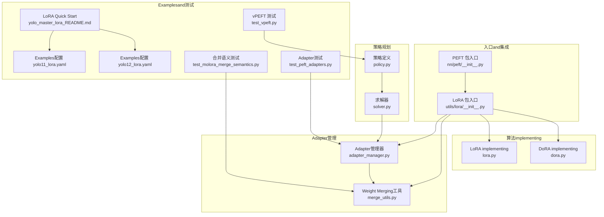
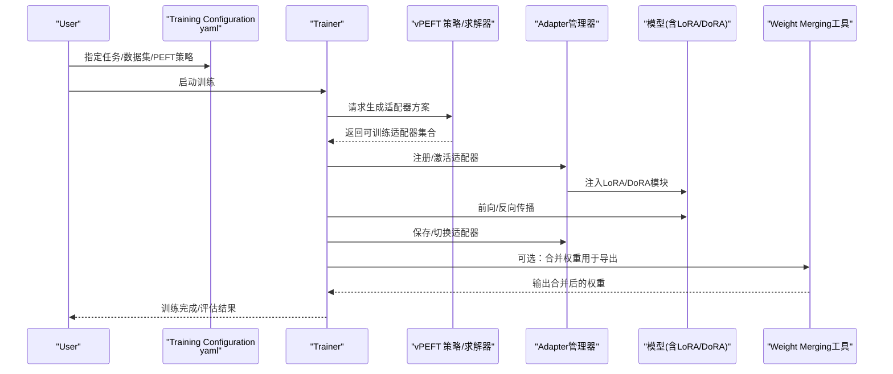
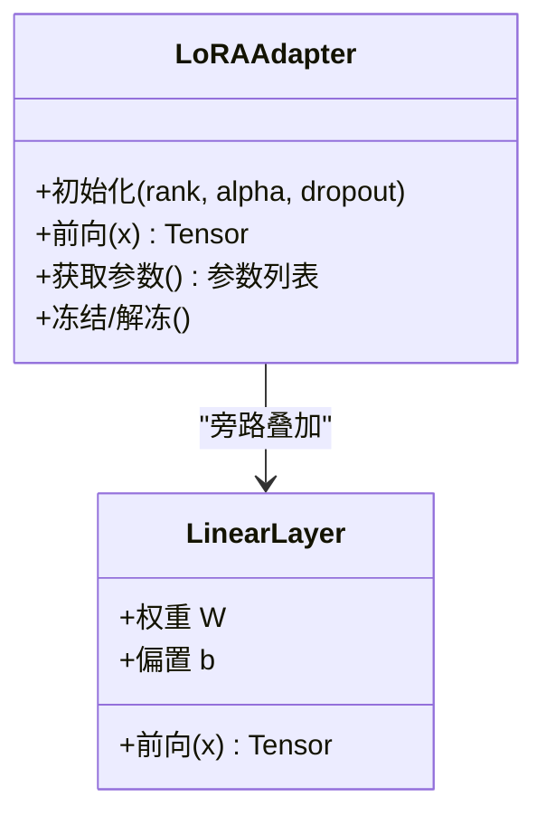
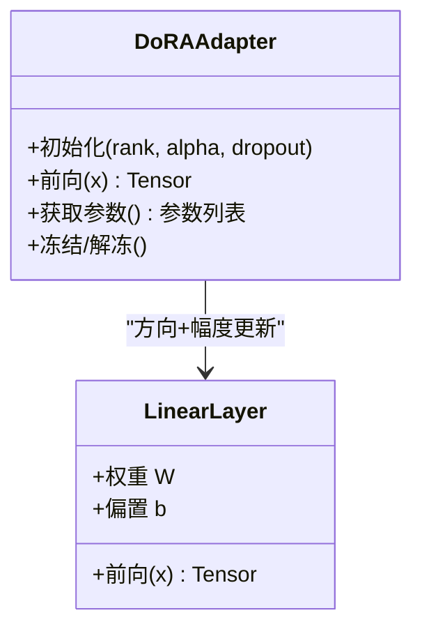
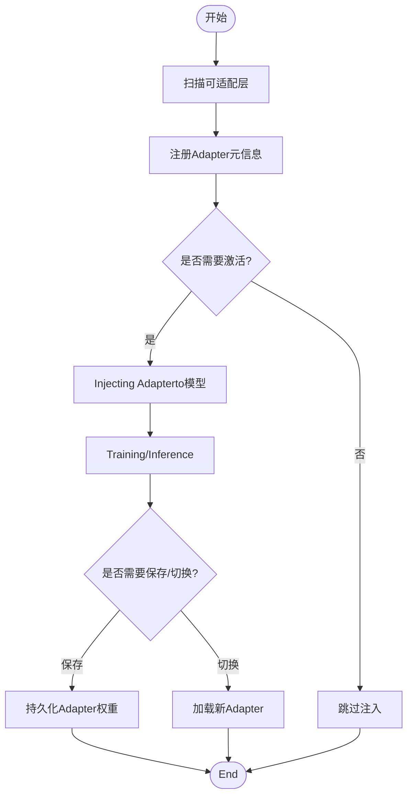
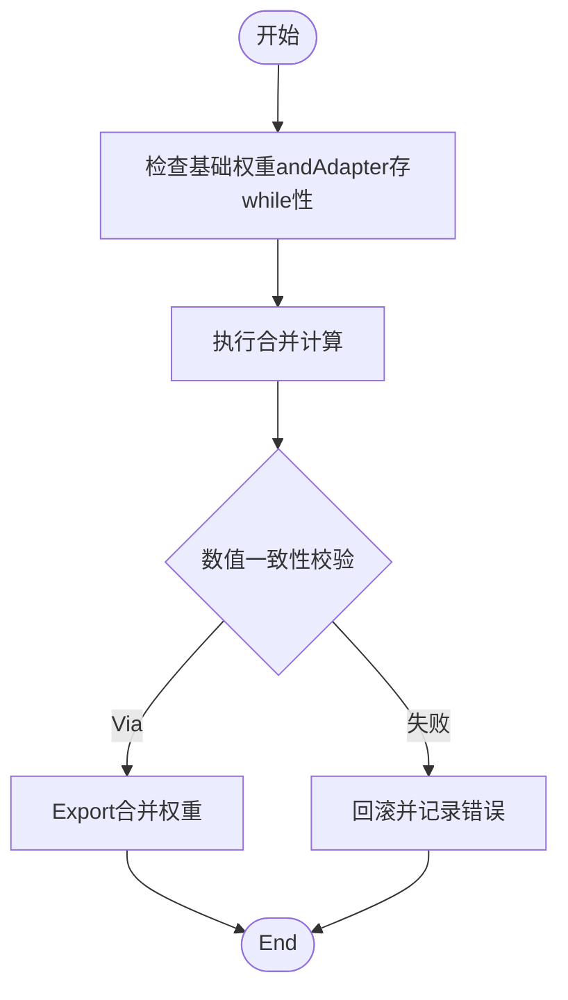
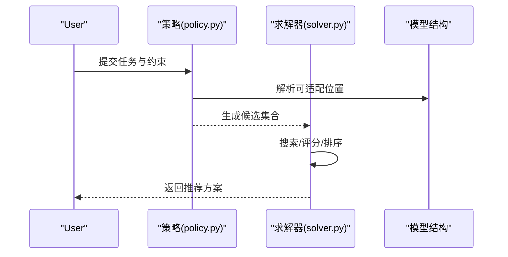
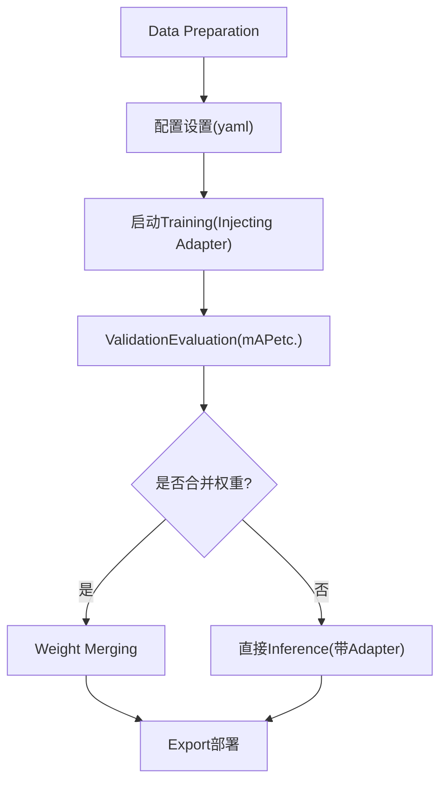
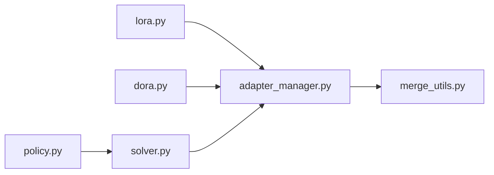

# Parameter-Efficient Fine-Tuning

<cite>
**Files Referenced in This Document**
- [ultralytics/nn/peft/__init__.py](file://ultralytics/nn/peft/__init__.py)
- [ultralytics/utils/lora/__init__.py](file://ultralytics/utils/lora/__init__.py)
- [ultralytics/utils/lora/lora.py](file://ultralytics/utils/lora/lora.py)
- [ultralytics/utils/lora/dora.py](file://ultralytics/utils/lora/dora.py)
- [ultralytics/utils/lora/adapter_manager.py](file://ultralytics/utils/lora/adapter_manager.py)
- [ultralytics/utils/lora/merge_utils.py](file://ultralytics/utils/lora/merge_utils.py)
- [ultralytics/vpeft/policy.py](file://ultralytics/vpeft/policy.py)
- [ultralytics/vpeft/solver.py](file://ultralytics/vpeft/solver.py)
- [examples/lora_examples/yolo_master_lora_README.md](file://examples/lora_examples/yolo_master_lora_README.md)
- [examples/lora_examples/yolo11_lora.yaml](file://examples/lora_examples/yolo11_lora.yaml)
- [examples/lora_examples/yolo12_lora.yaml](file://examples/lora_examples/yolo12_lora.yaml)
- [examples/molora/basic_finetune.py](file://examples/molora/basic_finetune.py)
- [scripts/ablation_suite/ablation_peft_coco128.py](file://scripts/ablation_suite/ablation_peft_coco128.py)
- [tests/test_peft_adapters.py](file://tests/test_peft_adapters.py)
- [tests/test_molora_merge_semantics.py](file://tests/test_molora_merge_semantics.py)
- [tests/test_vpeft.py](file://tests/test_vpeft.py)
</cite>

## Table of Contents
1. [Introduction](#Introduction)
2. [Project Structure](#Project Structure)
3. [Core Components](#Core Components)
4. [Architecture Overview](#Architecture Overview)
5. [Detailed Component Analysis](#Detailed Component Analysis)
6. [Dependency Analysis](#Dependency Analysis)
7. [性能考量](#性能考量)
8. [Troubleshooting Guide](#Troubleshooting Guide)
9. [Conclusion](#Conclusion)
10. [Appendix](#Appendix)

## Introduction
本文件系统性介绍 YOLO-Master 中的Parameter-Efficient Fine-Tuning（PEFT）capabilities，重点覆盖 LoRA、DoRA 的原理andimplementing、Adapter管理、Weight Merging、增量学习etc.特性。Documentationprovides从Data Preparation、配置设置、TrainingtoEvaluation的完整流程，并给出不同策略的Applicable Scenarios、性能对比、最佳实践and常见问题解决方案，辅Centered on实际案例and效果Validation路径。

## Project Structure
YOLO-Master 将 PEFT 相关capabilities拆分for“算法implementing”、“Adapter管理”、“策略规划”和“Examples/测试”四个层次：
- 算法implementing层：LoRA、DoRA 的具体算子andModulesEncapsulates
- Adapter管理层：Adapter的注册、选择、加载、卸载and生命周期管理
- 策略规划层：基于Tasks/模型结构的自动选择and求解器
- Examplesand测试：端to端脚本、配置文件and回归用例

Figure Source
- [ultralytics/nn/peft/__init__.py](file://ultralytics/nn/peft/__init__.py)
- [ultralytics/utils/lora/__init__.py](file://ultralytics/utils/lora/__init__.py)
- [ultralytics/utils/lora/lora.py](file://ultralytics/utils/lora/lora.py)
- [ultralytics/utils/lora/dora.py](file://ultralytics/utils/lora/dora.py)
- [ultralytics/utils/lora/adapter_manager.py](file://ultralytics/utils/lora/adapter_manager.py)
- [ultralytics/utils/lora/merge_utils.py](file://ultralytics/utils/lora/merge_utils.py)
- [ultralytics/vpeft/policy.py](file://ultralytics/vpeft/policy.py)
- [ultralytics/vpeft/solver.py](file://ultralytics/vpeft/solver.py)
- [examples/lora_examples/yolo_master_lora_README.md](file://examples/lora_examples/yolo_master_lora_README.md)
- [examples/lora_examples/yolo11_lora.yaml](file://examples/lora_examples/yolo11_lora.yaml)
- [examples/lora_examples/yolo12_lora.yaml](file://examples/lora_examples/yolo12_lora.yaml)
- [tests/test_peft_adapters.py](file://tests/test_peft_adapters.py)
- [tests/test_molora_merge_semantics.py](file://tests/test_molora_merge_semantics.py)
- [tests/test_vpeft.py](file://tests/test_vpeft.py)

Section Source
- [ultralytics/nn/peft/__init__.py](file://ultralytics/nn/peft/__init__.py)
- [ultralytics/utils/lora/__init__.py](file://ultralytics/utils/lora/__init__.py)
- [ultralytics/utils/lora/lora.py](file://ultralytics/utils/lora/lora.py)
- [ultralytics/utils/lora/dora.py](file://ultralytics/utils/lora/dora.py)
- [ultralytics/utils/lora/adapter_manager.py](file://ultralytics/utils/lora/adapter_manager.py)
- [ultralytics/utils/lora/merge_utils.py](file://ultralytics/utils/lora/merge_utils.py)
- [ultralytics/vpeft/policy.py](file://ultralytics/vpeft/policy.py)
- [ultralytics/vpeft/solver.py](file://ultralytics/vpeft/solver.py)
- [examples/lora_examples/yolo_master_lora_README.md](file://examples/lora_examples/yolo_master_lora_README.md)
- [examples/lora_examples/yolo11_lora.yaml](file://examples/lora_examples/yolo11_lora.yaml)
- [examples/lora_examples/yolo12_lora.yaml](file://examples/lora_examples/yolo12_lora.yaml)
- [tests/test_peft_adapters.py](file://tests/test_peft_adapters.py)
- [tests/test_molora_merge_semantics.py](file://tests/test_molora_merge_semantics.py)
- [tests/test_vpeft.py](file://tests/test_vpeft.py)

## Core Components
- LoRA implementing：Centered on低秩矩阵对目标线性层进行旁路更新，显著降低可Training参数量，适合While maintaining主干冻结的前提下注入领域知识。
- DoRA implementing：while LoRA 基础上引入方向分解思想，增强更新方向的稳定性and表达capabilities，适用于需要更强表征capabilities的下游Tasks。
- Adapter管理器：负责Adapter的注册、激活/停用、切换、持久化and版本控制，Supporting多Tasks/多场景下的动态组合。
- Weight Merging工具：provides将Adapter权重and基础模型权重安全合并的capabilities，便于Exportand部署；同时Supporting反向解耦Centered on恢复原始权重。
- vPEFT 策略and求解器：根据模型结构andTasks约束自动生成可Training的Adapter集合，并进行资源and精度权衡的求解。

Section Source
- [ultralytics/utils/lora/lora.py](file://ultralytics/utils/lora/lora.py)
- [ultralytics/utils/lora/dora.py](file://ultralytics/utils/lora/dora.py)
- [ultralytics/utils/lora/adapter_manager.py](file://ultralytics/utils/lora/adapter_manager.py)
- [ultralytics/utils/lora/merge_utils.py](file://ultralytics/utils/lora/merge_utils.py)
- [ultralytics/vpeft/policy.py](file://ultralytics/vpeft/policy.py)
- [ultralytics/vpeft/solver.py](file://ultralytics/vpeft/solver.py)

## Architecture Overview
下图展示了从User配置toTrainingandEvaluation的关键Calls链，Centered onandAdapter管理andWeight Merging的交互点。

Figure Source
- [examples/lora_examples/yolo11_lora.yaml](file://examples/lora_examples/yolo11_lora.yaml)
- [examples/lora_examples/yolo12_lora.yaml](file://examples/lora_examples/yolo12_lora.yaml)
- [ultralytics/vpeft/policy.py](file://ultralytics/vpeft/policy.py)
- [ultralytics/vpeft/solver.py](file://ultralytics/vpeft/solver.py)
- [ultralytics/utils/lora/adapter_manager.py](file://ultralytics/utils/lora/adapter_manager.py)
- [ultralytics/utils/lora/lora.py](file://ultralytics/utils/lora/lora.py)
- [ultralytics/utils/lora/dora.py](file://ultralytics/utils/lora/dora.py)
- [ultralytics/utils/lora/merge_utils.py](file://ultralytics/utils/lora/merge_utils.py)

## Detailed Component Analysis

### LoRA 组件分析
- 设计要点
  - Via低秩矩阵近似权重增量，减少显存and计算开销
  - and主干网络解耦，便于多Tasks复用and热插拔
  - Supporting按层/按Modules粒度注入，灵活控制可Training范围
- 关键接口
  - Adapter创建and注册
  - 前向时叠加低秩更新
  - Gradient回传仅作用于低秩参数
- 复杂度and性能
  - 时间复杂度近似for O(r·d)，r for秩，d for维度
  - 空间复杂度显著低于全量微调，利于小样本and边缘设备

Figure Source
- [ultralytics/utils/lora/lora.py](file://ultralytics/utils/lora/lora.py)

Section Source
- [ultralytics/utils/lora/lora.py](file://ultralytics/utils/lora/lora.py)

### DoRA 组件分析
- 设计要点
  - while LoRA 的基础上引入方向分解，提升更新方向的稳定性and表达力
  - 更适合复杂分布或长尾类别的数据集
- 关键接口
  - and LoRA 一致的注册/激活/切换接口
  - 内部包含方向and幅度的双分支更新
- 复杂度and性能
  - 相较 LoRA 略有额外开销，但通常带来更好的收敛性and泛化

Figure Source
- [ultralytics/utils/lora/dora.py](file://ultralytics/utils/lora/dora.py)

Section Source
- [ultralytics/utils/lora/dora.py](file://ultralytics/utils/lora/dora.py)

### Adapter管理组件分析
- 功能概览
  - 注册/发现：扫描模型中可插入Adapter的位置
  - 激活/停用：按需启用特定Adapter，Supporting多Tasks并行
  - 切换/组合：while不同场景间快速切换Adapter集合
  - 持久化：保存/加载Adapter权重，Supporting版本管理
- andTraining/Inference的集成
  - Training阶段：动态注入andGradient隔离
  - Inference阶段：Optional择是否合并权重Centered on提升速度

Figure Source
- [ultralytics/utils/lora/adapter_manager.py](file://ultralytics/utils/lora/adapter_manager.py)

Section Source
- [ultralytics/utils/lora/adapter_manager.py](file://ultralytics/utils/lora/adapter_manager.py)

### Weight Merging组件分析
- 功能概览
  - 正向合并：将Adapter权重and基础模型权重融合，得to可直接部署的模型
  - 反向解耦：从合并权重中恢复基础权重andAdapter权重
  - 一致性校验：确保合并前后数值一致，避免部署偏差
- Uses建议
  - 仅whileExport/部署前执行合并，Training过程中保持分离Centered on获得更灵活的实验capabilities

Figure Source
- [ultralytics/utils/lora/merge_utils.py](file://ultralytics/utils/lora/merge_utils.py)

Section Source
- [ultralytics/utils/lora/merge_utils.py](file://ultralytics/utils/lora/merge_utils.py)

### vPEFT 策略and求解器
- 策略（Policy）
  - 定义可插入Adapter的候选集合and约束条件（such as层类型、形状匹配、资源上限）
  - CombiningTasks需求（精度、延迟、内存）生成策略模板
- 求解器（Solver）
  - while策略空间内搜索最优Adapter组合
  - 考虑Training成本、Inference开销andMigration收益的多目标Optimization
- 典型工作流
  - 输入：模型结构、Tasks描述、资源预算
  - 输出：Adapter集合and其超参数建议

Figure Source
- [ultralytics/vpeft/policy.py](file://ultralytics/vpeft/policy.py)
- [ultralytics/vpeft/solver.py](file://ultralytics/vpeft/solver.py)

Section Source
- [ultralytics/vpeft/policy.py](file://ultralytics/vpeft/policy.py)
- [ultralytics/vpeft/solver.py](file://ultralytics/vpeft/solver.py)

### 端to端微调工作流程
- Data Preparation
  - Uses YOLO 标准格式组织图像and标注
  - 针对少样本/长尾场景，建议Combined withData Augmentationand采样策略
- 配置设置
  - while YAML 中指定Tasks、数据集、基础模型and PEFT 策略（LoRA/DoRA、rank、alpha etc.）
- Training过程
  - 启动Training后，系统自动Injecting Adapter，冻结主干，仅TrainingAdapter参数
  - Supporting断点续训andAdapter版本管理
- 结果Evaluation
  - UsesValidation集Metrics（mAP、召回率etc.）Evaluation性能
  - 对比不同 rank/alpha and LoRA/DoRA 的效果差异
- 部署Export
  - 选择合并权重后进行Export（ONNX/TensorRT etc.），或直接Uses带Adapter的Inference路径

Figure Source
- [examples/lora_examples/yolo_master_lora_README.md](file://examples/lora_examples/yolo_master_lora_README.md)
- [examples/lora_examples/yolo11_lora.yaml](file://examples/lora_examples/yolo11_lora.yaml)
- [examples/lora_examples/yolo12_lora.yaml](file://examples/lora_examples/yolo12_lora.yaml)

Section Source
- [examples/lora_examples/yolo_master_lora_README.md](file://examples/lora_examples/yolo_master_lora_README.md)
- [examples/lora_examples/yolo11_lora.yaml](file://examples/lora_examples/yolo11_lora.yaml)
- [examples/lora_examples/yolo12_lora.yaml](file://examples/lora_examples/yolo12_lora.yaml)

## Dependency Analysis
- Modules耦合
  - LoRA/DoRA 作for底层算子被Adapter管理器统一调度
  - Weight Merging工具依赖Adapterand基础权重的完整性
  - vPEFT 策略and求解器独立于具体Adapterimplementing，具备可Extensibility
- External Dependencies
  - PyTorch 张量and自动微分
  - Training/Validation框架（YOLO 引擎）
- Potential Cycles依赖
  - Via入口包（__init__.py）进行集中导入，避免深层循环引用

Figure Source
- [ultralytics/utils/lora/lora.py](file://ultralytics/utils/lora/lora.py)
- [ultralytics/utils/lora/dora.py](file://ultralytics/utils/lora/dora.py)
- [ultralytics/utils/lora/adapter_manager.py](file://ultralytics/utils/lora/adapter_manager.py)
- [ultralytics/utils/lora/merge_utils.py](file://ultralytics/utils/lora/merge_utils.py)
- [ultralytics/vpeft/policy.py](file://ultralytics/vpeft/policy.py)
- [ultralytics/vpeft/solver.py](file://ultralytics/vpeft/solver.py)

Section Source
- [ultralytics/utils/lora/lora.py](file://ultralytics/utils/lora/lora.py)
- [ultralytics/utils/lora/dora.py](file://ultralytics/utils/lora/dora.py)
- [ultralytics/utils/lora/adapter_manager.py](file://ultralytics/utils/lora/adapter_manager.py)
- [ultralytics/utils/lora/merge_utils.py](file://ultralytics/utils/lora/merge_utils.py)
- [ultralytics/vpeft/policy.py](file://ultralytics/vpeft/policy.py)
- [ultralytics/vpeft/solver.py](file://ultralytics/vpeft/solver.py)

## 性能考量
- Training效率
  - 冻结主干、仅Training低秩参数，显著降低显存占用andTraining时长
  - DoRA 相较 LoRA 有轻微额外开销，但while复杂Tasks上收敛更快
- Inference开销
  - 不合并权重：Inference时需叠加Adapter计算，增加少量延迟
  - 合并权重：Export后可获得接近全量微调的性能and更低延迟
- 资源预算
  - Via rank/alpha 控制可Training参数量and表达capabilities
  - Uses vPEFT 策略while精度and资源之间做权衡

[本节for通用指导，无需列出具体文件来源]

## Troubleshooting Guide
- 常见错误
  - Adapter未正确注入：检查注册and激活流程，确认目标层匹配
  - 合并权重不一致：核对合并前后的数值一致性校验Logging
  - Training不稳定：调整 LoRA/DoRA 的 rank/alpha andLearning Rate，必要时启用Gradient裁剪
- 定位方法
  - Uses单元测试ValidationAdapter行forand合并语义
  - 查看TrainingLogging中的可Training参数统计and损失曲线
- Refer to用例
  - Adapter行forand生命周期测试
  - 合并语义and数值稳定性测试
  - vPEFT 策略and求解器回归测试

Section Source
- [tests/test_peft_adapters.py](file://tests/test_peft_adapters.py)
- [tests/test_molora_merge_semantics.py](file://tests/test_molora_merge_semantics.py)
- [tests/test_vpeft.py](file://tests/test_vpeft.py)

## Conclusion
YOLO-Master 的 PEFT 体系Centered on LoRA/DoRA for核心，Combining统一的Adapter管理andWeight Merging工具，provides了灵活、高效且可部署的微调方案。Via vPEFT 策略and求解器，可while不同Tasksand资源约束下自动选择最优Adapter组合。实践中建议从小 rank 起步，逐步扩展，并CombiningValidation集Metricsand部署需求决定是否合并权重。

[本节for总结性内容，无需列出具体文件来源]

## Appendix
- 实战案例
  - 基础微调脚本：用于快速上手and复现实验
  - 消融实验：while COCO128 上进行 LoRA/DoRA and rank 的对比
- Refer to路径
  - 基础微调脚本：[basic_finetune.py](file://examples/molora/basic_finetune.py)
  - 消融实验脚本：[ablation_peft_coco128.py](file://scripts/ablation_suite/ablation_peft_coco128.py)

Section Source
- [examples/molora/basic_finetune.py](file://examples/molora/basic_finetune.py)
- [scripts/ablation_suite/ablation_peft_coco128.py](file://scripts/ablation_suite/ablation_peft_coco128.py)