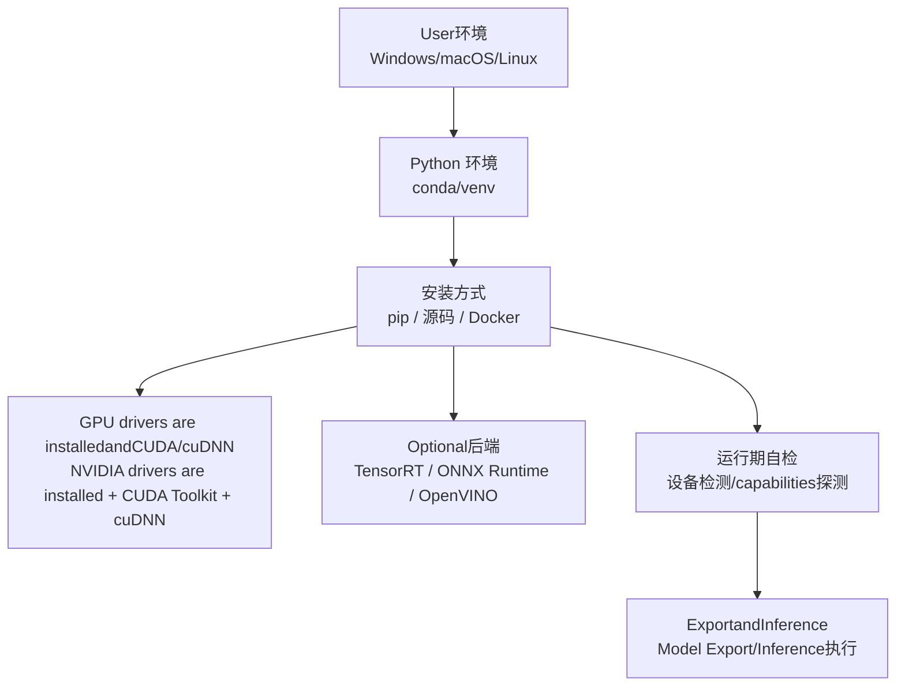
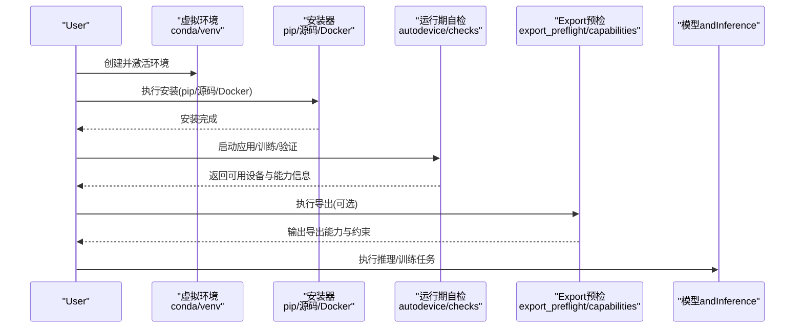
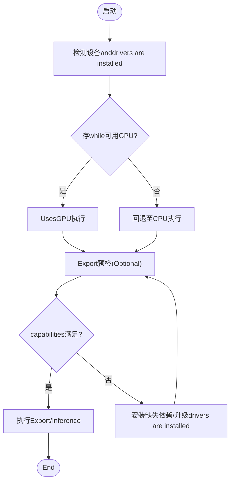
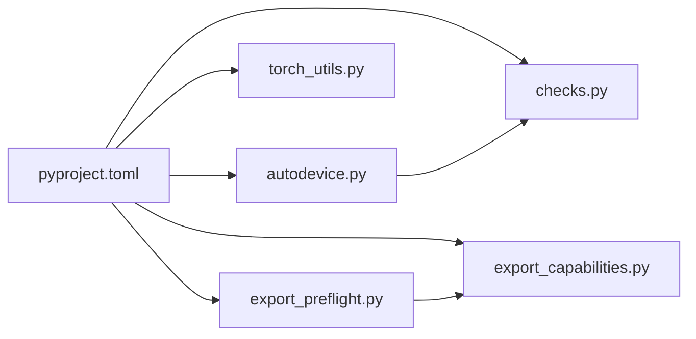

# Installation and Environment Configuration

<cite>
**Files Referenced in This Document**
- [pyproject.toml](file://pyproject.toml)
- [Dockerfile](file://docker/Dockerfile)
- [README.md](file://README.md)
- [conda-quickstart.md](file://docs/en/guides/conda-quickstart.md)
- [docker-quickstart.md](file://docs/en/guides/docker-quickstart.md)
- [windows_cpu_setup.md](file://docs/windows_cpu_setup.md)
- [autodevice.py](file://ultralytics/utils/autodevice.py)
- [checks.py](file://ultralytics/utils/checks.py)
- [torch_utils.py](file://ultralytics/utils/torch_utils.py)
- [export_preflight.py](file://ultralytics/utils/export_preflight.py)
- [export_capabilities.py](file://ultralytics/utils/export_capabilities.py)
- [tensorrt.md](file://docs/en/integrations/tensorrt.md)
- [onnx.md](file://docs/en/integrations/onnx.md)
- [openvino.md](file://docs/en/integrations/openvino.md)
- [deepstream-nvidia-jetson.md](file://docs/en/guides/deepstream-nvidia-jetson.md)
- [nvidia-jetson.md](file://docs/en/guides/nvidia-jetson.md)
- [raspberry-pi.md](file://docs/en/guides/raspberry-pi.md)
- [coral-edge-tpu-on-raspberry-pi.md](file://docs/en/guides/coral-edge-tpu-on-raspberry-pi.md)
</cite>

## Table of Contents
1. [Introduction](#Introduction)
2. [Project Structure](#Project Structure)
3. [Core Components](#Core Components)
4. [Architecture Overview](#Architecture Overview)
5. [Detailed Component Analysis](#Detailed Component Analysis)
6. [Dependency Analysis](#Dependency Analysis)
7. [Performance Considerations](#Performance Considerations)
8. [故障排除指南](#故障排除指南)
9. [Conclusion](#Conclusion)
10. [Appendix](#Appendix)

## Introduction
本章节targeting首次Uses者and运维Engineers，provideswhile Windows、macOS、Linux 上完成 YOLO-Master 环境搭建的完整指南。内容覆盖：
- Via pip 安装and源码编译安装
- Docker Containerized Deployment
- GPU acceleration依赖（CUDA、cuDNN）anddrivers are installed版本匹配
- 虚拟环境管理最佳实践（conda、venv）
- OptionalOptimization后端安装（TensorRT、ONNX Runtime、OpenVINO etc.）
- 常见安装问题排查and性能调优建议

## Project Structure
仓库中and安装和环境配置相关的核心位置such as下：
- 包元数据and依赖声明：pyproject.toml
- 官方Documentation：docs/en/guides 下的Quick Startand平台指南
- Docker 镜像构建：docker/Dockerfile
- 运行时设备检测andcapabilities检查：ultralytics/utils 下的 autodevice、checks、torch_utils、export_preflight、export_capabilities
- 集成and平台指南：docs/en/integrations and docs/en/guides 下各平台Documentation

[本节for概念性说明，不直接分析具体文件]

## Core Components
- 依赖and安装入口
  - pyproject.toml：定义 Python 依赖、Optional Dependencies分组and安装选项，是 pip 安装and开发环境的基础。
  - docker/Dockerfile：provides可复现的Container Images构建脚本，便于跨平台一致部署。
- 运行期设备andcapabilities检测
  - ultralytics/utils/autodevice.py：自动选择可用设备（CPU/GPU），处理多卡and回退策略。
  - ultralytics/utils/checks.py：环境and依赖校验（such as CUDA/cuDNN、drivers are installed版本、系统兼容性）。
  - ultralytics/utils/torch_utils.py：PyTorch 相关工具（设备切换、精度、内存etc.）。
  - ultralytics/utils/export_preflight.py：Export前预检（目标后端是否满足要求）。
  - ultralytics/utils/export_capabilities.py：Exportcapabilities矩阵and后端Supporting判定。
- 官方Documentationand平台指南
  - docs/en/guides/conda-quickstart.md：conda 快速上手。
  - docs/en/guides/docker-quickstart.md：Docker 快速上手。
  - docs/windows_cpu_setup.md：Windows CPU 环境设置。
  - docs/en/integrations/tensorrt.md、onnx.md、openvino.md：Optional后端集成说明。
  - docs/en/guides/deepstream-nvidia-jetson.md、nvidia-jetson.md、raspberry-pi.md、coral-edge-tpu-on-raspberry-pi.md：边缘and嵌入式平台指南。

**Section Source**
- [pyproject.toml](file://pyproject.toml)
- [Dockerfile](file://docker/Dockerfile)
- [autodevice.py](file://ultralytics/utils/autodevice.py)
- [checks.py](file://ultralytics/utils/checks.py)
- [torch_utils.py](file://ultralytics/utils/torch_utils.py)
- [export_preflight.py](file://ultralytics/utils/export_preflight.py)
- [export_capabilities.py](file://ultralytics/utils/export_capabilities.py)
- [conda-quickstart.md](file://docs/en/guides/conda-quickstart.md)
- [docker-quickstart.md](file://docs/en/guides/docker-quickstart.md)
- [windows_cpu_setup.md](file://docs/windows_cpu_setup.md)
- [tensorrt.md](file://docs/en/integrations/tensorrt.md)
- [onnx.md](file://docs/en/integrations/onnx.md)
- [openvino.md](file://docs/en/integrations/openvino.md)
- [deepstream-nvidia-jetson.md](file://docs/en/guides/deepstream-nvidia-jetson.md)
- [nvidia-jetson.md](file://docs/en/guides/nvidia-jetson.md)
- [raspberry-pi.md](file://docs/en/guides/raspberry-pi.md)
- [coral-edge-tpu-on-raspberry-pi.md](file://docs/en/guides/coral-edge-tpu-on-raspberry-pi.md)

## Architecture Overview
下图展示了从“Environment Preparation”to“运行期自检andExport/Inference”的整体流程，Centered onand关键Modules的职责边界。

**Figure Source**
- [autodevice.py](file://ultralytics/utils/autodevice.py)
- [checks.py](file://ultralytics/utils/checks.py)
- [export_preflight.py](file://ultralytics/utils/export_preflight.py)
- [export_capabilities.py](file://ultralytics/utils/export_capabilities.py)

## Detailed Component Analysis

### 安装方式一：pip 安装
- Applicable Scenarios：快速体验、本地开发、最小化依赖。
- 前置条件：
  - Python 版本需满足 pyproject.toml 中声明的要求。
  - 建议Use a virtual environment to isolate dependencies。
- 基本步骤：
  - Uses conda 或 venv 创建并激活环境。
  - Via pip 安装主包；such as需Optional后端，按对应 extras 安装。
- Refer to路径：
  - 依赖and安装选项定义：[pyproject.toml](file://pyproject.toml)
  - conda Quick Start：[conda-quickstart.md](file://docs/en/guides/conda-quickstart.md)

**Section Source**
- [pyproject.toml](file://pyproject.toml)
- [conda-quickstart.md](file://docs/en/guides/conda-quickstart.md)

### 安装方式二：源码编译安装
- Applicable Scenarios：需要自定义构建、调试源码、参and贡献。
- 前置条件：
  - 具备编译器and构建工具链（C/C++、cmake etc.，视平台而定）。
  - 若启用 GPU，需正确安装 NVIDIA drivers are installed、CUDA Toolkit and cuDNN，并确保版本兼容。
- 基本步骤：
  - 克隆仓库并进入项目Root Directory。
  - Uses pip Centered on“可编辑模式”安装，Centered on便修改后即时生效。
  - 按需安装Optional后端依赖。
- Refer to路径：
  - 依赖and安装选项定义：[pyproject.toml](file://pyproject.toml)

**Section Source**
- [pyproject.toml](file://pyproject.toml)

### 安装方式三：Docker 部署
- Applicable Scenarios：跨平台一致性、CI/CD、生产部署。
- 基本步骤：
  - 基于仓库provides的 Dockerfile 构建镜像。
  - 运行容器时挂载数据集and结果Table of Contents，按需分配 GPU 资源。
- Refer to路径：
  - 镜像构建脚本：[Dockerfile](file://docker/Dockerfile)
  - Docker Quick Start：[docker-quickstart.md](file://docs/en/guides/docker-quickstart.md)

**Section Source**
- [Dockerfile](file://docker/Dockerfile)
- [docker-quickstart.md](file://docs/en/guides/docker-quickstart.md)

### GPU 依赖anddrivers are installed配置（CUDA、cuDNN）
- drivers are installedand CUDA/cuDNN 版本必须相互匹配；不同 PyTorch 版本对 CUDA 有最低版本要求。
- 建议while安装 PyTorch 时一并安装and其匹配的 CUDA 工具链，或Uses官方渠道获取预编译 wheel。
- 运行期会进行设备andcapabilities检测，若检测to不兼容将给出Tips或回退至 CPU。
- Refer to路径：
  - 设备自动选择and回退逻辑：[autodevice.py](file://ultralytics/utils/autodevice.py)
  - 环境and依赖校验：[checks.py](file://ultralytics/utils/checks.py)
  - PyTorch 工具and设备操作：[torch_utils.py](file://ultralytics/utils/torch_utils.py)

**Section Source**
- [autodevice.py](file://ultralytics/utils/autodevice.py)
- [checks.py](file://ultralytics/utils/checks.py)
- [torch_utils.py](file://ultralytics/utils/torch_utils.py)

### 虚拟环境管理最佳实践（conda and venv）
- 推荐做法：
  - 每个项目Uses独立环境，避免依赖冲突。
  - 固定 Python and关键依赖版本，提升可复现性。
  - Prefer conda 管理复杂二进制依赖（such as CUDA/cuDNN），或Uses venv Combined with pip 安装预编译轮子。
- Refer to路径：
  - conda Quick Start：[conda-quickstart.md](file://docs/en/guides/conda-quickstart.md)

**Section Source**
- [conda-quickstart.md](file://docs/en/guides/conda-quickstart.md)

### Optional后端andOptimization库（TensorRT、ONNX Runtime、OpenVINO etc.）
- TensorRT（NVIDIA GPU acceleration）
  - 适用于高性能InferenceandExportOptimization，需满足特定 CUDA/TensorRT 版本组合。
  - Refer to：[tensorrt.md](file://docs/en/integrations/tensorrt.md)
- ONNX Runtime（跨平台Inference）
  - 适合跨框架部署and多硬件后端，注意andExport模型的算子Supporting。
  - Refer to：[onnx.md](file://docs/en/integrations/onnx.md)
- OpenVINO（Intel 平台Optimization）
  - 针对 Intel CPU/GPU/VPU Optimization，适合边缘and服务器部署。
  - Refer to：[openvino.md](file://docs/en/integrations/openvino.md)
- 其他平台and边缘设备
  - Jetson/DeepStream：[deepstream-nvidia-jetson.md](file://docs/en/guides/deepstream-nvidia-jetson.md)、[nvidia-jetson.md](file://docs/en/guides/nvidia-jetson.md)
  - Raspberry Pi and Coral Edge TPU：[raspberry-pi.md](file://docs/en/guides/raspberry-pi.md)、[coral-edge-tpu-on-raspberry-pi.md](file://docs/en/guides/coral-edge-tpu-on-raspberry-pi.md)

**Section Source**
- [tensorrt.md](file://docs/en/integrations/tensorrt.md)
- [onnx.md](file://docs/en/integrations/onnx.md)
- [openvino.md](file://docs/en/integrations/openvino.md)
- [deepstream-nvidia-jetson.md](file://docs/en/guides/deepstream-nvidia-jetson.md)
- [nvidia-jetson.md](file://docs/en/guides/nvidia-jetson.md)
- [raspberry-pi.md](file://docs/en/guides/raspberry-pi.md)
- [coral-edge-tpu-on-raspberry-pi.md](file://docs/en/guides/coral-edge-tpu-on-raspberry-pi.md)

### 运行期设备andExportcapabilities检测
- Device Selectionand回退
  - 自动检测可用 GPU/CPU，并while不可用is available, fall back to CPU。
  - 多卡环境下根据显存and可用性选择最优设备。
- Export预检andcapabilities矩阵
  - while执行Export前进行预检，确保目标后端所需的依赖and算子Supporting满足。
  - Exportcapabilities矩阵用于判断当前环境是否Supporting某格式/后端。
- Refer to路径：
  - 设备自动选择：[autodevice.py](file://ultralytics/utils/autodevice.py)
  - Export预检：[export_preflight.py](file://ultralytics/utils/export_preflight.py)
  - Exportcapabilities矩阵：[export_capabilities.py](file://ultralytics/utils/export_capabilities.py)

**Figure Source**
- [autodevice.py](file://ultralytics/utils/autodevice.py)
- [export_preflight.py](file://ultralytics/utils/export_preflight.py)
- [export_capabilities.py](file://ultralytics/utils/export_capabilities.py)

**Section Source**
- [autodevice.py](file://ultralytics/utils/autodevice.py)
- [export_preflight.py](file://ultralytics/utils/export_preflight.py)
- [export_capabilities.py](file://ultralytics/utils/export_capabilities.py)

## Dependency Analysis
- 核心依赖
  - Python and PyTorch：由 pyproject.toml 声明，决定 CUDA/cuDNN 版本and设备capabilities。
  - Optional后端：TensorRT、ONNX Runtime、OpenVINO etc.，按需安装。
- 运行期依赖
  - 设备检测andcapabilities检查：autodevice、checks、torch_utils。
  - Exportandcapabilities矩阵：export_preflight、export_capabilities。
- 外部集成
  - 平台and边缘设备指南：Jetson、Raspberry Pi、Coral Edge TPU etc.。

**Figure Source**
- [pyproject.toml](file://pyproject.toml)
- [autodevice.py](file://ultralytics/utils/autodevice.py)
- [checks.py](file://ultralytics/utils/checks.py)
- [torch_utils.py](file://ultralytics/utils/torch_utils.py)
- [export_preflight.py](file://ultralytics/utils/export_preflight.py)
- [export_capabilities.py](file://ultralytics/utils/export_capabilities.py)

**Section Source**
- [pyproject.toml](file://pyproject.toml)
- [autodevice.py](file://ultralytics/utils/autodevice.py)
- [checks.py](file://ultralytics/utils/checks.py)
- [torch_utils.py](file://ultralytics/utils/torch_utils.py)
- [export_preflight.py](file://ultralytics/utils/export_preflight.py)
- [export_capabilities.py](file://ultralytics/utils/export_capabilities.py)

## Performance Considerations
- drivers are installedand CUDA/cuDNN 版本匹配：确保and PyTorch 版本一致，避免回退to CPU。
- 批量大小and精度：while显存允许范围内增大 batch size；必要时Uses半精度Centered on提升吞吐。
- 后端选择：
  - NVIDIA GPU：优先 TensorRT Centered onAchieving higher inference performance。
  - Intel 平台：OpenVINO 能显著降低延迟。
  - 跨平台：ONNX Runtime 便于统一部署。
- 资源隔离：Uses独立虚拟环境，避免依赖冲突导致的回退或异常。
- Refer to路径：
  - 设备andcapabilities检测：[autodevice.py](file://ultralytics/utils/autodevice.py)、[checks.py](file://ultralytics/utils/checks.py)
  - Exportcapabilitiesand预检：[export_capabilities.py](file://ultralytics/utils/export_capabilities.py)、[export_preflight.py](file://ultralytics/utils/export_preflight.py)
  - 平台指南：[tensorrt.md](file://docs/en/integrations/tensorrt.md)、[openvino.md](file://docs/en/integrations/openvino.md)、[onnx.md](file://docs/en/integrations/onnx.md)

**Section Source**
- [autodevice.py](file://ultralytics/utils/autodevice.py)
- [checks.py](file://ultralytics/utils/checks.py)
- [export_capabilities.py](file://ultralytics/utils/export_capabilities.py)
- [export_preflight.py](file://ultralytics/utils/export_preflight.py)
- [tensorrt.md](file://docs/en/integrations/tensorrt.md)
- [openvino.md](file://docs/en/integrations/openvino.md)
- [onnx.md](file://docs/en/integrations/onnx.md)

## 故障排除指南
- 无法识别 GPU 或回退to CPU
  - 检查 NVIDIA drivers are installed、CUDA Toolkit、cuDNN 版本是否and PyTorch 匹配。
  - 查看运行期设备检测结果and错误Logging，确认是否正确加载 GPU 后端。
  - Refer to：[autodevice.py](file://ultralytics/utils/autodevice.py)、[checks.py](file://ultralytics/utils/checks.py)
- Export Failure或算子不Supporting
  - UsesExport预检andcapabilities矩阵定位缺失依赖或不Supporting的算子。
  - Refer to：[export_preflight.py](file://ultralytics/utils/export_preflight.py)、[export_capabilities.py](file://ultralytics/utils/export_capabilities.py)
- Windows CPU 环境常见问题
  - 遵循 Windows CPU 设置指南，确保路径、环境变量and依赖正确。
  - Refer to：[windows_cpu_setup.md](file://docs/windows_cpu_setup.md)
- 平台and边缘设备
  - Jetson/DeepStream、Raspberry Pi、Coral Edge TPU etc.平台请Refer to对应指南，确保drivers are installedand工具链版本匹配。
  - Refer to：[deepstream-nvidia-jetson.md](file://docs/en/guides/deepstream-nvidia-jetson.md)、[nvidia-jetson.md](file://docs/en/guides/nvidia-jetson.md)、[raspberry-pi.md](file://docs/en/guides/raspberry-pi.md)、[coral-edge-tpu-on-raspberry-pi.md](file://docs/en/guides/coral-edge-tpu-on-raspberry-pi.md)

**Section Source**
- [autodevice.py](file://ultralytics/utils/autodevice.py)
- [checks.py](file://ultralytics/utils/checks.py)
- [export_preflight.py](file://ultralytics/utils/export_preflight.py)
- [export_capabilities.py](file://ultralytics/utils/export_capabilities.py)
- [windows_cpu_setup.md](file://docs/windows_cpu_setup.md)
- [deepstream-nvidia-jetson.md](file://docs/en/guides/deepstream-nvidia-jetson.md)
- [nvidia-jetson.md](file://docs/en/guides/nvidia-jetson.md)
- [raspberry-pi.md](file://docs/en/guides/raspberry-pi.md)
- [coral-edge-tpu-on-raspberry-pi.md](file://docs/en/guides/coral-edge-tpu-on-raspberry-pi.md)

## Conclusion
Via合理的虚拟环境管理and正确的 GPU 依赖配置，Combining运行期设备andExportcapabilities检测，可Centered onwhile多平台上稳定地安装and运行 YOLO-Master。对于高性能需求，建议优先选择 TensorRT 或 OpenVINO etc.专用后端；对于Cross-Platform Deployment，ONNX Runtime provides了良好的通用性。遇to问题时，优先依据运行期自检and平台指南进行定位and修复。

[This section is summary content and does not directly analyze specific files]

## Appendix
- Quick Startand平台指南索引
  - conda Quick Start：[conda-quickstart.md](file://docs/en/guides/conda-quickstart.md)
  - Docker Quick Start：[docker-quickstart.md](file://docs/en/guides/docker-quickstart.md)
  - Windows CPU 设置：[windows_cpu_setup.md](file://docs/windows_cpu_setup.md)
  - Optional后端：
    - TensorRT：[tensorrt.md](file://docs/en/integrations/tensorrt.md)
    - ONNX Runtime：[onnx.md](file://docs/en/integrations/onnx.md)
    - OpenVINO：[openvino.md](file://docs/en/integrations/openvino.md)
  - 边缘and嵌入式：
    - DeepStream/NVIDIA Jetson：[deepstream-nvidia-jetson.md](file://docs/en/guides/deepstream-nvidia-jetson.md)、[nvidia-jetson.md](file://docs/en/guides/nvidia-jetson.md)
    - Raspberry Pi：[raspberry-pi.md](file://docs/en/guides/raspberry-pi.md)
    - Coral Edge TPU：[coral-edge-tpu-on-raspberry-pi.md](file://docs/en/guides/coral-edge-tpu-on-raspberry-pi.md)

**Section Source**
- [conda-quickstart.md](file://docs/en/guides/conda-quickstart.md)
- [docker-quickstart.md](file://docs/en/guides/docker-quickstart.md)
- [windows_cpu_setup.md](file://docs/windows_cpu_setup.md)
- [tensorrt.md](file://docs/en/integrations/tensorrt.md)
- [onnx.md](file://docs/en/integrations/onnx.md)
- [openvino.md](file://docs/en/integrations/openvino.md)
- [deepstream-nvidia-jetson.md](file://docs/en/guides/deepstream-nvidia-jetson.md)
- [nvidia-jetson.md](file://docs/en/guides/nvidia-jetson.md)
- [raspberry-pi.md](file://docs/en/guides/raspberry-pi.md)
- [coral-edge-tpu-on-raspberry-pi.md](file://docs/en/guides/coral-edge-tpu-on-raspberry-pi.md)