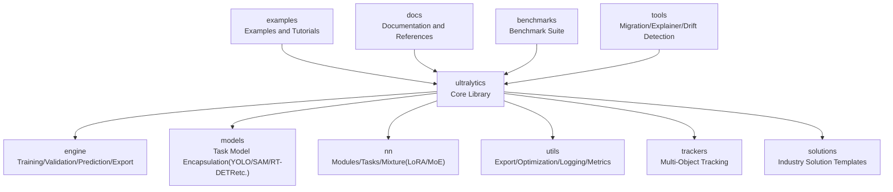
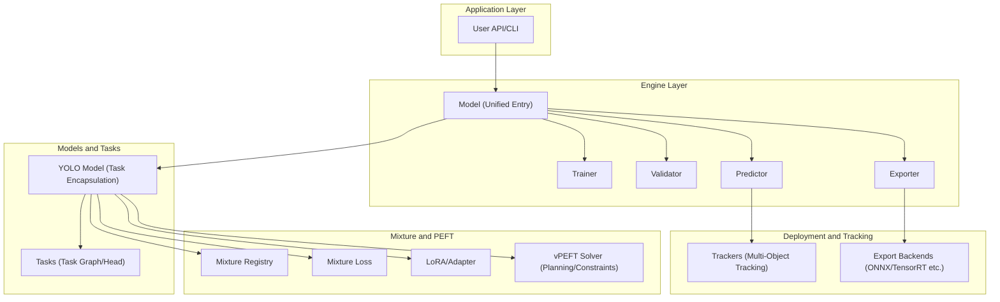
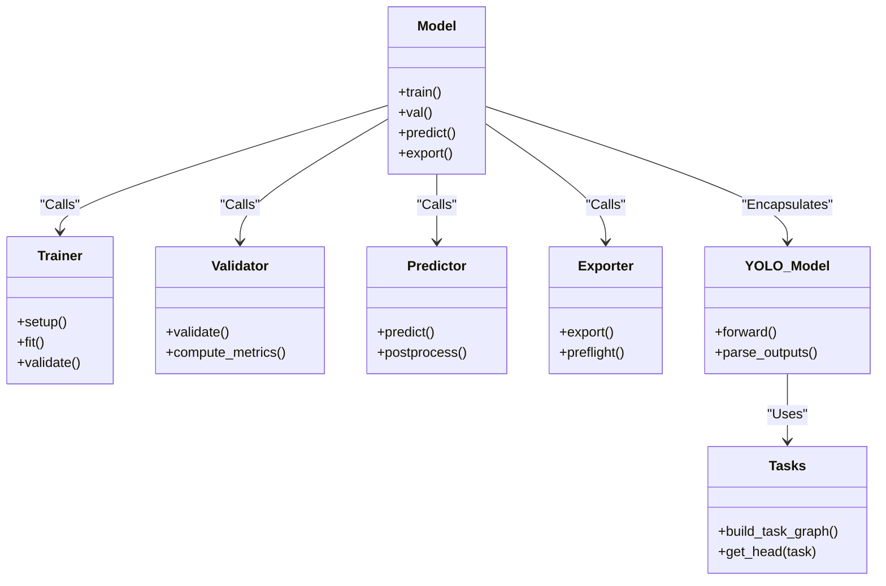
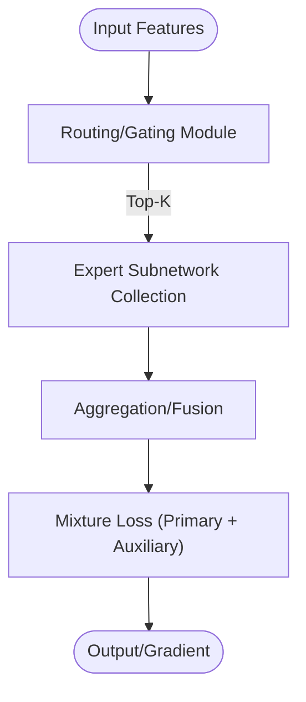
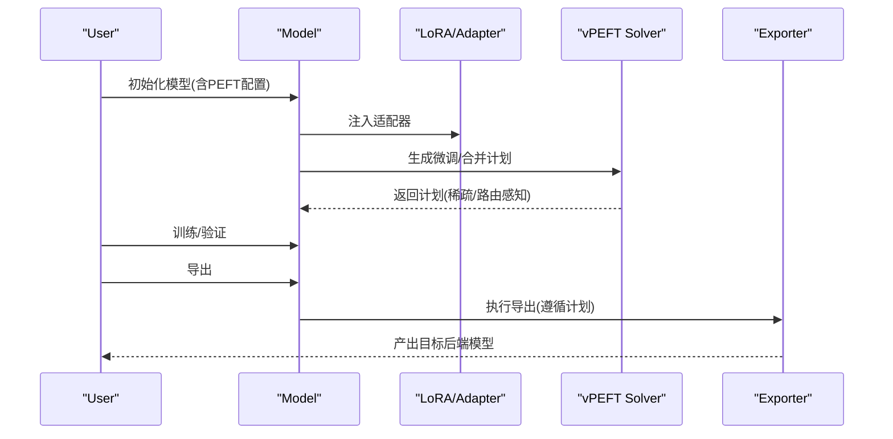
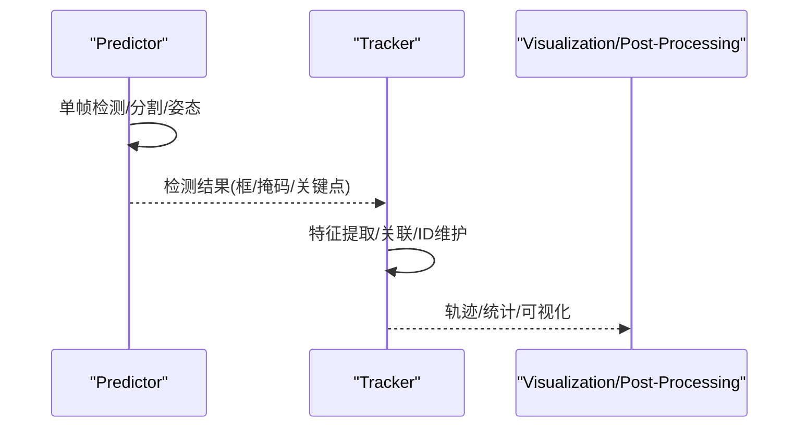
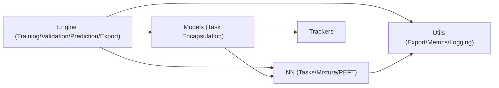

# Project Overview

<cite>
**Files Referenced in This Document**
- [README.md](file://README.md)
- [pyproject.toml](file://pyproject.toml)
- [ultralytics/__init__.py](file://ultralytics/__init__.py)
- [ultralytics/engine/model.py](file://ultralytics/engine/model.py)
- [ultralytics/engine/trainer.py](file://ultralytics/engine/trainer.py)
- [ultralytics/engine/validator.py](file://ultralytics/engine/validator.py)
- [ultralytics/engine/predictor.py](file://ultralytics/engine/predictor.py)
- [ultralytics/engine/exporter.py](file://ultralytics/engine/exporter.py)
- [ultralytics/models/yolo/model.py](file://ultralytics/models/yolo/model.py)
- [ultralytics/nn/tasks.py](file://ultralytics/nn/tasks.py)
- [ultralytics/nn/mixture_registry.py](file://ultralytics/nn/mixture_registry.py)
- [ultralytics/nn/mixture_loss.py](file://ultralytics/nn/mixture_loss.py)
- [ultralytics/utils/lora/__init__.py](file://ultralytics/utils/lora/__init__.py)
- [ultralytics/vpeft/solver.py](file://ultralytics/vpeft/solver.py)
- [ultralytics/trackers/track.py](file://ultralytics/trackers/track.py)
- [examples/YOLOv10-Master-MoA/README.md](file://examples/YOLOv10-Master-MoA/README.md)
- [examples/YOLO-Master-Cross-Platform-Edge-Deployment/README.md](file://examples/YOLO-Master-Cross-Platform-Edge-Deployment/README.md)
- [CONTRIBUTING.md](file://CONTRIBUTING.md)
</cite>

## Table of Contents
1. [Introduction](#Introduction)
2. [Project Structure](#Project Structure)
3. [Core Components](#Core Components)
4. [Architecture Overview](#Architecture Overview)
5. [Detailed Component Analysis](#Detailed Component Analysis)
6. [Dependency Analysis](#Dependency Analysis)
7. [Performance and Scalability](#Performance and Scalability)
8. [Troubleshooting Guide](#Troubleshooting Guide)
9. [Conclusion](#Conclusion)
10. [Appendix](#Appendix)

## Introduction
YOLO-Master-v260720 is built upon Ultralytics YOLO ecosystem, a deeply enhanced generation ofGeneral-Purpose Vision Framework。Its core objective is：whileMaintaining ease of use and high performance，forMultimodal、Parameter-Efficient Fine-Tuning（PEFT）、Mixture of Experts（MoE/MoA）Centered onandProduction-Grade DeploymentprovidesIntegrated Capabilities。The project targetsresearchers and engineering teams，covering the full pipeline from data preparation, training, evaluation, export to edge deployment。

Overview of Key Features and Technical Advantages：
- Multi-Task Unified Interface：Object Detection、Instance Segmentation、Pose Estimation、Oriented Bounding Box Detection、Semantic Segmentation、Trackingand other tasksSharing a consistent training/inference/export workflow。
- Multimodal Support：Introducing text/image multimodal fusion capabilities at the model and runtime layers，Facilitating scenarios such as open-vocabulary and cross-modal retrieval。
- Parameter-Efficient Fine-Tuning（PEFT）：Built-in LoRA and vPEFT planning solver，Supporting low-rank adaptation, routing-aware merging, and sparse scheduling，Significantly reducing fine-tuning costs and improving portability。
- Mixture of Experts（MoE/MoA）：Providing routing registry, loss combination, and dynamic scheduling toolchain，implementing“on-demand activation”的Expert Network，Balancing accuracy and throughput。
- Production-Ready：Comprehensive export matrix, pre-flight checks and validation、Distributed training and monitoring、Edge deployment examples and scripts，Shortening the path from experiment to production。

Target Audience：
- Researchers：Quickly validate new algorithms（such as MoE/MoA、LoRA、routing strategies），Reuse unified benchmarks and evaluation systems。
- Engineers：End-to-end pipeline（Training → Evaluation → Export → Deployment），Stable and reliable error handling and diagnostic tools。
- Product and Operations：Out-of-the-box solution templates and visualization，Accelerating deployment and iteration。

Version and License：
- Version number and metadata are in the project root configuration；License and citation information are in the root directory documentation。

Section Source
- [README.md](file://README.md)
- [pyproject.toml](file://pyproject.toml)

## Project Structure
The repository adopts a modular layered organization，The core library is located in ultralytics package，Divided by responsibility into engine, models, neural network modules, utilities, and examples。The top level also includes documentation, governance specifications, benchmark suites, and migration tools。

Figure Source
- [ultralytics/engine/model.py](file://ultralytics/engine/model.py)
- [ultralytics/models/yolo/model.py](file://ultralytics/models/yolo/model.py)
- [ultralytics/nn/tasks.py](file://ultralytics/nn/tasks.py)
- [ultralytics/trackers/track.py](file://ultralytics/trackers/track.py)

Section Source
- [ultralytics/__init__.py](file://ultralytics/__init__.py)
- [ultralytics/engine/model.py](file://ultralytics/engine/model.py)
- [ultralytics/models/yolo/model.py](file://ultralytics/models/yolo/model.py)
- [ultralytics/nn/tasks.py](file://ultralytics/nn/tasks.py)
- [ultralytics/trackers/track.py](file://ultralytics/trackers/track.py)

## Core Components
- Unified Model Entry Point：Exposing a consistent API externally, shielding task differences，Internally selecting the corresponding head and loss based on task type。
- Training/Validation/Prediction/Export pipeline：Centered on Engine，Connecting data loading, forward/backward propagation, metric statistics, and export。
- Multimodal and Mixture Modules：Managing different expert/attention variants through a registry，并Providing unified loss combination and routing protocols。
- PEFT and LoRA：Providing adapter injection, routing-aware merging, and sparse scheduling，Supporting lightweight fine-tuning and cross-platform transfer。
- Multi-Object Tracking：Integrating multiple trackers，Providing a unified interface and visualization/post-processing tools。

Section Source
- [ultralytics/engine/model.py](file://ultralytics/engine/model.py)
- [ultralytics/engine/trainer.py](file://ultralytics/engine/trainer.py)
- [ultralytics/engine/validator.py](file://ultralytics/engine/validator.py)
- [ultralytics/engine/predictor.py](file://ultralytics/engine/predictor.py)
- [ultralytics/engine/exporter.py](file://ultralytics/engine/exporter.py)
- [ultralytics/nn/tasks.py](file://ultralytics/nn/tasks.py)
- [ultralytics/nn/mixture_registry.py](file://ultralytics/nn/mixture_registry.py)
- [ultralytics/nn/mixture_loss.py](file://ultralytics/nn/mixture_loss.py)
- [ultralytics/utils/lora/__init__.py](file://ultralytics/utils/lora/__init__.py)
- [ultralytics/vpeft/solver.py](file://ultralytics/vpeft/solver.py)
- [ultralytics/trackers/track.py](file://ultralytics/trackers/track.py)

## Architecture Overview
The overall architecture revolves around“Unified Model + Task Head + Mixture/PEFT Plugins + Export/Deployment”unfold。Engine is responsible for lifecycle orchestration，Model is responsible for task dispatch，nn.tasks Defines the task graph，The mixture subsystem provides MoE/MoA capabilities，utils.lora and vpeft Provides parameter-efficient fine-tuning paths。

Figure Source
- [ultralytics/engine/model.py](file://ultralytics/engine/model.py)
- [ultralytics/engine/trainer.py](file://ultralytics/engine/trainer.py)
- [ultralytics/engine/validator.py](file://ultralytics/engine/validator.py)
- [ultralytics/engine/predictor.py](file://ultralytics/engine/predictor.py)
- [ultralytics/engine/exporter.py](file://ultralytics/engine/exporter.py)
- [ultralytics/models/yolo/model.py](file://ultralytics/models/yolo/model.py)
- [ultralytics/nn/tasks.py](file://ultralytics/nn/tasks.py)
- [ultralytics/nn/mixture_registry.py](file://ultralytics/nn/mixture_registry.py)
- [ultralytics/nn/mixture_loss.py](file://ultralytics/nn/mixture_loss.py)
- [ultralytics/utils/lora/__init__.py](file://ultralytics/utils/lora/__init__.py)
- [ultralytics/vpeft/solver.py](file://ultralytics/vpeft/solver.py)
- [ultralytics/trackers/track.py](file://ultralytics/trackers/track.py)

## Detailed Component Analysis

### 统一Models and Tasks分发
- Unified entry point：Providing consistent initialization, training, validation, prediction, and export interfaces externally，Internally selecting the corresponding model and head based on task type。
- Task Graph：while nn.tasks 中Defining the computation graph and output format for each task，Ensuring consistency across training/inference/export。
- Model Encapsulation：models/yolo/model.py Assembling specific task heads and backbone networks into pluggable task models。

Figure Source
- [ultralytics/engine/model.py](file://ultralytics/engine/model.py)
- [ultralytics/engine/trainer.py](file://ultralytics/engine/trainer.py)
- [ultralytics/engine/validator.py](file://ultralytics/engine/validator.py)
- [ultralytics/engine/predictor.py](file://ultralytics/engine/predictor.py)
- [ultralytics/engine/exporter.py](file://ultralytics/engine/exporter.py)
- [ultralytics/models/yolo/model.py](file://ultralytics/models/yolo/model.py)
- [ultralytics/nn/tasks.py](file://ultralytics/nn/tasks.py)

Section Source
- [ultralytics/engine/model.py](file://ultralytics/engine/model.py)
- [ultralytics/models/yolo/model.py](file://ultralytics/models/yolo/model.py)
- [ultralytics/nn/tasks.py](file://ultralytics/nn/tasks.py)

### Mixture of Experts（MoE/MoA）and路由
- Registry：nn/mixture_registry.py Providing registration and resolution mechanisms for expert/attention variants，Supporting dynamic loading and version compatibility。
- Loss combination：nn/mixture_loss.py Providing weighted/gated loss combination for multi-expert outputs，Supporting auxiliary losses and routing regularization terms。
- Routing and Scheduling：Combining sparse/routing-aware strategies from vPEFT and utils.lora，Implementing on-demand activation and resource control。

Figure Source
- [ultralytics/nn/mixture_registry.py](file://ultralytics/nn/mixture_registry.py)
- [ultralytics/nn/mixture_loss.py](file://ultralytics/nn/mixture_loss.py)
- [ultralytics/vpeft/solver.py](file://ultralytics/vpeft/solver.py)
- [ultralytics/utils/lora/__init__.py](file://ultralytics/utils/lora/__init__.py)

Section Source
- [ultralytics/nn/mixture_registry.py](file://ultralytics/nn/mixture_registry.py)
- [ultralytics/nn/mixture_loss.py](file://ultralytics/nn/mixture_loss.py)
- [ultralytics/vpeft/solver.py](file://ultralytics/vpeft/solver.py)
- [ultralytics/utils/lora/__init__.py](file://ultralytics/utils/lora/__init__.py)

### Parameter-Efficient Fine-Tuning（PEFT/LoRA）
- Adapter injection：Inserting low-rank adapters in the backbone or head，Freezing backbone parameters, updating only a small number of weights。
- Routing-Aware Merging：Considering routing/sparse structures during the export phase，Avoiding redundant computation and ensuring cross-backend consistency。
- Planning and Solving：vPEFT solver Generating optimal fine-tuning plans based on constraints and graph analysis，Balancing accuracy, latency, and memory。

Figure Source
- [ultralytics/utils/lora/__init__.py](file://ultralytics/utils/lora/__init__.py)
- [ultralytics/vpeft/solver.py](file://ultralytics/vpeft/solver.py)
- [ultralytics/engine/exporter.py](file://ultralytics/engine/exporter.py)

Section Source
- [ultralytics/utils/lora/__init__.py](file://ultralytics/utils/lora/__init__.py)
- [ultralytics/vpeft/solver.py](file://ultralytics/vpeft/solver.py)
- [ultralytics/engine/exporter.py](file://ultralytics/engine/exporter.py)

### Multi-Object Tracking（MOT）
- Unified Interface：trackers/track.py Providing tracker wrappers，Supporting mainstream algorithms such as ByteTrack and BoT-SORT。
- Linked with Inference：Prediction results can be directly fed into trackers for trajectory association and ID maintenance。
- Visualization and Post-Processing：Providing common visualization and statistics tools for debugging and demonstration。

Figure Source
- [ultralytics/engine/predictor.py](file://ultralytics/engine/predictor.py)
- [ultralytics/trackers/track.py](file://ultralytics/trackers/track.py)

Section Source
- [ultralytics/engine/predictor.py](file://ultralytics/engine/predictor.py)
- [ultralytics/trackers/track.py](file://ultralytics/trackers/track.py)

### Multimodal and Open World
- Multimodal Fusion：Supporting joint text/image encoding and alignment at the model and runtime layers，Facilitating open-vocabulary detection and caption generation。
- Prompting and Classification：Combining open vocabulary sets with prompt engineering，Achieving zero-shot/few-shot generalization。
- Examples and Reports：examples and reports contain relevant use cases and comparison reports for reproduction and evaluation。

Section Source
- [examples/YOLOv10-Master-MoA/README.md](file://examples/YOLOv10-Master-MoA/README.md)

## Dependency Analysis
- Cohesion and Coupling：The Engine layer decouples models from tasks，Reducing hard-coded dependencies through registries and protocols；Mixture and PEFT serve as optional plugins, enabled on demand。
- External Dependencies：Export Backends（ONNX/TensorRT/OpenVINO etc.）Abstracted through the exporter for easy extension and maintenance。
- Potential Cycles：Avoiding circular dependencies through layering and interface isolation；Test suites cover key contracts and compatibility。

Figure Source
- [ultralytics/engine/model.py](file://ultralytics/engine/model.py)
- [ultralytics/models/yolo/model.py](file://ultralytics/models/yolo/model.py)
- [ultralytics/nn/tasks.py](file://ultralytics/nn/tasks.py)
- [ultralytics/trackers/track.py](file://ultralytics/trackers/track.py)

Section Source
- [ultralytics/engine/model.py](file://ultralytics/engine/model.py)
- [ultralytics/nn/tasks.py](file://ultralytics/nn/tasks.py)
- [ultralytics/trackers/track.py](file://ultralytics/trackers/track.py)

## Performance and Scalability
- Sparsity and Routing：MoE/MoA Top-K routing and dynamic scheduling can reduce computation and improve throughput；Combined with vPEFT sparse plans, further pruning redundancy during export。
- Batching and Parallelism：Engine supports automatic batch size and distributed training，Combined with export backend optimization（such as TensorRT）Achieving higher inference performance。
- Extensible Design：Registries and protocols make adding new experts/tasks/backends“configuration-first”incremental changes，Reducing invasiveness。

[This section provides general guidance and does not directly analyze specific files]

## Troubleshooting Guide
- Common Training Issues：Check data paths and label formats, learning rate and batch size, AMP/precision settings；Use logs and callbacks to locate anomalies。
- Export Failure：Confirm backend installation and version, run export pre-flight checks；If necessary, fall back to ONNX intermediate format for secondary conversion。
- Routing/Mixture Instability：Pay attention to routing regularization and auxiliary loss weights；Use diagnostic scripts to observe expert utilization and gating distribution。
- Tracking Drift：Adjust association thresholds and appearance feature scales；Combine scene priors and re-identification features to improve robustness。

Section Source
- [ultralytics/engine/trainer.py](file://ultralytics/engine/trainer.py)
- [ultralytics/engine/exporter.py](file://ultralytics/engine/exporter.py)
- [ultralytics/nn/mixture_loss.py](file://ultralytics/nn/mixture_loss.py)
- [ultralytics/trackers/track.py](file://ultralytics/trackers/track.py)

## Conclusion
YOLO-Master-v260720 While maintaining the ease of use of Ultralytics YOLO，Introduces cutting-edge capabilities such as multimodal, PEFT, and MoE/MoA，并Achieves a highly cohesive, loosely coupled, extensible architecture through a unified Engine and registry mechanism。For the research side，It provides rich experimental baselines and toolchains；For the engineering side，It covers the complete closed loop from training to deployment，Helping quickly transform innovation into productivity。

[This section is summary content and does not directly analyze specific files]

## Appendix
- Feature List (Examples)：object detection, instance segmentation, pose estimation, oriented bounding box detection, semantic segmentation, multi-object tracking, open-vocabulary detection, multimodal fusion, parameter-efficient fine-tuning, mixture of experts, cross-platform export and edge deployment。
- Applicable Scenarios：industrial quality inspection, autonomous driving perception, robot vision, security inspection, medical imaging, agricultural remote sensing, video analysis, etc.。
- Version and License：See root directory configuration and documentation files。
- Contributing Guide：参见 CONTRIBUTING.md，Understanding the development workflow, code standards, and submission process。

Section Source
- [CONTRIBUTING.md](file://CONTRIBUTING.md)
- [examples/YOLO-Master-Cross-Platform-Edge-Deployment/README.md](file://examples/YOLO-Master-Cross-Platform-Edge-Deployment/README.md)