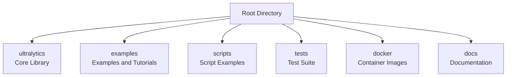
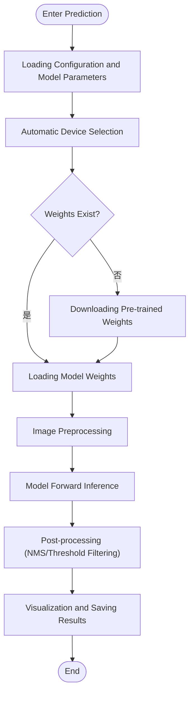
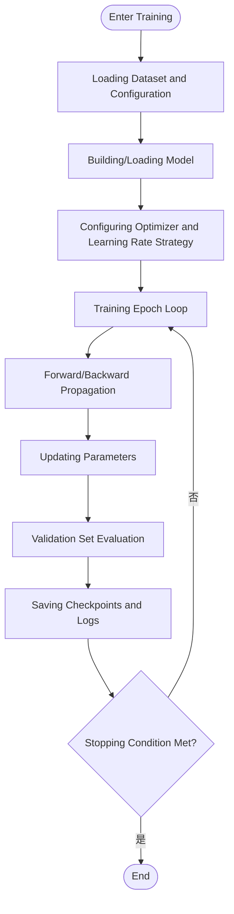
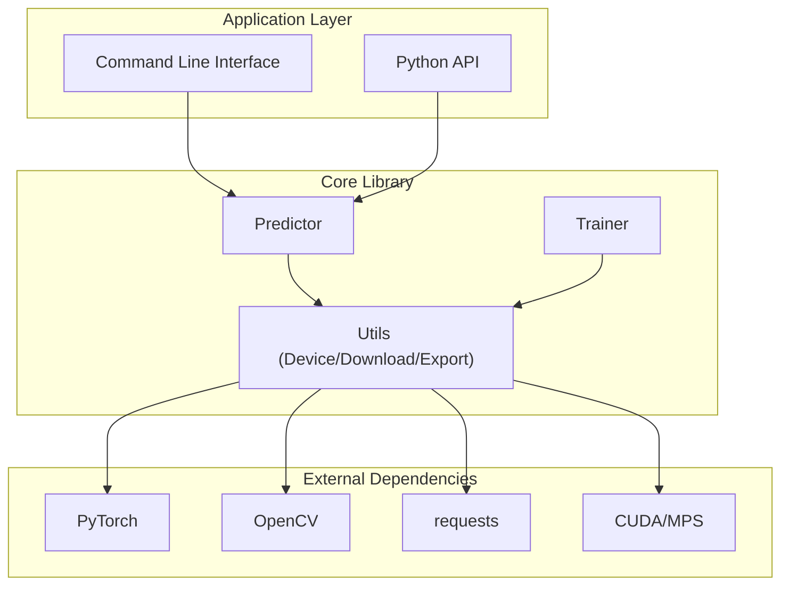

# Quick Start

<cite>
**Files Referenced in This Document**
- [README.md](file://README.md)
- [pyproject.toml](file://pyproject.toml)
- [ultralytics/__init__.py](file://ultralytics/__init__.py)
- [ultralytics/engine/predictor.py](file://ultralytics/engine/predictor.py)
- [ultralytics/engine/trainer.py](file://ultralytics/engine/trainer.py)
- [ultralytics/utils/autodevice.py](file://ultralytics/utils/autodevice.py)
- [ultralytics/utils/downloads.py](file://ultralytics/utils/downloads.py)
- [examples/tutorial.ipynb](file://examples/tutorial.ipynb)
- [examples/object_counting.ipynb](file://examples/object_counting.ipynb)
- [examples/object_tracking.ipynb](file://examples/object_tracking.ipynb)
- [examples/hub.ipynb](file://examples/hub.ipynb)
- [scripts/smoke_test_coco2017.py](file://scripts/smoke_test_coco2017.py)
- [scripts/quick_train_verify.py](file://scripts/quick_train_verify.py)
- [tests/test_cli.py](file://tests/test_cli.py)
- [tests/test_python.py](file://tests/test_python.py)
- [docker/Dockerfile](file://docker/Dockerfile)
</cite>

## Table of Contents
1. [Introduction](#Introduction)
2. [Project Structure](#Project Structure)
3. [Core Components](#Core Components)
4. [Architecture Overview](#Architecture Overview)
5. [Detailed Component Analysis](#Detailed Component Analysis)
6. [Dependency Analysis](#Dependency Analysis)
7. [Performance Considerations](#Performance Considerations)
8. [Troubleshooting Guide](#Troubleshooting Guide)
9. [Conclusion](#Conclusion)
10. [Appendix](#Appendix)

## Introduction
This quick start guide is intended for users new to YOLO-Master-v260720 users，The goal is to complete environment preparation, dependency installation, first inference example, and basic training task within 15 minutes。You will experience object detection inference, model downloading, and usage through both command line and Python API，And learn about solutions and verification steps for common installation issues。

## Project Structure
The repository adopts a modular organization：
- ultralytics：Core library containing models, engines (prediction, training, validation), utilities, and export
- examples：Official examples and tutorials（Jupyter Notebook）
- scripts：Scripted use cases (such as smoke tests, quick training verification)
- tests：Unit tests and integration tests
- docker：Container image build files
- docs：Documentation and reference manuals



[This section is an overview and does not directly analyze specific files]

## Core Components
- Predictor（Predictor）：Encapsulates the inference pipeline, responsible for loading models, preprocessing, forward inference, and post-processing visualization
- Trainer（Trainer）：Encapsulates the training pipeline, responsible for data loading, optimizer configuration, loss computation, and logging
- Automatic Device Selection（AutoDevice）：Automatically selects CPU/GPU/MPS devices based on the runtime environment
- Model Download（Downloads）：Provides downloading capabilities for pre-trained weights and datasets
- Entry and Registration（__init__）：Exposing high-level APIs and default configurations externally

Key Path References：
- Predictor Implementation：[ultralytics/engine/predictor.py](file://ultralytics/engine/predictor.py)
- Trainer Implementation：[ultralytics/engine/trainer.py](file://ultralytics/engine/trainer.py)
- Automatic Device Selection：[ultralytics/utils/autodevice.py](file://ultralytics/utils/autodevice.py)
- Model Download：[ultralytics/utils/downloads.py](file://ultralytics/utils/downloads.py)
- Package Entry and Registration：[ultralytics/__init__.py](file://ultralytics/__init__.py)

**Section Source**
- [ultralytics/engine/predictor.py](file://ultralytics/engine/predictor.py)
- [ultralytics/engine/trainer.py](file://ultralytics/engine/trainer.py)
- [ultralytics/utils/autodevice.py](file://ultralytics/utils/autodevice.py)
- [ultralytics/utils/downloads.py](file://ultralytics/utils/downloads.py)
- [ultralytics/__init__.py](file://ultralytics/__init__.py)

## Architecture Overview
The following diagram shows the core pipeline from user invocation to model inference，Including device selection, model loading, inference execution, and result output。

```mermaid
sequenceDiagram
participant U as "User"
participant CLI as "Command Line Interface"
participant PY as "Python API"
participant P as "Predictor"
participant AD as "AutoDevice"
participant DL as "Downloads"
participant M as "模型"
U->>CLI : "yolo predict ..."
U->>PY : "from ultralytics import YOLO; model = YOLO(...)"
CLI->>P : "Initializing and Running Prediction"
PY->>P : "Initializing and Running Prediction"
P->>AD : "Selecting Device(CPU/GPU/MPS)"
AD-->>P : "Returning Device Information"
P->>DL : "Downloading Pre-trained Weights if Needed"
DL-->>P : "Returning Local Weights Path"
P->>M : "Loading Model Weights"
P->>M : "Executing Inference"
M-->>P : "Returning Detection Results"
P-->>CLI : "Saving/Displaying Results"
P-->>PY : "Returning Results Object"
```

**Figure Source**
- [ultralytics/engine/predictor.py](file://ultralytics/engine/predictor.py)
- [ultralytics/utils/autodevice.py](file://ultralytics/utils/autodevice.py)
- [ultralytics/utils/downloads.py](file://ultralytics/utils/downloads.py)

**Section Source**
- [ultralytics/engine/predictor.py](file://ultralytics/engine/predictor.py)
- [ultralytics/utils/autodevice.py](file://ultralytics/utils/autodevice.py)
- [ultralytics/utils/downloads.py](file://ultralytics/utils/downloads.py)

## Detailed Component Analysis

### Complete Getting Started Workflow from Scratch (15 Minutes)
- Environment Preparation
  - Operating System：Linux/macOS/Windows
  - Python：Recommended to use 3.9+（as specified in pyproject.toml）
  - GPU（Optional）：NVIDIA CUDA drivers and cuDNN；macOS supports MPS
- Installing Dependencies
  - It is recommended to create an isolated environment via virtualenv or conda
  - Install core packages using pip（see dependency declarations in pyproject.toml）
- Verifying Installation
  - Run Python import check：import ultralytics
  - Run smoke test script：scripts/smoke_test_coco2017.py
- First Inference Example (Command Line)
  - Use the yolo predict command to perform object detection inference on images/videos
  - Model name or weights path can be specified; pre-trained weights are downloaded automatically
- First Inference Example (Python API)
  - Load model via from ultralytics import YOLO
  - Call model.predict(...) to execute inference and save/display results
- Basic Training Task
  - Use the yolo train command or Python API to train on a small dataset
  - Refer to the workflow of quick_train_verify.py and tutorial.ipynb

Tips：
- For offline use, please download weights and datasets to a local directory in advance
- If you encounter CUDA issues on Windows, you can first verify the workflow in CPU mode

**Section Source**
- [pyproject.toml](file://pyproject.toml)
- [scripts/smoke_test_coco2017.py](file://scripts/smoke_test_coco2017.py)
- [examples/tutorial.ipynb](file://examples/tutorial.ipynb)
- [examples/object_counting.ipynb](file://examples/object_counting.ipynb)
- [examples/object_tracking.ipynb](file://examples/object_tracking.ipynb)
- [examples/hub.ipynb](file://examples/hub.ipynb)
- [scripts/quick_train_verify.py](file://scripts/quick_train_verify.py)

### Command Line vs Python API Comparison Examples
- Command Line Approach
  - Advantages：No code writing required; suitable for quick verification and batch processing
  - Typical Usage：yolo predict / yolo train / yolo val
  - Reference Test Cases：tests/test_cli.py
- Python API Approach
  - Advantages：Flexible and controllable; easy to integrate into business systems
  - Typical Usage：from ultralytics import YOLO; model = YOLO(...); results = model.predict(...)
  - Reference Test Cases：tests/test_python.py

Key Comparison Points：
- Parameter Passing：Command line uses --arg=value，Python API uses keyword arguments
- Result Processing：Command line saves to runs/detect by default，Python API returns a results object for further processing
- Extensibility：Python API is easier to combine with custom pre/post-processing logic

**Section Source**
- [tests/test_cli.py](file://tests/test_cli.py)
- [tests/test_python.py](file://tests/test_python.py)

### Inference Pipeline Algorithm Diagram


**Figure Source**
- [ultralytics/engine/predictor.py](file://ultralytics/engine/predictor.py)
- [ultralytics/utils/autodevice.py](file://ultralytics/utils/autodevice.py)
- [ultralytics/utils/downloads.py](file://ultralytics/utils/downloads.py)

**Section Source**
- [ultralytics/engine/predictor.py](file://ultralytics/engine/predictor.py)
- [ultralytics/utils/autodevice.py](file://ultralytics/utils/autodevice.py)
- [ultralytics/utils/downloads.py](file://ultralytics/utils/downloads.py)

### Training Pipeline Algorithm Diagram


**Figure Source**
- [ultralytics/engine/trainer.py](file://ultralytics/engine/trainer.py)

**Section Source**
- [ultralytics/engine/trainer.py](file://ultralytics/engine/trainer.py)

## Dependency Analysis
- Runtime Dependencies
  - PyTorch: Core deep learning framework
  - OpenCV: Image processing and visualization
  - NumPy/Pandas: Data processing
  - requests: Network requests (for downloading)
- Optional Dependencies
  - CUDA/cuDNN: GPU acceleration
  - MPS: macOS hardware acceleration
- Installation Recommendations
  - Use the version ranges declared in pyproject.toml to avoid version conflicts
  - In restricted network environments, prefer offline installation of dependencies and weights



**Figure Source**
- [ultralytics/engine/predictor.py](file://ultralytics/engine/predictor.py)
- [ultralytics/engine/trainer.py](file://ultralytics/engine/trainer.py)
- [ultralytics/utils/autodevice.py](file://ultralytics/utils/autodevice.py)
- [ultralytics/utils/downloads.py](file://ultralytics/utils/downloads.py)
- [pyproject.toml](file://pyproject.toml)

**Section Source**
- [pyproject.toml](file://pyproject.toml)
- [ultralytics/engine/predictor.py](file://ultralytics/engine/predictor.py)
- [ultralytics/engine/trainer.py](file://ultralytics/engine/trainer.py)
- [ultralytics/utils/autodevice.py](file://ultralytics/utils/autodevice.py)
- [ultralytics/utils/downloads.py](file://ultralytics/utils/downloads.py)

## Performance Considerations
- Device Selection
  - Prefer GPU; macOS can use MPS; fall back to CPU when no GPU is available
  - Refer to the implementation details of the automatic device selection module
- Batch Inference
  - Set batch size appropriately to balance throughput and memory usage
- Model Format
  - Exporting to ONNX/TensorRT/OpenVINO can improve deployment performance
- Data Loading
  - Use multi-process data loading and caching to reduce I/O bottlenecks

[This section provides general guidance and does not directly analyze specific files]

## Troubleshooting Guide
- CUDA Not Found or GPU Unavailable
  - Confirm that matching CUDA/cuDNN drivers are installed
  - Use the automatic device selection module to check current device status
  - Temporarily switch to CPU mode to verify the workflow
- Weight Download Failure Due to Network Timeout
  - Configure a proxy or use a domestic mirror source
  - Manually download weights to a local directory and specify the path
- Dependency Version Conflicts
  - Strictly follow the version constraints in pyproject.toml
  - Use a virtual environment to isolate dependencies
- Verifying Installation
  - Run smoke test scripts and unit tests to ensure core functionality works correctly

**Section Source**
- [ultralytics/utils/autodevice.py](file://ultralytics/utils/autodevice.py)
- [ultralytics/utils/downloads.py](file://ultralytics/utils/downloads.py)
- [pyproject.toml](file://pyproject.toml)
- [scripts/smoke_test_coco2017.py](file://scripts/smoke_test_coco2017.py)
- [tests/test_cli.py](file://tests/test_cli.py)
- [tests/test_python.py](file://tests/test_python.py)

## Conclusion
With the above steps, you can complete YOLO-Master-v260720 environment setup, first inference example, and basic training task within 15 minutes。It is recommended to further read the tutorials in examples and docs to gradually master advanced features such as export, tracking, quantization, and deployment。

[This section is summary content and does not directly analyze specific files]

## Appendix
- Quick Command Reference
  - Inference：yolo predict
  - Training：yolo train
  - Validation：yolo val
  - Export：yolo export
- Example Resources
  - Jupyter tutorials：examples/tutorial.ipynb
  - Counting and tracking：examples/object_counting.ipynb, examples/object_tracking.ipynb
  - Hub usage：examples/hub.ipynb
- Containerized Deployment
  - Refer to docker/Dockerfile to build images, simplifying environment consistency

**Section Source**
- [examples/tutorial.ipynb](file://examples/tutorial.ipynb)
- [examples/object_counting.ipynb](file://examples/object_counting.ipynb)
- [examples/object_tracking.ipynb](file://examples/object_tracking.ipynb)
- [examples/hub.ipynb](file://examples/hub.ipynb)
- [docker/Dockerfile](file://docker/Dockerfile)