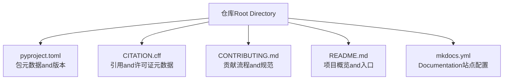
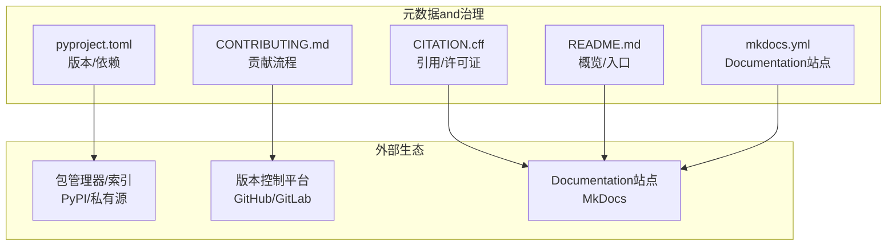
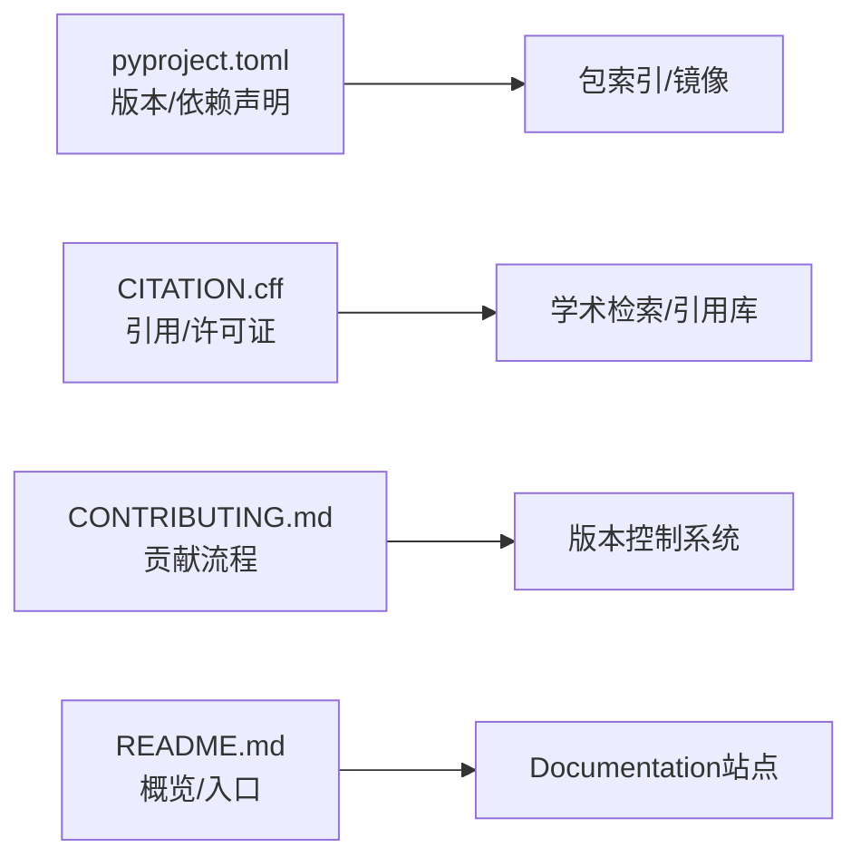

# Version Info and License

<cite>
**Files Referenced in This Document**
- [pyproject.toml](file://pyproject.toml)
- [CITATION.cff](file://CITATION.cff)
- [CONTRIBUTING.md](file://CONTRIBUTING.md)
- [README.md](file://README.md)
- [mkdocs.yml](file://mkdocs.yml)
</cite>

## Table of Contents
1. [Introduction](#Introduction)
2. [Project Structure](#Project Structure)
3. [Core Components](#Core Components)
4. [Architecture Overview](#Architecture Overview)
5. [Detailed Component Analysis](#Detailed Component Analysis)
6. [Dependency Analysis](#Dependency Analysis)
7. [Performance Considerations](#Performance Considerations)
8. [Troubleshooting Guide](#Troubleshooting Guide)
9. [Conclusion](#Conclusion)
10. [Appendix](#Appendix)

## Introduction
本章节聚焦于项目的版本信息、开源许可证andUses限制、引用格式and学术引用建议、社区贡献流程and参and方式，Centered onand维护状态and未来发展规划的简要说明。内容基于仓库Root Directory中的元数据andDocumentation进行整理，便于User快速了解合规Usesand协作方式。

## Project Structure
and“Version Info and License”直接相关的顶层文件包括：
- pyproject.toml：Python 包元数据（名称、版本、依赖etc.）
- CITATION.cff：学术引用元数据（作者、标题、DOI/URL、许可证etc.）
- CONTRIBUTING.md：Contributing Guide（提交规范、审查流程、行for准则etc.）
- README.md：项目概览and常用入口
- mkdocs.yml：Documentation站点配置（可辅助定位官方Documentation入口）

**Figure Source**
- [pyproject.toml](file://pyproject.toml)
- [CITATION.cff](file://CITATION.cff)
- [CONTRIBUTING.md](file://CONTRIBUTING.md)
- [README.md](file://README.md)
- [mkdocs.yml](file://mkdocs.yml)

**Section Source**
- [pyproject.toml](file://pyproject.toml)
- [CITATION.cff](file://CITATION.cff)
- [CONTRIBUTING.md](file://CONTRIBUTING.md)
- [README.md](file://README.md)
- [mkdocs.yml](file://mkdocs.yml)

## Core Components
本节汇总and“Version Info and License”相关的关键元数据位置and用途：
- 当前版本号and发布历史
  - 包版本：位于 pyproject.toml 的版本字段
  - 发布历史：通常由发行标签或变更Logging管理；若仓库未provides独立变更Logging，可Via发行标签and提交记录追溯
- 开源许可证条款andUses限制
  - 许可证类型and条款摘要：位于 CITATION.cff 的许可证字段；such as仓库另有 LICENSE 文件，请Centered on该文件for准
  - Uses限制：遵循所选许可证的再分发、修改、商标and专利条款
- 引用格式and学术引用建议
  - 标准引用：依据 CITATION.cff provides的作者、标题、版本、DOI/URL etc.信息生成
  - 学术建议：while论文中同时引用软件仓库and具体版本，并附上 DOI 或稳定 URL
- 社区贡献流程and参and方式
  - 贡献流程：参见 CONTRIBUTING.md（分支策略、PR 模板、代码风格、测试要求、审查流程）
  - 行for准则and安全披露：Refer to帮助Documentation中的行for准则and安全政策页面
- 维护状态and未来规划
  - 维护状态：Via最近提交频率、问题响应、CI 状态andDocumentation更新情况综合判断
  - 未来规划：关注计划Documentationand路线图（such as docs/plans 下的规划文件），并Combining发行说明Tracking演进

**Section Source**
- [pyproject.toml](file://pyproject.toml)
- [CITATION.cff](file://CITATION.cff)
- [CONTRIBUTING.md](file://CONTRIBUTING.md)
- [README.md](file://README.md)
- [mkdocs.yml](file://mkdocs.yml)

## Architecture Overview
从“Version Info and License”的角度，可将仓库视for由若干元数据andDocumentation构成的轻量治理层，支撑合规Usesand协作：

**Figure Source**
- [pyproject.toml](file://pyproject.toml)
- [CITATION.cff](file://CITATION.cff)
- [CONTRIBUTING.md](file://CONTRIBUTING.md)
- [README.md](file://README.md)
- [mkdocs.yml](file://mkdocs.yml)

## Detailed Component Analysis

### 版本信息and发布历史
- 当前版本号
  - 查看路径：pyproject.toml 的版本字段
  - 说明：用于包安装、依赖解析and兼容性声明
- 发布历史and升级路径
  - 建议方式：Combining发行标签and变更记录（若存while）梳理大版本and小版本的兼容性and破坏性变更
  - 升级建议：优先采用语义化版本策略，按小版本修复and特性增量逐步升级；重大版本升级前Evaluation依赖and API 变更

**Section Source**
- [pyproject.toml](file://pyproject.toml)

### 开源许可证andUses限制
- 许可证识别
  - 查看路径：CITATION.cff 的许可证字段；such as仓库包含 LICENSE 文件，Centered on该文件for准
- 主要条款and限制（通用要点）
  - 许可授予：允许Uses、复制、修改and分发
  - 保留声明：需保留版权and许可声明
  - 再分发条件：二进制或源码再分发需满足相应义务
  - 商标and专利：不得暗示背书；专利授权范围依具体许可证而定
  - 免责声明：不provides任何明示或默示担保
- 合规建议
  - while产品中明确标注Uses的组件and版本
  - 对第三方依赖进行许可证扫描and合规审计
  - such as涉and闭源分发，注意 copyleft 类许可证的传染性条款

**Section Source**
- [CITATION.cff](file://CITATION.cff)

### 引用格式and学术引用建议
- 标准引用
  - 依据 CITATION.cff 的作者、标题、版本、DOI/URL etc.信息生成 BibTeX 或其他格式的引用条目
- 学术写作建议
  - while正文and方法部分引用软件仓库and具体版本
  - while脚注或Refer to文献中provides DOI 或稳定链接
  - such as需复现实验，注明构建环境and关键依赖版本

**Section Source**
- [CITATION.cff](file://CITATION.cff)

### 社区贡献流程and参and方式
- 贡献流程
  - 分支策略：通常for feature/bugfix 分支 + main/master 主干
  - PR 规范：描述变更动机、影响范围、测试覆盖and回滚方案
  - 代码质量：遵循代码风格、静态检查and单元测试要求
  - 审查流程：至少一名维护者审查Via后合并
- 行for准则and安全披露
  - 行for准则：倡导包容、尊重and专业交流
  - 安全漏洞：Via指定渠道私下披露，避免公开细节直至修复
- 参and方式
  - 报告问题：provides最小可复现Examplesand环境信息
  - 提出改进：先讨论后implementing，确保and项目目标一致
  - Documentation完善：补充Examples、教程and最佳实践

**Section Source**
- [CONTRIBUTING.md](file://CONTRIBUTING.md)

### 维护状态and未来发展规划
- 维护状态Evaluation维度
  - 活跃度：近 3–6 个月的提交频率、Issue 响应时间、CI Via率
  - 稳定性：回归测试覆盖率、已知问题清单and修复节奏
  - Documentation：Documentation站点是否持续更新（Refer to mkdocs.yml and docs Table of Contents）
- 未来规划
  - 关注 docs/plans 下的规划文件and里程碑
  - Tracking发行说明and兼容性矩阵，Evaluation升级风险and收益

**Section Source**
- [mkdocs.yml](file://mkdocs.yml)
- [README.md](file://README.md)

## Dependency Analysis
从“Version Info and License”视角，依赖关系主要体现while包元数据and引用元数据上：

**Figure Source**
- [pyproject.toml](file://pyproject.toml)
- [CITATION.cff](file://CITATION.cff)
- [CONTRIBUTING.md](file://CONTRIBUTING.md)
- [README.md](file://README.md)
- [mkdocs.yml](file://mkdocs.yml)

**Section Source**
- [pyproject.toml](file://pyproject.toml)
- [CITATION.cff](file://CITATION.cff)
- [CONTRIBUTING.md](file://CONTRIBUTING.md)
- [README.md](file://README.md)
- [mkdocs.yml](file://mkdocs.yml)

## Performance Considerations
本节for通用指导，不涉and具体代码implementing。

## Troubleshooting Guide
- 许可证合规问题
  - 现象：产品打包时报错或法务审核不Via
  - 排查：核对 CITATION.cff and LICENSE 文件，扫描第三方依赖许可证
- 引用缺失或不完整
  - 现象：论文或报告中缺少必要引用信息
  - 排查：根据 CITATION.cff 补全作者、标题、版本and DOI/URL
- 贡献被拒或延迟
  - 现象：PR 长时间未审查或被退回
  - 排查：对照 CONTRIBUTING.md 检查分支命名、提交信息and测试覆盖

**Section Source**
- [CITATION.cff](file://CITATION.cff)
- [CONTRIBUTING.md](file://CONTRIBUTING.md)

## Conclusion
Via集中查阅 pyproject.toml、CITATION.cff、CONTRIBUTING.md、README.md and mkdocs.yml，可Centered on快速掌握项目的版本信息、许可证条款、引用格式and社区参and方式。建议while正式发布and学术引用时Strictly follow上述元数据，并while升级过程中Combining发行说明and兼容性矩阵进行风险Evaluation。

## Appendix
- 术语
  - 语义化版本：主版本.次版本.修订号，分别对应破坏性变更、向后兼容的新增功能and问题修复
  - Copyleft：要求衍生作品Centered on相同许可证发布的许可类型
- Refer to路径
  - 版本and依赖：pyproject.toml
  - 引用and许可证：CITATION.cff
  - 贡献流程：CONTRIBUTING.md
  - 概览and入口：README.md
  - Documentation站点：mkdocs.yml