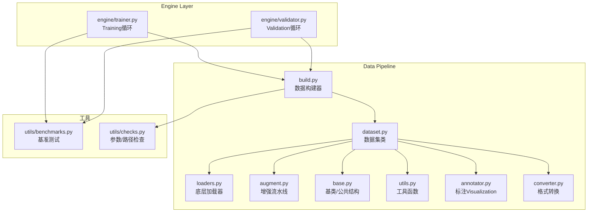
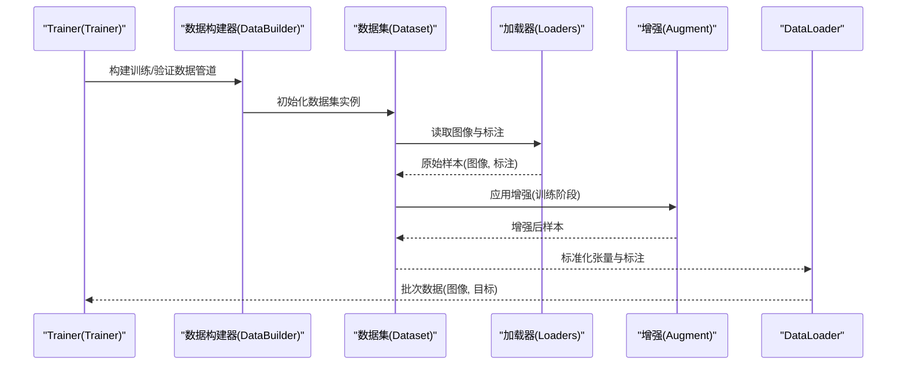
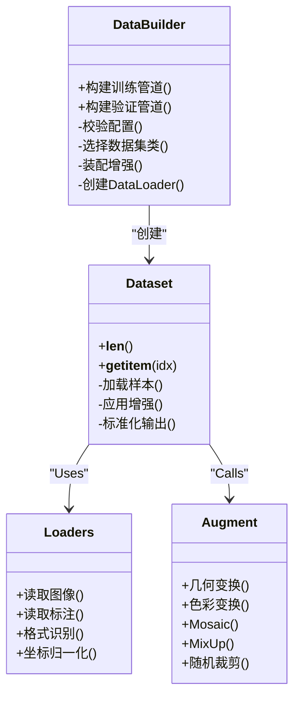
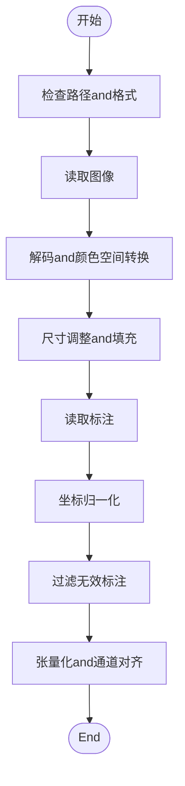
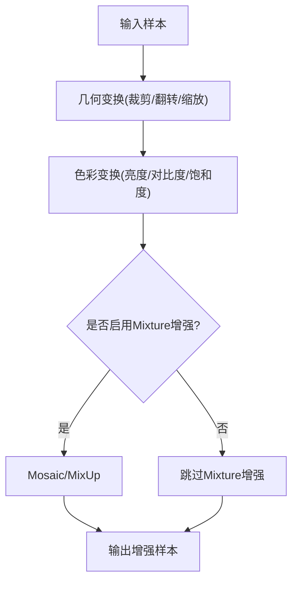
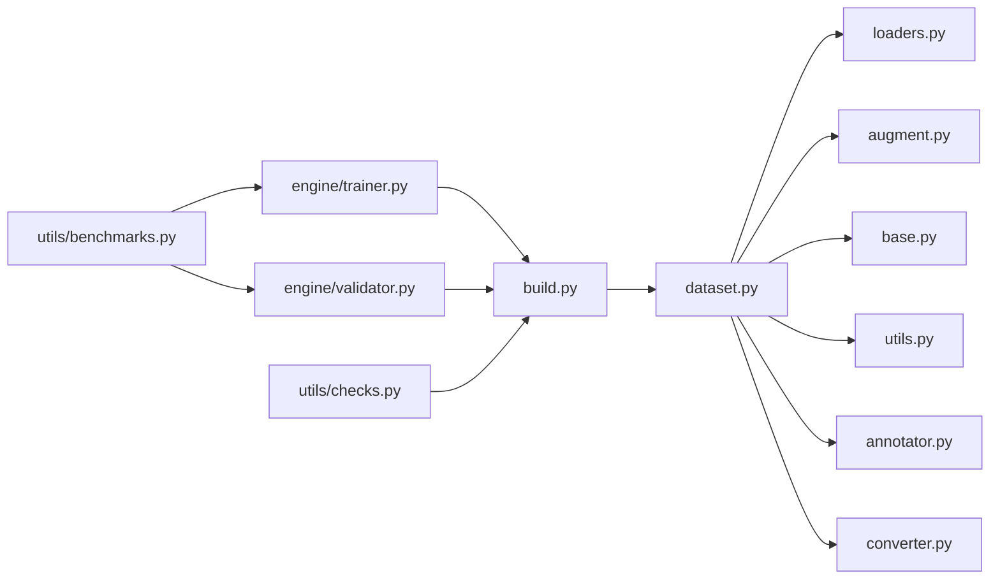

# Data Pipeline系统

<cite>
**Files Referenced in This Document**
- [ultralytics/data/build.py](file://ultralytics/data/build.py)
- [ultralytics/data/dataset.py](file://ultralytics/data/dataset.py)
- [ultralytics/data/loaders.py](file://ultralytics/data/loaders.py)
- [ultralytics/data/augment.py](file://ultralytics/data/augment.py)
- [ultralytics/data/base.py](file://ultralytics/data/base.py)
- [ultralytics/data/utils.py](file://ultralytics/data/utils.py)
- [ultralytics/data/annotator.py](file://ultralytics/data/annotator.py)
- [ultralytics/data/converter.py](file://ultralytics/data/converter.py)
- [ultralytics/engine/trainer.py](file://ultralytics/engine/trainer.py)
- [ultralytics/engine/validator.py](file://ultralytics/engine/validator.py)
- [ultralytics/utils/benchmarks.py](file://ultralytics/utils/benchmarks.py)
- [ultralytics/utils/checks.py](file://ultralytics/utils/checks.py)
</cite>

## Table of Contents
1. [Introduction](#Introduction)
2. [Project Structure](#Project Structure)
3. [Core Components](#Core Components)
4. [Architecture Overview](#Architecture Overview)
5. [Detailed Component Analysis](#Detailed Component Analysis)
6. [Dependency Analysis](#Dependency Analysis)
7. [Performance Considerations](#Performance Considerations)
8. [Troubleshooting Guide](#Troubleshooting Guide)
9. [Conclusion](#Conclusion)
10. [Appendix](#Appendix)

## Introduction
本文件targetingYOLO-Master的Data Pipeline系统，聚焦于TrainingandValidation阶段的Data Loading、预处理and增强流程。Documentation覆盖Centered on下主题：
- 数据集格式Supporting（COCO、YOLO、VOCetc.）的解析and统一抽象
- Data Augmentation技术（Mosaic、MixUp、随机裁剪etc.）的implementing原理and组合策略
- 数据构建器（DataBuilder）的设计模式：数据校验、缓存机制and内存管理
- 批处理策略and数据并行Optimization（多进程、预取、锁步/非锁步）
- 自定义Data Loading器的开发指南（接口规范and最佳实践）
- Data Pipeline性能调优方法and工具
- 常见问题诊断and解决方案

## Project Structure
Data Pipeline相关代码集中while ultralytics/data 子包中，并andEngine Layer（trainer/validator）紧密协作。关键Modules职责such as下：
- build.py：数据构建器入口，负责配置解析、数据集注册、构建and返回 DataLoader
- dataset.py：数据集类implementing，Encapsulates图像and标注读取、索引、切片、迭代逻辑
- loaders.py：底层图像and标注加载器，provides多种格式的统一读取capabilities
- augment.py：Data Augmentation算子and流水线编排（含Mosaic、MixUp、几何变换、色彩变换etc.）
- base.py：通用基类and共享数据结构定义
- utils.py：辅助函数（路径解析、IO、尺寸归一化、边界框操作etc.）
- annotator.py：标注Visualizationand调试工具
- converter.py：格式转换工具（such asCOCO/YOLO/VOC互转）
- engine/trainer.py and engine/validator.py：Training/Validation循环中Calls数据构建器并消费批次数据
- utils/benchmarks.py：Data Pipeline基准测试工具
- utils/checks.py：输入参数and路径合法性检查

Figure Source
- [ultralytics/data/build.py](file://ultralytics/data/build.py)
- [ultralytics/data/dataset.py](file://ultralytics/data/dataset.py)
- [ultralytics/data/loaders.py](file://ultralytics/data/loaders.py)
- [ultralytics/data/augment.py](file://ultralytics/data/augment.py)
- [ultralytics/data/base.py](file://ultralytics/data/base.py)
- [ultralytics/data/utils.py](file://ultralytics/data/utils.py)
- [ultralytics/data/annotator.py](file://ultralytics/data/annotator.py)
- [ultralytics/data/converter.py](file://ultralytics/data/converter.py)
- [ultralytics/engine/trainer.py](file://ultralytics/engine/trainer.py)
- [ultralytics/engine/validator.py](file://ultralytics/engine/validator.py)
- [ultralytics/utils/benchmarks.py](file://ultralytics/utils/benchmarks.py)
- [ultralytics/utils/checks.py](file://ultralytics/utils/checks.py)

Section Source
- [ultralytics/data/build.py](file://ultralytics/data/build.py)
- [ultralytics/data/dataset.py](file://ultralytics/data/dataset.py)
- [ultralytics/data/loaders.py](file://ultralytics/data/loaders.py)
- [ultralytics/data/augment.py](file://ultralytics/data/augment.py)
- [ultralytics/data/base.py](file://ultralytics/data/base.py)
- [ultralytics/data/utils.py](file://ultralytics/data/utils.py)
- [ultralytics/data/annotator.py](file://ultralytics/data/annotator.py)
- [ultralytics/data/converter.py](file://ultralytics/data/converter.py)
- [ultralytics/engine/trainer.py](file://ultralytics/engine/trainer.py)
- [ultralytics/engine/validator.py](file://ultralytics/engine/validator.py)
- [ultralytics/utils/benchmarks.py](file://ultralytics/utils/benchmarks.py)
- [ultralytics/utils/checks.py](file://ultralytics/utils/checks.py)

## Core Components
- 数据构建器（DataBuilder）
  - 职责：解析Tasks类型and数据集配置，选择对应数据集类，组装增强流水线，创建 DataLoader，并注入必要的校验and缓存策略。
  - 关键点：
    - 配置drivers are installed：根据Tasks（检测/分割/姿态etc.）and数据集路径自动推断格式
    - 增强装配：按Training/Validation阶段分别装配增强策略
    - 批处理and并行：控制 workers、prefetch_factor、pin_memory etc.
    - 校验and容错：while构建前进行路径and标签一致性检查
- 数据集类（Dataset）
  - 职责：维护样本索引、implementing __getitem__ and __len__，协调加载器and增强器，输出标准化张量and标注
  - 关键点：
    - 统一数据契约：图像、边界框、类别、掩码etc.字段规范化
    - 懒加载and缓存：按需读取图像，Optional缓存元数据或增强结果
    - 切片and采样：Supporting按比例划分、重采样、过滤无效样本
- 底层加载器（Loaders）
  - 职责：从磁盘/网络读取图像and标注，Supporting多种格式（COCO JSON、YOLO txt、VOC XMLetc.）
  - 关键点：
    - 格式识别：基于扩展名and内容特征判断格式
    - 坐标归一化：将像素坐标转换for相对坐标
    - 异常恢复：缺失文件、损坏标注时的降级策略
- 增强流水线（Augment）
  - 职责：组合几何and色彩增强、高级Mixture增强（Mosaic/MixUp）、随机裁剪/翻转/缩放etc.
  - 关键点：
    - 可插拔算子：每个增强for独立单元，Supporting概率and强度参数
    - 顺序敏感：不同顺序对最终分布影响显著
    - Tasks适配：检测/分割/姿态Tasks的增强需保持标注一致性
- 工具and校验（Utils/Checks）
  - 职责：路径解析、IOOptimization、尺寸and边界框操作、参数校验
  - 关键点：
    - 批量I/O：Uses高效读取and预取
    - 数值稳定：避免除零、越界、NaN传播

Section Source
- [ultralytics/data/build.py](file://ultralytics/data/build.py)
- [ultralytics/data/dataset.py](file://ultralytics/data/dataset.py)
- [ultralytics/data/loaders.py](file://ultralytics/data/loaders.py)
- [ultralytics/data/augment.py](file://ultralytics/data/augment.py)
- [ultralytics/data/base.py](file://ultralytics/data/base.py)
- [ultralytics/data/utils.py](file://ultralytics/data/utils.py)
- [ultralytics/data/annotator.py](file://ultralytics/data/annotator.py)
- [ultralytics/data/converter.py](file://ultralytics/data/converter.py)
- [ultralytics/utils/checks.py](file://ultralytics/utils/checks.py)

## Architecture Overview
下图展示Training/Validation过程中Data Pipeline的端to端Calls链and数据流向。

Figure Source
- [ultralytics/engine/trainer.py](file://ultralytics/engine/trainer.py)
- [ultralytics/data/build.py](file://ultralytics/data/build.py)
- [ultralytics/data/dataset.py](file://ultralytics/data/dataset.py)
- [ultralytics/data/loaders.py](file://ultralytics/data/loaders.py)
- [ultralytics/data/augment.py](file://ultralytics/data/augment.py)

## Detailed Component Analysis

### 数据构建器（DataBuilder）设计模式
- 设计要点
  - 工厂模式：根据Tasks类型and配置返回对应的数据集and DataLoader
  - 模板方法：统一的构建流程（校验→解析→装配→返回），子类可覆盖特定步骤
  - 策略模式：增强策略and批处理策略可替换
- 关键流程
  - 参数校验：路径存while性、格式一致性、类别映射完整性
  - 数据集选择：依据Tasksand数据Root Directory自动匹配数据集类
  - 增强装配：Training阶段启用Mixture增强and几何/色彩变换；Validation阶段仅做必要归一化
  - DataLoader配置：workers、prefetch_factor、pin_memory、drop_last etc.
- 缓存and内存管理
  - 元数据缓存：索引、类别映射、尺寸统计可持久化to本地缓存Table of Contents
  - 图像缓存：Optional开启小图缓存Centered on降低重复IO开销
  - 垃圾回收：and时释放中间张量，避免峰值内存膨胀

Figure Source
- [ultralytics/data/build.py](file://ultralytics/data/build.py)
- [ultralytics/data/dataset.py](file://ultralytics/data/dataset.py)
- [ultralytics/data/loaders.py](file://ultralytics/data/loaders.py)
- [ultralytics/data/augment.py](file://ultralytics/data/augment.py)

Section Source
- [ultralytics/data/build.py](file://ultralytics/data/build.py)
- [ultralytics/data/dataset.py](file://ultralytics/data/dataset.py)
- [ultralytics/data/loaders.py](file://ultralytics/data/loaders.py)
- [ultralytics/data/augment.py](file://ultralytics/data/augment.py)

### Data Loadingand预处理流程
- 格式Supporting
  - COCO：JSON结构，包含 images、annotations、categories
  - YOLO：txt每行一个目标，格式for class x_center y_center width height（相对坐标）
  - VOC：XML标注，包含 bounding box and类别
  - 其他：Via converter.py 进行互转and清洗
- 预处理步骤
  - 路径解析and存while性检查
  - 图像解码and颜色空间转换（BGR→RGB）
  - 尺寸调整and填充（保持纵横比）
  - 标注坐标归一化and有效性过滤
  - 张量化and通道维度对齐
- 数据Validation
  - 类别ID连续性检查
  - 边界框范围and面积阈值过滤
  - 缺失图像/标注文件的回退策略

Figure Source
- [ultralytics/data/loaders.py](file://ultralytics/data/loaders.py)
- [ultralytics/data/utils.py](file://ultralytics/data/utils.py)
- [ultralytics/data/converter.py](file://ultralytics/data/converter.py)

Section Source
- [ultralytics/data/loaders.py](file://ultralytics/data/loaders.py)
- [ultralytics/data/utils.py](file://ultralytics/data/utils.py)
- [ultralytics/data/converter.py](file://ultralytics/data/converter.py)

### Data Augmentation技术implementing原理
- Mosaic
  - 原理：拼接四张图像for一个批次，提升小Object Detection鲁棒性and上下文多样性
  - 标注融合：跨图像边界框合并and类别映射
  - Applicable Scenarios：检测Tasks，尤其对小目标密集场景
- MixUp
  - 原理：线性插值两张图像的像素and标注权重，平滑决策边界
  - 注意事项：类别权重按比例分配，边界框需重新计算
- 随机裁剪/翻转/缩放
  - 几何变换：保持标注and图像同步变化
  - 色彩变换：亮度、对比度、饱和度抖动，提升泛化
- 增强流水线编排
  - 顺序敏感：先几何后色彩，再Mixture增强
  - 概率控制：每种增强可设置启用概率and强度参数
  - Tasks适配：分割/姿态需while掩码/关键点层面保持一致性

Figure Source
- [ultralytics/data/augment.py](file://ultralytics/data/augment.py)

Section Source
- [ultralytics/data/augment.py](file://ultralytics/data/augment.py)

### 批处理策略and数据并行Optimization
- 批处理策略
  - 动态批大小：按图像尺寸分组Centered on减少填充浪费
  - Drop last：丢弃最后一个不完整批次Centered on稳定Training
  - 锁步and非锁步：锁步保证各进程进度一致，非锁步提高吞吐但可能引入偏差
- 数据并行Optimization
  - 多进程 workers：平衡CPUandGPU利用率
  - Prefetch：预取下一批次减少GPU空闲时间
  - Pin memory：加速主机to设备传输
  - 缓存元数据：降低重复IOand解析开销
- 监控and调参
  - Uses benchmarks.py Evaluation不同 workers/prefetch 组合的吞吐
  - 观察GPU利用率曲线and数据etc.待时间占比

Section Source
- [ultralytics/data/build.py](file://ultralytics/data/build.py)
- [ultralytics/utils/benchmarks.py](file://ultralytics/utils/benchmarks.py)

### 自定义Data Loading器开发指南
- 接口规范
  - 继承基础数据集类，implementing __len__ and __getitem__
  - 遵循统一输出契约：图像张量、标注字典（类别、边界框、掩码/关键点etc.）
  - Supporting切片and索引映射，便于数据划分and重采样
- 最佳实践
  - 懒加载：仅while需要时读取图像and标注
  - 异常隔离：单个样本错误不影响整体迭代
  - 可复现：固定随机种子and确定性增强顺序
  - 单元测试：覆盖边界条件and极端样本
- 集成方式
  - Via构建器注册自定义数据集类
  - while配置中指定Tasks类型and自定义类路径
  - Uses annotator.py 进行VisualizationValidation

Section Source
- [ultralytics/data/dataset.py](file://ultralytics/data/dataset.py)
- [ultralytics/data/base.py](file://ultralytics/data/base.py)
- [ultralytics/data/annotator.py](file://ultralytics/data/annotator.py)

## Dependency Analysis
Data Pipeline内部Modules之间的依赖关系such as下：

Figure Source
- [ultralytics/data/build.py](file://ultralytics/data/build.py)
- [ultralytics/data/dataset.py](file://ultralytics/data/dataset.py)
- [ultralytics/data/loaders.py](file://ultralytics/data/loaders.py)
- [ultralytics/data/augment.py](file://ultralytics/data/augment.py)
- [ultralytics/data/base.py](file://ultralytics/data/base.py)
- [ultralytics/data/utils.py](file://ultralytics/data/utils.py)
- [ultralytics/data/annotator.py](file://ultralytics/data/annotator.py)
- [ultralytics/data/converter.py](file://ultralytics/data/converter.py)
- [ultralytics/engine/trainer.py](file://ultralytics/engine/trainer.py)
- [ultralytics/engine/validator.py](file://ultralytics/engine/validator.py)
- [ultralytics/utils/benchmarks.py](file://ultralytics/utils/benchmarks.py)
- [ultralytics/utils/checks.py](file://ultralytics/utils/checks.py)

Section Source
- [ultralytics/data/build.py](file://ultralytics/data/build.py)
- [ultralytics/data/dataset.py](file://ultralytics/data/dataset.py)
- [ultralytics/data/loaders.py](file://ultralytics/data/loaders.py)
- [ultralytics/data/augment.py](file://ultralytics/data/augment.py)
- [ultralytics/data/base.py](file://ultralytics/data/base.py)
- [ultralytics/data/utils.py](file://ultralytics/data/utils.py)
- [ultralytics/data/annotator.py](file://ultralytics/data/annotator.py)
- [ultralytics/data/converter.py](file://ultralytics/data/converter.py)
- [ultralytics/engine/trainer.py](file://ultralytics/engine/trainer.py)
- [ultralytics/engine/validator.py](file://ultralytics/engine/validator.py)
- [ultralytics/utils/benchmarks.py](file://ultralytics/utils/benchmarks.py)
- [ultralytics/utils/checks.py](file://ultralytics/utils/checks.py)

## Performance Considerations
- I/Obottlenecks定位
  - Uses benchmarks.py 测量不同 workers and prefetch_factor 下的吞吐
  - 监控磁盘带宽andGPU利用率，识别数据etc.待热点
- 内存管理
  - Set appropriately缓存大小，避免OOM
  - and时释放中间张量，减少峰值内存
- 并行策略
  - 多进程 workers 数建议forCPU核心数的1~2倍
  - 大图像场景下Prefer锁步模式Centered on保证稳定性
- 增强开销
  - 复杂增强（Mosaic/MixUp）会显著增加CPU负载，需权衡精度and速度
  - Validation阶段关闭非必要增强Centered on提升吞吐

[This section provides general guidance and does not directly analyze specific files]

## Troubleshooting Guide
- 常见错误
  - 路径不存while或权限不足：检查路径解析and文件系统权限
  - 标注格式不一致：Uses converter.py 进行格式清洗and转换
  - 类别ID不连续或缺失：运行 checks.py 进行一致性校验
  - 内存溢出：减小 batch size、workers 或关闭图像缓存
  - GPU利用率低：增大 prefetch_factor 或 workers，启用 pin_memory
- 诊断步骤
  - Uses annotator.py Visualization少量样本，确认标注正确
  - 逐步禁用增强，定位问题增强算子
  - Uses benchmarks.py 对比不同配置的性能差异
- 恢复策略
  - 启用异常隔离，跳过坏样本继续Training
  - Uses缓存Table of Contents恢复已处理的元数据，避免重复计算

Section Source
- [ultralytics/data/utils.py](file://ultralytics/data/utils.py)
- [ultralytics/data/converter.py](file://ultralytics/data/converter.py)
- [ultralytics/utils/checks.py](file://ultralytics/utils/checks.py)
- [ultralytics/data/annotator.py](file://ultralytics/data/annotator.py)
- [ultralytics/utils/benchmarks.py](file://ultralytics/utils/benchmarks.py)

## Conclusion
YOLO-Master的Data Pipeline系统Centered on构建器for核心，Combining灵活的数据集抽象、强大的增强流水线and高效的批处理策略，provides了可扩展、高性能的TrainingandValidation数据流。Via合理的缓存and并行Optimization，Centered onand完善的校验and诊断工具，User可Centered onwhile多样化数据集andTasks上获得稳定且高效的Training体验。

[This section is summary content and does not directly analyze specific files]

## Appendix
- 术语表
  - 数据构建器：负责组装数据集andDataLoader的组件
  - 锁步模式：多进程严格同步的迭代方式
  - 非锁步模式：允许进程异步迭代的模式
- Refer to链接
  - Data AugmentationDocumentation：docs/en/guides/yolo-data-augmentation.md
  - 数据集格式说明：docs/en/datasets/detect/index.md

[本节for补充信息，不直接分析具体文件]