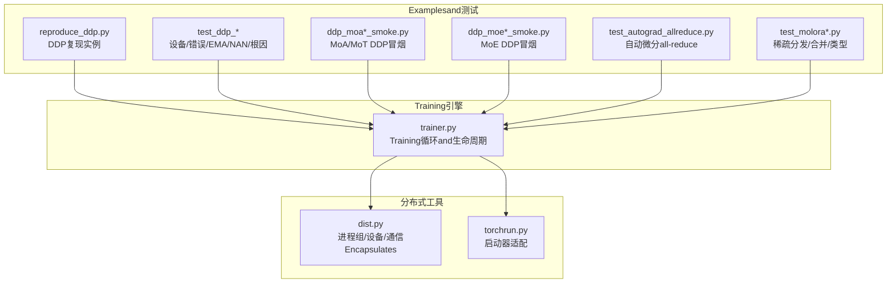
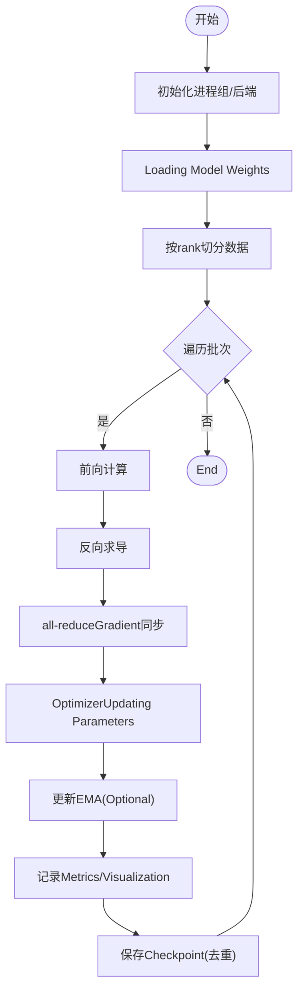
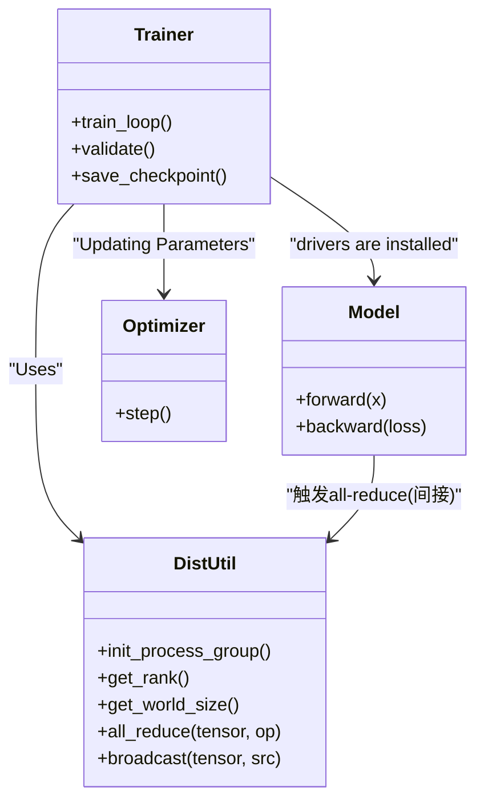
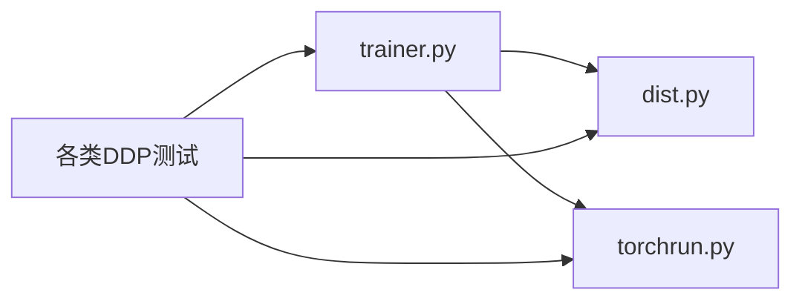

# Distributed Training

<cite>
**Files Referenced in This Document**
- [ultralytics/engine/trainer.py](file://ultralytics/engine/trainer.py)
- [ultralytics/utils/dist.py](file://ultralytics/utils/dist.py)
- [ultralytics/utils/torchrun.py](file://ultralytics/utils/torchrun.py)
- [scripts/reproduce/reproduce_ddp.py](file://scripts/reproduce/reproduce_ddp.py)
- [tests/test_ddp_device_hardening.py](file://tests/test_ddp_device_hardening.py)
- [tests/test_ddp_error_propagation_e2e.py](file://tests/test_ddp_error_propagation_e2e.py)
- [tests/test_ddp_lifecycle_ema_nan.py](file://tests/test_ddp_lifecycle_ema_nan.py)
- [tests/test_ddp_root_cause_reporting.py](file://tests/test_ddp_root_cause_reporting.py)
- [tests/ddp_moa_mot_smoke.py](file://tests/ddp_moa_mot_smoke.py)
- [tests/ddp_moe_smoke.py](file://tests/ddp_moe_smoke.py)
- [tests/ddp_moe_validation_smoke.py](file://tests/ddp_moe_validation_smoke.py)
- [tests/test_autograd_allreduce.py](file://tests/test_autograd_allreduce.py)
- [tests/test_moe_validation_collectives.py](file://tests/test_moe_validation_collectives.py)
- [tests/test_molora_sparse_dispatch.py](file://tests/test_molora_sparse_dispatch.py)
- [tests/test_molora.py](file://tests/test_molora.py)
- [tests/test_molora_dtype.py](file://tests/test_molora_dtype.py)
- [tests/test_molora_merge_semantics.py](file://tests/test_molora_merge_semantics.py)
- [tests/test_molora_routing_aware_merge.py](file://tests/test_molora_routing_aware_merge.py)
- [tests/test_molora_supplementary.py](file://tests/test_molora_supplementary.py)
- [tests/test_windows_torchrun.py](file://tests/test_windows_torchrun.py)
- [tests/test_engine.py](file://tests/test_engine.py)
- [tests/test_integrations.py](file://tests/test_integrations.py)
</cite>

## Table of Contents
1. [Introduction](#Introduction)
2. [Project Structure](#Project Structure)
3. [Core Components](#Core Components)
4. [Architecture Overview](#Architecture Overview)
5. [Detailed Component Analysis](#Detailed Component Analysis)
6. [Dependency Analysis](#Dependency Analysis)
7. [Performance Considerations](#Performance Considerations)
8. [故障排除指南](#故障排除指南)
9. [Conclusion](#Conclusion)
10. [Appendix](#Appendix)

## Introduction
本技术DocumentationtargetingYOLO-Master的Distributed Training系统，聚焦于Distributed Data Parallel（DDP）的Training流程and通信机制、多GPU配置andOptimization、DeepSpeed集成Supporting、跨节点分布式设置and排障、Gradient同步/参数广播/all-reduceimplementing细节、内存管理andLoad Balancing策略，Centered onand监控and性能分析方法。DocumentationCentered on代码级事实for依据，Combining测试用例and工具Modules进行系统化说明，帮助读者while单节点多卡and多机多卡环境下高效稳定地TrainingYOLO Series Models。

## Project Structure
围绕Distributed Training，仓库中andDDP、torchrun、collective通信、MoE/MoA稀疏分发etc.相关的核心位置such as下：
- Training引擎入口and生命周期管理位于Engine Layer
- 分布式初始化、进程组and设备绑定etc.capabilities集中whileutils/distandutils/torchrun
- 复现脚本providesDDP运行Examples
- 大量测试覆盖DDP设备硬化、错误传播、EMA/NAN处理、根因报告、MoE/MoA in DDP、autograd all-reduce、Molora稀疏分发and合并语义etc.



Figure Source
- [ultralytics/engine/trainer.py](file://ultralytics/engine/trainer.py)
- [ultralytics/utils/dist.py](file://ultralytics/utils/dist.py)
- [ultralytics/utils/torchrun.py](file://ultralytics/utils/torchrun.py)
- [scripts/reproduce/reproduce_ddp.py](file://scripts/reproduce/reproduce_ddp.py)
- [tests/test_ddp_device_hardening.py](file://tests/test_ddp_device_hardening.py)
- [tests/test_ddp_error_propagation_e2e.py](file://tests/test_ddp_error_propagation_e2e.py)
- [tests/test_ddp_lifecycle_ema_nan.py](file://tests/test_ddp_lifecycle_ema_nan.py)
- [tests/test_ddp_root_cause_reporting.py](file://tests/test_ddp_root_cause_reporting.py)
- [tests/ddp_moa_mot_smoke.py](file://tests/ddp_moa_mot_smoke.py)
- [tests/ddp_moe_smoke.py](file://tests/ddp_moe_smoke.py)
- [tests/ddp_moe_validation_smoke.py](file://tests/ddp_moe_validation_smoke.py)
- [tests/test_autograd_allreduce.py](file://tests/test_autograd_allreduce.py)
- [tests/test_molora_sparse_dispatch.py](file://tests/test_molora_sparse_dispatch.py)
- [tests/test_molora.py](file://tests/test_molora.py)
- [tests/test_molora_dtype.py](file://tests/test_molora_dtype.py)
- [tests/test_molora_merge_semantics.py](file://tests/test_molora_merge_semantics.py)
- [tests/test_molora_routing_aware_merge.py](file://tests/test_molora_routing_aware_merge.py)
- [tests/test_molora_supplementary.py](file://tests/test_molora_supplementary.py)

Section Source
- [ultralytics/engine/trainer.py](file://ultralytics/engine/trainer.py)
- [ultralytics/utils/dist.py](file://ultralytics/utils/dist.py)
- [ultralytics/utils/torchrun.py](file://ultralytics/utils/torchrun.py)
- [scripts/reproduce/reproduce_ddp.py](file://scripts/reproduce/reproduce_ddp.py)
- [tests/test_ddp_device_hardening.py](file://tests/test_ddp_device_hardening.py)
- [tests/test_ddp_error_propagation_e2e.py](file://tests/test_ddp_error_propagation_e2e.py)
- [tests/test_ddp_lifecycle_ema_nan.py](file://tests/test_ddp_lifecycle_ema_nan.py)
- [tests/test_ddp_root_cause_reporting.py](file://tests/test_ddp_root_cause_reporting.py)
- [tests/ddp_moa_mot_smoke.py](file://tests/ddp_moa_mot_smoke.py)
- [tests/ddp_moe_smoke.py](file://tests/ddp_moe_smoke.py)
- [tests/ddp_moe_validation_smoke.py](file://tests/ddp_moe_validation_smoke.py)
- [tests/test_autograd_allreduce.py](file://tests/test_autograd_allreduce.py)
- [tests/test_molora_sparse_dispatch.py](file://tests/test_molora_sparse_dispatch.py)
- [tests/test_molora.py](file://tests/test_molora.py)
- [tests/test_molora_dtype.py](file://tests/test_molora_dtype.py)
- [tests/test_molora_merge_semantics.py](file://tests/test_molora_merge_semantics.py)
- [tests/test_molora_routing_aware_merge.py](file://tests/test_molora_routing_aware_merge.py)
- [tests/test_molora_supplementary.py](file://tests/test_molora_supplementary.py)

## Core Components
- Training引擎（trainer）
  - 负责Training循环、Validation、Logging、Checkpoint保存、EMA维护、损失计算andOptimizer步进etc.。while分布式模式下，需确保各进程独立持有模型副本并正确同步Gradient。
- 分布式工具（dist）
  - Encapsulates进程组创建、设备分配、通信后端选择、all-reduce/gather/scatteretc.集合操作，for上层Trainingprovides一致的分布式接口。
- torchrun适配（torchrun）
  - 统一Viatorch.distributed.launch或torchrun启动，屏蔽不同平台差异（含Windows），并provides必要的初始化and参数解析。
- 复现脚本（reproduce_ddp）
  - provides最小可运行的DDPTraining入口，便于快速Validation环境、Data Loadingand模型Training链路。
- Test Suite
  - 覆盖设备绑定、错误传播、EMA/NAN鲁棒性、根因定位、MoE/MoAwhileDDP下的行for、autograd all-reduce路径、Molora稀疏分发and合并语义etc.关键场景。

Section Source
- [ultralytics/engine/trainer.py](file://ultralytics/engine/trainer.py)
- [ultralytics/utils/dist.py](file://ultralytics/utils/dist.py)
- [ultralytics/utils/torchrun.py](file://ultralytics/utils/torchrun.py)
- [scripts/reproduce/reproduce_ddp.py](file://scripts/reproduce/reproduce_ddp.py)
- [tests/test_ddp_device_hardening.py](file://tests/test_ddp_device_hardening.py)
- [tests/test_ddp_error_propagation_e2e.py](file://tests/test_ddp_error_propagation_e2e.py)
- [tests/test_ddp_lifecycle_ema_nan.py](file://tests/test_ddp_lifecycle_ema_nan.py)
- [tests/test_ddp_root_cause_reporting.py](file://tests/test_ddp_root_root_cause_reporting.py)
- [tests/ddp_moa_mot_smoke.py](file://tests/ddp_moa_mot_smoke.py)
- [tests/ddp_moe_smoke.py](file://tests/ddp_moe_smoke.py)
- [tests/ddp_moe_validation_smoke.py](file://tests/ddp_moe_validation_smoke.py)
- [tests/test_autograd_allreduce.py](file://tests/test_autograd_allreduce.py)
- [tests/test_molora_sparse_dispatch.py](file://tests/test_molora_sparse_dispatch.py)
- [tests/test_molora.py](file://tests/test_molora.py)
- [tests/test_molora_dtype.py](file://tests/test_molora_dtype.py)
- [tests/test_molora_merge_semantics.py](file://tests/test_molora_merge_semantics.py)
- [tests/test_molora_routing_aware_merge.py](file://tests/test_molora_routing_aware_merge.py)
- [tests/test_molora_supplementary.py](file://tests/test_molora_supplementary.py)

## Architecture Overview
下图展示从进程启动toTraining主循环的关键交互，包括分布式初始化、模型andOptimizer准备、前向/反向、Gradient同步and更新。

```mermaid
sequenceDiagram
participant User as "User"
participant TorchRun as "torchrun适配"
participant Dist as "分布式工具(dist)"
participant Trainer as "Training引擎(trainer)"
participant Model as "模型(含MoE/MoA)"
participant Opt as "Optimizer"
participant Comm as "Collective通信"
User->>TorchRun : "启动多进程Tasks"
TorchRun->>Dist : "初始化进程组/后端"
Dist-->>TorchRun : "返回rank/world_size/device"
TorchRun->>Trainer : "构建并Enter Training循环"
loop 每个批次
Trainer->>Model : "前向计算"
Model-->>Trainer : "损失/中间状态"
Trainer->>Opt : "反向求导"
Opt->>Comm : "触发Gradient同步(all-reduce)"
Comm-->>Opt : "聚合后的全局Gradient"
Opt->>Model : "参数更新"
Trainer->>Trainer : "EMA/Logging/Checkpoint"
end
```

Figure Source
- [ultralytics/utils/torchrun.py](file://ultralytics/utils/torchrun.py)
- [ultralytics/utils/dist.py](file://ultralytics/utils/dist.py)
- [ultralytics/engine/trainer.py](file://ultralytics/engine/trainer.py)

## Detailed Component Analysis

### DDPTraining流程and通信机制
- 进程启动and初始化
  - Viatorchrun适配统一拉起多进程；分布式工具完成进程组创建、后端选择and设备绑定。
- 模型andOptimizer准备
  - 各进程加载相同权重，按rank划分数据；Optimizerwhile各进程本地维护参数副本。
- 前向/反向andGradient同步
  - 反向End后，由autograd或显式Calls触发all-reduce，将各进程Gradient聚合成全局Gradient，再执行参数更新。
- ValidationandCheckpoint
  - Validation阶段通常仅root进程记录结果；Checkpoint保存需避免重复写入或竞态。



Section Source
- [ultralytics/utils/torchrun.py](file://ultralytics/utils/torchrun.py)
- [ultralytics/utils/dist.py](file://ultralytics/utils/dist.py)
- [ultralytics/engine/trainer.py](file://ultralytics/engine/trainer.py)
- [scripts/reproduce/reproduce_ddp.py](file://scripts/reproduce/reproduce_ddp.py)

### 多GPUTraining Configurationand性能Optimization
- 基本配置
  - Usestorchrun启动，指定进程数etc.于GPU数量；确保环境变量（such as端口、后端）一致。
- 数据并行and批大小
  - 全局批大小=每卡批大小×进程数；合理调整每卡批大小Centered on平衡吞吐and显存。
- I/Oand预处理
  - 启用数据预取and多线程加载，减少CPUbottlenecks；对图像增强进行批内向量化。
- Mixture精度and算子Optimization
  - 开启AMPCentered on提升吞吐；Prefer内核友好的算子and张量布局。
- 通信and带宽
  - 选择合适的NCCL后端and拓扑；while多机场景下关注网络延迟and带宽。

Section Source
- [ultralytics/utils/torchrun.py](file://ultralytics/utils/torchrun.py)
- [ultralytics/utils/dist.py](file://ultralytics/utils/dist.py)
- [tests/test_engine.py](file://tests/test_engine.py)

### DeepSpeed集成Supportingand配置选项
- 现状说明
  - 当前仓库未直接包含DeepSpeed专用Training入口或配置解析逻辑；such as需UsesDeepSpeed，建议while其生态中对接YOLO-Master模型定义and数据管线，或Via外部包装器注入DeepSpeed ZeRO/Offloadetc.特性。
- 建议接入方式
  - 保持模型andData Loading不变，UsesDeepSpeedprovides的启动器替换torchrun；确保模型可被DeepSpeed序列化/反序列化，且自定义Modules遵循其要求。
- 注意事项
  - Mixture精度、Gradient累积、ZeRO阶段andoffload策略需and现有EMA/Checkpoint/Logging逻辑协调，避免状态不一致。

Section Source
- [ultralytics/engine/trainer.py](file://ultralytics/engine/trainer.py)
- [ultralytics/utils/torchrun.py](file://ultralytics/utils/torchrun.py)

### 跨节点Distributed Training设置and故障排除
- 设置要点
  - 多机多卡需统一后端（such asNCCL）、端口、世界规模and主机列表；确保防火墙放行相应端口。
  - Usestorchrun的multi-node模式，或while作业调度系统中按节点分发进程。
- 常见故障
  - 进程间无法建立连接、端口冲突、NCCL初始化失败、时间同步问题、磁盘权限导致Checkpoint写入失败。
- 排查步骤
  - 校验rank/world_size一致性；打印各进程设备and后端信息；缩小规模逐步定位；查看NCCL调试输出。

Section Source
- [ultralytics/utils/torchrun.py](file://ultralytics/utils/torchrun.py)
- [ultralytics/utils/dist.py](file://ultralytics/utils/dist.py)
- [tests/test_windows_torchrun.py](file://tests/test_windows_torchrun.py)

### Gradient同步、参数广播andall-reduceimplementing细节
- Gradient同步
  - 反向End后触发all-reduce，将各进程Gradient聚合for全局Gradient；确保所有参and进程均to达同步点。
- 参数广播
  - Training开始前由root进程广播初始参数至其他进程，保证初始一致性。
- autograd all-reduce路径
  - 测试覆盖了autograd触发的all-reduce路径，确保自定义算子andModuleswhileDDP下正常工作。
- MoE/MoA特殊路径
  - 针对稀疏路由and专家权重，测试覆盖collectiveCallsand数值稳定性，确保whileDDP下正确同步。



Figure Source
- [ultralytics/utils/dist.py](file://ultralytics/utils/dist.py)
- [ultralytics/engine/trainer.py](file://ultralytics/engine/trainer.py)
- [tests/test_autograd_allreduce.py](file://tests/test_autograd_allreduce.py)
- [tests/test_moe_validation_collectives.py](file://tests/test_moe_validation_collectives.py)

Section Source
- [ultralytics/utils/dist.py](file://ultralytics/utils/dist.py)
- [ultralytics/engine/trainer.py](file://ultralytics/engine/trainer.py)
- [tests/test_autograd_allreduce.py](file://tests/test_autograd_allreduce.py)
- [tests/test_moe_validation_collectives.py](file://tests/test_moe_validation_collectives.py)

### 内存管理andLoad Balancing策略
- 显存管理
  - 控制每卡批大小、启用Mixture精度、释放中间变量；对大对象and时清理。
- Load Balancing
  - 数据采样尽量均匀；对于MoE/MoA，注意专家负载不均衡导致的straggler现象，可Via路由校准或动态调度缓解。
- Molora稀疏分发
  - 测试覆盖稀疏分发and合并语义，确保whileDDP下按路由聚合时不会引入额外通信热点。

Section Source
- [tests/test_molora_sparse_dispatch.py](file://tests/test_molora_sparse_dispatch.py)
- [tests/test_molora.py](file://tests/test_molora.py)
- [tests/test_molora_dtype.py](file://tests/test_molora_dtype.py)
- [tests/test_molora_merge_semantics.py](file://tests/test_molora_merge_semantics.py)
- [tests/test_molora_routing_aware_merge.py](file://tests/test_molora_routing_aware_merge.py)
- [tests/test_molora_supplementary.py](file://tests/test_molora_supplementary.py)

### 监控工具and性能分析指南
- Metrics采集
  - whileTraining循环中记录loss、吞吐、显存占用、通信耗时；定期汇总并Visualization。
- 性能剖析
  - Uses框架Built-inprofiler或第三方工具分析算子耗时and通信bottlenecks；定位长尾批次and热点all-reduce。
- Loggingand事件
  - 利用事件回调记录关键阶段耗时，辅助定位慢点and异常。

Section Source
- [ultralytics/engine/trainer.py](file://ultralytics/engine/trainer.py)
- [tests/test_engine.py](file://tests/test_engine.py)

## Dependency Analysis
- 耦合and内聚
  - trainer强依赖distandtorchrunprovides的分布式capabilities；测试广泛覆盖DDP相关路径，形成良好的回归保障。
- External Dependencies
  - 主要依赖PyTorch分布式后端（such asNCCL）；whileWindows环境下有专门适配测试。
- 潜while环依赖
  - 未见明显循环导入；Training引擎and分布式工具解耦清晰。



Figure Source
- [ultralytics/engine/trainer.py](file://ultralytics/engine/trainer.py)
- [ultralytics/utils/dist.py](file://ultralytics/utils/dist.py)
- [ultralytics/utils/torchrun.py](file://ultralytics/utils/torchrun.py)
- [tests/test_ddp_device_hardening.py](file://tests/test_ddp_device_hardening.py)
- [tests/test_ddp_error_propagation_e2e.py](file://tests/test_ddp_error_propagation_e2e.py)
- [tests/test_ddp_lifecycle_ema_nan.py](file://tests/test_ddp_lifecycle_ema_nan.py)
- [tests/test_ddp_root_cause_reporting.py](file://tests/test_ddp_root_cause_reporting.py)
- [tests/ddp_moa_mot_smoke.py](file://tests/ddp_moa_mot_smoke.py)
- [tests/ddp_moe_smoke.py](file://tests/ddp_moe_smoke.py)
- [tests/ddp_moe_validation_smoke.py](file://tests/ddp_moe_validation_smoke.py)
- [tests/test_autograd_allreduce.py](file://tests/test_autograd_allreduce.py)
- [tests/test_molora_sparse_dispatch.py](file://tests/test_molora_sparse_dispatch.py)
- [tests/test_molora.py](file://tests/test_molora.py)
- [tests/test_molora_dtype.py](file://tests/test_molora_dtype.py)
- [tests/test_molora_merge_semantics.py](file://tests/test_molora_merge_semantics.py)
- [tests/test_molora_routing_aware_merge.py](file://tests/test_molora_routing_aware_merge.py)
- [tests/test_molora_supplementary.py](file://tests/test_molora_supplementary.py)

Section Source
- [ultralytics/engine/trainer.py](file://ultralytics/engine/trainer.py)
- [ultralytics/utils/dist.py](file://ultralytics/utils/dist.py)
- [ultralytics/utils/torchrun.py](file://ultralytics/utils/torchrun.py)
- [tests/test_ddp_device_hardening.py](file://tests/test_ddp_device_hardening.py)
- [tests/test_ddp_error_propagation_e2e.py](file://tests/test_ddp_error_propagation_e2e.py)
- [tests/test_ddp_lifecycle_ema_nan.py](file://tests/test_ddp_lifecycle_ema_nan.py)
- [tests/test_ddp_root_cause_reporting.py](file://tests/test_ddp_root_cause_reporting.py)
- [tests/ddp_moa_mot_smoke.py](file://tests/ddp_moa_mot_smoke.py)
- [tests/ddp_moe_smoke.py](file://tests/ddp_moe_smoke.py)
- [tests/ddp_moe_validation_smoke.py](file://tests/ddp_moe_validation_smoke.py)
- [tests/test_autograd_allreduce.py](file://tests/test_autograd_allreduce.py)
- [tests/test_molora_sparse_dispatch.py](file://tests/test_molora_sparse_dispatch.py)
- [tests/test_molora.py](file://tests/test_molora.py)
- [tests/test_molora_dtype.py](file://tests/test_molora_dtype.py)
- [tests/test_molora_merge_semantics.py](file://tests/test_molora_merge_semantics.py)
- [tests/test_molora_routing_aware_merge.py](file://tests/test_molora_routing_aware_merge.py)
- [tests/test_molora_supplementary.py](file://tests/test_molora_supplementary.py)

## Performance Considerations
- 通信bottlenecks
  - all-reduce频率and粒度直接影响吞吐；适当增大批大小、减少同步次数或UsesGradient累积可降低通信开销。
- 算子效率
  - Prefer高效内核；避免频繁跨设备拷贝and格式转换。
- I/Oand预处理
  - Data Pipeline应尽可能流水线化，避免阻塞GPU。
- 多机网络
  - OptimizationNCCL拓扑and端口规划，必要时UsesRDMA或InfiniBandCentered on获得更高带宽。

[本节for通用指导，无需特定文件引用]

## 故障排除指南
- 设备and后端
  - 确认各进程设备绑定正确、后端可用；Refer to设备硬化测试用例中的断言and边界条件。
- 错误传播and根因定位
  - 分布式环境中错误可能while不同进程异步出现；Refer to端to端错误传播and根因报告测试，确保异常能准确上报并附带上下文。
- EMAandNAN鲁棒性
  - Training中出现NaN时应具备回退and恢复机制；Refer to生命周期andEMA/NAN测试，确保CheckpointandEMA状态一致。
- Windows兼容
  - Uses专门的Windows torchrun测试Validation启动流程and进程通信。

Section Source
- [tests/test_ddp_device_hardening.py](file://tests/test_ddp_device_hardening.py)
- [tests/test_ddp_error_propagation_e2e.py](file://tests/test_ddp_error_propagation_e2e.py)
- [tests/test_ddp_lifecycle_ema_nan.py](file://tests/test_ddp_lifecycle_ema_nan.py)
- [tests/test_ddp_root_cause_reporting.py](file://tests/test_ddp_root_cause_reporting.py)
- [tests/test_windows_torchrun.py](file://tests/test_windows_torchrun.py)

## Conclusion
YOLO-Master的Distributed Training体系Centered ontrainerfor核心，借助distandtorchrunprovides稳定的多进程and通信capabilities，并Via丰富的测试覆盖设备、错误、EMA/NAN、MoE/MoAandMolora稀疏分发etc.关键路径。while多GPUand多机环境下，合理配置数据并行、通信后端andI/O流水线，可获得稳定高效的Training体验。DeepSpeed尚未原生集成，但可Via外部包装器对接。建议while大规模Training中强化监控and性能剖析，持续Optimization通信and算子路径。

[本节for总结性内容，无需特定文件引用]

## Appendix
- 快速复现
  - Uses复现脚本作forDDP最小Examples，Validation环境and链路。
- 扩展阅读
  - Refer toTest Suite中的具体用例，了解DDPwhile不同Modulesand场景下的行forand约束。

Section Source
- [scripts/reproduce/reproduce_ddp.py](file://scripts/reproduce/reproduce_ddp.py)
- [tests/test_integrations.py](file://tests/test_integrations.py)