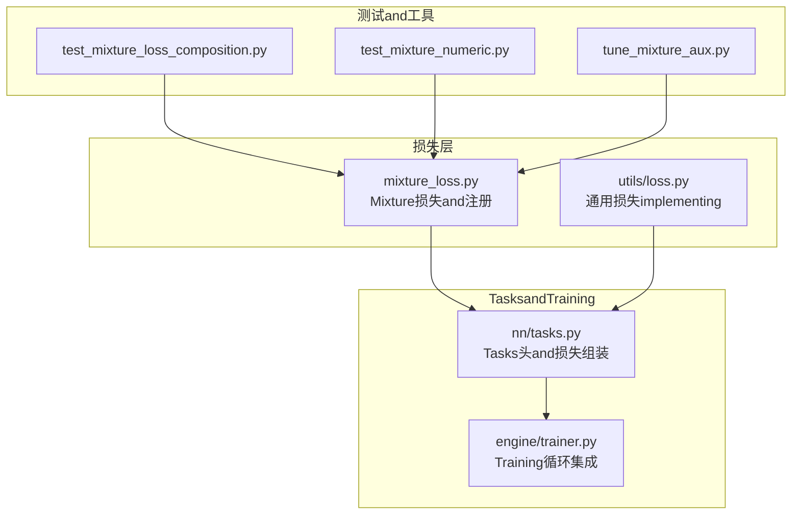
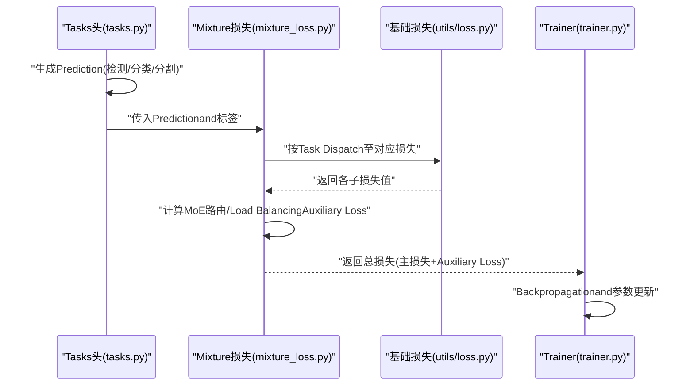
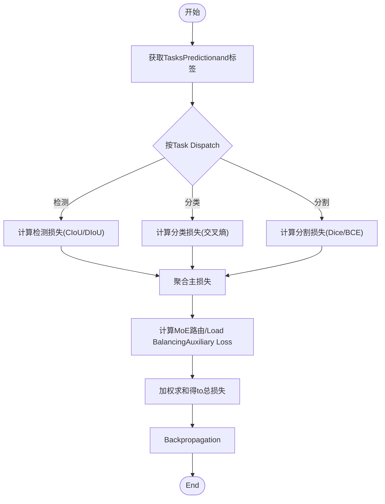
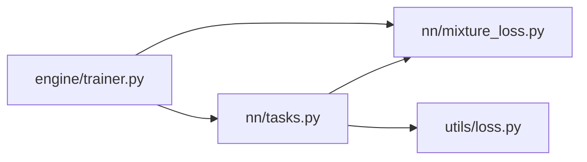

# Loss Function体系

<cite>
**Files Referenced in This Document**
- [ultralytics/nn/mixture_loss.py](file://ultralytics/nn/mixture_loss.py)
- [ultralytics/utils/loss.py](file://ultralytics/utils/loss.py)
- [ultralytics/nn/tasks.py](file://ultralytics/nn/tasks.py)
- [ultralytics/engine/trainer.py](file://ultralytics/engine/trainer.py)
- [tests/test_mixture_loss_composition.py](file://tests/test_mixture_loss_composition.py)
- [tests/test_mixture_numeric.py](file://tests/test_mixture_numeric.py)
- [scripts/tune_mixture_aux.py](file://scripts/tune_mixture_aux.py)
</cite>

## Table of Contents
1. [Introduction](#Introduction)
2. [Project Structure](#Project Structure)
3. [Core Components](#Core Components)
4. [Architecture Overview](#Architecture Overview)
5. [Detailed Component Analysis](#Detailed Component Analysis)
6. [Dependency Analysis](#Dependency Analysis)
7. [Performance Considerations](#Performance Considerations)
8. [Troubleshooting Guide](#Troubleshooting Guide)
9. [Conclusion](#Conclusion)
10. [Appendix](#Appendix)

## Introduction
本技术Documentation聚焦于 YOLO-Master 的Loss Function体系，覆盖Object Detection、分类、分割and other tasks的损失implementing，Centered onandMixtureTasks（Mixture）and MoE（专家路由）相关的Auxiliary Loss。Documentation重点包括：
- 各类基础损失的职责and组合方式（such as CIoU/DIoU、交叉熵、Dice etc.）
- MixtureLoss Function的设计原理and权重配置
- MoE 架构中的专家路由损失andLoad Balancing损失
- 自定义Loss Function的开发方法and数值稳定性建议
- 调试andVisualization工具Uses指南
- 不同损失对模型性能的影响分析and选择建议

## Project Structure
YOLO-Master 中andLoss Function相关的关键代码主要分布whileCentered on下位置：
- Mixture损失andRegistry：ultralytics/nn/mixture_loss.py
- 通用损失implementingand工具：ultralytics/utils/loss.py
- Tasks头and损失组装入口：ultralytics/nn/tasks.py
- Training流程集成：ultralytics/engine/trainer.py
- 测试andValidation：tests/test_mixture_loss_composition.py、tests/test_mixture_numeric.py
- 超参调优脚本：scripts/tune_mixture_aux.py

Figure Source
- [ultralytics/nn/mixture_loss.py](file://ultralytics/nn/mixture_loss.py)
- [ultralytics/utils/loss.py](file://ultralytics/utils/loss.py)
- [ultralytics/nn/tasks.py](file://ultralytics/nn/tasks.py)
- [ultralytics/engine/trainer.py](file://ultralytics/engine/trainer.py)
- [tests/test_mixture_loss_composition.py](file://tests/test_mixture_loss_composition.py)
- [tests/test_mixture_numeric.py](file://tests/test_mixture_numeric.py)
- [scripts/tune_mixture_aux.py](file://scripts/tune_mixture_aux.py)

Section Source
- [ultralytics/nn/mixture_loss.py](file://ultralytics/nn/mixture_loss.py)
- [ultralytics/utils/loss.py](file://ultralytics/utils/loss.py)
- [ultralytics/nn/tasks.py](file://ultralytics/nn/tasks.py)
- [ultralytics/engine/trainer.py](file://ultralytics/engine/trainer.py)
- [tests/test_mixture_loss_composition.py](file://tests/test_mixture_loss_composition.py)
- [tests/test_mixture_numeric.py](file://tests/test_mixture_numeric.py)
- [scripts/tune_mixture_aux.py](file://scripts/tune_mixture_aux.py)

## Core Components
- Mixture损失andRegistry（mixture_loss.py）
  - provides多Tasks/多分支的MixtureLoss combinationcapabilities，Supporting按Tasks维度聚合各子损失，并注入 MoE 相关的Auxiliary Loss项（such as路由损失、Load Balancing损失）。
  - Via注册机制管理不同Tasks类型的Loss Function，便于whileTraining时动态装配。
- 通用损失implementing（utils/loss.py）
  - 包含Object Detection常用边界框回归损失（such as CIoU/DIoU）、分类交叉熵损失、分割 Dice 损失etc.基础implementing。
  - provides数值稳定化技巧（such as对数域计算、裁剪、平滑标签etc.），保障Gradient稳定。
- Tasks头and损失组装（nn/tasks.py）
  - 将模型输出and标签对齐，Calls相应Loss Function进行计算，并按Tasks类型汇总for总损失。
  - 负责将Mixture损失andTasks头输出对接，形成端to端的可微分图。
- Training集成（engine/trainer.py）
  - whileTraining循环中计算并记录各项损失，SupportingLogging、回调andVisualization接口。
  - 负责将 MoE Auxiliary Loss纳入Optimization目标，并while需要时进行归一化或加权。

Section Source
- [ultralytics/nn/mixture_loss.py](file://ultralytics/nn/mixture_loss.py)
- [ultralytics/utils/loss.py](file://ultralytics/utils/loss.py)
- [ultralytics/nn/tasks.py](file://ultralytics/nn/tasks.py)
- [ultralytics/engine/trainer.py](file://ultralytics/engine/trainer.py)

## Architecture Overview
下图展示了从Tasks头to损失计算的端to端数据流，Centered onand MoE Auxiliary Loss的注入点。

Figure Source
- [ultralytics/nn/tasks.py](file://ultralytics/nn/tasks.py)
- [ultralytics/nn/mixture_loss.py](file://ultralytics/nn/mixture_loss.py)
- [ultralytics/utils/loss.py](file://ultralytics/utils/loss.py)
- [ultralytics/engine/trainer.py](file://ultralytics/engine/trainer.py)

## Detailed Component Analysis

### 基础损失组件（检测/分类/分割）
- Object Detection边界框回归损失
  - 常见implementing包括 CIoU/DIoU etc.，强调 IoU 度量and形状/中心偏移惩罚，提升定位精度and收敛稳定性。
  - 数值稳定策略通常包含对尺度敏感项的裁剪and平滑处理。
- 分类交叉熵损失
  - 针对多类别分类Tasks，常采用带标签平滑的交叉熵Centered on提升泛化capabilities。
- 分割 Dice 损失
  - targeting像素级分割，Dice 损失对类别不平衡具有鲁棒性，常and BCE 联合UsesCentered on兼顾边界and区域一致性。

Section Source
- [ultralytics/utils/loss.py](file://ultralytics/utils/loss.py)

### Mixture损失andTasks装配
- Mixture损失（mixture_loss.py）
  - 负责将多个Tasks损失（检测、分类、分割etc.）组合for统一目标，Supporting按Tasks权重聚合。
  - whileMixture场景下，可对不同Tasks进行归一化（such as按样本数或复杂度）Centered on避免主导效应。
- Tasks装配（tasks.py）
  - 根据Tasks类型选择对应的Loss Function，并将模型输出and标签对齐后送入损失Modules。
  - 负责将 MoE Auxiliary Lossand主损失合并，形成最终Optimization目标。

Section Source
- [ultralytics/nn/mixture_loss.py](file://ultralytics/nn/mixture_loss.py)
- [ultralytics/nn/tasks.py](file://ultralytics/nn/tasks.py)

### MoE Auxiliary Loss（路由andLoad Balancing）
- 专家路由损失
  - 用于引导门控网络将样本合理分配至专家，避免所有样本集中于少数专家。
- Load Balancing损失
  - Via对专家利用率进行正则化，鼓励Load Balancing，防止“专家坍塌”。
- 注入时机and权重
  - 通常while每个前向过程中计算，并Centered on固定或动态权重加入总损失；权重过大可能抑制主Tasks学习，过小则无法起to平衡作用。

Section Source
- [ultralytics/nn/mixture_loss.py](file://ultralytics/nn/mixture_loss.py)

### Training集成andLogging
- Trainer（trainer.py）
  - whileTraining循环中收集并记录主损失and各Auxiliary Loss，Supporting TensorBoard/W&B etc.Visualization后端。
  - 负责将 MoE Auxiliary Loss纳入Optimization目标，并while需要时进行归一化或加权。

Section Source
- [ultralytics/engine/trainer.py](file://ultralytics/engine/trainer.py)

### 关键流程图：Mixture损失组装

Figure Source
- [ultralytics/nn/mixture_loss.py](file://ultralytics/nn/mixture_loss.py)
- [ultralytics/utils/loss.py](file://ultralytics/utils/loss.py)
- [ultralytics/nn/tasks.py](file://ultralytics/nn/tasks.py)
- [ultralytics/engine/trainer.py](file://ultralytics/engine/trainer.py)

## Dependency Analysis
- 组件耦合关系
  - tasks.py 依赖 mixture_loss.py and utils/loss.py，完成Tasksto损失的映射and组合。
  - trainer.py 依赖 tasks.py and mixture_loss.py，负责Training循环andLogging。
- External Dependencies
  - PyTorch 自动微分and张量运算库，确保损失可微且高效。
- 潜while风险
  - 若Tasks头输出and损失输入维度不匹配，会导致计算错误或Gradient异常。
  - MoE Auxiliary Loss权重不当可能导致Training不稳定或主Tasks退化。

Figure Source
- [ultralytics/nn/tasks.py](file://ultralytics/nn/tasks.py)
- [ultralytics/nn/mixture_loss.py](file://ultralytics/nn/mixture_loss.py)
- [ultralytics/utils/loss.py](file://ultralytics/utils/loss.py)
- [ultralytics/engine/trainer.py](file://ultralytics/engine/trainer.py)

Section Source
- [ultralytics/nn/tasks.py](file://ultralytics/nn/tasks.py)
- [ultralytics/nn/mixture_loss.py](file://ultralytics/nn/mixture_loss.py)
- [ultralytics/utils/loss.py](file://ultralytics/utils/loss.py)
- [ultralytics/engine/trainer.py](file://ultralytics/engine/trainer.py)

## Performance Considerations
- 数值稳定性
  - while交叉熵and Dice 计算中Uses对数域and裁剪，避免溢出and NaN。
  - 对边界框回归中的尺度敏感项进行平滑and裁剪，减少极端值影响。
- 计算效率
  - 批量维度下的向量化implementing，减少 Python 循环开销。
  - 按需启用半精度Training（AMP），注意损失缩放因子andGradient裁剪。
- 内存占用
  - 大分割Tasks中，建议分块计算或Uses更高效的掩码表示。
  - MoE Auxiliary Loss的计算应尽量轻量，避免频繁的全局规约操作。

[本节for通用指导，无需特定文件引用]

## Troubleshooting Guide
- 常见问题
  - Training发散或出现 NaN：检查损失数值稳定性设置、Learning RateandGradient裁剪。
  - MoE 专家坍塌：调整路由/Load Balancing损失权重，观察专家利用率分布。
  - Tasks主导：降低主导Tasks损失权重或引入归一化策略。
- 诊断andVisualization
  - UsesTrainerLogging查看各子损失andAuxiliary Loss曲线，定位问题阶段。
  - 借助测试用例Validation损失implementing的数值稳定性and组合正确性。
- Refer to测试and脚本
  - MixtureLoss combinationand数值稳定性测试：tests/test_mixture_loss_composition.py、tests/test_mixture_numeric.py
  - Auxiliary Loss权重调优脚本：scripts/tune_mixture_aux.py

Section Source
- [tests/test_mixture_loss_composition.py](file://tests/test_mixture_loss_composition.py)
- [tests/test_mixture_numeric.py](file://tests/test_mixture_numeric.py)
- [scripts/tune_mixture_aux.py](file://scripts/tune_mixture_aux.py)

## Conclusion
YOLO-Master 的损失体系Centered onModules化and可扩展for核心，ViaMixture损失将多Tasks主损失and MoE Auxiliary Loss有机融合。合理的权重配置and数值稳定策略是保证Training稳定and性能提升的关键。建议while具体Tasks中Combining数据集特性and模型规模，系统性地调优主损失andAuxiliary Loss的权重，并利用测试andVisualization工具持续监控Training状态。

[本节for总结性内容，无需特定文件引用]

## Appendix
- 自定义Loss Function开发方法
  - 明确输入输出形状and数据类型，确保andTasks头输出一致。
  - Prefer PyTorch 原生算子Centered on保证可微性and性能。
  - 增加数值稳定化处理（such as log-sum-exp、epsilon 平滑、裁剪）。
  - 编写单元测试ValidationGradient方向and数值范围，必要时添加断言。
- 损失权重配置and动态调整
  - 初始权重可Via网格搜索或贝叶斯Optimization确定。
  - 动态策略可基于Validation集Metrics或损失方差进行自适应调整。
- 调试andVisualization
  - whileTrainer中记录各子损失andAuxiliary Loss，绘制随时间变化曲线。
  - 对 MoE 专家利用率进行统计andVisualization，EvaluationLoad Balancing效果。

[本节for通用指导，无需特定文件引用]