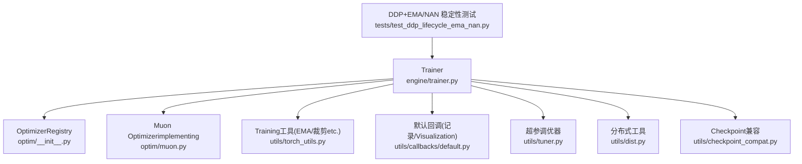
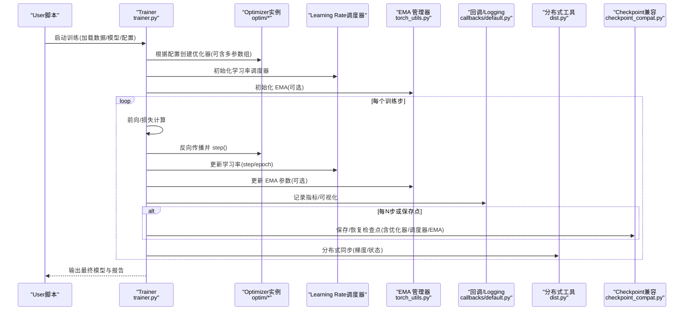
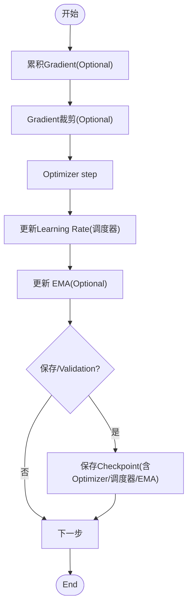
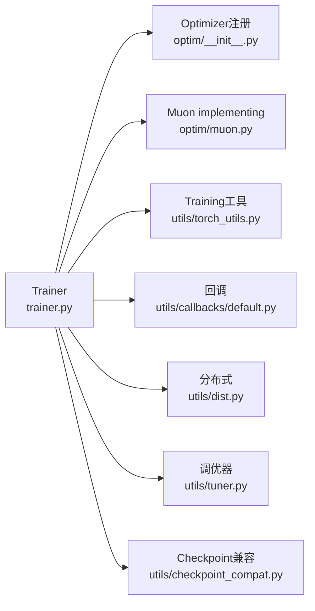

# Optimization策略and调度

<cite>
**Files Referenced in This Document**
- [ultralytics/engine/trainer.py](file://ultralytics/engine/trainer.py)
- [ultralytics/optim/__init__.py](file://ultralytics/optim/__init__.py)
- [ultralytics/optim/muon.py](file://ultralytics/optim/muon.py)
- [ultralytics/utils/torch_utils.py](file://ultralytics/utils/torch_utils.py)
- [ultralytics/utils/callbacks/default.py](file://ultralytics/utils/callbacks/default.py)
- [ultralytics/utils/tuner.py](file://ultralytics/utils/tuner.py)
- [ultralytics/utils/dist.py](file://ultralytics/utils/dist.py)
- [ultralytics/utils/checkpoint_compat.py](file://ultralytics/utils/checkpoint_compat.py)
- [tests/test_ddp_lifecycle_ema_nan.py](file://tests/test_ddp_lifecycle_ema_nan.py)
</cite>

## Table of Contents
1. [Introduction](#Introduction)
2. [Project Structure](#Project Structure)
3. [Core Components](#Core Components)
4. [Architecture Overview](#Architecture Overview)
5. [Detailed Component Analysis](#Detailed Component Analysis)
6. [Dependency Analysis](#Dependency Analysis)
7. [性能考量](#性能考量)
8. [Troubleshooting Guide](#Troubleshooting Guide)
9. [Conclusion](#Conclusion)
10. [Appendix](#Appendix)

## Introduction
本技术Documentation聚焦于 YOLO-Master 的Optimization策略andLearning Rate调度系统，覆盖Centered on下主题：
- Supporting的Optimizer类型（SGD、AdamW、Muon etc.）and其Applicable Scenarios
- Learning Rate调度策略（余弦退火、多项式衰减、步进衰减etc.）的implementingand配置
- Training稳定化技术：Gradient累积、Gradient裁剪、EMA（指数移动平均）
- 超参数自动调优系统的集成andUses方法
- Distributed Training中的Optimization差异and注意事项
- 收敛性分析and调优最佳实践

## Project Structure
围绕Optimizationand调度相关的关键代码主要分布whileCentered on下Modules：
- Optimizer注册and选择：ultralytics/optim
- Training主循环andOptimizer/调度器装配：ultralytics/engine/trainer.py
- Training工具and辅助函数（含 EMA、Gradient裁剪etc.）：ultralytics/utils/torch_utils.py
- 回调体系（记录Logging、Visualizationetc.）：ultralytics/utils/callbacks/default.py
- 超参搜索and调优：ultralytics/utils/tuner.py
- 分布式通信and一致性保障：ultralytics/utils/dist.py
- Checkpoint兼容性and恢复：ultralytics/utils/checkpoint_compat.py
- DDP 生命周期and EMA/NAN 稳定性测试：tests/test_ddp_lifecycle_ema_nan.py

Figure Source
- [ultralytics/engine/trainer.py](file://ultralytics/engine/trainer.py)
- [ultralytics/optim/__init__.py](file://ultralytics/optim/__init__.py)
- [ultralytics/optim/muon.py](file://ultralytics/optim/muon.py)
- [ultralytics/utils/torch_utils.py](file://ultralytics/utils/torch_utils.py)
- [ultralytics/utils/callbacks/default.py](file://ultralytics/utils/callbacks/default.py)
- [ultralytics/utils/tuner.py](file://ultralytics/utils/tuner.py)
- [ultralytics/utils/dist.py](file://ultralytics/utils/dist.py)
- [ultralytics/utils/checkpoint_compat.py](file://ultralytics/utils/checkpoint_compat.py)
- [tests/test_ddp_lifecycle_ema_nan.py](file://tests/test_ddp_lifecycle_ema_nan.py)

Section Source
- [ultralytics/engine/trainer.py](file://ultralytics/engine/trainer.py)
- [ultralytics/optim/__init__.py](file://ultralytics/optim/__init__.py)
- [ultralytics/optim/muon.py](file://ultralytics/optim/muon.py)
- [ultralytics/utils/torch_utils.py](file://ultralytics/utils/torch_utils.py)
- [ultralytics/utils/callbacks/default.py](file://ultralytics/utils/callbacks/default.py)
- [ultralytics/utils/tuner.py](file://ultralytics/utils/tuner.py)
- [ultralytics/utils/dist.py](file://ultralytics/utils/dist.py)
- [ultralytics/utils/checkpoint_compat.py](file://ultralytics/utils/checkpoint_compat.py)
- [tests/test_ddp_lifecycle_ema_nan.py](file://tests/test_ddp_lifecycle_ema_nan.py)

## Core Components
- Optimizer注册and选择
  - through a unified注册机制暴露 SGD、AdamW、Muon etc.Optimizer，供Trainer按配置创建。
  - Supportingfor不同参数组设置不同的Learning Rateand权重衰减，便于对主干/Detection Head进行差异化更新。
- Learning Rate调度器
  - provides多种Built-in调度策略（such as余弦退火、多项式衰减、步进衰减），whileTraining主循环中按步或按轮次更新Learning Rate。
- Training稳定化
  - EMA：维护模型参数的指数移动平均，常用于ValidationandExportCentered on获得更稳定的泛化性能。
  - Gradient裁剪：防止Gradient爆炸，提升大模型Training的数值稳定性。
  - Gradient累积：while显存受限情况下模拟更大批大小，改善收敛平滑度。
- 超参自动调优
  - 基于 Ray Tune 或其他后端，对关键超参（Learning Rate、权重衰减、调度器参数etc.）进行搜索andEvaluation。
- Distributed Training适配
  - while DDP 环境下确保Optimizer状态、调度器状态and EMA 的一致性；处理跨进程同步and容错。

Section Source
- [ultralytics/optim/__init__.py](file://ultralytics/optim/__init__.py)
- [ultralytics/optim/muon.py](file://ultralytics/optim/muon.py)
- [ultralytics/engine/trainer.py](file://ultralytics/engine/trainer.py)
- [ultralytics/utils/torch_utils.py](file://ultralytics/utils/torch_utils.py)
- [ultralytics/utils/tuner.py](file://ultralytics/utils/tuner.py)
- [ultralytics/utils/dist.py](file://ultralytics/utils/dist.py)

## Architecture Overview
下图展示了Training过程中Optimizer、调度器、EMA and分布式组件之间的交互关系。

Figure Source
- [ultralytics/engine/trainer.py](file://ultralytics/engine/trainer.py)
- [ultralytics/optim/__init__.py](file://ultralytics/optim/__init__.py)
- [ultralytics/optim/muon.py](file://ultralytics/optim/muon.py)
- [ultralytics/utils/torch_utils.py](file://ultralytics/utils/torch_utils.py)
- [ultralytics/utils/callbacks/default.py](file://ultralytics/utils/callbacks/default.py)
- [ultralytics/utils/dist.py](file://ultralytics/utils/dist.py)
- [ultralytics/utils/checkpoint_compat.py](file://ultralytics/utils/checkpoint_compat.py)

## Detailed Component Analysis

### Optimizer类型andApplicable Scenarios
- SGD
  - 特点：简单、内存占用低、while某些Tasks上具备良好泛化capabilities。
  - 适用：小数据集、需要强正则化的场景、资源受限环境。
  - 建议：Combined with动量and权重衰减Uses；Learning Rate需精细调节。
- AdamW
  - 特点：自适应Learning Rate、对初始Learning Rate相对鲁棒、收敛较快。
  - 适用：通用Object Detection/分割Tasks、大规模数据、预Training微调。
  - 建议：Set appropriately权重衰减and beta 参数；Combining余弦退火或线性预热。
- Muon
  - 特点：新型Optimizer，针对特定网络结构或Tasks可能具有更好的收敛特性。
  - 适用：实验性探索、特定Tasks/架构下的性能对比。
  - 建议：作for基线之外的补充方案，关注其数值稳定性and显存开销。

Section Source
- [ultralytics/optim/__init__.py](file://ultralytics/optim/__init__.py)
- [ultralytics/optim/muon.py](file://ultralytics/optim/muon.py)

### Learning Rate调度策略
- 余弦退火
  - 行for：Learning Rate随Training进度按余弦曲线平滑下降，利于后期精细收敛。
  - 配置要点：最大步数/轮数、最小Learning Rate、是否包含预热阶段。
- 多项式衰减
  - 行for：按幂函数形式逐步降低Learning Rate，适合长周期Training。
  - 配置要点：幂次、起止Learning Rate、总步数。
- 步进衰减
  - 行for：while指定步数点按比例降低Learning Rate，易于理解and调试。
  - 配置要点：衰减因子、衰减步点列表。
- 组合策略
  - 常见做法：先线性预热再进入余弦退火或多项式衰减，兼顾前期稳定and后期收敛。

Section Source
- [ultralytics/engine/trainer.py](file://ultralytics/engine/trainer.py)

### Training稳定化技术
- Gradient累积
  - 目的：while单卡显存不足时模拟更大批大小，提升收敛稳定性。
  - 用法：累计若干步后再执行一次Optimizer step and清零Gradient。
- Gradient裁剪
  - 目的：限制Gradient范数上限，避免Gradient爆炸导致Training崩溃。
  - 用法：whileBackpropagation后、Optimizer step 前对Gradient进行裁剪。
- EMA（指数移动平均）
  - 目的：维护模型参数的滑动平均，提高ValidationandExport模型的稳定性and泛化。
  - 用法：按固定频率更新 EMA 参数；Validation/Export时Uses EMA 权重。

Figure Source
- [ultralytics/engine/trainer.py](file://ultralytics/engine/trainer.py)
- [ultralytics/utils/torch_utils.py](file://ultralytics/utils/torch_utils.py)

Section Source
- [ultralytics/engine/trainer.py](file://ultralytics/engine/trainer.py)
- [ultralytics/utils/torch_utils.py](file://ultralytics/utils/torch_utils.py)

### 超参数自动调优系统
- 集成方式
  - ViaUnified Interface定义搜索空间（Learning Rate、权重衰减、调度器参数、批大小etc.）。
  - Trainerand调优器协作：每次采样一组超参，运行Training并返回EvaluationMetrics。
- 常用后端
  - Ray Tune：Supporting并行搜索、早停、结果聚合。
- Uses流程
  - 定义搜索空间andEvaluationMetrics
  - 启动调优Tasks
  - 监控运行、查看最优配置and报告

Section Source
- [ultralytics/utils/tuner.py](file://ultralytics/utils/tuner.py)
- [ultralytics/utils/callbacks/default.py](file://ultralytics/utils/callbacks/default.py)

### Distributed Training中的Optimization差异and注意事项
- Optimizer状态同步
  - while多进程环境下，确保Optimizer内部状态（such as动量、二阶矩估计）一致。
- Learning Rateand批大小缩放
  - 当全局批大小变化时，按线性规则调整Learning Rate；注意调度器的总步数换算。
- EMA andCheckpoint
  - while分布式环境中保存/恢复 EMA andOptimizer/调度器状态，保证断点续训一致性。
- 数值稳定性
  - while AMP andMixture精度下，关注 NaN/Inf 的检测and回退策略。

Section Source
- [ultralytics/utils/dist.py](file://ultralytics/utils/dist.py)
- [ultralytics/utils/checkpoint_compat.py](file://ultralytics/utils/checkpoint_compat.py)
- [tests/test_ddp_lifecycle_ema_nan.py](file://tests/test_ddp_lifecycle_ema_nan.py)

## Dependency Analysis
- 耦合and内聚
  - Trainer集中编排Optimizer、调度器、EMA and回调，内聚度高。
  - Optimizerand调度器解耦，便于替换and扩展。
- External Dependencies
  - PyTorch Optimizerand调度器接口
  - Ray Tune（Optional）用于超参搜索
  - 分布式通信库（NCCL/ gloo etc.）由 dist ModulesEncapsulates
- Potential Cycles依赖
  - 当前结构未见明显循环导入；Trainer依赖工具Modules，工具Modules不反向依赖Trainer。

Figure Source
- [ultralytics/engine/trainer.py](file://ultralytics/engine/trainer.py)
- [ultralytics/optim/__init__.py](file://ultralytics/optim/__init__.py)
- [ultralytics/optim/muon.py](file://ultralytics/optim/muon.py)
- [ultralytics/utils/torch_utils.py](file://ultralytics/utils/torch_utils.py)
- [ultralytics/utils/callbacks/default.py](file://ultralytics/utils/callbacks/default.py)
- [ultralytics/utils/tuner.py](file://ultralytics/utils/tuner.py)
- [ultralytics/utils/dist.py](file://ultralytics/utils/dist.py)
- [ultralytics/utils/checkpoint_compat.py](file://ultralytics/utils/checkpoint_compat.py)

Section Source
- [ultralytics/engine/trainer.py](file://ultralytics/engine/trainer.py)
- [ultralytics/optim/__init__.py](file://ultralytics/optim/__init__.py)
- [ultralytics/optim/muon.py](file://ultralytics/optim/muon.py)
- [ultralytics/utils/torch_utils.py](file://ultralytics/utils/torch_utils.py)
- [ultralytics/utils/callbacks/default.py](file://ultralytics/utils/callbacks/default.py)
- [ultralytics/utils/tuner.py](file://ultralytics/utils/tuner.py)
- [ultralytics/utils/dist.py](file://ultralytics/utils/dist.py)
- [ultralytics/utils/checkpoint_compat.py](file://ultralytics/utils/checkpoint_compat.py)

## 性能考量
- 批大小andLearning Rate
  - 增大批大小通常允许更高Learning Rate；遵循线性缩放规则并Combining预热and退火。
- Optimizer选择
  - AdamW while大多数视觉Tasks中表现稳健；SGD while特定场景下泛化更好；Muon 可作for实验选项。
- 数值稳定性
  - 启用Gradient裁剪and EMA；while AMP 下监控Gradient范数and损失值，If necessary, fall back to FP32。
- I/O and缓存
  - Set appropriatelyData Loading线程and缓存，减少Trainingbottlenecks；避免while GPU 上进行 CPU 密集操作。
- 分布式效率
  - 控制通信频率，合并保存/Logging操作；确保各进程Load Balancing。

[本节for通用指导，无需具体文件引用]

## Troubleshooting Guide
- Training发散或 NaN
  - 检查Learning Rate是否过大、是否启用预热；确认Gradient裁剪阈值；观察 AMP 下的数值溢出。
  - Refer to分布式and EMA/NAN 稳定性测试用例Centered on定位问题路径。
- 收敛缓慢
  - 尝试更换Optimizer（such as从 SGD 切换to AdamW）；调整调度器（余弦退火/多项式衰减）；增加预热步数。
- 显存不足
  - 启用Gradient累积；减小批大小；关闭不必要的LoggingandVisualization；Uses更高效的Optimizer。
- 断点续训不一致
  - 确认Checkpoint中包含Optimizer、调度器and EMA 状态；UsesCheckpoint兼容Modules进行版本Migration。

Section Source
- [tests/test_ddp_lifecycle_ema_nan.py](file://tests/test_ddp_lifecycle_ema_nan.py)
- [ultralytics/utils/checkpoint_compat.py](file://ultralytics/utils/checkpoint_compat.py)
- [ultralytics/utils/torch_utils.py](file://ultralytics/utils/torch_utils.py)
- [ultralytics/engine/trainer.py](file://ultralytics/engine/trainer.py)

## Conclusion
YOLO-Master 的Optimizationand调度系统provides了灵活的Optimizer选择、丰富的Learning Rate调度策略Centered onand完善的Training稳定化手段。Via合理的超参搜索and分布式适配，可while不同规模and硬件条件下获得稳定且高效的Training效果。实践中建议Centered on AdamW + 余弦退火for基线，辅Centered onGradient裁剪and EMA，并while资源受限时采用Gradient累积and批量缩放策略。

[本节for总结性内容，无需具体文件引用]

## Appendix
- 快速上手建议
  - 基线配置：AdamW、余弦退火、预热 5%-10%、Gradient裁剪 1.0、EMA 0.9999。
  - 分布式：按全局批大小线性缩放Learning Rate；确保Checkpoint包含完整状态。
  - 调优：优先搜索Learning Rate、权重衰减and调度器参数；其次考虑Optimizerand批大小。

[本节for补充信息，无需具体文件引用]