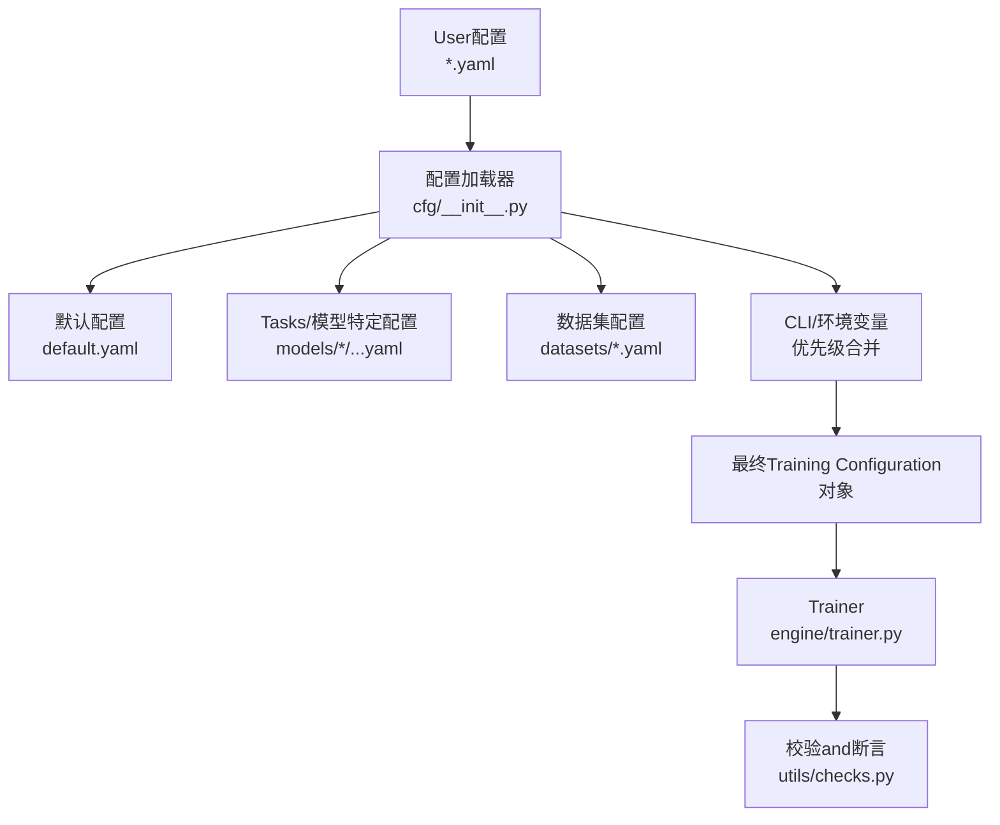
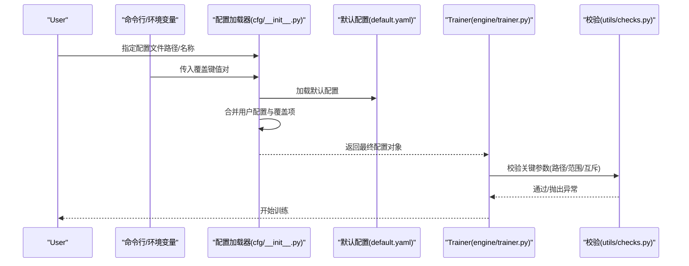
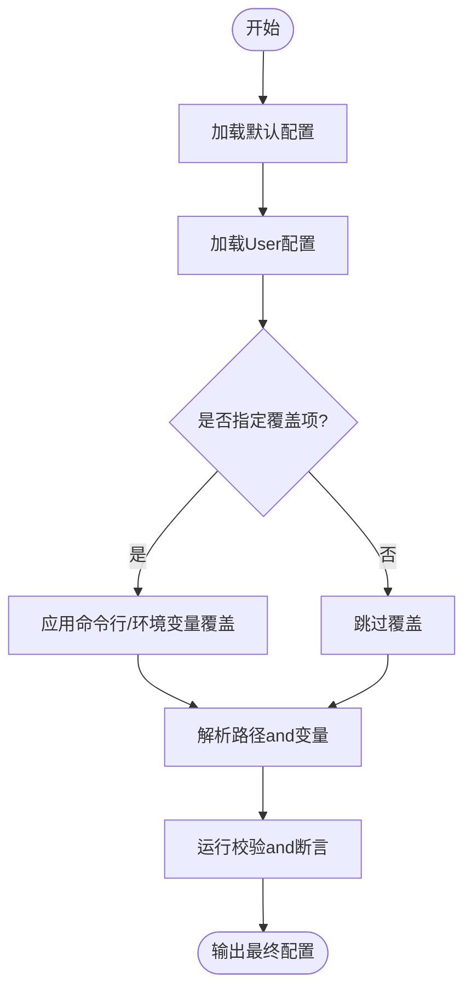
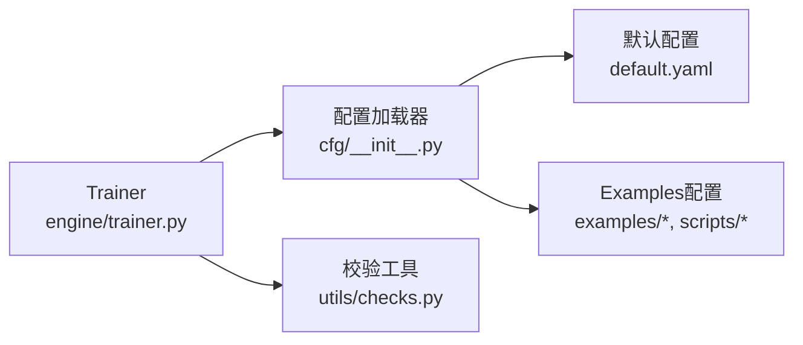

# Training Configuration管理

<cite>
**Files Referenced in This Document**
- [ultralytics/cfg/default.yaml](file://ultralytics/cfg/default.yaml)
- [ultralytics/cfg/__init__.py](file://ultralytics/cfg/__init__.py)
- [ultralytics/engine/trainer.py](file://ultralytics/engine/trainer.py)
- [ultralytics/utils/checks.py](file://ultralytics/utils/checks.py)
- [examples/mini-detect/mini_detect.yaml](file://examples/mini-detect/mini_detect.yaml)
- [scripts/coco2017.yaml](file://scripts/coco2017.yaml)
- [scripts/_voc_local.yaml](file://scripts/_voc_local.yaml)
- [scripts/VOC_sub.yaml](file://scripts/VOC_sub.yaml)
- [tests/test_default_config_integrity.py](file://tests/test_default_config_integrity.py)
- [tests/test_mixture_config_resolution.py](file://tests/test_mixture_config_resolution.py)
- [tests/test_master_model_configs.py](file://tests/test_master_model_configs.py)
</cite>

## Table of Contents
1. [Introduction](#Introduction)
2. [Project Structure](#Project Structure)
3. [Core Components](#Core Components)
4. [Architecture Overview](#Architecture Overview)
5. [Detailed Component Analysis](#Detailed Component Analysis)
6. [Dependency Analysis](#Dependency Analysis)
7. [性能考量](#性能考量)
8. [Troubleshooting Guide](#Troubleshooting Guide)
9. [Conclusion](#Conclusion)
10. [Appendix](#Appendix)

## Introduction
本文件targetingYOLO-Master的Training Configuration管理系统，系统性说明YAML配置文件的结构and语法、Training参数含义and默认值范围、继承and覆盖机制、不同Tasks类型的专用选项、环境变量and命令行参数的优先级规则、模板and最佳实践、配置Validationand错误检查机制，Centered onandMigrationand版本兼容性管理建议。目标是帮助读者快速上手并安全地扩展配置体系。

## Project Structure
Training Configuration相关的关键位置：
- 默认配置andExportcapabilities矩阵：ultralytics/cfg/default.yaml、ultralytics/cfg/export-capability-matrix.yaml
- 配置加载and解析入口：ultralytics/cfg/__init__.py
- Training流程对配置的读取and合并：ultralytics/engine/trainer.py
- 配置校验and通用检查工具：ultralytics/utils/checks.py
- Examples数据集配置（检测）：examples/mini-detect/mini_detect.yaml
- Examples数据集配置（COCO/VOCetc.）：scripts/coco2017.yaml、scripts/_voc_local.yaml、scripts/VOC_sub.yaml
- 配置完整性and解析测试：tests/test_default_config_integrity.py、tests/test_mixture_config_resolution.py、tests/test_master_model_configs.py

Figure Source
- [ultralytics/cfg/__init__.py](file://ultralytics/cfg/__init__.py)
- [ultralytics/cfg/default.yaml](file://ultralytics/cfg/default.yaml)
- [ultralytics/engine/trainer.py](file://ultralytics/engine/trainer.py)
- [ultralytics/utils/checks.py](file://ultralytics/utils/checks.py)

Section Source
- [ultralytics/cfg/default.yaml](file://ultralytics/cfg/default.yaml)
- [ultralytics/cfg/__init__.py](file://ultralytics/cfg/__init__.py)
- [ultralytics/engine/trainer.py](file://ultralytics/engine/trainer.py)
- [ultralytics/utils/checks.py](file://ultralytics/utils/checks.py)
- [examples/mini-detect/mini_detect.yaml](file://examples/mini-detect/mini_detect.yaml)
- [scripts/coco2017.yaml](file://scripts/coco2017.yaml)
- [scripts/_voc_local.yaml](file://scripts/_voc_local.yaml)
- [scripts/VOC_sub.yaml](file://scripts/VOC_sub.yaml)

## Core Components
- 配置加载器（cfg/__init__.py）
  - 负责读取YAML、合并默认配置、处理继承and覆盖、解析路径and环境变量、返回统一配置对象供TrainerUses。
- 默认配置（default.yaml）
  - provides全局默认超参、数据路径占位符、LoggingandExport开关etc.基础项。
- Trainer（engine/trainer.py）
  - while初始化时消费配置对象，构建Data Loading器、Optimizer、Loss Function、回调etc.；对关键参数进行二次校验and适配。
- 校验工具（utils/checks.py）
  - provides类型、范围、互斥性、存while性etc.通用校验逻辑，被Trainer或配置层CallsCentered on尽早报错。
- Examples数据集配置
  - mini_detect.yaml、coco2017.yaml、_voc_local.yaml、VOC_sub.yaml 展示了不同Tasks/数据集的组织方式and字段约定。

Section Source
- [ultralytics/cfg/__init__.py](file://ultralytics/cfg/__init__.py)
- [ultralytics/cfg/default.yaml](file://ultralytics/cfg/default.yaml)
- [ultralytics/engine/trainer.py](file://ultralytics/engine/trainer.py)
- [ultralytics/utils/checks.py](file://ultralytics/utils/checks.py)
- [examples/mini-detect/mini_detect.yaml](file://examples/mini-detect/mini_detect.yaml)
- [scripts/coco2017.yaml](file://scripts/coco2017.yaml)
- [scripts/_voc_local.yaml](file://scripts/_voc_local.yaml)
- [scripts/VOC_sub.yaml](file://scripts/VOC_sub.yaml)

## Architecture Overview
下图展示从“User配置”to“Training执行”的端to端流程，包括继承、覆盖、校验and最终配置对象的生成。

Figure Source
- [ultralytics/cfg/__init__.py](file://ultralytics/cfg/__init__.py)
- [ultralytics/cfg/default.yaml](file://ultralytics/cfg/default.yaml)
- [ultralytics/engine/trainer.py](file://ultralytics/engine/trainer.py)
- [ultralytics/utils/checks.py](file://ultralytics/utils/checks.py)

## Detailed Component Analysis

### YAML配置结构and语法规范
- 基本语法
  - 采用标准YAML键值对and嵌套字典；Supporting列表、布尔、数值、字符串and路径引用。
  - Supporting相对路径and绝对路径；路径可包含环境变量占位符（由加载器解析）。
- 常见顶层键（Examples）
  - 数据相关：数据集根路径、Training/Validation集划分、类别名映射etc.（Refer toExamples数据集配置）。
  - Training相关：Learning Rate、Batch Size、轮数、Optimizer、调度器、增强策略、保存策略etc.（Refer to默认配置andTrainer消费逻辑）。
  - Tasks相关：检测/分割/Pose Estimationand other tasks的头配置、损失权重、Post-Processing阈值etc.（随Tasks类型变化）。
- 推荐组织方式
  - 将“数据定义”and“Training超参”分离for独立YAML，便于复用and组合。
  - Uses“基线配置 + 覆盖配置”的方式管理多实验。

Section Source
- [ultralytics/cfg/default.yaml](file://ultralytics/cfg/default.yaml)
- [examples/mini-detect/mini_detect.yaml](file://examples/mini-detect/mini_detect.yaml)
- [scripts/coco2017.yaml](file://scripts/coco2017.yaml)
- [scripts/_voc_local.yaml](file://scripts/_voc_local.yaml)
- [scripts/VOC_sub.yaml](file://scripts/VOC_sub.yaml)

### Training参数含义、默认值and推荐范围
- 数据来源
  - 默认值and可用键集合来源于默认配置andTrainer初始化时的参数表。
  - 推荐范围需Combining硬件资源、数据集规模andTasks复杂度综合Evaluation。
- 典型参数类别
  - 数据and预处理：图像尺寸、归一化、增强强度、缓存策略etc.。
  - OptimizationandTraining：Learning Rate、权重衰减、动量、Batch Size、Gradient累积、Mixture精度etc.。
  - 输出and监控：保存间隔、Visualization开关、Logging后端、Metrics记录etc.。
  - Tasks特定：检测NMS阈值、分割掩码阈值、姿态关键点数量and置信度etc.。
- 注意事项
  - 某些参数while不同Tasks下语义不同，需按Tasks选择对应键。
  - 部分参数存while互斥或依赖关系（such asOptimizerand调度器的搭配），由校验逻辑保证一致性。

Section Source
- [ultralytics/cfg/default.yaml](file://ultralytics/cfg/default.yaml)
- [ultralytics/engine/trainer.py](file://ultralytics/engine/trainer.py)
- [ultralytics/utils/checks.py](file://ultralytics/utils/checks.py)

### 配置继承and覆盖机制
- 继承链
  - 默认配置 → User指定配置 → Tasks/模型特定配置 → 数据集配置。
- 覆盖顺序
  - 命令行参数 > 环境变量 > User配置文件 > Tasks/模型默认 > 系统默认。
- 合并策略
  - 深度合并：同层字典递归合并，列表通常整体替换而非拼接。
  - 空值处理：显式设置fornull/None表示删除或禁用某项（取决于具体implementing）。
- 路径解析
  - Supporting相对路径and绝对路径；若含环境变量，会while加载阶段unfold。

Figure Source
- [ultralytics/cfg/__init__.py](file://ultralytics/cfg/__init__.py)
- [ultralytics/utils/checks.py](file://ultralytics/utils/checks.py)

Section Source
- [ultralytics/cfg/__init__.py](file://ultralytics/cfg/__init__.py)
- [ultralytics/utils/checks.py](file://ultralytics/utils/checks.py)

### 不同Tasks类型的专用配置选项
- Object Detection
  - 关注边界框回归损失权重、NMS阈值、正负样本匹配策略etc.。
- Instance Segmentation
  - 增加掩码分支相关超参、IoU阈值、掩码缩放etc.。
- Pose Estimation
  - 关键点数量、热力图分辨率、关键点损失权重、可见性阈值etc.。
- 其他Tasks（such as分类、Tracking、开放世界etc.）
  - 根据Tasks头andLoss Function定制相应键。

Tips：具体键名and行forCentered on各Tasks对应的模型/Trainer Implementationfor准，建议whileExamples配置中对照查看。

Section Source
- [examples/mini-detect/mini_detect.yaml](file://examples/mini-detect/mini_detect.yaml)
- [scripts/coco2017.yaml](file://scripts/coco2017.yaml)
- [scripts/_voc_local.yaml](file://scripts/_voc_local.yaml)
- [scripts/VOC_sub.yaml](file://scripts/VOC_sub.yaml)

### 环境变量and命令行参数的优先级规则
- 优先级从高to低
  - 命令行参数（最高）
  - 环境变量
  - User配置文件
  - Tasks/模型默认配置
  - 系统默认配置（最低）
- 覆盖粒度
  - Supporting点号分隔的深层键覆盖（例such as data.batch_size）。
- 冲突处理
  - 高优先级直接覆盖低优先级同名键；未出现的键沿用低优先级值。

Section Source
- [ultralytics/cfg/__init__.py](file://ultralytics/cfg/__init__.py)

### 配置文件模板and最佳实践
- 模板建议
  - 基线模板：包含常用默认值and注释说明，便于团队共享。
  - Tasks模板：针对检测/分割/姿态etc.provides最小可用配置。
  - 数据集模板：仅包含数据路径and类别信息，供多个TrainingTasks复用。
- 最佳实践
  - Uses“基线 + 覆盖”的管理模式，避免重复定义。
  - 将敏感路径and密钥放入环境变量，不while仓库中硬编码。
  - for每个实验保留独立覆盖文件，便于复现and回溯。
  - while提交前运行配置完整性测试，确保键名and类型正确。

Section Source
- [examples/mini-detect/mini_detect.yaml](file://examples/mini-detect/mini_detect.yaml)
- [scripts/coco2017.yaml](file://scripts/coco2017.yaml)
- [scripts/_voc_local.yaml](file://scripts/_voc_local.yaml)
- [scripts/VOC_sub.yaml](file://scripts/VOC_sub.yaml)

### 配置Validationand错误检查机制
- 校验维度
  - 存while性：必需键是否存while。
  - 类型and范围：数值范围、枚举取值、布尔标志etc.。
  - 互斥and依赖：such asOptimizerand调度器搭配、设备and批大小约束etc.。
  - 路径有效性：数据路径、权重路径、输出Table of Contentsetc.。
- 触发时机
  - 配置加载后立即进行初步校验；Trainer初始化时进行二次校验。
- 错误反馈
  - 明确Tips缺失键、越界值、冲突项and修复建议。

Section Source
- [ultralytics/utils/checks.py](file://ultralytics/utils/checks.py)
- [ultralytics/engine/trainer.py](file://ultralytics/engine/trainer.py)

### 配置Migrationand版本兼容性管理
- 兼容策略
  - 新增键保持向后兼容，旧键保留别名或弃用警告。
  - 破坏性变更ViaMigration脚本或Documentation指引过渡。
- Migration建议
  - Uses差异对比工具定位废弃键and新键映射。
  - whileCI中加入配置Drift Detectionand回归测试。
  - 维护“Migration清单”，记录每版本的键变更and影响面。

Section Source
- [tests/test_default_config_integrity.py](file://tests/test_default_config_integrity.py)
- [tests/test_mixture_config_resolution.py](file://tests/test_mixture_config_resolution.py)
- [tests/test_master_model_configs.py](file://tests/test_master_model_configs.py)

## Dependency Analysis
- Modules耦合
  - 配置加载器依赖默认配置andExamples配置；Trainer依赖配置对象；校验工具被多处复用。
- External Dependencies
  - YAML解析库、路径and文件系统操作、Optional的环境变量解析。
- Potential Cycles依赖
  - 应避免while配置加载过程中反向导入Trainer；当前设计遵循单向依赖。

Figure Source
- [ultralytics/cfg/__init__.py](file://ultralytics/cfg/__init__.py)
- [ultralytics/cfg/default.yaml](file://ultralytics/cfg/default.yaml)
- [ultralytics/engine/trainer.py](file://ultralytics/engine/trainer.py)
- [ultralytics/utils/checks.py](file://ultralytics/utils/checks.py)

Section Source
- [ultralytics/cfg/__init__.py](file://ultralytics/cfg/__init__.py)
- [ultralytics/cfg/default.yaml](file://ultralytics/cfg/default.yaml)
- [ultralytics/engine/trainer.py](file://ultralytics/engine/trainer.py)
- [ultralytics/utils/checks.py](file://ultralytics/utils/checks.py)

## 性能考量
- 批大小and内存
  - 增大批大小可提升吞吐但增加显存占用；需CombiningGPU容量andGradient累积策略调整。
- 数据I/O
  - 启用数据缓存and预取可减少I/Obottlenecks；注意磁盘空间and缓存失效策略。
- Mixture精度and编译
  - 开启Mixture精度可加速Training；while某些平台可Combining编译Optimization进一步提速。
- LoggingandVisualization
  - 高频LoggingandVisualization会拖慢Training，可按步长或轮次采样输出。

[This section provides general guidance and does not directly analyze specific files]

## Troubleshooting Guide
- 常见问题
  - 路径无效：检查数据/权重/输出路径是否正确且可访问。
  - 键名拼写错误：依据校验错误Tips修正。
  - 参数越界：核对默认范围and硬件限制。
  - Tasks不匹配：确认Tasks类型and配置键一致。
- 定位步骤
  - 先运行配置完整性测试，再逐步缩小覆盖范围定位问题。
  - 打印最终配置对象，核对关键键值是否符合预期。
  - 查看Trainer初始化阶段的断言andLogging。

Section Source
- [ultralytics/utils/checks.py](file://ultralytics/utils/checks.py)
- [ultralytics/engine/trainer.py](file://ultralytics/engine/trainer.py)
- [tests/test_default_config_integrity.py](file://tests/test_default_config_integrity.py)

## Conclusion
YOLO-Master的配置管理体系Centered on“默认配置 + User覆盖 + 严格校验”for核心，兼顾易用性and健壮性。Via合理的继承and覆盖策略、清晰的优先级规则and完善的校验机制，User可Centered on高效地for不同Tasksand数据集定制Training Configuration，并while团队协作中保持一致性and可复现性。

## Appendix
- 快速上手清单
  - 准备数据集配置（Refer toExamples）。
  - 复制默认配置并按需覆盖。
  - Uses命令行或环境变量微调关键超参。
  - 运行配置完整性测试and一次小规模TrainingValidation。
- Refer toExamples
  - 检测Tasks：examples/mini-detect/mini_detect.yaml
  - COCO数据集：scripts/coco2017.yaml
  - VOC数据集：scripts/_voc_local.yaml、scripts/VOC_sub.yaml

Section Source
- [examples/mini-detect/mini_detect.yaml](file://examples/mini-detect/mini_detect.yaml)
- [scripts/coco2017.yaml](file://scripts/coco2017.yaml)
- [scripts/_voc_local.yaml](file://scripts/_voc_local.yaml)
- [scripts/VOC_sub.yaml](file://scripts/VOC_sub.yaml)