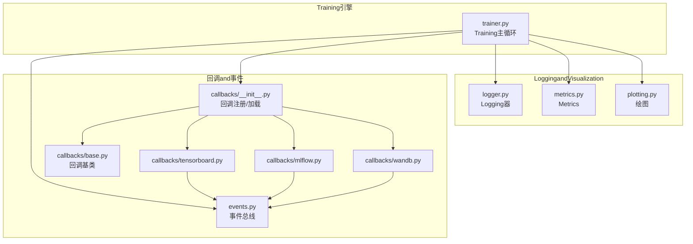
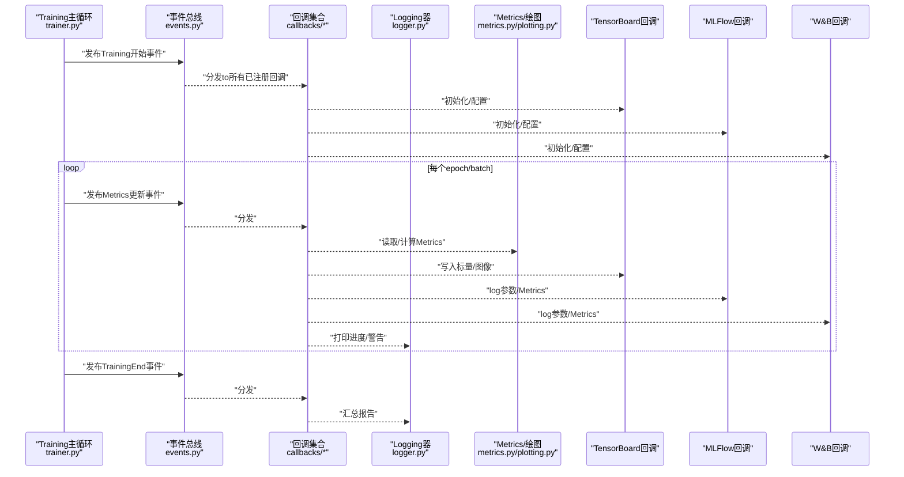
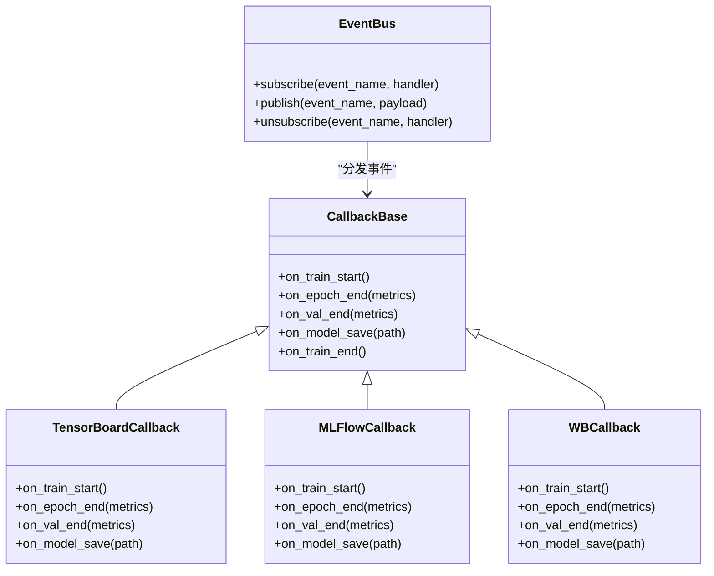
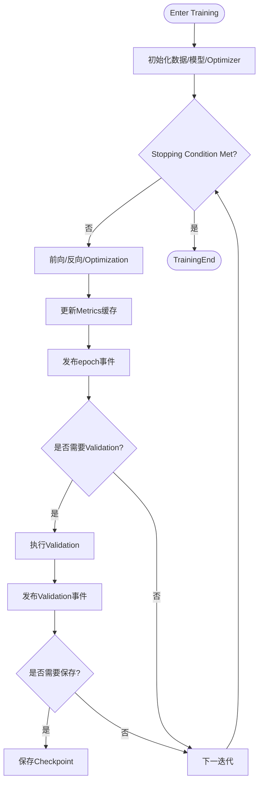
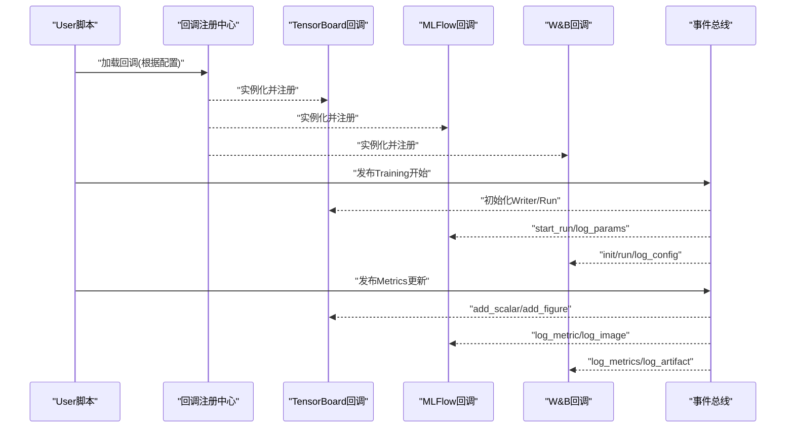
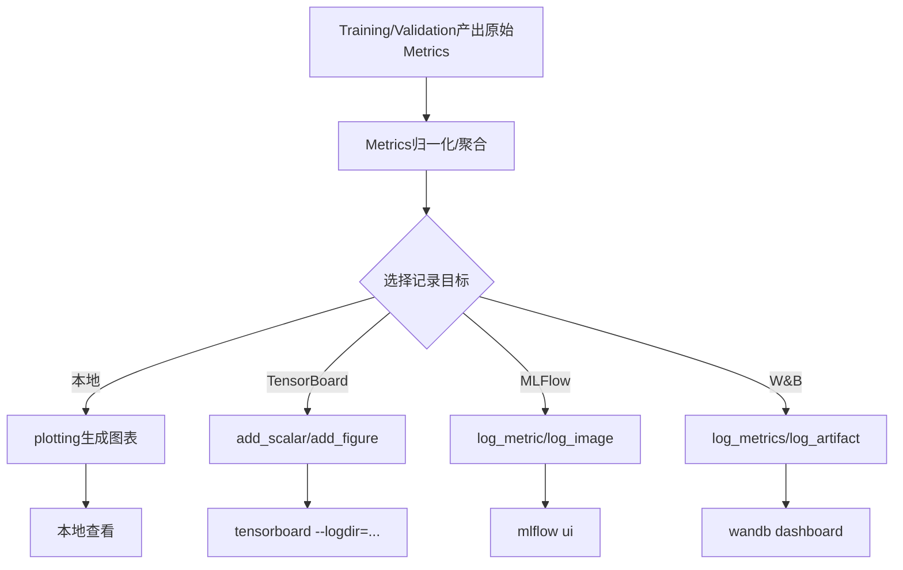
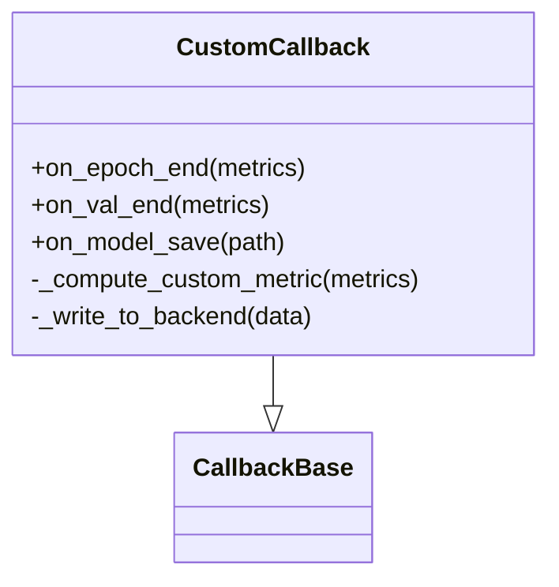
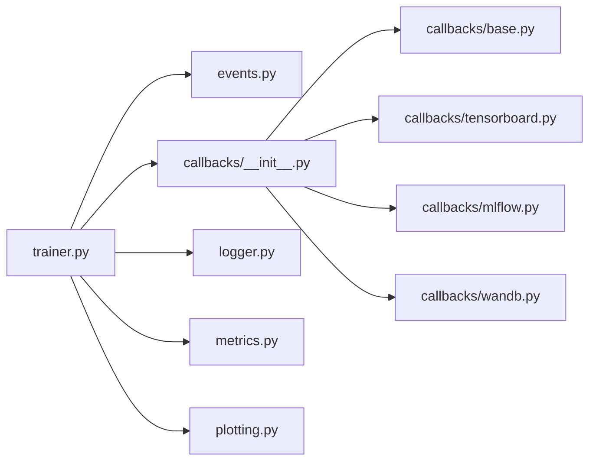

# Training监控andLogging

<cite>
**Files Referenced in This Document**
- [ultralytics/utils/callbacks/__init__.py](file://ultralytics/utils/callbacks/__init__.py)
- [ultralytics/utils/callbacks/base.py](file://ultralytics/utils/callbacks/base.py)
- [ultralytics/utils/callbacks/tensorboard.py](file://ultralytics/utils/callbacks/tensorboard.py)
- [ultralytics/utils/callbacks/mlflow.py](file://ultralytics/utils/callbacks/mlflow.py)
- [ultralytics/utils/callbacks/wandb.py](file://ultralytics/utils/callbacks/wandb.py)
- [ultralytics/utils/logger.py](file://ultralytics/utils/logger.py)
- [ultralytics/utils/events.py](file://ultralytics/utils/events.py)
- [ultralytics/engine/trainer.py](file://ultralytics/engine/trainer.py)
- [ultralytics/utils/plotting.py](file://ultralytics/utils/plotting.py)
- [ultralytics/utils/metrics.py](file://ultralytics/utils/metrics.py)
- [docs/en/integrations/tensorboard.md](file://docs/en/integrations/tensorboard.md)
- [docs/en/integrations/mlflow.md](file://docs/en/integrations/mlflow.md)
- [docs/en/integrations/weights-biases.md](file://docs/en/integrations/weights-biases.md)
</cite>

## Table of Contents
1. [Introduction](#Introduction)
2. [Project Structure](#Project Structure)
3. [Core Components](#Core Components)
4. [Architecture Overview](#Architecture Overview)
5. [Detailed Component Analysis](#Detailed Component Analysis)
6. [Dependency Analysis](#Dependency Analysis)
7. [性能考量](#性能考量)
8. [Troubleshooting Guide](#Troubleshooting Guide)
9. [Conclusion](#Conclusion)
10. [Appendix](#Appendix)

## Introduction
本文件targetingYOLO-Master的Training监控andLogging系统，系统性阐述回调机制、事件总线、实验Tracking集成（TensorBoard、MLFlow、Weights & Biases）、Metrics记录andVisualization、Logging结构and解析方法、自定义监控Metrics开发、调试and诊断工具Uses，Centered onand大规模Training项目的监控最佳实践。DocumentationCentered on代码级implementingfor依据，provides可追溯的源码路径and图示，帮助读者快速定位并扩展监控capabilities。

## Project Structure
Training监控andLogging相关代码主要分布whileCentered on下Modules：
- 回调框架andBuilt-in回调：ultralytics/utils/callbacks/*
- 事件总线and通用事件：ultralytics/utils/events.py
- Training主循环and回调调度：ultralytics/engine/trainer.py
- Logging器and输出：ultralytics/utils/logger.py
- Metrics计算and绘图：ultralytics/utils/metrics.py、ultralytics/utils/plotting.py
- 集成Documentation：docs/en/integrations/*

Figure Source
- [ultralytics/engine/trainer.py](file://ultralytics/engine/trainer.py)
- [ultralytics/utils/events.py](file://ultralytics/utils/events.py)
- [ultralytics/utils/callbacks/__init__.py](file://ultralytics/utils/callbacks/__init__.py)
- [ultralytics/utils/callbacks/base.py](file://ultralytics/utils/callbacks/base.py)
- [ultralytics/utils/callbacks/tensorboard.py](file://ultralytics/utils/callbacks/tensorboard.py)
- [ultralytics/utils/callbacks/mlflow.py](file://ultralytics/utils/callbacks/mlflow.py)
- [ultralytics/utils/callbacks/wandb.py](file://ultralytics/utils/callbacks/wandb.py)
- [ultralytics/utils/logger.py](file://ultralytics/utils/logger.py)
- [ultralytics/utils/metrics.py](file://ultralytics/utils/metrics.py)
- [ultralytics/utils/plotting.py](file://ultralytics/utils/plotting.py)

Section Source
- [ultralytics/utils/callbacks/__init__.py](file://ultralytics/utils/callbacks/__init__.py)
- [ultralytics/utils/callbacks/base.py](file://ultralytics/utils/callbacks/base.py)
- [ultralytics/utils/callbacks/tensorboard.py](file://ultralytics/utils/callbacks/tensorboard.py)
- [ultralytics/utils/callbacks/mlflow.py](file://ultralytics/utils/callbacks/mlflow.py)
- [ultralytics/utils/callbacks/wandb.py](file://ultralytics/utils/callbacks/wandb.py)
- [ultralytics/utils/events.py](file://ultralytics/utils/events.py)
- [ultralytics/engine/trainer.py](file://ultralytics/engine/trainer.py)
- [ultralytics/utils/logger.py](file://ultralytics/utils/logger.py)
- [ultralytics/utils/metrics.py](file://ultralytics/utils/metrics.py)
- [ultralytics/utils/plotting.py](file://ultralytics/utils/plotting.py)

## Core Components
- 事件总线（events）：定义Training生命周期事件名称and发布/订阅接口，供回调统一监听。
- 回调基类（callbacks/base）：provides统一的回调接口and默认空implementing，便于继承扩展。
- 回调注册中心（callbacks/__init__）：集中加载Built-in回调（such asTensorBoard、MLFlow、W&B），并providesUser自定义回调的注册入口。
- Training主循环（engine/trainer）：while关键阶段触发事件，drivers are installed回调执行；负责Metrics聚合、模型保存、Logging落盘etc.。
- Logging器（utils/logger）：统一控制台/文件Logging输出，Supporting级别控制and格式化。
- Metricsand绘图（utils/metrics, utils/plotting）：计算Training/ValidationMetrics，生成曲线图and统计图。
- 集成Documentation（docs/en/integrations/*）：说明各实验Tracking工具的启用方式and配置项。

Section Source
- [ultralytics/utils/events.py](file://ultralytics/utils/events.py)
- [ultralytics/utils/callbacks/base.py](file://ultralytics/utils/callbacks/base.py)
- [ultralytics/utils/callbacks/__init__.py](file://ultralytics/utils/callbacks/__init__.py)
- [ultralytics/engine/trainer.py](file://ultralytics/engine/trainer.py)
- [ultralytics/utils/logger.py](file://ultralytics/utils/logger.py)
- [ultralytics/utils/metrics.py](file://ultralytics/utils/metrics.py)
- [ultralytics/utils/plotting.py](file://ultralytics/utils/plotting.py)

## Architecture Overview
Training监控andLogging的整体流程such as下：Training主循环while关键节点发布事件，回调Via事件总线订阅事件并执行相应逻辑（记录Metrics、写入实验Tracking平台、绘制图表、持久化Logging）。

Figure Source
- [ultralytics/engine/trainer.py](file://ultralytics/engine/trainer.py)
- [ultralytics/utils/events.py](file://ultralytics/utils/events.py)
- [ultralytics/utils/callbacks/tensorboard.py](file://ultralytics/utils/callbacks/tensorboard.py)
- [ultralytics/utils/callbacks/mlflow.py](file://ultralytics/utils/callbacks/mlflow.py)
- [ultralytics/utils/callbacks/wandb.py](file://ultralytics/utils/callbacks/wandb.py)
- [ultralytics/utils/logger.py](file://ultralytics/utils/logger.py)
- [ultralytics/utils/metrics.py](file://ultralytics/utils/metrics.py)
- [ultralytics/utils/plotting.py](file://ultralytics/utils/plotting.py)

## Detailed Component Analysis

### 事件总线and回调机制
- 事件命名and生命周期：Training开始、每步/每轮Metrics更新、Validation完成、模型保存、TrainingEndetc.。
- 回调接口：基于基类provides统一方法约定，按事件名分派to对应钩子函数。
- 注册and加载：集中式注册中心负责发现并实例化Built-in回调，同时允许外部注入自定义回调。

Figure Source
- [ultralytics/utils/events.py](file://ultralytics/utils/events.py)
- [ultralytics/utils/callbacks/base.py](file://ultralytics/utils/callbacks/base.py)
- [ultralytics/utils/callbacks/tensorboard.py](file://ultralytics/utils/callbacks/tensorboard.py)
- [ultralytics/utils/callbacks/mlflow.py](file://ultralytics/utils/callbacks/mlflow.py)
- [ultralytics/utils/callbacks/wandb.py](file://ultralytics/utils/callbacks/wandb.py)

Section Source
- [ultralytics/utils/events.py](file://ultralytics/utils/events.py)
- [ultralytics/utils/callbacks/base.py](file://ultralytics/utils/callbacks/base.py)
- [ultralytics/utils/callbacks/__init__.py](file://ultralytics/utils/callbacks/__init__.py)

### Training主循环and回调调度
- Training主循环while关键阶段Calls事件总线发布事件，确保回调解耦且可扩展。
- Metrics聚合and保存：主循环维护当前Metrics状态，并whileValidation/保存时触发回调。
- 错误处理：异常被捕获后ViaLogging器输出，并Optional择中断或继续策略。

Figure Source
- [ultralytics/engine/trainer.py](file://ultralytics/engine/trainer.py)
- [ultralytics/utils/events.py](file://ultralytics/utils/events.py)

Section Source
- [ultralytics/engine/trainer.py](file://ultralytics/engine/trainer.py)

### 实验Tracking集成（TensorBoard、MLFlow、Weights & Biases）
- 启用方式：Via回调注册中心加载对应回调，或whileTraining参数中指定启用开关。
- 配置项：工作区/项目名、运行名、LoggingTable of Contents、采样频率、是否记录权重/图像etc.。
- 记录内容：超参、损失/精度etc.标量、混淆矩阵/PR曲线、PredictionVisualization图像、模型权重快照。

Figure Source
- [ultralytics/utils/callbacks/__init__.py](file://ultralytics/utils/callbacks/__init__.py)
- [ultralytics/utils/callbacks/tensorboard.py](file://ultralytics/utils/callbacks/tensorboard.py)
- [ultralytics/utils/callbacks/mlflow.py](file://ultralytics/utils/callbacks/mlflow.py)
- [ultralytics/utils/callbacks/wandb.py](file://ultralytics/utils/callbacks/wandb.py)
- [ultralytics/utils/events.py](file://ultralytics/utils/events.py)

Section Source
- [docs/en/integrations/tensorboard.md](file://docs/en/integrations/tensorboard.md)
- [docs/en/integrations/mlflow.md](file://docs/en/integrations/mlflow.md)
- [docs/en/integrations/weights-biases.md](file://docs/en/integrations/weights-biases.md)
- [ultralytics/utils/callbacks/tensorboard.py](file://ultralytics/utils/callbacks/tensorboard.py)
- [ultralytics/utils/callbacks/mlflow.py](file://ultralytics/utils/callbacks/mlflow.py)
- [ultralytics/utils/callbacks/wandb.py](file://ultralytics/utils/callbacks/wandb.py)

### TrainingMetrics的实时记录andVisualization
- Metrics来源：Training损失、ValidationmAP/P/R/F1、混淆矩阵、PR/AUC曲线、Learning Rate、Gradient范数etc.。
- 记录时机：每步/每轮/Validation后，由回调订阅事件并写入不同后端。
- Visualization：本地图表（plotting）and远程平台（TensorBoard/MLFlow/W&B）双通道呈现。

Figure Source
- [ultralytics/utils/metrics.py](file://ultralytics/utils/metrics.py)
- [ultralytics/utils/plotting.py](file://ultralytics/utils/plotting.py)
- [ultralytics/utils/callbacks/tensorboard.py](file://ultralytics/utils/callbacks/tensorboard.py)
- [ultralytics/utils/callbacks/mlflow.py](file://ultralytics/utils/callbacks/mlflow.py)
- [ultralytics/utils/callbacks/wandb.py](file://ultralytics/utils/callbacks/wandb.py)

Section Source
- [ultralytics/utils/metrics.py](file://ultralytics/utils/metrics.py)
- [ultralytics/utils/plotting.py](file://ultralytics/utils/plotting.py)

### Logging文件结构and解析方法
- 控制台and文件Logging：统一由Logging器输出，包含时间戳、级别、Modules、消息体。
- Training历史：通常保存whilerunsTable of Contents下，包含CSV/JSON形式的Metrics历史and图表。
- 错误信息：异常堆栈、断言失败、资源不足Tipsetc.，便于回溯。
- 解析建议：
  - Uses正则或结构化Logging库提取关键字段（时间、级别、Modules、消息）。
  - 对Training历史CSV进行列名映射，按epoch/step对齐Metrics序列。
  - 对错误Logging进行分级过滤，Combining上下文行号定位问题。

Section Source
- [ultralytics/utils/logger.py](file://ultralytics/utils/logger.py)

### 自定义监控Metrics的开发and集成
- 步骤概览：
  1) while回调基类基础上implementing新回调，覆盖所需事件钩子。
  2) while回调注册中心注册新回调，或Via配置动态加载。
  3) while事件中携带必要上下文（Metrics字典、模型句柄、路径etc.）。
  4) while回调内访问Metrics并写入目标后端（本地/远程）。
- 注意事项：
  - 避免阻塞Training主循环，必要时异步或批量化写入。
  - Set appropriately采样频率，降低IO开销。
  - 保证跨进程/分布式环境下的幂etc.性and一致性。

Figure Source
- [ultralytics/utils/callbacks/base.py](file://ultralytics/utils/callbacks/base.py)
- [ultralytics/utils/callbacks/__init__.py](file://ultralytics/utils/callbacks/__init__.py)

Section Source
- [ultralytics/utils/callbacks/base.py](file://ultralytics/utils/callbacks/base.py)
- [ultralytics/utils/callbacks/__init__.py](file://ultralytics/utils/callbacks/__init__.py)

### Training过程调试and问题诊断
- Logging级别：将Logging器设置forDEBUGCentered on便获取更详细的中间状态。
- 关键断点：whileTraining主循环的事件发布前后插入断点，观察Metrics变化and回调行for。
- 常见症状and定位：
  - Metrics不更新：检查事件发布and回调订阅是否正确。
  - 平台无数据：确认回调初始化成功and网络/权限配置。
  - 内存泄漏：关注大对象while回调中的引用释放。
  - 分布式不一致：核对多进程下事件分发andMetrics聚合逻辑。

Section Source
- [ultralytics/utils/logger.py](file://ultralytics/utils/logger.py)
- [ultralytics/engine/trainer.py](file://ultralytics/engine/trainer.py)

## Dependency Analysis
- 耦合度：
  - Training主循环仅依赖事件总线and回调接口，保持低耦合。
  - 回调之间相互独立，Via事件总线通信。
- External Dependencies：
  - TensorBoard/MLFlow/W&B SDK按需引入，未启用时不影响核心Training。
- 潜while环依赖：
  - 回调不应反向依赖Training主循环内部implementing，避免循环导入。

Figure Source
- [ultralytics/engine/trainer.py](file://ultralytics/engine/trainer.py)
- [ultralytics/utils/events.py](file://ultralytics/utils/events.py)
- [ultralytics/utils/callbacks/__init__.py](file://ultralytics/utils/callbacks/__init__.py)
- [ultralytics/utils/callbacks/base.py](file://ultralytics/utils/callbacks/base.py)
- [ultralytics/utils/callbacks/tensorboard.py](file://ultralytics/utils/callbacks/tensorboard.py)
- [ultralytics/utils/callbacks/mlflow.py](file://ultralytics/utils/callbacks/mlflow.py)
- [ultralytics/utils/callbacks/wandb.py](file://ultralytics/utils/callbacks/wandb.py)
- [ultralytics/utils/logger.py](file://ultralytics/utils/logger.py)
- [ultralytics/utils/metrics.py](file://ultralytics/utils/metrics.py)
- [ultralytics/utils/plotting.py](file://ultralytics/utils/plotting.py)

Section Source
- [ultralytics/engine/trainer.py](file://ultralytics/engine/trainer.py)
- [ultralytics/utils/events.py](file://ultralytics/utils/events.py)
- [ultralytics/utils/callbacks/__init__.py](file://ultralytics/utils/callbacks/__init__.py)

## 性能考量
- 采样频率：按步/轮采样，避免高频IO导致Trainingbottlenecks。
- 批量写入：合并多次Metrics更新for一次写入，减少平台APICalls次数。
- 异步记录：对非关键路径的Visualizationand上传采用异步队列。
- 资源隔离：将大对象（such as图表、权重）延迟序列化，仅while需要时生成。
- 分布式注意：while多进程环境下，确保事件分发andMetrics聚合的正确性，避免重复记录。

[本节for通用指导，无需源码引用]

## Troubleshooting Guide
- Logging级别调整：提升Logging级别Centered on获取更多上下文信息。
- 回调初始化失败：检查第三方库安装and环境变量（such asW&B API Key、MLFlow服务器地址）。
- Metrics缺失或不一致：核对事件发布位置and回调订阅方法名是否匹配。
- 磁盘空间不足：清理旧runsTable of Contents或限制保留周期。
- 网络超时：重试策略and离线模式切换，优先本地落盘再同步。

Section Source
- [ultralytics/utils/logger.py](file://ultralytics/utils/logger.py)
- [ultralytics/utils/callbacks/tensorboard.py](file://ultralytics/utils/callbacks/tensorboard.py)
- [ultralytics/utils/callbacks/mlflow.py](file://ultralytics/utils/callbacks/mlflow.py)
- [ultralytics/utils/callbacks/wandb.py](file://ultralytics/utils/callbacks/wandb.py)

## Conclusion
YOLO-Master的Training监控andLogging系统Via事件总线and回调机制implementing了高度解耦and可扩展的监控capabilities。Built-in回调覆盖主流实验Tracking平台，Combined with统一的Logging器andMetrics/绘图工具，形成从本地to远端的完整观测链路。Via合理的采样策略and异步写入，可while大规模Training中保持良好性能。开发者可基于回调基类轻松扩展自定义监控逻辑，满足多样化业务需求。

[本节for总结，无需源码引用]

## Appendix
- 常用命令Refer to：
  - TensorBoard：启动本地服务并指向runsTable of Contents。
  - MLFlow：启动UI并查看实验对比。
  - W&B：登录账户并查看while线仪表板。
- 最佳实践清单：
  - 明确记录粒度and保留策略。
  - for关键Metrics设置告警阈值。
  - 定期归档and清理历史数据。
  - while分布式环境中校验Metrics一致性。

[本节for补充信息，无需源码引用]