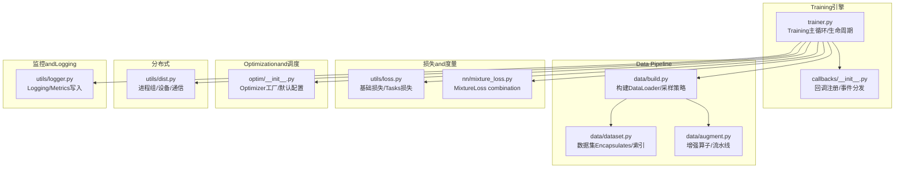
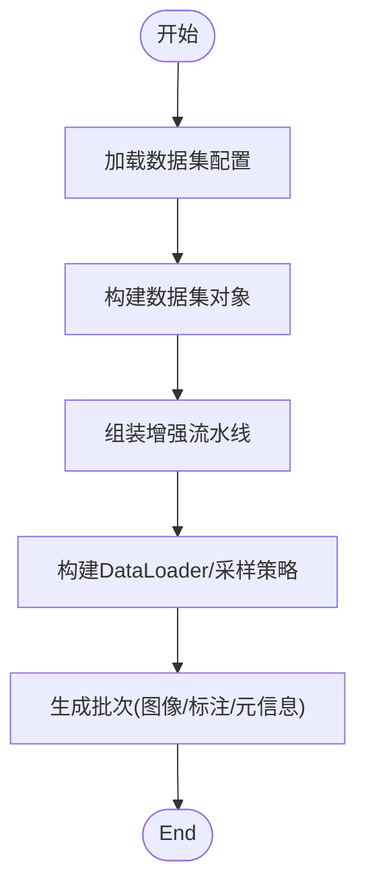
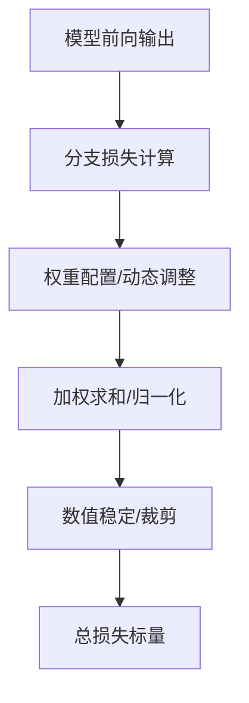
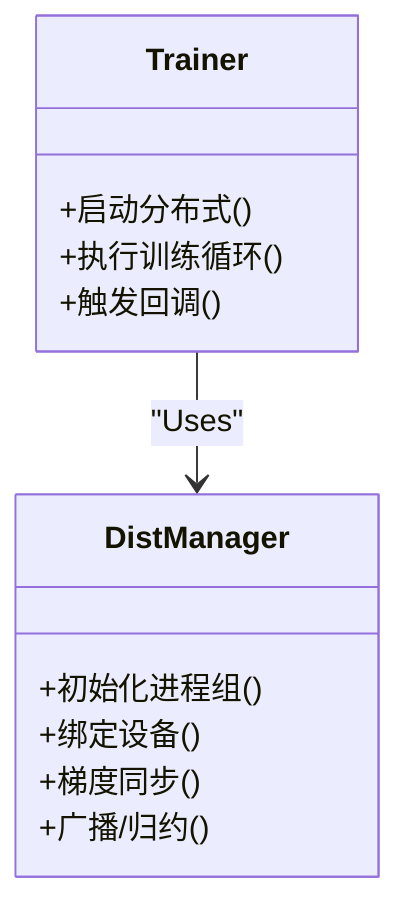
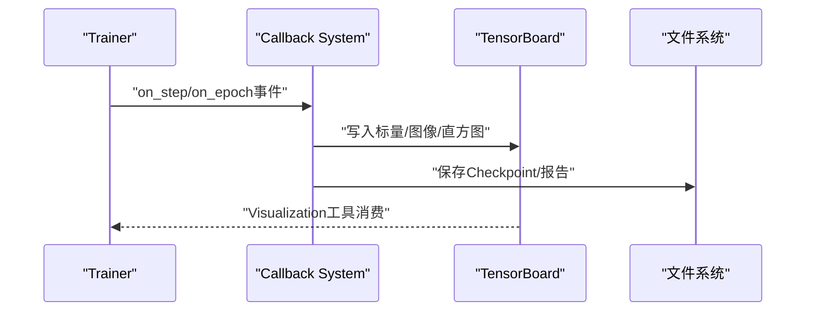
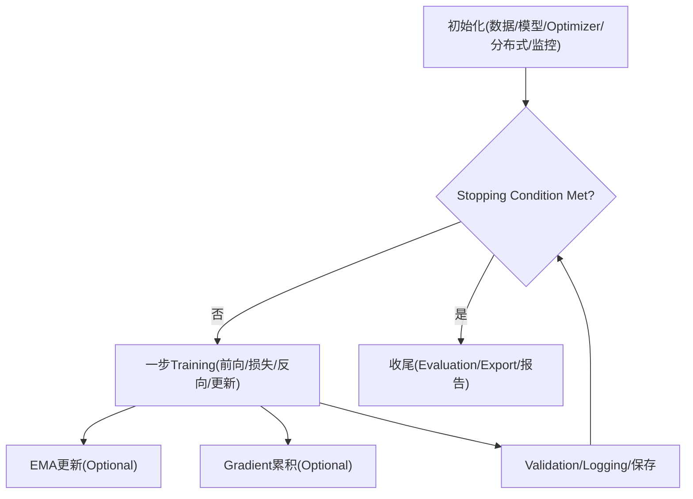
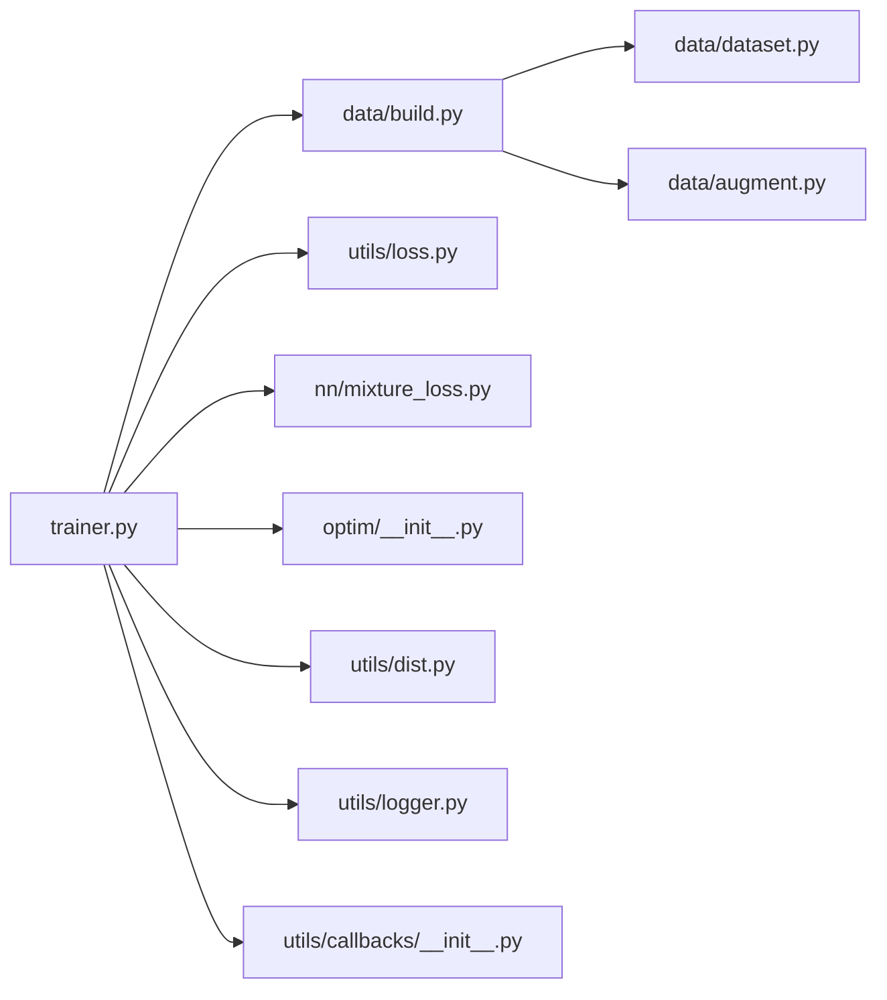

# Training System

<cite>
**Files Referenced in This Document**
- [ultralytics/engine/trainer.py](file://ultralytics/engine/trainer.py)
- [ultralytics/data/build.py](file://ultralytics/data/build.py)
- [ultralytics/data/dataset.py](file://ultralytics/data/dataset.py)
- [ultralytics/data/augment.py](file://ultralytics/data/augment.py)
- [ultralytics/utils/loss.py](file://ultralytics/utils/loss.py)
- [ultralytics/nn/mixture_loss.py](file://ultralytics/nn/mixture_loss.py)
- [ultralytics/optim/__init__.py](file://ultralytics/optim/__init__.py)
- [ultralytics/utils/dist.py](file://ultralytics/utils/dist.py)
- [ultralytics/utils/logger.py](file://ultralytics/utils/logger.py)
- [ultralytics/utils/callbacks/__init__.py](file://ultralytics/utils/callbacks/__init__.py)
- [ultralytics/cfg/default.yaml](file://ultralytics/cfg/default.yaml)
- [examples/lora_examples/yolo_master_lora_README.md](file://examples/lora_examples/yolo_master_lora_README.md)
- [scripts/smoke_test_coco2017.py](file://scripts/smoke_test_coco2017.py)
</cite>

## Table of Contents
1. [Introduction](#Introduction)
2. [Project Structure](#Project Structure)
3. [Core Components](#Core Components)
4. [Architecture Overview](#Architecture Overview)
5. [Detailed Component Analysis](#Detailed Component Analysis)
6. [Dependency Analysis](#Dependency Analysis)
7. [性能考量](#性能考量)
8. [Troubleshooting Guide](#Troubleshooting Guide)
9. [Conclusion](#Conclusion)
10. [Appendix](#Appendix)

## Introduction
本技术DocumentationtargetingYOLO-Master的Training System，系统性阐述从Data Preparationto模型收敛的完整生命周期。重点覆盖：
- Data Loading管道设计（数据集格式、增强策略、批处理）
- Loss Function体系（含Mixture损失设计and计算逻辑）
- Optimizer配置andLearning Rate调度
- Distributed Training机制（DDP、DeepSpeedetc.后端Supporting）
- Training监控andLogging（TensorBoard集成and自定义回调）
- Training Configuration文件Refer to（参数含义and推荐值）
- Training调优最佳实践and常见问题解决方案
- EMAandGradient累积etc.高级技巧

## Project Structure
Training System围绕“引擎-数据-损失-Optimization-分布式-监控”分层组织，关键路径such as下：
- Training主循环and生命周期管理位于Engine Layer
- 数据构建and增强位于数据层
- 损失计算位于工具and网络Modules
- Optimizerand调度whileOptimization层
- 分布式通信while工具层
- Loggingand回调while工具层



Figure Source
- [ultralytics/engine/trainer.py](file://ultralytics/engine/trainer.py)
- [ultralytics/data/build.py](file://ultralytics/data/build.py)
- [ultralytics/data/dataset.py](file://ultralytics/data/dataset.py)
- [ultralytics/data/augment.py](file://ultralytics/data/augment.py)
- [ultralytics/utils/loss.py](file://ultralytics/utils/loss.py)
- [ultralytics/nn/mixture_loss.py](file://ultralytics/nn/mixture_loss.py)
- [ultralytics/optim/__init__.py](file://ultralytics/optim/__init__.py)
- [ultralytics/utils/dist.py](file://ultralytics/utils/dist.py)
- [ultralytics/utils/logger.py](file://ultralytics/utils/logger.py)
- [ultralytics/utils/callbacks/__init__.py](file://ultralytics/utils/callbacks/__init__.py)

Section Source
- [ultralytics/engine/trainer.py](file://ultralytics/engine/trainer.py)
- [ultralytics/data/build.py](file://ultralytics/data/build.py)
- [ultralytics/data/dataset.py](file://ultralytics/data/dataset.py)
- [ultralytics/data/augment.py](file://ultralytics/data/augment.py)
- [ultralytics/utils/loss.py](file://ultralytics/utils/loss.py)
- [ultralytics/nn/mixture_loss.py](file://ultralytics/nn/mixture_loss.py)
- [ultralytics/optim/__init__.py](file://ultralytics/optim/__init__.py)
- [ultralytics/utils/dist.py](file://ultralytics/utils/dist.py)
- [ultralytics/utils/logger.py](file://ultralytics/utils/logger.py)
- [ultralytics/utils/callbacks/__init__.py](file://ultralytics/utils/callbacks/__init__.py)

## Core Components
- Training主循环and生命周期
  - 负责初始化数据、模型、Optimizer、分布式环境；执行epoch/step循环；触发Validation、保存、Loggingand回调；处理EMAandGradient累积。
- 数据构建and增强
  - 负责解析数据集配置、构建DatasetandDataLoader、应用增强流水线、implementing多尺度/随机裁剪/MixUp/Mosaicetc.策略。
- Loss Function体系
  - provides检测/分割/姿态and other tasks的基础损失，并SupportingViaMixture损失进行多目标加权组合。
- OptimizerandLearning Rate调度
  - provides常用Optimizerand默认超参，CombiningTraining阶段动态调整Learning Rate。
- Distributed Training
  - Encapsulates进程组创建、设备分配、Gradient同步、广播/归约etc.通信原语，兼容DDPand扩展后端。
- 监控andLogging
  - 统一Logging接口、Metrics记录、TensorBoard集成点、回调钩子（such as每步/每轮保存、早停、Visualization）。

Section Source
- [ultralytics/engine/trainer.py](file://ultralytics/engine/trainer.py)
- [ultralytics/data/build.py](file://ultralytics/data/build.py)
- [ultralytics/data/dataset.py](file://ultralytics/data/dataset.py)
- [ultralytics/data/augment.py](file://ultralytics/data/augment.py)
- [ultralytics/utils/loss.py](file://ultralytics/utils/loss.py)
- [ultralytics/nn/mixture_loss.py](file://ultralytics/nn/mixture_loss.py)
- [ultralytics/optim/__init__.py](file://ultralytics/optim/__init__.py)
- [ultralytics/utils/dist.py](file://ultralytics/utils/dist.py)
- [ultralytics/utils/logger.py](file://ultralytics/utils/logger.py)
- [ultralytics/utils/callbacks/__init__.py](file://ultralytics/utils/callbacks/__init__.py)

## Architecture Overview
下图展示一次Training迭代的关键Calls链：数据读取→前向→损失计算→反向→Optimization更新→监控and保存。

```mermaid
sequenceDiagram
participant Main as "Training主循环"
participant Data as "数据构建/增强"
participant Model as "模型前向"
participant Loss as "损失计算(含Mixture)"
participant Opt as "Optimizer/调度"
participant Dist as "分布式通信"
participant Log as "Logging/回调"
Main->>Data : "获取批次数据"
Data-->>Main : "图像/标注/元信息"
Main->>Model : "Forward Inference"
Model-->>Main : "Prediction结果"
Main->>Loss : "计算Tasks损失/Mixture损失"
Loss-->>Main : "标量损失/分项损失"
Main->>Dist : "Gradient同步(Optional)"
Main->>Opt : "Backpropagationand参数更新"
Opt-->>Main : "Optimization状态/Learning Rate"
Main->>Log : "记录Metrics/触发回调"
Log-->>Main : "完成一步"
```

Figure Source
- [ultralytics/engine/trainer.py](file://ultralytics/engine/trainer.py)
- [ultralytics/data/build.py](file://ultralytics/data/build.py)
- [ultralytics/utils/loss.py](file://ultralytics/utils/loss.py)
- [ultralytics/nn/mixture_loss.py](file://ultralytics/nn/mixture_loss.py)
- [ultralytics/optim/__init__.py](file://ultralytics/optim/__init__.py)
- [ultralytics/utils/dist.py](file://ultralytics/utils/dist.py)
- [ultralytics/utils/logger.py](file://ultralytics/utils/logger.py)
- [ultralytics/utils/callbacks/__init__.py](file://ultralytics/utils/callbacks/__init__.py)

## Detailed Component Analysis

### Data Loading管道
- 数据集格式and索引
  - 数据集对象负责解析标注、建立样本索引、provides按索引访问capabilities，并and增强流水线对接。
- 数据构建and批处理
  - 构建器根据配置选择采样策略、设置批大小、并行数、缓存and内存映射，生成可迭代的批数据。
- Data Augmentation
  - 增强Modulesprovides几何变换、色彩扰动、随机裁剪、Mosaic/MixUpetc.复合策略，Supporting按Training阶段开关或概率控制。
- 多尺度and自适应批处理
  - Supporting多尺度输入and动态批大小策略，提升吞吐and显存利用率。



Figure Source
- [ultralytics/data/build.py](file://ultralytics/data/build.py)
- [ultralytics/data/dataset.py](file://ultralytics/data/dataset.py)
- [ultralytics/data/augment.py](file://ultralytics/data/augment.py)

Section Source
- [ultralytics/data/build.py](file://ultralytics/data/build.py)
- [ultralytics/data/dataset.py](file://ultralytics/data/dataset.py)
- [ultralytics/data/augment.py](file://ultralytics/data/augment.py)

### Loss Function体系andMixture损失
- 基础损失
  - provides分类、回归、分割、关键点and other tasks的损失implementing，包含边界框定位、类别置信度、掩码/关键点etc.分支。
- Mixture损失
  - 将多个Tasks损失按权重组合，Supporting动态权重、归一化and数值稳定策略，便于多Tasks联合Training。
- 计算流程
  - 前向输出→逐项损失→加权求和→标量总损失；Supporting对异常项进行裁剪或屏蔽Centered on保证稳定性。



Figure Source
- [ultralytics/utils/loss.py](file://ultralytics/utils/loss.py)
- [ultralytics/nn/mixture_loss.py](file://ultralytics/nn/mixture_loss.py)

Section Source
- [ultralytics/utils/loss.py](file://ultralytics/utils/loss.py)
- [ultralytics/nn/mixture_loss.py](file://ultralytics/nn/mixture_loss.py)

### Optimizer配置andLearning Rate调度
- Optimizer
  - provides常用Optimizerand默认超参，Supporting分组Learning Rate、权重衰减、动量etc.选项。
- Learning Rate调度
  - 基于Training阶段或步数的调度策略，Supporting余弦退火、线性预热、阶梯下降etc.。
- andTraining循环集成
  - while每步更新后执行调度，并while回调中记录Learning Rate曲线。

Section Source
- [ultralytics/optim/__init__.py](file://ultralytics/optim/__init__.py)
- [ultralytics/engine/trainer.py](file://ultralytics/engine/trainer.py)

### Distributed Training机制
- 进程组and设备
  - Encapsulates进程组初始化、本地/远程节点发现、GPU/CPU设备绑定。
- Gradient同步and通信
  - providesallreduce/allgatheretc.通信原语，确保多卡/多机一致性。
- 后端Supporting
  - 原生DDP路径清晰，同时预留扩展点Centered on接入DeepSpeedetc.第三方后端。



Figure Source
- [ultralytics/utils/dist.py](file://ultralytics/utils/dist.py)
- [ultralytics/engine/trainer.py](file://ultralytics/engine/trainer.py)

Section Source
- [ultralytics/utils/dist.py](file://ultralytics/utils/dist.py)
- [ultralytics/engine/trainer.py](file://ultralytics/engine/trainer.py)

### Training监控andLogging
- Logging系统
  - 统一Logging接口，Supporting控制台输出、文件落盘、结构化Metrics记录。
- TensorBoard集成
  - while关键节点写入标量、直方图、图像etc.，便于VisualizationTraining过程。
- 自定义回调
  - providesTraining各阶段的钩子（such as每步/每轮/Validation/保存），允许注入自定义行for（such as早停、断点续训、报告生成）。



Figure Source
- [ultralytics/utils/logger.py](file://ultralytics/utils/logger.py)
- [ultralytics/utils/callbacks/__init__.py](file://ultralytics/utils/callbacks/__init__.py)
- [ultralytics/engine/trainer.py](file://ultralytics/engine/trainer.py)

Section Source
- [ultralytics/utils/logger.py](file://ultralytics/utils/logger.py)
- [ultralytics/utils/callbacks/__init__.py](file://ultralytics/utils/callbacks/__init__.py)
- [ultralytics/engine/trainer.py](file://ultralytics/engine/trainer.py)

### Training主循环and生命周期
- 初始化阶段
  - 解析配置、构建Data Pipeline、实例化模型and损失、初始化Optimizerand调度、设置分布式环境and监控。
- Training阶段
  - epoch/step循环、前向/损失/反向/更新、EMA更新、Gradient累积、Validationand保存。
- 收尾阶段
  - 最终Evaluation、Export、清理资源、汇总报告。



Figure Source
- [ultralytics/engine/trainer.py](file://ultralytics/engine/trainer.py)

Section Source
- [ultralytics/engine/trainer.py](file://ultralytics/engine/trainer.py)

### Training ConfigurationRefer to
- 默认配置
  - provides通用Training超参（such as批大小、Learning Rate、权重衰减、增强开关、保存间隔etc.）作for基线。
- LoRA微调Examples
  - providesLoRA相关配置说明andExamples脚本，便于快速上手参数微调。
- 端to端Validation脚本
  - provides最小可复现脚本用于快速ValidationTraining链路。

Section Source
- [ultralytics/cfg/default.yaml](file://ultralytics/cfg/default.yaml)
- [examples/lora_examples/yolo_master_lora_README.md](file://examples/lora_examples/yolo_master_lora_README.md)
- [scripts/smoke_test_coco2017.py](file://scripts/smoke_test_coco2017.py)

## Dependency Analysis
Training System内部Modules耦合清晰，低内聚高内聚原则贯穿：
- trainer依赖data、loss、optim、dist、logger、callbacks
- dataModules内部datasetandaugment解耦，build负责装配
- lossandmixture_loss职责分离，前者forTasks级，后者for组合级
- dist独立于具体Training逻辑，仅暴露通信接口



Figure Source
- [ultralytics/engine/trainer.py](file://ultralytics/engine/trainer.py)
- [ultralytics/data/build.py](file://ultralytics/data/build.py)
- [ultralytics/data/dataset.py](file://ultralytics/data/dataset.py)
- [ultralytics/data/augment.py](file://ultralytics/data/augment.py)
- [ultralytics/utils/loss.py](file://ultralytics/utils/loss.py)
- [ultralytics/nn/mixture_loss.py](file://ultralytics/nn/mixture_loss.py)
- [ultralytics/optim/__init__.py](file://ultralytics/optim/__init__.py)
- [ultralytics/utils/dist.py](file://ultralytics/utils/dist.py)
- [ultralytics/utils/logger.py](file://ultralytics/utils/logger.py)
- [ultralytics/utils/callbacks/__init__.py](file://ultralytics/utils/callbacks/__init__.py)

Section Source
- [ultralytics/engine/trainer.py](file://ultralytics/engine/trainer.py)
- [ultralytics/data/build.py](file://ultralytics/data/build.py)
- [ultralytics/data/dataset.py](file://ultralytics/data/dataset.py)
- [ultralytics/data/augment.py](file://ultralytics/data/augment.py)
- [ultralytics/utils/loss.py](file://ultralytics/utils/loss.py)
- [ultralytics/nn/mixture_loss.py](file://ultralytics/nn/mixture_loss.py)
- [ultralytics/optim/__init__.py](file://ultralytics/optim/__init__.py)
- [ultralytics/utils/dist.py](file://ultralytics/utils/dist.py)
- [ultralytics/utils/logger.py](file://ultralytics/utils/logger.py)
- [ultralytics/utils/callbacks/__init__.py](file://ultralytics/utils/callbacks/__init__.py)

## 性能考量
- 数据I/Oand增强
  - Set appropriately并行数and缓存策略，避免CPUbottlenecks；按需启用昂贵增强，平衡泛化and速度。
- 批大小and多尺度
  - while显存允许范围内增大批大小Centered on提升吞吐；多尺度需权衡精度and延迟。
- Mixture精度and编译
  - 开启Mixture精度减少显存占用and加速；必要时Combining编译Optimization提升内核效率。
- 分布式通信
  - 选择合适的通信后端and拓扑，减少跨节点开销；注意Gradient同步频率and累积步数。
- 监控and诊断
  - 利用Loggingand回调定期输出关键Metrics，and时识别bottlenecksand异常。

[This section provides general guidance and does not directly analyze specific files]

## Troubleshooting Guide
- 常见错误定位
  - 数据维度不匹配：检查数据集索引and增强输出的形状一致性。
  - 损失发散：检查Mixture损失权重、数值稳定策略andLearning Rate设置。
  - 分布式死锁：确认allreduceCalls位置and屏障语义，避免非根进程缺失通信。
  - 显存溢出：降低批大小、关闭部分增强或UsesGradient累积。
- 调试建议
  - Uses最小可复现脚本逐步Validation链路；开启详细Loggingand回调输出；while关键节点插入断点或打印。
- 回滚and恢复
  - 利用Checkpointand回调机制恢复Training；对比不同配置的Metrics曲线定位问题。

Section Source
- [ultralytics/engine/trainer.py](file://ultralytics/engine/trainer.py)
- [ultralytics/utils/logger.py](file://ultralytics/utils/logger.py)
- [ultralytics/utils/callbacks/__init__.py](file://ultralytics/utils/callbacks/__init__.py)

## Conclusion
YOLO-MasterTraining SystemCentered on清晰的Modules化设计支撑从数据to收敛的全链路Training。Via灵活的Data Pipeline、可扩展的Loss combination、稳健的分布式通信and完善的监控回调，User可while不同规模and场景下高效Training。Combined with合理的超参and调优策略，可implementing稳定收敛and良好泛化。

[This section is summary content and does not directly analyze specific files]

## Appendix
- 术语
  - EMA：指数移动平均，用于平滑模型参数，提升Validation期稳定性。
  - Gradient累积：while多步累积后再Updating Parameters，模拟更大有效批大小。
  - DDP：分布式数据并行，多进程同步Gradient。
  - DeepSpeed：高性能Distributed Training框架，可and现有接口集成。
- Refer toExamples
  - LoRA微调ExamplesandREADME说明
  - 最小可复现Training脚本

Section Source
- [examples/lora_examples/yolo_master_lora_README.md](file://examples/lora_examples/yolo_master_lora_README.md)
- [scripts/smoke_test_coco2017.py](file://scripts/smoke_test_coco2017.py)