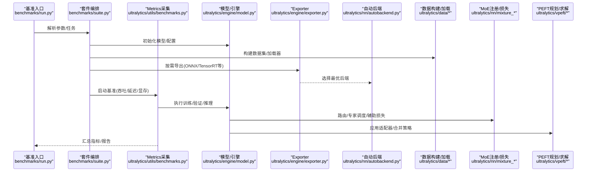
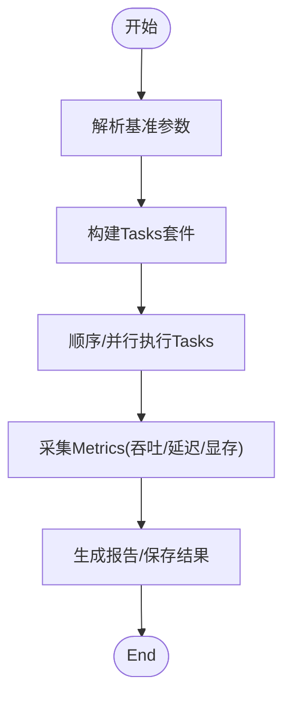
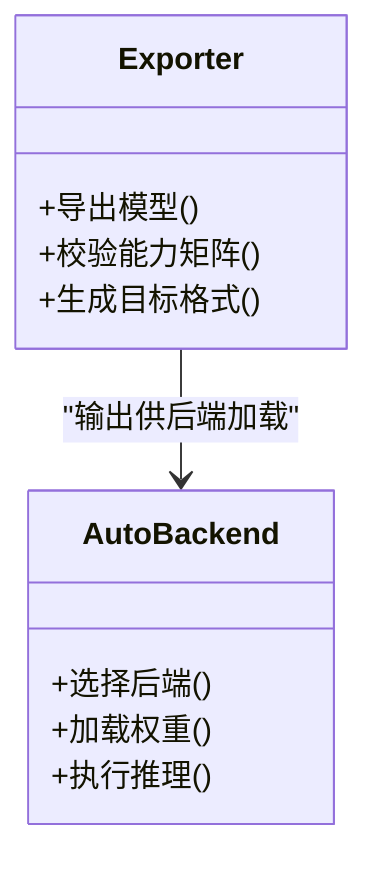
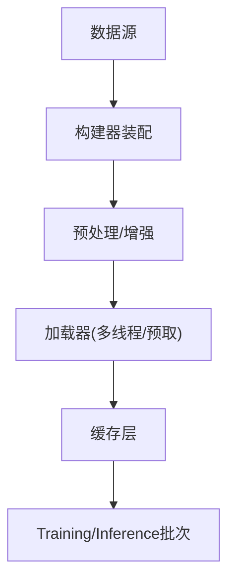
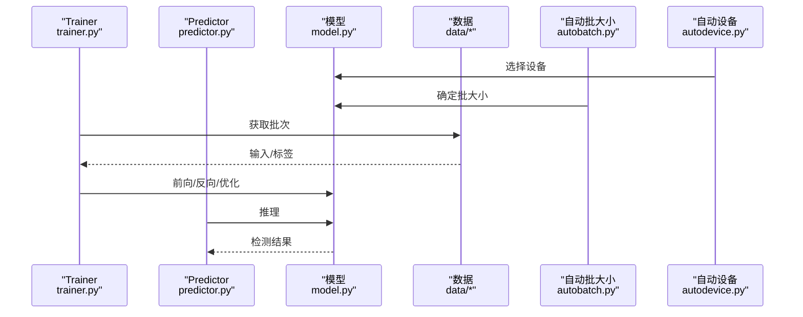
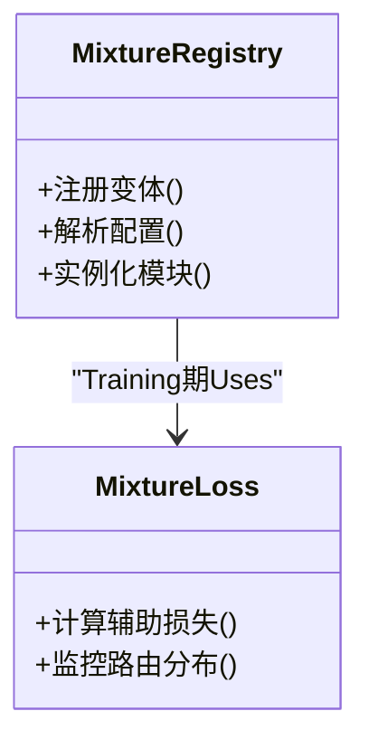
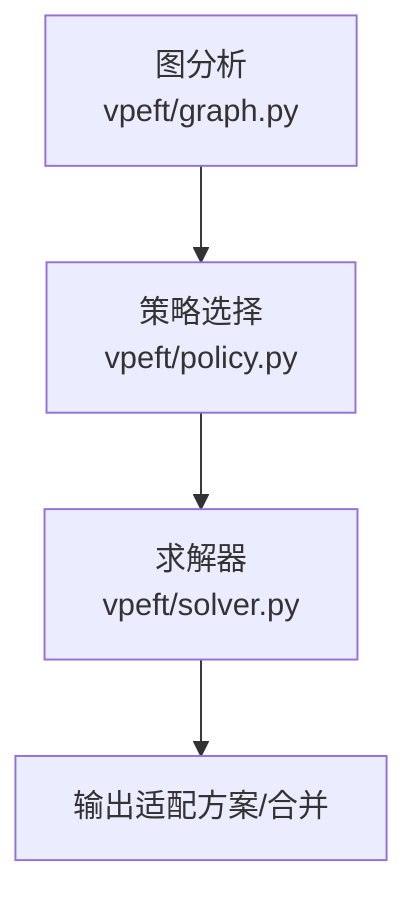
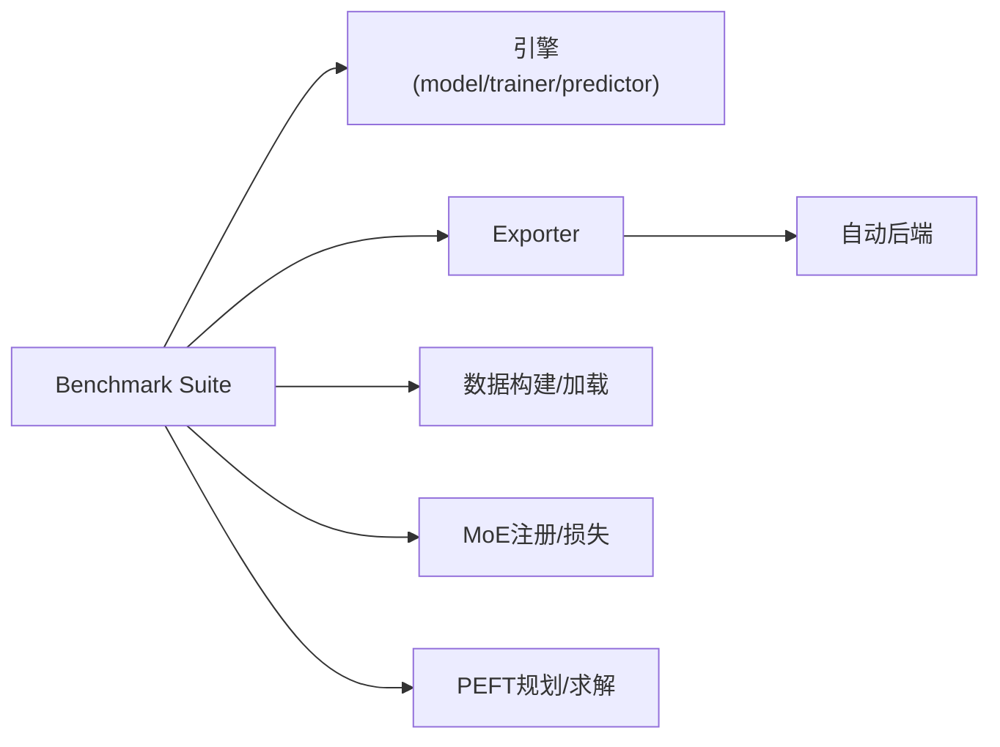

# 性能Optimizationand调优

<cite>
**Files Referenced in This Document**
- [benchmarks/run.py](file://benchmarks/run.py)
- [benchmarks/suite.py](file://benchmarks/suite.py)
- [benchmarks/benchmark_molora_dispatch.py](file://benchmarks/benchmark_molora_dispatch.py)
- [benchmarks/benchmark_mot_dispatch.py](file://benchmarks/benchmark_mot_dispatch.py)
- [ultralytics/utils/benchmarks.py](file://ultralytics/utils/benchmarks.py)
- [ultralytics/engine/exporter.py](file://ultralytics/engine/exporter.py)
- [ultralytics/nn/autobackend.py](file://ultralytics/nn/autobackend.py)
- [ultralytics/utils/autodevice.py](file://ultralytics/utils/autodevice.py)
- [ultralytics/utils/autobatch.py](file://ultralytics/utils/autobatch.py)
- [ultralytics/data/build.py](file://ultralytics/data/build.py)
- [ultralytics/data/dataset.py](file://ultralytics/data/dataset.py)
- [ultralytics/data/loaders.py](file://ultralytics/data/loaders.py)
- [ultralytics/engine/trainer.py](file://ultralytics/engine/trainer.py)
- [ultralytics/engine/predictor.py](file://ultralytics/engine/predictor.py)
- [ultralytics/engine/model.py](file://ultralytics/engine/model.py)
- [ultralytics/nn/mixture_loss.py](file://ultralytics/nn/mixture_loss.py)
- [ultralytics/nn/mixture_registry.py](file://ultralytics/nn/mixture_registry.py)
- [ultralytics/vpeft/graph.py](file://ultralytics/vpeft/graph.py)
- [ultralytics/vpeft/policy.py](file://ultralytics/vpeft/policy.py)
- [ultralytics/vpeft/solver.py](file://ultralytics/vpeft/solver.py)
- [scripts/bench_moe_micro.py](file://scripts/bench_moe_micro.py)
- [scripts/bench_moe_mps.py](file://scripts/bench_moe_mps.py)
- [scripts/eval_moe_peft.py](file://scripts/eval_moe_peft.py)
- [scripts/ablation_suite/full_ablation.py](file://scripts/ablation_suite/full_ablation.py)
- [scripts/ablation_suite/ablation_peft_visualize.py](file://scripts/ablation_suite/ablation_peft_visualize.py)
- [examples/YOLO-Master-Cross-Platform-Edge-Deployment/scripts/export_edge_models.py](file://examples/YOLO-Master-Cross-Platform-Edge-Deployment/scripts/export_edge_models.py)
- [examples/YOLO-Master-Edge-Deployment/export_edge_models.py](file://examples/YOLO-Master-Edge-Deployment/export_edge_models.py)
- [docs/governance/performance-gates.md](file://docs/governance/performance-gates.md)
</cite>

## Table of Contents
1. [引言](#引言)
2. [Project Structure](#Project Structure)
3. [Core Components](#Core Components)
4. [Architecture Overview](#Architecture Overview)
5. [Detailed Component Analysis](#Detailed Component Analysis)
6. [Dependency Analysis](#Dependency Analysis)
7. [性能考量](#性能考量)
8. [Troubleshooting Guide](#Troubleshooting Guide)
9. [Conclusion](#Conclusion)
10. [Appendix](#Appendix)

## 引言
本指南targetingwhileYOLO-Master项目中implementing高性能TrainingandInference的Engineering Teams，聚焦Centered on下目标：
- GPU利用率低下的根因分析andOptimization路径（显存、计算图、Data Loading）
- Inference速度慢的定位and加速策略（量化、剪枝、蒸馏、Export Backends）
- 大规模Data processingandTraining的内存管理（数据流、缓存、泄漏检测）
- 多硬件平台（CPU/GPU/TPU/边缘设备）的调优技巧
- MoEandPEFT相关Modules的性能Optimization专门指导
- 基准测试工具的Uses方法and结果解读

## Project Structure
围绕性能Optimization的关键代码分布whilesuch as下位置：
- Benchmark Suiteand脚本：benchmarks、scripts
- 运行时引擎：ultralytics/engine
- 模型andMixture专家：ultralytics/nn/mixture_*
- Data Pipeline：ultralytics/data
- 自动设备/批大小/Export：ultralytics/utils、ultralytics/engine/exporter.py、ultralytics/nn/autobackend.py
- PEFT规划and执行：ultralytics/vpeft
- Edge DeploymentExamples：examples/.../export_edge_models.py

Figure Source
- [benchmarks/run.py](file://benchmarks/run.py)
- [benchmarks/suite.py](file://benchmarks/suite.py)
- [benchmarks/benchmark_molora_dispatch.py](file://benchmarks/benchmark_molora_dispatch.py)
- [benchmarks/benchmark_mot_dispatch.py](file://benchmarks/benchmark_mot_dispatch.py)
- [ultralytics/utils/benchmarks.py](file://ultralytics/utils/benchmarks.py)
- [ultralytics/engine/model.py](file://ultralytics/engine/model.py)
- [ultralytics/engine/exporter.py](file://ultralytics/engine/exporter.py)
- [ultralytics/nn/autobackend.py](file://ultralytics/nn/autobackend.py)
- [ultralytics/utils/autodevice.py](file://ultralytics/utils/autodevice.py)
- [ultralytics/utils/autobatch.py](file://ultralytics/utils/autobatch.py)
- [ultralytics/data/build.py](file://ultralytics/data/build.py)
- [ultralytics/data/dataset.py](file://ultralytics/data/dataset.py)
- [ultralytics/data/loaders.py](file://ultralytics/data/loaders.py)
- [ultralytics/nn/mixture_registry.py](file://ultralytics/nn/mixture_registry.py)
- [ultralytics/nn/mixture_loss.py](file://ultralytics/nn/mixture_loss.py)
- [ultralytics/vpeft/graph.py](file://ultralytics/vpeft/graph.py)
- [ultralytics/vpeft/policy.py](file://ultralytics/vpeft/policy.py)
- [ultralytics/vpeft/solver.py](file://ultralytics/vpeft/solver.py)

Section Source
- [benchmarks/run.py](file://benchmarks/run.py)
- [benchmarks/suite.py](file://benchmarks/suite.py)
- [ultralytics/utils/benchmarks.py](file://ultralytics/utils/benchmarks.py)
- [ultralytics/engine/model.py](file://ultralytics/engine/model.py)
- [ultralytics/engine/exporter.py](file://ultralytics/engine/exporter.py)
- [ultralytics/nn/autobackend.py](file://ultralytics/nn/autobackend.py)
- [ultralytics/utils/autodevice.py](file://ultralytics/utils/autodevice.py)
- [ultralytics/utils/autobatch.py](file://ultralytics/utils/autobatch.py)
- [ultralytics/data/build.py](file://ultralytics/data/build.py)
- [ultralytics/data/dataset.py](file://ultralytics/data/dataset.py)
- [ultralytics/data/loaders.py](file://ultralytics/data/loaders.py)
- [ultralytics/nn/mixture_registry.py](file://ultralytics/nn/mixture_registry.py)
- [ultralytics/nn/mixture_loss.py](file://ultralytics/nn/mixture_loss.py)
- [ultralytics/vpeft/graph.py](file://ultralytics/vpeft/graph.py)
- [ultralytics/vpeft/policy.py](file://ultralytics/vpeft/policy.py)
- [ultralytics/vpeft/solver.py](file://ultralytics/vpeft/solver.py)

## Core Components
- Benchmark Suiteand运行器：providesUnified entry point、Tasks编排、Metrics采集and报告生成。
- Exportand自动后端：将Model Exportfor多种格式并选择最优Inference后端。
- 数据构建and加载：负责数据集构建、预处理流水线andI/O吞吐Optimization。
- TrainingandPrediction引擎：EncapsulatesTraining循环、Validation流程andInference管线。
- Mixture专家（MoE）注册and损失：支撑MoE路由、专家调度andAuxiliary Loss。
- PEFT规划and求解：对LoRAetc.Adapter进行图级规划、策略选择and求解。
- 自动设备and批大小：根据硬件capabilities自动Selecting Deviceand批大小。

Section Source
- [benchmarks/run.py](file://benchmarks/run.py)
- [benchmarks/suite.py](file://benchmarks/suite.py)
- [ultralytics/utils/benchmarks.py](file://ultralytics/utils/benchmarks.py)
- [ultralytics/engine/exporter.py](file://ultralytics/engine/exporter.py)
- [ultralytics/nn/autobackend.py](file://ultralytics/nn/autobackend.py)
- [ultralytics/data/build.py](file://ultralytics/data/build.py)
- [ultralytics/data/dataset.py](file://ultralytics/data/dataset.py)
- [ultralytics/data/loaders.py](file://ultralytics/data/loaders.py)
- [ultralytics/engine/trainer.py](file://ultralytics/engine/trainer.py)
- [ultralytics/engine/predictor.py](file://ultralytics/engine/predictor.py)
- [ultralytics/nn/mixture_registry.py](file://ultralytics/nn/mixture_registry.py)
- [ultralytics/nn/mixture_loss.py](file://ultralytics/nn/mixture_loss.py)
- [ultralytics/vpeft/graph.py](file://ultralytics/vpeft/graph.py)
- [ultralytics/vpeft/policy.py](file://ultralytics/vpeft/policy.py)
- [ultralytics/vpeft/solver.py](file://ultralytics/vpeft/solver.py)
- [ultralytics/utils/autodevice.py](file://ultralytics/utils/autodevice.py)
- [ultralytics/utils/autobatch.py](file://ultralytics/utils/autobatch.py)

## Architecture Overview
下图展示从基准入口to具体子系统的关键Calls链and数据流向。

Figure Source
- [benchmarks/run.py](file://benchmarks/run.py)
- [benchmarks/suite.py](file://benchmarks/suite.py)
- [ultralytics/utils/benchmarks.py](file://ultralytics/utils/benchmarks.py)
- [ultralytics/engine/model.py](file://ultralytics/engine/model.py)
- [ultralytics/engine/exporter.py](file://ultralytics/engine/exporter.py)
- [ultralytics/nn/autobackend.py](file://ultralytics/nn/autobackend.py)
- [ultralytics/data/build.py](file://ultralytics/data/build.py)
- [ultralytics/data/dataset.py](file://ultralytics/data/dataset.py)
- [ultralytics/data/loaders.py](file://ultralytics/data/loaders.py)
- [ultralytics/nn/mixture_registry.py](file://ultralytics/nn/mixture_registry.py)
- [ultralytics/nn/mixture_loss.py](file://ultralytics/nn/mixture_loss.py)
- [ultralytics/vpeft/graph.py](file://ultralytics/vpeft/graph.py)
- [ultralytics/vpeft/policy.py](file://ultralytics/vpeft/policy.py)
- [ultralytics/vpeft/solver.py](file://ultralytics/vpeft/solver.py)

## Detailed Component Analysis

### Benchmark Suiteand运行器
- 职责：统一参数解析、Tasks编排、Metrics采集、结果持久化；Supporting自定义子套件。
- 关键点：
  - Via套件定义组合不同场景（Training/Validation/Inference/Export）。
  - Uses统一的Metrics采集接口记录吞吐、延迟、显存占用。
  - 可集成外部基准脚本（such asMoE微基准、MPS环境基准）。

Figure Source
- [benchmarks/run.py](file://benchmarks/run.py)
- [benchmarks/suite.py](file://benchmarks/suite.py)
- [ultralytics/utils/benchmarks.py](file://ultralytics/utils/benchmarks.py)

Section Source
- [benchmarks/run.py](file://benchmarks/run.py)
- [benchmarks/suite.py](file://benchmarks/suite.py)
- [ultralytics/utils/benchmarks.py](file://ultralytics/utils/benchmarks.py)

### Exportand自动后端
- 职责：将PyTorchModel Exportfor目标格式，并whileInference时选择最优后端。
- 关键点：
  - Export阶段进行算子兼容性andcapabilities矩阵检查。
  - 自动后端根据可用库and硬件特性选择最佳执行引擎。
  - Combining量化/剪枝/蒸馏后的模型提升部署效率。

Figure Source
- [ultralytics/engine/exporter.py](file://ultralytics/engine/exporter.py)
- [ultralytics/nn/autobackend.py](file://ultralytics/nn/autobackend.py)

Section Source
- [ultralytics/engine/exporter.py](file://ultralytics/engine/exporter.py)
- [ultralytics/nn/autobackend.py](file://ultralytics/nn/autobackend.py)

### 数据构建and加载
- 职责：构建数据集、预处理、多线程/异步加载、缓存and预取。
- 关键点：
  - Via构建器组装数据源and增强策略。
  - Uses高效加载器减少I/Obottlenecks，Combined with缓存降低重复读取。
  - 针对大图像/视频流进行分块and预取Optimization。

Figure Source
- [ultralytics/data/build.py](file://ultralytics/data/build.py)
- [ultralytics/data/dataset.py](file://ultralytics/data/dataset.py)
- [ultralytics/data/loaders.py](file://ultralytics/data/loaders.py)

Section Source
- [ultralytics/data/build.py](file://ultralytics/data/build.py)
- [ultralytics/data/dataset.py](file://ultralytics/data/dataset.py)
- [ultralytics/data/loaders.py](file://ultralytics/data/loaders.py)

### TrainingandPrediction引擎
- 职责：EncapsulatesTraining循环、Validation流程、Inference管线；对接数据and模型。
- 关键点：
  - Training侧关注Gradient同步、EMA、Mixture精度and分布式通信。
  - Inference侧关注预热、批内并行、Post-ProcessingOptimization。
  - and自动设备/批大小协同，最大化硬件利用率。

Figure Source
- [ultralytics/engine/trainer.py](file://ultralytics/engine/trainer.py)
- [ultralytics/engine/predictor.py](file://ultralytics/engine/predictor.py)
- [ultralytics/engine/model.py](file://ultralytics/engine/model.py)
- [ultralytics/utils/autobatch.py](file://ultralytics/utils/autobatch.py)
- [ultralytics/utils/autodevice.py](file://ultralytics/utils/autodevice.py)
- [ultralytics/data/build.py](file://ultralytics/data/build.py)
- [ultralytics/data/dataset.py](file://ultralytics/data/dataset.py)
- [ultralytics/data/loaders.py](file://ultralytics/data/loaders.py)

Section Source
- [ultralytics/engine/trainer.py](file://ultralytics/engine/trainer.py)
- [ultralytics/engine/predictor.py](file://ultralytics/engine/predictor.py)
- [ultralytics/engine/model.py](file://ultralytics/engine/model.py)
- [ultralytics/utils/autobatch.py](file://ultralytics/utils/autobatch.py)
- [ultralytics/utils/autodevice.py](file://ultralytics/utils/autodevice.py)
- [ultralytics/data/build.py](file://ultralytics/data/build.py)
- [ultralytics/data/dataset.py](file://ultralytics/data/dataset.py)
- [ultralytics/data/loaders.py](file://ultralytics/data/loaders.py)

### Mixture专家（MoE）注册and损失
- 职责：注册MoE变体、管理路由and专家、计算Auxiliary Loss。
- 关键点：
  - routing strategies影响Load Balancingand吞吐。
  - Auxiliary Loss用于稳定Trainingand均衡专家Uses。
  - Export时需保留路由逻辑或进行稀疏化融合。

Figure Source
- [ultralytics/nn/mixture_registry.py](file://ultralytics/nn/mixture_registry.py)
- [ultralytics/nn/mixture_loss.py](file://ultralytics/nn/mixture_loss.py)

Section Source
- [ultralytics/nn/mixture_registry.py](file://ultralytics/nn/mixture_registry.py)
- [ultralytics/nn/mixture_loss.py](file://ultralytics/nn/mixture_loss.py)

### PEFT规划and求解
- 职责：对LoRAetc.Adapter进行图级规划、策略选择and求解，兼顾精度and性能。
- 关键点：
  - 图分析识别可插入点and依赖关系。
  - 策略Evaluation权衡参数量、吞吐and精度。
  - 求解器输出最终适配方案并Supporting合并Export。

Figure Source
- [ultralytics/vpeft/graph.py](file://ultralytics/vpeft/graph.py)
- [ultralytics/vpeft/policy.py](file://ultralytics/vpeft/policy.py)
- [ultralytics/vpeft/solver.py](file://ultralytics/vpeft/solver.py)

Section Source
- [ultralytics/vpeft/graph.py](file://ultralytics/vpeft/graph.py)
- [ultralytics/vpeft/policy.py](file://ultralytics/vpeft/policy.py)
- [ultralytics/vpeft/solver.py](file://ultralytics/vpeft/solver.py)

### MoEandPEFT专项Optimization
- MoE路由and专家调度：
  - 调整路由阈值and专家容量，避免热点专家导致负载不均。
  - UsesAuxiliary Lossand动态调度策略平衡专家Uses率。
  - Export时考虑稀疏融合and算子融合Centered on减少开销。
- PEFT（LoRAetc.）：
  - 选择合适秩and目标层，控制参数量and吞吐折中。
  - 合并AdapterCentered on消除运行时分支，提升Inference速度。
  - Combining量化/剪枝进一步压缩模型。

Section Source
- [scripts/bench_moe_micro.py](file://scripts/bench_moe_micro.py)
- [scripts/bench_moe_mps.py](file://scripts/bench_moe_mps.py)
- [scripts/eval_moe_peft.py](file://scripts/eval_moe_peft.py)
- [scripts/ablation_suite/full_ablation.py](file://scripts/ablation_suite/full_ablation.py)
- [scripts/ablation_suite/ablation_peft_visualize.py](file://scripts/ablation_suite/ablation_peft_visualize.py)
- [ultralytics/nn/mixture_registry.py](file://ultralytics/nn/mixture_registry.py)
- [ultralytics/nn/mixture_loss.py](file://ultralytics/nn/mixture_loss.py)
- [ultralytics/vpeft/graph.py](file://ultralytics/vpeft/graph.py)
- [ultralytics/vpeft/policy.py](file://ultralytics/vpeft/policy.py)
- [ultralytics/vpeft/solver.py](file://ultralytics/vpeft/solver.py)

### Edge DeploymentandCross-Platform Export
- 职责：针对不同边缘平台生成Optimization模型，确保端to端性能。
- 关键点：
  - Export脚本按平台需求选择目标格式andOptimization选项。
  - Combining量化and算子融合降低延迟and功耗。
  - while目标设备上做端to端Validationand回归测试。

Section Source
- [examples/YOLO-Master-Cross-Platform-Edge-Deployment/scripts/export_edge_models.py](file://examples/YOLO-Master-Cross-Platform-Edge-Deployment/scripts/export_edge_models.py)
- [examples/YOLO-Master-Edge-Deployment/export_edge_models.py](file://examples/YOLO-Master-Edge-Deployment/export_edge_models.py)

## Dependency Analysis
- Benchmark Suite依赖引擎、Exporter、自动后端、数据构建and加载、MoEandPEFTModules。
- Exporterand自动后端形成“Export-选择”闭环，决定最终Inference后端。
- 数据构建and加载直接影响GPU/CPU利用率and吞吐。
- MoE注册and损失贯穿Training期，影响路由稳定性and收敛。
- PEFT规划and求解whileTraining/Export前后均可介入，影响模型体积andInference Performance。

Figure Source
- [benchmarks/run.py](file://benchmarks/run.py)
- [benchmarks/suite.py](file://benchmarks/suite.py)
- [ultralytics/engine/model.py](file://ultralytics/engine/model.py)
- [ultralytics/engine/trainer.py](file://ultralytics/engine/trainer.py)
- [ultralytics/engine/predictor.py](file://ultralytics/engine/predictor.py)
- [ultralytics/engine/exporter.py](file://ultralytics/engine/exporter.py)
- [ultralytics/nn/autobackend.py](file://ultralytics/nn/autobackend.py)
- [ultralytics/data/build.py](file://ultralytics/data/build.py)
- [ultralytics/data/dataset.py](file://ultralytics/data/dataset.py)
- [ultralytics/data/loaders.py](file://ultralytics/data/loaders.py)
- [ultralytics/nn/mixture_registry.py](file://ultralytics/nn/mixture_registry.py)
- [ultralytics/nn/mixture_loss.py](file://ultralytics/nn/mixture_loss.py)
- [ultralytics/vpeft/graph.py](file://ultralytics/vpeft/graph.py)
- [ultralytics/vpeft/policy.py](file://ultralytics/vpeft/policy.py)
- [ultralytics/vpeft/solver.py](file://ultralytics/vpeft/solver.py)

Section Source
- [benchmarks/run.py](file://benchmarks/run.py)
- [benchmarks/suite.py](file://benchmarks/suite.py)
- [ultralytics/engine/model.py](file://ultralytics/engine/model.py)
- [ultralytics/engine/trainer.py](file://ultralytics/engine/trainer.py)
- [ultralytics/engine/predictor.py](file://ultralytics/engine/predictor.py)
- [ultralytics/engine/exporter.py](file://ultralytics/engine/exporter.py)
- [ultralytics/nn/autobackend.py](file://ultralytics/nn/autobackend.py)
- [ultralytics/data/build.py](file://ultralytics/data/build.py)
- [ultralytics/data/dataset.py](file://ultralytics/data/dataset.py)
- [ultralytics/data/loaders.py](file://ultralytics/data/loaders.py)
- [ultralytics/nn/mixture_registry.py](file://ultralytics/nn/mixture_registry.py)
- [ultralytics/nn/mixture_loss.py](file://ultralytics/nn/mixture_loss.py)
- [ultralytics/vpeft/graph.py](file://ultralytics/vpeft/graph.py)
- [ultralytics/vpeft/policy.py](file://ultralytics/vpeft/policy.py)
- [ultralytics/vpeft/solver.py](file://ultralytics/vpeft/solver.py)

## 性能考量
- GPU利用率低下常见原因and对策
  - I/Obottlenecks：Data Loading慢导致GPU空闲。Optimization方向包括多线程/预取、缓存、磁盘and网络Optimization。
  - 批大小不当：过小导致并行度不足，过大引发频繁交换或OOM。Uses自动批大小工具寻找上限。
  - 计算图碎片化：频繁创建临时张量andPython回调增加开销。尽量Uses算子融合and静态图Export。
  - 路由/专家不均衡：MoE热点专家造成拥塞。调整路由阈值andAuxiliary Loss权重，必要时剪枝低效专家。
- 显存UsesOptimization
  - 启用Mixture精度andGradientCheckpoint，减少中间激活占用。
  - Set appropriately批大小and序列长度，避免峰值显存溢出。
  - and时释放不再Uses的张量and缓存，避免引用累积。
- Inference速度慢定位andOptimization
  - UsesBenchmark Suite测量端to端延迟and吞吐，定位bottlenecks阶段（预处理/Inference/Post-Processing）。
  - Exporting to高效格式并选择最优后端，Combining量化/剪枝/蒸馏。
  - 预热模型and后端，减少冷启动开销。
- 大规模Data processingandTraining内存管理
  - 数据流Optimization：分块读取、预取、缓存命中提升。
  - 内存泄漏检测：定期快照and差异对比，追踪未释放对象。
  - Distributed Training：注意Gradient同步andAllReduce开销，合理切分and通信策略。
- 多硬件平台调优
  - CPU：开启线程数andSIMDOptimization，减少Python开销，Uses轻量后端。
  - GPU：利用TensorCoreand专用库，选择合适dtypeand批大小。
  - TPU：对齐形状and批量，避免动态形状导致的编译开销。
  - 边缘设备：量化至INT8/FP16，裁剪冗余分支，选择最小运行时。
- MoEandPEFT专项
  - MoE：路由校准、专家容量andLoad Balancing、动态调度and稀疏融合。
  - PEFT：秩选择、目标层筛选、合并Exportand量化协同。

[本节for通用指导，无需特定文件来源]

## Troubleshooting Guide
- 基准and诊断
  - UsesBenchmark Suite复现实验，固定随机种子and环境，确保可重现。
  - 分别测量Data Loading、模型前向、Post-Processing耗时，定位bottlenecks。
- 显存问题
  - 观察峰值显存and增长趋势，定位异常分配点。
  - 关闭不必要的LoggingandVisualization，减少额外内存。
- 路由and专家异常
  - 检查路由分布是否极端倾斜，必要时调整Auxiliary Loss或路由阈值。
  - Export后Validation路由逻辑一致性，避免稀疏化引入偏差。
- PEFT相关问题
  - 确认Adapter已正确注入and合并，Export后权重一致。
  - 对比不同秩and策略的效果，选择性价比最优方案。

Section Source
- [benchmarks/run.py](file://benchmarks/run.py)
- [benchmarks/suite.py](file://benchmarks/suite.py)
- [ultralytics/utils/benchmarks.py](file://ultralytics/utils/benchmarks.py)
- [scripts/bench_moe_micro.py](file://scripts/bench_moe_micro.py)
- [scripts/bench_moe_mps.py](file://scripts/bench_moe_mps.py)
- [scripts/eval_moe_peft.py](file://scripts/eval_moe_peft.py)
- [scripts/ablation_suite/full_ablation.py](file://scripts/ablation_suite/full_ablation.py)
- [scripts/ablation_suite/ablation_peft_visualize.py](file://scripts/ablation_suite/ablation_peft_visualize.py)

## Conclusion
Via系统化基准、Exportand后端选择、数据流Optimization、MoE/PEFT专项调优Centered onand多硬件平台的适配，可Centered on显著提升YOLO-Master的TrainingandInference Performance。建议将性能门禁纳入持续集成，确保每次变更都Via基准and回归测试。

[本节for总结性内容，无需特定文件来源]

## Appendix
- 性能门禁and治理
  - Refer to性能门禁Documentation，建立基线and阈值，自动化回归检测。
- 常用命令and脚本
  - UsesBenchmark Suite运行标准Tasks，CombiningMoEandPEFT专项脚本进行深度分析。
  - Edge DeploymentExamples脚本用于Cross-Platform ExportandValidation。

Section Source
- [docs/governance/performance-gates.md](file://docs/governance/performance-gates.md)
- [benchmarks/run.py](file://benchmarks/run.py)
- [benchmarks/suite.py](file://benchmarks/suite.py)
- [scripts/bench_moe_micro.py](file://scripts/bench_moe_micro.py)
- [scripts/bench_moe_mps.py](file://scripts/bench_moe_mps.py)
- [scripts/eval_moe_peft.py](file://scripts/eval_moe_peft.py)
- [examples/YOLO-Master-Cross-Platform-Edge-Deployment/scripts/export_edge_models.py](file://examples/YOLO-Master-Cross-Platform-Edge-Deployment/scripts/export_edge_models.py)
- [examples/YOLO-Master-Edge-Deployment/export_edge_models.py](file://examples/YOLO-Master-Edge-Deployment/export_edge_models.py)