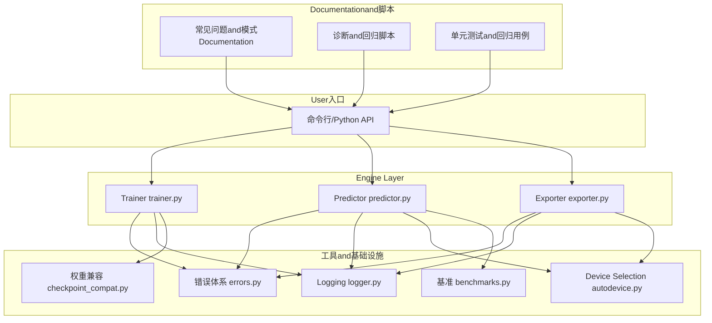
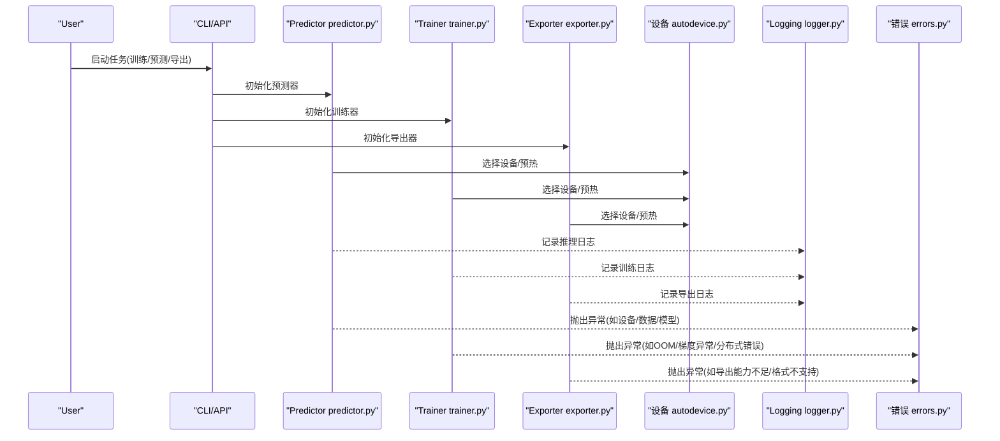
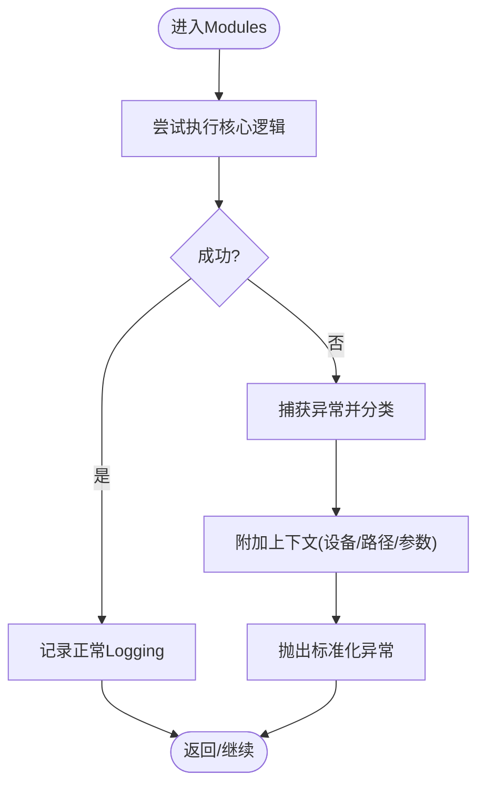
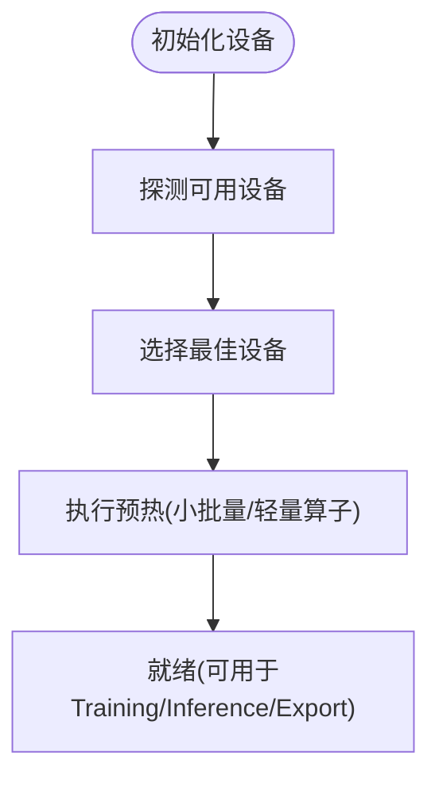
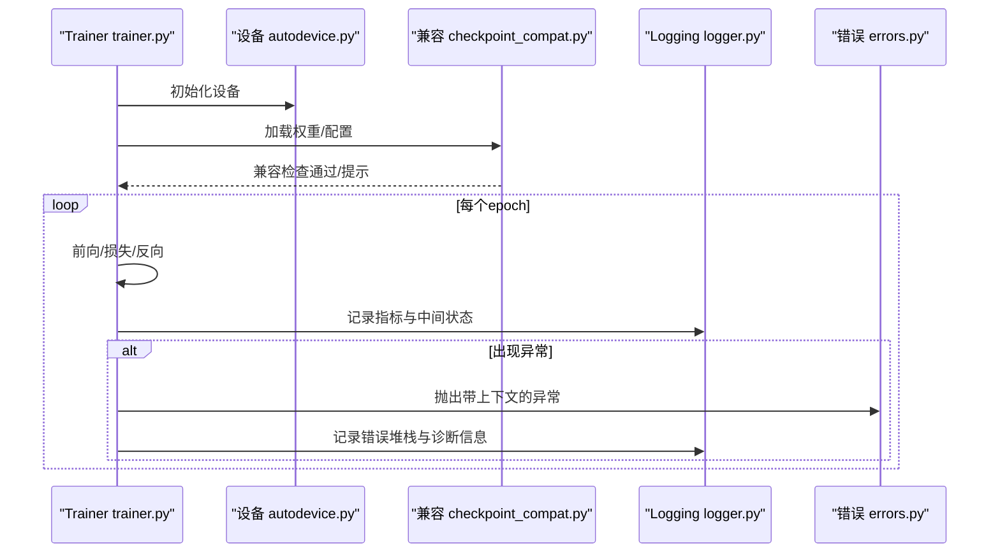
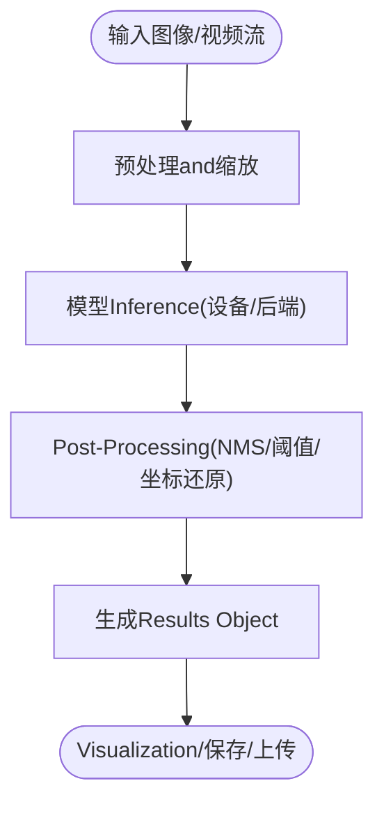
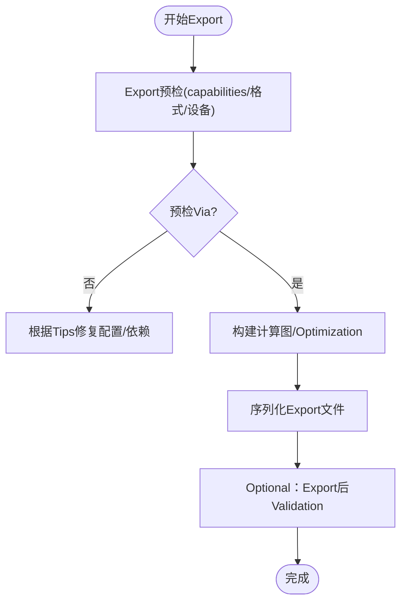
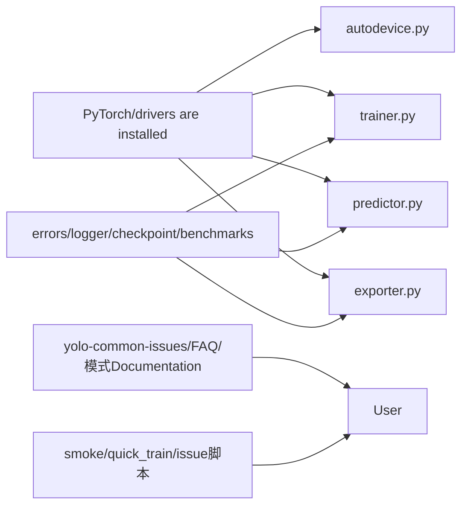

# Troubleshooting and FAQ

<cite>
**Files Referenced in This Document**
- [README.md](file://README.md)
- [CONTRIBUTING.md](file://CONTRIBUTING.md)
- [pyproject.toml](file://pyproject.toml)
- [docker/Dockerfile](file://docker/Dockerfile)
- [ultralytics/utils/errors.py](file://ultralytics/utils/errors.py)
- [ultralytics/utils/logger.py](file://ultralytics/utils/logger.py)
- [ultralytics/utils/autodevice.py](file://ultralytics/utils/autodevice.py)
- [ultralytics/engine/trainer.py](file://ultralytics/engine/trainer.py)
- [ultralytics/engine/predictor.py](file://ultralytics/engine/predictor.py)
- [ultralytics/engine/exporter.py](file://ultralytics/engine/exporter.py)
- [ultralytics/utils/checkpoint_compat.py](file://ultralytics/utils/checkpoint_compat.py)
- [ultralytics/utils/benchmarks.py](file://ultralytics/utils/benchmarks.py)
- [tests/test_error_hierarchy.py](file://tests/test_error_hierarchy.py)
- [tests/test_autobackend_warmup.py](file://tests/test_autobackend_warmup.py)
- [tests/test_export_preflight.py](file://tests/test_export_preflight.py)
- [tests/test_runtime_state_reset.py](file://tests/test_runtime_state_reset.py)
- [tests/test_ddp_device_hardening.py](file://tests/test_ddp_device硬硬化测试.py)
- [tests/test_ddp_error_propagation_e2e.py](file://tests/test_ddp错误传播端到端测试.py)
- [scripts/smoke_test_coco2017.py](file://scripts/smoke_test_coco2017.py)
- [scripts/quick_train_verify.py](file://scripts/quick_train_verify.py)
- [scripts/issue53/probe_visdrone_batch.py](file://scripts/issue53/probe_visdrone_batch.py)
- [scripts/issue53/train_visdrone_issue53.sh](file://scripts/issue53/train_visdrone_issue53.sh)
- [scripts/issue49/yolo_master_issue_49.py](file://scripts/issue49/yolo_master_issue_49.py)
- [docs/en/guides/yolo-common-issues.md](file://docs/en/guides/yolo-common-issues.md)
- [docs/en/help/FAQ.md](file://docs/en/help/FAQ.md)
- [docs/en/guides/docker-quickstart.md](file://docs/en/guides/docker-quickstart.md)
- [docs/en/guides/nvidia-jetson.md](file://docs/en/guides/nvidia-jetson.md)
- [docs/en/guides/raspberry-pi.md](file://docs/en/guides/raspberry-pi.md)
- [docs/en/guides/model-training-tips.md](file://docs/en/guides/model-training-tips.md)
- [docs/en/guides/hyperparameter-tuning.md](file://docs/en/guides/hyperparameter-tuning.md)
- [docs/en/modes/benchmark.md](file://docs/en/modes/benchmark.md)
- [docs/en/modes/export.md](file://docs/en/modes/export.md)
- [docs/en/modes/train.md](file://docs/en/modes/train.md)
- [docs/en/modes/predict.md](file://docs/en/modes/predict.md)
</cite>

## Table of Contents
1. [Introduction](#Introduction)
2. [Project Structure](#Project Structure)
3. [Core Components](#Core Components)
4. [Architecture Overview](#Architecture Overview)
5. [Detailed Component Analysis](#Detailed Component Analysis)
6. [Dependency Analysis](#Dependency Analysis)
7. [性能注意事项](#性能注意事项)
8. [故障排除指南](#故障排除指南)
9. [Conclusion](#Conclusion)
10. [Appendix](#Appendix)

## Introduction
本指南targetingYOLO-MasterUses者，聚焦“Troubleshooting and FAQ”。内容覆盖环境配置、模型加载、Training不收敛、InferenceandExport异常、性能问题（内存溢出、GPU利用率低、Inference慢）、调试技巧and工具、版本兼容性andMigration、硬件相关问题、社区反馈and自助诊断、Bug报告规范Centered onand紧急问题应急响应流程。DocumentationCentered on仓库现有implementing和Documentationfor依据，provides可操作的定位and修复步骤，并辅Centered on流程图帮助快速排障。

## Project Structure
围绕故障排除相关的关键位置：
- 运行时and引擎：Training、Prediction、Exportetc.核心路径位于 engine 子包；Device Selectionand自动后端while utils 中。
- Loggingand错误：统一错误类型andLogging输出while utils 下。
- 兼容性：权重/配置兼容处理while utils/checkpoint_compat.py。
- 基准and诊断：基准脚本andExamples脚本while scripts and tests 中。
- Documentation：常见问题、模式Uses、平台适配etc.while docs 下。

Figure Source
- [ultralytics/engine/trainer.py](file://ultralytics/engine/trainer.py)
- [ultralytics/engine/predictor.py](file://ultralytics/engine/predictor.py)
- [ultralytics/engine/exporter.py](file://ultralytics/engine/exporter.py)
- [ultralytics/utils/errors.py](file://ultralytics/utils/errors.py)
- [ultralytics/utils/logger.py](file://ultralytics/utils/logger.py)
- [ultralytics/utils/autodevice.py](file://ultralytics/utils/autodevice.py)
- [ultralytics/utils/checkpoint_compat.py](file://ultralytics/utils/checkpoint_compat.py)
- [ultralytics/utils/benchmarks.py](file://ultralytics/utils/benchmarks.py)
- [docs/en/guides/yolo-common-issues.md](file://docs/en/guides/yolo-common-issues.md)
- [scripts/smoke_test_coco2017.py](file://scripts/smoke_test_coco2017.py)

Section Source
- [README.md](file://README.md)
- [pyproject.toml](file://pyproject.toml)
- [docker/Dockerfile](file://docker/Dockerfile)

## Core Components
- 错误体系andLogging：统一的异常层次结构andLogging输出，便于定位问题and上报。
- 设备and后端：Automatic Device Selectionand预热，减少首次运行开销and设备误配。
- Trainer：Training流程、断点恢复、EMA、分布式容错and根因上报。
- Predictor：Inference路径、批处理、VisualizationandResults Object。
- Exporter：多格式Export、预检andcapabilities矩阵校验。
- 兼容性：权重and配置版本兼容检测andTips。
- 基准and诊断：基准评测and回归脚本，辅助性能and稳定性Validation。

Section Source
- [ultralytics/utils/errors.py](file://ultralytics/utils/errors.py)
- [ultralytics/utils/logger.py](file://ultralytics/utils/logger.py)
- [ultralytics/utils/autodevice.py](file://ultralytics/utils/autodevice.py)
- [ultralytics/engine/trainer.py](file://ultralytics/engine/trainer.py)
- [ultralytics/engine/predictor.py](file://ultralytics/engine/predictor.py)
- [ultralytics/engine/exporter.py](file://ultralytics/engine/exporter.py)
- [ultralytics/utils/checkpoint_compat.py](file://ultralytics/utils/checkpoint_compat.py)
- [ultralytics/utils/benchmarks.py](file://ultralytics/utils/benchmarks.py)

## Architecture Overview
下图展示从UserCallsto引擎执行、再to错误andLogging输出的关键路径，有助于理解问题发生的位置and传播方式。

Figure Source
- [ultralytics/engine/predictor.py](file://ultralytics/engine/predictor.py)
- [ultralytics/engine/trainer.py](file://ultralytics/engine/trainer.py)
- [ultralytics/engine/exporter.py](file://ultralytics/engine/exporter.py)
- [ultralytics/utils/autodevice.py](file://ultralytics/utils/autodevice.py)
- [ultralytics/utils/logger.py](file://ultralytics/utils/logger.py)
- [ultralytics/utils/errors.py](file://ultralytics/utils/errors.py)

## Detailed Component Analysis

### 错误体系andLogging
- 目标：for所有Modulesprovides一致的异常类型andLogging接口，确保问题可追溯、可分类、可上报。
- 关键点：
  - 统一错误基类and分层异常，便于上层捕获and转换。
  - 结构化Logging输出，包含上下文信息（设备、批次、路径etc.）。
  - andDistributed Training的错误传播Combining，提升根因定位效率。

Figure Source
- [ultralytics/utils/errors.py](file://ultralytics/utils/errors.py)
- [ultralytics/utils/logger.py](file://ultralytics/utils/logger.py)

Section Source
- [ultralytics/utils/errors.py](file://ultralytics/utils/errors.py)
- [ultralytics/utils/logger.py](file://ultralytics/utils/logger.py)
- [tests/test_error_hierarchy.py](file://tests/test_error_hierarchy.py)

### Device Selectionand预热
- 目标：自动选择可用设备并预热，避免首次运行抖动and显存碎片化。
- 关键点：
  - 自动探测CPU/GPU/MPSdevices可用性。
  - 预热阶段进行最小计算图构建and缓存，降低首帧延迟。
  - whileExportandInference前进行预检，防止运行时失败。

Figure Source
- [ultralytics/utils/autodevice.py](file://ultralytics/utils/autodevice.py)
- [tests/test_autobackend_warmup.py](file://tests/test_autobackend_warmup.py)

Section Source
- [ultralytics/utils/autodedevice.py](file://ultralytics/utils/autodevice.py)
- [tests/test_autobackend_warmup.py](file://tests/test_autobackend_warmup.py)

### Trainerand分布式容错
- 目标：provides稳定的Training流程，Supporting断点恢复、EMA、分布式容错and根因上报。
- 关键点：
  - Training循环中的异常捕获and上下文收集，便于定位OOM、Gradient爆炸、数据损坏etc.问题。
  - 分布式场景下的错误传播and根因聚合，避免“黑盒”失败。
  - and权重兼容Modules联动，处理旧版权重加载问题。

Figure Source
- [ultralytics/engine/trainer.py](file://ultralytics/engine/trainer.py)
- [ultralytics/utils/autodevice.py](file://ultralytics/utils/autodevice.py)
- [ultralytics/utils/checkpoint_compat.py](file://ultralytics/utils/checkpoint_compat.py)
- [ultralytics/utils/logger.py](file://ultralytics/utils/logger.py)
- [ultralytics/utils/errors.py](file://ultralytics/utils/errors.py)

Section Source
- [ultralytics/engine/trainer.py](file://ultralytics/engine/trainer.py)
- [ultralytics/utils/checkpoint_compat.py](file://ultralytics/utils/checkpoint_compat.py)
- [tests/test_ddp_device硬硬化测试.py](file://tests/test_ddp_device硬硬化测试.py)
- [tests/test_ddp错误传播端to端测试.py](file://tests/test_ddp错误传播端到端测试.py)

### PredictorandInference路径
- 目标：稳定高效的Inference流程，Supporting批处理、VisualizationandResults Object。
- 关键点：
  - 设备预热and输入预处理Optimization。
  - Results ObjectEncapsulates，便于后续分析andVisualization。
  - andExport产物对接，确保格式一致。

Figure Source
- [ultralytics/engine/predictor.py](file://ultralytics/engine/predictor.py)

Section Source
- [ultralytics/engine/predictor.py](file://ultralytics/engine/predictor.py)

### Exporterand预检
- 目标：将Model Exportfor多种部署格式，并whileExport前进行capabilitiesand兼容性预检。
- 关键点：
  - Exportcapabilities矩阵校验，避免不Supporting的算子或特性。
  - 预检失败时给出明确修复建议（such as关闭某特性、降级精度）。
  - andDevice Selection联动，确保Export环境and运行环境一致。

Figure Source
- [ultralytics/engine/exporter.py](file://ultralytics/engine/exporter.py)
- [tests/test_export_preflight.py](file://tests/test_export_preflight.py)

Section Source
- [ultralytics/engine/exporter.py](file://ultralytics/engine/exporter.py)
- [tests/test_export_preflight.py](file://tests/test_export_preflight.py)

## Dependency Analysis
- External Dependenciesand环境：
  - PythonandPyTorch版本约束见项目配置文件。
  - Docker镜像用于隔离环境，保证一致性。
- 内部依赖：
  - Engine Layer依赖utilsprovides的错误、Logging、设备、兼容and基准工具。
  - Documentationand脚本作forUser侧辅助，增强可观测性and可复现性。

Figure Source
- [pyproject.toml](file://pyproject.toml)
- [docker/Dockerfile](file://docker/Dockerfile)
- [ultralytics/utils/autodevice.py](file://ultralytics/utils/autodevice.py)
- [ultralytics/engine/trainer.py](file://ultralytics/engine/trainer.py)
- [ultralytics/engine/predictor.py](file://ultralytics/engine/predictor.py)
- [ultralytics/engine/exporter.py](file://ultralytics/engine/exporter.py)
- [ultralytics/utils/errors.py](file://ultralytics/utils/errors.py)
- [ultralytics/utils/logger.py](file://ultralytics/utils/logger.py)
- [ultralytics/utils/checkpoint_compat.py](file://ultralytics/utils/checkpoint_compat.py)
- [ultralytics/utils/benchmarks.py](file://ultralytics/utils/benchmarks.py)
- [docs/en/guides/yolo-common-issues.md](file://docs/en/guides/yolo-common-issues.md)
- [docs/en/help/FAQ.md](file://docs/en/help/FAQ.md)
- [scripts/smoke_test_coco2017.py](file://scripts/smoke_test_coco2017.py)

Section Source
- [pyproject.toml](file://pyproject.toml)
- [docker/Dockerfile](file://docker/Dockerfile)

## 性能注意事项
- 内存溢出（OOM）：
  - 降低batch size、输入分辨率或启用Mixture精度。
  - 检查Data Loadingand预处理是否造成额外内存峰值。
  - Uses基准脚本Evaluation不同配置的显存占用。
- GPU利用率低：
  - 增大批大小至设备饱和，但需监控显存。
  - 确认I/Obottlenecks（磁盘/网络），必要时Uses缓存或并行加载。
  - UsesExportOptimizationandInference后端加速。
- Inference速度慢：
  - UsesExport后的Optimization格式（such asONNX/TensorRT/OpenVINOetc.）。
  - 开启预热and批处理，减少首帧延迟。
  - 调整NMSand阈值Centered on减少Post-Processing开销。

Section Source
- [ultralytics/utils/benchmarks.py](file://ultralytics/utils/benchmarks.py)
- [docs/en/modes/benchmark.md](file://docs/en/modes/benchmark.md)
- [docs/en/modes/export.md](file://docs/en/modes/export.md)
- [docs/en/modes/predict.md](file://docs/en/modes/predict.md)

## 故障排除指南

### 环境配置问题
- 症状：导入失败、CUDA不可用、drivers are installed版本不匹配。
- 诊断：
  - 检查PythonandPyTorch版本约束。
  - UsesDocker镜像快速搭建一致环境。
  - 查看Device Selectionand预热Logging，确认GPU被正确识别。
- 修复：
  - 升级/降级drivers are installedandCUDA版本，遵循官方要求。
  - Uses容器化方案避免本地环境差异。
  - Refer to常见问题andFAQDocumentation中的环境章节。

Section Source
- [pyproject.toml](file://pyproject.toml)
- [docker/Dockerfile](file://docker/Dockerfile)
- [docs/en/guides/docker-quickstart.md](file://docs/en/guides/docker-quickstart.md)
- [docs/en/guides/yolo-common-issues.md](file://docs/en/guides/yolo-common-issues.md)
- [docs/en/help/FAQ.md](file://docs/en/help/FAQ.md)

### 模型加载错误
- 症状：权重文件无法加载、键名不匹配、形状不一致。
- 诊断：
  - 查看权重兼容Modules的Tipsand回退策略。
  - 核对模型版本and权重来源是否一致。
- 修复：
  - Uses兼容工具或更新权重。
  - 若for自定义权重，确保命名and结构符合当前期望。

Section Source
- [ultralytics/utils/checkpoint_compat.py](file://ultralytics/utils/checkpoint_compat.py)

### Training不收敛
- 症状：损失震荡、不下降、NaN/Inf。
- 诊断：
  - 检查Learning Rate、批大小and数据质量。
  - 查看TrainingLoggingand中间Metrics，定位异常步。
  - Uses快速TrainingValidation脚本进行最小复现。
- 修复：
  - 调整超参数（Learning Rate、衰减、正则化）。
  - 减小输入分辨率或批大小Centered on避免数值不稳定。
  - Refer toTraining技巧and调参指南。

Section Source
- [ultralytics/engine/trainer.py](file://ultralytics/engine/trainer.py)
- [scripts/quick_train_verify.py](file://scripts/quick_train_verify.py)
- [docs/en/guides/model-training-tips.md](file://docs/en/guides/model-training-tips.md)
- [docs/en/guides/hyperparameter-tuning.md](file://docs/en/guides/hyperparameter-tuning.md)

### Inference速度慢
- 症状：单帧延迟高、吞吐低。
- 诊断：
  - Uses基准脚本测量不同后端and配置的性能。
  - 检查预处理andPost-Processing耗时占比。
- 修复：
  - Exporting toOptimization格式并启用相应后端。
  - 调整批大小and分辨率，平衡延迟and吞吐。
  - 预热模型and后端，减少冷启动开销。

Section Source
- [ultralytics/utils/benchmarks.py](file://ultralytics/utils/benchmarks.py)
- [docs/en/modes/benchmark.md](file://docs/en/modes/benchmark.md)
- [docs/en/modes/export.md](file://docs/en/modes/export.md)
- [docs/en/modes/predict.md](file://docs/en/modes/predict.md)

### 内存溢出（OOM）
- 症状：进程崩溃、显存耗尽。
- 诊断：
  - 逐步降低批大小and分辨率，观察变化。
  - 检查Data Loadingand缓存策略。
- 修复：
  - 减小批大小、分辨率或启用Mixture精度。
  - 清理不必要的中间变量and缓存。
  - UsesExportOptimization减少运行时开销。

Section Source
- [ultralytics/engine/trainer.py](file://ultralytics/engine/trainer.py)
- [ultralytics/engine/predictor.py](file://ultralytics/engine/predictor.py)

### GPU利用率低
- 症状：GPU占用率低、Training/Inference缓慢。
- 诊断：
  - Uses基准脚本对比不同批大小and后端。
  - 检查I/ObottlenecksandData Preparation速度。
- 修复：
  - 增大批大小直至GPU饱和。
  - OptimizationData Pipeline，Uses缓存and并行加载。
  - UsesExportOptimizationand专用后端。

Section Source
- [ultralytics/utils/benchmarks.py](file://ultralytics/utils/benchmarks.py)
- [docs/en/modes/benchmark.md](file://docs/en/modes/benchmark.md)

### Export Failure
- 症状：Export中断、格式不Supporting、算子缺失。
- 诊断：
  - 查看Export预检结果andcapabilities矩阵。
  - 根据Tips关闭不Supporting的特性或降级精度。
- 修复：
  - 调整Export选项，确保and目标后端兼容。
  - 更新依赖and后端版本。

Section Source
- [ultralytics/engine/exporter.py](file://ultralytics/engine/exporter.py)
- [tests/test_export_preflight.py](file://tests/test_export_preflight.py)
- [docs/en/modes/export.md](file://docs/en/modes/export.md)

### Distributed Training错误
- 症状：节点间通信失败、根因不明确。
- 诊断：
  - 查看分布式错误传播and根因上报Logging。
  - 检查设备硬化工具and容错机制。
- 修复：
  - 修正网络and设备配置。
  - Uses最小复现实例Validation分布式环境。

Section Source
- [tests/test_ddp错误传播端to端测试.py](file://tests/test_ddp错误传播端到端测试.py)
- [tests/test_ddp_device硬硬化测试.py](file://tests/test_ddp_device硬硬化测试.py)

### 运行时状态异常
- 症状：多次Inference/Training后状态污染、结果异常。
- 诊断：
  - Uses运行时状态重置测试Validation清理逻辑。
- 修复：
  - whileTasks间显式重置状态或重启进程。

Section Source
- [tests/test_runtime_state_reset.py](file://tests/test_runtime_state_reset.py)

### 硬件相关问题
- Jetson/Raspberry Pi：
  - Refer to平台适配Documentation，安装对应依赖and后端。
  - 注意内存and算力限制，调整分辨率and批大小。
- 其他边缘设备：
  - UsesExportOptimizationand专用Inference后端。
  - Refer toEdge DeploymentExamplesand说明。

Section Source
- [docs/en/guides/nvidia-jetson.md](file://docs/en/guides/nvidia-jetson.md)
- [docs/en/guides/raspberry-pi.md](file://docs/en/guides/raspberry-pi.md)

### 社区反馈and官方回复
- 常见问题andFAQ：
  - 查阅常见问题andFAQDocumentation，获取已收录问题的解决方案。
- 贡献and反馈渠道：
  - Refer toContributing Guide了解such as何提交问题and建议。

Section Source
- [docs/en/guides/yolo-common-issues.md](file://docs/en/guides/yolo-common-issues.md)
- [docs/en/help/FAQ.md](file://docs/en/help/FAQ.md)
- [CONTRIBUTING.md](file://CONTRIBUTING.md)

### 自助诊断工具and脚本
- 冒烟测试：
  - UsesCOCO2017冒烟脚本快速Validation环境、数据and模型链路。
- 快速TrainingValidation：
  - Uses快速TrainingValidation脚本进行最小复现and收敛性检查。
- 问题复现脚本：
  - issue49andissue53相关脚本用于特定问题的复现and定位。
- 基准评测：
  - Uses基准脚本Evaluation不同配置的性能and资源占用。

Section Source
- [scripts/smoke_test_coco2017.py](file://scripts/smoke_test_coco2017.py)
- [scripts/quick_train_verify.py](file://scripts/quick_train_verify.py)
- [scripts/issue49/yolo_master_issue_49.py](file://scripts/issue49/yolo_master_issue_49.py)
- [scripts/issue53/probe_visdrone_batch.py](file://scripts/issue53/probe_visdrone_batch.py)
- [scripts/issue53/train_visdrone_issue53.sh](file://scripts/issue53/train_visdrone_issue53.sh)
- [ultralytics/utils/benchmarks.py](file://ultralytics/utils/benchmarks.py)

### 提交有效的Bug报告and问题反馈
- 必备信息：
  - 环境信息（Operating System、Python/PyTorch版本、drivers are installed/后端）。
  - 复现步骤and最小代码片段。
  - 完整Loggingand错误堆栈。
  - 数据集and模型版本信息。
- 提交渠道：
  - Refer toContributing Guide中的问题反馈流程。

Section Source
- [CONTRIBUTING.md](file://CONTRIBUTING.md)

### 紧急问题应急响应流程
- 快速止损：
  - 回滚to已知稳定版本或权重。
  - 切换至备用后端或降级配置。
- 定位and修复：
  - Uses冒烟and快速TrainingValidation脚本确认问题范围。
  - 查看错误andLogging，定位根因。
- 复盘and改进：
  - 补充回归测试and预检规则。
  - 更新DocumentationandFAQ，避免重复问题。

Section Source
- [scripts/smoke_test_coco2017.py](file://scripts/smoke_test_coco2017.py)
- [scripts/quick_train_verify.py](file://scripts/quick_train_verify.py)
- [ultralytics/utils/errors.py](file://ultralytics/utils/errors.py)
- [ultralytics/utils/logger.py](file://ultralytics/utils/logger.py)

## Conclusion
through a unified错误andLogging体系、设备预热and预检、分布式容错and根因上报、Centered onand完善的Documentationand脚本，YOLO-Masterprovides了强大的故障排除capabilities。建议while日常Uses中优先借助基准and冒烟脚本进行健康检查，遇to问题时按本文步骤逐步定位and修复，并and时反馈至社区Centered on完善知识库。

## Appendix
- 常用命令and路径：
  - Training模式Documentation：[Training模式](file://docs/en/modes/train.md)
  - Prediction模式Documentation：[Prediction模式](file://docs/en/modes/predict.md)
  - Export模式Documentation：[Export模式](file://docs/en/modes/export.md)
  - 基准模式Documentation：[基准模式](file://docs/en/modes/benchmark.md)
- 平台适配：
  - DockerQuick Start：[DockerQuick Start](file://docs/en/guides/docker-quickstart.md)
  - Jetson适配：[Jetson](file://docs/en/guides/nvidia-jetson.md)
  - Raspberry Pi适配：[Raspberry Pi](file://docs/en/guides/raspberry-pi.md)