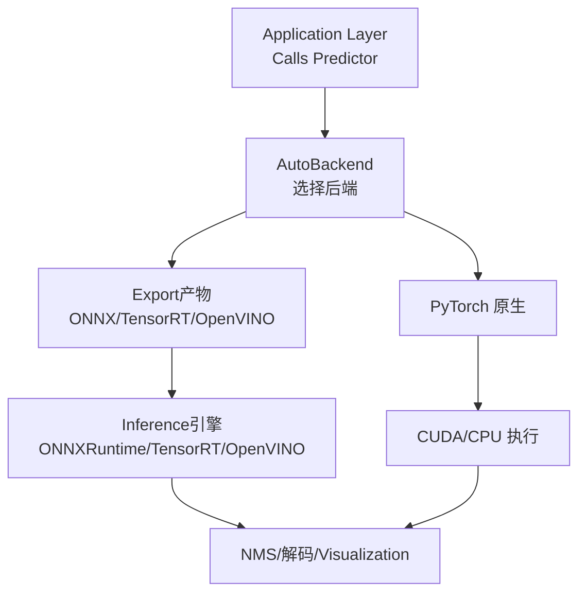
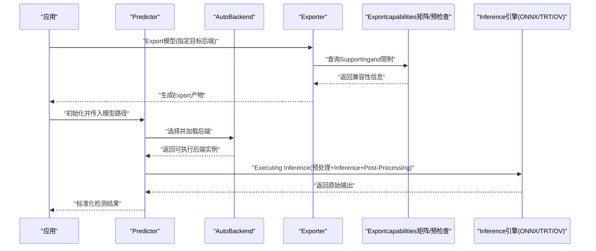
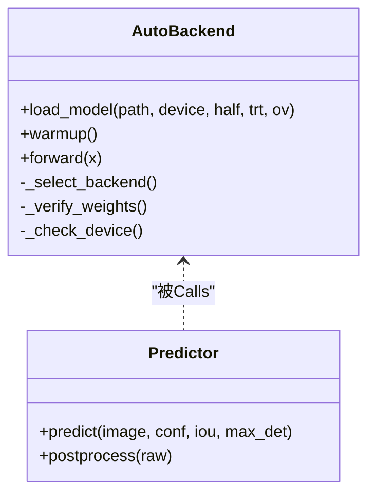
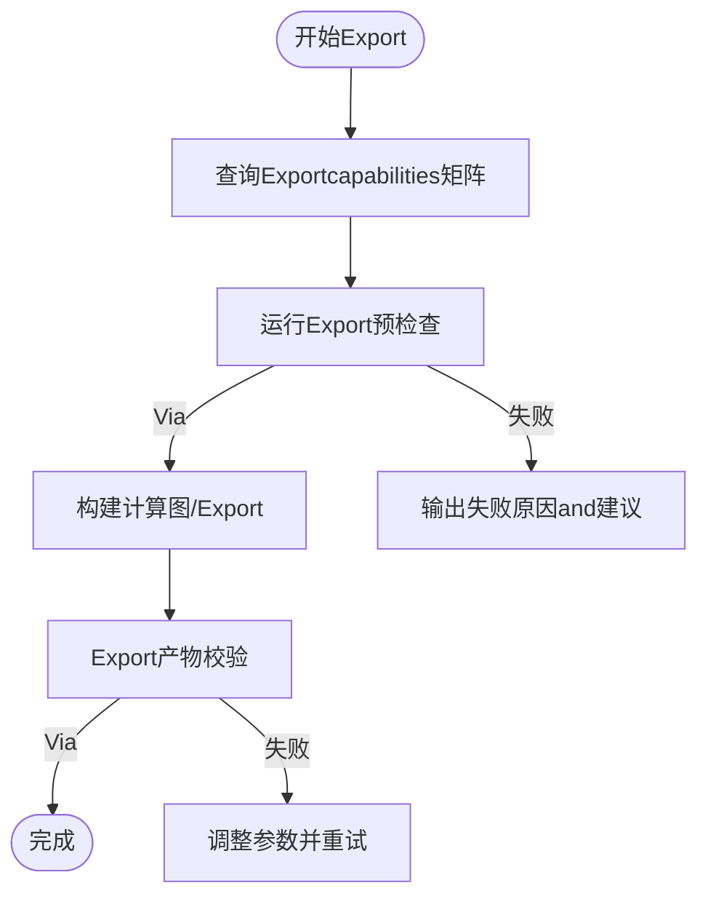
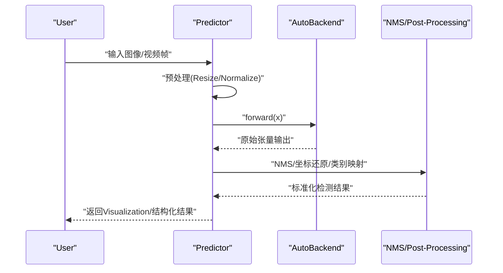
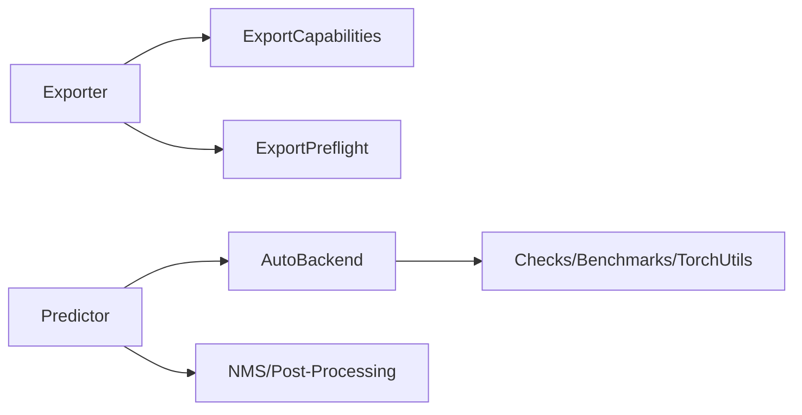
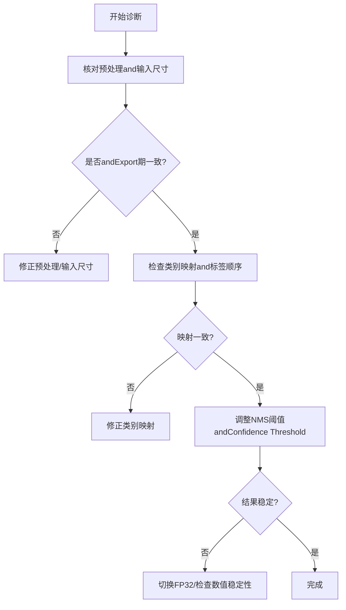

# Inference问题排查

<cite>
**Files Referenced in This Document**
- [README.md](file://README.md)
- [engine/exporter.py](file://ultralytics/engine/exporter.py)
- [engine/predictor.py](file://ultralytics/engine/predictor.py)
- [nn/autobackend.py](file://ultralytics/nn/autobackend.py)
- [utils/export_capabilities.py](file://ultralytics/utils/export_capabilities.py)
- [utils/export_preflight.py](file://ultralytics/utils/export_preflight.py)
- [utils/checks.py](file://ultralytics/utils/checks.py)
- [utils/benchmarks.py](file://ultralytics/utils/benchmarks.py)
- [utils/nms.py](file://ultralytics/utils/nms.py)
- [utils/torch_utils.py](file://ultralytics/utils/torch_utils.py)
- [examples/YOLOv8-ONNXRuntime/main.py](file://examples/YOLOv8-ONNXRuntime/main.py)
- [examples/YOLOv8-OpenVINO-CPP-Inference/inference.cc](file://examples/YOLOv8-OpenVINO-CPP-Inference/inference.cc)
- [examples/YOLO-Master-Edge-Deployment/export_edge_models.py](file://examples/YOLO-Master-Edge-Deployment/export_edge_models.py)
- [examples/YOLO-Master-Edge-Deployment/validate_edge_outputs.py](file://examples/YOLO-Master-Edge-Deployment/validate_edge_outputs.py)
- [tests/test_autobackend_warmup.py](file://tests/test_autobackend_warmup.py)
- [tests/test_export_preflight.py](file://tests/test_export_preflight.py)
- [tests/test_exports.py](file://tests/test_exports.py)
- [tests/test_onnx_export_fix.py](file://tests/test_onnx_export_fix.py)
- [tests/test_engine.py](file://tests/test_engine.py)
</cite>

## Table of Contents
1. [Introduction](#Introduction)
2. [Project Structure](#Project Structure)
3. [Core Components](#Core Components)
4. [Architecture Overview](#Architecture Overview)
5. [Detailed Component Analysis](#Detailed Component Analysis)
6. [Dependency Analysis](#Dependency Analysis)
7. [性能考量](#性能考量)
8. [Troubleshooting Guide](#Troubleshooting Guide)
9. [Conclusion](#Conclusion)
10. [Appendix](#Appendix)

## Introduction
本指南targetingUses YOLO-Master 进行模型Inferenceand部署的Engineers，聚焦“Inference问题排查”。内容覆盖：
- 模型加载失败的常见原因（权重损坏、格式不兼容、版本不匹配）
- Inference结果异常的诊断方法（检测框偏移、类别Prediction错误、置信度异常）
- 不同Export格式的兼容性and注意事项（ONNX、TensorRT、OpenVINO etc.）
- 实时Inference PerformanceOptimization建议（批大小、输入尺寸、内存管理）
- 移动端andEdge Device Deployment的典型问题and解决方案
- 多线程Inferenceand并发处理的常见问题andOptimization策略

## Project Structure
本项目围绕“Training-Export-Inference”的全链路构建。andInference相关的关键路径包括：
- Exportcapabilities矩阵and预检查：用于whileExport前校验目标后端Supporting情况
- AutoBackend：运行时自动选择最优后端（TorchScript/ONNX/TensorRT/OpenVINO etc.）
- Predictor：统一Inference入口，Encapsulates预处理、Inference、Post-ProcessingandVisualization
- Examples工程：provides ONNXRuntime、OpenVINO C++、边缘端ExportandValidation脚本

Figure Source
- [engine/predictor.py](file://ultralytics/engine/predictor.py)
- [nn/autobackend.py](file://ultralytics/nn/autobackend.py)
- [utils/export_capabilities.py](file://ultralytics/utils/export_capabilities.py)

Section Source
- [README.md](file://README.md)
- [engine/exporter.py](file://ultralytics/engine/exporter.py)
- [utils/export_capabilities.py](file://ultralytics/utils/export_capabilities.py)
- [utils/export_preflight.py](file://ultralytics/utils/export_preflight.py)

## Core Components
- AutoBackend：负责根据可用环境and模型后缀自动选择并加载对应后端，完成权重载入、设备Migrationand预热。
- Predictor：统一Inference接口，包含数据预处理、模型Inference、Post-Processing（NMS/坐标还原）、结果EncapsulatesandVisualization。
- Exporter：将 PyTorch Model Exportfor多种格式，并whileExport前后进行capabilities校验and兼容性检查。
- Exportcapabilities矩阵and预检查：维护各后端对模型特性、算子、精度的Supporting矩阵；whileExport前进行可行性Evaluation。
- 工具库：环境检查、基准测试、NMS、数值稳定性辅助etc.。

Section Source
- [nn/autobackend.py](file://ultralytics/nn/autobackend.py)
- [engine/predictor.py](file://ultralytics/engine/predictor.py)
- [engine/exporter.py](file://ultralytics/engine/exporter.py)
- [utils/export_capabilities.py](file://ultralytics/utils/export_capabilities.py)
- [utils/export_preflight.py](file://ultralytics/utils/export_preflight.py)
- [utils/nms.py](file://ultralytics/utils/nms.py)
- [utils/benchmarks.py](file://ultralytics/utils/benchmarks.py)
- [utils/checks.py](file://ultralytics/utils/checks.py)

## Architecture Overview
下图展示了从“Export”to“Inference”的关键流程and组件交互。

Figure Source
- [engine/exporter.py](file://ultralytics/engine/exporter.py)
- [utils/export_capabilities.py](file://ultralytics/utils/export_capabilities.py)
- [utils/export_preflight.py](file://ultralytics/utils/export_preflight.py)
- [nn/autobackend.py](file://ultralytics/nn/autobackend.py)
- [engine/predictor.py](file://ultralytics/engine/predictor.py)

## Detailed Component Analysis

### 组件A：AutoBackend and模型加载
- 职责：根据模型后缀and环境可用性，自动选择 TorchScript/ONNX/TensorRT/OpenVINO etc.后端，完成权重加载、设备绑定and预热。
- 关键点：
  - 权重完整性校验（文件大小、哈希或可读性）
  - 后端capabilities探测（GPU/drivers are installed/引擎版本）
  - 精度and数据类型一致性（FP32/FP16/INT8）
  - 预热and缓存（避免首次Inference抖动）

Figure Source
- [nn/autobackend.py](file://ultralytics/nn/autobackend.py)
- [engine/predictor.py](file://ultralytics/engine/predictor.py)

Section Source
- [nn/autobackend.py](file://ultralytics/nn/autobackend.py)
- [tests/test_autobackend_warmup.py](file://tests/test_autobackend_warmup.py)

### 组件B：Exporterandcapabilities矩阵
- 职责：将 PyTorch Model Exportfor目标后端格式，并whileExport前进行capabilitiesand兼容性检查。
- 关键点：
  - Export参数（动态轴、输入尺寸、精度、算子白名单）
  - capabilities矩阵（后端是否Supporting当前模型结构and配置）
  - 预检查（Export前失败快速反馈）
  - Export产物校验（形状、dtype、关键节点）

Figure Source
- [engine/exporter.py](file://ultralytics/engine/exporter.py)
- [utils/export_capabilities.py](file://ultralytics/utils/export_capabilities.py)
- [utils/export_preflight.py](file://ultralytics/utils/export_preflight.py)

Section Source
- [engine/exporter.py](file://ultralytics/engine/exporter.py)
- [utils/export_capabilities.py](file://ultralytics/utils/export_capabilities.py)
- [utils/export_preflight.py](file://ultralytics/utils/export_preflight.py)
- [tests/test_export_preflight.py](file://tests/test_export_preflight.py)
- [tests/test_exports.py](file://tests/test_exports.py)
- [tests/test_onnx_export_fix.py](file://tests/test_onnx_export_fix.py)

### 组件C：Inference流水线andPost-Processing
- 职责：统一Encapsulates预处理、Inference、Post-Processing（NMS、坐标还原、类别映射）and结果Visualization。
- 关键点：
  - 输入尺寸and归一化（保持andTraining一致）
  - NMS 阈值and最大检测数
  - 坐标还原（缩放回原图尺寸）
  - 类别索引and标签映射一致性

Figure Source
- [engine/predictor.py](file://ultralytics/engine/predictor.py)
- [utils/nms.py](file://ultralytics/utils/nms.py)

Section Source
- [engine/predictor.py](file://ultralytics/engine/predictor.py)
- [utils/nms.py](file://ultralytics/utils/nms.py)

## Dependency Analysis
- Export阶段依赖capabilities矩阵and预检查，确保目标后端可正确解析模型结构and算子。
- Inference阶段依赖 AutoBackend 选择合适后端，并and NMS/Post-ProcessingModules协作。
- 工具库贯穿全流程：环境检查、基准测试、数值稳定andLogging。

Figure Source
- [engine/exporter.py](file://ultralytics/engine/exporter.py)
- [utils/export_capabilities.py](file://ultralytics/utils/export_capabilities.py)
- [utils/export_preflight.py](file://ultralytics/utils/export_preflight.py)
- [engine/predictor.py](file://ultralytics/engine/predictor.py)
- [nn/autobackend.py](file://ultralytics/nn/autobackend.py)
- [utils/nms.py](file://ultralytics/utils/nms.py)
- [utils/checks.py](file://ultralytics/utils/checks.py)
- [utils/benchmarks.py](file://ultralytics/utils/benchmarks.py)
- [utils/torch_utils.py](file://ultralytics/utils/torch_utils.py)

Section Source
- [utils/export_capabilities.py](file://ultralytics/utils/export_capabilities.py)
- [utils/export_preflight.py](file://ultralytics/utils/export_preflight.py)
- [utils/checks.py](file://ultralytics/utils/checks.py)
- [utils/benchmarks.py](file://ultralytics/utils/benchmarks.py)
- [utils/torch_utils.py](file://ultralytics/utils/torch_utils.py)

## 性能考量
- 批处理大小：while GPU 上适度增大 batch 提升吞吐，但需关注显存占用and延迟权衡。
- 输入尺寸：减小输入分辨率可显著降低计算量，但可能影响小目标召回。
- 精度and量化：FP16/INT8 可加速Inference，需校准集and端to端精度Validation。
- 内存管理：复用输入缓冲区、减少中间拷贝、避免频繁设备切换。
- 预热and缓存：首次Inference预热，固定输入尺寸Centered on减少重编译开销。
- I/O and解码：视频流解码and预处理并行化，避免阻塞Inference线程。

[本节for通用指导，无需具体文件引用]

## Troubleshooting Guide

### 一、模型加载失败
常见原因and定位步骤：
- 权重文件损坏或不完整
  - 现象：加载时报错、断言失败、形状不匹配
  - 排查：核对文件大小/哈希；尝试重新下载；确认路径and权限
  - Refer toimplementing位置：权重校验and设备检查逻辑
- 格式不兼容
  - 现象：后端无法解析模型或算子不Supporting
  - 排查：查看Exportcapabilities矩阵and预检查结果；确认Export参数（动态轴、输入尺寸、精度）
  - Refer toimplementing位置：Exportcapabilities矩阵and预检查
- 版本不匹配
  - 现象：Runtime Dependencies版本andExport时不一致导致崩溃
  - 排查：对齐后端引擎版本（such as TensorRT/OpenVINO）and Python/drivers are installed版本
  - Refer toimplementing位置：环境检查and基准工具

Section Source
- [nn/autobackend.py](file://ultralytics/nn/autobackend.py)
- [utils/export_capabilities.py](file://ultralytics/utils/export_capabilities.py)
- [utils/export_preflight.py](file://ultralytics/utils/export_preflight.py)
- [utils/checks.py](file://ultralytics/utils/checks.py)
- [tests/test_autobackend_warmup.py](file://tests/test_autobackend_warmup.py)

### 二、Inference结果异常
- 检测框偏移
  - 可能原因：预处理 Resize/Pad andPost-Processing坐标还原不一致；输入尺寸andExport期不一致
  - 诊断：打印预处理参数and输入尺寸；对比Export期配置；检查坐标还原缩放比例
  - Refer toimplementing位置：Predictor 预处理andPost-Processing
- 类别Prediction错误
  - 可能原因：类别索引and标签映射不一致；多Tasks/多标签配置差异
  - 诊断：核对类别映射表；检查Export期类别数量andInference期标签顺序
  - Refer toimplementing位置：Predictor 结果EncapsulatesandVisualization
- 置信度异常（过高/过低/NaN）
  - 可能原因：NMS 阈值设置不当；数值不稳定；精度转换引入误差
  - 诊断：调整 conf/iou 阈值；启用 FP32 复测；检查 NMS implementingand数值稳定性
  - Refer toimplementing位置：NMS and数值工具

Section Source
- [engine/predictor.py](file://ultralytics/engine/predictor.py)
- [utils/nms.py](file://ultralytics/utils/nms.py)
- [utils/torch_utils.py](file://ultralytics/utils/torch_utils.py)

### 三、Export格式兼容性and注意事项
- ONNX
  - 注意：动态轴and静态输入尺寸的选择；算子版本and opset；Export后形状and dtype 校验
  - Refer to：Exportcapabilities矩阵、预检查and ONNX 修复用例
- TensorRT
  - 注意：精度（FP16/INT8）and校准集；引擎版本and GPU 架构；输入尺寸and批量上限
  - Refer to：Exportcapabilities矩阵and预检查
- OpenVINO
  - 注意：IR 版本and模型Optimization选项；CPU/GPU/NPU 后端差异；输入尺寸and数据类型
  - Refer to：Examples工程andExportcapabilities矩阵

Section Source
- [engine/exporter.py](file://ultralytics/engine/exporter.py)
- [utils/export_capabilities.py](file://ultralytics/utils/export_capabilities.py)
- [utils/export_preflight.py](file://ultralytics/utils/export_preflight.py)
- [tests/test_onnx_export_fix.py](file://tests/test_onnx_export_fix.py)
- [tests/test_exports.py](file://tests/test_exports.py)

### 四、实时Inference PerformanceOptimization
- 批大小and输入尺寸调优：Centered on端to端延迟and吞吐for目标，Combining业务场景做折中
- 内存andI/OOptimization：复用缓冲区、异步解码、零拷贝路径
- 精度and量化：优先 FP16，必要时 INT8 并严格回归Validation
- 预热and缓存：固定输入尺寸，避免重复编译；首帧预热
- 监控and基准：Uses基准工具采集延迟/吞吐曲线，定位bottlenecks

Section Source
- [utils/benchmarks.py](file://ultralytics/utils/benchmarks.py)
- [utils/checks.py](file://ultralytics/utils/checks.py)

### 五、移动端andEdge Device Deployment
典型问题and解决思路：
- 模型过大或算子不受Supporting
  - 解决：裁剪模型、选择轻量分支、Usescapabilities矩阵筛选可行方案
- 内存不足或带宽受限
  - 解决：降低输入尺寸、减少 batch、量化and剪枝
- 平台差异（ARM/NPU/GPU）
  - 解决：针对目标平台Export专用格式（such as TFLite/CoreML/RKNN），并进行端to端Validation
- ExamplesandValidation
  - Refer to：边缘Export脚本and输出Validation脚本

Section Source
- [examples/YOLO-Master-Edge-Deployment/export_edge_models.py](file://examples/YOLO-Master-Edge-Deployment/export_edge_models.py)
- [examples/YOLO-Master-Edge-Deployment/validate_edge_outputs.py](file://examples/YOLO-Master-Edge-Deployment/validate_edge_outputs.py)
- [utils/export_capabilities.py](file://ultralytics/utils/export_capabilities.py)

### 六、多线程Inferenceand并发处理
常见问题：
- 资源竞争：同一模型实例while多进程/多线程下访问导致状态污染
- 设备冲突：跨线程切换 CUDA 上下文引发崩溃
- 锁and队列：共享队列未加锁或死锁
Optimization策略：
- 每线程/每进程独立模型实例
- 固定设备and上下文，避免运行时切换
- Uses线程安全的数据结构and队列
- Set appropriately线程池大小and批大小，避免过载

Section Source
- [engine/predictor.py](file://ultralytics/engine/predictor.py)
- [nn/autobackend.py](file://ultralytics/nn/autobackend.py)
- [tests/test_engine.py](file://tests/test_engine.py)

### 七、外部Inference引擎集成要点
- ONNXRuntime（Python）
  - 注意：会话创建and输入命名；输入形状and dtype；NMS 节点是否whileExport图中
  - Refer to：Examples工程
- OpenVINO（C++）
  - 注意：Core API and IR 版本；Device Selectionand插件；输入布局and步长
  - Refer to：Examples工程

Section Source
- [examples/YOLOv8-ONNXRuntime/main.py](file://examples/YOLOv8-ONNXRuntime/main.py)
- [examples/YOLOv8-OpenVINO-CPP-Inference/inference.cc](file://examples/YOLOv8-OpenVINO-CPP-Inference/inference.cc)

## Conclusion
Inference问题的定位应遵循“Exportcapabilities先行、加载环境校验、Inference链路分段Validation”的原则。Viacapabilities矩阵and预检查规避不可行方案；Via AutoBackend and Predictor 的分层职责隔离问题域；借助基准and工具链持续监控性能and稳定性。对于边缘and移动端，务必Centered on目标平台for导向进行ExportandValidation，确保端to端一致性and鲁棒性。

## Appendix
- 常用命令and脚本路径（Examples）
  - Exportand预检查：见Exporterand预检查Modules
  - 边缘ExportandValidation：见Edge DeploymentExamples
  - 外部引擎集成：见 ONNXRuntime and OpenVINO Examples
- Refer toDocumentationand测试
  - Exportcapabilities矩阵and预检查用例
  - 引擎and后端相关测试

Section Source
- [engine/exporter.py](file://ultralytics/engine/exporter.py)
- [utils/export_capabilities.py](file://ultralytics/utils/export_capabilities.py)
- [utils/export_preflight.py](file://ultralytics/utils/export_preflight.py)
- [examples/YOLO-Master-Edge-Deployment/export_edge_models.py](file://examples/YOLO-Master-Edge-Deployment/export_edge_models.py)
- [examples/YOLO-Master-Edge-Deployment/validate_edge_outputs.py](file://examples/YOLO-Master-Edge-Deployment/validate_edge_outputs.py)
- [examples/YOLOv8-ONNXRuntime/main.py](file://examples/YOLOv8-ONNXRuntime/main.py)
- [examples/YOLOv8-OpenVINO-CPP-Inference/inference.cc](file://examples/YOLOv8-OpenVINO-CPP-Inference/inference.cc)
- [tests/test_export_preflight.py](file://tests/test_export_preflight.py)
- [tests/test_exports.py](file://tests/test_exports.py)
- [tests/test_onnx_export_fix.py](file://tests/test_onnx_export_fix.py)
- [tests/test_engine.py](file://tests/test_engine.py)