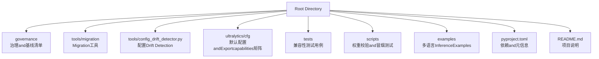
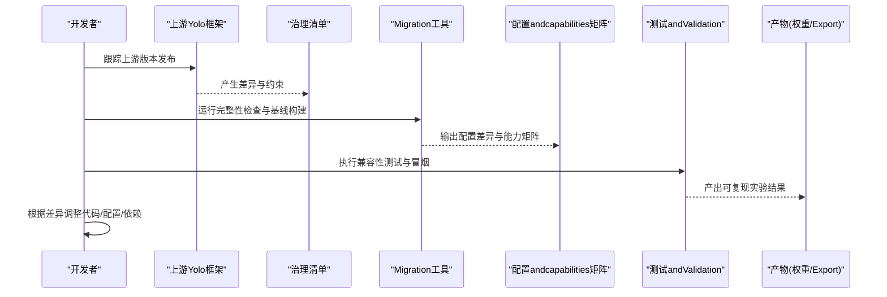
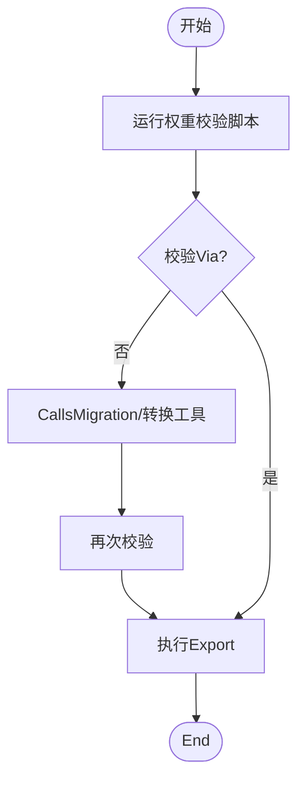
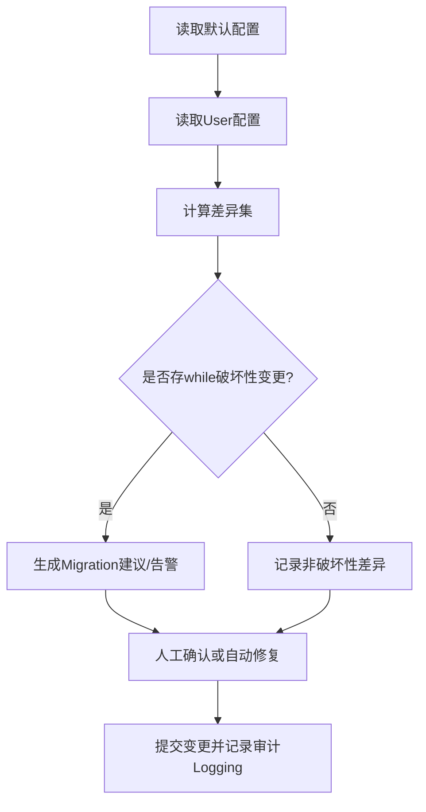
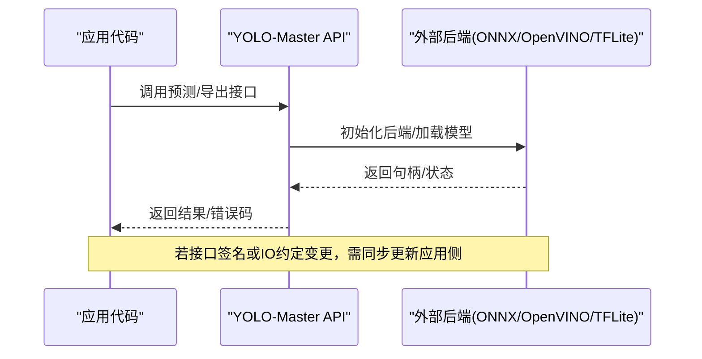

# 版本兼容性andMigration

<cite>
**Files Referenced in This Document**
- [pyproject.toml](file://pyproject.toml)
- [README.md](file://README.md)
- [YOLO-Master-v260720-兼容性Validation报告.md](file://YOLO-Master-v260720-兼容性验证报告.md)
- [governance/upstream-v8.4.101-manifest.json](file://governance/upstream-v8.4.101-manifest.json)
- [tools/migration/build_native_baseline.py](file://tools/migration/build_native_baseline.py)
- [tools/migration/check_upstream_integrity.py](file://tools/migration/check_upstream_integrity.py)
- [tools/config_drift_detector.py](file://tools/config_drift_detector.py)
- [tests/test_checkpoint_compat.py](file://tests/test_checkpoint_compat.py)
- [ultralytics/utils/checkpoint_compat.py](file://ultralytics/utils/checkpoint_compat.py)
- [ultralytics/cfg/default.yaml](file://ultralytics/cfg/default.yaml)
- [ultralytics/cfg/export-capability-matrix.yaml](file://ultralytics/cfg/export-capability-matrix.yaml)
- [scripts/verify_yolo_master_weight.py](file://scripts/verify_yolo_master_weight.py)
- [scripts/smoke_test_coco2017.py](file://scripts/smoke_test_coco2017.py)
- [examples/YOLOv8-ONNXRuntime-Python/main.py](file://examples/YOLOv8-ONNXRuntime-Python/main.py)
- [examples/YOLOv8-OpenVINO-CPP-Inference/inference.cc](file://examples/YOLOv8-OpenVINO-CPP-Inference/inference.cc)
- [examples/YOLOv8-ONNXRuntime-Rust/src/lib.rs](file://examples/YOLOv8-ONNXRuntime-Rust/src/lib.rs)
- [examples/YOLOv8-TFLite-Python/main.py](file://examples/YOLOv8-TFLite-Python/main.py)
- [examples/YOLOv8-ONNXRuntime-CPP/inference.cpp](file://examples/YOLOv8-ONNXRuntime-CPP/inference.cpp)
- [examples/YOLOv8-ONNXRuntime-CPP/main.cpp](file://examples/YOLOv8-ONNXRuntime-CPP/main.cpp)
- [examples/YOLOv8-ONNXRuntime-CPP/CMakeLists.txt](file://examples/YOLOv8-ONNXRuntime-CPP/CMakeLists.txt)
- [examples/YOLOv8-ONNXRuntime-CPP/README.md](file://examples/YOLOv8-ONNXRuntime-CPP/README.md)
- [examples/YOLOv8-ONNXRuntime-CPP/inference.h](file://examples/YOLOv8-ONNXRuntime-CPP/inference.h)
- [examples/YOLOv8-ONNXRuntime-CPP/requirements.txt](file://examples/YOLOv8-ONNXRuntime-CPP/requirements.txt)
- [examples/YOLOv8-ONNXRuntime-CPP/README.md](file://examples/YOLOv8-ONNXRuntime-CPP/README.md)
- [examples/YOLOv8-ONNXRuntime-CPP/inference.cpp](file://examples/YOLOv8-ONNXRuntime-CPP/inference.cpp)
- [examples/YOLOv8-ONNXRuntime-CPP/main.cpp](file://examples/YOLOv8-ONNXRuntime-CPP/main.cpp)
- [examples/YOLOv8-ONNXRuntime-CPP/CMakeLists.txt](file://examples/YOLOv8-ONNXRuntime-CPP/CMakeLists.txt)
- [examples/YOLOv8-ONNXRuntime-CPP/README.md](file://examples/YOLOv8-ONNXRuntime-CPP/README.md)
- [examples/YOLOv8-ONNXRuntime-CPP/inference.h](file://examples/YOLOv8-ONNXRuntime-CPP/inference.h)
- [examples/YOLOv8-ONNXRuntime-CPP/requirements.txt](file://examples/YOLOv8-ONNXRuntime-CPP/requirements.txt)
</cite>

## Table of Contents
1. [Introduction](#Introduction)
2. [Project Structure](#Project Structure)
3. [Core Components](#Core Components)
4. [Architecture Overview](#Architecture Overview)
5. [Detailed Component Analysis](#Detailed Component Analysis)
6. [依赖and冲突管理](#依赖and冲突管理)
7. [性能and稳定性考量](#性能and稳定性考量)
8. [Troubleshooting Guide](#Troubleshooting Guide)
9. [Conclusion](#Conclusion)
10. [Appendix：Migration清单and回滚步骤](#Appendix：Migration清单and回滚步骤)

## Introduction
本指南聚焦于 YOLO-Master 的版本兼容性andMigration，覆盖Centered on下关键主题：
- 各版本之间的兼容性矩阵and升级路径
- 上游 YOLO 框架版本更新的影响and适配方法
- 模型权重文件的版本Migration工具and脚本Uses方法
- 配置文件格式变更andMigration指南
- 第三方库依赖版本要求and冲突解决
- API 接口变更对照andMigrationExamples
- 实验数据and结果的版本管理策略
- 回滚and降级操作注意事项and步骤

## Project Structure
仓库围绕“治理and基线”、“Migration工具链”、“配置andcapabilities矩阵”、“测试andValidation”四个维度组织，便于while版本演进中保持可追溯、可Validationand可回滚。

Figure Source
- [pyproject.toml](file://pyproject.toml)
- [README.md](file://README.md)
- [governance/upstream-v8.4.101-manifest.json](file://governance/upstream-v8.4.101-manifest.json)
- [tools/migration/build_native_baseline.py](file://tools/migration/build_native_baseline.py)
- [tools/migration/check_upstream_integrity.py](file://tools/migration/check_upstream_integrity.py)
- [tools/config_drift_detector.py](file://tools/config_drift_detector.py)
- [ultralytics/cfg/default.yaml](file://ultralytics/cfg/default.yaml)
- [ultralytics/cfg/export-capability-matrix.yaml](file://ultralytics/cfg/export-capability-matrix.yaml)
- [tests/test_checkpoint_compat.py](file://tests/test_checkpoint_compat.py)
- [scripts/verify_yolo_master_weight.py](file://scripts/verify_yolo_master_weight.py)
- [scripts/smoke_test_coco2017.py](file://scripts/smoke_test_coco2017.py)

Section Source
- [README.md](file://README.md)
- [pyproject.toml](file://pyproject.toml)

## Core Components
- 上游基线and完整性校验
  - Via治理清单定义上游版本约束and差异点，Combined with完整性检查脚本确保本地implementingand上游一致。
- 配置Drift Detection
  - provides工具对默认配置andUser配置进行比对，识别新增、删除或语义变更字段，辅助自动化Migration。
- 权重andExportcapabilities矩阵
  - Centered on YAML 矩阵描述不同Tasks/后端/精度的Exportcapabilities，作for跨版本capabilities对比and回归依据。
- 权重校验and冒烟测试
  - provides权重加载校验and端to端冒烟脚本，用于快速发现不兼容的权重或环境。
- 兼容性Test Suite
  - 针对Checkpoint兼容性、Exportcapabilities、API 行foretc.编写测试，保障升级过程稳定。

Section Source
- [governance/upstream-v8.4.101-manifest.json](file://governance/upstream-v8.4.101-manifest.json)
- [tools/migration/check_upstream_integrity.py](file://tools/migration/check_upstream_integrity.py)
- [tools/config_drift_detector.py](file://tools/config_drift_detector.py)
- [ultralytics/cfg/export-capability-matrix.yaml](file://ultralytics/cfg/export-capability-matrix.yaml)
- [scripts/verify_yolo_master_weight.py](file://scripts/verify_yolo_master_weight.py)
- [scripts/smoke_test_coco2017.py](file://scripts/smoke_test_coco2017.py)
- [tests/test_checkpoint_compat.py](file://tests/test_checkpoint_compat.py)

## Architecture Overview
下图展示从“上游版本变更”to“本地适配andValidation”的闭环流程，Centered onand关键工件（清单、矩阵、配置、权重）while其中的流转关系。

Figure Source
- [governance/upstream-v8.4.101-manifest.json](file://governance/upstream-v8.4.101-manifest.json)
- [tools/migration/check_upstream_integrity.py](file://tools/migration/check_upstream_integrity.py)
- [tools/migration/build_native_baseline.py](file://tools/migration/build_native_baseline.py)
- [ultralytics/cfg/export-capability-matrix.yaml](file://ultralytics/cfg/export-capability-matrix.yaml)
- [tests/test_checkpoint_compat.py](file://tests/test_checkpoint_compat.py)

## Detailed Component Analysis

### 上游版本影响and适配方法
- 影响面
  - API 变更：Training/Validation/Export入口参数、返回结构、回调钩子
  - 配置项：新增/废弃字段、默认值变化、命名规范
  - Exportcapabilities：后端Supporting度、精度选项、形状约束
  - 依赖：Python/Torch/CUDA/编译器版本
- 适配方法
  - Uses治理清单and完整性检查脚本定位差异
  - 基于配置Drift Detection生成Migration建议
  - Viacapabilities矩阵EvaluationExport链路是否受影响
  - 用权重校验and冒烟测试确认运行时行for

Section Source
- [governance/upstream-v8.4.101-manifest.json](file://governance/upstream-v8.4.101-manifest.json)
- [tools/migration/check_upstream_integrity.py](file://tools/migration/check_upstream_integrity.py)
- [tools/config_drift_detector.py](file://tools/config_drift_detector.py)
- [ultralytics/cfg/export-capability-matrix.yaml](file://ultralytics/cfg/export-capability-matrix.yaml)

### 模型权重文件版本Migration
- 目标
  - 将旧版权重转换for新版Checkpoint格式，保证Training/Validation/Export可用
- 工具and脚本
  - 权重校验脚本：用于快速判断权重是否可被当前版本加载
  - 原生基线构建：用于对齐上游权重并建立基准
- 建议流程
  - 先运行权重校验，失败则尝试转换或重新Export
  - 若涉and MoE/MoA/LoRA etc.Modules，需关注头/专家/路由相关键名映射
  - Export前再次校验，避免下游部署阶段报错

Figure Source
- [scripts/verify_yolo_master_weight.py](file://scripts/verify_yolo_master_weight.py)
- [tools/migration/build_native_baseline.py](file://tools/migration/build_native_baseline.py)
- [ultralytics/utils/checkpoint_compat.py](file://ultralytics/utils/checkpoint_compat.py)

Section Source
- [scripts/verify_yolo_master_weight.py](file://scripts/verify_yolo_master_weight.py)
- [tools/migration/build_native_baseline.py](file://tools/migration/build_native_baseline.py)
- [ultralytics/utils/checkpoint_compat.py](file://ultralytics/utils/checkpoint_compat.py)

### 配置文件格式变更andMigration
- 变更类型
  - 新增字段：需要显式声明或采用默认值
  - 废弃字段：需移除或映射to新字段
  - 语义变更：such as阈值、尺寸、Optimizer参数含义变化
- Migration方式
  - Uses配置Drift Detection工具生成差异报告
  - Combining默认配置andcapabilities矩阵，逐项核对
  - while CI 中加入配置一致性断言，防止隐性漂移

Figure Source
- [tools/config_drift_detector.py](file://tools/config_drift_detector.py)
- [ultralytics/cfg/default.yaml](file://ultralytics/cfg/default.yaml)

Section Source
- [tools/config_drift_detector.py](file://tools/config_drift_detector.py)
- [ultralytics/cfg/default.yaml](file://ultralytics/cfg/default.yaml)

### 第三方库依赖版本要求and冲突解决
- 依赖范围
  - Python、PyTorch、CUDA、ONNX Runtime、OpenVINO、TFLite etc.
- 冲突场景
  - 二进制 ABI 不匹配（such as CUDA/cuDNN 版本）
  - 包管理器锁定不一致导致安装失败
  - 多平台编译差异（Windows/Linux/macOS）
- 解决策略
  - Centered on pyproject.toml for单一事实源，统一锁定版本
  - Uses虚拟环境隔离，避免系统级污染
  - while CI 中并行Validation多平台/多后端组合

Section Source
- [pyproject.toml](file://pyproject.toml)

### API 接口变更对照andMigrationExamples
- 常见变更点
  - Training/Validation/Export CLI 参数重命名或弃用
  - Python API 函数签名变化、返回值结构变化
  - 回调/事件名称and载荷结构变化
- MigrationExamples（按Examples工程）
  - Python ONNX Inference：注意输入张量形状andPost-Processing逻辑
  - OpenVINO C++ Inference：注意模型路径、Device Selectionand IO 节点名
  - Rust ONNX Runtime：注意绑定库版本and内存布局
  - TFLite Python：注意Explainer初始化and量化参数
  - C++ ONNX Runtime：注意 CMake 链接and运行时库版本

Figure Source
- [examples/YOLOv8-ONNXRuntime-Python/main.py](file://examples/YOLOv8-ONNXRuntime-Python/main.py)
- [examples/YOLOv8-OpenVINO-CPP-Inference/inference.cc](file://examples/YOLOv8-OpenVINO-CPP-Inference/inference.cc)
- [examples/YOLOv8-ONNXRuntime-Rust/src/lib.rs](file://examples/YOLOv8-ONNXRuntime-Rust/src/lib.rs)
- [examples/YOLOv8-TFLite-Python/main.py](file://examples/YOLOv8-TFLite-Python/main.py)
- [examples/YOLOv8-ONNXRuntime-CPP/inference.cpp](file://examples/YOLOv8-ONNXRuntime-CPP/inference.cpp)
- [examples/YOLOv8-ONNXRuntime-CPP/main.cpp](file://examples/YOLOv8-ONNXRuntime-CPP/main.cpp)
- [examples/YOLOv8-ONNXRuntime-CPP/CMakeLists.txt](file://examples/YOLOv8-ONNXRuntime-CPP/CMakeLists.txt)
- [examples/YOLOv8-ONNXRuntime-CPP/README.md](file://examples/YOLOv8-ONNXRuntime-CPP/README.md)
- [examples/YOLOv8-ONNXRuntime-CPP/inference.h](file://examples/YOLOv8-ONNXRuntime-CPP/inference.h)
- [examples/YOLOv8-ONNXRuntime-CPP/requirements.txt](file://examples/YOLOv8-ONNXRuntime-CPP/requirements.txt)

Section Source
- [examples/YOLOv8-ONNXRuntime-Python/main.py](file://examples/YOLOv8-ONNXRuntime-Python/main.py)
- [examples/YOLOv8-OpenVINO-CPP-Inference/inference.cc](file://examples/YOLOv8-OpenVINO-CPP-Inference/inference.cc)
- [examples/YOLOv8-ONNXRuntime-Rust/src/lib.rs](file://examples/YOLOv8-ONNXRuntime-Rust/src/lib.rs)
- [examples/YOLOv8-TFLite-Python/main.py](file://examples/YOLOv8-TFLite-Python/main.py)
- [examples/YOLOv8-ONNXRuntime-CPP/inference.cpp](file://examples/YOLOv8-ONNXRuntime-CPP/inference.cpp)
- [examples/YOLOv8-ONNXRuntime-CPP/main.cpp](file://examples/YOLOv8-ONNXRuntime-CPP/main.cpp)
- [examples/YOLOv8-ONNXRuntime-CPP/CMakeLists.txt](file://examples/YOLOv8-ONNXRuntime-CPP/CMakeLists.txt)
- [examples/YOLOv8-ONNXRuntime-CPP/README.md](file://examples/YOLOv8-ONNXRuntime-CPP/README.md)
- [examples/YOLOv8-ONNXRuntime-CPP/inference.h](file://examples/YOLOv8-ONNXRuntime-CPP/inference.h)
- [examples/YOLOv8-ONNXRuntime-CPP/requirements.txt](file://examples/YOLOv8-ONNXRuntime-CPP/requirements.txt)

### 实验数据and结果的版本管理策略
- 策略要点
  - Centered on“数据集版本 + 配置哈希 + 随机种子 + 环境快照”for唯一标识
  - 将capabilities矩阵and配置差异纳入产物元数据
  - Uses固定标签and分支保护，禁止直接推送破坏性变更
- 实践建议
  - while CI 中固化冒烟and回归Metrics，失败即阻断合并
  - 对关键权重andExport产物打标签并归档

Section Source
- [ultralytics/cfg/export-capability-matrix.yaml](file://ultralytics/cfg/export-capability-matrix.yaml)
- [scripts/smoke_test_coco2017.py](file://scripts/smoke_test_coco2017.py)

### 回滚and降级操作
- 触发条件
  - 上线后出现严重回归、崩溃或Metrics显著下降
- 操作步骤
  - 回退to上一个稳定标签/分支
  - 恢复对应版本的依赖and环境快照
  - Uses权重校验and冒烟测试快速Validation
  - 必要时回滚配置andExport产物至上一版本
- 注意事项
  - 避免混用新旧权重and新代码
  - 保留完整审计Loggingand差异报告，便于复盘

Section Source
- [scripts/verify_yolo_master_weight.py](file://scripts/verify_yolo_master_weight.py)
- [scripts/smoke_test_coco2017.py](file://scripts/smoke_test_coco2017.py)

## 依赖and冲突管理
- 单一事实源
  - as specified in pyproject.toml，集中声明 Python、PyTorch、CUDA、ONNX Runtime、OpenVINO、TFLite etc.依赖and版本区间
- 常见冲突and解法
  - CUDA/cuDNN 版本不匹配：统一drivers are installedand运行时版本，或while容器内固化
  - 多后端共存：按Tasks/平台创建独立环境，避免共享站点包
  - Windows 编译问题：遵循Examples工程的 README 指引，Uses指定编译器and CMake 版本
- Validation手段
  - Uses冒烟脚本while多平台/多后端组合下快速Validation

Section Source
- [pyproject.toml](file://pyproject.toml)
- [examples/YOLOv8-ONNXRuntime-CPP/README.md](file://examples/YOLOv8-ONNXRuntime-CPP/README.md)
- [examples/YOLOv8-ONNXRuntime-CPP/CMakeLists.txt](file://examples/YOLOv8-ONNXRuntime-CPP/CMakeLists.txt)
- [scripts/smoke_test_coco2017.py](file://scripts/smoke_test_coco2017.py)

## 性能and稳定性考量
- Export链路
  - Prefercapabilities矩阵中已Validation的后端/精度组合
  - 对大Model Export开启分块/半精度，监控显存峰值
- Training稳定性
  - 启用 AMP/Gradient裁剪时，关注数值稳定性and NaN 传播
  - 对 MoE/MoA/LoRA etc.Modules，关注路由/专家权重归一化and稀疏性
- 回归门禁
  - while CI 中引入Metrics阈值andVisualization对比，异常即阻断

[本节for通用指导，无需特定文件引用]

## Troubleshooting Guide
- 权重加载失败
  - Uses权重校验脚本定位缺失键或不兼容结构
  - 检查是否混用新旧版本权重
- Export Failure
  - 核对capabilities矩阵中该Tasks/后端/精度是否受Supporting
  - 检查输入形状、动态轴and算子Supporting
- 运行时崩溃
  - 检查依赖版本and ABI 匹配
  - 查看冒烟测试结果andLogging定位具体环节

Section Source
- [scripts/verify_yolo_master_weight.py](file://scripts/verify_yolo_master_weight.py)
- [ultralytics/cfg/export-capability-matrix.yaml](file://ultralytics/cfg/export-capability-matrix.yaml)
- [scripts/smoke_test_coco2017.py](file://scripts/smoke_test_coco2017.py)

## Conclusion
Via“治理清单 + 完整性检查 + 配置Drift Detection + capabilities矩阵 + 权重校验 + 冒烟测试 + 兼容性测试”的组合拳，YOLO-Master 能够while频繁的上游迭代中保持稳定升级路径，降低Migration风险and回归概率。建议while团队内固化上述流程，并将其纳入 CI/CD 流水线。

[本节for总结性内容，无需特定文件引用]

## Appendix：Migration清单and回滚步骤

### Migration清单
- 上游版本
  - 拉取并解析治理清单，标记破坏性变更
  - 运行完整性检查，生成差异报告
- 配置
  - 运行配置Drift Detection，逐项核对默认配置andUser配置
  - 更新capabilities矩阵，确认Export链路可用性
- 权重
  - 运行权重校验，必要时执行Migration/转换
  - 重新Export并保存产物元数据
- 依赖
  - 锁定 pyproject.toml 中的版本区间
  - while CI 中并行Validation多平台/多后端
- 测试
  - 执行兼容性测试and冒烟测试
  - 记录Metrics并and基线对比

Section Source
- [governance/upstream-v8.4.101-manifest.json](file://governance/upstream-v8.4.101-manifest.json)
- [tools/migration/check_upstream_integrity.py](file://tools/migration/check_upstream_integrity.py)
- [tools/config_drift_detector.py](file://tools/config_drift_detector.py)
- [ultralytics/cfg/export-capability-matrix.yaml](file://ultralytics/cfg/export-capability-matrix.yaml)
- [scripts/verify_yolo_master_weight.py](file://scripts/verify_yolo_master_weight.py)
- [scripts/smoke_test_coco2017.py](file://scripts/smoke_test_coco2017.py)
- [pyproject.toml](file://pyproject.toml)

### 回滚步骤
- 选择上一个稳定标签/分支
- 恢复对应环境的依赖and镜像
- Uses权重校验and冒烟测试Validation
- 回滚配置andExport产物至上一版本
- 记录回滚原因and时间线，准备复盘

Section Source
- [scripts/verify_yolo_master_weight.py](file://scripts/verify_yolo_master_weight.py)
- [scripts/smoke_test_coco2017.py](file://scripts/smoke_test_coco2017.py)