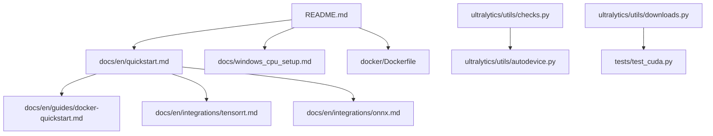
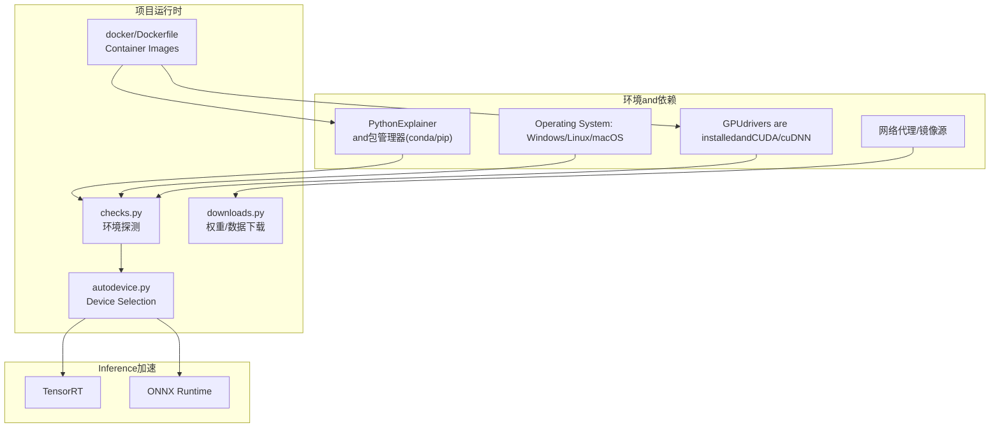
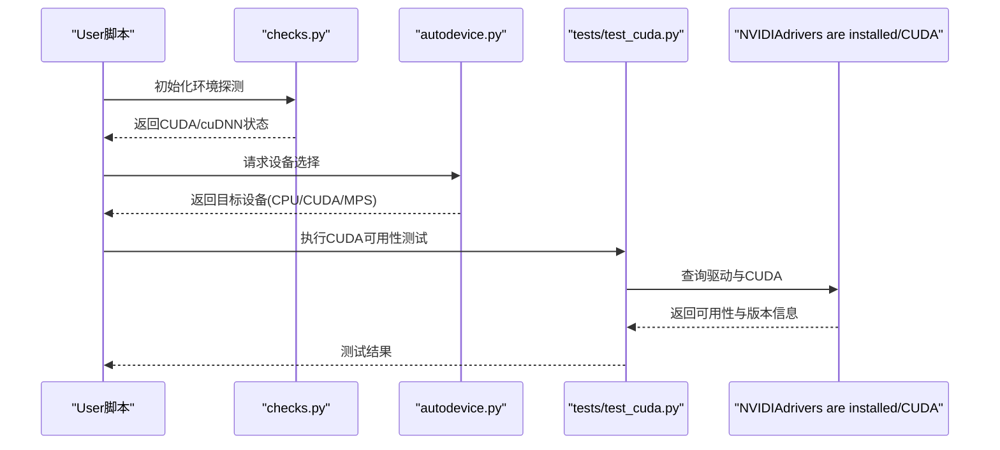
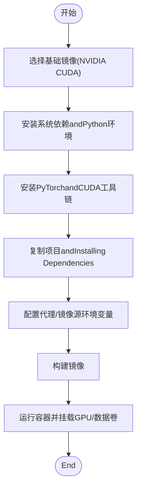
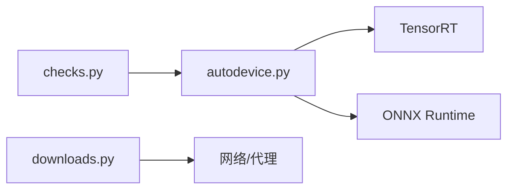

# 环境问题and配置

<cite>
**Files Referenced in This Document**
- [README.md](file://README.md)
- [pyproject.toml](file://pyproject.toml)
- [docker/Dockerfile](file://docker/Dockerfile)
- [docs/en/quickstart.md](file://docs/en/quickstart.md)
- [docs/en/guides/docker-quickstart.md](file://docs/en/guides/docker-quickstart.md)
- [docs/en/integrations/tensorrt.md](file://docs/en/integrations/tensorrt.md)
- [docs/en/integrations/onnx.md](file://docs/en/integrations/onnx.md)
- [docs/en/guides/yolo-common-issues.md](file://docs/en/guides/yolo-common-issues.md)
- [docs/windows_cpu_setup.md](file://docs/windows_cpu_setup.md)
- [ultralytics/utils/checks.py](file://ultralytics/utils/checks.py)
- [ultralytics/utils/autodevice.py](file://ultralytics/utils/autodevice.py)
- [ultralytics/utils/downloads.py](file://ultralytics/utils/downloads.py)
- [tests/test_cuda.py](file://tests/test_cuda.py)
</cite>

## Table of Contents
1. [Introduction](#Introduction)
2. [Project Structure](#Project Structure)
3. [Core Components](#Core Components)
4. [Architecture Overview](#Architecture Overview)
5. [Detailed Component Analysis](#Detailed Component Analysis)
6. [Dependency Analysis](#Dependency Analysis)
7. [Performance Considerations](#Performance Considerations)
8. [故障排除指南](#故障排除指南)
9. [Conclusion](#Conclusion)
10. [Appendix](#Appendix)

## Introduction
本文件聚焦于环境安装and配置问题，覆盖Python版本兼容性、依赖包冲突、CUDA/cuDNN配置、GPUdrivers are installedandInference引擎（NVIDIAdrivers are installed、TensorRT、ONNX Runtime）Validation、跨平台（Windows/Linux/macOS）特定问题、虚拟环境最佳实践、网络代理and镜像源、DockerContainerized Deployment、环境变量and路径设置etc.。目标是帮助读者快速定位并解决常见环境问题，确保TrainingandInference稳定运行。

## Project Structure
本项目while仓库Root Directoryprovides多语言DocumentationandExamples，其中and环境相关的关键位置包括：
- 顶层说明and入口：README.md、pyproject.toml
- 官方Documentation：docs/en/quickstart.md、docs/en/guides/docker-quickstart.md、docs/en/integrations/*.md
- Windows CPU环境说明：docs/windows_cpu_setup.md
- Docker镜像构建：docker/Dockerfile
- 运行时环境检查andDevice Selection：ultralytics/utils/checks.py、ultralytics/utils/autodevice.py
- 下载and网络相关：ultralytics/utils/downloads.py
- CUDA可用性测试用例：tests/test_cuda.py

Figure Source
- [README.md](file://README.md)
- [docs/en/quickstart.md](file://docs/en/quickstart.md)
- [docs/en/guides/docker-quickstart.md](file://docs/en/guides/docker-quickstart.md)
- [docs/en/integrations/tensorrt.md](file://docs/en/integrations/tensorrt.md)
- [docs/en/integrations/onnx.md](file://docs/en/integrations/onnx.md)
- [docs/windows_cpu_setup.md](file://docs/windows_cpu_setup.md)
- [docker/Dockerfile](file://docker/Dockerfile)
- [ultralytics/utils/checks.py](file://ultralytics/utils/checks.py)
- [ultralytics/utils/autodevice.py](file://ultralytics/utils/autodevice.py)
- [ultralytics/utils/downloads.py](file://ultralytics/utils/downloads.py)
- [tests/test_cuda.py](file://tests/test_cuda.py)

Section Source
- [README.md](file://README.md)
- [docs/en/quickstart.md](file://docs/en/quickstart.md)
- [docs/en/guides/docker-quickstart.md](file://docs/en/guides/docker-quickstart.md)
- [docs/en/integrations/tensorrt.md](file://docs/en/integrations/tensorrt.md)
- [docs/en/integrations/onnx.md](file://docs/en/integrations/onnx.md)
- [docs/windows_cpu_setup.md](file://docs/windows_cpu_setup.md)
- [docker/Dockerfile](file://docker/Dockerfile)
- [ultralytics/utils/checks.py](file://ultralytics/utils/checks.py)
- [ultralytics/utils/autodevice.py](file://ultralytics/utils/autodevice.py)
- [ultralytics/utils/downloads.py](file://ultralytics/utils/downloads.py)
- [tests/test_cuda.py](file://tests/test_cuda.py)

## Core Components
- Pythonand依赖管理
  - Viapyproject.toml声明依赖and构建配置，建议Combiningconda/pipUses，避免系统级污染。
- 设备and后端检测
  - checks.py负责环境capabilities探测（such asCUDA、cuDNN、可用设备），autodevice.py根据检测结果选择最优设备（CPU/CUDA/MPS）。
- 下载and网络
  - downloads.pyEncapsulates模型权重and数据集的下载逻辑，Supporting代理and镜像源配置。
- DocumentationandExamples
  - quickstart.mdprovidesQuick Start；docker-quickstart.md给出容器化流程；tensorrt.mdandonnx.md分别介绍Inference加速集成；windows_cpu_setup.md针对Windows CPU环境给出注意事项。
- 测试
  - tests/test_cuda.py用于ValidationCUDA可用性，便于回归and环境自检。

Section Source
- [pyproject.toml](file://pyproject.toml)
- [ultralytics/utils/checks.py](file://ultralytics/utils/checks.py)
- [ultralytics/utils/autodevice.py](file://ultralytics/utils/autodevice.py)
- [ultralytics/utils/downloads.py](file://ultralytics/utils/downloads.py)
- [docs/en/quickstart.md](file://docs/en/quickstart.md)
- [docs/en/guides/docker-quickstart.md](file://docs/en/guides/docker-quickstart.md)
- [docs/en/integrations/tensorrt.md](file://docs/en/integrations/tensorrt.md)
- [docs/en/integrations/onnx.md](file://docs/en/integrations/onnx.md)
- [docs/windows_cpu_setup.md](file://docs/windows_cpu_setup.md)
- [tests/test_cuda.py](file://tests/test_cuda.py)

## Architecture Overview
下图展示从“Environment Preparation”to“Device SelectionandInference/Training”的关键路径，Centered onandExternal Dependencies（CUDA/TensorRT/ONNX）的接入点。

Figure Source
- [ultralytics/utils/checks.py](file://ultralytics/utils/checks.py)
- [ultralytics/utils/autodevice.py](file://ultralytics/utils/autodevice.py)
- [ultralytics/utils/downloads.py](file://ultralytics/utils/downloads.py)
- [docker/Dockerfile](file://docker/Dockerfile)
- [docs/en/integrations/tensorrt.md](file://docs/en/integrations/tensorrt.md)
- [docs/en/integrations/onnx.md](file://docs/en/integrations/onnx.md)

## Detailed Component Analysis

### Python版本and依赖冲突
- 版本约束
  - pyproject.toml中定义依赖and构建要求，建议遵循其推荐的Python版本范围，避免ABI不兼容。
- 常见冲突
  - numpy/pytorch/cuda-toolkit版本组合不当会导致导入失败或运行时崩溃。
  - 不同包对OpenSSL、libstdc++etc.系统库存while差异，建议while隔离环境中安装。
- 排查步骤
  - Usesconda创建干净环境，按pyproject.toml顺序Installing Dependencies。
  - 若出现ABI错误，优先对齐PyTorchandCUDA工具链版本。
  - Usespip列表and依赖解析工具定位冲突包。

Section Source
- [pyproject.toml](file://pyproject.toml)

### CUDA/cuDNN配置andValidation
- drivers are installedandCUDA
  - NVIDIAdrivers are installed需满足当前CUDA版本的最低要求；CUDA ToolkitandcuDNN版本需匹配PyTorch预编译二进制。
- Validation方法
  - Usestests/test_cuda.py进行CUDA可用性测试。
  - whilePython中Calls设备探测逻辑（checks.py/autodevice.py）确认是否识别toGPU。
- 常见问题
  - “找不toCUDA”：检查nvidia-smi输出andCUDA版本一致性；确认PATH/LD_LIBRARY_PATH包含正确路径。
  - cuDNN缺失或版本不匹配：安装andPyTorch匹配的cuDNN版本。
  - 多卡环境：确保进程可见性（CUDA_VISIBLE_DEVICES）and权限正确。

Figure Source
- [ultralytics/utils/checks.py](file://ultralytics/utils/checks.py)
- [ultralytics/utils/autodevice.py](file://ultralytics/utils/autodevice.py)
- [tests/test_cuda.py](file://tests/test_cuda.py)

Section Source
- [ultralytics/utils/checks.py](file://ultralytics/utils/checks.py)
- [ultralytics/utils/autodevice.py](file://ultralytics/utils/autodevice.py)
- [tests/test_cuda.py](file://tests/test_cuda.py)

### 跨平台特定问题and解决方案
- Windows
  - CPU环境：Refer todocs/windows_cpu_setup.md，注意Visual Studio Build Tools、OpenCV依赖and路径设置。
  - GPU环境：确保安装andCUDA版本一致的NVIDIAdrivers are installed；避免同时安装多个CUDA Toolkit导致冲突。
- Linux
  - 内核头文件andgcc版本需匹配drivers are installed安装需求；容器内需挂载nvidiadrivers are installedandCUDA库。
  - Usesldconfig更新动态链接库缓存。
- macOS
  - MPS后端：Apple Silicon上启用MPSCentered on获得较好性能；Metaldrivers are installed由系统管理。
  - 避免混用Homebrewand系统Python，Recommended to useconda。

Section Source
- [docs/windows_cpu_setup.md](file://docs/windows_cpu_setup.md)

### GPUdrivers are installedandInference引擎配置
- NVIDIAdrivers are installed
  - Usesnvidia-smi查看drivers are installed版本andSupporting的CUDA上限；按需升级drivers are installedCentered onSupporting更高CUDA。
- TensorRT
  - Refer todocs/en/integrations/tensorrt.md，确保TensorRTandCUDA版本匹配；Exporting toTensorRT引擎前完成预检。
- ONNX Runtime
  - Refer todocs/en/integrations/onnx.md，安装对应GPU版ORT；ExportONNX后while目标设备上ValidationInference。

Section Source
- [docs/en/integrations/tensorrt.md](file://docs/en/integrations/tensorrt.md)
- [docs/en/integrations/onnx.md](file://docs/en/integrations/onnx.md)

### 虚拟环境管理最佳实践
- conda
  - 推荐用于科学计算栈隔离；创建独立环境并按顺序安装PyTorch、CUDA工具链and第三方库。
  - Usesconda-forge获取更广泛的预编译包。
- pip
  - whileconda环境内Usespip安装纯Python包；必要时指定--no-build-isolationCentered on避免构建冲突。
- 通用建议
  - 固定依赖版本；记录环境快照；避免全局安装。

Section Source
- [docs/en/quickstart.md](file://docs/en/quickstart.md)

### 网络代理and镜像源配置
- 代理设置
  - whiledownloads.py中处理Network requests时，可读取HTTP_PROXY/HTTPS_PROXYetc.环境变量；企业网络建议统一配置。
- 镜像源
  - forpip/conda配置国内镜像源Centered on提升下载速度；对于权重and数据集，可while相应配置项中替换for镜像地址。
- 常见问题
  - SSL证书错误：配置信任CA或Uses公司代理；超时重试：调整超时参数and重试策略。

Section Source
- [ultralytics/utils/downloads.py](file://ultralytics/utils/downloads.py)

### DockerContainerized Deployment
- 镜像构建
  - docker/Dockerfile定义了基础镜像、CUDAand依赖安装流程；建议基于官方NVIDIA CUDA镜像Centered on减少drivers are installed依赖。
- 运行and挂载
  - Usesnvidia-container-toolkit将宿主GPU暴露给容器；挂载数据卷and模型权重Table of Contents。
- 网络and代理
  - while镜像构建阶段配置代理and镜像源，或while运行时Via环境变量注入。

Figure Source
- [docker/Dockerfile](file://docker/Dockerfile)
- [docs/en/guides/docker-quickstart.md](file://docs/en/guides/docker-quickstart.md)

Section Source
- [docker/Dockerfile](file://docker/Dockerfile)
- [docs/en/guides/docker-quickstart.md](file://docs/en/guides/docker-quickstart.md)

### 环境变量and路径设置
- 常用变量
  - CUDA_VISIBLE_DEVICES：控制可见GPU；NCCL_*：分布式通信；OMP_NUM_THREADS：线程数。
  - HTTP_PROXY/HTTPS_PROXY：代理；PIP_INDEX_URL/CONDA_DEFAULTS：镜像源。
- 路径设置
  - PATH/LD_LIBRARY_PATH：确保CUDAanddrivers are installed库可被找to；Windows下注意系统路径andPowerShell/命令Tips符差异。
- Validation
  - Usesautodevice.pyandchecks.py确认环境变量生效；while容器中打印环境变量进行调试。

Section Source
- [ultralytics/utils/autodevice.py](file://ultralytics/utils/autodevice.py)
- [ultralytics/utils/checks.py](file://ultralytics/utils/checks.py)

## Dependency Analysis
- 内部Modules耦合
  - checks.pyandautodevice.py紧密协作：前者探测capabilities，后者做决策。
  - downloads.pyand网络层解耦，便于代理and镜像源切换。
- External Dependencies
  - PyTorchandCUDA/cuDNN：强耦合，版本需严格匹配。
  - TensorRT/ONNX Runtime：Optional加速后端，需andCUDA版本一致。
- Potential Cycles依赖
  - 当前设计无直接循环依赖；Device Selectionand下载逻辑相互独立。

Figure Source
- [ultralytics/utils/checks.py](file://ultralytics/utils/checks.py)
- [ultralytics/utils/autodevice.py](file://ultralytics/utils/autodevice.py)
- [ultralytics/utils/downloads.py](file://ultralytics/utils/downloads.py)
- [docs/en/integrations/tensorrt.md](file://docs/en/integrations/tensorrt.md)
- [docs/en/integrations/onnx.md](file://docs/en/integrations/onnx.md)

Section Source
- [ultralytics/utils/checks.py](file://ultralytics/utils/checks.py)
- [ultralytics/utils/autodevice.py](file://ultralytics/utils/autodevice.py)
- [ultralytics/utils/downloads.py](file://ultralytics/utils/downloads.py)
- [docs/en/integrations/tensorrt.md](file://docs/en/integrations/tensorrt.md)
- [docs/en/integrations/onnx.md](file://docs/en/integrations/onnx.md)

## Performance Considerations
- 合理批大小and内存占用：根据GPU显存调整batch size，避免OOM。
- Mixture精度and编译Optimization：whileSupporting的设备上启用AMPand后端Optimization（such asTensorRT）。
- 多线程andI/O：调节线程数andData Loading并行度，避免CPUbottlenecks。
- 监控and诊断：利用Loggingand测试用例持续Validation性能回归。

[本节for通用指导，无需引用具体文件]

## 故障排除指南
- 无法识别GPU
  - 检查drivers are installedandCUDA版本匹配；Usestests/test_cuda.pyandchecks.py/autodevice.py进行诊断。
- 导入失败或ABI错误
  - 重新安装PyTorchandCUDA工具链；清理旧缓存；Usesconda隔离环境。
- 下载失败或超时
  - 配置代理and镜像源；检查防火墙andDNS；增大超时and重试次数。
- 容器内无GPU
  - 确认nvidia-container-toolkit安装；运行容器时添加--gpus all；检查宿主机drivers are installed。
- Windows CPU环境异常
  - Refer todocs/windows_cpu_setup.md，检查Visual Studio工具链andOpenCV依赖。

Section Source
- [tests/test_cuda.py](file://tests/test_cuda.py)
- [ultralytics/utils/checks.py](file://ultralytics/utils/checks.py)
- [ultralytics/utils/autodevice.py](file://ultralytics/utils/autodevice.py)
- [ultralytics/utils/downloads.py](file://ultralytics/utils/downloads.py)
- [docs/windows_cpu_setup.md](file://docs/windows_cpu_setup.md)

## Conclusion
Via严格的Pythonand依赖版本管理、正确的CUDA/cuDNN配置、合理的网络and镜像源设置、规范的虚拟环境andContainerized Deployment，可Centered on显著降低环境问题概率。Combining项目Built-in的环境探测and测试用例，能够快速定位并修复问题，保障TrainingandInference的稳定性和性能。

[本节for总结，无需引用具体文件]

## Appendix
- 快速Refer to
  - Quick Start：docs/en/quickstart.md
  - Docker快速上手：docs/en/guides/docker-quickstart.md
  - TensorRT集成：docs/en/integrations/tensorrt.md
  - ONNX集成：docs/en/integrations/onnx.md
  - Windows CPU设置：docs/windows_cpu_setup.md
  - 常见问题汇总：docs/en/guides/yolo-common-issues.md

Section Source
- [docs/en/quickstart.md](file://docs/en/quickstart.md)
- [docs/en/guides/docker-quickstart.md](file://docs/en/guides/docker-quickstart.md)
- [docs/en/integrations/tensorrt.md](file://docs/en/integrations/tensorrt.md)
- [docs/en/integrations/onnx.md](file://docs/en/integrations/onnx.md)
- [docs/windows_cpu_setup.md](file://docs/windows_cpu_setup.md)
- [docs/en/guides/yolo-common-issues.md](file://docs/en/guides/yolo-common-issues.md)