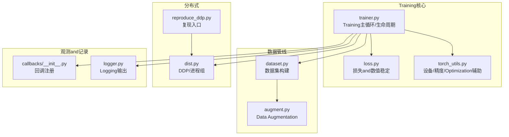
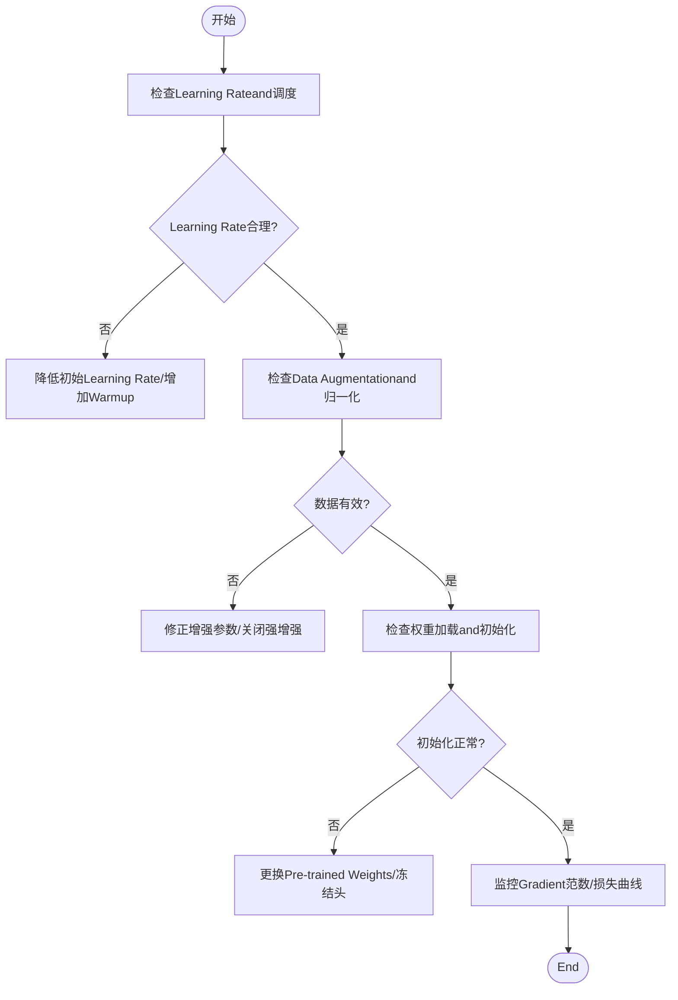
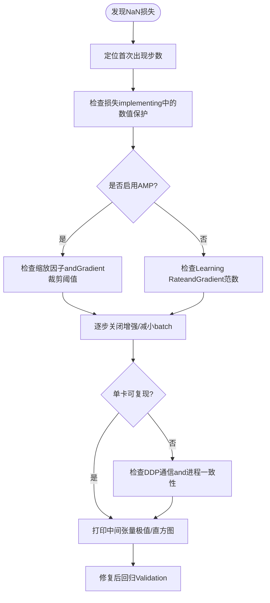
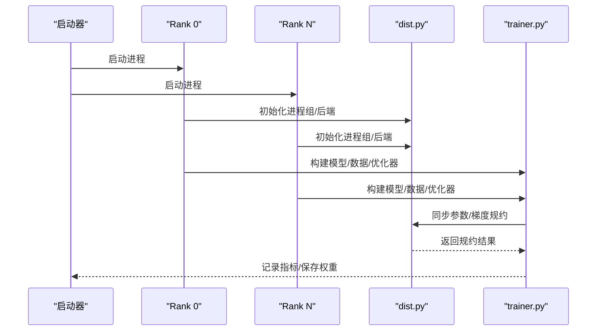
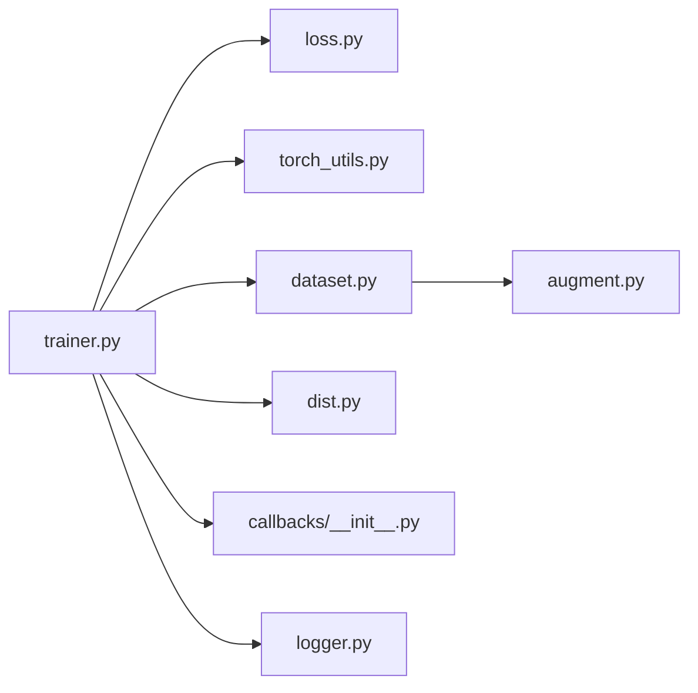

# Training问题诊断

<cite>
**Files Referenced in This Document**
- [ultralytics/engine/trainer.py](file://ultralytics/engine/trainer.py)
- [ultralytics/utils/loss.py](file://ultralytics/utils/loss.py)
- [ultralytics/utils/torch_utils.py](file://ultralytics/utils/torch_utils.py)
- [ultralytics/data/augment.py](file://ultralytics/data/augment.py)
- [ultralytics/data/dataset.py](file://ultralytics/data/dataset.py)
- [ultralytics/utils/dist.py](file://ultralytics/utils/dist.py)
- [ultralytics/utils/callbacks/__init__.py](file://ultralytics/utils/callbacks/__init__.py)
- [ultralytics/utils/logger.py](file://ultralytics/utils/logger.py)
- [tests/test_ddp_device_hardening.py](file://tests/test_ddp_device_hardening.py)
- [tests/test_ddp_lifecycle_nan.py](file://tests/test_ddp_lifecycle_nan.py)
- [tests/test_moe_ddp_fixes.py](file://tests/test_moe_ddp_fixes.py)
- [scripts/reproduce/reproduce_ddp.py](file://scripts/reproduce/reproduce_ddp.py)
- [docs/en/guides/model-training-tips.md](file://docs/en/guides/model-training-tips.md)
- [docs/en/guides/yolo-data-augmentation.md](file://docs/en/guides/yolo-data-augmentation.md)
</cite>

## Table of Contents
1. [Introduction](#Introduction)
2. [Project Structure](#Project Structure)
3. [Core Components](#Core Components)
4. [Architecture Overview](#Architecture Overview)
5. [Detailed Component Analysis](#Detailed Component Analysis)
6. [Dependency Analysis](#Dependency Analysis)
7. [性能考量](#性能考量)
8. [Troubleshooting Guide](#Troubleshooting Guide)
9. [Conclusion](#Conclusion)
10. [Appendix](#Appendix)

## Introduction
本指南targetingUses YOLO-Master 进行Object Detection、分割、姿态and other tasksTraining的EngineersandResearchers，聚焦“Training不收敛、NaN 损失、Distributed Training异常、过拟合/欠拟合、自定义数据集问题、Loggingand监控”六大类典型问题。Documentation基于仓库中的Training引擎、Data Augmentation、损失计算、分布式通信and测试用例进行系统化梳理，provides从现象to根因再to修复策略的完整路径，并给出Visualization流程图帮助快速定位问题。

## Project Structure
围绕Training链路的关键代码分布whileCentered on下Modules：
- Training主循环and生命周期管理：engine/trainer.py
- Loss Functionand数值稳定性：utils/loss.py
- 张量/设备/精度工具：utils/torch_utils.py
- Data Loadingand增强：data/augment.py, data/dataset.py
- 分布式通信andDDP：utils/dist.py
- 回调andLogging：utils/callbacks/__init__.py, utils/logger.py
- 分布式and数值稳定性测试：tests/*_ddp*.py, tests/test_metrics_numerical_stability.py
- 复现脚本：scripts/reproduce/reproduce_ddp.py
- 官方Training建议and增强说明：docs/en/guides/*.md



Figure Source
- [ultralytics/engine/trainer.py](file://ultralytics/engine/trainer.py)
- [ultralytics/utils/loss.py](file://ultralytics/utils/loss.py)
- [ultralytics/utils/torch_utils.py](file://ultralytics/utils/torch_utils.py)
- [ultralytics/data/augment.py](file://ultralytics/data/augment.py)
- [ultralytics/data/dataset.py](file://ultralytics/data/dataset.py)
- [ultralytics/utils/dist.py](file://ultralytics/utils/dist.py)
- [ultralytics/utils/callbacks/__init__.py](file://ultralytics/utils/callbacks/__init__.py)
- [ultralytics/utils/logger.py](file://ultralytics/utils/logger.py)
- [scripts/reproduce/reproduce_ddp.py](file://scripts/reproduce/reproduce_ddp.py)

Section Source
- [ultralytics/engine/trainer.py](file://ultralytics/engine/trainer.py)
- [ultralytics/utils/loss.py](file://ultralytics/utils/loss.py)
- [ultralytics/utils/torch_utils.py](file://ultralytics/utils/torch_utils.py)
- [ultralytics/data/augment.py](file://ultralytics/data/augment.py)
- [ultralytics/data/dataset.py](file://ultralytics/data/dataset.py)
- [ultralytics/utils/dist.py](file://ultralytics/utils/dist.py)
- [ultralytics/utils/callbacks/__init__.py](file://ultralytics/utils/callbacks/__init__.py)
- [ultralytics/utils/logger.py](file://ultralytics/utils/logger.py)
- [scripts/reproduce/reproduce_ddp.py](file://scripts/reproduce/reproduce_ddp.py)

## Core Components
- Training主循环（trainer）：负责模型前向/反向、Optimizer步进、EMA 更新、Validationand保存、回调触发、错误上报and恢复。
- 损失Modules（loss）：EncapsulatesTasks相关Loss combination、数值保护（such as除零保护、裁剪）、Gradient裁剪接口。
- 工具库（torch_utils）：Device Selection、自动Mixture精度（AMP）配置、Gradient缩放、参数分组and初始化辅助。
- 数据管线（augment/dataset）：图像读取、标签解析、几何/色彩增强、批处理and多进程加载。
- 分布式（dist）：进程组初始化、DDP 包装、通信后端设置、错误传播and诊断信息收集。
- 观测（callbacks/logger）：TrainingMetrics记录、TensorBoard/CSV Export、关键事件回调。

Section Source
- [ultralytics/engine/trainer.py](file://ultralytics/engine/trainer.py)
- [ultralytics/utils/loss.py](file://ultralytics/utils/loss.py)
- [ultralytics/utils/torch_utils.py](file://ultralytics/utils/torch_utils.py)
- [ultralytics/data/augment.py](file://ultralytics/data/augment.py)
- [ultralytics/data/dataset.py](file://ultralytics/data/dataset.py)
- [ultralytics/utils/dist.py](file://ultralytics/utils/dist.py)
- [ultralytics/utils/callbacks/__init__.py](file://ultralytics/utils/callbacks/__init__.py)
- [ultralytics/utils/logger.py](file://ultralytics/utils/logger.py)

## Architecture Overview
下图展示一次Training迭代的关键Calls链and数据流，便于理解各Modules协作方式and潜while故障点。

```mermaid
sequenceDiagram
participant User as "User/脚本"
participant Trainer as "trainer.py"
participant Data as "dataset.py/augment.py"
participant Model as "模型(含头)"
participant Loss as "loss.py"
participant Opt as "Optimizer/AMP"
participant Dist as "dist.py"
participant Log as "logger.py/callbacks"
User->>Trainer : 启动训练
Trainer->>Data : 获取批次(图像/标签)
Data-->>Trainer : 返回标准化后的输入
Trainer->>Model : 前向推理
Model-->>Trainer : 预测结果
Trainer->>Loss : 计算损失(含数值保护)
Loss-->>Trainer : 标量损失
Trainer->>Opt : 反向传播/梯度缩放(AMP)
Opt-->>Trainer : 完成一步优化
Trainer->>Dist : 同步状态/广播(可选)
Trainer->>Log : 记录指标/回调
Log-->>User : 进度/图表/断点
```

Figure Source
- [ultralytics/engine/trainer.py](file://ultralytics/engine/trainer.py)
- [ultralytics/data/dataset.py](file://ultralytics/data/dataset.py)
- [ultralytics/data/augment.py](file://ultralytics/data/augment.py)
- [ultralytics/utils/loss.py](file://ultralytics/utils/loss.py)
- [ultralytics/utils/dist.py](file://ultralytics/utils/dist.py)
- [ultralytics/utils/logger.py](file://ultralytics/utils/logger.py)
- [ultralytics/utils/callbacks/__init__.py](file://ultralytics/utils/callbacks/__init__.py)

## Detailed Component Analysis

### Training不收敛：Learning Rate、数据预处理and初始化
- Learning Rate过大或过小
  - 症状：损失震荡不降或长期停滞；Gradient范数异常大/小。
  - 排查：while trainer 中观察每步Gradient范数andLearning Rate调度曲线；Combining AMP 时检查缩放因子变化。
  - 调整：采用更保守的初始Learning Rateand warmup；对多阶段Tasks分头调参。
- 数据预处理不当
  - 症状：损失初期剧烈波动；mAP 极低；增强导致标签越界或尺度失真。
  - 排查：校验 augment 参数（Mosaic/MixUp/HFlip etc.）是否合理；确认归一化均值/方差andPre-trained Weights一致。
  - 调整：降低增强强度或关闭强增强做基线对比；确保标签格式and坐标范围正确。
- 模型初始化and权重加载
  - 症状：Training初期 NaN 或不稳定；不同随机种子差异巨大。
  - 排查：检查权重加载路径andTasks头匹配；确认是否启用了不兼容的初始化策略。
  - 调整：Uses官方Pre-trained Weights；必要时冻结部分层进行冷启动。



Section Source
- [ultralytics/engine/trainer.py](file://ultralytics/engine/trainer.py)
- [ultralytics/data/augment.py](file://ultralytics/data/augment.py)
- [ultralytics/utils/torch_utils.py](file://ultralytics/utils/torch_utils.py)
- [docs/en/guides/model-training-tips.md](file://docs/en/guides/model-training-tips.md)
- [docs/en/guides/yolo-data-augmentation.md](file://docs/en/guides/yolo-data-augmentation.md)

### NaN 损失：根本原因and调试步骤
常见根因
- Gradient爆炸：深层网络或高Learning Rate导致Gradient溢出。
- 数值不稳定：损失计算中存while除零、log(0)、sqrt(negative) etc.。
- AMP 缩放不当：缩放因子过小/过大导致下溢/上溢。
- 数据污染：标签越界、空框、非法类别索引。
- 分布式同步问题：进程间不一致导致广播/规约异常。

调试流程


Section Source
- [ultralytics/utils/loss.py](file://ultralytics/utils/loss.py)
- [ultralytics/utils/torch_utils.py](file://ultralytics/utils/torch_utils.py)
- [ultralytics/utils/dist.py](file://ultralytics/utils/dist.py)
- [tests/test_ddp_lifecycle_nan.py](file://tests/test_ddp_lifecycle_nan.py)

### Distributed Training（DDP）问题排查
常见问题
- 进程组初始化失败、端口冲突、NCCL 后端异常。
- 多卡通信阻塞或死锁：所有进程未进入同一同步点。
- 内存分配不均：某些 rank 显存占用过高导致 OOM。
- 错误传播and定位困难：仅 root rank 报错，其他进程静默退出。

排查要点
- Uses统一启动命令并确保环境变量一致。
- while trainer and dist 中检查进程组创建、rank/world_size 设置。
- for每个 rank 打印本地资源Uses情况，定位bottlenecks。
- 利用测试用例覆盖边界条件，确保错误能跨进程传播并被捕获。



Section Source
- [ultralytics/utils/dist.py](file://ultralytics/utils/dist.py)
- [ultralytics/engine/trainer.py](file://ultralytics/engine/trainer.py)
- [tests/test_ddp_device_hardening.py](file://tests/test_ddp_device_hardening.py)
- [tests/test_moe_ddp_fixes.py](file://tests/test_moe_ddp_fixes.py)
- [scripts/reproduce/reproduce_ddp.py](file://scripts/reproduce/reproduce_ddp.py)

### 过拟合and欠拟合的诊断and调优
- 过拟合特征
  - Training损失持续下降，Validation损失上升或 plateau；Training集 mAP 远高于Validation集。
  - 调优策略：正则化（权重衰减、Dropout）、早停、Data Augmentation、减少模型容量、引入Pre-trained Weights。
- 欠拟合特征
  - TrainingandValidation损失均较高且下降缓慢；模型容量不足或Learning Rate过低。
  - 调优策略：增大模型规模、提高Learning Rate、延长Training轮次、改进数据质量。
- 监控Metrics
  - 关注 loss 曲线、Gradient范数、Learning Rate、Validation集 mAP/F1、混淆矩阵分布。

Section Source
- [ultralytics/engine/trainer.py](file://ultralytics/engine/trainer.py)
- [ultralytics/utils/logger.py](file://ultralytics/utils/logger.py)
- [docs/en/guides/model-training-tips.md](file://docs/en/guides/model-training-tips.md)

### 自定义数据集Training常见问题
- 标签格式错误
  - 类别索引越界、坐标超出 [0,1] 范围、缺失必要字段。
  - 解决：Uses数据校验脚本或开启严格模式；打印首个 batch 的标签统计。
- Data Augmentation参数不当
  - Mosaic/MixUp 比例过高导致小目标丢失；HFlip 破坏方向性标注。
  - 解决：按Tasks特性调整增强强度；对旋转/姿态Tasks禁用翻转或改用对称增强。
- 归一化and通道顺序
  - andPre-trained Weights不一致导致收敛慢。
  - 解决：对齐均值/方差and RGB 顺序；必要时微调归一化参数。

Section Source
- [ultralytics/data/dataset.py](file://ultralytics/data/dataset.py)
- [ultralytics/data/augment.py](file://ultralytics/data/augment.py)
- [docs/en/guides/yolo-data-augmentation.md](file://docs/en/guides/yolo-data-augmentation.md)

### TrainingLogging分析and性能监控最佳实践
- 关键Metrics
  - 每步损失、Gradient范数、Learning Rate、显存占用、I/O 吞吐、GPU 利用率。
- 记录andVisualization
  - Uses logger and callbacks 将Metrics写入 CSV/TensorBoard；for关键事件注册回调。
- 性能bottlenecks定位
  - I/O 受限：提升 DataLoader 线程、缓存、磁盘带宽。
  - 计算受限：调整 batch size、启用 AMP、检查算子融合。
  - 通信受限：Optimization NCCL 环境、减少同步频率、检查拓扑。

Section Source
- [ultralytics/utils/logger.py](file://ultralytics/utils/logger.py)
- [ultralytics/utils/callbacks/__init__.py](file://ultralytics/utils/callbacks/__init__.py)
- [ultralytics/engine/trainer.py](file://ultralytics/engine/trainer.py)

## Dependency Analysis
Training主循环依赖损失、工具、数据and分布式Modules；Loggingand回调贯穿全链路。



Figure Source
- [ultralytics/engine/trainer.py](file://ultralytics/engine/trainer.py)
- [ultralytics/utils/loss.py](file://ultralytics/utils/loss.py)
- [ultralytics/utils/torch_utils.py](file://ultralytics/utils/torch_utils.py)
- [ultralytics/data/dataset.py](file://ultralytics/data/dataset.py)
- [ultralytics/data/augment.py](file://ultralytics/data/augment.py)
- [ultralytics/utils/dist.py](file://ultralytics/utils/dist.py)
- [ultralytics/utils/callbacks/__init__.py](file://ultralytics/utils/callbacks/__init__.py)
- [ultralytics/utils/logger.py](file://ultralytics/utils/logger.py)

## 性能考量
- Mixture精度（AMP）：while torch_utils 中配置缩放策略，注意Gradient裁剪阈值and数值稳定性。
- 批大小and内存：根据 GPU 显存动态调整，避免频繁碎片化分配。
- I/O 加速：多进程 DataLoader、预取、缓存；对大规模数据集考虑分片and增量加载。
- 通信Optimization：选择合适的 NCCL 后端and拓扑；减少不必要的同步点。

[本节for通用指导，无需特定文件引用]

## Troubleshooting Guide
- 快速自检清单
  - 单卡最小化复现：关闭增强、减小 batch、固定随机种子。
  - 检查数据：打印首批图像尺寸、标签范围and类别分布。
  - 检查损失：确认无除零/负数开方；启用数值保护。
  - 检查 AMP：缩放因子andGradient裁剪；必要时回退 FP32。
  - 检查 DDP：进程组初始化、端口、NCCL Logging；确保所有 rank 行for一致。
- 常用定位手段
  - while trainer 中插入回调，记录每步Gradient范数and损失极值。
  - Uses logger 输出关键中间变量摘要（非全量张量）。
  - 借助测试用例覆盖边界路径，Validation错误传播and恢复逻辑。

Section Source
- [ultralytics/engine/trainer.py](file://ultralytics/engine/trainer.py)
- [ultralytics/utils/loss.py](file://ultralytics/utils/loss.py)
- [ultralytics/utils/torch_utils.py](file://ultralytics/utils/torch_utils.py)
- [ultralytics/utils/dist.py](file://ultralytics/utils/dist.py)
- [tests/test_ddp_device_hardening.py](file://tests/test_ddp_device_hardening.py)
- [tests/test_ddp_lifecycle_nan.py](file://tests/test_ddp_lifecycle_nan.py)
- [tests/test_moe_ddp_fixes.py](file://tests/test_moe_ddp_fixes.py)

## Conclusion
Training问题的定位需要“数据—模型—Optimization—分布式—观测”的全链路视角。Via规范的数据校验、稳健的损失implementing、合理的超参and初始化、可靠的分布式配置Centered onand完善的Logging监控，可Centered on显著降低不收敛and NaN 风险，并提升Training效率and可复现性。建议while每次实验前执行最小化复现and基线对比，逐步放开复杂度，Centered on便快速隔离问题源。

## Appendix
- 推荐Refer toDocumentation
  - Training技巧and经验总结：[docs/en/guides/model-training-tips.md](file://docs/en/guides/model-training-tips.md)
  - Data Augmentation最佳实践：[docs/en/guides/yolo-data-augmentation.md](file://docs/en/guides/yolo-data-augmentation.md)
- 复现实例
  - Distributed Training复现脚本：[scripts/reproduce/reproduce_ddp.py](file://scripts/reproduce/reproduce_ddp.py)