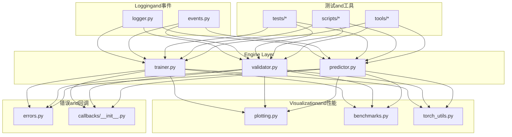
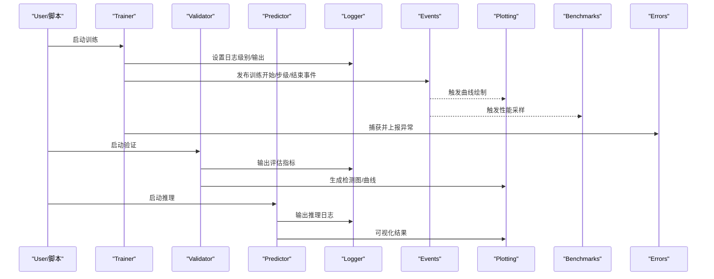
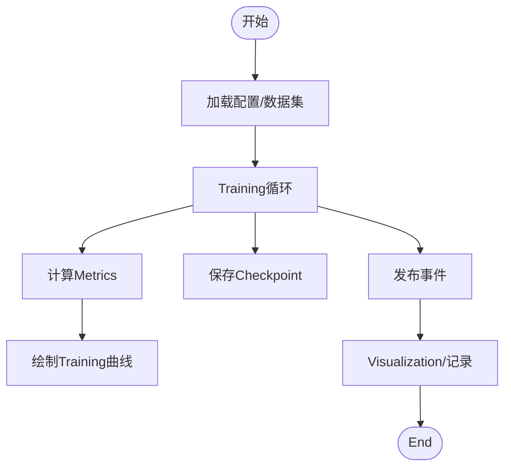
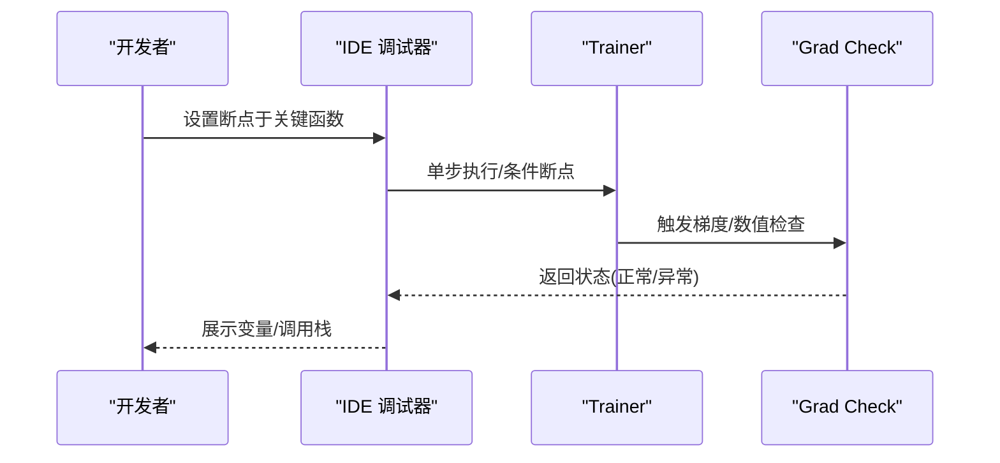
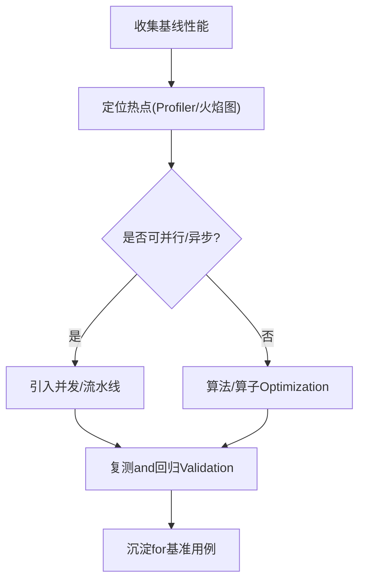
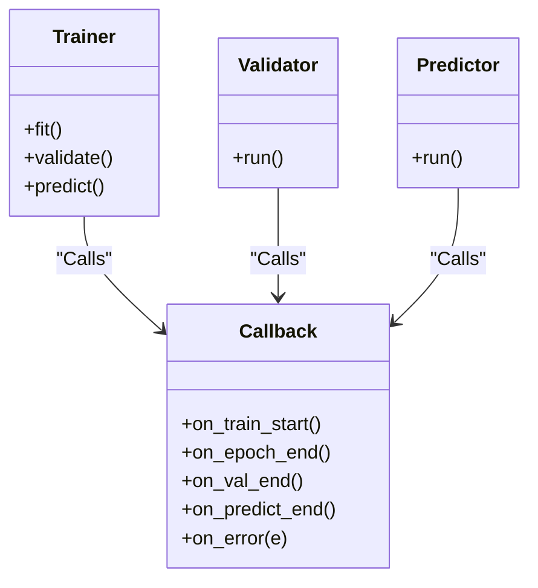
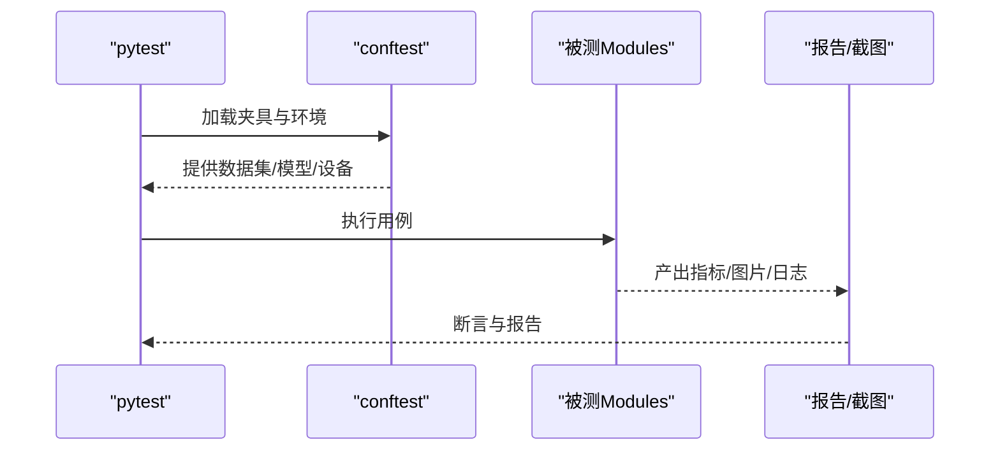
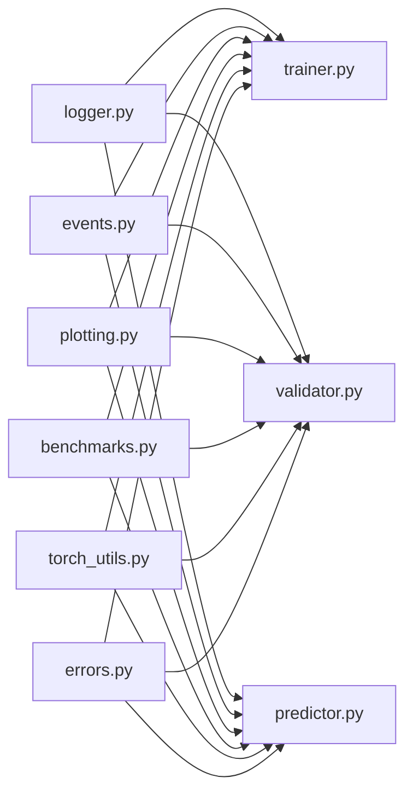

# 调试工具and方法

<cite>
**Files Referenced in This Document**
- [logger.py](file://ultralytics/utils/logger.py)
- [events.py](file://ultralytics/utils/events.py)
- [trainer.py](file://ultralytics/engine/trainer.py)
- [validator.py](file://ultralytics/engine/validator.py)
- [predictor.py](file://ultralytics/engine/predictor.py)
- [plotting.py](file://ultralytics/utils/plotting.py)
- [benchmarks.py](file://ultralytics/utils/benchmarks.py)
- [torch_utils.py](file://ultralytics/utils/torch_utils.py)
- [errors.py](file://ultralytics/utils/errors.py)
- [callbacks/__init__.py](file://ultralytics/utils/callbacks/__init__.py)
- [test_cli.py](file://tests/test_cli.py)
- [conftest.py](file://tests/conftest.py)
- [test_engine.py](file://tests/test_engine.py)
- [test_moe_validation_collectives.py](file://tests/test_moe_validation_collectives.py)
- [test_ddp_error_propagation_e2e.py](file://tests/test_ddp_error_propagation_e2e.py)
- [scripts/smoke_test_coco2017.py](file://scripts/smoke_test_coco2017.py)
- [scripts/analyze_mot_routing.py](file://scripts/analyze_mot_routing.py)
- [scripts/diagnose_mot_routing.py](file://scripts/diagnose_mot_routing.py)
- [tools/routing_interpreter.py](file://tools/routing_interpreter.py)
</cite>

## Table of Contents
1. [Introduction](#Introduction)
2. [Project Structure](#Project Structure)
3. [Core Components](#Core Components)
4. [Architecture Overview](#Architecture Overview)
5. [Detailed Component Analysis](#Detailed Component Analysis)
6. [Dependency Analysis](#Dependency Analysis)
7. [性能考量](#性能考量)
8. [Troubleshooting Guide](#Troubleshooting Guide)
9. [Conclusion](#Conclusion)
10. [Appendix](#Appendix)

## Introduction
本指南targetingwhile YOLO-Master 项目中开展Training、InferenceandEvaluation的Engineers，聚焦“such as何高效定位问题并快速恢复”。内容覆盖：
- Built-inLogging系统的Usesand配置（级别、输出、关键信息提取）
- Visualization诊断（Training曲线、检测结果、路由分布etc.）
- 断点调试and代码追踪（PyTorch 调试器、IDE 配置、核心Modules切入点）
- 性能剖析（内存分析、GPU profiling、热点识别）
- 自定义回调的编写and调试
- 自动化测试and回归测试的调试方法

## Project Structure
围绕调试and诊断的关键位置such as下：
- Loggingand事件：utils/logger.py、utils/events.py
- Training/Validation/Prediction主流程：engine/trainer.py、engine/validator.py、engine/predictor.py
- Visualization：utils/plotting.py
- 基准and性能：utils/benchmarks.py、utils/torch_utils.py
- 错误体系：utils/errors.py
- 回调框架：utils/callbacks/__init__.py
- 测试and脚本：tests/*、scripts/*、tools/*

Figure Source
- [logger.py](file://ultralytics/utils/logger.py)
- [events.py](file://ultralytics/utils/events.py)
- [trainer.py](file://ultralytics/engine/trainer.py)
- [validator.py](file://ultralytics/engine/validator.py)
- [predictor.py](file://ultralytics/engine/predictor.py)
- [plotting.py](file://ultralytics/utils/plotting.py)
- [benchmarks.py](file://ultralytics/utils/benchmarks.py)
- [torch_utils.py](file://ultralytics/utils/torch_utils.py)
- [errors.py](file://ultralytics/utils/errors.py)
- [callbacks/__init__.py](file://ultralytics/utils/callbacks/__init__.py)

Section Source
- [logger.py](file://ultralytics/utils/logger.py)
- [events.py](file://ultralytics/utils/events.py)
- [trainer.py](file://ultralytics/engine/trainer.py)
- [validator.py](file://ultralytics/engine/validator.py)
- [predictor.py](file://ultralytics/engine/predictor.py)
- [plotting.py](file://ultralytics/utils/plotting.py)
- [benchmarks.py](file://ultralytics/utils/benchmarks.py)
- [torch_utils.py](file://ultralytics/utils/torch_utils.py)
- [errors.py](file://ultralytics/utils/errors.py)
- [callbacks/__init__.py](file://ultralytics/utils/callbacks/__init__.py)

## Core Components
- Logging子系统
  - Unified entry pointand级别控制：Via logger Modulesprovides info/warning/error/debug etc.capabilities，便于while不同阶段按需开启或关闭。
  - 事件总线：events Modules将Training/Validation/Prediction过程中的关键节点Centered on事件形式广播，供回调和Visualization订阅。
- 引擎主流程
  - trainer：负责Training循环、Metrics记录、模型保存、回调触发。
  - validator：负责Validation/Evaluation循环、Metrics汇总、结果Visualization。
  - predictor：负责Inference流水线、结果Post-ProcessingandVisualization。
- Visualizationand性能
  - plotting：绘制Training曲线、混淆矩阵、PR 曲线、检测结果图etc.。
  - benchmarks：吞吐/延迟基准、设备利用率统计。
  - torch_utils：张量/设备相关辅助，含Gradient检查、内存监控etc.常用capabilities。
- 错误and回调
  - errors：统一的异常层次and错误码，便于定位问题域。
  - callbacks：Training/Validation/Prediction生命周期钩子，Supporting插入自定义逻辑。

Section Source
- [logger.py](file://ultralytics/utils/logger.py)
- [events.py](file://ultralytics/utils/events.py)
- [trainer.py](file://ultralytics/engine/trainer.py)
- [validator.py](file://ultralytics/engine/validator.py)
- [predictor.py](file://ultralytics/engine/predictor.py)
- [plotting.py](file://ultralytics/utils/plotting.py)
- [benchmarks.py](file://ultralytics/utils/benchmarks.py)
- [torch_utils.py](file://ultralytics/utils/torch_utils.py)
- [errors.py](file://ultralytics/utils/errors.py)
- [callbacks/__init__.py](file://ultralytics/utils/callbacks/__init__.py)

## Architecture Overview
下图展示从UserCallstoLogging、事件、Visualizationand性能采集的整体链路。

Figure Source
- [trainer.py](file://ultralytics/engine/trainer.py)
- [validator.py](file://ultralytics/engine/validator.py)
- [predictor.py](file://ultralytics/engine/predictor.py)
- [logger.py](file://ultralytics/utils/logger.py)
- [events.py](file://ultralytics/utils/events.py)
- [plotting.py](file://ultralytics/utils/plotting.py)
- [benchmarks.py](file://ultralytics/utils/benchmarks.py)
- [errors.py](file://ultralytics/utils/errors.py)

## Detailed Component Analysis

### Logging系统and问题诊断
- Logging级别and输出
  - 建议while开发阶段Uses更详细的级别，生产环境降低冗余输出。
  - 针对分布式场景，注意仅主进程输出关键Logging，避免刷屏。
- 关键信息提取
  - Training：损失收敛、Learning Rate变化、Gradient范数、NaN/Inf 检测。
  - Validation：mAP、精度/召回、类别维度Metrics、混淆矩阵。
  - Inference：耗时、吞吐、NMS 参数影响、失败样本路径。
- 分析方法
  - Combining events 订阅关键节点，将Metrics写入统一存储（such as TensorBoard/CSV）。
  - 对异常堆栈进行分层定位，优先关注最近一次变更的Modules。

Section Source
- [logger.py](file://ultralytics/utils/logger.py)
- [events.py](file://ultralytics/utils/events.py)
- [trainer.py](file://ultralytics/engine/trainer.py)
- [validator.py](file://ultralytics/engine/validator.py)
- [predictor.py](file://ultralytics/engine/predictor.py)
- [errors.py](file://ultralytics/utils/errors.py)

### Visualization诊断
- Training曲线
  - Via plotting Modules绘制 loss、mAP、PR 曲线，观察过拟合/欠拟合。
- 检测结果Visualization
  - whileValidation/Inference阶段输出带框/掩码/轨迹的图片，用于直观核对标注and模型行for。
- 路由分布分析（MoE/MoA）
  - Uses tools/routing_interpreter.py and scripts/analyze_mot_routing.py、diagnose_mot_routing.py 分析专家选择、负载不均衡etc.问题。

Figure Source
- [plotting.py](file://ultralytics/utils/plotting.py)
- [trainer.py](file://ultralytics/engine/trainer.py)
- [events.py](file://ultralytics/utils/events.py)
- [analyze_mot_routing.py](file://scripts/analyze_mot_routing.py)
- [diagnose_mot_routing.py](file://scripts/diagnose_mot_routing.py)
- [routing_interpreter.py](file://tools/routing_interpreter.py)

Section Source
- [plotting.py](file://ultralytics/utils/plotting.py)
- [analyze_mot_routing.py](file://scripts/analyze_mot_routing.py)
- [diagnose_mot_routing.py](file://scripts/diagnose_mot_routing.py)
- [routing_interpreter.py](file://tools/routing_interpreter.py)

### 断点调试and代码追踪
- PyTorch 调试器
  - while关键算子前后插入断点，检查输入形状、数值范围、Gradient是否有效。
  - UsesGradient检查工具定位 NaN/Inf 的来源层。
- IDE 调试配置
  - forTraining/Validation/Prediction入口分别创建运行配置，附加环境变量Centered on便控制Logging级别and输出路径。
- 核心Modules切入
  - Training：trainer 的主循环、Optimizer step、EMA 更新。
  - Validation：validator 的Metrics聚合、Visualization输出。
  - Inference：predictor 的数据预处理、模型前向、Post-Processingand NMS。

Figure Source
- [trainer.py](file://ultralytics/engine/trainer.py)
- [torch_utils.py](file://ultralytics/utils/torch_utils.py)

Section Source
- [trainer.py](file://ultralytics/engine/trainer.py)
- [validator.py](file://ultralytics/engine/validator.py)
- [predictor.py](file://ultralytics/engine/predictor.py)
- [torch_utils.py](file://ultralytics/utils/torch_utils.py)

### 性能剖析andOptimization
- 内存分析
  - 监控显存峰值and碎片，定位大对象and未释放引用。
  - whileData Loadingand增强环节减少不必要的拷贝。
- GPU Profiling
  - Uses CUDA profiler 或集成工具分析 kernel 耗时、通信开销（DDP）。
- 热点代码识别
  - Combining benchmarks Modulesand事件埋点，对比不同批大小、Mixture精度、编译选项的影响。

Figure Source
- [benchmarks.py](file://ultralytics/utils/benchmarks.py)
- [torch_utils.py](file://ultralytics/utils/torch_utils.py)

Section Source
- [benchmarks.py](file://ultralytics/utils/benchmarks.py)
- [torch_utils.py](file://ultralytics/utils/torch_utils.py)

### 自定义回调的编写and调试
- 生命周期钩子
  - whileTraining/Validation/Prediction各阶段注册回调，implementingMetrics记录、早停、动态调度、Visualizationetc.。
- 调试技巧
  - while回调中打印关键中间态；对异常进行捕获and上报，避免中断主流程。
  - Uses事件总线确保回调顺序and幂etc.性。

Figure Source
- [callbacks/__init__.py](file://ultralytics/utils/callbacks/__init__.py)
- [trainer.py](file://ultralytics/engine/trainer.py)
- [validator.py](file://ultralytics/engine/validator.py)
- [predictor.py](file://ultralytics/engine/predictor.py)

Section Source
- [callbacks/__init__.py](file://ultralytics/utils/callbacks/__init__.py)
- [trainer.py](file://ultralytics/engine/trainer.py)
- [validator.py](file://ultralytics/engine/validator.py)
- [predictor.py](file://ultralytics/engine/predictor.py)

### 自动化测试and回归测试的调试
- 单元测试and冒烟测试
  - Uses pytest 组织用例，Combining conftest 管理共享 fixture。
  - 针对 CLI and引擎接口编写最小化用例，快速Validation改动。
- 回归测试
  - 固定随机种子and输入，比较Metrics阈值and输出一致性。
  - 对分布式/多卡场景增加专门用例，覆盖 collectives and错误传播。

Figure Source
- [conftest.py](file://tests/conftest.py)
- [test_cli.py](file://tests/test_cli.py)
- [test_engine.py](file://tests/test_engine.py)
- [test_moe_validation_collectives.py](file://tests/test_moe_validation_collectives.py)
- [test_ddp_error_propagation_e2e.py](file://tests/test_ddp_error_propagation_e2e.py)

Section Source
- [test_cli.py](file://tests/test_cli.py)
- [conftest.py](file://tests/conftest.py)
- [test_engine.py](file://tests/test_engine.py)
- [test_moe_validation_collectives.py](file://tests/test_moe_validation_collectives.py)
- [test_ddp_error_propagation_e2e.py](file://tests/test_ddp_error_propagation_e2e.py)

## Dependency Analysis
- 低耦合高内聚
  - Loggingand事件作for横切关注点，被Training/Validation/Prediction共同依赖，但彼此解耦。
  - Visualizationand性能ModulesVia事件and回调接入，不影响主流程。
- External Dependencies
  - PyTorch 生态（CUDA、NCCL）、Visualization工具（TensorBoard etc.）、测试框架（pytest）。

Figure Source
- [logger.py](file://ultralytics/utils/logger.py)
- [events.py](file://ultralytics/utils/events.py)
- [trainer.py](file://ultralytics/engine/trainer.py)
- [validator.py](file://ultralytics/engine/validator.py)
- [predictor.py](file://ultralytics/engine/predictor.py)
- [plotting.py](file://ultralytics/utils/plotting.py)
- [benchmarks.py](file://ultralytics/utils/benchmarks.py)
- [torch_utils.py](file://ultralytics/utils/torch_utils.py)
- [errors.py](file://ultralytics/utils/errors.py)

Section Source
- [logger.py](file://ultralytics/utils/logger.py)
- [events.py](file://ultralytics/utils/events.py)
- [trainer.py](file://ultralytics/engine/trainer.py)
- [validator.py](file://ultralytics/engine/validator.py)
- [predictor.py](file://ultralytics/engine/predictor.py)
- [plotting.py](file://ultralytics/utils/plotting.py)
- [benchmarks.py](file://ultralytics/utils/benchmarks.py)
- [torch_utils.py](file://ultralytics/utils/torch_utils.py)
- [errors.py](file://ultralytics/utils/errors.py)

## 性能考量
- 批大小andMixture精度
  - while相同算力下平衡吞吐and稳定性，必要时回退精度或减小 batch。
- I/O andData Augmentation
  - Uses缓存、预取and并行加载，避免 CPU bottlenecks。
- 通信and同步
  - Distributed Training中关注 allreduce 频率andGradient累积策略。
- 编译and后端
  - 根据平台选择合适的加速后端and编译选项，并进行回归Validation。

[本节for通用指导，无需特定文件来源]

## Troubleshooting Guide
- 常见问题定位
  - Training不收敛：检查Learning Rate、损失爆炸、标签质量andData Augmentation强度。
  - ValidationMetrics异常：核对类别映射、阈值、NMS 参数andVisualization结果。
  - Inference崩溃：检查输入尺寸、通道顺序、设备一致性and内存占用。
- 错误体系and上报
  - 利用统一错误类型and堆栈信息，快速归因toModules层级。
- 快速复现
  - Uses smoke test 脚本and最小数据集快速Validation改动。

Section Source
- [errors.py](file://ultralytics/utils/errors.py)
- [smoke_test_coco2017.py](file://scripts/smoke_test_coco2017.py)

## Conclusion
through a unifiedLoggingand事件机制、完善的Visualizationand性能工具、Centered onand系统的测试and回归手段，可Centered onwhile YOLO-Master 项目中高效完成问题定位and性能调优。建议while日常工作中：
- 始终开启结构化Loggingand关键事件埋点
- 用Visualization辅助判断模型行for
- Centered on基准用例保障改动正确性
- 借助 Profiler and内存工具持续Optimization

[本节for总结性内容，无需特定文件来源]

## Appendix
- 实用命令and路径
  - Training/Validation/Prediction入口Refer to engine Modules
  - Visualization产物Refer to utils/plotting.py
  - 路由诊断Refer to tools/routing_interpreter.py and scripts/analyze_mot_routing.py、diagnose_mot_routing.py
  - 冒烟测试Refer to scripts/smoke_test_coco2017.py

[本节for索引性内容，无需特定文件来源]