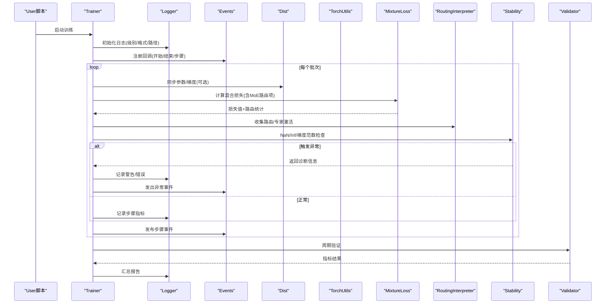
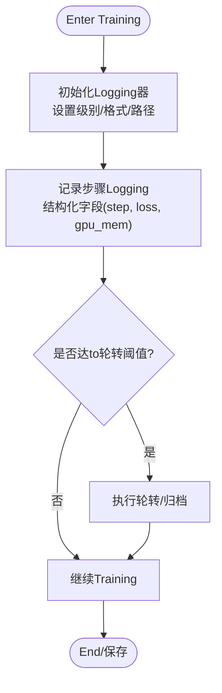
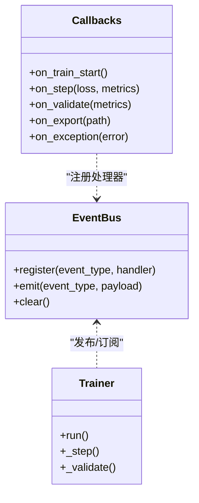
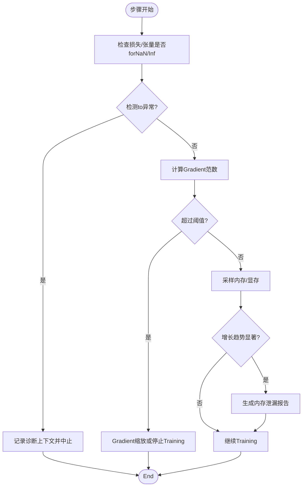
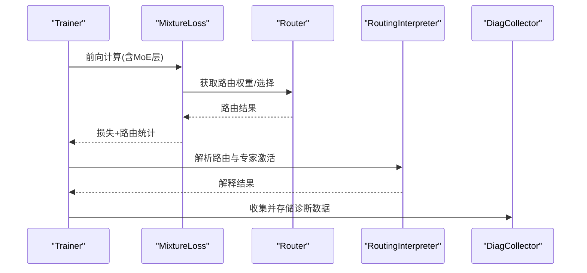
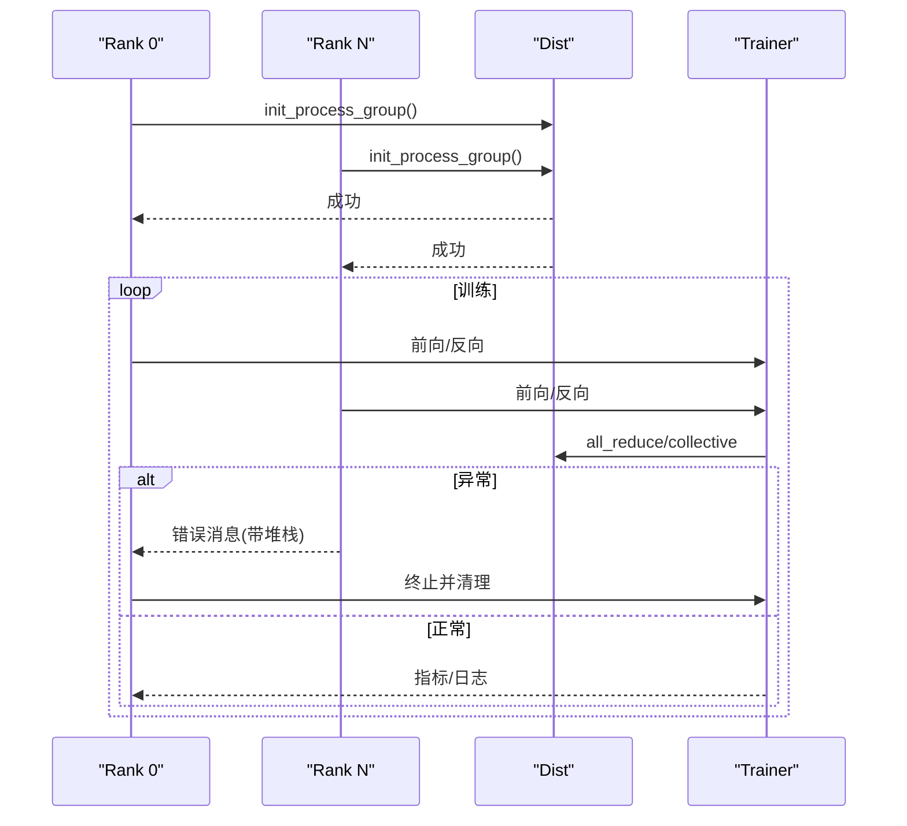
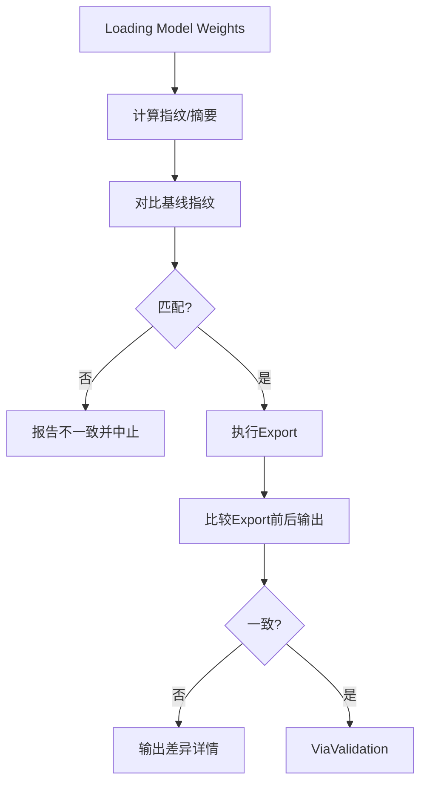
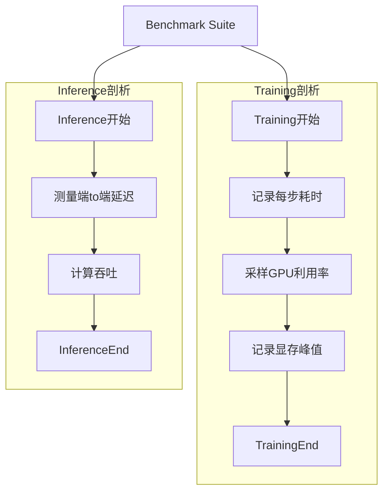
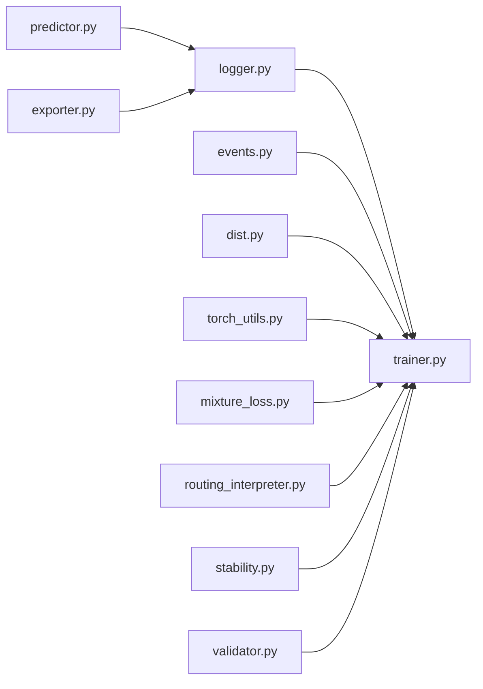

# 调试工具and诊断

<cite>
**Files Referenced in This Document**
- [logger.py](file://ultralytics/utils/logger.py)
- [events.py](file://ultralytics/utils/events.py)
- [dist.py](file://ultralytics/utils/dist.py)
- [torch_utils.py](file://ultralytics/utils/torch_utils.py)
- [errors.py](file://ultralytics/utils/errors.py)
- [trainer.py](file://ultralytics/engine/trainer.py)
- [validator.py](file://ultralytics/engine/validator.py)
- [predictor.py](file://ultralytics/engine/predictor.py)
- [exporter.py](file://ultralytics/engine/exporter.py)
- [mixture_loss.py](file://ultralytics/nn/mixture_loss.py)
- [routing_interpreter.py](file://ultralytics/utils/routing_interpreter.py)
- [config_drift_detector.py](file://tools/config_drift_detector.py)
- [routing_interpreter_tool.py](file://tools/routing_interpreter.py)
- [stability.py](file://agent/runtime/cli/stability.py)
- [validate.py](file://agent/runtime/cli/validate.py)
- [moe_tools.py](file://agent/runtime/cli/moe_tools.py)
- [test_moe_validation_collectives.py](file://tests/test_moe_validation_collectives.py)
- [test_ddp_error_propagation_e2e.py](file://tests/test_ddp_error传播_e2e.py)
- [test_metrics_numerical_stability.py](file://tests/test_metrics_numerical_stability.py)
- [benchmarks/suite.py](file://benchmarks/suite.py)
</cite>

## Table of Contents
1. [Introduction](#Introduction)
2. [Project Structure](#Project Structure)
3. [Core Components](#Core Components)
4. [Architecture Overview](#Architecture Overview)
5. [Detailed Component Analysis](#Detailed Component Analysis)
6. [Dependency Analysis](#Dependency Analysis)
7. [Performance Considerations](#Performance Considerations)
8. [故障排除指南](#故障排除指南)
9. [Conclusion](#Conclusion)
10. [Appendix](#Appendix)

## Introduction
本文件targetingYOLO-Master的调试and诊断系统，聚焦Centered on下目标：
- Logging系统的配置andUses（级别、结构化输出、文件管理）
- 事件追踪机制and调试钩子
- 自动诊断工具（NaN检测、Gradient爆炸检查、内存泄漏检测）
- MoE路由诊断and专家激活分析
- Distributed Training环境下的调试方法and错误定位
- 模型权重Validationand一致性检查
- 交互式调试会话and断点调试最佳实践
- 性能剖析工具的集成andUses
- 系统化故障排除流程and常见问题解决方案

## Project Structure
调试and诊断相关capabilities分布while多个Modules中：
- Loggingand事件：utils/logger.py、utils/events.py
- 分布式and设备：utils/dist.py、utils/torch_utils.py
- Training/Validation/Inference/Export：engine/trainer.py、engine/validator.py、engine/predictor.py、engine/exporter.py
- 数值稳定性andMoE：nn/mixture_loss.py、utils/routing_interpreter.py
- 诊断工具：tools/config_drift_detector.py、tools/routing_interpreter.py、agent/runtime/cli/*
- 测试用例：tests/*（覆盖MoE集体通信、DDP错误传播、数值稳定性etc.）
- Benchmark Suite：benchmarks/suite.py

```mermaid
graph TB
subgraph "Loggingand事件"
L["logger.py"]
E["events.py"]
end
subgraph "TrainingandEvaluation"
T["trainer.py"]
V["validator.py"]
P["predictor.py"]
X["exporter.py"]
end
subgraph "数值andMoE"
ML["mixture_loss.py"]
RIU["utils/routing_interpreter.py"]
end
subgraph "诊断工具"
CDD["tools/config_drift_detector.py"]
RIT["tools/routing_interpreter.py"]
STB["agent/runtime/cli/stability.py"]
VAL["agent/runtime/cli/validate.py"]
MOE["agent/runtime/cli/moe_tools.py"]
end
subgraph "分布式and设备"
D["utils/dist.py"]
TU["utils/torch_utils.py"]
end
subgraph "测试and基准"
TS1["tests/test_moe_validation_collectives.py"]
TS2["tests/test_ddp_error_propagation_e2e.py"]
TS3["tests/test_metrics_numerical_stability.py"]
B["benchmarks/suite.py"]
end
L --> T
L --> V
L --> P
L --> X
E --> T
E --> V
E --> P
E --> X
D --> T
D --> V
TU --> T
TU --> V
ML --> T
RIU --> T
CDD --> T
RIT --> T
STB --> T
VAL --> V
MOE --> T
TS1 --> T
TS2 --> T
TS3 --> T
B --> T
```

Figure Source
- [logger.py](file://ultralytics/utils/logger.py)
- [events.py](file://ultralytics/utils/events.py)
- [trainer.py](file://ultralytics/engine/trainer.py)
- [validator.py](file://ultralytics/engine/validator.py)
- [predictor.py](file://ultralytics/engine/predictor.py)
- [exporter.py](file://ultralytics/engine/exporter.py)
- [mixture_loss.py](file://ultralytics/nn/mixture_loss.py)
- [routing_interpreter.py](file://ultralytics/utils/routing_interpreter.py)
- [config_drift_detector.py](file://tools/config_drift_detector.py)
- [routing_interpreter_tool.py](file://tools/routing_interpreter.py)
- [stability.py](file://agent/runtime/cli/stability.py)
- [validate.py](file://agent/runtime/cli/validate.py)
- [moe_tools.py](file://agent/runtime/cli/moe_tools.py)
- [dist.py](file://ultralytics/utils/dist.py)
- [torch_utils.py](file://ultralytics/utils/torch_utils.py)
- [test_moe_validation_collectives.py](file://tests/test_moe_validation_collectives.py)
- [test_ddp_error_propagation_e2e.py](file://tests/test_ddp_error传播_e2e.py)
- [test_metrics_numerical_stability.py](file://tests/test_metrics_numerical_stability.py)
- [benchmarks/suite.py](file://benchmarks/suite.py)

Section Source
- [logger.py](file://ultralytics/utils/logger.py)
- [events.py](file://ultralytics/utils/events.py)
- [trainer.py](file://ultralytics/engine/trainer.py)
- [validator.py](file://ultralytics/engine/validator.py)
- [predictor.py](file://ultralytics/engine/predictor.py)
- [exporter.py](file://ultralytics/engine/exporter.py)
- [mixture_loss.py](file://ultralytics/nn/mixture_loss.py)
- [routing_interpreter.py](file://ultralytics/utils/routing_interpreter.py)
- [config_drift_detector.py](file://tools/config_drift_detector.py)
- [routing_interpreter_tool.py](file://tools/routing_interpreter.py)
- [stability.py](file://agent/runtime/cli/stability.py)
- [validate.py](file://agent/runtime/cli/validate.py)
- [moe_tools.py](file://agent/runtime/cli/moe_tools.py)
- [dist.py](file://ultralytics/utils/dist.py)
- [torch_utils.py](file://ultralytics/utils/torch_utils.py)
- [test_moe_validation_collectives.py](file://tests/test_moe_validation_collectives.py)
- [test_ddp_error_propagation_e2e.py](file://tests/test_ddp_error传播_e2e.py)
- [test_metrics_numerical_stability.py](file://tests/test_metrics_numerical_stability.py)
- [benchmarks/suite.py](file://benchmarks/suite.py)

## Core Components
- Logging子系统：统一Logging接口、分级控制、结构化字段、文件轮转and路径管理。
- 事件系统：Training/Validation/Inference生命周期事件、回调注册、跨进程广播。
- 分布式辅助：多进程初始化、错误传播、根进程标识、NCCL/进程组状态检查。
- 数值稳定性：NaN/Inf检测、Gradient范数监控、损失andMetrics异常告警。
- MoE诊断：路由选择统计、专家激活分布、负载不均衡检测、路由Explainer。
- 配置Drift Detection：对比当前配置and基线，报告差异并阻断潜while风险。
- 自动化校验：权重一致性、Export前后一致性、集合通信正确性。
- 性能剖析：Training/Inference阶段耗时采集、GPU利用率、内存峰值记录。

Section Source
- [logger.py](file://ultralytics/utils/logger.py)
- [events.py](file://ultralytics/utils/events.py)
- [dist.py](file://ultralytics/utils/dist.py)
- [torch_utils.py](file://ultralytics/utils/torch_utils.py)
- [mixture_loss.py](file://ultralytics/nn/mixture_loss.py)
- [routing_interpreter.py](file://ultralytics/utils/routing_interpreter.py)
- [config_drift_detector.py](file://tools/config_drift_detector.py)

## Architecture Overview
下图展示调试and诊断whileTraining主循环中的集成位置and数据流。

Figure Source
- [trainer.py](file://ultralytics/engine/trainer.py)
- [logger.py](file://ultralytics/utils/logger.py)
- [events.py](file://ultralytics/utils/events.py)
- [dist.py](file://ultralytics/utils/dist.py)
- [torch_utils.py](file://ultralytics/utils/torch_utils.py)
- [mixture_loss.py](file://ultralytics/nn/mixture_loss.py)
- [routing_interpreter.py](file://ultralytics/utils/routing_interpreter.py)
- [stability.py](file://agent/runtime/cli/stability.py)
- [validator.py](file://ultralytics/engine/validator.py)

## Detailed Component Analysis

### Logging系统（级别、结构化、文件管理）
- Logging级别：Supporting从DEBUGtoCRITICAL的多级输出；可Via环境变量或配置对象切换。
- 结构化输出：for关键事件附加JSON字段（such asstep、loss、gpu_mem、rank），便于聚合and分析。
- 文件管理：按Tasks/实验Table of Contents组织，Supporting轮转and保留策略；根进程负责写入，其他进程仅本地缓冲。
- 控制台and文件双写：Training时同时输出to终端and文件，便于交互and归档。

Figure Source
- [logger.py](file://ultralytics/utils/logger.py)
- [trainer.py](file://ultralytics/engine/trainer.py)

Section Source
- [logger.py](file://ultralytics/utils/logger.py)
- [trainer.py](file://ultralytics/engine/trainer.py)

### 事件追踪and调试钩子
- 事件类型：Training开始/End、每步、Validation、Export、异常etc.。
- 回调注册：Via事件总线注册自定义处理器，用于上报Metrics、触发快照、发送告警。
- 跨进程广播：while多进程环境下，事件由根进程广播，确保一致性and去重。
- 调试钩子：while关键节点插入钩子，允许注入诊断逻辑而不修改核心代码。

Figure Source
- [events.py](file://ultralytics/utils/events.py)
- [trainer.py](file://ultralytics/engine/trainer.py)

Section Source
- [events.py](file://ultralytics/utils/events.py)
- [trainer.py](file://ultralytics/engine/trainer.py)

### 自动诊断工具（NaN检测、Gradient爆炸、内存泄漏）
- NaN/Inf检测：对损失、关键张量进行isfinite检查，发现异常立即中断并输出诊断上下文。
- Gradient爆炸：TrackingGradient范数，超过阈值时记录并Optional择缩放或停止Training。
- 内存泄漏：周期性采样显存/内存占用，识别持续增长趋势并生成报告。
- 集成点：whileTraining循环andValidation阶段Calls，Combining事件系统上报。

Figure Source
- [stability.py](file://agent/runtime/cli/stability.py)
- [torch_utils.py](file://ultralytics/utils/torch_utils.py)
- [trainer.py](file://ultralytics/engine/trainer.py)

Section Source
- [stability.py](file://agent/runtime/cli/stability.py)
- [torch_utils.py](file://ultralytics/utils/torch_utils.py)
- [trainer.py](file://ultralytics/engine/trainer.py)

### MoE路由诊断and专家激活分析
- 路由统计：记录每步被选中的专家ID、选择概率、Load Balancing项。
- 专家激活分布：统计各专家的Calls频次and激活强度，识别“热点”and“冷点”。
- 路由Explainer：将路由决策映射toInput Features维度，帮助理解专家分工。
- 集成点：while损失计算后收集路由元数据，供后续分析andVisualization。

Figure Source
- [mixture_loss.py](file://ultralytics/nn/mixture_loss.py)
- [routing_interpreter.py](file://ultralytics/utils/routing_interpreter.py)
- [trainer.py](file://ultralytics/engine/trainer.py)

Section Source
- [mixture_loss.py](file://ultralytics/nn/mixture_loss.py)
- [routing_interpreter.py](file://ultralytics/utils/routing_interpreter.py)
- [trainer.py](file://ultralytics/engine/trainer.py)

### Distributed Training调试and错误定位
- 进程组初始化：确保所有进程成功加入，失败时快速失败并输出原因。
- 错误传播：非根进程异常信息汇聚至根进程，附带堆栈and上下文。
- 状态检查：定期探测NCCL/进程组健康度，避免静默挂起。
- 根进程职责：仅根进程写入Logging/保存权重，减少竞争and重复。

Figure Source
- [dist.py](file://ultralytics/utils/dist.py)
- [trainer.py](file://ultralytics/engine/trainer.py)

Section Source
- [dist.py](file://ultralytics/utils/dist.py)
- [trainer.py](file://ultralytics/engine/trainer.py)

### 模型权重Validationand一致性检查
- 权重指纹：对模型参数生成哈希指纹，用于版本管理and回归比对。
- Export一致性：比较Export前后权重and输出，确保转换无损。
- 集合通信一致性：Validation多进程下权重/Metrics的一致性。
- 工具链：providesCLIandAPICentered on一键执行校验。

Figure Source
- [validate.py](file://agent/runtime/cli/validate.py)
- [exporter.py](file://ultralytics/engine/exporter.py)
- [test_moe_validation_collectives.py](file://tests/test_moe_validation_collectives.py)

Section Source
- [validate.py](file://agent/runtime/cli/validate.py)
- [exporter.py](file://ultralytics/engine/exporter.py)
- [test_moe_validation_collectives.py](file://tests/test_moe_validation_collectives.py)

### 交互式调试and断点最佳实践
- 条件断点：仅while特定rank或特定样本上触发，避免阻塞其他进程。
- 局部变量快照：while断点处保存关键张量and中间结果，便于离线分析。
- 最小复现：基于事件andLogging重建问题场景，降低定位成本。
- 安全退出：while断点调试后恢复默认行for，避免影响生产运行。

Section Source
- [trainer.py](file://ultralytics/engine/trainer.py)
- [events.py](file://ultralytics/utils/events.py)

### 性能剖析集成andUses
- Training剖析：记录每步耗时、GPU利用率、内存峰值，输出时序图。
- Inference剖析：测量端to端延迟、吞吐、算子耗时分布。
- Benchmark Suite：provides标准化基准，便于不同配置/硬件对比。
- 集成方式：Via事件回调或装饰器注入剖析逻辑，按需启用。

Figure Source
- [benchmarks/suite.py](file://benchmarks/suite.py)
- [trainer.py](file://ultralytics/engine/trainer.py)
- [predictor.py](file://ultralytics/engine/predictor.py)

Section Source
- [benchmarks/suite.py](file://benchmarks/suite.py)
- [trainer.py](file://ultralytics/engine/trainer.py)
- [predictor.py](file://ultralytics/engine/predictor.py)

## Dependency Analysis
- 低耦合高内聚：Loggingand事件作for基础设施，被Training/Validation/Inference广泛复用。
- External Dependencies：分布式通信依赖NCCL/进程组；性能剖析依赖PyTorchBuilt-in工具。
- 潜while环依赖：避免while事件回调中直接导入Trainer，采用延迟导入或接口抽象。

Figure Source
- [logger.py](file://ultralytics/utils/logger.py)
- [events.py](file://ultralytics/utils/events.py)
- [dist.py](file://ultralytics/utils/dist.py)
- [torch_utils.py](file://ultralytics/utils/torch_utils.py)
- [mixture_loss.py](file://ultralytics/nn/mixture_loss.py)
- [routing_interpreter.py](file://ultralytics/utils/routing_interpreter.py)
- [stability.py](file://agent/runtime/cli/stability.py)
- [trainer.py](file://ultralytics/engine/trainer.py)
- [validator.py](file://ultralytics/engine/validator.py)
- [predictor.py](file://ultralytics/engine/predictor.py)
- [exporter.py](file://ultralytics/engine/exporter.py)

Section Source
- [logger.py](file://ultralytics/utils/logger.py)
- [events.py](file://ultralytics/utils/events.py)
- [dist.py](file://ultralytics/utils/dist.py)
- [torch_utils.py](file://ultralytics/utils/torch_utils.py)
- [mixture_loss.py](file://ultralytics/nn/mixture_loss.py)
- [routing_interpreter.py](file://ultralytics/utils/routing_interpreter.py)
- [stability.py](file://agent/runtime/cli/stability.py)
- [trainer.py](file://ultralytics/engine/trainer.py)
- [validator.py](file://ultralytics/engine/validator.py)
- [predictor.py](file://ultralytics/engine/predictor.py)
- [exporter.py](file://ultralytics/engine/exporter.py)

## Performance Considerations
- Logging开销：while高吞吐场景下，建议降低DEBUG级别或Uses异步写入。
- 事件频率：避免while每步都触发重型回调，必要时合并或降采样。
- 诊断开关：NaN/Gradient/内存检查可按阶段启用，减少额外计算。
- 剖析粒度：Training阶段按epoch或固定步数采样，Inference阶段按请求采样。

## 故障排除指南
- 常见错误分类
  - 数值不稳定：NaN/Inf、Gradient爆炸、损失震荡
  - 分布式问题：进程组初始化失败、NCCL超时、错误未传播
  - 资源问题：显存不足、内存泄漏、I/Obottlenecks
  - 配置问题：配置漂移、Export不一致、权重损坏
- 定位技巧
  - Uses结构化Logging过滤关键字段（rank、step、loss）
  - 借助事件回调捕获异常上下文and堆栈
  - 利用MoE路由Explainer定位专家失衡
  - Via一致性检查快速确认权重/Export问题
- 解决步骤
  - 缩小范围：最小复现实例、单卡Validation、关闭非必要特性
  - 逐步启用诊断：先NaN/Inf，再Gradient范数，最后内存采样
  - 交叉Validation：对比不同配置/数据集/硬件平台
  - 回归测试：引入自动化用例防止复发

Section Source
- [errors.py](file://ultralytics/utils/errors.py)
- [test_ddp_error_propagation_e2e.py](file://tests/test_ddp_error传播_e2e.py)
- [test_metrics_numerical_stability.py](file://tests/test_metrics_numerical_stability.py)
- [config_drift_detector.py](file://tools/config_drift_detector.py)

## Conclusion
YOLO-Master的调试and诊断体系围绕Logging、事件、数值稳定性、MoE诊断、分布式健壮性and一致性检查构建。Via合理的配置and开关，可while不影响性能的前提下获得强大的可观测性and排障capabilities。建议while研发and生产环境中持续集成这些工具，形成闭环的质量保障。

## Appendix
- 常用命令and入口
  - Training：Refer totrainer.py中的Training主循环and回调
  - Validation：Refer tovalidator.py中的Metrics计算and报告
  - Inference：Refer topredictor.py中的批处理and剖析
  - Export：Refer toexporter.py中的权重and输出一致性检查
  - 诊断工具：Refer totoolsandagent/runtime/cli下的脚本
- Reference Test Cases
  - MoE集体通信一致性：test_moe_validation_collectives.py
  - DDP错误传播：test_ddp_error_propagation_e2e.py
  - 数值稳定性：test_metrics_numerical_stability.py