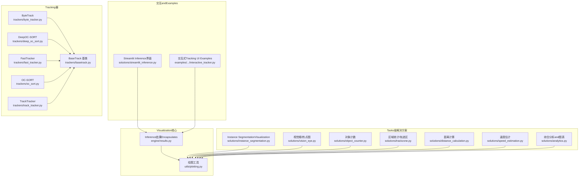
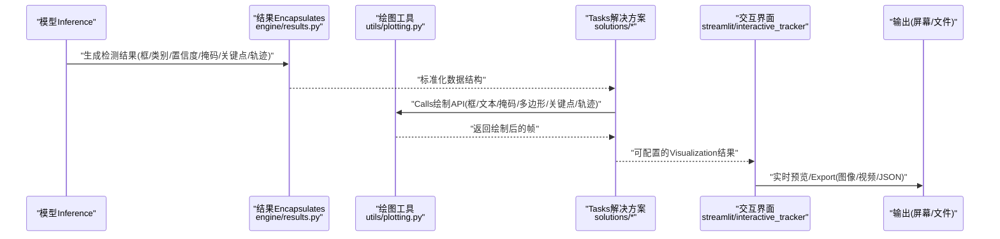
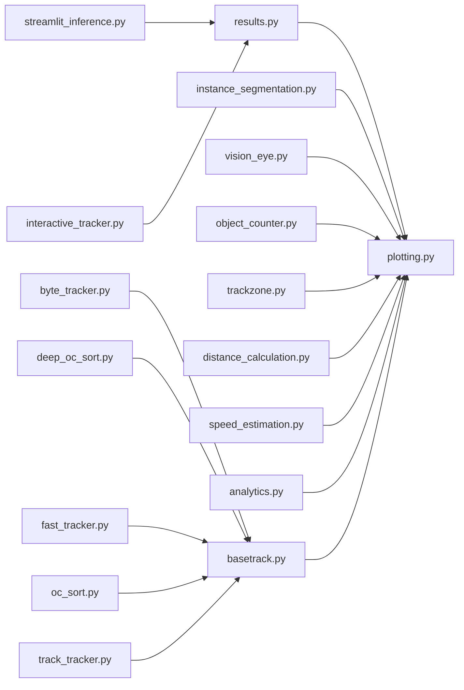

# Inference结果Visualization

<cite>
**Files Referenced in This Document**
- [ultralytics/utils/plotting.py](file://ultralytics/utils/plotting.py)
- [ultralytics/engine/results.py](file://ultralytics/engine/results.py)
- [ultralytics/solutions/streamlit_inference.py](file://ultralytics/solutions/streamlit_inference.py)
- [examples/YOLO-Interactive-Tracking-UI/interactive_tracker.py](file://examples/YOLO-Interactive-Tracking-UI/interactive_tracker.py)
- [ultralytics/solutions/instance_segmentation.py](file://ultralytics/solutions/instance_segmentation.py)
- [ultralytics/solutions/vision_eye.py](file://ultralytics/solutions/vision_eye.py)
- [ultralytics/solutions/object_counter.py](file://ultralytics/solutions/object_counter.py)
- [ultralytics/solutions/trackzone.py](file://ultralytics/solutions/trackzone.py)
- [ultralytics/solutions/distance_calculation.py](file://ultralytics/solutions/distance_calculation.py)
- [ultralytics/solutions/speed_estimation.py](file://ultralytics/solutions/speed_estimation.py)
- [ultralytics/solutions/analytics.py](file://ultralytics/solutions/analytics.py)
- [ultralytics/trackers/basetrack.py](file://ultralytics/trackers/basetrack.py)
- [ultralytics/trackers/byte_tracker.py](file://ultralytics/trackers/byte_tracker.py)
- [ultralytics/trackers/deep_oc_sort.py](file://ultralytics/trackers/deep_oc_sort.py)
- [ultralytics/trackers/fast_tracker.py](file://ultralytics/trackers/fast_tracker.py)
- [ultralytics/trackers/oc_sort.py](file://ultralytics/trackers/oc_sort.py)
- [ultralytics/trackers/track_tracker.py](file://ultralytics/trackers/track_tracker.py)
</cite>

## Table of Contents
1. [Introduction](#Introduction)
2. [Project Structure](#Project Structure)
3. [Core Components](#Core Components)
4. [Architecture Overview](#Architecture Overview)
5. [Detailed Component Analysis](#Detailed Component Analysis)
6. [Dependency Analysis](#Dependency Analysis)
7. [Performance Considerations](#Performance Considerations)
8. [Troubleshooting Guide](#Troubleshooting Guide)
9. [Conclusion](#Conclusion)
10. [Appendix](#Appendix)

## Introduction
本技术Documentation聚焦于 YOLO-Master 的Inference结果Visualization系统，覆盖Centered on下capabilities：
- Object Detection：边界框绘制、类别标签and置信度标注、颜色映射方案
- Instance Segmentation：掩码叠加and多边形绘制
- Pose Estimation：关键点连接线and骨骼结构Visualization
- Multi-Object Tracking：轨迹绘制and ID 保持显示
- 交互式界面：实时预览、参数调整、结果Export
- 自定义样式and主题配置
- 批量处理Optimization策略
- 视频流处理and实时渲染的性能Optimization技巧

## Project Structure
Visualization相关代码主要分布whileCentered on下Modules：
- 通用绘图工具and数据绑定：ultralytics/utils/plotting.py、ultralytics/engine/results.py
- 解决方案层（targetingTasks）：ultralytics/solutions/*（such asInstance Segmentation、视觉眼、计数、测距、速度估计etc.）
- 交互and演示：examples/YOLO-Interactive-Tracking-UI/interactive_tracker.py、ultralytics/solutions/streamlit_inference.py
- Tracking器implementing：ultralytics/trackers/*（provides轨迹、ID etc.元数据）

Figure Source
- [ultralytics/utils/plotting.py](file://ultralytics/utils/plotting.py)
- [ultralytics/engine/results.py](file://ultralytics/engine/results.py)
- [ultralytics/solutions/instance_segmentation.py](file://ultralytics/solutions/instance_segmentation.py)
- [ultralytics/solutions/vision_eye.py](file://ultralytics/solutions/vision_eye.py)
- [ultralytics/solutions/object_counter.py](file://ultralytics/solutions/object_counter.py)
- [ultralytics/solutions/trackzone.py](file://ultralytics/solutions/trackzone.py)
- [ultralytics/solutions/distance_calculation.py](file://ultralytics/solutions/distance_calculation.py)
- [ultralytics/solutions/speed_estimation.py](file://ultralytics/solutions/speed_estimation.py)
- [ultralytics/solutions/analytics.py](file://ultralytics/solutions/analytics.py)
- [ultralytics/solutions/streamlit_inference.py](file://ultralytics/solutions/streamlit_inference.py)
- [examples/YOLO-Interactive-Tracking-UI/interactive_tracker.py](file://examples/YOLO-Interactive-Tracking-UI/interactive_tracker.py)
- [ultralytics/trackers/byte_tracker.py](file://ultralytics/trackers/byte_tracker.py)
- [ultralytics/trackers/deep_oc_sort.py](file://ultralytics/trackers/deep_oc_sort.py)
- [ultralytics/trackers/fast_tracker.py](file://ultralytics/trackers/fast_tracker.py)
- [ultralytics/trackers/oc_sort.py](file://ultralytics/trackers/oc_sort.py)
- [ultralytics/trackers/track_tracker.py](file://ultralytics/trackers/track_tracker.py)
- [ultralytics/trackers/basetrack.py](file://ultralytics/trackers/basetrack.py)

Section Source
- [ultralytics/utils/plotting.py](file://ultralytics/utils/plotting.py)
- [ultralytics/engine/results.py](file://ultralytics/engine/results.py)
- [ultralytics/solutions/streamlit_inference.py](file://ultralytics/solutions/streamlit_inference.py)
- [examples/YOLO-Interactive-Tracking-UI/interactive_tracker.py](file://examples/YOLO-Interactive-Tracking-UI/interactive_tracker.py)

## Core Components
- 绘图工具集（utils/plotting.py）
  - 负责统一的绘制原语：矩形框、文本、线段、多边形、半透明蒙版、颜色映射、字体and字号控制、透明度and线宽设置etc.。
  - provides对检测结果（框、类别、置信度）、分割掩码、关键点and骨架边、轨迹点序列的统一绘制接口。
- Inference结果Encapsulates（engine/results.py）
  - 将模型输出标准化for统一的数据结构，包含框坐标、类别索引、置信度、分割掩码、关键点坐标、Tracking ID、轨迹历史etc.字段，供绘图工具直接消费。
- Tasks级解决方案（solutions/*）
  - while通用绘图之上，组合业务逻辑andVisualization：例such asInstance Segmentation的掩码叠加、视觉眼的热力图叠加、计数and测距/速度估计的Metrics绘制、轨迹区的统计展示etc.。
- 交互界面（streamlit_inference.py、interactive_tracker.py）
  - provides实时预览、参数调节（阈值、颜色、透明度、线宽、字体大小etc.）、结果Export（图像/视频/JSON）etc.capabilities。
- Tracking器（trackers/*）
  - 维护目标 ID、轨迹点序列、匹配状态etc.，forVisualizationprovides轨迹绘制and ID 显示所需数据。

Section Source
- [ultralytics/utils/plotting.py](file://ultralytics/utils/plotting.py)
- [ultralytics/engine/results.py](file://ultralytics/engine/results.py)
- [ultralytics/solutions/instance_segmentation.py](file://ultralytics/solutions/instance_segmentation.py)
- [ultralytics/solutions/vision_eye.py](file://ultralytics/solutions/vision_eye.py)
- [ultralytics/solutions/object_counter.py](file://ultralytics/solutions/object_counter.py)
- [ultralytics/solutions/trackzone.py](file://ultralytics/solutions/trackzone.py)
- [ultralytics/solutions/distance_calculation.py](file://ultralytics/solutions/distance_calculation.py)
- [ultralytics/solutions/speed_estimation.py](file://ultralytics/solutions/speed_estimation.py)
- [ultralytics/solutions/analytics.py](file://ultralytics/solutions/analytics.py)
- [ultralytics/solutions/streamlit_inference.py](file://ultralytics/solutions/streamlit_inference.py)
- [examples/YOLO-Interactive-Tracking-UI/interactive_tracker.py](file://examples/YOLO-Interactive-Tracking-UI/interactive_tracker.py)
- [ultralytics/trackers/basetrack.py](file://ultralytics/trackers/basetrack.py)
- [ultralytics/trackers/byte_tracker.py](file://ultralytics/trackers/byte_tracker.py)
- [ultralytics/trackers/deep_oc_sort.py](file://ultralytics/trackers/deep_oc_sort.py)
- [ultralytics/trackers/fast_tracker.py](file://ultralytics/trackers/fast_tracker.py)
- [ultralytics/trackers/oc_sort.py](file://ultralytics/trackers/oc_sort.py)
- [ultralytics/trackers/track_tracker.py](file://ultralytics/trackers/track_tracker.py)

## Architecture Overview
下图展示了从“Inference结果”to“最终Visualization画面”的关键路径，Centered onand各组件之间的依赖关系。

Figure Source
- [ultralytics/engine/results.py](file://ultralytics/engine/results.py)
- [ultralytics/utils/plotting.py](file://ultralytics/utils/plotting.py)
- [ultralytics/solutions/instance_segmentation.py](file://ultralytics/solutions/instance_segmentation.py)
- [ultralytics/solutions/streamlit_inference.py](file://ultralytics/solutions/streamlit_inference.py)
- [examples/YOLO-Interactive-Tracking-UI/interactive_tracker.py](file://examples/YOLO-Interactive-Tracking-UI/interactive_tracker.py)

## Detailed Component Analysis

### Object DetectionVisualization（边界框、类别标签、置信度、颜色映射）
- 绘制流程
  - 从 results 中读取框坐标、类别索引and置信度
  - Uses绘图工具绘制矩形框、文本标签（类别+置信度）
  - Via颜色映射for不同类别分配稳定色板
- 关键要点
  - 文本位置and背景遮罩避免遮挡
  - 线宽and字体大小随分辨率自适应
  - Confidence Threshold过滤低分结果
- 典型Calls路径
  - Refer to：[ultralytics/utils/plotting.py](file://ultralytics/utils/plotting.py)、[ultralytics/engine/results.py](file://ultralytics/engine/results.py)

Section Source
- [ultralytics/utils/plotting.py](file://ultralytics/utils/plotting.py)
- [ultralytics/engine/results.py](file://ultralytics/engine/results.py)

### Instance SegmentationVisualization（掩码叠加、多边形绘制）
- 绘制流程
  - 读取每个实例的掩码and轮廓
  - 将掩码Centered on半透明方式叠加to原图
  - Optional绘制多边形轮廓增强边界可见性
- 关键要点
  - 掩码缩放至输入尺寸，注意插值and边界对齐
  - 透明度可调，避免遮挡重要信息
  - 多边形采样and简化Centered on提升性能
- 典型Calls路径
  - Refer to：[ultralytics/solutions/instance_segmentation.py](file://ultralytics/solutions/instance_segmentation.py)、[ultralytics/utils/plotting.py](file://ultralytics/utils/plotting.py)

Section Source
- [ultralytics/solutions/instance_segmentation.py](file://ultralytics/solutions/instance_segmentation.py)
- [ultralytics/utils/plotting.py](file://ultralytics/utils/plotting.py)

### Pose EstimationVisualization（关键点连线、骨骼结构）
- 绘制流程
  - 读取关键点坐标and骨架连接关系
  - 按预设骨骼顺序绘制线段and关键点标记
- 关键要点
  - 关键点可见性阈值过滤
  - 骨架颜色and粗细区分关节and肢体
  - Supporting旋转/缩放后坐标变换一致性
- 典型Calls路径
  - Refer to：[ultralytics/utils/plotting.py](file://ultralytics/utils/plotting.py)、[ultralytics/engine/results.py](file://ultralytics/engine/results.py)

Section Source
- [ultralytics/utils/plotting.py](file://ultralytics/utils/plotting.py)
- [ultralytics/engine/results.py](file://ultralytics/engine/results.py)

### Multi-Object TrackingVisualization（轨迹绘制、ID 保持显示）
- 绘制流程
  - 从Tracking器获取每目标的 ID and轨迹点序列
  - 绘制轨迹折线（可带时间衰减或渐变色）
  - while目标附近显示 ID 标签
- 关键要点
  - 轨迹平滑and抽稀Centered on降低渲染开销
  - ID 稳定性and丢失恢复策略影响显示连续性
  - 轨迹长度限制and内存管理
- 典型Calls路径
  - Refer to：[ultralytics/trackers/basetrack.py](file://ultralytics/trackers/basetrack.py)、[ultralytics/trackers/byte_tracker.py](file://ultralytics/trackers/byte_tracker.py)、[ultralytics/trackers/deep_oc_sort.py](file://ultralytics/trackers/deep_oc_sort.py)、[ultralytics/trackers/fast_tracker.py](file://ultralytics/trackers/fast_tracker.py)、[ultralytics/trackers/oc_sort.py](file://ultralytics/trackers/oc_sort.py)、[ultralytics/trackers/track_tracker.py](file://ultralytics/trackers/track_tracker.py)、[ultralytics/utils/plotting.py](file://ultralytics/utils/plotting.py)

Section Source
- [ultralytics/trackers/basetrack.py](file://ultralytics/trackers/basetrack.py)
- [ultralytics/trackers/byte_tracker.py](file://ultralytics/trackers/byte_tracker.py)
- [ultralytics/trackers/deep_oc_sort.py](file://ultralytics/trackers/deep_oc_sort.py)
- [ultralytics/trackers/fast_tracker.py](file://ultralytics/trackers/fast_tracker.py)
- [ultralytics/trackers/oc_sort.py](file://ultralytics/trackers/oc_sort.py)
- [ultralytics/trackers/track_tracker.py](file://ultralytics/trackers/track_tracker.py)
- [ultralytics/utils/plotting.py](file://ultralytics/utils/plotting.py)

### 交互式Visualization界面（实时预览、参数调整、结果Export）
- 功能概览
  - 实时预览：加载摄像头/视频流，逐帧Inference并绘制
  - 参数调整：阈值、颜色、透明度、线宽、字体大小、是否显示掩码/关键点/轨迹etc.
  - 结果Export：保存当前帧图像、录制视频、Export结构化结果（JSON）
- 典型入口
  - Streamlit 界面：[ultralytics/solutions/streamlit_inference.py](file://ultralytics/solutions/streamlit_inference.py)
  - 交互式TrackingExamples：[examples/YOLO-Interactive-Tracking-UI/interactive_tracker.py](file://examples/YOLO-Interactive-Tracking-UI/interactive_tracker.py)
- User操作建议
  - 先调阈值and类别过滤，再微调颜色and透明度
  - 大数据量场景关闭不必要的Visualization（such as掩码/轨迹）
  - Export前确认分辨率and编码格式

Section Source
- [ultralytics/solutions/streamlit_inference.py](file://ultralytics/solutions/streamlit_inference.py)
- [examples/YOLO-Interactive-Tracking-UI/interactive_tracker.py](file://examples/YOLO-Interactive-Tracking-UI/interactive_tracker.py)

### 自定义Visualization样式and主题配置
- 可配置项
  - 颜色映射：类别to颜色的映射表、随机种子、色板风格
  - 线条and文本：线宽、字体大小、文本背景透明度、边框圆角
  - 掩码and多边形：透明度、轮廓宽度、采样密度
  - 轨迹：颜色渐变、最大长度、平滑系数
- 配置位置
  - 绘图工具集中式参数：[ultralytics/utils/plotting.py](file://ultralytics/utils/plotting.py)
  - Tasks级解决方案中的默认样式：such as [ultralytics/solutions/instance_segmentation.py](file://ultralytics/solutions/instance_segmentation.py)、[ultralytics/solutions/vision_eye.py](file://ultralytics/solutions/vision_eye.py)
- 最佳实践
  - 将常用样式Encapsulatesfor“主题”，Via配置文件或环境变量切换
  - 针对深色/浅色背景分别设计对比度更高的配色

Section Source
- [ultralytics/utils/plotting.py](file://ultralytics/utils/plotting.py)
- [ultralytics/solutions/instance_segmentation.py](file://ultralytics/solutions/instance_segmentation.py)
- [ultralytics/solutions/vision_eye.py](file://ultralytics/solutions/vision_eye.py)

### 批量处理的VisualizationOptimization策略
- 批内并行
  - 对批次内样本并行绘制，减少 Python 层循环开销
- 资源复用
  - 重用画布、颜色缓存、字体对象，避免重复创建
- 降采样and抽稀
  - 对高分辨率图像进行下采样绘制，必要时再放大输出
  - 轨迹点and多边形顶点抽稀
- 异步and流水线
  - Inference、绘制、I/O 分离，Uses队列缓冲帧
- 存储and传输
  - 批量Export时采用高效编码（such as H.264/H.265），按需压缩质量

Section Source
- [ultralytics/utils/plotting.py](file://ultralytics/utils/plotting.py)
- [ultralytics/solutions/streamlit_inference.py](file://ultralytics/solutions/streamlit_inference.py)

### 视频流处理and实时渲染的性能Optimization技巧
- 解码and预处理
  - Useshardware acceleration解码（NVDEC/VAAPI/MediaFoundation）
  - 预分配缓冲区，减少内存分配抖动
- Inferenceand绘制
  - 固定输入尺寸，避免频繁 resize
  - 关闭不必要的Visualization通道（掩码/轨迹/关键点）
- 渲染and输出
  - Uses GPU 后端渲染（such as OpenGL/Vulkan）或更快的 GUI 库
  - 降低输出分辨率或帧率，平衡流畅度and细节
- 监控and诊断
  - 记录端to端延迟、GPU/CPU 占用、丢帧率，定位bottlenecks

Section Source
- [ultralytics/solutions/streamlit_inference.py](file://ultralytics/solutions/streamlit_inference.py)
- [examples/YOLO-Interactive-Tracking-UI/interactive_tracker.py](file://examples/YOLO-Interactive-Tracking-UI/interactive_tracker.py)

## Dependency Analysis
- 组件耦合
  - solutions/* 强依赖 plotting and results；tracking 子系统Via basetrack 协议provides轨迹数据
- External Dependencies
  - 图形库（OpenCV/GUI）、编解码库（FFmpeg/硬件编解码）、Web 框架（Streamlit）
- 潜while环依赖
  - 确保 solutions 不反向导入 trackers，仅Via results and plotting 解耦

Figure Source
- [ultralytics/engine/results.py](file://ultralytics/engine/results.py)
- [ultralytics/utils/plotting.py](file://ultralytics/utils/plotting.py)
- [ultralytics/solutions/instance_segmentation.py](file://ultralytics/solutions/instance_segmentation.py)
- [ultralytics/solutions/vision_eye.py](file://ultralytics/solutions/vision_eye.py)
- [ultralytics/solutions/object_counter.py](file://ultralytics/solutions/object_counter.py)
- [ultralytics/solutions/trackzone.py](file://ultralytics/solutions/trackzone.py)
- [ultralytics/solutions/distance_calculation.py](file://ultralytics/solutions/distance_calculation.py)
- [ultralytics/solutions/speed_estimation.py](file://ultralytics/solutions/speed_estimation.py)
- [ultralytics/solutions/analytics.py](file://ultralytics/solutions/analytics.py)
- [ultralytics/trackers/basetrack.py](file://ultralytics/trackers/basetrack.py)
- [ultralytics/trackers/byte_tracker.py](file://ultralytics/trackers/byte_tracker.py)
- [ultralytics/trackers/deep_oc_sort.py](file://ultralytics/trackers/deep_oc_sort.py)
- [ultralytics/trackers/fast_tracker.py](file://ultralytics/trackers/fast_tracker.py)
- [ultralytics/trackers/oc_sort.py](file://ultralytics/trackers/oc_sort.py)
- [ultralytics/trackers/track_tracker.py](file://ultralytics/trackers/track_tracker.py)
- [ultralytics/solutions/streamlit_inference.py](file://ultralytics/solutions/streamlit_inference.py)
- [examples/YOLO-Interactive-Tracking-UI/interactive_tracker.py](file://examples/YOLO-Interactive-Tracking-UI/interactive_tracker.py)

## Performance Considerations
- 渲染管线
  - 合并多次绘制Calls，减少上下文切换
  - Uses批量绘制 API and纹理上传Optimization
- 内存and缓存
  - 缓存颜色映射、字体、掩码模板
  - 限制轨迹长度and多边形顶点数
- I/O and编码
  - 选择合适编码器and质量etc.级，避免 CPU 过载
  - 落盘采用异步写入and缓冲
- 设备利用
  - 尽可能while GPU 上完成预处理/Post-Processingand绘制
  - 合理分配线程池，避免锁竞争

## Troubleshooting Guide
- 常见问题
  - 标签重叠或遮挡：调整文本位置、背景透明度或字体大小
  - 掩码错位：检查坐标缩放and裁剪边界
  - 轨迹闪烁或断裂：检查Tracking器 ID 稳定性and轨迹平滑参数
  - 实时卡顿：关闭非必要Visualization、降低分辨率/帧率、启用硬件解码
- 定位方法
  - 逐步开启Visualization选项，观察性能变化
  - 打印关键路径耗时（解码、Inference、绘制、编码）
  - Uses系统监控工具观察 CPU/GPU/内存占用

Section Source
- [ultralytics/solutions/streamlit_inference.py](file://ultralytics/solutions/streamlit_inference.py)
- [examples/YOLO-Interactive-Tracking-UI/interactive_tracker.py](file://examples/YOLO-Interactive-Tracking-UI/interactive_tracker.py)

## Conclusion
YOLO-Master 的Visualization体系Centered on统一的绘图工具and标准化的结果Encapsulatesfor核心，CombiningTasks级解决方案and交互式界面，provides了从检测、分割、姿态toTracking的全栈Visualizationcapabilities。Via合理的样式配置、批量Optimizationand视频流性能调优，可while保证可视效果满足实时性and大规模处理需求。

## Appendix
- 快速上手
  - 启动 Streamlit 界面进行实时预览andExport：Refer to [ultralytics/solutions/streamlit_inference.py](file://ultralytics/solutions/streamlit_inference.py)
  - 运行交互式TrackingExamples：Refer to [examples/YOLO-Interactive-Tracking-UI/interactive_tracker.py](file://examples/YOLO-Interactive-Tracking-UI/interactive_tracker.py)
- 扩展建议
  - 新增Visualization元素时，优先while plotting 中implementing通用绘制函数，再由 solutions 组合Calls
  - for不同Tasks定义独立的主题配置，便于一键切换