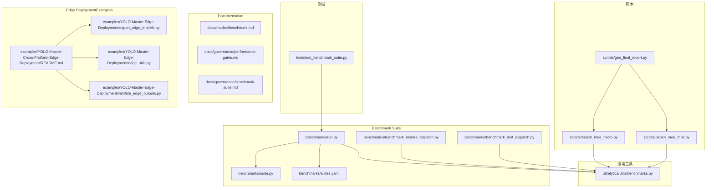
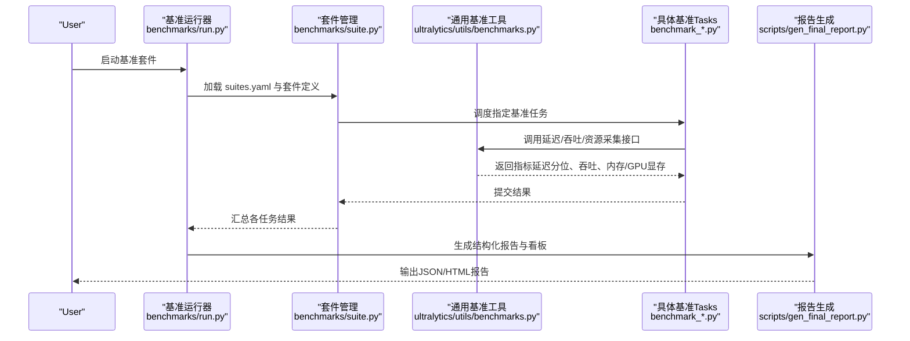
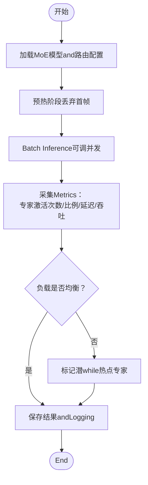
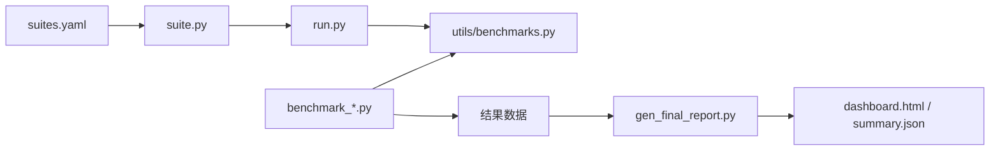

# 性能分析and基准测试

<cite>
**Files Referenced in This Document**
- [benchmarks/run.py](file://benchmarks/run.py)
- [benchmarks/suite.py](file://benchmarks/suite.py)
- [benchmarks/suites.yaml](file://benchmarks/suites.yaml)
- [benchmarks/benchmark_molora_dispatch.py](file://benchmarks/benchmark_molora_dispatch.py)
- [benchmarks/benchmark_mot_dispatch.py](file://benchmarks/benchmark_mot_dispatch.py)
- [ultralytics/utils/benchmarks.py](file://ultralytics/utils/benchmarks.py)
- [scripts/bench_moe_micro.py](file://scripts/bench_moe_micro.py)
- [scripts/bench_moe_mps.py](file://scripts/bench_moe_mps.py)
- [tests/test_benchmark_suite.py](file://tests/test_benchmark_suite.py)
- [docs/governance/performance-gates.md](file://docs/governance/performance-gates.md)
- [docs/governance/benchmark-suite.md](file://docs/governance/benchmark-suite.md)
- [docs/modes/benchmark.md](file://docs/modes/benchmark.md)
- [examples/YOLO-Master-Cross-Platform-Edge-Deployment/README.md](file://examples/YOLO-Master-Cross-Platform-Edge-Deployment/README.md)
- [examples/YOLO-Master-Edge-Deployment/edge_utils.py](file://examples/YOLO-Master-Edge-Deployment/edge_utils.py)
- [examples/YOLO-Master-Edge-Deployment/export_edge_models.py](file://examples/YOLO-Master-Edge-Deployment/export_edge_models.py)
- [examples/YOLO-Master-Edge-Deployment/validate_edge_outputs.py](file://examples/YOLO-Master-Edge-Deployment/validate_edge_outputs.py)
- [scripts/gen_final_report.py](file://scripts/gen_final_report.py)
- [scripts/ablation_reports/dashboard.html](file://scripts/ablation_reports/dashboard.html)
- [scripts/ablation_reports/summary.json](file://scripts/ablation_reports/summary.json)
</cite>

## Table of Contents
1. [Introduction](#Introduction)
2. [Project Structure](#Project Structure)
3. [Core Components](#Core Components)
4. [Architecture Overview](#Architecture Overview)
5. [Detailed Component Analysis](#Detailed Component Analysis)
6. [Dependency Analysis](#Dependency Analysis)
7. [性能考量](#性能考量)
8. [Troubleshooting Guide](#Troubleshooting Guide)
9. [Conclusion](#Conclusion)
10. [Appendix](#Appendix)

## Introduction
本技术DocumentationtargetingYOLO-Master的性能分析and基准测试系统，聚焦Centered on下目标：
- 模型Inference Performance测试工具的Uses方法：延迟测量、吞吐量分析、资源消耗监控
- 不同硬件平台（CPU、GPU、边缘设备）的基准测试流程and结果解读
- MoE模型的专家路由性能分析andLoad BalancingEvaluation
- 内存Uses分析andGPU显存Optimization的诊断方法
- 性能bottlenecks识别and调优建议的分析工具
- 自定义基准测试用例的开发and集成方法
- 大规模数据集的性能Evaluationand回归测试流程
- 性能数据的Visualizationand报告生成方法

## Project Structure
and性能分析和基准测试相关的代码主要分布whileCentered on下位置：
- benchmarks：Benchmark Suite定义and运行入口
- ultralytics/utils/benchmarks.py：通用基准工具（延迟、吞吐、预热etc.）
- scripts：MoE微基准、MPS基准、报告生成脚本
- tests：Benchmark Suite单元测试
- docs：基准模式说明and治理规范
- examples：跨平台andEdge DeploymentExamples（含ExportandValidation）

Figure Source
- [benchmarks/run.py](file://benchmarks/run.py)
- [benchmarks/suite.py](file://benchmarks/suite.py)
- [benchmarks/suites.yaml](file://benchmarks/suites.yaml)
- [benchmarks/benchmark_molora_dispatch.py](file://benchmarks/benchmark_molora_dispatch.py)
- [benchmarks/benchmark_mot_dispatch.py](file://benchmarks/benchmark_mot_dispatch.py)
- [ultralytics/utils/benchmarks.py](file://ultralytics/utils/benchmarks.py)
- [scripts/bench_moe_micro.py](file://scripts/bench_moe_micro.py)
- [scripts/bench_moe_mps.py](file://scripts/bench_moe_mps.py)
- [tests/test_benchmark_suite.py](file://tests/test_benchmark_suite.py)
- [docs/modes/benchmark.md](file://docs/modes/benchmark.md)
- [docs/governance/performance-gates.md](file://docs/governance/performance-gates.md)
- [docs/governance/benchmark-suite.md](file://docs/governance/benchmark-suite.md)
- [examples/YOLO-Master-Cross-Platform-Edge-Deployment/README.md](file://examples/YOLO-Master-Cross-Platform-Edge-Deployment/README.md)
- [examples/YOLO-Master-Edge-Deployment/edge_utils.py](file://examples/YOLO-Master-Edge-Deployment/edge_utils.py)
- [examples/YOLO-Master-Edge-Deployment/export_edge_models.py](file://examples/YOLO-Master-Edge-Deployment/export_edge_models.py)
- [examples/YOLO-Master-Edge-Deployment/validate_edge_outputs.py](file://examples/YOLO-Master-Edge-Deployment/validate_edge_outputs.py)

Section Source
- [benchmarks/run.py](file://benchmarks/run.py)
- [benchmarks/suite.py](file://benchmarks/suite.py)
- [benchmarks/suites.yaml](file://benchmarks/suites.yaml)
- [ultralytics/utils/benchmarks.py](file://ultralytics/utils/benchmarks.py)
- [scripts/bench_moe_micro.py](file://scripts/bench_moe_micro.py)
- [scripts/bench_moe_mps.py](file://scripts/bench_moe_mps.py)
- [tests/test_benchmark_suite.py](file://tests/test_benchmark_suite.py)
- [docs/modes/benchmark.md](file://docs/modes/benchmark.md)
- [docs/governance/performance-gates.md](file://docs/governance/performance-gates.md)
- [docs/governance/benchmark-suite.md](file://docs/governance/benchmark-suite.md)
- [examples/YOLO-Master-Cross-Platform-Edge-Deployment/README.md](file://examples/YOLO-Master-Cross-Platform-Edge-Deployment/README.md)
- [examples/YOLO-Master-Edge-Deployment/edge_utils.py](file://examples/YOLO-Master-Edge-Deployment/edge_utils.py)
- [examples/YOLO-Master-Edge-Deployment/export_edge_models.py](file://examples/YOLO-Master-Edge-Deployment/export_edge_models.py)
- [examples/YOLO-Master-Edge-Deployment/validate_edge_outputs.py](file://examples/YOLO-Master-Edge-Deployment/validate_edge_outputs.py)

## Core Components
- Benchmark Suite运行器：负责加载套件配置、调度具体基准Tasks、汇总Metrics并输出结果。
- 通用基准工具：provides延迟统计、吞吐计算、预热策略、设备检测and资源采集接口。
- MoE专项基准：针对专家路由and负载分布的微基准，Supporting多后端（such asCUDA/MPS）。
- Edge DeploymentExamples：涵盖Model Export、运行时ValidationandCross-Platform Deployment流程。
- 报告andVisualization：将基准结果聚合for结构化数据andHTML看板。

Section Source
- [benchmarks/run.py](file://benchmarks/run.py)
- [benchmarks/suite.py](file://benchmarks/suite.py)
- [ultralytics/utils/benchmarks.py](file://ultralytics/utils/benchmarks.py)
- [scripts/bench_moe_micro.py](file://scripts/bench_moe_micro.py)
- [scripts/bench_moe_mps.py](file://scripts/bench_moe_mps.py)
- [examples/YOLO-Master-Cross-Platform-Edge-Deployment/README.md](file://examples/YOLO-Master-Cross-Platform-Edge-Deployment/README.md)
- [scripts/gen_final_report.py](file://scripts/gen_final_report.py)

## Architecture Overview
下图展示了从“Benchmark Suite定义”to“执行and度量”，再to“报告andVisualization”的整体流程。

Figure Source
- [benchmarks/run.py](file://benchmarks/run.py)
- [benchmarks/suite.py](file://benchmarks/suite.py)
- [benchmarks/suites.yaml](file://benchmarks/suites.yaml)
- [benchmarks/benchmark_molora_dispatch.py](file://benchmarks/benchmark_molora_dispatch.py)
- [benchmarks/benchmark_mot_dispatch.py](file://benchmarks/benchmark_mot_dispatch.py)
- [ultralytics/utils/benchmarks.py](file://ultralytics/utils/benchmarks.py)
- [scripts/gen_final_report.py](file://scripts/gen_final_report.py)

## Detailed Component Analysis

### Benchmark Suiteand运行器
- 套件定义：ViaYAML描述基准Tasks集合、参数and环境约束，便于按场景组织测试。
- 运行器：解析套件、创建Tasks实例、并行或串行执行、收集Metrics并持久化。
- 关键职责：
  - 参数注入andDevice Selection（CPU/GPU/MPS）
  - 预热and冷启动控制
  - Metrics聚合（P50/P90/P99、均值、方差）
  - 失败重试and错误上报

Section Source
- [benchmarks/suites.yaml](file://benchmarks/suites.yaml)
- [benchmarks/suite.py](file://benchmarks/suite.py)
- [benchmarks/run.py](file://benchmarks/run.py)

### 通用基准工具（延迟/吞吐/资源）
- 延迟测量：
  - Supporting多次迭代统计，剔除首帧预热影响
  - 输出分位数and置信区间估计
- 吞吐分析：
  - 基于固定时间窗口的请求批处理计数
  - Supporting并发度调节and队列长度限制
- 资源监控：
  - CPU利用率、内存占用
  - GPU显存峰值and平均占用（CUDA/MPS）
- 设备抽象：
  - 自动检测可用设备anddrivers are installedcapabilities
  - Unified Interface屏蔽后端差异

Section Source
- [ultralytics/utils/benchmarks.py](file://ultralytics/utils/benchmarks.py)

### MoE专家路由andLoad Balancing基准
- 路由性能：
  - 统计每个专家的激活频率and分配比例
  - Evaluation路由决策开销and稳定性
- Load Balancing：
  - 计算Gini系数或熵Centered on衡量负载不均衡程度
  - 对比不同routing strategies下的负载分布
- 后端适配：
  - CUDA路径OptimizationandMPS路径Validation
  - 异常路径（NaN/Inf）检测and回退

Section Source
- [benchmarks/benchmark_molora_dispatch.py](file://benchmarks/benchmark_molora_dispatch.py)
- [benchmarks/benchmark_mot_dispatch.py](file://benchmarks/benchmark_mot_dispatch.py)
- [scripts/bench_moe_micro.py](file://scripts/bench_moe_micro.py)
- [scripts/bench_moe_mps.py](file://scripts/bench_moe_mps.py)

#### MoE路由性能分析流程图

Figure Source
- [benchmarks/benchmark_molora_dispatch.py](file://benchmarks/benchmark_molora_dispatch.py)
- [benchmarks/benchmark_mot_dispatch.py](file://benchmarks/benchmark_mot_dispatch.py)
- [scripts/bench_moe_micro.py](file://scripts/bench_moe_micro.py)

### Edge Device DeploymentandValidation
- Model Export：
  - 针对不同后端（ONNX/TensorRT/OpenVINOetc.）进行Export
  - 检查Exportcapabilities矩阵and兼容性
- 运行时Validation：
  - while边缘设备上Executing Inference并校验输出一致性
  - 记录延迟and显存占用
- 跨平台Refer to：
  - providesJetson、树莓派etc.平台的部署指引and脚本

Section Source
- [examples/YOLO-Master-Cross-Platform-Edge-Deployment/README.md](file://examples/YOLO-Master-Cross-Platform-Edge-Deployment/README.md)
- [examples/YOLO-Master-Edge-Deployment/export_edge_models.py](file://examples/YOLO-Master-Edge-Deployment/export_edge_models.py)
- [examples/YOLO-Master-Edge-Deployment/edge_utils.py](file://examples/YOLO-Master-Edge-Deployment/edge_utils.py)
- [examples/YOLO-Master-Edge-Deployment/validate_edge_outputs.py](file://examples/YOLO-Master-Edge-Deployment/validate_edge_outputs.py)

### 报告andVisualization
- 结构化报告：
  - JSON格式汇总各TasksMetrics、环境信息and版本指纹
- HTML看板：
  - 展示趋势图、分位数对比、专家负载热力图etc.
- 自动化生成：
  - 基于基准结果自动生成最终报告and摘要

Section Source
- [scripts/gen_final_report.py](file://scripts/gen_final_report.py)
- [scripts/ablation_reports/dashboard.html](file://scripts/ablation_reports/dashboard.html)
- [scripts/ablation_reports/summary.json](file://scripts/ablation_reports/summary.json)

## Dependency Analysis
- 套件层依赖运行器and配置文件；运行器依赖套件管理and通用基准工具。
- 具体基准Tasks依赖通用基准工具provides的延迟/吞吐/资源接口。
- 报告生成依赖基准Tasks的输出结构and元数据。

Figure Source
- [benchmarks/suites.yaml](file://benchmarks/suites.yaml)
- [benchmarks/suite.py](file://benchmarks/suite.py)
- [benchmarks/run.py](file://benchmarks/run.py)
- [benchmarks/benchmark_molora_dispatch.py](file://benchmarks/benchmark_molora_dispatch.py)
- [benchmarks/benchmark_mot_dispatch.py](file://benchmarks/benchmark_mot_dispatch.py)
- [ultralytics/utils/benchmarks.py](file://ultralytics/utils/benchmarks.py)
- [scripts/gen_final_report.py](file://scripts/gen_final_report.py)
- [scripts/ablation_reports/dashboard.html](file://scripts/ablation_reports/dashboard.html)
- [scripts/ablation_reports/summary.json](file://scripts/ablation_reports/summary.json)

Section Source
- [benchmarks/suites.yaml](file://benchmarks/suites.yaml)
- [benchmarks/suite.py](file://benchmarks/suite.py)
- [benchmarks/run.py](file://benchmarks/run.py)
- [ultralytics/utils/benchmarks.py](file://ultralytics/utils/benchmarks.py)
- [scripts/gen_final_report.py](file://scripts/gen_final_report.py)

## 性能考量
- 预热and冷启动：
  - 首次Inference包含初始化and编译开销，应排除while统计之外
- 并发and批大小：
  - 吞吐随并发度提升而增加，但需避免队列溢出andOOM
- 设备差异：
  - CPU路径受线程数andNUMA影响；GPU路径受显存带宽and内核融合影响
- MoE路由：
  - 热点专家会导致尾延迟升高，需Combiningrouting strategiesand剪枝/校准
- 内存and显存：
  - 监控峰值and碎片，必要时启用Gradient释放and缓存回收

[本节for通用指导，无需特定文件引用]

## Troubleshooting Guide
- 常见错误定位：
  - 设备不可用或drivers are installed缺失：检查设备检测逻辑and后端可用性
  - 显存不足：降低批大小或并发度，启用显存清理
  - NaN/Inf：检查数值稳定性and路由权重范围
- 调试手段：
  - 开启详细Loggingand中间Metrics输出
  - UsesMPS/CUDA路径分别Validation，隔离平台问题
- 回归测试：
  - ViaBenchmark Suite单元测试确保关键路径稳定

Section Source
- [tests/test_benchmark_suite.py](file://tests/test_benchmark_suite.py)
- [scripts/bench_moe_mps.py](file://scripts/bench_moe_mps.py)
- [scripts/bench_moe_micro.py](file://scripts/bench_moe_micro.py)

## Conclusion
本系统provides了端to端的性能分析and基准测试capabilities，覆盖延迟、吞吐、资源监控andMoE路由Evaluation，并Via标准化套件and报告机制保障可重复性and可追溯性。建议whileCI中集成性能门禁and回归测试，持续Tracking模型and后端的演进对性能的影响。

[本节for总结，无需特定文件引用]

## Appendix

### Uses方法速览
- 运行Benchmark Suite：
  - Via运行器加载套件配置并执行Tasks
- 查看Documentation：
  - Refer to基准模式说明and治理规范
- Edge Deployment：
  - Refer to跨平台andEdge DeploymentExamples中的ExportandValidation流程

Section Source
- [docs/modes/benchmark.md](file://docs/modes/benchmark.md)
- [docs/governance/performance-gates.md](file://docs/governance/performance-gates.md)
- [docs/governance/benchmark-suite.md](file://docs/governance/benchmark-suite.md)
- [examples/YOLO-Master-Cross-Platform-Edge-Deployment/README.md](file://examples/YOLO-Master-Cross-Platform-Edge-Deployment/README.md)