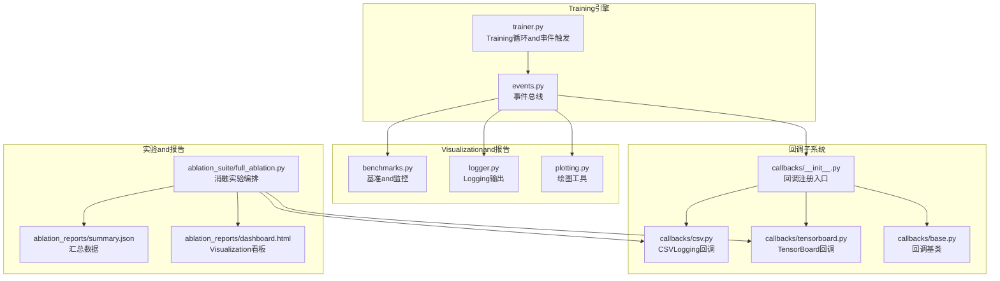
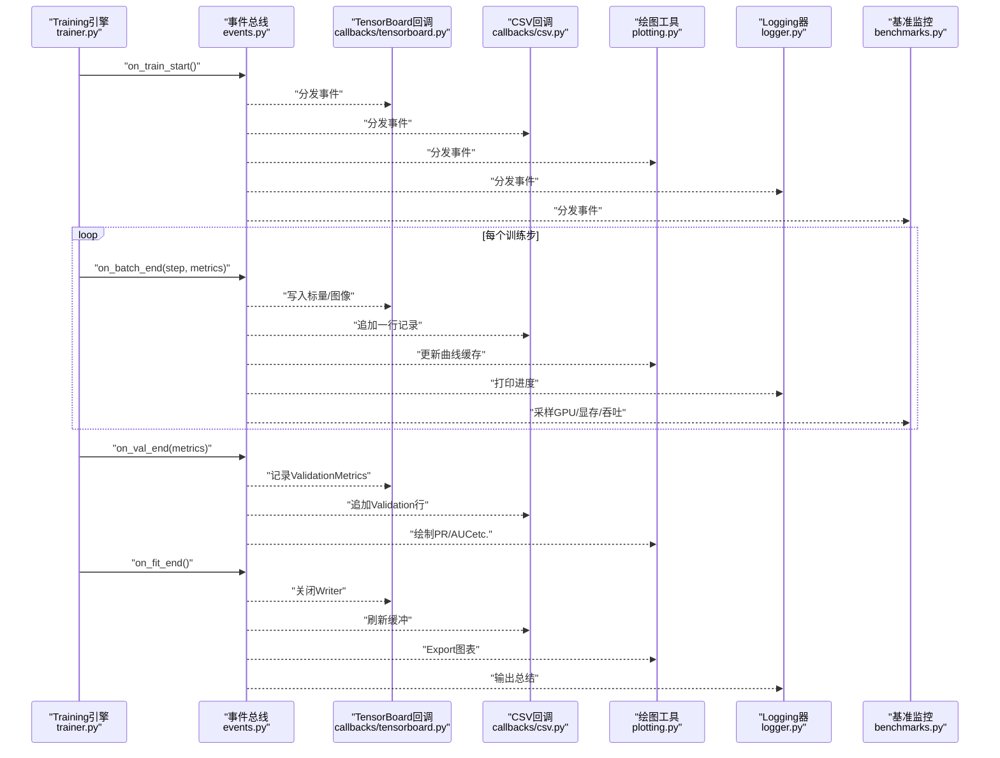
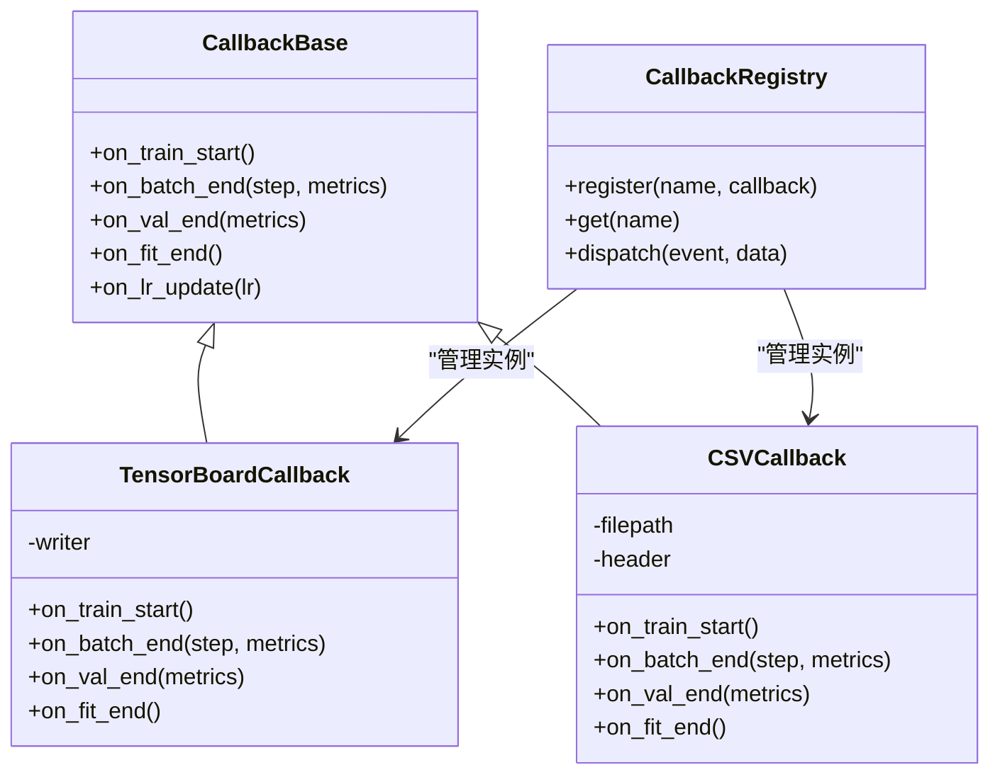
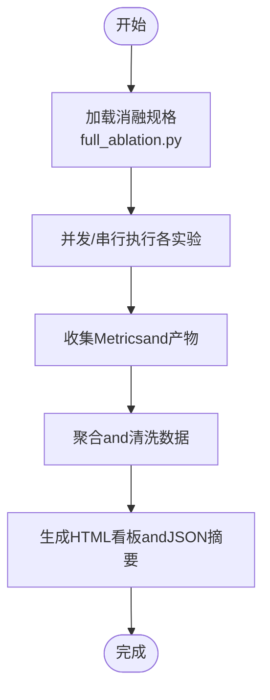
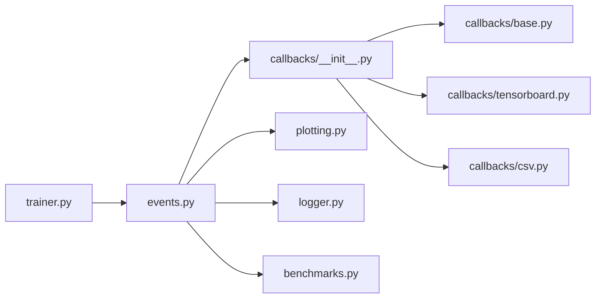

# TrainingVisualization

<cite>
**Files Referenced in This Document**
- [engine/trainer.py](file://ultralytics/engine/trainer.py)
- [utils/callbacks/__init__.py](file://ultralytics/utils/callbacks/__init__.py)
- [utils/callbacks/base.py](file://ultralytics/utils/callbacks/base.py)
- [utils/callbacks/tensorboard.py](file://ultralytics/utils/callbacks/tensorboard.py)
- [utils/callbacks/csv.py](file://ultralytics/utils/callbacks/csv.py)
- [utils/events.py](file://ultralytics/utils/events.py)
- [utils/plotting.py](file://ultralytics/utils/plotting.py)
- [utils/logger.py](file://ultralytics/utils/logger.py)
- [utils/benchmarks.py](file://ultralytics/utils/benchmarks.py)
- [scripts/ablation_suite/full_ablation.py](file://scripts/ablation_suite/full_ablation.py)
- [scripts/ablation_reports/dashboard.html](file://scripts/ablation_reports/dashboard.html)
- [scripts/ablation_reports/summary.json](file://scripts/ablation_reports/summary.json)
- [examples/YOLOv8-MNN-CPP/main.py](file://examples/YOLOv8-MNN-CPP/main.py)
</cite>

## Table of Contents
1. [Introduction](#Introduction)
2. [Project Structure](#Project Structure)
3. [Core Components](#Core Components)
4. [Architecture Overview](#Architecture Overview)
5. [Detailed Component Analysis](#Detailed Component Analysis)
6. [Dependency Analysis](#Dependency Analysis)
7. [性能考量](#性能考量)
8. [Troubleshooting Guide](#Troubleshooting Guide)
9. [Conclusion](#Conclusion)
10. [Appendix](#Appendix)

## Introduction
本技术DocumentationtargetingYOLO-Master的TrainingVisualization系统，聚焦于Training过程中的图表andMetricsVisualization（损失曲线、Learning Rate变化、EvaluationMetrics趋势etc.），并深入说明Centered on下capabilities：
- TensorBoard集成andCSVLogging
- 自定义回调开发方法
- Training进度监控工具（GPU利用率、显存占用、Training速度）
- 实验对比and消融研究报告生成
- Training异常检测and诊断工具链
- Visualization配置选项and自定义图表开发指南
- Distributed Training环境下的Visualization方案

## Project Structure
TrainingVisualization相关代码主要分布whileCentered on下Modules：
- Training引擎and事件总线：负责whileTraining生命周期中触发事件、收集Metrics并分发给回调
- 回调子系统：providesTensorBoard、CSVetc.Built-in回调，Centered onand扩展点用于自定义回调
- 绘图and报告：将Metrics绘制for图表或Exporting toHTML/JSON报告
- 基准and监控：采集Training速度、GPU/显存Usesetc.运行时信息
- 消融实验脚本：批量运行不同配置并汇总结果，生成对比报告

Figure Source
- [engine/trainer.py](file://ultralytics/engine/trainer.py)
- [utils/events.py](file://ultralytics/utils/events.py)
- [utils/callbacks/__init__.py](file://ultralytics/utils/callbacks/__init__.py)
- [utils/callbacks/base.py](file://ultralytics/utils/callbacks/base.py)
- [utils/callbacks/tensorboard.py](file://ultralytics/utils/callbacks/tensorboard.py)
- [utils/callbacks/csv.py](file://ultralytics/utils/callbacks/csv.py)
- [utils/plotting.py](file://ultralytics/utils/plotting.py)
- [utils/logger.py](file://ultralytics/utils/logger.py)
- [utils/benchmarks.py](file://ultralytics/utils/benchmarks.py)
- [scripts/ablation_suite/full_ablation.py](file://scripts/ablation_suite/full_ablation.py)
- [scripts/ablation_reports/dashboard.html](file://scripts/ablation_reports/dashboard.html)
- [scripts/ablation_reports/summary.json](file://scripts/ablation_reports/summary.json)

Section Source
- [engine/trainer.py](file://ultralytics/engine/trainer.py)
- [utils/callbacks/__init__.py](file://ultralytics/utils/callbacks/__init__.py)
- [utils/callbacks/base.py](file://ultralytics/utils/callbacks/base.py)
- [utils/callbacks/tensorboard.py](file://ultralytics/utils/callbacks/tensorboard.py)
- [utils/callbacks/csv.py](file://ultralytics/utils/callbacks/csv.py)
- [utils/events.py](file://ultralytics/utils/events.py)
- [utils/plotting.py](file://ultralytics/utils/plotting.py)
- [utils/logger.py](file://ultralytics/utils/logger.py)
- [utils/benchmarks.py](file://ultralytics/utils/benchmarks.py)
- [scripts/ablation_suite/full_ablation.py](file://scripts/ablation_suite/full_ablation.py)
- [scripts/ablation_reports/dashboard.html](file://scripts/ablation_reports/dashboard.html)
- [scripts/ablation_reports/summary.json](file://scripts/ablation_reports/summary.json)

## Core Components
- Training引擎and事件总线
  - Training循环while关键阶段（初始化、每步、每轮、ValidationEnd、TrainingEndetc.）触发事件，携带Metrics字典and上下文。
  - 事件总线统一分发，确保回调可插拔且互不干扰。
- 回调子系统
  - provides基类定义回调接口，Built-inTensorBoardandCSV回调，SupportingUser自定义回调扩展。
  - 回调订阅事件，执行记录、绘图、保存模型、发送通知etc.操作。
- Visualizationand报告
  - 绘图工具将Metrics转换for曲线图、散点图etc.；Logging器输出结构化文本；基准Modules采集Training速度and硬件资源。
- 消融实验and报告
  - 编排多组实验，聚合结果，生成HTML看板andJSON摘要，便于横向对比and复现。

Section Source
- [utils/callbacks/base.py](file://ultralytics/utils/callbacks/base.py)
- [utils/callbacks/__init__.py](file://ultralytics/utils/callbacks/__init__.py)
- [utils/events.py](file://ultralytics/utils/events.py)
- [utils/plotting.py](file://ultralytics/utils/plotting.py)
- [utils/logger.py](file://ultralytics/utils/logger.py)
- [utils/benchmarks.py](file://ultralytics/utils/benchmarks.py)

## Architecture Overview
下图展示了Training过程中从“事件触发”to“回调处理”再to“Visualization输出”的端to端流程。

Figure Source
- [engine/trainer.py](file://ultralytics/engine/trainer.py)
- [utils/events.py](file://ultralytics/utils/events.py)
- [utils/callbacks/tensorboard.py](file://ultralytics/utils/callbacks/tensorboard.py)
- [utils/callbacks/csv.py](file://ultralytics/utils/callbacks/csv.py)
- [utils/plotting.py](file://ultralytics/utils/plotting.py)
- [utils/logger.py](file://ultralytics/utils/logger.py)
- [utils/benchmarks.py](file://ultralytics/utils/benchmarks.py)

## Detailed Component Analysis

### Training引擎and事件总线
- 职责
  - 管理Training生命周期，维护Optimizer、调度器、EMA、Validatoretc.。
  - while关键节点Calls事件总线，附带当前步数、Metrics、配置etc.信息。
- 关键点
  - 事件命名规范清晰，such as“开始/End/批/Validation/Learning Rate更新”etc.。
  - Metrics字典包含损失分量、Learning Rate、EvaluationMetrics、时间戳etc.。
- 建议
  - 新增Metrics时优先Via事件传递，避免耦合具体回调implementing。

Section Source
- [engine/trainer.py](file://ultralytics/engine/trainer.py)
- [utils/events.py](file://ultralytics/utils/events.py)

### 回调子系统（基类and注册）
- 设计模式
  - 基于观察者模式：回调订阅事件，事件总线负责分发。
  - 基类定义Unified Interface，便于扩展and测试。
- Built-in回调
  - TensorBoard回调：将标量、图像、直方图写入TensorBoardLoggingTable of Contents。
  - CSV回调：Centered on表格形式持久化Metrics，便于离线分析and自动化流水线。
- 扩展点
  - 自定义回调只需继承基类并implementing相应钩子方法，即可接入Training流程。

Figure Source
- [utils/callbacks/base.py](file://ultralytics/utils/callbacks/base.py)
- [utils/callbacks/tensorboard.py](file://ultralytics/utils/callbacks/tensorboard.py)
- [utils/callbacks/csv.py](file://ultralytics/utils/callbacks/csv.py)
- [utils/callbacks/__init__.py](file://ultralytics/utils/callbacks/__init__.py)

Section Source
- [utils/callbacks/base.py](file://ultralytics/utils/callbacks/base.py)
- [utils/callbacks/__init__.py](file://ultralytics/utils/callbacks/__init__.py)
- [utils/callbacks/tensorboard.py](file://ultralytics/utils/callbacks/tensorboard.py)
- [utils/callbacks/csv.py](file://ultralytics/utils/callbacks/csv.py)

### TensorBoard集成
- 功能
  - 记录损失曲线、Learning Rate、EvaluationMetrics（mAP、精度、召回率etc.）。
  - Optional记录权重直方图、Gradient分布、Prediction图像and标注叠加。
- 配置要点
  - 指定LoggingTable of Contents、刷新频率、是否启用图像记录。
  - while分布式环境下，仅主进程写入Centered on避免重复。
- 最佳实践
  - 合理控制图像记录频率，避免I/Obottlenecks。
  - 对大模型权重直方图按需开启，关注关键层。

Section Source
- [utils/callbacks/tensorboard.py](file://ultralytics/utils/callbacks/tensorboard.py)

### CSVLogging
- 功能
  - 将每步/每轮的Metrics追加至CSV文件，便于后续统计andVisualization。
  - Supporting列头自动推断and增量写入。
- Uses场景
  - 离线分析、自动化报表、CI/CD中的Metrics断言。
- 注意事项
  - 大TrainingTasks建议定期刷新缓冲，避免内存增长。
  - 跨进程写入需保证原子性and顺序性。

Section Source
- [utils/callbacks/csv.py](file://ultralytics/utils/callbacks/csv.py)

### 自定义回调开发指南
- 步骤
  - 继承回调基类，implementing所需钩子方法。
  - while回调Registry中注册新回调，或whileTraining启动参数中启用。
- 常见用例
  - 动态早停、Learning Rate策略调整、模型快照、告警通知、外部系统上报。
- Examples路径
  - Refer to现有回调结构and事件签名进行扩展。

Section Source
- [utils/callbacks/base.py](file://ultralytics/utils/callbacks/base.py)
- [utils/callbacks/__init__.py](file://ultralytics/utils/callbacks/__init__.py)

### Training进度监控工具（GPU利用率、显存、Training速度）
- Metrics
  - GPU利用率、显存峰值/均值、每步耗时、吞吐量（样本/秒）、I/Oetc.待占比。
- 采集方式
  - Via基准Modules定时采样，Combining事件总线while关键节点上报。
- Visualization
  - 实时曲线展示，阈值告警，历史对比。
- 分布式注意
  - 仅while主设备采集，或Uses集合操作聚合多卡Metrics。

Section Source
- [utils/benchmarks.py](file://ultralytics/utils/benchmarks.py)
- [utils/events.py](file://ultralytics/utils/events.py)

### 实验对比and消融研究报告生成
- 编排
  - Via消融脚本并行/串行运行多组配置，收集Metricsand产物。
- 报告
  - 生成HTML看板andJSON摘要，包含关键Metrics、超参、运行环境。
- 复用
  - Supporting导入已有结果进行再分析and对比。

Figure Source
- [scripts/ablation_suite/full_ablation.py](file://scripts/ablation_suite/full_ablation.py)
- [scripts/ablation_reports/dashboard.html](file://scripts/ablation_reports/dashboard.html)
- [scripts/ablation_reports/summary.json](file://scripts/ablation_reports/summary.json)

Section Source
- [scripts/ablation_suite/full_ablation.py](file://scripts/ablation_suite/full_ablation.py)
- [scripts/ablation_reports/dashboard.html](file://scripts/ablation_reports/dashboard.html)
- [scripts/ablation_reports/summary.json](file://scripts/ablation_reports/summary.json)

### Training过程异常检测and诊断工具链
- 检测项
  - NaN/Inf损失、Gradient爆炸、Learning Rate异常、ValidationMetrics停滞、I/O阻塞、OOM。
- 手段
  - 回调中插入检查逻辑，触发早停或回滚；Logging器输出堆栈and上下文；基准Modules识别性能退化。
- 诊断
  - CombiningTensorBoard直方图定位问题层；CSV回溯定位异常步；看板快速发现退化实验。

Section Source
- [utils/logger.py](file://ultralytics/utils/logger.py)
- [utils/benchmarks.py](file://ultralytics/utils/benchmarks.py)
- [utils/callbacks/tensorboard.py](file://ultralytics/utils/callbacks/tensorboard.py)
- [utils/callbacks/csv.py](file://ultralytics/utils/callbacks/csv.py)

### Visualization配置选项and自定义图表
- 配置项
  - LoggingTable of Contents、刷新频率、是否记录图像/直方图、CSV路径、看板主题etc.。
- 自定义图表
  - 基于绘图工具Encapsulates业务图表（such as路由分配、专家负载、MoE门控分布）。
  - Via回调while合适时机Calls绘图函数，并输出to看板或本地文件。

Section Source
- [utils/plotting.py](file://ultralytics/utils/plotting.py)
- [utils/callbacks/tensorboard.py](file://ultralytics/utils/callbacks/tensorboard.py)
- [utils/callbacks/csv.py](file://ultralytics/utils/callbacks/csv.py)

### Distributed Training环境下的Visualization解决方案
- 原则
  - 仅主进程写入TensorBoardandCSV，避免重复and竞争。
  - Metrics聚合采用集合通信，确保全局一致性。
- 实践
  - while回调中检测设备角色，按角色分支执行。
  - 看板and报告由主进程生成，其他进程只负责计算and上报。

Section Source
- [utils/callbacks/tensorboard.py](file://ultralytics/utils/callbacks/tensorboard.py)
- [utils/callbacks/csv.py](file://ultralytics/utils/callbacks/csv.py)
- [utils/events.py](file://ultralytics/utils/events.py)

## Dependency Analysis
- 低耦合高内聚
  - 事件总线解耦Training引擎and回调，回调之间相互独立。
- 直接依赖
  - Training引擎依赖事件总线；回调依赖绘图、Logging、基准Modules。
- 潜while风险
  - 回调过多或频繁I/O可能影响Training速度；需while刷新频率and记录粒度间权衡。

Figure Source
- [engine/trainer.py](file://ultralytics/engine/trainer.py)
- [utils/events.py](file://ultralytics/utils/events.py)
- [utils/callbacks/__init__.py](file://ultralytics/utils/callbacks/__init__.py)
- [utils/callbacks/base.py](file://ultralytics/utils/callbacks/base.py)
- [utils/callbacks/tensorboard.py](file://ultralytics/utils/callbacks/tensorboard.py)
- [utils/callbacks/csv.py](file://ultralytics/utils/callbacks/csv.py)
- [utils/plotting.py](file://ultralytics/utils/plotting.py)
- [utils/logger.py](file://ultralytics/utils/logger.py)
- [utils/benchmarks.py](file://ultralytics/utils/benchmarks.py)

Section Source
- [engine/trainer.py](file://ultralytics/engine/trainer.py)
- [utils/events.py](file://ultralytics/utils/events.py)
- [utils/callbacks/__init__.py](file://ultralytics/utils/callbacks/__init__.py)
- [utils/callbacks/base.py](file://ultralytics/utils/callbacks/base.py)
- [utils/callbacks/tensorboard.py](file://ultralytics/utils/callbacks/tensorboard.py)
- [utils/callbacks/csv.py](file://ultralytics/utils/callbacks/csv.py)
- [utils/plotting.py](file://ultralytics/utils/plotting.py)
- [utils/logger.py](file://ultralytics/utils/logger.py)
- [utils/benchmarks.py](file://ultralytics/utils/benchmarks.py)

## 性能考量
- I/O开销
  - 控制TensorBoardandCSV的刷新频率，避免每步写入造成bottlenecks。
- 图像记录
  - 仅whileValidation阶段或低频记录图像，减少磁盘压力。
- 直方图and权重
  - 按需开启，关注关键层，避免全量记录导致延迟。
- 监控采样
  - 降低采样频率，Uses滑动窗口统计，平衡实时性and开销。
- 分布式
  - 仅主进程写入，聚合Metrics后再上报，减少网络and磁盘竞争。

[本节for通用指导，无需特定文件引用]

## Troubleshooting Guide
- 常见问题
  - TensorBoard无数据：检查LoggingTable of Contents权限and主进程写入逻辑。
  - CSV缺失字段：确认事件Metrics字典键名一致，回调头生成正确。
  - Training卡顿：排查I/Obottlenecksand图像/直方图记录频率。
  - Metrics异常：查看NaN/Inf检测andGradient直方图，定位不稳定层。
- 诊断步骤
  - 启用详细Logging，定位异常步；回放CSVandTensorBoard，对比前后行for。
  - Uses基准Modules分析吞吐and资源利用，识别热点。
  - 针对MoE/MoAetc.复杂结构，借助路由Explainerand专用回调观察门控and专家负载。

Section Source
- [utils/logger.py](file://ultralytics/utils/logger.py)
- [utils/benchmarks.py](file://ultralytics/utils/benchmarks.py)
- [utils/callbacks/tensorboard.py](file://ultralytics/utils/callbacks/tensorboard.py)
- [utils/callbacks/csv.py](file://ultralytics/utils/callbacks/csv.py)

## Conclusion
YOLO-Master的TrainingVisualization系统Centered on事件drivers are installedfor核心，Via可插拔的回调机制implementing了灵活的Metrics记录andVisualization。CombiningTensorBoard、CSV、绘图工具and基准监控，既能满足日常Training观测，也能支撑大规模消融实验and分布式部署。建议while工程实践中遵循“低频写入、按需记录、主进程集中输出”的原则，Centered on获得稳定高效的Visualization体验。

[本节for总结性内容，无需特定文件引用]

## Appendix
- 快速上手
  - 启用TensorBoard：whileTraining参数中指定LoggingTable of Contentsand刷新频率。
  - 启用CSV：设置CSV路径，确保可写Table of Contents。
  - 自定义回调：继承基类并注册，implementing业务需求。
- ExamplesRefer to
  - Refer toExamples脚本了解基本用法and参数组合。

Section Source
- [examples/YOLOv8-MNN-CPP/main.py](file://examples/YOLOv8-MNN-CPP/main.py)