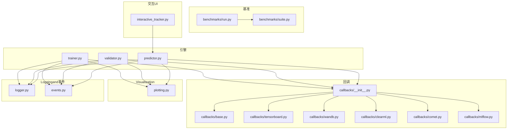
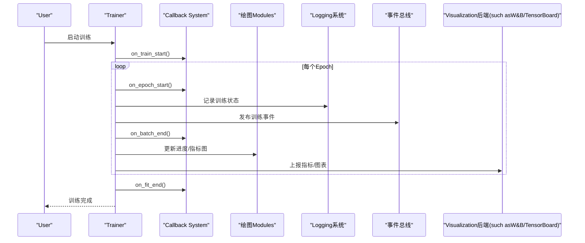
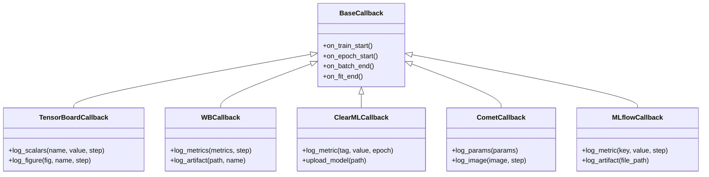
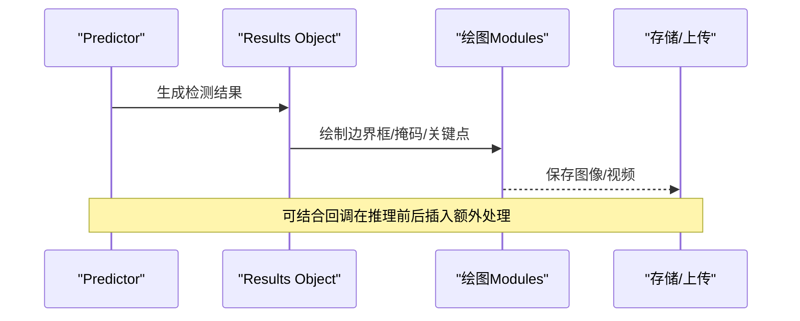
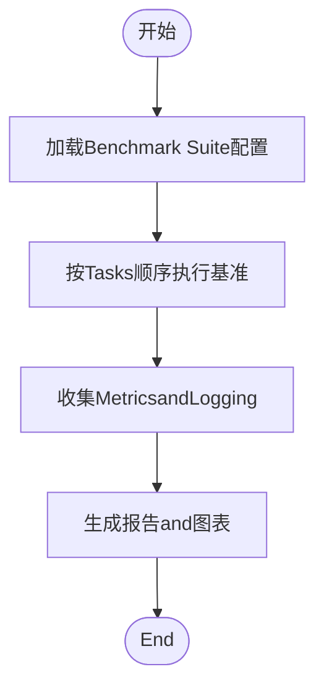
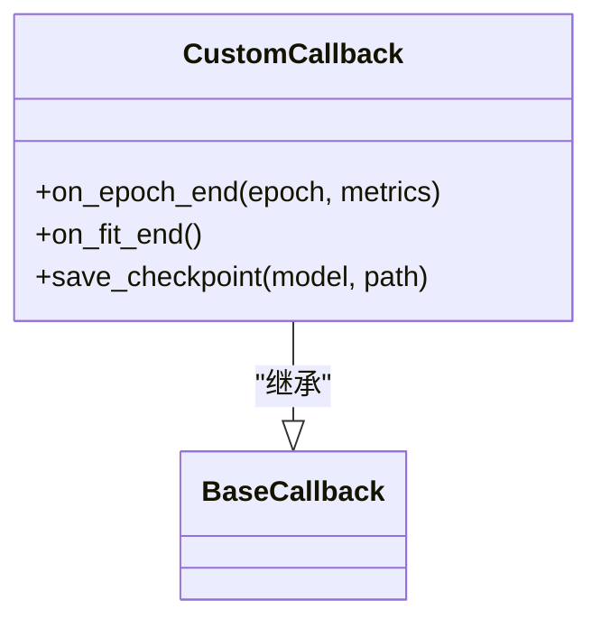
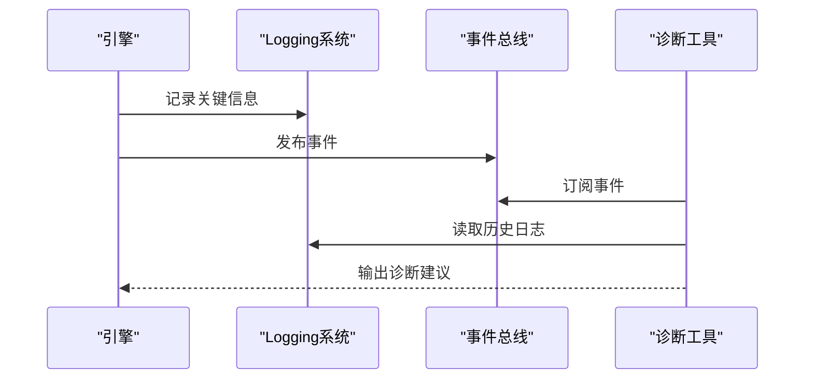
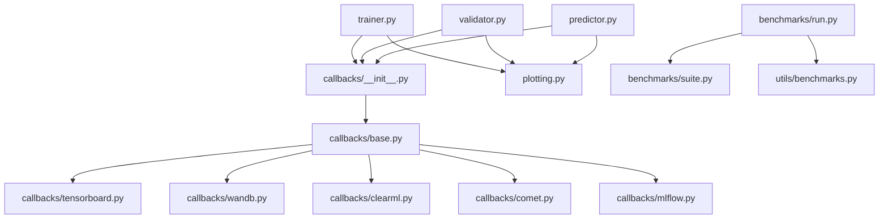

# Visualization and Debugging

<cite>
**Files Referenced in This Document**
- [app.py](file://app.py)
- [engine/trainer.py](file://ultralytics/engine/trainer.py)
- [engine/validator.py](file://ultralytics/engine/validator.py)
- [engine/predictor.py](file://ultralytics/engine/predictor.py)
- [utils/callbacks/__init__.py](file://ultralytics/utils/callbacks/__init__.py)
- [utils/callbacks/base.py](file://ultralytics/utils/callbacks/base.py)
- [utils/callbacks/tensorboard.py](file://ultralytics/utils/callbacks/tensorboard.py)
- [utils/callbacks/clearml.py](file://ultralytics/utils/callbacks/clearml.py)
- [utils/callbacks/comet.py](file://ultralytics/utils/callbacks/comet.py)
- [utils/callbacks/wandb.py](file://ultralytics/utils/callbacks/wandb.py)
- [utils/callbacks/mlflow.py](file://ultralytics/utils/callbacks/mlflow.py)
- [utils/plotting.py](file://ultralytics/utils/plotting.py)
- [utils/benchmarks.py](file://ultralytics/utils/benchmarks.py)
- [utils/logger.py](file://ultralytics/utils/logger.py)
- [utils/events.py](file://ultralytics/utils/events.py)
- [benchmarks/run.py](file://benchmarks/run.py)
- [benchmarks/suite.py](file://benchmarks/suite.py)
- [examples/YOLO-Interactive-Tracking-UI/interactive_tracker.py](file://examples/YOLO-Interactive-Tracking-UI/interactive_tracker.py)
</cite>

## Table of Contents
1. [Introduction](#Introduction)
2. [Project Structure](#Project Structure)
3. [Core Components](#Core Components)
4. [Architecture Overview](#Architecture Overview)
5. [Detailed Component Analysis](#Detailed Component Analysis)
6. [Dependency Analysis](#Dependency Analysis)
7. [性能考量](#性能考量)
8. [Troubleshooting Guide](#Troubleshooting Guide)
9. [Conclusion](#Conclusion)
10. [Appendix](#Appendix)

## Introduction
本文件targetingYOLO-Master的Visualizationand调试系统，覆盖Training期Visualization（损失曲线、Metrics图表、进度监控）、Inference结果Visualization（边界框、掩码、关键点）、性能分析and基准测试工具、自定义回调开发and集成、调试and诊断工具、Logging系统and事件追踪、性能bottlenecksand内存泄漏检测、Visualization定制andExport、交互式调试界面Uses指南、常见问题诊断流程and解决方案，Centered onand实验报告and结果分析工具链。

## Project Structure
andVisualizationand调试相关的代码主要分布whileCentered on下Modules：
- Engine Layer：Trainer、Validator、Predictor负责while关键生命周期阶段触发回调and记录Metrics
- 回调子系统：统一的事件钩子机制，Built-in多种后端（TensorBoard、Weights & Biases、ClearML、Comet、MLflow）
- 绘图andVisualization：统一的绘图API，Supporting绘制Training曲线、混淆矩阵、PR/AUCetc.
- 基准测试：端to端Benchmark Suiteand运行脚本，provides吞吐、延迟、精度对比
- Loggingand事件：结构化Loggingand事件总线，便于追踪and诊断
- 交互界面：Examples交互式TrackingUI，用于while线调试and结果审查

Figure Source
- [engine/trainer.py](file://ultralytics/engine/trainer.py)
- [engine/validator.py](file://ultralytics/engine/validator.py)
- [engine/predictor.py](file://ultralytics/engine/predictor.py)
- [utils/callbacks/__init__.py](file://ultralytics/utils/callbacks/__init__.py)
- [utils/callbacks/base.py](file://ultralytics/utils/callbacks/base.py)
- [utils/callbacks/tensorboard.py](file://ultralytics/utils/callbacks/tensorboard.py)
- [utils/callbacks/wandb.py](file://ultralytics/utils/callbacks/wandb.py)
- [utils/callbacks/clearml.py](file://ultralytics/utils/callbacks/clearml.py)
- [utils/callbacks/comet.py](file://ultralytics/utils/callbacks/comet.py)
- [utils/callbacks/mlflow.py](file://ultralytics/utils/callbacks/mlflow.py)
- [utils/plotting.py](file://ultralytics/utils/plotting.py)
- [benchmarks/run.py](file://benchmarks/run.py)
- [benchmarks/suite.py](file://benchmarks/suite.py)
- [utils/logger.py](file://ultralytics/utils/logger.py)
- [utils/events.py](file://ultralytics/utils/events.py)
- [examples/YOLO-Interactive-Tracking-UI/interactive_tracker.py](file://examples/YOLO-Interactive-Tracking-UI/interactive_tracker.py)

Section Source
- [engine/trainer.py](file://ultralytics/engine/trainer.py)
- [engine/validator.py](file://ultralytics/engine/validator.py)
- [engine/predictor.py](file://ultralytics/engine/predictor.py)
- [utils/callbacks/__init__.py](file://ultralytics/utils/callbacks/__init__.py)
- [utils/callbacks/base.py](file://ultralytics/utils/callbacks/base.py)
- [utils/plotting.py](file://ultralytics/utils/plotting.py)
- [benchmarks/run.py](file://benchmarks/run.py)
- [benchmarks/suite.py](file://benchmarks/suite.py)
- [utils/logger.py](file://ultralytics/utils/logger.py)
- [utils/events.py](file://ultralytics/utils/events.py)
- [examples/YOLO-Interactive-Tracking-UI/interactive_tracker.py](file://examples/YOLO-Interactive-Tracking-UI/interactive_tracker.py)

## Core Components
- TrainerandValidator：whileTraining/Validation的关键阶段（such as每个epoch、每个batch、模型保存、Evaluation完成）触发回调，记录Metrics并drivers are installedVisualization
- Callback System：基于基类扩展的统一事件接口，Built-in多后端Visualizationand实验管理
- 绘图Modules：Encapsulates常用图表绘制逻辑，供Training/Validation/InferencePost-ProcessingCalls
- 基准测试：provides标准Tasksand配置，输出吞吐、延迟、精度etc.Metrics
- Loggingand事件：结构化Loggingand事件总线，贯穿Training/Validation/Inference全链路
- 交互UI：基于Examples的实时TrackingandVisualization界面，辅助调试

Section Source
- [engine/trainer.py](file://ultralytics/engine/trainer.py)
- [engine/validator.py](file://ultralytics/engine/validator.py)
- [utils/callbacks/base.py](file://ultralytics/utils/callbacks/base.py)
- [utils/plotting.py](file://ultralytics/utils/plotting.py)
- [benchmarks/run.py](file://benchmarks/run.py)
- [utils/logger.py](file://ultralytics/utils/logger.py)
- [utils/events.py](file://ultralytics/utils/events.py)

## Architecture Overview
下图展示Training期的Visualizationand调试数据流：引擎while关键节点触发回调，回调将Metrics写入各后端；同时Via绘图Modules生成图表；Loggingand事件贯穿全程，便于追踪and诊断。

Figure Source
- [engine/trainer.py](file://ultralytics/engine/trainer.py)
- [utils/callbacks/__init__.py](file://ultralytics/utils/callbacks/__init__.py)
- [utils/plotting.py](file://ultralytics/utils/plotting.py)
- [utils/logger.py](file://ultralytics/utils/logger.py)
- [utils/events.py](file://ultralytics/utils/events.py)
- [utils/callbacks/wandb.py](file://ultralytics/utils/callbacks/wandb.py)
- [utils/callbacks/tensorboard.py](file://ultralytics/utils/callbacks/tensorboard.py)

## Detailed Component Analysis

### Training期Visualization：损失曲线、Metrics图表and进度监控
- 触发点：Trainerwhile每个epoch和batchEnd时Calls回调，记录损失andMetrics
- 绘图：绘图Modules根据Metrics序列生成曲线图，并whileTraining过程中刷新
- 后端：Callback System可将Metrics同步to外部平台（such asW&B、TensorBoard、ClearML、Comet、MLflow），implementing远程监控and协作
- 进度：CombiningLoggingand事件，可while控制台或外部系统中查看Training进度and异常

Figure Source
- [utils/callbacks/base.py](file://ultralytics/utils/callbacks/base.py)
- [utils/callbacks/tensorboard.py](file://ultralytics/utils/callbacks/tensorboard.py)
- [utils/callbacks/wandb.py](file://ultralytics/utils/callbacks/wandb.py)
- [utils/callbacks/clearml.py](file://ultralytics/utils/callbacks/clearml.py)
- [utils/callbacks/comet.py](file://ultralytics/utils/callbacks/comet.py)
- [utils/callbacks/mlflow.py](file://ultralytics/utils/callbacks/mlflow.py)

Section Source
- [engine/trainer.py](file://ultralytics/engine/trainer.py)
- [utils/callbacks/__init__.py](file://ultralytics/utils/callbacks/__init__.py)
- [utils/callbacks/base.py](file://ultralytics/utils/callbacks/base.py)
- [utils/plotting.py](file://ultralytics/utils/plotting.py)

### Inference结果Visualization：边界框、掩码and关键点标注
- PredictorwhileInference完成后生成检测结果，并Via绘图Modules进行Visualization
- SupportingObject Detection（边界框）、Instance Segmentation（掩码）、Pose Estimation（关键点）and other tasks的Visualization
- 可Via回调或Post-Processing脚本将Visualization结果保存to本地或上传至实验管理平台

Figure Source
- [engine/predictor.py](file://ultralytics/engine/predictor.py)
- [utils/plotting.py](file://ultralytics/utils/plotting.py)

Section Source
- [engine/predictor.py](file://ultralytics/engine/predictor.py)
- [utils/plotting.py](file://ultralytics/utils/plotting.py)

### 性能分析and基准测试工具
- Benchmark Suite：定义标准Tasksand配置，统一执行并汇总结果
- 运行脚本：provides命令行入口，Supporting批量Tasks、参数扫描and结果Export
- Metrics：吞吐（FPS）、延迟（ms）、精度（mAPetc.）、资源占用（GPU/CPU/内存）

Figure Source
- [benchmarks/suite.py](file://benchmarks/suite.py)
- [benchmarks/run.py](file://benchmarks/run.py)
- [utils/benchmarks.py](file://ultralytics/utils/benchmarks.py)

Section Source
- [benchmarks/run.py](file://benchmarks/run.py)
- [benchmarks/suite.py](file://benchmarks/suite.py)
- [utils/benchmarks.py](file://ultralytics/utils/benchmarks.py)

### 自定义回调的开发and集成
- 开发步骤：
  - 继承回调基类，重写所需的生命周期方法
  - while回调中访问Training/Validation上下文andMetrics
  - 将自定义逻辑（such as模型快照、Metrics聚合、告警）写入Logging或外部系统
- 集成方式：
  - whileTrainer初始化时注册自定义回调
  - 确保回调andBuilt-in回调兼容，避免重复上报或冲突

Figure Source
- [utils/callbacks/base.py](file://ultralytics/utils/callbacks/base.py)
- [utils/callbacks/__init__.py](file://ultralytics/utils/callbacks/__init__.py)

Section Source
- [utils/callbacks/base.py](file://ultralytics/utils/callbacks/base.py)
- [utils/callbacks/__init__.py](file://ultralytics/utils/callbacks/__init__.py)

### 调试工具and诊断功能
- Logging系统：结构化LoggingTraining/Validation/Inference关键路径，Supporting分级and过滤
- 事件总线：发布and订阅Training事件，便于跨Modules诊断and追踪
- 诊断脚本：针对特定问题（such as路由、MoE、DDP）的诊断and分析工具

Figure Source
- [utils/logger.py](file://ultralytics/utils/logger.py)
- [utils/events.py](file://ultralytics/utils/events.py)

Section Source
- [utils/logger.py](file://ultralytics/utils/logger.py)
- [utils/events.py](file://ultralytics/utils/events.py)

### Logging系统and事件追踪机制
- Logging：Unified entry point，Supporting控制台and文件输出，包含时间戳、级别、Modules信息
- 事件：Centered on键值对形式记录Training/Validation/Inference关键节点，便于检索and回放
- 集成：回调and引擎均ViaLoggingand事件对外暴露可观测性

Section Source
- [utils/logger.py](file://ultralytics/utils/logger.py)
- [utils/events.py](file://ultralytics/utils/events.py)

### 性能bottlenecks分析and内存泄漏检测
- bottlenecks定位：
  - UsesBenchmark Suite测量不同阶段的耗时and吞吐
  - CombiningLoggingand事件分析热点路径
- 内存泄漏检测：
  - 定期采样进程内存and显存Uses情况
  - 检查张量释放and缓存策略，避免引用残留
- Optimization建议：
  - 调整批大小andData Loading策略
  - 启用Mixture精度and编译Optimization（such as适用）

Section Source
- [utils/benchmarks.py](file://ultralytics/utils/benchmarks.py)
- [utils/logger.py](file://ultralytics/utils/logger.py)

### Visualization结果的定制andExport
- 定制：
  - Via回调whileTraining/Validation/Inference前后插入自定义绘图逻辑
  - 复用绘图Modules的通用函数，保持风格一致
- Export：
  - 将图表and结果保存for图片、HTML或JSON
  - 上传至实验管理平台，便于团队协作and版本管理

Section Source
- [utils/plotting.py](file://ultralytics/utils/plotting.py)
- [utils/callbacks/wandb.py](file://ultralytics/utils/callbacks/wandb.py)
- [utils/callbacks/tensorboard.py](file://ultralytics/utils/callbacks/tensorboard.py)

### 交互式调试界面Uses指南
- Examples界面：交互式TrackingUI，Supporting实时查看Tracking结果、调整阈值、回放历史帧
- Uses方法：
  - 启动Examples脚本，Load modeland数据源
  - while界面中切换Tasks类型（检测/分割/姿态）
  - Export当前视图and结果

Section Source
- [examples/YOLO-Interactive-Tracking-UI/interactive_tracker.py](file://examples/YOLO-Interactive-Tracking-UI/interactive_tracker.py)

## Dependency Analysis
- 耦合度：
  - 引擎and回调松耦合，Via事件and接口通信
  - 绘图Modules独立，被多处复用
- External Dependencies：
  - Visualization后端（W&B、TensorBoard、ClearML、Comet、MLflow）
  - 基准测试所需的第三方库（such aspsutil、pandasetc.）

Figure Source
- [engine/trainer.py](file://ultralytics/engine/trainer.py)
- [engine/validator.py](file://ultralytics/engine/validator.py)
- [engine/predictor.py](file://ultralytics/engine/predictor.py)
- [utils/callbacks/__init__.py](file://ultralytics/utils/callbacks/__init__.py)
- [utils/callbacks/base.py](file://ultralytics/utils/callbacks/base.py)
- [utils/callbacks/tensorboard.py](file://ultralytics/utils/callbacks/tensorboard.py)
- [utils/callbacks/wandb.py](file://ultralytics/utils/callbacks/wandb.py)
- [utils/callbacks/clearml.py](file://ultralytics/utils/callbacks/clearml.py)
- [utils/callbacks/comet.py](file://ultralytics/utils/callbacks/comet.py)
- [utils/callbacks/mlflow.py](file://ultralytics/utils/callbacks/mlflow.py)
- [utils/plotting.py](file://ultralytics/utils/plotting.py)
- [benchmarks/run.py](file://benchmarks/run.py)
- [benchmarks/suite.py](file://benchmarks/suite.py)
- [utils/benchmarks.py](file://ultralytics/utils/benchmarks.py)

Section Source
- [utils/callbacks/__init__.py](file://ultralytics/utils/callbacks/__init__.py)
- [utils/callbacks/base.py](file://ultralytics/utils/callbacks/base.py)
- [benchmarks/run.py](file://benchmarks/run.py)
- [benchmarks/suite.py](file://benchmarks/suite.py)

## 性能考量
- Training期：
  - Set appropriately批大小andData Loading线程数，避免I/Obottlenecks
  - UsesMixture精度andGradient累积提升吞吐
- Inference期：
  - 选择合适的前端and后端（ONNX/TensorRT/OpenVINOetc.）
  - 开启动态形状and批处理Optimization
- Visualization：
  - 控制图表刷新频率，避免阻塞主循环
  - 异步上传大文件，减少网络开销

[This section provides general guidance and does not directly analyze specific files]

## Troubleshooting Guide
- 常见问题：
  - Metrics未上报：检查回调是否成功初始化and连接
  - 图表缺失：确认绘图Modules输入数据格式and维度
  - 基准失败：核对环境依赖and数据集路径
- 诊断流程：
  - 查看Logging中的错误堆栈and警告
  - Via事件总线检索关键节点的状态
  - Uses诊断脚本复现问题并定位根因

Section Source
- [utils/logger.py](file://ultralytics/utils/logger.py)
- [utils/events.py](file://ultralytics/utils/events.py)

## Conclusion
YOLO-Master的Visualizationand调试系统Centered on回调for核心，Combining绘图、Loggingand事件总线，形成完整的可观测性and可调试性框架。Via基准测试and交互界面，User可高效地进行性能分析and结果审查。遵循本Documentation的实践建议，可有效提升TrainingandInference的可控性and可维护性。

[本节for总结，不直接分析具体文件]

## Appendix
- 快速上手：
  - 启动Training并启用W&B或TensorBoard回调
  - 运行Benchmark Suite获取性能基线
  - Uses交互UI进行while线调试
- Refer to命令and路径：
  - TrainerandValidator位于引擎Table of Contents
  - 回调and绘图位于utilsTable of Contents
  - Benchmark Suite位于benchmarksTable of Contents
  - 交互UIExamples位于examplesTable of Contents

[本节for补充说明，不直接分析具体文件]