# API参考文档

<cite>
**本文引用的文件**
- [ultralytics/__init__.py](file://ultralytics/__init__.py)
- [ultralytics/engine/model.py](file://ultralytics/engine/model.py)
- [ultralytics/engine/predictor.py](file://ultralytics/engine/predictor.py)
- [ultralytics/engine/trainer.py](file://ultralytics/engine/trainer.py)
- [ultralytics/engine/validator.py](file://ultralytics/engine/validator.py)
- [ultralytics/engine/exporter.py](file://ultralytics/engine/exporter.py)
- [ultralytics/utils/events.py](file://ultralytics/utils/events.py)
- [ultralytics/utils/errors.py](file://ultralytics/utils/errors.py)
- [ultralytics/hub/session.py](file://ultralytics/hub/session.py)
- [agent/runtime/cli/core_handlers.py](file://agent/runtime/cli/core_handlers.py)
- [agent/runtime/cli/dispatcher.py](file://agent/runtime/cli/dispatcher.py)
- [agent/runtime/cli/job_handlers.py](file://agent/runtime/cli/job_handlers.py)
- [agent/runtime/cli/executor.py](file://agent/runtime/cli/executor.py)
- [agent/runtime/cli/model_handlers.py](file://agent/runtime/cli/model_handlers.py)
- [agent/runtime/cli/multimodal_handlers.py](file://agent/runtime/cli/multimodal_handlers.py)
- [agent/runtime/cli/system_handlers.py](file://agent/runtime/cli/system_handlers.py)
- [agent/runtime/cli/validate.py](file://agent/runtime/cli/validate.py)
- [agent/runtime/cli/snapshot.py](file://agent/runtime/cli/snapshot.py)
- [agent/runtime/cli/lora_tools.py](file://agent/runtime/cli/lora_tools.py)
- [agent/runtime/cli/moe_tools.py](file://agent/runtime/cli/moe_tools.py)
- [agent/runtime/cli/peft_compare.py](file://agent/runtime/cli/peft_compare.py)
- [agent/runtime/cli/stability.py](file://agent/runtime/cli/stability.py)
- [agent/runtime/cli/normalize.py](file://agent/runtime/cli/normalize.py)
- [agent/runtime/cli/progress.py](file://agent/runtime/cli/progress.py)
- [agent/runtime/cli/async_jobs.py](file://agent/runtime/cli/async_jobs.py)
- [agent/runtime/cli/contract.py](file://agent/runtime/cli/contract.py)
- [agent/runtime/cli/pipeline.py](file://agent/runtime/cli/pipeline.py)
- [agent/runtime/cli/dataset.py](file://agent/runtime/cli/dataset.py)
- [agent/runtime/cli/device.py](file://agent/runtime/cli/device.py)
- [agent/runtime/cli/regenerate_open_world_report.py](file://agent/runtime/cli/regenerate_open_world_report.py)
- [agent/runtime/cli/compare_open_world_profiles.py](file://agent/runtime/cli/compare_open_world_profiles.py)
- [agent/runtime/cli/sahi_compare.py](file://agent/runtime/cli/sahi_compare.py)
- [app.py](file://app.py)
</cite>

## 目录
1. [简介](#简介)
2. [项目结构](#项目结构)
3. [核心组件](#核心组件)
4. [架构总览](#架构总览)
5. [详细组件分析](#详细组件分析)
6. [依赖关系分析](#依赖关系分析)
7. [性能与资源特征](#性能与资源特征)
8. [故障排查指南](#故障排查指南)
9. [结论](#结论)
10. [附录](#附录)

## 简介
本API参考文档面向YOLO-Master的Python API、CLI命令与Web API，覆盖公共接口、核心类与方法、配置参数、事件系统与回调、插件扩展点、错误与异常层次、版本兼容性与迁移、IDE集成与自动补全、以及性能与资源使用要求。文档旨在帮助开发者快速上手并稳定集成YOLO-Master到生产环境。

## 项目结构
YOLO-Master采用分层模块化设计：
- Python API层：通过ultralytics包暴露统一入口，封装模型加载、推理、训练、验证与导出等能力。
- 引擎层：engine模块提供Model、Predictor、Trainer、Validator、Exporter等核心运行时组件。
- 工具与事件：utils.events提供事件总线与回调机制；utils.errors定义错误与异常层次。
- CLI层：agent.runtime.cli提供命令行子命令与任务调度器，将用户指令映射到具体处理器与执行器。
- Web服务：顶层app.py提供HTTP服务入口（如FastAPI应用）。
- HUB集成：hub.session提供云端会话与模型/数据集管理能力。

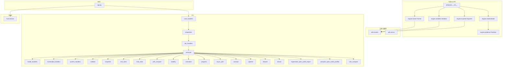

图表来源
- [ultralytics/__init__.py](file://ultralytics/__init__.py)
- [ultralytics/engine/model.py](file://ultralytics/engine/model.py)
- [ultralytics/engine/predictor.py](file://ultralytics/engine/predictor.py)
- [ultralytics/engine/trainer.py](file://ultralytics/engine/trainer.py)
- [ultralytics/engine/validator.py](file://ultralytics/engine/validator.py)
- [ultralytics/engine/exporter.py](file://ultralytics/engine/exporter.py)
- [ultralytics/utils/events.py](file://ultralytics/utils/events.py)
- [ultralytics/utils/errors.py](file://ultralytics/utils/errors.py)
- [agent/runtime/cli/core_handlers.py](file://agent/runtime/cli/core_handlers.py)
- [agent/runtime/cli/dispatcher.py](file://agent/runtime/cli/dispatcher.py)
- [agent/runtime/cli/job_handlers.py](file://agent/runtime/cli/job_handlers.py)
- [agent/runtime/cli/executor.py](file://agent/runtime/cli/executor.py)
- [agent/runtime/cli/model_handlers.py](file://agent/runtime/cli/model_handlers.py)
- [agent/runtime/cli/multimodal_handlers.py](file://agent/runtime/cli/multimodal_handlers.py)
- [agent/runtime/cli/system_handlers.py](file://agent/runtime/cli/system_handlers.py)
- [agent/runtime/cli/validate.py](file://agent/runtime/cli/validate.py)
- [agent/runtime/cli/snapshot.py](file://agent/runtime/cli/snapshot.py)
- [agent/runtime/cli/lora_tools.py](file://agent/runtime/cli/lora_tools.py)
- [agent/runtime/cli/moe_tools.py](file://agent/runtime/cli/moe_tools.py)
- [agent/runtime/cli/peft_compare.py](file://agent/runtime/cli/peft_compare.py)
- [agent/runtime/cli/stability.py](file://agent/runtime/cli/stability.py)
- [agent/runtime/cli/normalize.py](file://agent/runtime/cli/normalize.py)
- [agent/runtime/cli/progress.py](file://agent/runtime/cli/progress.py)
- [agent/runtime/cli/async_jobs.py](file://agent/runtime/cli/async_jobs.py)
- [agent/runtime/cli/contract.py](file://agent/runtime/cli/contract.py)
- [agent/runtime/cli/pipeline.py](file://agent/runtime/cli/pipeline.py)
- [agent/runtime/cli/dataset.py](file://agent/runtime/cli/dataset.py)
- [agent/runtime/cli/device.py](file://agent/runtime/cli/device.py)
- [agent/runtime/cli/regenerate_open_world_report.py](file://agent/runtime/cli/regenerate_open_world_report.py)
- [agent/runtime/cli/compare_open_world_profiles.py](file://agent/runtime/cli/compare_open_world_profiles.py)
- [agent/runtime/cli/sahi_compare.py](file://agent/runtime/cli/sahi_compare.py)
- [app.py](file://app.py)
- [ultralytics/hub/session.py](file://ultralytics/hub/session.py)

章节来源
- [ultralytics/__init__.py](file://ultralytics/__init__.py)
- [ultralytics/engine/model.py](file://ultralytics/engine/model.py)
- [ultralytics/engine/predictor.py](file://ultralytics/engine/predictor.py)
- [ultralytics/engine/trainer.py](file://ultralytics/engine/trainer.py)
- [ultralytics/engine/validator.py](file://ultralytics/engine/validator.py)
- [ultralytics/engine/exporter.py](file://ultralytics/engine/exporter.py)
- [ultralytics/utils/events.py](file://ultralytics/utils/events.py)
- [ultralytics/utils/errors.py](file://ultralytics/utils/errors.py)
- [agent/runtime/cli/core_handlers.py](file://agent/runtime/cli/core_handlers.py)
- [agent/runtime/cli/dispatcher.py](file://agent/runtime/cli/dispatcher.py)
- [agent/runtime/cli/job_handlers.py](file://agent/runtime/cli/job_handlers.py)
- [agent/runtime/cli/executor.py](file://agent/runtime/cli/executor.py)
- [agent/runtime/cli/model_handlers.py](file://agent/runtime/cli/model_handlers.py)
- [agent/runtime/cli/multimodal_handlers.py](file://agent/runtime/cli/multimodal_handlers.py)
- [agent/runtime/cli/system_handlers.py](file://agent/runtime/cli/system_handlers.py)
- [agent/runtime/cli/validate.py](file://agent/runtime/cli/validate.py)
- [agent/runtime/cli/snapshot.py](file://agent/runtime/cli/snapshot.py)
- [agent/runtime/cli/lora_tools.py](file://agent/runtime/cli/lora_tools.py)
- [agent/runtime/cli/moe_tools.py](file://agent/runtime/cli/moe_tools.py)
- [agent/runtime/cli/peft_compare.py](file://agent/runtime/cli/peft_compare.py)
- [agent/runtime/cli/stability.py](file://agent/runtime/cli/stability.py)
- [agent/runtime/cli/normalize.py](file://agent/runtime/cli/normalize.py)
- [agent/runtime/cli/progress.py](file://agent/runtime/cli/progress.py)
- [agent/runtime/cli/async_jobs.py](file://agent/runtime/cli/async_jobs.py)
- [agent/runtime/cli/contract.py](file://agent/runtime/cli/contract.py)
- [agent/runtime/cli/pipeline.py](file://agent/runtime/cli/pipeline.py)
- [agent/runtime/cli/dataset.py](file://agent/runtime/cli/dataset.py)
- [agent/runtime/cli/device.py](file://agent/runtime/cli/device.py)
- [agent/runtime/cli/regenerate_open_world_report.py](file://agent/runtime/cli/regenerate_open_world_report.py)
- [agent/runtime/cli/compare_open_world_profiles.py](file://agent/runtime/cli/compare_open_world_profiles.py)
- [agent/runtime/cli/sahi_compare.py](file://agent/runtime/cli/sahi_compare.py)
- [app.py](file://app.py)
- [ultralytics/hub/session.py](file://ultralytics/hub/session.py)

## 核心组件
本节概述Python API的核心类及其职责，包括构造函数、关键方法、属性与返回值类型说明。为避免冗长代码，所有实现细节以“源码路径”形式引用。

- Model（模型封装）
  - 职责：统一加载权重、设备管理、推理、训练、验证、导出等高层接口。
  - 典型方法：load、predict、train、val、export、info等。
  - 属性：device、task、version、cfg等。
  - 异常：权重缺失、格式不兼容、设备不可用等。
  - 源码路径：[ultralytics/engine/model.py](file://ultralytics/engine/model.py)

- Predictor（推理器）
  - 职责：图像预处理、批处理、NMS、可视化、结果聚合。
  - 典型方法：predict、postprocess、update_state等。
  - 属性：imgsz、conf_thres、iou_thres、augment等。
  - 源码路径：[ultralytics/engine/predictor.py](file://ultralytics/engine/predictor.py)

- Trainer（训练器）
  - 职责：优化器配置、损失计算、EMA、日志记录、检查点保存。
  - 典型方法：setup、fit、resume、save_checkpoint等。
  - 属性：hyp、data、epochs、batch_size等。
  - 源码路径：[ultralytics/engine/trainer.py](file://ultralytics/engine/trainer.py)

- Validator（验证器）
  - 职责：指标计算、混淆矩阵、PR曲线、评估报告生成。
  - 典型方法：validate、compute_metrics、log_results等。
  - 属性：task、classes、iou_thresholds等。
  - 源码路径：[ultralytics/engine/validator.py](file://ultralytics/engine/validator.py)

- Exporter（导出器）
  - 职责：ONNX/TensorRT/OpenVINO/TFLite等格式导出，预检与兼容性校验。
  - 典型方法：export、precheck、optimize等。
  - 属性：format、half、dynamic、opset等。
  - 源码路径：[ultralytics/engine/exporter.py](file://ultralytics/engine/exporter.py)

- 事件系统（events）
  - 职责：订阅/发布事件、生命周期钩子、进度与日志回调。
  - 典型事件：on_train_start、on_epoch_end、on_predict_result、on_export_done等。
  - 源码路径：[ultralytics/utils/events.py](file://ultralytics/utils/events.py)

- 错误与异常（errors）
  - 职责：统一异常层次、错误码、可诊断信息。
  - 常见基类：YoloError、ConfigError、DeviceError、ExportError等。
  - 源码路径：[ultralytics/utils/errors.py](file://ultralytics/utils/errors.py)

- HUB会话（session）
  - 职责：认证、模型/数据集上传下载、远程训练与推理。
  - 典型方法：login、get_model、upload、download、start_training等。
  - 源码路径：[ultralytics/hub/session.py](file://ultralytics/hub/session.py)

章节来源
- [ultralytics/engine/model.py](file://ultralytics/engine/model.py)
- [ultralytics/engine/predictor.py](file://ultralytics/engine/predictor.py)
- [ultralytics/engine/trainer.py](file://ultralytics/engine/trainer.py)
- [ultralytics/engine/validator.py](file://ultralytics/engine/validator.py)
- [ultralytics/engine/exporter.py](file://ultralytics/engine/exporter.py)
- [ultralytics/utils/events.py](file://ultralytics/utils/events.py)
- [ultralytics/utils/errors.py](file://ultralytics/utils/errors.py)
- [ultralytics/hub/session.py](file://ultralytics/hub/session.py)

## 架构总览
下图展示从Python API到引擎、事件、CLI与Web服务的整体交互流程。

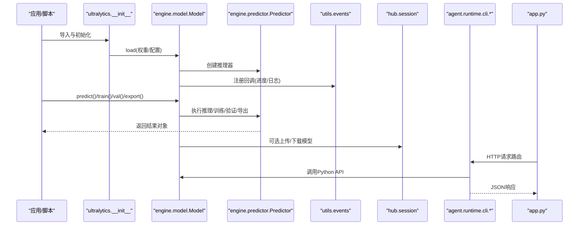

图表来源
- [ultralytics/__init__.py](file://ultralytics/__init__.py)
- [ultralytics/engine/model.py](file://ultralytics/engine/model.py)
- [ultralytics/engine/predictor.py](file://ultralytics/engine/predictor.py)
- [ultralytics/utils/events.py](file://ultralytics/utils/events.py)
- [ultralytics/hub/session.py](file://ultralytics/hub/session.py)
- [agent/runtime/cli/core_handlers.py](file://agent/runtime/cli/core_handlers.py)
- [agent/runtime/cli/dispatcher.py](file://agent/runtime/cli/dispatcher.py)
- [agent/runtime/cli/job_handlers.py](file://agent/runtime/cli/job_handlers.py)
- [agent/runtime/cli/executor.py](file://agent/runtime/cli/executor.py)
- [agent/runtime/cli/model_handlers.py](file://agent/runtime/cli/model_handlers.py)
- [agent/runtime/cli/multimodal_handlers.py](file://agent/runtime/cli/multimodal_handlers.py)
- [agent/runtime/cli/system_handlers.py](file://agent/runtime/cli/system_handlers.py)
- [agent/runtime/cli/validate.py](file://agent/runtime/cli/validate.py)
- [agent/runtime/cli/snapshot.py](file://agent/runtime/cli/snapshot.py)
- [agent/runtime/cli/lora_tools.py](file://agent/runtime/cli/lora_tools.py)
- [agent/runtime/cli/moe_tools.py](file://agent/runtime/cli/moe_tools.py)
- [agent/runtime/cli/peft_compare.py](file://agent/runtime/cli/peft_compare.py)
- [agent/runtime/cli/stability.py](file://agent/runtime/cli/stability.py)
- [agent/runtime/cli/normalize.py](file://agent/runtime/cli/normalize.py)
- [agent/runtime/cli/progress.py](file://agent/runtime/cli/progress.py)
- [agent/runtime/cli/async_jobs.py](file://agent/runtime/cli/async_jobs.py)
- [agent/runtime/cli/contract.py](file://agent/runtime/cli/contract.py)
- [agent/runtime/cli/pipeline.py](file://agent/runtime/cli/pipeline.py)
- [agent/runtime/cli/dataset.py](file://agent/runtime/cli/dataset.py)
- [agent/runtime/cli/device.py](file://agent/runtime/cli/device.py)
- [agent/runtime/cli/regenerate_open_world_report.py](file://agent/runtime/cli/regenerate_open_world_report.py)
- [agent/runtime/cli/compare_open_world_profiles.py](file://agent/runtime/cli/compare_open_world_profiles.py)
- [agent/runtime/cli/sahi_compare.py](file://agent/runtime/cli/sahi_compare.py)
- [app.py](file://app.py)

## 详细组件分析

### Python API：Model类
- 构造函数
  - 主要参数：weights、cfg、task、device、verbose、cache等。
  - 行为：解析权重或配置、选择任务、初始化设备、加载模型权重。
  - 异常：权重不存在、格式不支持、设备不可用、配置冲突。
- 关键方法
  - predict：输入图像/视频/流，返回检测结果对象。
  - train：启动训练，支持断点续训、超参调优。
  - val：执行验证，输出指标与可视化。
  - export：导出为多种部署格式，支持半精度与动态形状。
  - info：打印模型结构与参数统计。
- 属性
  - device：当前运行设备（CPU/GPU）。
  - task：任务类型（detect/segment/pose/track等）。
  - version：框架版本。
  - cfg：配置字典。
- 最佳实践
  - 复用Model实例以减少重复加载开销。
  - 合理设置conf_thres与iou_thres平衡召回与误报。
  - 在GPU上启用半精度以提升吞吐。
- 源码路径
  - [ultralytics/engine/model.py](file://ultralytics/engine/model.py)

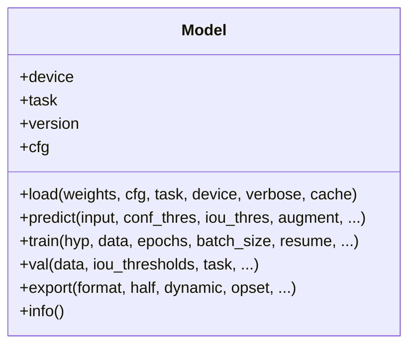

图表来源
- [ultralytics/engine/model.py](file://ultralytics/engine/model.py)

章节来源
- [ultralytics/engine/model.py](file://ultralytics/engine/model.py)

### Python API：Predictor类
- 职责：数据预处理、批处理、后处理（NMS）、结果可视化。
- 关键方法
  - predict：执行推理流水线。
  - postprocess：阈值过滤、NMS、坐标还原。
  - update_state：更新内部状态（如设备、批次大小）。
- 属性
  - imgsz：输入尺寸。
  - conf_thres：置信度阈值。
  - iou_thres：IoU阈值。
  - augment：是否开启测试时增强。
- 源码路径
  - [ultralytics/engine/predictor.py](file://ultralytics/engine/predictor.py)

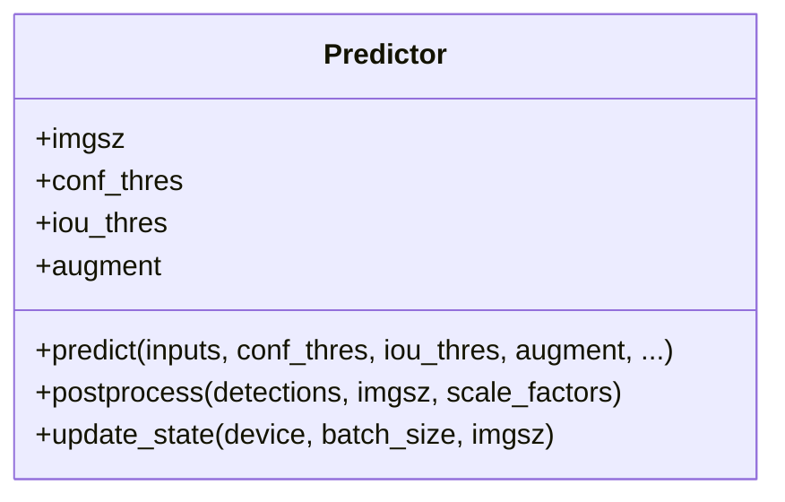

图表来源
- [ultralytics/engine/predictor.py](file://ultralytics/engine/predictor.py)

章节来源
- [ultralytics/engine/predictor.py](file://ultralytics/engine/predictor.py)

### Python API：Trainer类
- 职责：训练循环、优化器、损失、EMA、检查点、日志。
- 关键方法
  - setup：准备数据、模型、优化器、回调。
  - fit：主训练循环。
  - resume：恢复训练。
  - save_checkpoint：保存检查点。
- 属性
  - hyp：超参配置。
  - data：数据集配置。
  - epochs：训练轮数。
  - batch_size：批次大小。
- 源码路径
  - [ultralytics/engine/trainer.py](file://ultralytics/engine/trainer.py)

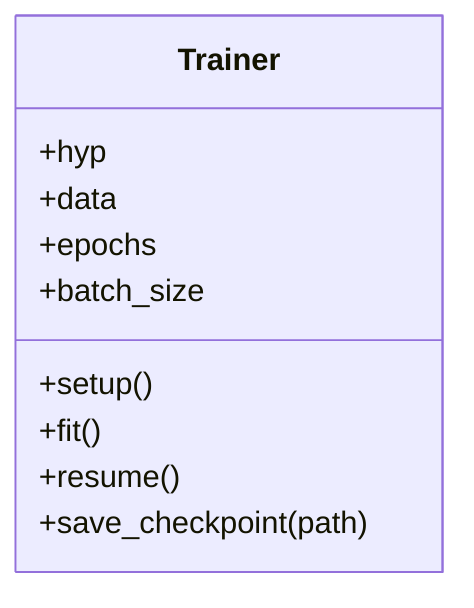

图表来源
- [ultralytics/engine/trainer.py](file://ultralytics/engine/trainer.py)

章节来源
- [ultralytics/engine/trainer.py](file://ultralytics/engine/trainer.py)

### Python API：Validator类
- 职责：验证指标计算、混淆矩阵、PR曲线、报告生成。
- 关键方法
  - validate：执行验证流程。
  - compute_metrics：计算各类指标。
  - log_results：记录与可视化结果。
- 属性
  - task：任务类型。
  - classes：类别列表。
  - iou_thresholds：IoU阈值集合。
- 源码路径
  - [ultralytics/engine/validator.py](file://ultralytics/engine/validator.py)

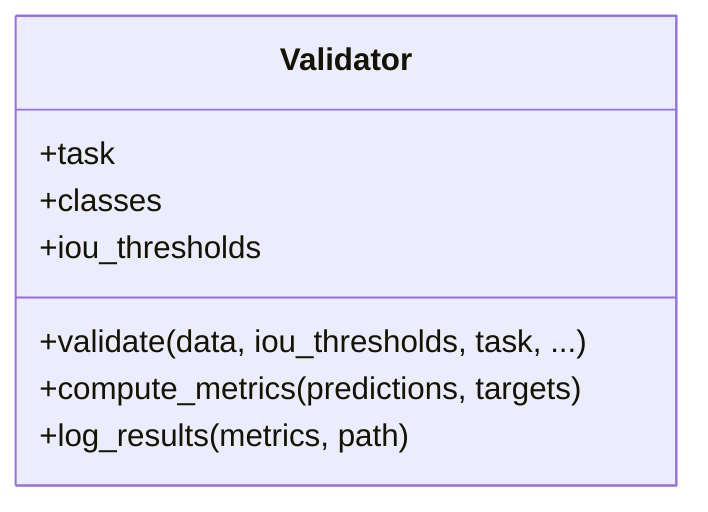

图表来源
- [ultralytics/engine/validator.py](file://ultralytics/engine/validator.py)

章节来源
- [ultralytics/engine/validator.py](file://ultralytics/engine/validator.py)

### Python API：Exporter类
- 职责：多格式导出、预检、优化。
- 关键方法
  - export：执行导出流程。
  - precheck：环境与能力预检。
  - optimize：针对目标后端进行优化。
- 属性
  - format：目标格式（onnx/tensorrt/openvino/tflite等）。
  - half：半精度开关。
  - dynamic：动态形状开关。
  - opset：算子集版本。
- 源码路径
  - [ultralytics/engine/exporter.py](file://ultralytics/engine/exporter.py)

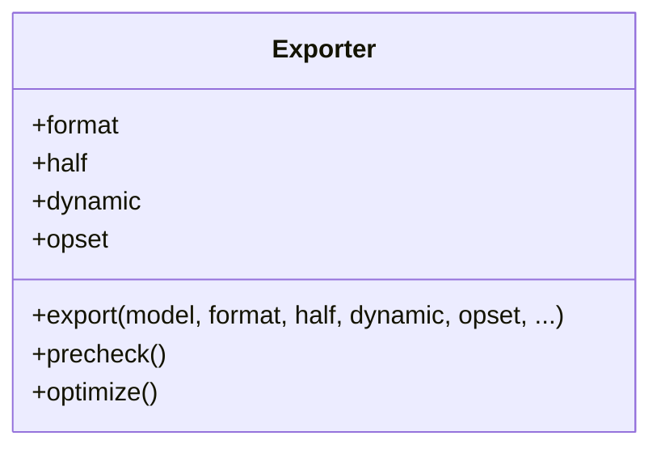

图表来源
- [ultralytics/engine/exporter.py](file://ultralytics/engine/exporter.py)

章节来源
- [ultralytics/engine/exporter.py](file://ultralytics/engine/exporter.py)

### 事件系统与回调机制
- 事件总线
  - 订阅：register(event_name, callback)。
  - 发布：emit(event_name, payload)。
  - 生命周期：训练开始/结束、推理完成、导出完成等。
- 常用事件
  - on_train_start、on_epoch_end、on_predict_result、on_export_done。
- 回调规范
  - 函数签名：callback(event_payload)。
  - 异常隔离：回调内异常不应影响主流程。
- 源码路径
  - [ultralytics/utils/events.py](file://ultralytics/utils/events.py)

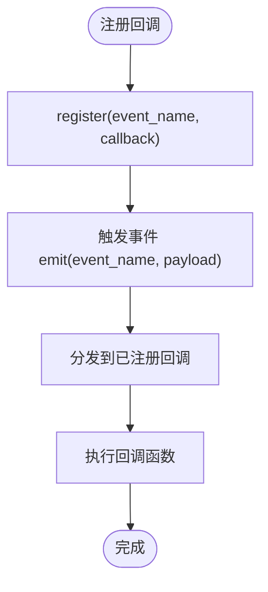

图表来源
- [ultralytics/utils/events.py](file://ultralytics/utils/events.py)

章节来源
- [ultralytics/utils/events.py](file://ultralytics/utils/events.py)

### 错误与异常层次
- 基类
  - YoloError：通用错误基类。
- 派生类
  - ConfigError：配置相关错误。
  - DeviceError：设备不可用或分配失败。
  - ExportError：导出失败或格式不兼容。
  - DataError：数据加载或预处理错误。
- 使用建议
  - 捕获具体异常类型，避免吞掉异常。
  - 提供上下文信息与错误码便于诊断。
- 源码路径
  - [ultralytics/utils/errors.py](file://ultralytics/utils/errors.py)

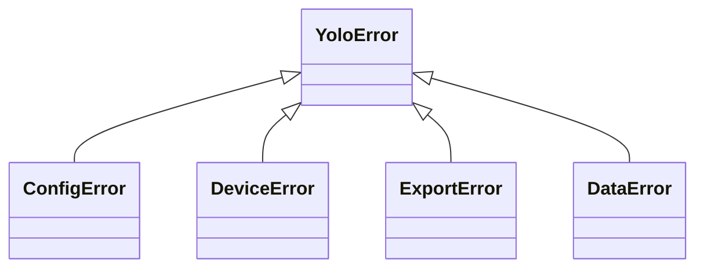

图表来源
- [ultralytics/utils/errors.py](file://ultralytics/utils/errors.py)

章节来源
- [ultralytics/utils/errors.py](file://ultralytics/utils/errors.py)

### CLI命令与任务调度
- 核心处理器
  - core_handlers：定义基础命令与参数解析。
  - dispatcher：命令分发与路由。
  - job_handlers：作业管理与状态跟踪。
  - executor：异步执行与并发控制。
- 功能处理器
  - model_handlers：模型加载/导出/诊断。
  - multimodal_handlers：多模态推理与融合。
  - system_handlers：系统信息与资源监控。
  - validate：数据与配置校验。
  - snapshot：快照与回滚。
  - lora_tools：LoRA微调工具。
  - moe_tools：MoE路由与专家管理。
  - peft_compare：PEFT对比实验。
  - stability：稳定性检测。
  - normalize：数据归一化。
  - progress：进度条与日志。
  - async_jobs：异步作业队列。
  - contract：契约与接口校验。
  - pipeline：端到端流水线编排。
  - dataset：数据集操作。
  - device：设备探测与管理。
  - regenerate_open_world_report：开放世界报告再生成。
  - compare_open_world_profiles：开放世界画像对比。
  - sahi_compare：SAHI切片推理对比。
- 源码路径
  - [agent/runtime/cli/core_handlers.py](file://agent/runtime/cli/core_handlers.py)
  - [agent/runtime/cli/dispatcher.py](file://agent/runtime/cli/dispatcher.py)
  - [agent/runtime/cli/job_handlers.py](file://agent/runtime/cli/job_handlers.py)
  - [agent/runtime/cli/executor.py](file://agent/runtime/cli/executor.py)
  - [agent/runtime/cli/model_handlers.py](file://agent/runtime/cli/model_handlers.py)
  - [agent/runtime/cli/multimodal_handlers.py](file://agent/runtime/cli/multimodal_handlers.py)
  - [agent/runtime/cli/system_handlers.py](file://agent/runtime/cli/system_handlers.py)
  - [agent/runtime/cli/validate.py](file://agent/runtime/cli/validate.py)
  - [agent/runtime/cli/snapshot.py](file://agent/runtime/cli/snapshot.py)
  - [agent/runtime/cli/lora_tools.py](file://agent/runtime/cli/lora_tools.py)
  - [agent/runtime/cli/moe_tools.py](file://agent/runtime/cli/moe_tools.py)
  - [agent/runtime/cli/peft_compare.py](file://agent/runtime/cli/peft_compare.py)
  - [agent/runtime/cli/stability.py](file://agent/runtime/cli/stability.py)
  - [agent/runtime/cli/normalize.py](file://agent/runtime/cli/normalize.py)
  - [agent/runtime/cli/progress.py](file://agent/runtime/cli/progress.py)
  - [agent/runtime/cli/async_jobs.py](file://agent/runtime/cli/async_jobs.py)
  - [agent/runtime/cli/contract.py](file://agent/runtime/cli/contract.py)
  - [agent/runtime/cli/pipeline.py](file://agent/runtime/cli/pipeline.py)
  - [agent/runtime/cli/dataset.py](file://agent/runtime/cli/dataset.py)
  - [agent/runtime/cli/device.py](file://agent/runtime/cli/device.py)
  - [agent/runtime/cli/regenerate_open_world_report.py](file://agent/runtime/cli/regenerate_open_world_report.py)
  - [agent/runtime/cli/compare_open_world_profiles.py](file://agent/runtime/cli/compare_open_world_profiles.py)
  - [agent/runtime/cli/sahi_compare.py](file://agent/runtime/cli/sahi_compare.py)

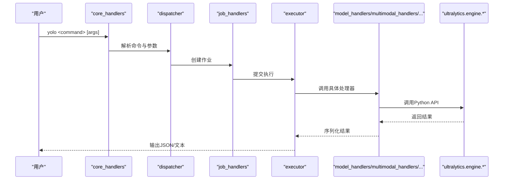

图表来源
- [agent/runtime/cli/core_handlers.py](file://agent/runtime/cli/core_handlers.py)
- [agent/runtime/cli/dispatcher.py](file://agent/runtime/cli/dispatcher.py)
- [agent/runtime/cli/job_handlers.py](file://agent/runtime/cli/job_handlers.py)
- [agent/runtime/cli/executor.py](file://agent/runtime/cli/executor.py)
- [agent/runtime/cli/model_handlers.py](file://agent/runtime/cli/model_handlers.py)
- [agent/runtime/cli/multimodal_handlers.py](file://agent/runtime/cli/multimodal_handlers.py)
- [agent/runtime/cli/system_handlers.py](file://agent/runtime/cli/system_handlers.py)
- [agent/runtime/cli/validate.py](file://agent/runtime/cli/validate.py)
- [agent/runtime/cli/snapshot.py](file://agent/runtime/cli/snapshot.py)
- [agent/runtime/cli/lora_tools.py](file://agent/runtime/cli/lora_tools.py)
- [agent/runtime/cli/moe_tools.py](file://agent/runtime/cli/moe_tools.py)
- [agent/runtime/cli/peft_compare.py](file://agent/runtime/cli/peft_compare.py)
- [agent/runtime/cli/stability.py](file://agent/runtime/cli/stability.py)
- [agent/runtime/cli/normalize.py](file://agent/runtime/cli/normalize.py)
- [agent/runtime/cli/progress.py](file://agent/runtime/cli/progress.py)
- [agent/runtime/cli/async_jobs.py](file://agent/runtime/cli/async_jobs.py)
- [agent/runtime/cli/contract.py](file://agent/runtime/cli/contract.py)
- [agent/runtime/cli/pipeline.py](file://agent/runtime/cli/pipeline.py)
- [agent/runtime/cli/dataset.py](file://agent/runtime/cli/dataset.py)
- [agent/runtime/cli/device.py](file://agent/runtime/cli/device.py)
- [agent/runtime/cli/regenerate_open_world_report.py](file://agent/runtime/cli/regenerate_open_world_report.py)
- [agent/runtime/cli/compare_open_world_profiles.py](file://agent/runtime/cli/compare_open_world_profiles.py)
- [agent/runtime/cli/sahi_compare.py](file://agent/runtime/cli/sahi_compare.py)

章节来源
- [agent/runtime/cli/core_handlers.py](file://agent/runtime/cli/core_handlers.py)
- [agent/runtime/cli/dispatcher.py](file://agent/runtime/cli/dispatcher.py)
- [agent/runtime/cli/job_handlers.py](file://agent/runtime/cli/job_handlers.py)
- [agent/runtime/cli/executor.py](file://agent/runtime/cli/executor.py)
- [agent/runtime/cli/model_handlers.py](file://agent/runtime/cli/model_handlers.py)
- [agent/runtime/cli/multimodal_handlers.py](file://agent/runtime/cli/multimodal_handlers.py)
- [agent/runtime/cli/system_handlers.py](file://agent/runtime/cli/system_handlers.py)
- [agent/runtime/cli/validate.py](file://agent/runtime/cli/validate.py)
- [agent/runtime/cli/snapshot.py](file://agent/runtime/cli/snapshot.py)
- [agent/runtime/cli/lora_tools.py](file://agent/runtime/cli/lora_tools.py)
- [agent/runtime/cli/moe_tools.py](file://agent/runtime/cli/moe_tools.py)
- [agent/runtime/cli/peft_compare.py](file://agent/runtime/cli/peft_compare.py)
- [agent/runtime/cli/stability.py](file://agent/runtime/cli/stability.py)
- [agent/runtime/cli/normalize.py](file://agent/runtime/cli/normalize.py)
- [agent/runtime/cli/progress.py](file://agent/runtime/cli/progress.py)
- [agent/runtime/cli/async_jobs.py](file://agent/runtime/cli/async_jobs.py)
- [agent/runtime/cli/contract.py](file://agent/runtime/cli/contract.py)
- [agent/runtime/cli/pipeline.py](file://agent/runtime/cli/pipeline.py)
- [agent/runtime/cli/dataset.py](file://agent/runtime/cli/dataset.py)
- [agent/runtime/cli/device.py](file://agent/runtime/cli/device.py)
- [agent/runtime/cli/regenerate_open_world_report.py](file://agent/runtime/cli/regenerate_open_world_report.py)
- [agent/runtime/cli/compare_open_world_profiles.py](file://agent/runtime/cli/compare_open_world_profiles.py)
- [agent/runtime/cli/sahi_compare.py](file://agent/runtime/cli/sahi_compare.py)

### Web API（HTTP服务）
- 入口：app.py提供HTTP服务（如FastAPI应用），路由到CLI处理器或直接调用Python API。
- 典型端点
  - /predict：图像/视频推理。
  - /train：启动训练任务。
  - /export：模型导出。
  - /status：作业状态查询。
- 请求/响应
  - 请求：JSON表单或Multipart文件。
  - 响应：结构化JSON（包含结果、指标、日志路径）。
- 安全与鉴权
  - 建议使用中间件进行鉴权与限流。
- 源码路径
  - [app.py](file://app.py)

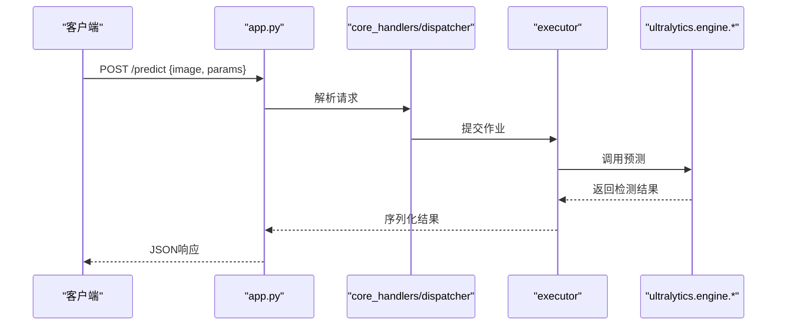

图表来源
- [app.py](file://app.py)
- [agent/runtime/cli/core_handlers.py](file://agent/runtime/cli/core_handlers.py)
- [agent/runtime/cli/dispatcher.py](file://agent/runtime/cli/dispatcher.py)
- [agent/runtime/cli/executor.py](file://agent/runtime/cli/executor.py)
- [ultralytics/engine/model.py](file://ultralytics/engine/model.py)

章节来源
- [app.py](file://app.py)
- [agent/runtime/cli/core_handlers.py](file://agent/runtime/cli/core_handlers.py)
- [agent/runtime/cli/dispatcher.py](file://agent/runtime/cli/dispatcher.py)
- [agent/runtime/cli/executor.py](file://agent/runtime/cli/executor.py)
- [ultralytics/engine/model.py](file://ultralytics/engine/model.py)

### 插件开发与扩展点
- 事件回调扩展
  - 通过事件系统注册自定义回调，实现日志、监控、告警等。
  - 参考：[ultralytics/utils/events.py](file://ultralytics/utils/events.py)
- CLI处理器扩展
  - 新增处理器模块并在dispatcher中注册新命令。
  - 参考：[agent/runtime/cli/dispatcher.py](file://agent/runtime/cli/dispatcher.py)、[agent/runtime/cli/core_handlers.py](file://agent/runtime/cli/core_handlers.py)
- 导出后端扩展
  - 在Exporter中添加新的导出格式支持。
  - 参考：[ultralytics/engine/exporter.py](file://ultralytics/engine/exporter.py)
- 数据管道扩展
  - 在Dataset/Loader中增加新的数据源或预处理步骤。
  - 参考：[agent/runtime/cli/dataset.py](file://agent/runtime/cli/dataset.py)

章节来源
- [ultralytics/utils/events.py](file://ultralytics/utils/events.py)
- [agent/runtime/cli/dispatcher.py](file://agent/runtime/cli/dispatcher.py)
- [agent/runtime/cli/core_handlers.py](file://agent/runtime/cli/core_handlers.py)
- [ultralytics/engine/exporter.py](file://ultralytics/engine/exporter.py)
- [agent/runtime/cli/dataset.py](file://agent/runtime/cli/dataset.py)

## 依赖关系分析
- 耦合与内聚
  - Model高内聚地封装了训练、推理、导出等能力，降低外部耦合。
  - CLI层通过dispatcher解耦命令与处理器，提升可扩展性。
- 直接依赖
  - engine.*依赖utils.events与utils.errors。
  - CLI依赖executor与handlers，间接依赖engine.*。
- 外部依赖
  - HUB集成用于云端模型/数据集管理。
  - Web服务依赖HTTP框架（如FastAPI）。
- 潜在循环依赖
  - 确保CLI仅通过executor调用engine.*，避免反向依赖。

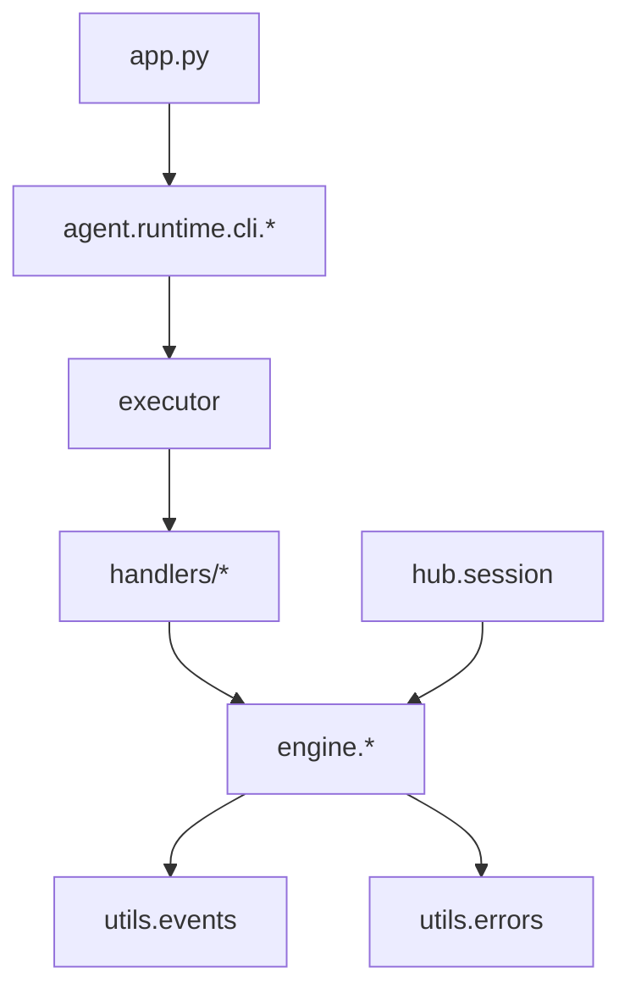

图表来源
- [ultralytics/engine/model.py](file://ultralytics/engine/model.py)
- [ultralytics/engine/predictor.py](file://ultralytics/engine/predictor.py)
- [ultralytics/engine/trainer.py](file://ultralytics/engine/trainer.py)
- [ultralytics/engine/validator.py](file://ultralytics/engine/validator.py)
- [ultralytics/engine/exporter.py](file://ultralytics/engine/exporter.py)
- [ultralytics/utils/events.py](file://ultralytics/utils/events.py)
- [ultralytics/utils/errors.py](file://ultralytics/utils/errors.py)
- [agent/runtime/cli/dispatcher.py](file://agent/runtime/cli/dispatcher.py)
- [agent/runtime/cli/executor.py](file://agent/runtime/cli/executor.py)
- [agent/runtime/cli/model_handlers.py](file://agent/runtime/cli/model_handlers.py)
- [agent/runtime/cli/multimodal_handlers.py](file://agent/runtime/cli/multimodal_handlers.py)
- [agent/runtime/cli/system_handlers.py](file://agent/runtime/cli/system_handlers.py)
- [agent/runtime/cli/validate.py](file://agent/runtime/cli/validate.py)
- [agent/runtime/cli/snapshot.py](file://agent/runtime/cli/snapshot.py)
- [agent/runtime/cli/lora_tools.py](file://agent/runtime/cli/lora_tools.py)
- [agent/runtime/cli/moe_tools.py](file://agent/runtime/cli/moe_tools.py)
- [agent/runtime/cli/peft_compare.py](file://agent/runtime/cli/peft_compare.py)
- [agent/runtime/cli/stability.py](file://agent/runtime/cli/stability.py)
- [agent/runtime/cli/normalize.py](file://agent/runtime/cli/normalize.py)
- [agent/runtime/cli/progress.py](file://agent/runtime/cli/progress.py)
- [agent/runtime/cli/async_jobs.py](file://agent/runtime/cli/async_jobs.py)
- [agent/runtime/cli/contract.py](file://agent/runtime/cli/contract.py)
- [agent/runtime/cli/pipeline.py](file://agent/runtime/cli/pipeline.py)
- [agent/runtime/cli/dataset.py](file://agent/runtime/cli/dataset.py)
- [agent/runtime/cli/device.py](file://agent/runtime/cli/device.py)
- [agent/runtime/cli/regenerate_open_world_report.py](file://agent/runtime/cli/regenerate_open_world_report.py)
- [agent/runtime/cli/compare_open_world_profiles.py](file://agent/runtime/cli/compare_open_world_profiles.py)
- [agent/runtime/cli/sahi_compare.py](file://agent/runtime/cli/sahi_compare.py)
- [app.py](file://app.py)
- [ultralytics/hub/session.py](file://ultralytics/hub/session.py)

章节来源
- [ultralytics/engine/model.py](file://ultralytics/engine/model.py)
- [ultralytics/engine/predictor.py](file://ultralytics/engine/predictor.py)
- [ultralytics/engine/trainer.py](file://ultralytics/engine/trainer.py)
- [ultralytics/engine/validator.py](file://ultralytics/engine/validator.py)
- [ultralytics/engine/exporter.py](file://ultralytics/engine/exporter.py)
- [ultralytics/utils/events.py](file://ultralytics/utils/events.py)
- [ultralytics/utils/errors.py](file://ultralytics/utils/errors.py)
- [agent/runtime/cli/dispatcher.py](file://agent/runtime/cli/dispatcher.py)
- [agent/runtime/cli/executor.py](file://agent/runtime/cli/executor.py)
- [agent/runtime/cli/model_handlers.py](file://agent/runtime/cli/model_handlers.py)
- [agent/runtime/cli/multimodal_handlers.py](file://agent/runtime/cli/multimodal_handlers.py)
- [agent/runtime/cli/system_handlers.py](file://agent/runtime/cli/system_handlers.py)
- [agent/runtime/cli/validate.py](file://agent/runtime/cli/validate.py)
- [agent/runtime/cli/snapshot.py](file://agent/runtime/cli/snapshot.py)
- [agent/runtime/cli/lora_tools.py](file://agent/runtime/cli/lora_tools.py)
- [agent/runtime/cli/moe_tools.py](file://agent/runtime/cli/moe_tools.py)
- [agent/runtime/cli/peft_compare.py](file://agent/runtime/cli/peft_compare.py)
- [agent/runtime/cli/stability.py](file://agent/runtime/cli/stability.py)
- [agent/runtime/cli/normalize.py](file://agent/runtime/cli/normalize.py)
- [agent/runtime/cli/progress.py](file://agent/runtime/cli/progress.py)
- [agent/runtime/cli/async_jobs.py](file://agent/runtime/cli/async_jobs.py)
- [agent/runtime/cli/contract.py](file://agent/runtime/cli/contract.py)
- [agent/runtime/cli/pipeline.py](file://agent/runtime/cli/pipeline.py)
- [agent/runtime/cli/dataset.py](file://agent/runtime/cli/dataset.py)
- [agent/runtime/cli/device.py](file://agent/runtime/cli/device.py)
- [agent/runtime/cli/regenerate_open_world_report.py](file://agent/runtime/cli/regenerate_open_world_report.py)
- [agent/runtime/cli/compare_open_world_profiles.py](file://agent/runtime/cli/compare_open_world_profiles.py)
- [agent/runtime/cli/sahi_compare.py](file://agent/runtime/cli/sahi_compare.py)
- [app.py](file://app.py)
- [ultralytics/hub/session.py](file://ultralytics/hub/session.py)

## 性能与资源特征
- 推理性能
  - 推荐在GPU上使用半精度与动态形状以提升吞吐。
  - 调整conf_thres与iou_thres以平衡延迟与召回。
- 训练性能
  - 合理设置batch_size与num_workers，避免内存溢出。
  - 使用EMA与混合精度加速收敛。
- 导出性能
  - 选择合适的后端（TensorRT/OpenVINO/TFLite）与opset版本。
  - 预检与优化可减少部署时的兼容性问题。
- 资源使用
  - 监控GPU显存与CPU占用，必要时限制并发。
  - 使用异步作业队列提高系统利用率。

## 故障排查指南
- 常见问题
  - 权重加载失败：检查路径与格式，确认设备可用。
  - 导出失败：确认后端依赖安装与环境变量。
  - 训练中断：检查数据完整性与学习率设置。
- 诊断工具
  - 使用事件回调记录关键节点日志。
  - 利用CLI的validate与snapshot进行配置与状态检查。
- 异常处理
  - 捕获具体异常类型，避免吞掉异常。
  - 提供上下文信息与错误码便于定位问题。

章节来源
- [ultralytics/utils/events.py](file://ultralytics/utils/events.py)
- [ultralytics/utils/errors.py](file://ultralytics/utils/errors.py)
- [agent/runtime/cli/validate.py](file://agent/runtime/cli/validate.py)
- [agent/runtime/cli/snapshot.py](file://agent/runtime/cli/snapshot.py)

## 结论
YOLO-Master提供了统一的Python API、丰富的CLI命令与灵活的Web API，结合事件系统与错误层次，满足从开发到生产的多样化需求。通过合理的配置与扩展点，开发者可以高效构建定制化视觉解决方案。

## 附录
- 版本兼容性与迁移
  - 遵循向后兼容性承诺，重大变更需标注弃用周期。
  - 迁移指南：逐步替换旧接口，关注配置漂移检测。
- IDE集成与自动补全
  - 安装类型提示与文档字符串，启用IDE自动补全。
  - 配置虚拟环境与依赖，确保符号解析正确。
- 最佳实践
  - 复用Model实例，减少重复加载。
  - 使用事件回调进行监控与告警。
  - 在生产环境启用导出预检与优化。