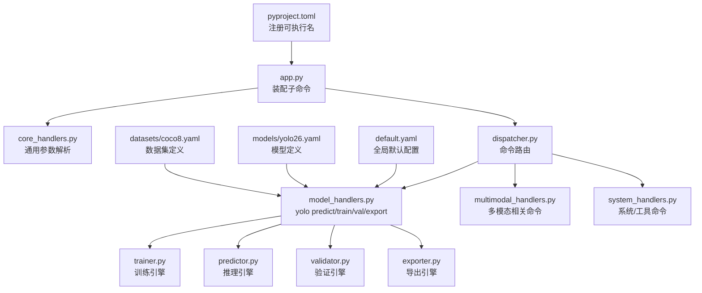
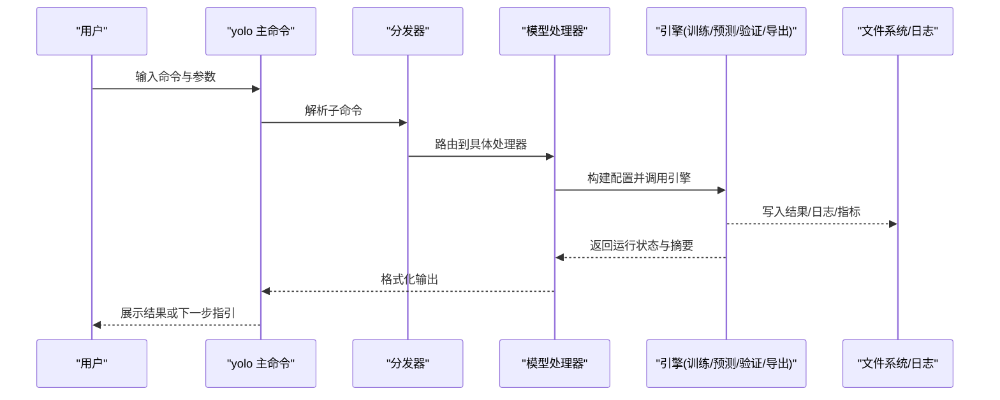
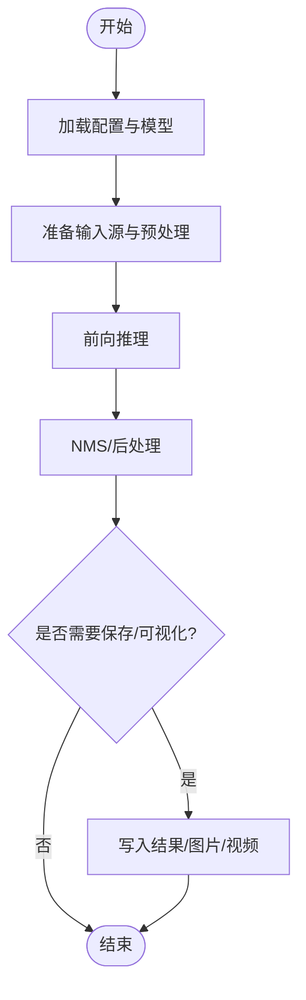
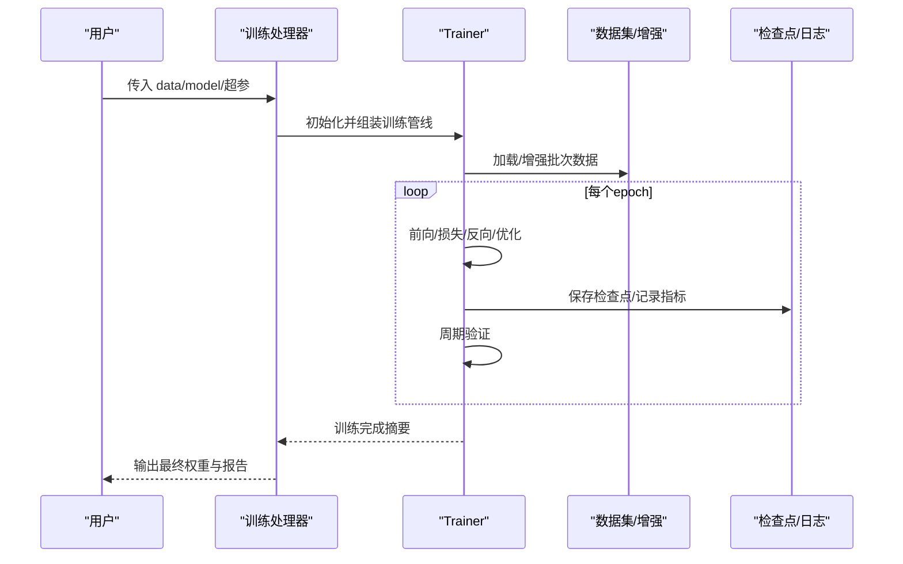
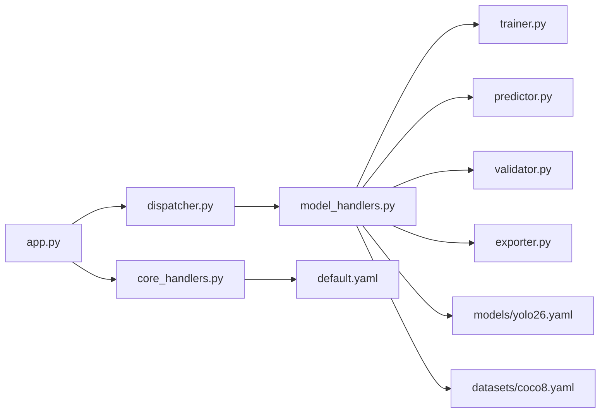

# 命令行API

<cite>
**本文引用的文件**
- [pyproject.toml](file://pyproject.toml)
- [app.py](file://app.py)
- [runtime/cli/core_handlers.py](file://agent/runtime/cli/core_handlers.py)
- [runtime/cli/executor.py](file://agent/runtime/cli/executor.py)
- [runtime/cli/dispatcher.py](file://agent/runtime/cli/dispatcher.py)
- [runtime/cli/model_handlers.py](file://agent/runtime/cli/model_handlers.py)
- [runtime/cli/multimodal_handlers.py](file://agent/runtime/cli/multimodal_handlers.py)
- [runtime/cli/system_handlers.py](file://agent/runtime/cli/system_handlers.py)
- [runtime/cli/pipeline.py](file://agent/runtime/cli/pipeline.py)
- [runtime/cli/job_handlers.py](file://agent/runtime/cli/job_handlers.py)
- [runtime/cli/async_jobs.py](file://agent/runtime/cli/async_jobs.py)
- [runtime/cli/launcher_handlers.py](file://agent/runtime/cli/launcher_handlers.py)
- [runtime/cli/lora_tools.py](file://agent/runtime/cli/lora_tools.py)
- [runtime/cli/moe_tools.py](file://agent/runtime/cli/moe_tools.py)
- [runtime/cli/snapshot.py](file://agent/runtime/cli/snapshot.py)
- [runtime/cli/stability.py](file://agent/runtime/cli/stability.py)
- [runtime/cli/validate.py](file://agent/runtime/cli/validate.py)
- [runtime/cli/normalize.py](file://agent/runtime/cli/normalize.py)
- [runtime/cli/progress.py](file://agent/runtime/cli/progress.py)
- [runtime/cli/device.py](file://agent/runtime/cli/device.py)
- [runtime/cli/dataset.py](file://agent/runtime/cli/dataset.py)
- [runtime/cli/contract.py](file://agent/runtime/cli/contract.py)
- [runtime/cli/compare_open_world_profiles.py](file://agent/runtime/cli/compare_open_world_profiles.py)
- [runtime/cli/regenerate_open_world_report.py](file://agent/runtime/cli/regenerate_open_world_report.py)
- [runtime/cli/sahi_compare.py](file://agent/runtime/cli/sahi_compare.py)
- [runtime/cli/peft_compare.py](file://agent/runtime/cli/peft_compare.py)
- [engine/trainer.py](file://ultralytics/engine/trainer.py)
- [engine/predictor.py](file://ultralytics/engine/predictor.py)
- [engine/validator.py](file://ultralytics/engine/validator.py)
- [engine/exporter.py](file://ultralytics/engine/exporter.py)
- [cfg/default.yaml](file://ultralytics/cfg/default.yaml)
- [cfg/models/yolo26.yaml](file://ultralytics/cfg/models/yolo26.yaml)
- [cfg/datasets/coco8.yaml](file://ultralytics/cfg/datasets/coco8.yaml)
</cite>

## 目录
1. [简介](#简介)
2. [项目结构](#项目结构)
3. [核心组件](#核心组件)
4. [架构总览](#架构总览)
5. [详细组件分析](#详细组件分析)
6. [依赖关系分析](#依赖关系分析)
7. [性能与资源建议](#性能与资源建议)
8. [故障排查指南](#故障排查指南)
9. [结论](#结论)
10. [附录：常用命令模板与工作流](#附录常用命令模板与工作流)

## 简介
本文件为 YOLO-Master 的命令行接口（CLI）完整文档，覆盖预测、训练、验证、导出等核心命令及其参数、配置文件使用方式、批量处理与脚本自动化最佳实践、输出格式控制与结果保存选项、错误处理与调试信息查看方法，并提供常用任务的命令行模板与脚本示例。读者无需深入源码即可高效完成端到端任务。

## 项目结构
YOLO-Master CLI 入口由包元数据注册，并在运行时通过统一调度器分发到具体处理器。核心路径如下：
- 包入口与可执行名注册：pyproject.toml
- 顶层应用装配与子命令挂载：app.py
- CLI 核心调度与处理器：agent/runtime/cli/*
- 引擎层实现（训练/预测/验证/导出）：ultralytics/engine/*
- 默认配置与模型/数据集定义：ultralytics/cfg/*

图表来源
- [pyproject.toml](file://pyproject.toml)
- [app.py](file://app.py)
- [runtime/cli/core_handlers.py](file://agent/runtime/cli/core_handlers.py)
- [runtime/cli/dispatcher.py](file://agent/runtime/cli/dispatcher.py)
- [runtime/cli/model_handlers.py](file://agent/runtime/cli/model_handlers.py)
- [engine/trainer.py](file://ultralytics/engine/trainer.py)
- [engine/predictor.py](file://ultralytics/engine/predictor.py)
- [engine/validator.py](file://ultralytics/engine/validator.py)
- [engine/exporter.py](file://ultralytics/engine/exporter.py)
- [cfg/default.yaml](file://ultralytics/cfg/default.yaml)
- [cfg/models/yolo26.yaml](file://ultralytics/cfg/models/yolo26.yaml)
- [cfg/datasets/coco8.yaml](file://ultralytics/cfg/datasets/coco8.yaml)

章节来源
- [pyproject.toml](file://pyproject.toml)
- [app.py](file://app.py)
- [runtime/cli/core_handlers.py](file://agent/runtime/cli/core_handlers.py)
- [runtime/cli/dispatcher.py](file://agent/runtime/cli/dispatcher.py)
- [runtime/cli/model_handlers.py](file://agent/runtime/cli/model_handlers.py)
- [engine/trainer.py](file://ultralytics/engine/trainer.py)
- [engine/predictor.py](file://ultralytics/engine/predictor.py)
- [engine/validator.py](file://ultralytics/engine/validator.py)
- [engine/exporter.py](file://ultralytics/engine/exporter.py)
- [cfg/default.yaml](file://ultralytics/cfg/default.yaml)
- [cfg/models/yolo26.yaml](file://ultralytics/cfg/models/yolo26.yaml)
- [cfg/datasets/coco8.yaml](file://ultralytics/cfg/datasets/coco8.yaml)

## 核心组件
- 命令注册与装配：在应用入口中集中注册 yolo 主命令及子命令（predict、train、val、export 等），并绑定对应处理器。
- 通用参数解析：提供设备选择、日志级别、工作目录、缓存策略、可视化开关等通用参数，供各子命令复用。
- 命令分发器：根据子命令名称将请求路由至具体处理器，支持扩展新命令。
- 业务处理器：
  - 模型类命令：预测、训练、验证、导出
  - 多模态命令：文本/图像联合推理、提示词管理等
  - 系统与工具命令：设备探测、快照、稳定性检查、对比报告生成等
- 异步与作业管理：后台任务提交、状态查询、结果拉取。
- 引擎对接：调用 ultralytics.engine 中的 trainer/predictor/validator/exporter 完成实际计算。

章节来源
- [app.py](file://app.py)
- [runtime/cli/core_handlers.py](file://agent/runtime/cli/core_handlers.py)
- [runtime/cli/dispatcher.py](file://agent/runtime/cli/dispatcher.py)
- [runtime/cli/model_handlers.py](file://agent/runtime/cli/model_handlers.py)
- [runtime/cli/multimodal_handlers.py](file://agent/runtime/cli/multimodal_handlers.py)
- [runtime/cli/system_handlers.py](file://agent/runtime/cli/system_handlers.py)
- [runtime/cli/async_jobs.py](file://agent/runtime/cli/async_jobs.py)
- [runtime/cli/job_handlers.py](file://agent/runtime/cli/job_handlers.py)
- [engine/trainer.py](file://ultralytics/engine/trainer.py)
- [engine/predictor.py](file://ultralytics/engine/predictor.py)
- [engine/validator.py](file://ultralytics/engine/validator.py)
- [engine/exporter.py](file://ultralytics/engine/exporter.py)

## 架构总览
下图展示了从命令行到引擎层的整体调用链与数据流向。

图表来源
- [runtime/cli/dispatcher.py](file://agent/runtime/cli/dispatcher.py)
- [runtime/cli/model_handlers.py](file://agent/runtime/cli/model_handlers.py)
- [engine/trainer.py](file://ultralytics/engine/trainer.py)
- [engine/predictor.py](file://ultralytics/engine/predictor.py)
- [engine/validator.py](file://ultralytics/engine/validator.py)
- [engine/exporter.py](file://ultralytics/engine/exporter.py)

## 详细组件分析

### 通用参数与配置机制
- 通用参数
  - 设备与并行：GPU/CPU 选择、可见设备、分布式启动参数、批大小、线程数等
  - 路径与输出：工作目录、结果保存路径、是否覆盖已有结果、是否保留中间产物
  - 日志与调试：日志级别、详细模式、进度条开关、可视化开关
  - 缓存与IO：数据缓存、预取、I/O 并发度
- 配置文件加载与覆盖
  - 优先级顺序（从高到低）：命令行参数 > 任务级 YAML > 模型定义 YAML > 全局默认 YAML
  - 合并策略：同名键被高优先级覆盖；嵌套字典按键递归合并；列表型参数通常以命令行为准进行替换
  - 常见配置项：数据集路径、类别数、模型权重、学习率、优化器、增强策略、导出目标格式等
  - 推荐做法：将稳定复现实验的配置放入 YAML，仅对差异项使用命令行覆盖

章节来源
- [runtime/cli/core_handlers.py](file://agent/runtime/cli/core_handlers.py)
- [cfg/default.yaml](file://ultralytics/cfg/default.yaml)

### 命令：yolo predict（预测）
- 功能：对单张图像、图像目录或视频进行目标检测/分割/姿态等推理，支持跟踪与可视化。
- 关键参数
  - 输入：source（图像/视频/目录）、batch、conf、iou、imgsz、half、device、verbose
  - 输出：save_txt/save_json/save_crop、exist_ok、project/name、show/show_conf、line_thickness、hide_labels、hide_conf
  - 高级：nms、agnostic_nms、augment、retina_masks、max_det、classes、region、sahi、stream
- 典型流程
  - 加载模型权重 → 预处理 → 推理 → NMS/后处理 → 可视化/保存 → 统计指标（可选）

图表来源
- [runtime/cli/model_handlers.py](file://agent/runtime/cli/model_handlers.py)
- [engine/predictor.py](file://ultralytics/engine/predictor.py)

章节来源
- [runtime/cli/model_handlers.py](file://agent/runtime/cli/model_handlers.py)
- [engine/predictor.py](file://ultralytics/engine/predictor.py)

### 命令：yolo train（训练）
- 功能：基于数据集与模型定义进行训练，支持断点续训、早停、混合精度、分布式训练等。
- 关键参数
  - 数据与模型：data、model、weights、task、name、project、exist_ok
  - 训练超参：epochs、batch、lr0、lrf、momentum、weight_decay、warmup_epochs、patience、amp、device、workers
  - 增强与正则：hsv、mosaic、mixup、copy_paste、scale、flip、translate、zoom、shear、perspective
  - 日志与可视化：plots、save_period、log_dir、tb、wandb、mlflow
  - 分布式：ddp、rank、local_rank、world_size、sync_bn
- 典型流程
  - 初始化数据集与模型 → 构建优化器与调度器 → 循环训练 → 周期验证与保存 → 汇总指标与可视化

图表来源
- [runtime/cli/model_handlers.py](file://agent/runtime/cli/model_handlers.py)
- [engine/trainer.py](file://ultralytics/engine/trainer.py)

章节来源
- [runtime/cli/model_handlers.py](file://agent/runtime/cli/model_handlers.py)
- [engine/trainer.py](file://ultralytics/engine/trainer.py)

### 命令：yolo val（验证）
- 功能：在验证集上评估模型性能，输出 mAP、precision、recall、混淆矩阵、PR曲线等。
- 关键参数
  - 输入：data、model、split、batch、conf、iou、imgsz、device
  - 输出：save_json、save_hybrid、plots、project/name、exist_ok
- 典型流程
  - 加载验证集 → 批量推理 → 指标计算 → 可视化与导出

章节来源
- [runtime/cli/model_handlers.py](file://agent/runtime/cli/model_handlers.py)
- [engine/validator.py](file://ultralytics/engine/validator.py)

### 命令：yolo export（导出）
- 功能：将 PyTorch 模型导出为 ONNX/TensorRT/OpenVINO/CoreML/TFLite 等格式，便于部署。
- 关键参数
  - 输入：model、weights、task、imgsz、dynamic、half、opset、simplify、include
  - 后端：backend、trt_calib、trt_int8、openvino_fp16、coreml_compute_units、tflite_int8
  - 输出：project/name、exist_ok、verbose
- 典型流程
  - 加载权重 → 构建导出图 → 转换与优化 → 校验与打包

章节来源
- [runtime/cli/model_handlers.py](file://agent/runtime/cli/model_handlers.py)
- [engine/exporter.py](file://ultralytics/engine/exporter.py)

### 命令：多模态与系统工具
- 多模态命令：支持文本+图像联合推理、提示词管理、开放词汇检测等（详见 multimodal_handlers）。
- 系统工具命令：设备探测、快照、稳定性检查、对比报告生成、SAHI 切片推理对比、PEFT/LORA 工具等。

章节来源
- [runtime/cli/multimodal_handlers.py](file://agent/runtime/cli/multimodal_handlers.py)
- [runtime/cli/system_handlers.py](file://agent/runtime/cli/system_handlers.py)
- [runtime/cli/sahi_compare.py](file://agent/runtime/cli/sahi_compare.py)
- [runtime/cli/peft_compare.py](file://agent/runtime/cli/peft_compare.py)
- [runtime/cli/lora_tools.py](file://agent/runtime/cli/lora_tools.py)
- [runtime/cli/moe_tools.py](file://agent/runtime/cli/moe_tools.py)
- [runtime/cli/snapshot.py](file://agent/runtime/cli/snapshot.py)
- [runtime/cli/stability.py](file://agent/runtime/cli/stability.py)

### 异步与作业管理
- 后台提交：将训练/导出等耗时任务提交到后台队列，返回 job_id。
- 状态查询：根据 job_id 查询运行状态、进度与结果位置。
- 结果拉取：完成后自动归档结果，支持远程存储与版本化。

章节来源
- [runtime/cli/async_jobs.py](file://agent/runtime/cli/async_jobs.py)
- [runtime/cli/job_handlers.py](file://agent/runtime/cli/job_handlers.py)

## 依赖关系分析
- 模块耦合
  - app.py 负责装配，低耦合地依赖 dispatcher 与各 handlers
  - model_handlers 作为门面，聚合 trainer/predictor/validator/exporter
  - core_handlers 提供通用参数解析与配置合并逻辑
- 外部依赖
  - ultralytics.engine.* 提供核心算法实现
  - 配置体系依赖 cfg/*.yaml 与默认值
- 潜在风险
  - 避免在 handlers 中直接耦合底层实现细节，保持门面职责单一
  - 配置合并需保证幂等性与可追溯性

图表来源
- [app.py](file://app.py)
- [runtime/cli/core_handlers.py](file://agent/runtime/cli/core_handlers.py)
- [runtime/cli/dispatcher.py](file://agent/runtime/cli/dispatcher.py)
- [runtime/cli/model_handlers.py](file://agent/runtime/cli/model_handlers.py)
- [engine/trainer.py](file://ultralytics/engine/trainer.py)
- [engine/predictor.py](file://ultralytics/engine/predictor.py)
- [engine/validator.py](file://ultralytics/engine/validator.py)
- [engine/exporter.py](file://ultralytics/engine/exporter.py)
- [cfg/default.yaml](file://ultralytics/cfg/default.yaml)
- [cfg/models/yolo26.yaml](file://ultralytics/cfg/models/yolo26.yaml)
- [cfg/datasets/coco8.yaml](file://ultralytics/cfg/datasets/coco8.yaml)

章节来源
- [app.py](file://app.py)
- [runtime/cli/core_handlers.py](file://agent/runtime/cli/core_handlers.py)
- [runtime/cli/dispatcher.py](file://agent/runtime/cli/dispatcher.py)
- [runtime/cli/model_handlers.py](file://agent/runtime/cli/model_handlers.py)
- [engine/trainer.py](file://ultralytics/engine/trainer.py)
- [engine/predictor.py](file://ultralytics/engine/predictor.py)
- [engine/validator.py](file://ultralytics/engine/validator.py)
- [engine/exporter.py](file://ultralytics/engine/exporter.py)
- [cfg/default.yaml](file://ultralytics/cfg/default.yaml)
- [cfg/models/yolo26.yaml](file://ultralytics/cfg/models/yolo26.yaml)
- [cfg/datasets/coco8.yaml](file://ultralytics/cfg/datasets/coco8.yaml)

## 性能与资源建议
- 设备与并行
  - 优先使用 GPU；多卡场景启用分布式参数；合理设置 batch size 与 workers
- 内存与显存
  - 使用 half/混合精度降低显存占用；必要时开启动态形状或裁剪输入尺寸
- I/O 与缓存
  - 增大数据缓存与预取；使用 SSD/NVMe 提升吞吐
- 导出优化
  - 针对目标平台选择合适后端与量化策略；先小图验证再全尺寸导出

[本节为通用指导，不直接分析具体文件]

## 故障排查指南
- 常见问题定位
  - 参数冲突：检查命令行与 YAML 的覆盖顺序，确认重复键的最终取值
  - 设备不可用：核对 device 与驱动/环境；查看设备探测命令输出
  - 数据路径错误：确认 data YAML 中路径存在且可读
  - 导出失败：检查 opset、后端兼容性、模型算子支持
- 日志与调试
  - 提高日志级别；开启 verbose；保存中间产物以便回溯
  - 使用快照与稳定性检查辅助定位异常
- 异步任务
  - 通过 job 查询接口获取状态与错误堆栈；注意清理过期任务

章节来源
- [runtime/cli/system_handlers.py](file://agent/runtime/cli/system_handlers.py)
- [runtime/cli/snapshot.py](file://agent/runtime/cli/snapshot.py)
- [runtime/cli/stability.py](file://agent/runtime/cli/stability.py)
- [runtime/cli/async_jobs.py](file://agent/runtime/cli/async_jobs.py)
- [runtime/cli/job_handlers.py](file://agent/runtime/cli/job_handlers.py)

## 结论
YOLO-Master CLI 通过统一的装配与分发机制，将通用参数、配置合并与具体业务处理器解耦，形成可扩展的命令体系。配合引擎层能力，可快速完成训练、验证、预测与导出等任务。遵循本文档的参数说明、配置覆盖规则与最佳实践，可显著提升效率与稳定性。

[本节为总结，不直接分析具体文件]

## 附录：常用命令模板与工作流

- 预测
  - 单图/目录/视频推理
  - 保存检测结果与可视化
  - 调整置信度与 IoU
- 训练
  - 使用数据集 YAML 与模型权重
  - 设置 epochs/batch/lr 等超参
  - 启用 AMP 与分布式
- 验证
  - 指定 split 与评估指标输出
- 导出
  - 选择目标格式与后端
  - 开启简化与量化（如适用）
- 批量与自动化
  - 使用 shell/python 脚本遍历数据目录
  - 结合异步作业管理后台任务
  - 统一结果目录结构与命名规范
- 配置与覆盖
  - 将稳定配置沉淀为 YAML
  - 仅对差异项使用命令行覆盖
  - 记录每次运行的参数快照

章节来源
- [runtime/cli/model_handlers.py](file://agent/runtime/cli/model_handlers.py)
- [runtime/cli/async_jobs.py](file://agent/runtime/cli/async_jobs.py)
- [runtime/cli/job_handlers.py](file://agent/runtime/cli/job_handlers.py)
- [cfg/default.yaml](file://ultralytics/cfg/default.yaml)
- [cfg/models/yolo26.yaml](file://ultralytics/cfg/models/yolo26.yaml)
- [cfg/datasets/coco8.yaml](file://ultralytics/cfg/datasets/coco8.yaml)