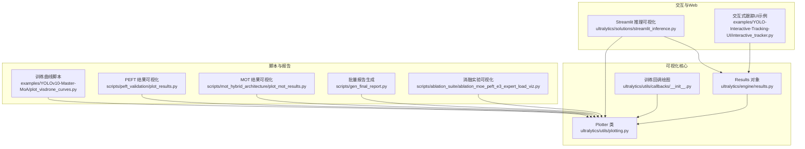
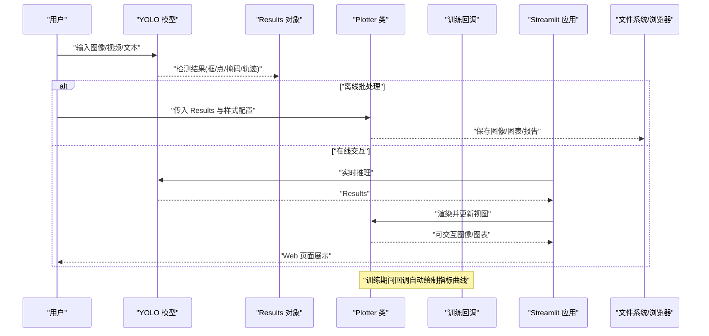
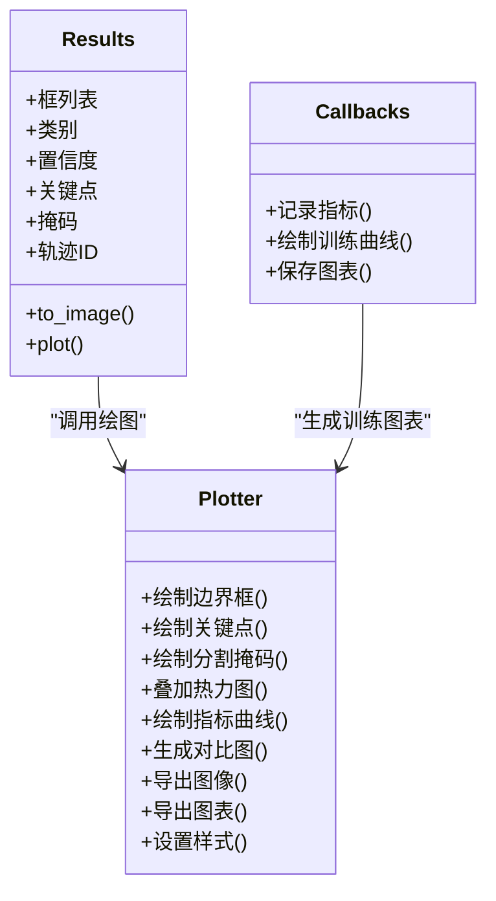
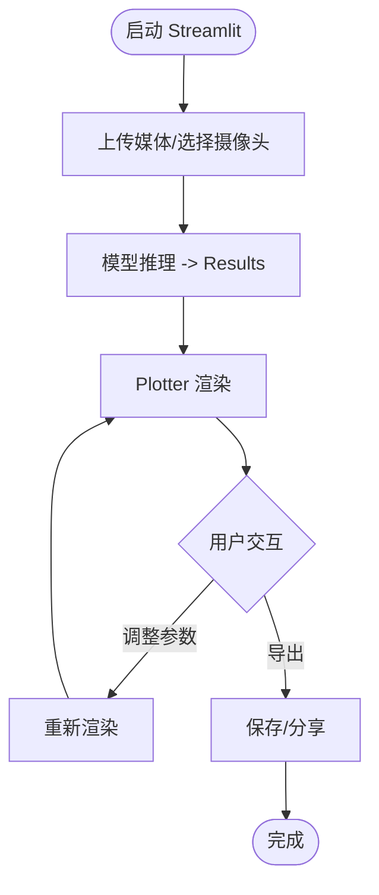
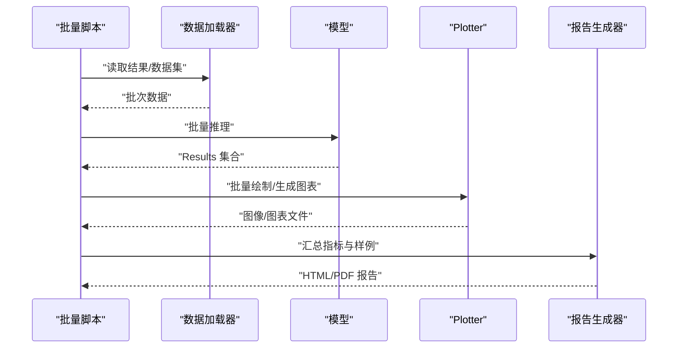
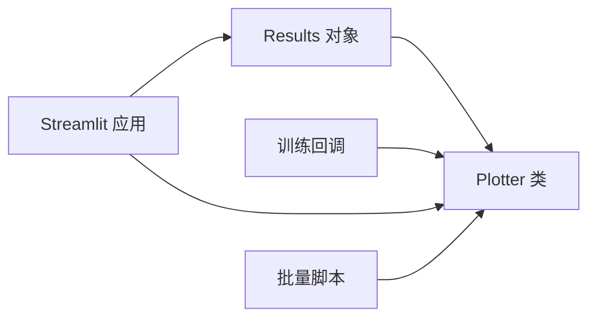

# 可视化工具API

<cite>
**本文引用的文件**
- [ultralytics/utils/plotting.py](file://ultralytics/utils/plotting.py)
- [ultralytics/solutions/streamlit_inference.py](file://ultralytics/solutions/streamlit_inference.py)
- [examples/YOLO-Interactive-Tracking-UI/interactive_tracker.py](file://examples/YOLO-Interactive-Tracking-UI/interactive_tracker.py)
- [examples/YOLOv10-Master-MoA/plot_visdrone_curves.py](file://examples/YOLOv10-Master-MoA/plot_visdrone_curves.py)
- [scripts/ablation_suite/ablation_moe_peft_e3_expert_load_viz.py](file://scripts/ablation_suite/ablation_moe_peft_e3_expert_load_viz.py)
- [scripts/gen_final_report.py](file://scripts/gen_final_report.py)
- [scripts/peft_validation/plot_results.py](file://scripts/peft_validation/plot_results.py)
- [scripts/mot_hybrid_architecture/plot_mot_results.py](file://scripts/mot_hybrid_architecture/plot_mot_results.py)
- [ultralytics/engine/results.py](file://ultralytics/engine/results.py)
- [ultralytics/utils/callbacks/__init__.py](file://ultralytics/utils/callbacks/__init__.py)
</cite>

## 目录
1. [简介](#简介)
2. [项目结构](#项目结构)
3. [核心组件](#核心组件)
4. [架构总览](#架构总览)
5. [详细组件分析](#详细组件分析)
6. [依赖关系分析](#依赖关系分析)
7. [性能考虑](#性能考虑)
8. [故障排查指南](#故障排查指南)
9. [结论](#结论)
10. [附录](#附录)

## 简介
本文件为 YOLO-Master 可视化工具 API 的权威文档，聚焦以下目标：
- 结果可视化函数接口规范：检测结果绘制、训练曲线生成与性能图表创建。
- Plotter 类绘图方法与样式配置说明。
- 交互式可视化实现方式与 Web 集成方法（Streamlit）。
- 自定义可视化组件开发指南。
- 批量结果可视化与报告生成功能。
- 3D 可视化与多模态数据展示方法。
- 可视化结果导出格式与分享功能。
- 渲染性能优化技巧。

## 项目结构
与可视化相关的代码主要分布在以下位置：
- 通用绘图工具与 Plotter 类：ultralytics/utils/plotting.py
- 训练回调中的自动绘图：ultralytics/utils/callbacks/__init__.py
- 推理结果对象与绘制入口：ultralytics/engine/results.py
- Streamlit 实时推理与可视化示例：ultralytics/solutions/streamlit_inference.py
- 交互式跟踪 UI 示例：examples/YOLO-Interactive-Tracking-UI/interactive_tracker.py
- 训练曲线与对比图脚本：examples/YOLOv10-Master-MoA/plot_visdrone_curves.py、scripts/peft_validation/plot_results.py、scripts/mot_hybrid_architecture/plot_mot_results.py
- 批量分析与报告生成：scripts/gen_final_report.py、scripts/ablation_suite/ablation_moe_peft_e3_expert_load_viz.py

图示来源
- [ultralytics/utils/plotting.py](file://ultralytics/utils/plotting.py)
- [ultralytics/engine/results.py](file://ultralytics/engine/results.py)
- [ultralytics/utils/callbacks/__init__.py](file://ultralytics/utils/callbacks/__init__.py)
- [ultralytics/solutions/streamlit_inference.py](file://ultralytics/solutions/streamlit_inference.py)
- [examples/YOLO-Interactive-Tracking-UI/interactive_tracker.py](file://examples/YOLO-Interactive-Tracking-UI/interactive_tracker.py)
- [examples/YOLOv10-Master-MoA/plot_visdrone_curves.py](file://examples/YOLOv10-Master-MoA/plot_visdrone_curves.py)
- [scripts/peft_validation/plot_results.py](file://scripts/peft_validation/plot_results.py)
- [scripts/mot_hybrid_architecture/plot_mot_results.py](file://scripts/mot_hybrid_architecture/plot_mot_results.py)
- [scripts/gen_final_report.py](file://scripts/gen_final_report.py)
- [scripts/ablation_suite/ablation_moe_peft_e3_expert_load_viz.py](file://scripts/ablation_suite/ablation_moe_peft_e3_expert_load_viz.py)

章节来源
- [ultralytics/utils/plotting.py](file://ultralytics/utils/plotting.py)
- [ultralytics/engine/results.py](file://ultralytics/engine/results.py)
- [ultralytics/utils/callbacks/__init__.py](file://ultralytics/utils/callbacks/__init__.py)
- [ultralytics/solutions/streamlit_inference.py](file://ultralytics/solutions/streamlit_inference.py)
- [examples/YOLO-Interactive-Tracking-UI/interactive_tracker.py](file://examples/YOLO-Interactive-Tracking-UI/interactive_tracker.py)
- [examples/YOLOv10-Master-MoA/plot_visdrone_curves.py](file://examples/YOLOv10-Master-MoA/plot_visdrone_curves.py)
- [scripts/peft_validation/plot_results.py](file://scripts/peft_validation/plot_results.py)
- [scripts/mot_hybrid_architecture/plot_mot_results.py](file://scripts/mot_hybrid_architecture/plot_mot_results.py)
- [scripts/gen_final_report.py](file://scripts/gen_final_report.py)
- [scripts/ablation_suite/ablation_moe_peft_e3_expert_load_viz.py](file://scripts/ablation_suite/ablation_moe_peft_e3_expert_load_viz.py)

## 核心组件
- Plotter 类（绘图引擎）
  - 职责：封装检测框、关键点、分割掩码、热力图等绘制逻辑；提供统一的样式配置与导出能力。
  - 典型方法：绘制边界框、类别标签、置信度、关键点连线、分割轮廓、热力图叠加、训练指标曲线等。
  - 样式配置：颜色映射、线宽、透明度、字体大小、标注布局、背景处理等。
  - 输出：返回图像数组或保存至文件，支持 PNG/JPG/PDF/SVG 等格式。
- Results 对象（推理结果载体）
  - 职责：承载模型输出（框、类别、置信度、关键点、掩码、轨迹ID等），并提供便捷绘图接口。
  - 与 Plotter 的关系：Results 通常调用 Plotter 进行渲染，或将自身作为输入传递给外部绘图脚本。
- 训练回调（自动绘图）
  - 职责：在训练过程中按阶段记录并绘制损失、精度、mAP 等指标曲线，便于在线监控。
  - 触发时机：每个 epoch/step 结束或验证集评估后。
- Streamlit 集成（Web 可视化）
  - 职责：将推理结果以交互式界面呈现，支持上传媒体、切换阈值、查看历史结果、导出图片等。
- 示例与脚本（批量与报告）
  - 作用：演示如何对批量结果进行可视化、生成对比图、汇总报告与分享链接。

章节来源
- [ultralytics/utils/plotting.py](file://ultralytics/utils/plotting.py)
- [ultralytics/engine/results.py](file://ultralytics/engine/results.py)
- [ultralytics/utils/callbacks/__init__.py](file://ultralytics/utils/callbacks/__init__.py)
- [ultralytics/solutions/streamlit_inference.py](file://ultralytics/solutions/streamlit_inference.py)

## 架构总览
下图展示了从模型推理到可视化的端到端流程，包括离线脚本与在线 Web 两种路径。

图示来源
- [ultralytics/engine/results.py](file://ultralytics/engine/results.py)
- [ultralytics/utils/plotting.py](file://ultralytics/utils/plotting.py)
- [ultralytics/utils/callbacks/__init__.py](file://ultralytics/utils/callbacks/__init__.py)
- [ultralytics/solutions/streamlit_inference.py](file://ultralytics/solutions/streamlit_inference.py)

## 详细组件分析

### Plotter 类与绘图方法
- 检测结果绘制
  - 绘制边界框：支持多类别颜色、边框宽度、半透明填充、标签显示（类别+置信度）。
  - 关键点绘制：骨架连线、节点标记、可见性指示。
  - 分割掩码：轮廓描边、区域填充、透明度控制。
  - 热力图叠加：将注意力或显著性热力图与原图融合，支持色带与归一化选项。
- 训练曲线与性能图表
  - 指标曲线：损失、精度、召回率、mAP@0.5、mAP@0.5:0.95 等随 epoch 变化曲线。
  - 对比图：多模型或多配置在同一图中的对比，支持分组与图例。
  - 统计图：混淆矩阵、PR 曲线、ROC 曲线、类别分布直方图等。
- 样式配置
  - 全局样式：主题、字体、字号、颜色表、线条样式、网格与坐标轴刻度。
  - 局部覆盖：针对特定任务或数据集的默认样式覆盖。
- 导出与分享
  - 导出格式：PNG/JPG（位图）、PDF/SVG（矢量）、HTML（含交互图表）、JSON（元数据）。
  - 分享方式：本地下载、生成分享链接（结合平台存储）、嵌入 Notebook/网页。

图示来源
- [ultralytics/utils/plotting.py](file://ultralytics/utils/plotting.py)
- [ultralytics/engine/results.py](file://ultralytics/engine/results.py)
- [ultralytics/utils/callbacks/__init__.py](file://ultralytics/utils/callbacks/__init__.py)

章节来源
- [ultralytics/utils/plotting.py](file://ultralytics/utils/plotting.py)
- [ultralytics/engine/results.py](file://ultralytics/engine/results.py)
- [ultralytics/utils/callbacks/__init__.py](file://ultralytics/utils/callbacks/__init__.py)

### 交互式可视化与 Web 集成（Streamlit）
- 实时推理与可视化
  - 通过 Streamlit 接收用户上传的图像/视频流，调用模型推理得到 Results，再使用 Plotter 渲染并即时更新界面。
  - 支持动态调整阈值、选择类别、切换可视化模式（仅框/关键点/掩码/热力图）。
- 交互控件
  - 滑块/下拉菜单：阈值、类别过滤、样式切换。
  - 按钮：导出当前帧、批量导出、生成报告。
  - 历史记录：缓存最近 N 次推理结果，支持回放与对比。
- 部署与分享
  - 本地运行：streamlit run streamlit_inference.py。
  - 云端部署：容器化部署，配合对象存储生成分享链接。

图示来源
- [ultralytics/solutions/streamlit_inference.py](file://ultralytics/solutions/streamlit_inference.py)
- [ultralytics/engine/results.py](file://ultralytics/engine/results.py)
- [ultralytics/utils/plotting.py](file://ultralytics/utils/plotting.py)

章节来源
- [ultralytics/solutions/streamlit_inference.py](file://ultralytics/solutions/streamlit_inference.py)
- [examples/YOLO-Interactive-Tracking-UI/interactive_tracker.py](file://examples/YOLO-Interactive-Tracking-UI/interactive_tracker.py)

### 批量结果可视化与报告生成
- 批量可视化
  - 遍历数据集或推理结果目录，统一调用 Plotter 生成可视化图集，支持分页与缩略图预览。
  - 脚本示例：训练曲线对比、PEFT 结果可视化、MOT 轨迹可视化。
- 报告生成
  - 汇总关键指标、代表性样本、失败案例、趋势分析，输出 HTML/PDF 报告。
  - 自动化流水线：数据加载 -> 推理 -> 可视化 -> 报告组装 -> 导出。

图示来源
- [examples/YOLOv10-Master-MoA/plot_visdrone_curves.py](file://examples/YOLOv10-Master-MoA/plot_visdrone_curves.py)
- [scripts/peft_validation/plot_results.py](file://scripts/peft_validation/plot_results.py)
- [scripts/mot_hybrid_architecture/plot_mot_results.py](file://scripts/mot_hybrid_architecture/plot_mot_results.py)
- [scripts/gen_final_report.py](file://scripts/gen_final_report.py)
- [scripts/ablation_suite/ablation_moe_peft_e3_expert_load_viz.py](file://scripts/ablation_suite/ablation_moe_peft_e3_expert_load_viz.py)

章节来源
- [examples/YOLOv10-Master-MoA/plot_visdrone_curves.py](file://examples/YOLOv10-Master-MoA/plot_visdrone_curves.py)
- [scripts/peft_validation/plot_results.py](file://scripts/peft_validation/plot_results.py)
- [scripts/mot_hybrid_architecture/plot_mot_results.py](file://scripts/mot_hybrid_architecture/plot_mot_results.py)
- [scripts/gen_final_report.py](file://scripts/gen_final_report.py)
- [scripts/ablation_suite/ablation_moe_peft_e3_expert_load_viz.py](file://scripts/ablation_suite/ablation_moe_peft_e3_expert_load_viz.py)

### 3D 可视化与多模态数据展示
- 3D 可视化
  - 场景：3D 点云、深度图、相机标定、轨迹空间投影。
  - 方法：将检测结果投影至 3D 坐标系，使用 3D 图形库渲染（如 Matplotlib 3D、Plotly 3D、Open3D）。
  - 注意：尺度一致性、坐标变换、遮挡处理与交互旋转缩放。
- 多模态数据
  - 文本-图像联合可视化：将文本描述与检测结果对齐展示，支持高亮关键词与对应区域。
  - 时序-空间联合：视频帧序列中叠加轨迹与事件时间轴，便于理解动态行为。

[本节为概念性内容，不直接分析具体文件]

### 自定义可视化组件开发指南
- 设计原则
  - 单一职责：每个组件负责一种可视化类型（如热力图、轨迹、统计图）。
  - 可配置：通过样式字典或配置对象注入主题与参数。
  - 可扩展：支持插件式注册，便于第三方扩展。
- 开发步骤
  - 定义输入契约：明确接受的 Results 字段与数据结构。
  - 实现渲染逻辑：基于 Plotter 或独立绘图库实现。
  - 提供导出接口：统一导出为图像/图表/HTML。
  - 编写测试用例：覆盖边界条件与异常输入。
- 集成方式
  - 在 Streamlit 中注册新组件，提供交互控件。
  - 在批量脚本中调用新组件，纳入报告模板。

[本节为概念性内容，不直接分析具体文件]

## 依赖关系分析
- 内部依赖
  - Plotter 依赖图像处理与数学运算基础库（如 NumPy、OpenCV、Matplotlib）。
  - Results 提供标准化输出，供 Plotter 与外部脚本消费。
  - 训练回调在训练生命周期内驱动 Plotter 生成指标曲线。
- 外部依赖
  - Streamlit 用于 Web 交互与部署。
  - 可选 3D/多模态库用于高级可视化。
- 耦合与内聚
  - Plotter 与 Results 解耦良好，便于替换渲染后端。
  - 回调与 Plotter 通过约定接口通信，降低耦合度。

图示来源
- [ultralytics/engine/results.py](file://ultralytics/engine/results.py)
- [ultralytics/utils/plotting.py](file://ultralytics/utils/plotting.py)
- [ultralytics/utils/callbacks/__init__.py](file://ultralytics/utils/callbacks/__init__.py)
- [ultralytics/solutions/streamlit_inference.py](file://ultralytics/solutions/streamlit_inference.py)

章节来源
- [ultralytics/engine/results.py](file://ultralytics/engine/results.py)
- [ultralytics/utils/plotting.py](file://ultralytics/utils/plotting.py)
- [ultralytics/utils/callbacks/__init__.py](file://ultralytics/utils/callbacks/__init__.py)
- [ultralytics/solutions/streamlit_inference.py](file://ultralytics/solutions/streamlit_inference.py)

## 性能考虑
- 渲染优化
  - 批量渲染：合并多次绘制调用，减少 I/O 开销。
  - 分辨率控制：按需降采样大图，先预览后高清导出。
  - 缓存策略：对重复样式与静态元素进行缓存。
- 内存管理
  - 及时释放中间图像与临时数组，避免峰值内存过高。
  - 使用生成器或分块处理大规模数据集。
- 并行与异步
  - 多线程/多进程并行渲染，注意线程安全与资源竞争。
  - 在 Streamlit 中使用异步 IO 提升响应速度。
- 网络与分享
  - 压缩导出文件，使用 CDN 加速分享链接访问。
  - 增量更新：仅重绘变更部分，减少带宽消耗。

[本节提供一般性指导，不直接分析具体文件]

## 故障排查指南
- 常见问题
  - 样式未生效：检查样式配置优先级与覆盖规则。
  - 导出失败：确认目标路径权限与格式支持。
  - 内存溢出：降低分辨率或启用分块处理。
  - 交互卡顿：减少每帧绘制复杂度，启用缓存。
- 调试建议
  - 打印中间结果尺寸与数据类型，确保与绘图接口契约一致。
  - 逐步关闭可视化层（如热力图、掩码）定位瓶颈。
  - 使用最小复现脚本隔离问题。

[本节为通用指导，不直接分析具体文件]

## 结论
YOLO-Master 的可视化工具 API 围绕 Plotter 类构建，提供从检测结果绘制到训练曲线与性能图表的一体化能力。通过 Streamlit 可实现交互式 Web 可视化，结合批量脚本与报告生成，形成完整的可视化与分析闭环。遵循本文档的接口规范与最佳实践，可高效扩展自定义组件，满足 3D 与多模态数据的展示需求，并在性能与可维护性之间取得平衡。

[本节为总结性内容，不直接分析具体文件]

## 附录
- 快速上手
  - 使用 Results.plot() 快速生成可视化图像。
  - 通过 Plotter 设置样式并导出 PNG/PDF/SVG。
  - 在 Streamlit 中集成实时推理与可视化。
- 参考示例
  - 训练曲线对比：examples/YOLOv10-Master-MoA/plot_visdrone_curves.py
  - PEFT 结果可视化：scripts/peft_validation/plot_results.py
  - MOT 轨迹可视化：scripts/mot_hybrid_architecture/plot_mot_results.py
  - 批量报告生成：scripts/gen_final_report.py
  - 消融实验可视化：scripts/ablation_suite/ablation_moe_peft_e3_expert_load_viz.py

[本节为补充信息，不直接分析具体文件]