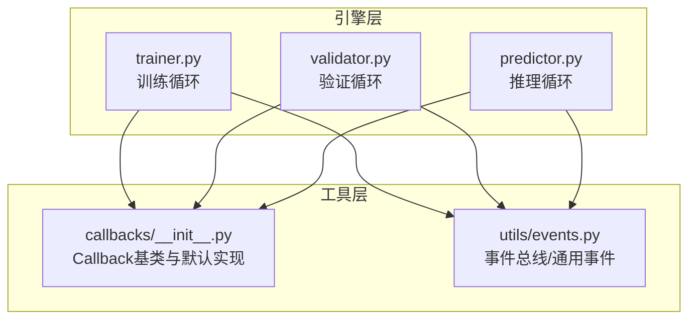
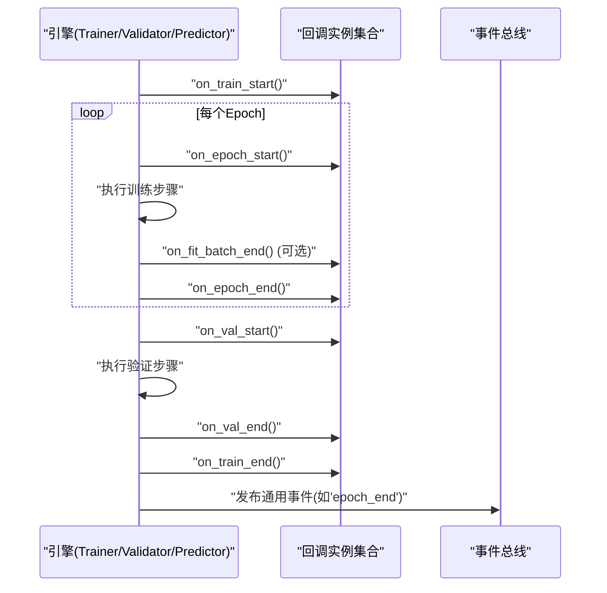
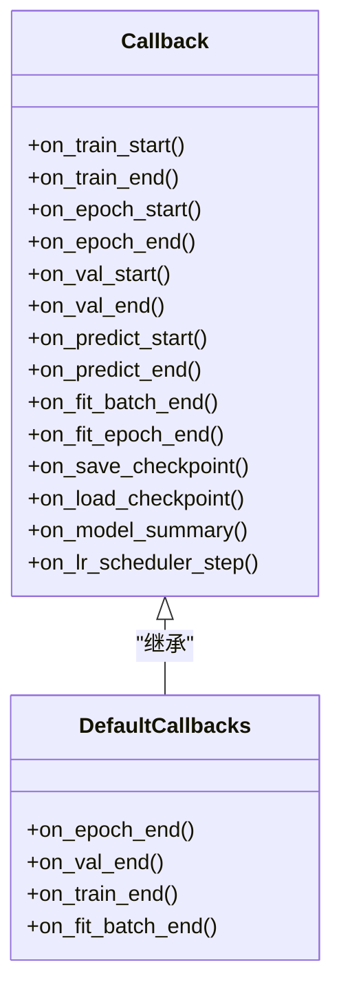
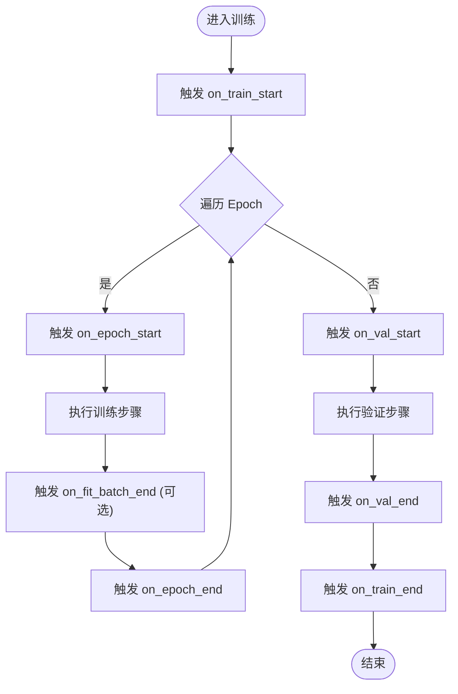
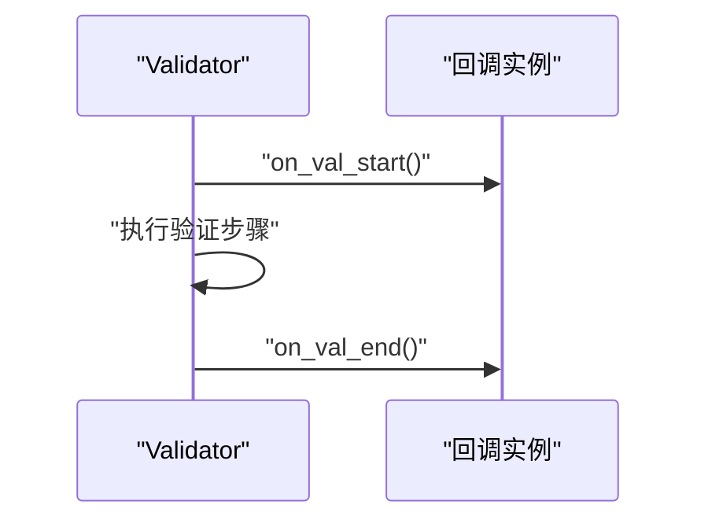
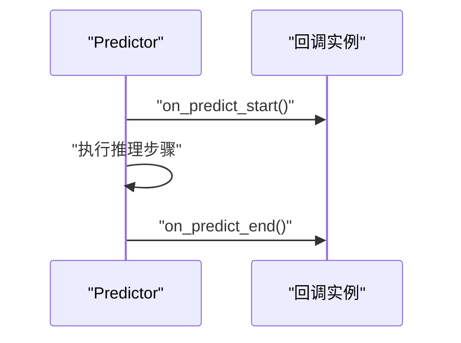
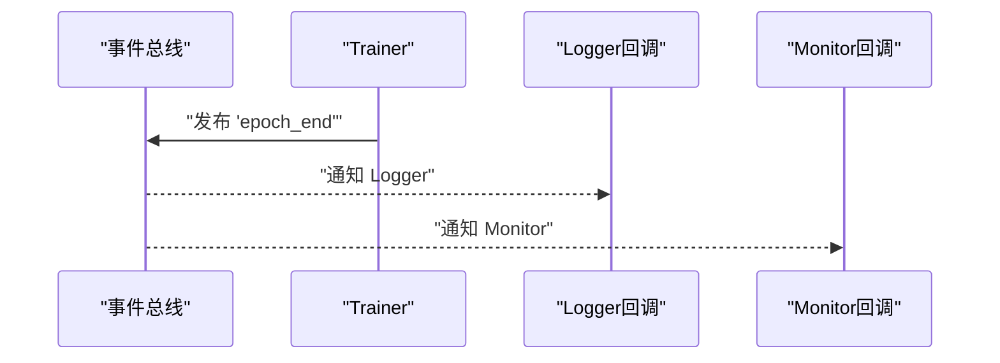
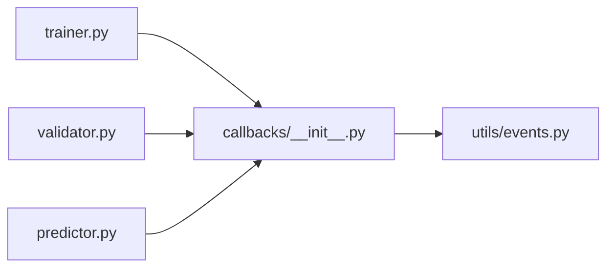

# 回调基类与核心接口

<cite>
**本文引用的文件**
- [callbacks.py](file://ultralytics/utils/callbacks/__init__.py)
- [trainer.py](file://ultralytics/engine/trainer.py)
- [validator.py](file://ultralytics/engine/validator.py)
- [predictor.py](file://ultralytics/engine/predictor.py)
- [events.py](file://ultralytics/utils/events.py)
</cite>

## 目录
1. [简介](#简介)
2. [项目结构](#项目结构)
3. [核心组件](#核心组件)
4. [架构总览](#架构总览)
5. [详细组件分析](#详细组件分析)
6. [依赖分析](#依赖分析)
7. [性能考虑](#性能考虑)
8. [故障排查指南](#故障排查指南)
9. [结论](#结论)
10. [附录](#附录)

## 简介
本文件面向YOLO-Master的回调系统，聚焦于Callback基类及其在训练、验证、预测等阶段的生命周期钩子。文档将解释：
- Callback基类的核心接口设计（如on_train_start、on_epoch_end、on_val_end等）
- 回调注册机制、事件系统架构与执行顺序
- 自定义回调的开发模式（继承、状态管理、错误处理）
- 回调间通信的数据结构与传递方式
- 提供完整的代码示例路径，帮助快速上手

## 项目结构
回调相关代码主要位于以下模块：
- 回调基类与默认实现：ultralytics/utils/callbacks/__init__.py
- 训练流程触发点：ultralytics/engine/trainer.py
- 验证流程触发点：ultralytics/engine/validator.py
- 推理流程触发点：ultralytics/engine/predictor.py
- 事件总线与通用事件：ultralytics/utils/events.py

图表来源
- [trainer.py](file://ultralytics/engine/trainer.py)
- [validator.py](file://ultralytics/engine/validator.py)
- [predictor.py](file://ultralytics/engine/predictor.py)
- [callbacks.py](file://ultralytics/utils/callbacks/__init__.py)
- [events.py](file://ultralytics/utils/events.py)

章节来源
- [callbacks.py](file://ultralytics/utils/callbacks/__init__.py)
- [trainer.py](file://ultralytics/engine/trainer.py)
- [validator.py](file://ultralytics/engine/validator.py)
- [predictor.py](file://ultralytics/engine/predictor.py)
- [events.py](file://ultralytics/utils/events.py)

## 核心组件
- Callback基类：定义训练/验证/推理生命周期钩子的标准接口，供用户或内置扩展继承实现。典型钩子包括：
  - on_train_start/on_train_end：训练开始/结束
  - on_epoch_start/on_epoch_end：每轮开始/结束
  - on_val_start/on_val_end：验证开始/结束
  - on_predict_start/on_predict_end：推理开始/结束
  - on_fit_epoch_end/on_fit_batch_end：拟合过程中的细粒度钩子（若存在）
  - on_save_checkpoint/on_load_checkpoint：检查点保存/加载
  - on_model_summary/on_lr_scheduler_step：模型摘要/学习率调度步骤
- 默认回调实现：提供日志、进度条、指标汇总、可视化等基础能力
- 事件系统：通过统一的事件总线分发通用事件，便于跨模块解耦通信

章节来源
- [callbacks.py](file://ultralytics/utils/callbacks/__init__.py)
- [events.py](file://ultralytics/utils/events.py)

## 架构总览
回调系统与引擎层的交互遵循“调用者触发 + 回调订阅”的模式：
- 引擎在关键阶段主动调用回调方法（如on_epoch_end）
- 回调可访问当前上下文（模型、优化器、数据、指标等），并可选择修改行为或记录信息
- 事件系统作为补充，用于非侵入式通知（如外部监控、遥测）

图表来源
- [trainer.py](file://ultralytics/engine/trainer.py)
- [validator.py](file://ultralytics/engine/validator.py)
- [predictor.py](file://ultralytics/engine/predictor.py)
- [callbacks.py](file://ultralytics/utils/callbacks/__init__.py)
- [events.py](file://ultralytics/utils/events.py)

## 详细组件分析

### Callback基类与默认实现
- 职责
  - 定义统一的回调接口，确保不同回调具备一致的生命周期方法签名
  - 提供空实现或默认行为，降低用户自定义成本
  - 暴露上下文访问能力（如模型、配置、指标字典等）
- 关键接口（示例）
  - on_train_start/on_train_end
  - on_epoch_start/on_epoch_end
  - on_val_start/on_val_end
  - on_predict_start/on_predict_end
  - on_fit_batch_end/on_fit_epoch_end（若存在）
  - on_save_checkpoint/on_load_checkpoint
  - on_model_summary/on_lr_scheduler_step
- 默认实现
  - 打印进度、记录指标、生成可视化图、写入日志等

图表来源
- [callbacks.py](file://ultralytics/utils/callbacks/__init__.py)

章节来源
- [callbacks.py](file://ultralytics/utils/callbacks/__init__.py)

### 训练流程中的回调触发点
- Trainer在以下位置触发回调：
  - 训练开始前：on_train_start
  - 每轮前/后：on_epoch_start / on_epoch_end
  - 批次级（可选）：on_fit_batch_end
  - 验证前后：on_val_start / on_val_end
  - 训练结束后：on_train_end
  - 检查点保存/加载：on_save_checkpoint / on_load_checkpoint
  - 学习率更新：on_lr_scheduler_step
- 参数规范
  - 各钩子通常接收当前上下文对象（包含模型、优化器、数据加载器、指标字典、配置等）
  - 具体字段名以实际实现为准，建议通过查看对应文件的函数签名确认

图表来源
- [trainer.py](file://ultralytics/engine/trainer.py)
- [callbacks.py](file://ultralytics/utils/callbacks/__init__.py)

章节来源
- [trainer.py](file://ultralytics/engine/trainer.py)
- [callbacks.py](file://ultralytics/utils/callbacks/__init__.py)

### 验证流程中的回调触发点
- Validator在验证前后触发on_val_start/on_val_end
- 可与Trainer共享同一套回调实例，保证指标记录与可视化的一致性

图表来源
- [validator.py](file://ultralytics/engine/validator.py)
- [callbacks.py](file://ultralytics/utils/callbacks/__init__.py)

章节来源
- [validator.py](file://ultralytics/engine/validator.py)
- [callbacks.py](file://ultralytics/utils/callbacks/__init__.py)

### 推理流程中的回调触发点
- Predictor在推理前后触发on_predict_start/on_predict_end
- 可用于批量结果收集、可视化、导出等

图表来源
- [predictor.py](file://ultralytics/engine/predictor.py)
- [callbacks.py](file://ultralytics/utils/callbacks/__init__.py)

章节来源
- [predictor.py](file://ultralytics/engine/predictor.py)
- [callbacks.py](file://ultralytics/utils/callbacks/__init__.py)

### 事件系统与回调通信
- 事件总线提供通用事件发布/订阅机制，适合跨模块解耦通信
- 常见事件包括：epoch_end、val_end、train_end、checkpoint_saved等
- 回调可通过事件订阅获取全局状态变化，避免强耦合

图表来源
- [events.py](file://ultralytics/utils/events.py)
- [trainer.py](file://ultralytics/engine/trainer.py)

章节来源
- [events.py](file://ultralytics/utils/events.py)
- [trainer.py](file://ultralytics/engine/trainer.py)

### 自定义回调开发指南
- 继承模式
  - 从Callback基类继承，按需重写生命周期方法
  - 保持方法签名与基类一致，避免破坏引擎调用链
- 状态管理
  - 使用实例属性存储临时状态（如累计指标、缓存结果）
  - 注意在多进程/分布式场景下的线程安全与状态同步
- 错误处理
  - 捕获异常并记录日志，避免中断主流程
  - 对关键操作进行幂等性设计，支持重试与恢复
- 回调间通信
  - 通过共享上下文对象（由引擎注入）读取/写入必要信息
  - 使用事件总线发布/订阅通用事件，减少直接依赖
- 最佳实践
  - 轻量优先：避免在回调中执行耗时I/O或复杂计算
  - 可插拔：通过配置开关控制是否启用某回调
  - 可观测：输出结构化日志，便于追踪问题

章节来源
- [callbacks.py](file://ultralytics/utils/callbacks/__init__.py)
- [events.py](file://ultralytics/utils/events.py)

### 完整代码示例（路径指引）
- 创建基础回调类
  - 参考路径：[自定义回调示例](file://ultralytics/utils/callbacks/__init__.py)
  - 说明：在该文件中找到默认回调实现，复制并重写所需钩子方法
- 注册回调到训练器
  - 参考路径：[训练器初始化与回调注册](file://ultralytics/engine/trainer.py)
  - 说明：在训练器构造或配置阶段添加自定义回调实例
- 订阅事件
  - 参考路径：[事件订阅示例](file://ultralytics/utils/events.py)
  - 说明：在回调中订阅通用事件，实现跨模块通信

章节来源
- [callbacks.py](file://ultralytics/utils/callbacks/__init__.py)
- [trainer.py](file://ultralytics/engine/trainer.py)
- [events.py](file://ultralytics/utils/events.py)

## 依赖分析
- 组件耦合
  - 引擎层（Trainer/Validator/Predictor）依赖回调接口，但不关心具体实现
  - 回调依赖引擎注入的上下文对象，以及事件总线提供的通用事件
- 外部依赖
  - 日志、可视化、指标计算等第三方库应在回调内部按需引入，避免污染核心路径
- 潜在循环依赖
  - 回调不应反向导入引擎核心逻辑，应保持单向依赖

图表来源
- [trainer.py](file://ultralytics/engine/trainer.py)
- [validator.py](file://ultralytics/engine/validator.py)
- [predictor.py](file://ultralytics/engine/predictor.py)
- [callbacks.py](file://ultralytics/utils/callbacks/__init__.py)
- [events.py](file://ultralytics/utils/events.py)

章节来源
- [trainer.py](file://ultralytics/engine/trainer.py)
- [validator.py](file://ultralytics/engine/validator.py)
- [predictor.py](file://ultralytics/engine/predictor.py)
- [callbacks.py](file://ultralytics/utils/callbacks/__init__.py)
- [events.py](file://ultralytics/utils/events.py)

## 性能考虑
- 回调执行开销
  - 避免在高频钩子（如on_fit_batch_end）中进行重I/O或复杂计算
  - 使用批处理聚合策略，降低日志与可视化频率
- 并发与并行
  - 多进程环境下，确保回调的状态读写是线程安全的
  - 必要时使用锁或队列进行同步
- 内存占用
  - 及时释放中间结果，避免长期持有大对象引用
- 可观测性
  - 使用异步日志或缓冲写入，减少对训练主循环的影响

## 故障排查指南
- 常见问题
  - 回调未触发：检查引擎是否在相应阶段调用了对应钩子
  - 参数缺失：核对回调方法签名与引擎传入的上下文对象字段
  - 状态不一致：在多进程场景中确认状态同步机制
- 定位技巧
  - 在回调开头打印关键上下文字段，确认数据流
  - 使用事件总线发布调试事件，辅助定位问题
- 恢复策略
  - 对关键操作增加try/except，记录异常堆栈并继续运行
  - 支持断点续训时，确保检查点保存/加载回调正确工作

章节来源
- [callbacks.py](file://ultralytics/utils/callbacks/__init__.py)
- [events.py](file://ultralytics/utils/events.py)

## 结论
YOLO-Master的回调系统通过统一的基类接口与事件总线，实现了高度可扩展的训练/验证/推理生命周期管理。开发者可基于Callback基类快速构建自定义回调，结合事件系统实现松耦合的模块通信。遵循轻量、可观测、线程安全等最佳实践，可有效提升系统的稳定性与可维护性。

## 附录
- 术语表
  - 回调：在特定生命周期阶段被调用的扩展点
  - 事件：模块间解耦通信的消息机制
  - 上下文：引擎注入给回调的对象，包含当前训练/验证/推理状态
- 参考路径
  - 回调基类与默认实现：[回调模块](file://ultralytics/utils/callbacks/__init__.py)
  - 训练触发点：[训练器](file://ultralytics/engine/trainer.py)
  - 验证触发点：[验证器](file://ultralytics/engine/validator.py)
  - 推理触发点：[预测器](file://ultralytics/engine/predictor.py)
  - 事件总线：[事件模块](file://ultralytics/utils/events.py)