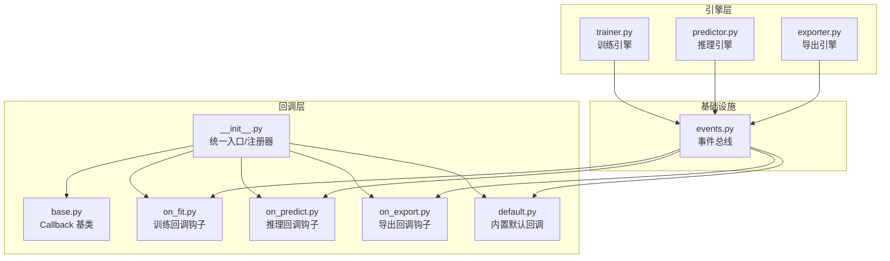
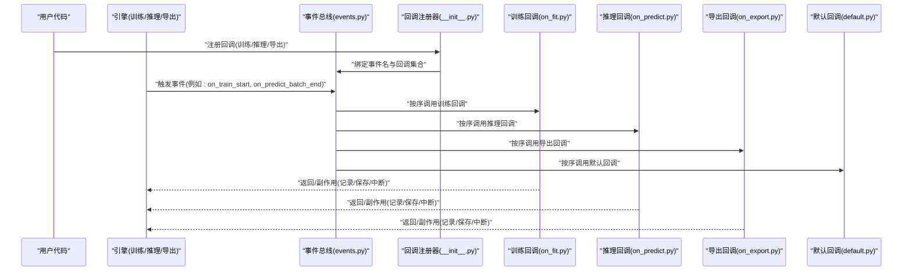
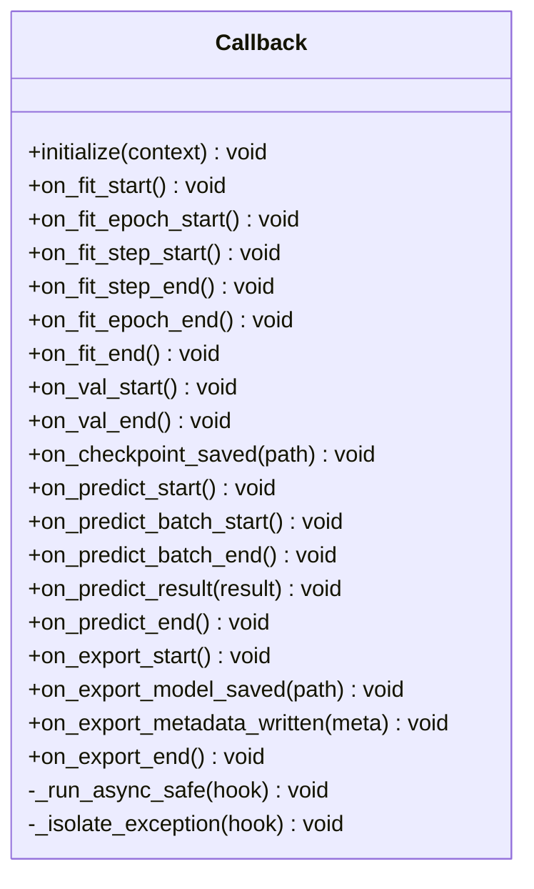
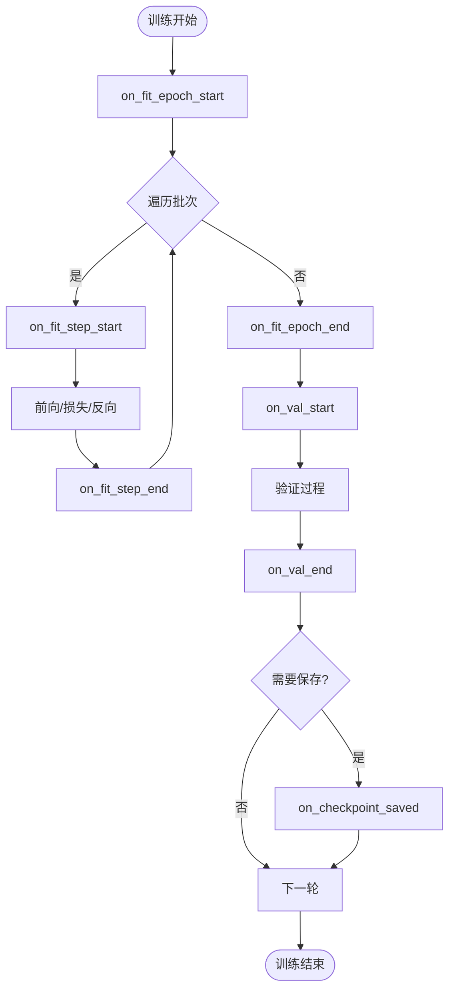
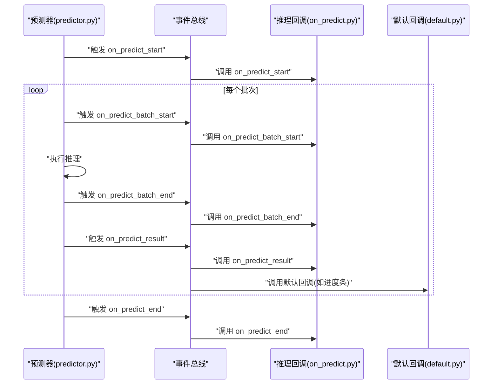
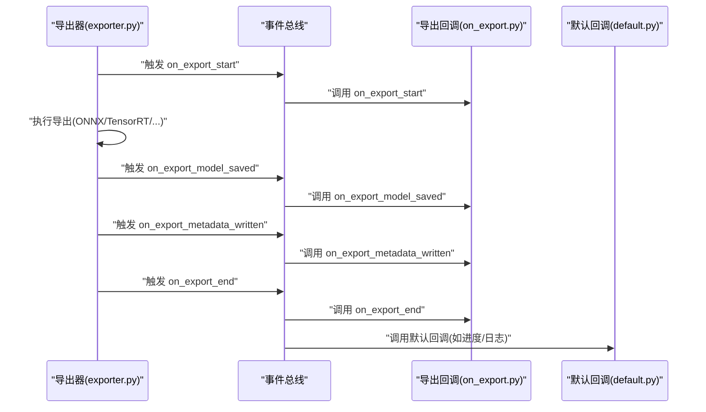
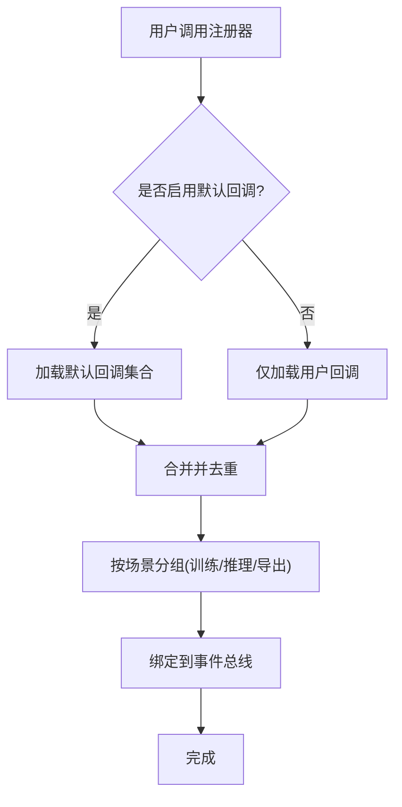
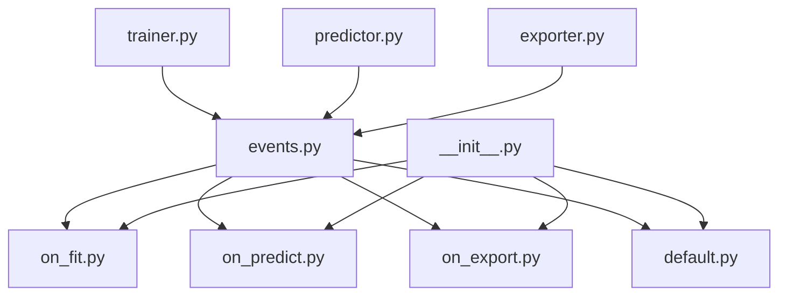

# 回调系统API

<cite>
**本文引用的文件**
- [callbacks/__init__.py](file://ultralytics/utils/callbacks/__init__.py)
- [callbacks/base.py](file://ultralytics/utils/callbacks/base.py)
- [callbacks/default.py](file://ultralytics/utils/callbacks/default.py)
- [callbacks/on_fit.py](file://ultralytics/utils/callbacks/on_fit.py)
- [callbacks/on_predict.py](file://ultralytics/utils/callbacks/on_predict.py)
- [callbacks/on_export.py](file://ultralytics/utils/callbacks/on_export.py)
- [engine/trainer.py](file://ultralytics/engine/trainer.py)
- [engine/predictor.py](file://ultralytics/engine/predictor.py)
- [engine/exporter.py](file://ultralytics/engine/exporter.py)
- [utils/events.py](file://ultralytics/utils/events.py)
</cite>

## 目录
1. [简介](#简介)
2. [项目结构](#项目结构)
3. [核心组件](#核心组件)
4. [架构总览](#架构总览)
5. [详细组件分析](#详细组件分析)
6. [依赖关系分析](#依赖关系分析)
7. [性能考虑](#性能考虑)
8. [故障排查指南](#故障排查指南)
9. [结论](#结论)
10. [附录](#附录)

## 简介
本文件为 YOLO-Master 的回调系统 API 提供完整文档，覆盖 Callback 基类接口规范与生命周期方法、训练/推理/导出三类回调的实现模式、回调注册机制与事件触发顺序、自定义回调开发指南与最佳实践、内置回调功能与使用方法（日志记录、监控、模型保存等）、回调间通信与数据传递方式、异步回调与错误处理示例，以及调试与测试工具方法。

## 项目结构
回调系统位于 ultralytics/utils/callbacks 目录下，按“场景”划分模块：
- base.py：定义统一的回调基类与通用能力
- default.py：内置默认回调实现（如日志、进度、检查点等）
- on_fit.py：训练阶段回调钩子
- on_predict.py：推理阶段回调钩子
- on_export.py：导出阶段回调钩子
- __init__.py：统一入口与便捷注册器

引擎侧在 trainer.py、predictor.py、exporter.py 中通过事件总线分发回调事件，确保解耦与可扩展性。

图表来源
- [callbacks/base.py](file://ultralytics/utils/callbacks/base.py)
- [callbacks/on_fit.py](file://ultralytics/utils/callbacks/on_fit.py)
- [callbacks/on_predict.py](file://ultralytics/utils/callbacks/on_predict.py)
- [callbacks/on_export.py](file://ultralytics/utils/callbacks/on_export.py)
- [callbacks/default.py](file://ultralytics/utils/callbacks/default.py)
- [callbacks/__init__.py](file://ultralytics/utils/callbacks/__init__.py)
- [engine/trainer.py](file://ultralytics/engine/trainer.py)
- [engine/predictor.py](file://ultralytics/engine/predictor.py)
- [engine/exporter.py](file://ultralytics/engine/exporter.py)
- [utils/events.py](file://ultralytics/utils/events.py)

章节来源
- [callbacks/__init__.py](file://ultralytics/utils/callbacks/__init__.py)
- [callbacks/base.py](file://ultralytics/utils/callbacks/base.py)
- [callbacks/default.py](file://ultralytics/utils/callbacks/default.py)
- [callbacks/on_fit.py](file://ultralytics/utils/callbacks/on_fit.py)
- [callbacks/on_predict.py](file://ultralytics/utils/callbacks/on_predict.py)
- [callbacks/on_export.py](file://ultralytics/utils/callbacks/on_export.py)
- [engine/trainer.py](file://ultralytics/engine/trainer.py)
- [engine/predictor.py](file://ultralytics/engine/predictor.py)
- [engine/exporter.py](file://ultralytics/engine/exporter.py)
- [utils/events.py](file://ultralytics/utils/events.py)

## 核心组件
- Callback 基类
  - 职责：定义所有回调的统一接口与生命周期方法；提供上下文访问、状态共享、异常隔离与可选异步执行能力。
  - 关键能力：
    - 生命周期钩子：训练前/后、每步/每轮、验证前后、导出前后等
    - 上下文访问：读取当前运行配置、模型句柄、设备信息、结果对象
    - 状态共享：通过共享字典或事件载荷进行跨回调通信
    - 异常隔离：单个回调异常不影响主流程
    - 异步支持：可声明式标记异步钩子，由调度器安全执行
- 场景化回调集
  - 训练回调（on_fit）：学习率调度、指标记录、检查点保存、早停、可视化等
  - 推理回调（on_predict）：批处理统计、结果落盘、可视化、延迟/吞吐采集
  - 导出回调（on_export）：格式校验、中间产物归档、导出报告生成
- 事件总线
  - 职责：集中管理事件名、订阅者列表、分发顺序与参数传递；保证回调与引擎解耦
- 统一入口与注册器
  - 职责：提供 add_callback/remove_callbacks/clear_callbacks 等便捷方法；负责将用户回调与默认回调合并并注册到事件总线

章节来源
- [callbacks/base.py](file://ultralytics/utils/callbacks/base.py)
- [callbacks/on_fit.py](file://ultralytics/utils/callbacks/on_fit.py)
- [callbacks/on_predict.py](file://ultralytics/utils/callbacks/on_predict.py)
- [callbacks/on_export.py](file://ultralytics/utils/callbacks/on_export.py)
- [callbacks/default.py](file://ultralytics/utils/callbacks/default.py)
- [callbacks/__init__.py](file://ultralytics/utils/callbacks/__init__.py)
- [utils/events.py](file://ultralytics/utils/events.py)

## 架构总览
回调系统与引擎通过事件总线松耦合交互。引擎在关键阶段触发事件，事件总线按注册顺序调用已注册的回调实例。

图表来源
- [engine/trainer.py](file://ultralytics/engine/trainer.py)
- [engine/predictor.py](file://ultralytics/engine/predictor.py)
- [engine/exporter.py](file://ultralytics/engine/exporter.py)
- [utils/events.py](file://ultralytics/utils/events.py)
- [callbacks/__init__.py](file://ultralytics/utils/callbacks/__init__.py)
- [callbacks/on_fit.py](file://ultralytics/utils/callbacks/on_fit.py)
- [callbacks/on_predict.py](file://ultralytics/utils/callbacks/on_predict.py)
- [callbacks/on_export.py](file://ultralytics/utils/callbacks/on_export.py)
- [callbacks/default.py](file://ultralytics/utils/callbacks/default.py)

## 详细组件分析

### Callback 基类与生命周期
- 设计要点
  - 统一抽象：所有回调继承自基类，获得一致的初始化、上下文注入、异常隔离与可选异步执行
  - 生命周期钩子命名约定：以 on_ 开头，按阶段细分（如 on_fit_epoch_start、on_predict_batch_end、on_export_model_saved）
  - 上下文对象：包含当前运行配置、模型引用、设备、批次索引、结果对象等
  - 中断控制：部分钩子可通过返回值或上下文标志提前终止流程（如早停）
- 典型钩子（训练）
  - 开始/结束：on_fit_start、on_fit_end
  - 轮次：on_fit_epoch_start、on_fit_epoch_end
  - 步骤：on_fit_step_start、on_fit_step_end
  - 验证：on_val_start、on_val_end
  - 检查点：on_checkpoint_saved
- 典型钩子（推理）
  - 开始/结束：on_predict_start、on_predict_end
  - 批次：on_predict_batch_start、on_predict_batch_end
  - 结果：on_predict_result
- 典型钩子（导出）
  - 开始/结束：on_export_start、on_export_end
  - 模型：on_export_model_saved
  - 元数据：on_export_metadata_written

图表来源
- [callbacks/base.py](file://ultralytics/utils/callbacks/base.py)

章节来源
- [callbacks/base.py](file://ultralytics/utils/callbacks/base.py)

### 训练回调（on_fit）
- 职责
  - 学习率调度：在 epoch/step 边界更新优化器 LR
  - 指标记录：聚合 loss/mAP/精度等指标，写入日志或外部系统
  - 检查点保存：按策略保存权重与优化器状态
  - 早停：根据验证指标判断是否提前结束训练
  - 可视化：绘制曲线、输出摘要
- 事件触发顺序（简化）
  - on_fit_start → on_fit_epoch_start → on_fit_step_start → on_fit_step_end × N → on_fit_epoch_end → on_val_start → on_val_end → on_checkpoint_saved → ... → on_fit_end

图表来源
- [callbacks/on_fit.py](file://ultralytics/utils/callbacks/on_fit.py)
- [engine/trainer.py](file://ultralytics/engine/trainer.py)

章节来源
- [callbacks/on_fit.py](file://ultralytics/utils/callbacks/on_fit.py)
- [engine/trainer.py](file://ultralytics/engine/trainer.py)

### 推理回调（on_predict）
- 职责
  - 批处理统计：收集耗时、吞吐、内存占用
  - 结果落盘：保存检测结果、可视化图、视频流帧
  - 质量门控：阈值过滤、NMS 后处理统计
  - 诊断：分布漂移检测、置信度直方图
- 事件触发顺序（简化）
  - on_predict_start → on_predict_batch_start → 推理 → on_predict_batch_end → on_predict_result → ... → on_predict_end

图表来源
- [engine/predictor.py](file://ultralytics/engine/predictor.py)
- [callbacks/on_predict.py](file://ultralytics/utils/callbacks/on_predict.py)
- [callbacks/default.py](file://ultralytics/utils/callbacks/default.py)
- [utils/events.py](file://ultralytics/utils/events.py)

章节来源
- [callbacks/on_predict.py](file://ultralytics/utils/callbacks/on_predict.py)
- [engine/predictor.py](file://ultralytics/engine/predictor.py)

### 导出回调（on_export）
- 职责
  - 前置校验：输入模型/算子/后端兼容性检查
  - 中间产物归档：保存中间 IR、配置文件、版本信息
  - 后置报告：生成导出报告、度量与警告
- 事件触发顺序（简化）
  - on_export_start → 导出流程 → on_export_model_saved → on_export_metadata_written → on_export_end

图表来源
- [engine/exporter.py](file://ultralytics/engine/exporter.py)
- [callbacks/on_export.py](file://ultralytics/utils/callbacks/on_export.py)
- [callbacks/default.py](file://ultralytics/utils/callbacks/default.py)
- [utils/events.py](file://ultralytics/utils/events.py)

章节来源
- [callbacks/on_export.py](file://ultralytics/utils/callbacks/on_export.py)
- [engine/exporter.py](file://ultralytics/engine/exporter.py)

### 回调注册机制与事件触发顺序
- 注册流程
  - 用户通过统一入口添加自定义回调；若未显式禁用，默认回调会被自动注册
  - 注册器将回调按优先级分组（训练/推理/导出），并绑定到事件总线
- 触发顺序
  - 同一事件下，默认回调优先于用户回调（或反之，取决于注册顺序）
  - 事件总线保证顺序稳定且可插拔
- 取消与清理
  - 支持移除指定回调或清空全部回调，避免资源泄漏

图表来源
- [callbacks/__init__.py](file://ultralytics/utils/callbacks/__init__.py)
- [callbacks/default.py](file://ultralytics/utils/callbacks/default.py)
- [utils/events.py](file://ultralytics/utils/events.py)

章节来源
- [callbacks/__init__.py](file://ultralytics/utils/callbacks/__init__.py)
- [callbacks/default.py](file://ultralytics/utils/callbacks/default.py)
- [utils/events.py](file://ultralytics/utils/events.py)

### 内置回调功能与使用方法
- 日志记录
  - 在训练/推理/导出各阶段输出结构化日志，便于追踪与回放
- 进度显示
  - 基于事件驱动更新进度条，避免阻塞主流程
- 检查点保存
  - 按策略保存权重与优化器状态，支持断点续训
- 指标汇总
  - 聚合训练/验证指标，生成报表或推送至监控系统
- 使用建议
  - 通过注册器按需启用/禁用特定内置回调
  - 结合事件上下文中的路径/文件名，避免硬编码

章节来源
- [callbacks/default.py](file://ultralytics/utils/callbacks/default.py)

### 回调间通信与数据传递
- 事件载荷
  - 事件触发时附带上下文对象（如 batch_index、result、model、config）
- 共享状态
  - 通过共享字典或回调实例属性进行轻量级状态共享
- 注意事项
  - 避免在回调中持有大对象强引用，防止内存泄漏
  - 多线程/多进程环境下注意线程安全与序列化

章节来源
- [callbacks/base.py](file://ultralytics/utils/callbacks/base.py)
- [utils/events.py](file://ultralytics/utils/events.py)

### 异步回调与错误处理
- 异步回调
  - 对 I/O 密集型操作（网络上传、远程日志、可视化渲染）采用异步钩子，避免阻塞训练/推理
  - 由调度器统一执行，保证异常隔离与顺序可控
- 错误处理
  - 单个回调异常被捕获并记录，不中断主流程
  - 提供重试/降级策略（如本地缓存失败的网络写入）
- 示例思路
  - 异步：在 on_predict_batch_end 中异步写入结果到对象存储
  - 错误处理：在 on_fit_epoch_end 中记录异常指标并继续训练

章节来源
- [callbacks/base.py](file://ultralytics/utils/callbacks/base.py)
- [utils/events.py](file://ultralytics/utils/events.py)

### 自定义回调开发指南与最佳实践
- 开发步骤
  - 继承基类，实现所需生命周期钩子
  - 在 on_fit/on_predict/on_export 对应文件中组织钩子，保持职责单一
  - 通过注册器注册回调，必要时调整优先级
- 最佳实践
  - 幂等性：回调应可重复执行而不产生副作用累积
  - 轻量计算：避免在高频钩子中进行重型计算
  - 资源管理：及时释放文件句柄、网络连接
  - 可观测性：输出结构化日志与指标，便于定位问题
- 常见陷阱
  - 在回调中修改模型权重需格外谨慎，确保与训练流程一致
  - 避免在回调中直接访问全局变量，优先使用上下文对象

章节来源
- [callbacks/base.py](file://ultralytics/utils/callbacks/base.py)
- [callbacks/on_fit.py](file://ultralytics/utils/callbacks/on_fit.py)
- [callbacks/on_predict.py](file://ultralytics/utils/callbacks/on_predict.py)
- [callbacks/on_export.py](file://ultralytics/utils/callbacks/on_export.py)
- [callbacks/__init__.py](file://ultralytics/utils/callbacks/__init__.py)

### 调试与测试回调的工具方法
- 断点与日志
  - 在关键钩子内插入断点，观察上下文对象与事件载荷
  - 使用结构化日志输出关键字段（时间戳、事件名、批次号、指标）
- 单元测试
  - 构造最小上下文，模拟事件触发，验证回调行为
  - 使用事件总线 mock，验证回调注册/移除逻辑
- 集成测试
  - 在小型数据集上运行训练/推理/导出，端到端验证回调效果
- 性能剖析
  - 针对高频钩子进行耗时分析，识别瓶颈并优化

章节来源
- [callbacks/base.py](file://ultralytics/utils/callbacks/base.py)
- [utils/events.py](file://ultralytics/utils/events.py)

## 依赖关系分析
- 组件耦合
  - 回调层与引擎层通过事件总线解耦，降低耦合度，提升可维护性
  - 默认回调与用户回调在同一注册体系下，便于统一管理
- 外部依赖
  - 事件总线作为基础设施，提供稳定的事件分发与订阅能力
- 潜在循环依赖
  - 回调不应反向依赖引擎内部实现细节，避免循环导入

图表来源
- [engine/trainer.py](file://ultralytics/engine/trainer.py)
- [engine/predictor.py](file://ultralytics/engine/predictor.py)
- [engine/exporter.py](file://ultralytics/engine/exporter.py)
- [utils/events.py](file://ultralytics/utils/events.py)
- [callbacks/on_fit.py](file://ultralytics/utils/callbacks/on_fit.py)
- [callbacks/on_predict.py](file://ultralytics/utils/callbacks/on_predict.py)
- [callbacks/on_export.py](file://ultralytics/utils/callbacks/on_export.py)
- [callbacks/default.py](file://ultralytics/utils/callbacks/default.py)
- [callbacks/__init__.py](file://ultralytics/utils/callbacks/__init__.py)

章节来源
- [engine/trainer.py](file://ultralytics/engine/trainer.py)
- [engine/predictor.py](file://ultralytics/engine/predictor.py)
- [engine/exporter.py](file://ultralytics/engine/exporter.py)
- [utils/events.py](file://ultralytics/utils/events.py)
- [callbacks/__init__.py](file://ultralytics/utils/callbacks/__init__.py)

## 性能考虑
- 减少高频钩子中的计算量，必要时使用异步或批量写入
- 避免在回调中频繁创建大对象，复用缓冲区与连接池
- 合理设置日志级别，避免过多 IO 影响吞吐
- 对磁盘/网络写入进行缓冲与合并，降低系统调用次数

[本节为通用指导，无需具体文件分析]

## 故障排查指南
- 常见问题
  - 回调未触发：检查注册器是否正确绑定事件名与回调集合
  - 回调顺序不符合预期：确认注册顺序与优先级设置
  - 内存泄漏：检查回调中是否持有长生命周期对象引用
  - 异步异常吞没：查看异步调度器的错误日志与重试策略
- 定位技巧
  - 在事件总线中添加调试日志，打印事件名与回调栈
  - 使用最小复现用例，逐步缩小范围
  - 对比默认回调与自定义回调的行为差异

章节来源
- [callbacks/__init__.py](file://ultralytics/utils/callbacks/__init__.py)
- [utils/events.py](file://ultralytics/utils/events.py)

## 结论
YOLO-Master 的回调系统通过统一的基类与事件总线，实现了训练/推理/导出全链路的可扩展钩子机制。开发者可以以低侵入的方式扩展日志、监控、保存、可视化等功能，并通过异步与异常隔离保障稳定性。遵循本文档的接口规范与实践建议，能够快速构建高质量的可观测性与工程化能力。

[本节为总结，无需具体文件分析]

## 附录
- 术语
  - 回调：在特定事件发生时执行的函数或方法
  - 事件总线：集中管理事件订阅与分发的基础设施
  - 上下文：事件触发时附带的运行时信息对象
- 参考路径
  - 基类与生命周期：[callbacks/base.py](file://ultralytics/utils/callbacks/base.py)
  - 训练回调：[callbacks/on_fit.py](file://ultralytics/utils/callbacks/on_fit.py)
  - 推理回调：[callbacks/on_predict.py](file://ultralytics/utils/callbacks/on_predict.py)
  - 导出回调：[callbacks/on_export.py](file://ultralytics/utils/callbacks/on_export.py)
  - 默认回调：[callbacks/default.py](file://ultralytics/utils/callbacks/default.py)
  - 注册器：[callbacks/__init__.py](file://ultralytics/utils/callbacks/__init__.py)
  - 事件总线：[utils/events.py](file://ultralytics/utils/events.py)
  - 引擎集成：[engine/trainer.py](file://ultralytics/engine/trainer.py)、[engine/predictor.py](file://ultralytics/engine/predictor.py)、[engine/exporter.py](file://ultralytics/engine/exporter.py)