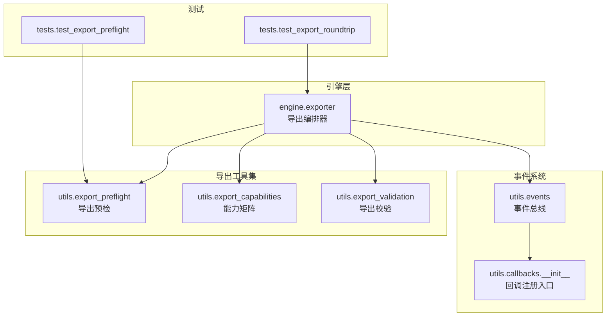
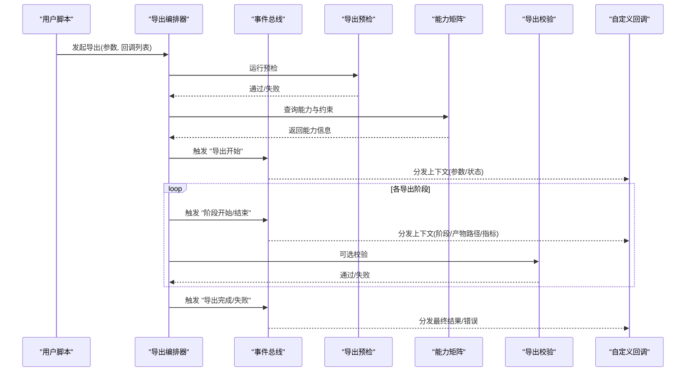
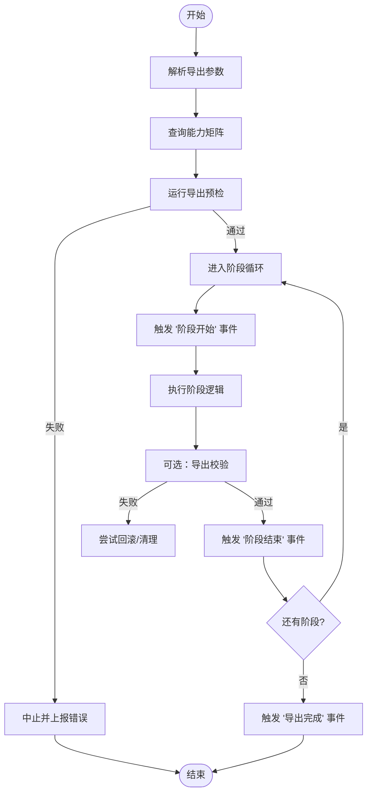
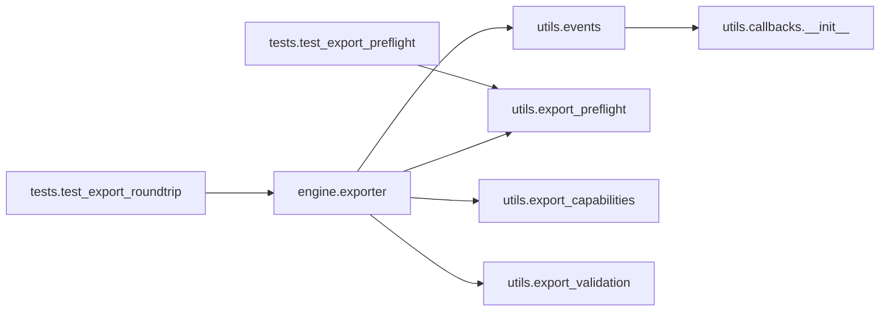

# 导出回调API

<cite>
**本文引用的文件**
- [exporter.py](file://ultralytics/engine/exporter.py)
- [events.py](file://ultralytics/utils/events.py)
- [callbacks/__init__.py](file://ultralytics/utils/callbacks/__init__.py)
- [export_validation.py](file://ultralytics/utils/export_validation.py)
- [export_preflight.py](file://ultralytics/utils/export_preflight.py)
- [export_capabilities.py](file://ultralytics/utils/export_capabilities.py)
- [test_export_roundtrip.py](file://tests/test_export_roundtrip.py)
- [test_export_preflight.py](file://tests/test_export_preflight.py)
</cite>

## 目录
1. [简介](#简介)
2. [项目结构](#项目结构)
3. [核心组件](#核心组件)
4. [架构总览](#架构总览)
5. [详细组件分析](#详细组件分析)
6. [依赖关系分析](#依赖关系分析)
7. [性能考虑](#性能考虑)
8. [故障排查指南](#故障排查指南)
9. [结论](#结论)
10. [附录](#附录)

## 简介
本文件为 YOLO-Master 的“导出回调系统”提供 API 文档，聚焦于模型导出流程中的可插拔回调钩子。内容覆盖：
- 导出生命周期与阶段划分（格式转换、权重优化、部署包生成等）
- 回调接口定义、参数传递机制与返回值约定
- 自定义导出回调开发示例（新增导出格式、添加导出验证、生成部署清单）
- 错误处理与回滚机制
- 多格式导出的最佳实践与性能优化建议

目标读者包括希望扩展导出能力或集成第三方工具链的开发者。

## 项目结构
导出相关代码主要位于以下模块：
- 引擎层：负责编排导出流程并触发回调
- 事件总线：统一注册/分发回调事件
- 导出工具集：预检、能力矩阵、校验等辅助功能
- 测试用例：覆盖关键路径与边界条件

图表来源
- [exporter.py:1-200](file://ultralytics/engine/exporter.py#L1-L200)
- [events.py:1-200](file://ultralytics/utils/events.py#L1-L200)
- [callbacks/__init__.py:1-200](file://ultralytics/utils/callbacks/__init__.py#L1-L200)
- [export_preflight.py:1-200](file://ultralytics/utils/export_preflight.py#L1-L200)
- [export_capabilities.py:1-200](file://ultralytics/utils/export_capabilities.py#L1-L200)
- [export_validation.py:1-200](file://ultralytics/utils/export_validation.py#L1-L200)
- [test_export_roundtrip.py:1-200](file://tests/test_export_roundtrip.py#L1-L200)
- [test_export_preflight.py:1-200](file://tests/test_export_preflight.py#L1-L200)

章节来源
- [exporter.py:1-200](file://ultralytics/engine/exporter.py#L1-L200)
- [events.py:1-200](file://ultralytics/utils/events.py#L1-L200)
- [callbacks/__init__.py:1-200](file://ultralytics/utils/callbacks/__init__.py#L1-L200)
- [export_preflight.py:1-200](file://ultralytics/utils/export_preflight.py#L1-L200)
- [export_capabilities.py:1-200](file://ultralytics/utils/export_capabilities.py#L1-L200)
- [export_validation.py:1-200](file://ultralytics/utils/export_validation.py#L1-L200)
- [test_export_roundtrip.py:1-200](file://tests/test_export_roundtrip.py#L1-L200)
- [test_export_preflight.py:1-200](file://tests/test_export_preflight.py#L1-L200)

## 核心组件
- 导出编排器（Engine Exporter）
  - 职责：解析导出参数、选择后端、执行各阶段任务、触发事件回调、汇总结果。
  - 关键点：在关键阶段前后调用事件总线，确保回调可观测与可干预。
- 事件总线（Events）
  - 职责：维护回调注册表、按事件名分发上下文对象、支持同步/异步回调。
  - 关键点：保证回调顺序稳定、异常隔离、上下文不可变。
- 回调注册入口（Callbacks Init）
  - 职责：集中暴露常用导出回调注册函数，便于用户快速接入。
- 导出预检（Export Preflight）
  - 职责：在导出前进行环境、依赖、模型兼容性检查，减少失败成本。
- 导出能力矩阵（Export Capabilities）
  - 职责：描述各后端/格式的能力与限制，供编排器决策与提示。
- 导出校验（Export Validation）
  - 职责：对导出产物进行一致性、完整性、数值稳定性等校验。

章节来源
- [exporter.py:1-200](file://ultralytics/engine/exporter.py#L1-L200)
- [events.py:1-200](file://ultralytics/utils/events.py#L1-L200)
- [callbacks/__init__.py:1-200](file://ultralytics/utils/callbacks/__init__.py#L1-L200)
- [export_preflight.py:1-200](file://ultralytics/utils/export_preflight.py#L1-L200)
- [export_capabilities.py:1-200](file://ultralytics/utils/export_capabilities.py#L1-L200)
- [export_validation.py:1-200](file://ultralytics/utils/export_validation.py#L1-L200)

## 架构总览
导出回调系统的整体交互如下：

图表来源
- [exporter.py:1-200](file://ultralytics/engine/exporter.py#L1-L200)
- [events.py:1-200](file://ultralytics/utils/events.py#L1-L200)
- [export_preflight.py:1-200](file://ultralytics/utils/export_preflight.py#L1-L200)
- [export_capabilities.py:1-200](file://ultralytics/utils/export_capabilities.py#L1-L200)
- [export_validation.py:1-200](file://ultralytics/utils/export_validation.py#L1-L200)

## 详细组件分析

### 导出编排器（Engine Exporter）
- 设计要点
  - 将导出过程划分为若干阶段：预检、准备、转换、优化、打包、校验、收尾。
  - 每个阶段前后触发事件，允许回调读取中间产物、修改后续行为或记录日志。
  - 对异常进行隔离与上报，避免单点失败导致整个导出中断。
- 关键流程
  - 解析参数与能力矩阵，决定可用后端与格式。
  - 执行预检与环境准备。
  - 遍历阶段，依次调用转换/优化/打包逻辑。
  - 在每个阶段前后触发事件，供回调介入。
  - 汇总结果并触发完成事件。

图表来源
- [exporter.py:1-200](file://ultralytics/engine/exporter.py#L1-L200)
- [export_capabilities.py:1-200](file://ultralytics/utils/export_capabilities.py#L1-L200)
- [export_preflight.py:1-200](file://ultralytics/utils/export_preflight.py#L1-L200)
- [export_validation.py:1-200](file://ultralytics/utils/export_validation.py#L1-L200)

章节来源
- [exporter.py:1-200](file://ultralytics/engine/exporter.py#L1-L200)

### 事件总线（Events）
- 设计要点
  - 以事件名为键维护回调集合，支持按优先级排序。
  - 分发时传入统一的上下文对象，包含阶段信息、输入输出路径、元数据、错误信息等。
  - 对回调异常进行捕获与隔离，确保其他回调继续执行。
- 典型事件
  - 导出开始/完成/失败
  - 阶段开始/结束
  - 产物就绪/校验结果
- 上下文对象字段（示例）
  - 阶段名称、阶段索引
  - 输入模型句柄/路径
  - 输出产物路径列表
  - 配置参数快照
  - 指标与诊断信息
  - 错误与堆栈（失败时）

章节来源
- [events.py:1-200](file://ultralytics/utils/events.py#L1-L200)

### 回调注册入口（Callbacks Init）
- 职责
  - 提供便捷注册函数，如注册导出前/后回调、阶段回调、产物校验回调等。
  - 内置常用回调（如日志、度量、清单生成）的快捷注册方式。
- 使用建议
  - 优先通过该入口注册，以获得一致的上下文结构与错误处理。
  - 避免直接操作内部注册表，防止破坏顺序与隔离策略。

章节来源
- [callbacks/__init__.py:1-200](file://ultralytics/utils/callbacks/__init__.py#L1-L200)

### 导出预检（Export Preflight）
- 职责
  - 检查运行时依赖、设备可用性、磁盘空间、权限等。
  - 基于能力矩阵判断所选格式是否受支持。
- 输出
  - 通过/失败及原因，必要时给出修复建议。

章节来源
- [export_preflight.py:1-200](file://ultralytics/utils/export_preflight.py#L1-L200)

### 导出能力矩阵（Export Capabilities）
- 职责
  - 描述各后端/格式的约束（如输入维度、数据类型、算子支持）。
  - 为编排器提供决策依据，并在 UI/CLI 中展示可用选项。
- 扩展方式
  - 新增格式或后端时，向矩阵注册能力条目。

章节来源
- [export_capabilities.py:1-200](file://ultralytics/utils/export_capabilities.py#L1-L200)

### 导出校验（Export Validation）
- 职责
  - 对导出产物进行结构、尺寸、数值范围、可加载性等校验。
  - 支持可选的对比基准（如与原始模型推理一致性）。
- 输出
  - 校验结果与诊断信息，失败时提供定位线索。

章节来源
- [export_validation.py:1-200](file://ultralytics/utils/export_validation.py#L1-L200)

### 自定义导出回调开发示例
以下为常见扩展场景的实现思路与步骤（不展示具体代码，仅给出路径指引）：

- 支持新的导出格式
  - 在能力矩阵中注册新格式及其约束。
  - 实现对应阶段的转换逻辑，并在阶段结束时产出产物路径。
  - 在阶段回调中记录新格式的元数据（如输入形状、量化等级）。
  - 参考路径：
    - [export_capabilities.py:1-200](file://ultralytics/utils/export_capabilities.py#L1-L200)
    - [exporter.py:1-200](file://ultralytics/engine/exporter.py#L1-L200)

- 添加导出验证
  - 注册“产物就绪”回调，加载导出模型并进行基本推理或结构检查。
  - 若失败，抛出结构化错误以便编排器回滚。
  - 参考路径：
    - [export_validation.py:1-200](file://ultralytics/utils/export_validation.py#L1-L200)
    - [events.py:1-200](file://ultralytics/utils/events.py#L1-L200)

- 生成部署清单
  - 在“导出完成”回调中收集产物路径、版本、哈希、依赖等信息，写入清单文件。
  - 清单可用于制品库归档与下游部署流水线。
  - 参考路径：
    - [callbacks/__init__.py:1-200](file://ultralytics/utils/callbacks/__init__.py#L1-L200)
    - [events.py:1-200](file://ultralytics/utils/events.py#L1-L200)

- 端到端参考用例
  - 参考测试中对导出流程与预检的断言，理解上下文字段与事件时序。
  - 参考路径：
    - [test_export_roundtrip.py:1-200](file://tests/test_export_roundtrip.py#L1-L200)
    - [test_export_preflight.py:1-200](file://tests/test_export_preflight.py#L1-L200)

章节来源
- [export_capabilities.py:1-200](file://ultralytics/utils/export_capabilities.py#L1-L200)
- [exporter.py:1-200](file://ultralytics/engine/exporter.py#L1-L200)
- [export_validation.py:1-200](file://ultralytics/utils/export_validation.py#L1-L200)
- [callbacks/__init__.py:1-200](file://ultralytics/utils/callbacks/__init__.py#L1-L200)
- [events.py:1-200](file://ultralytics/utils/events.py#L1-L200)
- [test_export_roundtrip.py:1-200](file://tests/test_export_roundtrip.py#L1-L200)
- [test_export_preflight.py:1-200](file://tests/test_export_preflight.py#L1-L200)

## 依赖关系分析
导出回调系统与周边模块的依赖关系如下：

图表来源
- [exporter.py:1-200](file://ultralytics/engine/exporter.py#L1-L200)
- [events.py:1-200](file://ultralytics/utils/events.py#L1-L200)
- [callbacks/__init__.py:1-200](file://ultralytics/utils/callbacks/__init__.py#L1-L200)
- [export_preflight.py:1-200](file://ultralytics/utils/export_preflight.py#L1-L200)
- [export_capabilities.py:1-200](file://ultralytics/utils/export_capabilities.py#L1-L200)
- [export_validation.py:1-200](file://ultralytics/utils/export_validation.py#L1-L200)
- [test_export_roundtrip.py:1-200](file://tests/test_export_roundtrip.py#L1-L200)
- [test_export_preflight.py:1-200](file://tests/test_export_preflight.py#L1-L200)

章节来源
- [exporter.py:1-200](file://ultralytics/engine/exporter.py#L1-L200)
- [events.py:1-200](file://ultralytics/utils/events.py#L1-L200)
- [callbacks/__init__.py:1-200](file://ultralytics/utils/callbacks/__init__.py#L1-L200)
- [export_preflight.py:1-200](file://ultralytics/utils/export_preflight.py#L1-L200)
- [export_capabilities.py:1-200](file://ultralytics/utils/export_capabilities.py#L1-L200)
- [export_validation.py:1-200](file://ultralytics/utils/export_validation.py#L1-L200)
- [test_export_roundtrip.py:1-200](file://tests/test_export_roundtrip.py#L1-L200)
- [test_export_preflight.py:1-200](file://tests/test_export_preflight.py#L1-L200)

## 性能考虑
- 并行导出
  - 对不同格式采用并发导出，但需控制并发度以避免内存峰值过高。
  - 共享只读资源（如模型权重）以减少重复加载。
- 增量导出
  - 复用中间产物（如中间图表示），仅在变更时重新计算。
- 缓存与去重
  - 对相同参数的导出结果进行缓存，避免重复工作。
- I/O 优化
  - 批量写入产物，减少小文件频繁落盘。
  - 使用临时目录并在成功后再移动至目标位置，降低部分失败导致的碎片化。
- 监控与诊断
  - 在回调中采集耗时、内存占用、GPU利用率等指标，便于定位瓶颈。

[本节为通用指导，无需源码引用]

## 故障排查指南
- 常见问题
  - 依赖缺失：预检失败，查看错误原因并按提示安装依赖。
  - 格式不支持：能力矩阵未注册或约束不满足，调整参数或扩展矩阵。
  - 产物校验失败：检查输入形状、数据类型、量化设置是否与后端一致。
  - 回调异常：确认回调签名与上下文字段，避免修改只读上下文。
- 回滚与清理
  - 当校验失败或回调抛出异常时，编排器会尝试回滚已生成的产物并释放资源。
  - 建议在回调中显式清理临时文件，避免残留。
- 定位技巧
  - 启用详细日志，关注事件分发与阶段切换点。
  - 使用最小复现用例，逐步缩小问题范围。

章节来源
- [exporter.py:1-200](file://ultralytics/engine/exporter.py#L1-L200)
- [export_preflight.py:1-200](file://ultralytics/utils/export_preflight.py#L1-L200)
- [export_validation.py:1-200](file://ultralytics/utils/export_validation.py#L1-L200)

## 结论
YOLO-Master 的导出回调系统通过事件总线将导出流程解耦，使格式转换、权重优化、部署包生成等阶段具备高度可扩展性。借助能力矩阵与预检/校验工具，可在早期发现并规避风险；通过回调机制，用户可轻松注入自定义逻辑，满足多样化部署需求。遵循本文的最佳实践与性能建议，可获得稳定高效的导出体验。

[本节为总结性内容，无需源码引用]

## 附录
- 术语
  - 导出编排器：负责调度导出阶段与事件的组件
  - 事件总线：用于注册与分发回调的通信机制
  - 能力矩阵：描述各后端/格式支持的约束与特性
  - 预检/校验：导出前后的质量保障环节
- 参考路径
  - 导出编排器：[exporter.py:1-200](file://ultralytics/engine/exporter.py#L1-L200)
  - 事件总线：[events.py:1-200](file://ultralytics/utils/events.py#L1-L200)
  - 回调注册入口：[callbacks/__init__.py:1-200](file://ultralytics/utils/callbacks/__init__.py#L1-L200)
  - 导出预检：[export_preflight.py:1-200](file://ultralytics/utils/export_preflight.py#L1-L200)
  - 能力矩阵：[export_capabilities.py:1-200](file://ultralytics/utils/export_capabilities.py#L1-L200)
  - 导出校验：[export_validation.py:1-200](file://ultralytics/utils/export_validation.py#L1-L200)
  - 测试用例：[test_export_roundtrip.py:1-200](file://tests/test_export_roundtrip.py#L1-L200)、[test_export_preflight.py:1-200](file://tests/test_export_preflight.py#L1-L200)