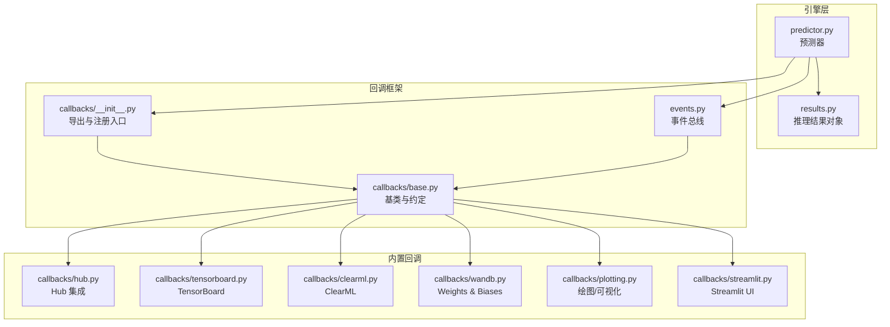
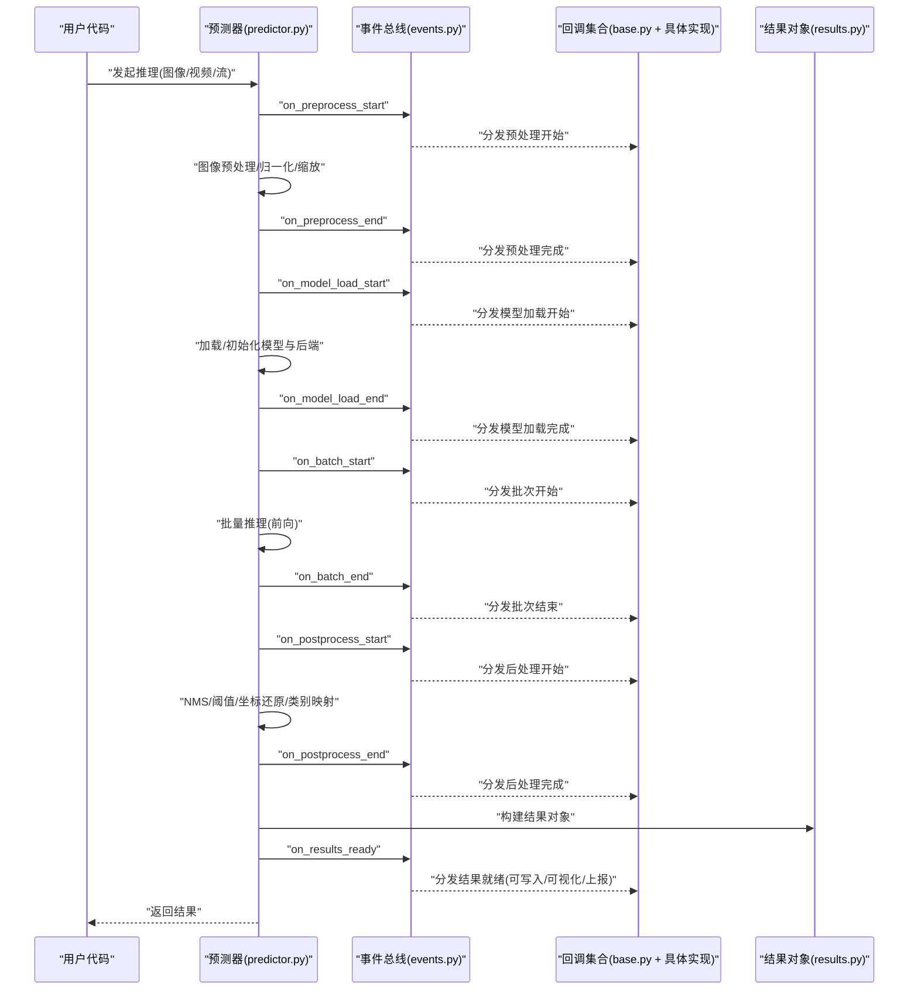
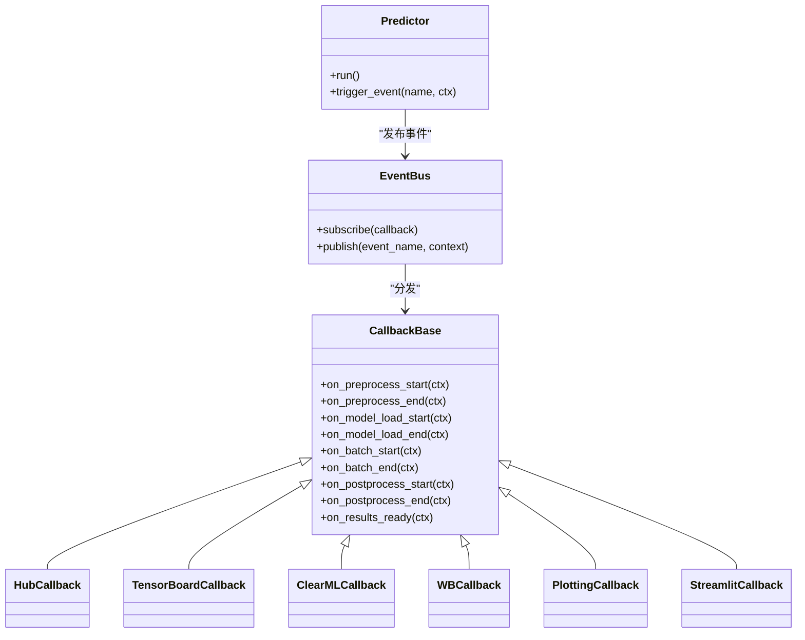

# 推理回调API

<cite>
**本文引用的文件**
- [ultralytics/engine/predictor.py](file://ultralytics/engine/predictor.py)
- [ultralytics/utils/callbacks/__init__.py](file://ultralytics/utils/callbacks/__init__.py)
- [ultralytics/utils/callbacks/base.py](file://ultralytics/utils/callbacks/base.py)
- [ultralytics/utils/callbacks/hub.py](file://ultralytics/utils/callbacks/hub.py)
- [ultralytics/utils/callbacks/tensorboard.py](file://ultralytics/utils/callbacks/tensorboard.py)
- [ultralytics/utils/callbacks/clearml.py](file://ultralytics/utils/callbacks/clearml.py)
- [ultralytics/utils/callbacks/wandb.py](file://ultralytics/utils/callbacks/wandb.py)
- [ultralytics/utils/callbacks/plotting.py](file://ultralytics/utils/callbacks/plotting.py)
- [ultralytics/utils/callbacks/streamlit.py](file://ultralytics/utils/callbacks/streamlit.py)
- [ultralytics/utils/events.py](file://ultralytics/utils/events.py)
- [ultralytics/engine/results.py](file://ultralytics/engine/results.py)
</cite>

## 目录
1. [简介](#简介)
2. [项目结构](#项目结构)
3. [核心组件](#核心组件)
4. [架构总览](#架构总览)
5. [详细组件分析](#详细组件分析)
6. [依赖关系分析](#依赖关系分析)
7. [性能考量](#性能考量)
8. [故障排查指南](#故障排查指南)
9. [结论](#结论)
10. [附录](#附录)

## 简介
本文件为 YOLO-Master 推理回调系统的权威 API 文档，聚焦于推理阶段的钩子机制与扩展点。内容覆盖：
- 推理生命周期中的关键阶段：图像预处理、模型加载、批量推理、结果后处理等
- 内置回调：Hub 集成、平台特定优化、可视化与监控（TensorBoard/ClearML/W&B）、流式 UI（Streamlit）等
- 自定义推理回调开发指南：实时处理、流式推理、内存管理优化
- 错误处理与异常恢复机制
- 性能分析与调试工具使用方法

## 项目结构
与推理回调相关的代码主要分布在以下模块：
- 引擎侧：预测器负责编排推理流程并触发事件
- 回调框架：统一的事件注册、分发与执行
- 内置回调：Hub、可视化、监控、UI 等
- 事件总线：统一的时序与上下文传递

图表来源
- [ultralytics/engine/predictor.py](file://ultralytics/engine/predictor.py)
- [ultralytics/utils/callbacks/__init__.py](file://ultralytics/utils/callbacks/__init__.py)
- [ultralytics/utils/callbacks/base.py](file://ultralytics/utils/callbacks/base.py)
- [ultralytics/utils/events.py](file://ultralytics/utils/events.py)
- [ultralytics/utils/callbacks/hub.py](file://ultralytics/utils/callbacks/hub.py)
- [ultralytics/utils/callbacks/tensorboard.py](file://ultralytics/utils/callbacks/tensorboard.py)
- [ultralytics/utils/callbacks/clearml.py](file://ultralytics/utils/callbacks/clearml.py)
- [ultralytics/utils/callbacks/wandb.py](file://ultralytics/utils/callbacks/wandb.py)
- [ultralytics/utils/callbacks/plotting.py](file://ultralytics/utils/callbacks/plotting.py)
- [ultralytics/utils/callbacks/streamlit.py](file://ultralytics/utils/callbacks/streamlit.py)
- [ultralytics/engine/results.py](file://ultralytics/engine/results.py)

章节来源
- [ultralytics/engine/predictor.py](file://ultralytics/engine/predictor.py)
- [ultralytics/utils/callbacks/__init__.py](file://ultralytics/utils/callbacks/__init__.py)
- [ultralytics/utils/callbacks/base.py](file://ultralytics/utils/callbacks/base.py)
- [ultralytics/utils/events.py](file://ultralytics/utils/events.py)
- [ultralytics/utils/callbacks/hub.py](file://ultralytics/utils/callbacks/hub.py)
- [ultralytics/utils/callbacks/tensorboard.py](file://ultralytics/utils/callbacks/tensorboard.py)
- [ultralytics/utils/callbacks/clearml.py](file://ultralytics/utils/callbacks/clearml.py)
- [ultralytics/utils/callbacks/wandb.py](file://ultralytics/utils/callbacks/wandb.py)
- [ultralytics/utils/callbacks/plotting.py](file://ultralytics/utils/callbacks/plotting.py)
- [ultralytics/utils/callbacks/streamlit.py](file://ultralytics/utils/callbacks/streamlit.py)
- [ultralytics/engine/results.py](file://ultralytics/engine/results.py)

## 核心组件
- 预测器（Predictor）
  - 职责：组织输入、调度预处理、调用模型、执行后处理、生成结果对象、触发事件
  - 关键点：在关键阶段通过事件总线发出“开始/结束”事件，供回调订阅
- 回调基类与约定
  - 职责：定义回调接口、参数约定、生命周期顺序、异常隔离策略
  - 关键点：提供统一的 on_xxx 方法命名规范与上下文对象
- 事件总线（Events）
  - 职责：维护订阅者列表、按序分发事件、携带上下文数据
  - 关键点：支持同步/异步场景下的可靠分发与错误隔离
- 结果对象（Results）
  - 职责：封装单帧或批次的检测结果、元信息、可视化辅助
  - 关键点：作为后处理与可视化回调的输入载体

章节来源
- [ultralytics/engine/predictor.py](file://ultralytics/engine/predictor.py)
- [ultralytics/utils/callbacks/base.py](file://ultralytics/utils/callbacks/base.py)
- [ultralytics/utils/events.py](file://ultralytics/utils/events.py)
- [ultralytics/engine/results.py](file://ultralytics/engine/results.py)

## 架构总览
下图展示了从输入到输出的完整推理路径，以及各阶段触发的回调钩子位置。

图表来源
- [ultralytics/engine/predictor.py](file://ultralytics/engine/predictor.py)
- [ultralytics/utils/events.py](file://ultralytics/utils/events.py)
- [ultralytics/utils/callbacks/base.py](file://ultralytics/utils/callbacks/base.py)
- [ultralytics/engine/results.py](file://ultralytics/engine/results.py)

## 详细组件分析

### 预测器与事件触发点
- 预处理阶段
  - 触发事件：预处理开始/结束
  - 典型用途：日志记录、指标采集、缓存预热、设备切换提示
- 模型加载阶段
  - 触发事件：模型加载开始/结束
  - 典型用途：权重校验、平台优化开关、显存统计
- 批量推理阶段
  - 触发事件：批次开始/结束
  - 典型用途：吞吐/延迟统计、队列长度监控、动态批大小调整
- 后处理阶段
  - 触发事件：后处理开始/结束
  - 典型用途：NMS 耗时、阈值调优、结果过滤统计
- 结果就绪
  - 触发事件：结果就绪
  - 典型用途：持久化、推送下游服务、可视化渲染、追踪关联

章节来源
- [ultralytics/engine/predictor.py](file://ultralytics/engine/predictor.py)
- [ultralytics/utils/events.py](file://ultralytics/utils/events.py)

### 回调基类与约定
- 命名约定
  - 使用 on_阶段名 的方法名，如 on_preprocess_start、on_batch_end 等
- 上下文对象
  - 每个回调方法接收统一上下文，包含阶段标识、时间戳、配置、中间数据引用等
- 异常隔离
  - 单个回调异常不应中断主流程；框架捕获并记录，继续执行后续回调
- 生命周期顺序
  - 严格保证：预处理 → 模型加载 → 批量推理 → 后处理 → 结果就绪

章节来源
- [ultralytics/utils/callbacks/base.py](file://ultralytics/utils/callbacks/base.py)

### 内置回调一览
- Hub 集成（hub.py）
  - 功能：上传/下载模型、遥测、版本对齐、权限校验
  - 适用阶段：模型加载、结果上报
- TensorBoard（tensorboard.py）
  - 功能：记录推理时延、吞吐、分布直方图
  - 适用阶段：批次开始/结束、结果就绪
- ClearML（clearml.py）
  - 功能：实验跟踪、指标归档、工件保存
  - 适用阶段：模型加载、结果就绪
- Weights & Biases（wandb.py）
  - 功能：在线监控、图表绘制、对比分析
  - 适用阶段：批次、结果
- 绘图/可视化（plotting.py）
  - 功能：框/掩码/关键点绘制、叠加显示
  - 适用阶段：结果就绪
- Streamlit UI（streamlit.py）
  - 功能：实时预览、交互控制
  - 适用阶段：结果就绪、流式更新

章节来源
- [ultralytics/utils/callbacks/hub.py](file://ultralytics/utils/callbacks/hub.py)
- [ultralytics/utils/callbacks/tensorboard.py](file://ultralytics/utils/callbacks/tensorboard.py)
- [ultralytics/utils/callbacks/clearml.py](file://ultralytics/utils/callbacks/clearml.py)
- [ultralytics/utils/callbacks/wandb.py](file://ultralytics/utils/callbacks/wandb.py)
- [ultralytics/utils/callbacks/plotting.py](file://ultralytics/utils/callbacks/plotting.py)
- [ultralytics/utils/callbacks/streamlit.py](file://ultralytics/utils/callbacks/streamlit.py)

### 自定义推理回调开发指南
- 基本步骤
  - 继承回调基类，实现所需 on_xxx 方法
  - 在预测器中注册回调实例
  - 在回调中读取上下文，进行业务逻辑（日志、指标、存储、渲染等）
- 实时处理
  - 建议在 on_batch_end 与 on_results_ready 之间插入轻量计算
  - 避免阻塞 I/O，必要时使用异步或线程池
- 流式推理
  - 利用 on_preprocess_start/on_postprocess_end 对帧级数据进行缓冲与合并
  - 结合 on_results_ready 做增量输出
- 内存管理优化
  - 及时释放中间张量引用，避免在回调中持有大图/大矩阵
  - 在 on_batch_end 清理一次性缓存
- 示例要点（以路径代替代码）
  - 参考：[ultralytics/utils/callbacks/base.py](file://ultralytics/utils/callbacks/base.py)
  - 注册方式参考：[ultralytics/utils/callbacks/__init__.py](file://ultralytics/utils/callbacks/__init__.py)

章节来源
- [ultralytics/utils/callbacks/base.py](file://ultralytics/utils/callbacks/base.py)
- [ultralytics/utils/callbacks/__init__.py](file://ultralytics/utils/callbacks/__init__.py)

### 错误处理与异常恢复机制
- 回调内异常
  - 被框架捕获并记录，不影响其他回调与主流程
- 阶段失败
  - 若某阶段抛出不可恢复异常，预测器将中止并向上抛出，便于上层重试或降级
- 建议实践
  - 在 on_model_load_start 中进行预检（权重存在性、格式校验）
  - 在 on_batch_end 收集错误样本，用于离线诊断
  - 在 on_results_ready 中对空结果进行兜底处理

章节来源
- [ultralytics/utils/callbacks/base.py](file://ultralytics/utils/callbacks/base.py)
- [ultralytics/engine/predictor.py](file://ultralytics/engine/predictor.py)

### 性能分析与调试工具
- 指标采集
  - 在 on_batch_start/on_batch_end 计算端到端时延与吞吐
  - 在 on_preprocess_end/on_postprocess_end 细分阶段耗时
- 可视化
  - 使用 plotting 回调进行结果可视化
  - 使用 streamlit 回调进行实时预览
- 监控与追踪
  - 使用 tensorboard/clearml/wandb 回调记录指标与工件
- 定位问题
  - 在 on_model_load_start 打印后端信息与设备状态
  - 在 on_results_ready 输出置信度分布与类别占比

章节来源
- [ultralytics/utils/callbacks/tensorboard.py](file://ultralytics/utils/callbacks/tensorboard.py)
- [ultralytics/utils/callbacks/clearml.py](file://ultralytics/utils/callbacks/clearml.py)
- [ultralytics/utils/callbacks/wandb.py](file://ultralytics/utils/callbacks/wandb.py)
- [ultralytics/utils/callbacks/plotting.py](file://ultralytics/utils/callbacks/plotting.py)
- [ultralytics/utils/callbacks/streamlit.py](file://ultralytics/utils/callbacks/streamlit.py)

## 依赖关系分析
- 耦合与内聚
  - 预测器仅依赖事件总线与回调基类，保持高内聚低耦合
  - 各内置回调独立实现，互不依赖，便于替换与组合
- 外部依赖
  - Hub、TensorBoard、ClearML、W&B、Streamlit 均为可选依赖，按需启用
- 潜在循环依赖
  - 通过事件总线解耦，避免直接相互引用

图表来源
- [ultralytics/engine/predictor.py](file://ultralytics/engine/predictor.py)
- [ultralytics/utils/events.py](file://ultralytics/utils/events.py)
- [ultralytics/utils/callbacks/base.py](file://ultralytics/utils/callbacks/base.py)
- [ultralytics/utils/callbacks/hub.py](file://ultralytics/utils/callbacks/hub.py)
- [ultralytics/utils/callbacks/tensorboard.py](file://ultralytics/utils/callbacks/tensorboard.py)
- [ultralytics/utils/callbacks/clearml.py](file://ultralytics/utils/callbacks/clearml.py)
- [ultralytics/utils/callbacks/wandb.py](file://ultralytics/utils/callbacks/wandb.py)
- [ultralytics/utils/callbacks/plotting.py](file://ultralytics/utils/callbacks/plotting.py)
- [ultralytics/utils/callbacks/streamlit.py](file://ultralytics/utils/callbacks/streamlit.py)

章节来源
- [ultralytics/engine/predictor.py](file://ultralytics/engine/predictor.py)
- [ultralytics/utils/events.py](file://ultralytics/utils/events.py)
- [ultralytics/utils/callbacks/base.py](file://ultralytics/utils/callbacks/base.py)

## 性能考量
- 减少回调开销
  - 仅在必要阶段启用昂贵操作（如网络上报、磁盘写入）
  - 批量聚合指标，降低采样频率
- 并行与异步
  - 对 I/O 密集型任务采用异步或线程池，避免阻塞推理主线程
- 内存友好
  - 避免在回调中复制大对象；尽量使用视图或索引访问
  - 及时释放临时变量，避免峰值内存膨胀
- 设备亲和
  - 在模型加载阶段选择最优后端与精度，减少运行时转换

## 故障排查指南
- 常见问题
  - 回调未触发：检查事件名称与订阅是否正确
  - 结果异常：在 on_results_ready 中打印置信度与数量统计
  - 性能退化：在 on_batch_start/end 记录时延，定位瓶颈阶段
- 定位手段
  - 开启详细日志，记录上下文关键字段
  - 使用可视化回调快速确认检测质量
  - 借助监控回调对比不同配置的效果

章节来源
- [ultralytics/utils/callbacks/base.py](file://ultralytics/utils/callbacks/base.py)
- [ultralytics/utils/callbacks/plotting.py](file://ultralytics/utils/callbacks/plotting.py)
- [ultralytics/utils/callbacks/tensorboard.py](file://ultralytics/utils/callbacks/tensorboard.py)

## 结论
YOLO-Master 的推理回调系统通过事件驱动与统一基类，提供了稳定、可扩展的扩展点。开发者可在预处理、模型加载、批量推理、后处理与结果就绪等阶段灵活注入逻辑，配合内置回调实现监控、可视化与平台优化。遵循本文的开发与排障建议，可获得更好的性能与可观测性。

## 附录
- 常用事件清单（命名约定）
  - on_preprocess_start / on_preprocess_end
  - on_model_load_start / on_model_load_end
  - on_batch_start / on_batch_end
  - on_postprocess_start / on_postprocess_end
  - on_results_ready
- 推荐实践
  - 最小化回调副作用，确保幂等与可重入
  - 对网络与磁盘操作设置超时与重试
  - 在测试环境验证回调稳定性与资源占用