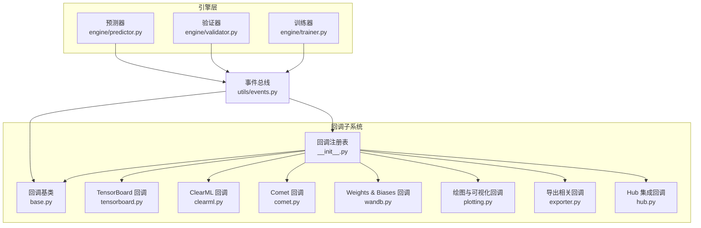
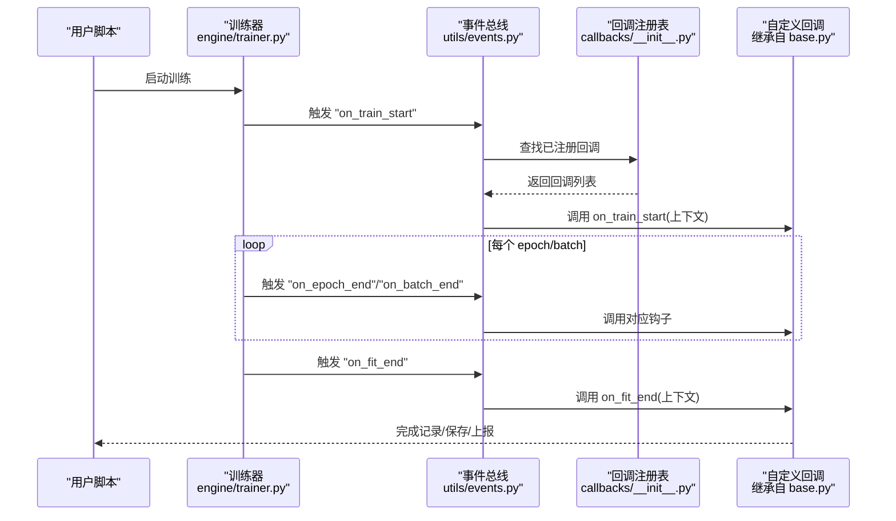
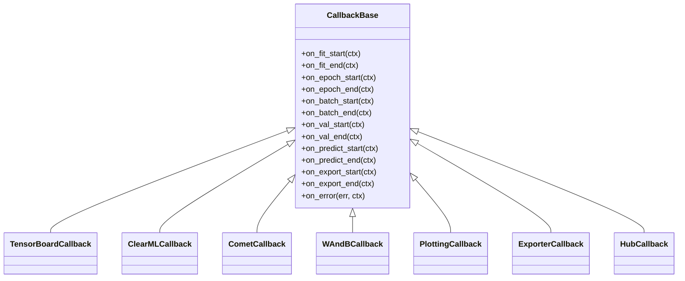
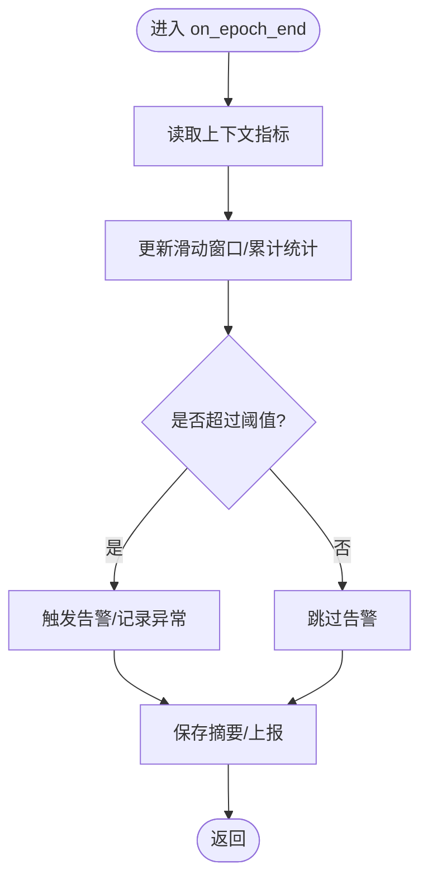
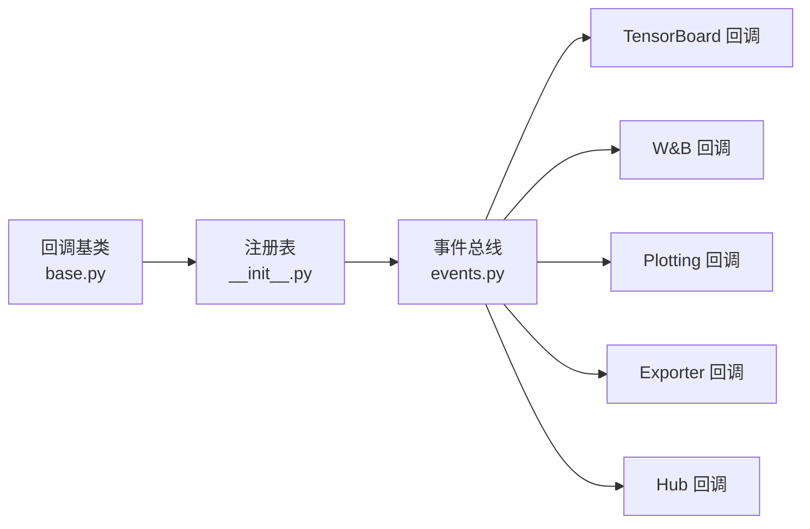

# 自定义回调开发指南

<cite>
**本文引用的文件**
- [ultralytics/utils/callbacks/__init__.py](file://ultralytics/utils/callbacks/__init__.py)
- [ultralytics/utils/callbacks/base.py](file://ultralytics/utils/callbacks/base.py)
- [ultralytics/utils/callbacks/tensorboard.py](file://ultralytics/utils/callbacks/tensorboard.py)
- [ultralytics/utils/callbacks/clearml.py](file://ultralytics/utils/callbacks/clearml.py)
- [ultralytics/utils/callbacks/comet.py](file://ultralytics/utils/callbacks/comet.py)
- [ultralytics/utils/callbacks/wandb.py](file://ultralytics/utils/callbacks/wandb.py)
- [ultralytics/utils/callbacks/plotting.py](file://ultralytics/utils/callbacks/plotting.py)
- [ultralytics/utils/callbacks/exporter.py](file://ultralytics/utils/callbacks/exporter.py)
- [ultralytics/utils/callbacks/hub.py](file://ultralytics/utils/callbacks/hub.py)
- [ultralytics/engine/trainer.py](file://ultralytics/engine/trainer.py)
- [ultralytics/engine/validator.py](file://ultralytics/engine/validator.py)
- [ultralytics/engine/predictor.py](file://ultralytics/engine/predictor.py)
- [ultralytics/utils/events.py](file://ultralytics/utils/events.py)
</cite>

## 目录
1. [简介](#简介)
2. [项目结构](#项目结构)
3. [核心组件](#核心组件)
4. [架构总览](#架构总览)
5. [详细组件分析](#详细组件分析)
6. [依赖关系分析](#依赖关系分析)
7. [性能考量](#性能考量)
8. [故障排查指南](#故障排查指南)
9. [结论](#结论)
10. [附录](#附录)

## 简介
本指南面向希望在 YOLO-Master 中扩展训练、验证与推理生命周期的开发者，提供从零开始实现“自定义回调”的完整路径。内容涵盖：
- 如何继承基类并实现必需与可选钩子方法
- 常见场景模板：训练监控、数据可视化、模型分析、自动化测试
- 状态管理、配置参数传递、与其他组件集成方式
- 调试技巧、性能测试与单元测试编写方法
- 最佳实践、常见问题与迁移建议
- 丰富的代码模板与参考实现（以源码路径引用形式给出）

## 项目结构
YOLO-Master 的回调系统位于 utils/callbacks 目录，由统一的注册表与事件总线驱动，被引擎层（trainer/validator/predictor）在关键生命周期点调用。

图表来源
- [ultralytics/utils/callbacks/__init__.py](file://ultralytics/utils/callbacks/__init__.py)
- [ultralytics/utils/callbacks/base.py](file://ultralytics/utils/callbacks/base.py)
- [ultralytics/utils/callbacks/tensorboard.py](file://ultralytics/utils/callbacks/tensorboard.py)
- [ultralytics/utils/callbacks/clearml.py](file://ultralytics/utils/callbacks/clearml.py)
- [ultralytics/utils/callbacks/comet.py](file://ultralytics/utils/callbacks/comet.py)
- [ultralytics/utils/callbacks/wandb.py](file://ultralytics/utils/callbacks/wandb.py)
- [ultralytics/utils/callbacks/plotting.py](file://ultralytics/utils/callbacks/plotting.py)
- [ultralytics/utils/callbacks/exporter.py](file://ultralytics/utils/callbacks/exporter.py)
- [ultralytics/utils/callbacks/hub.py](file://ultralytics/utils/callbacks/hub.py)
- [ultralytics/engine/trainer.py](file://ultralytics/engine/trainer.py)
- [ultralytics/engine/validator.py](file://ultralytics/engine/validator.py)
- [ultralytics/engine/predictor.py](file://ultralytics/engine/predictor.py)
- [ultralytics/utils/events.py](file://ultralytics/utils/events.py)

章节来源
- [ultralytics/utils/callbacks/__init__.py](file://ultralytics/utils/callbacks/__init__.py)
- [ultralytics/utils/callbacks/base.py](file://ultralytics/utils/callbacks/base.py)
- [ultralytics/utils/callbacks/tensorboard.py](file://ultralytics/utils/callbacks/tensorboard.py)
- [ultralytics/utils/callbacks/clearml.py](file://ultralytics/utils/callbacks/clearml.py)
- [ultralytics/utils/callbacks/comet.py](file://ultralytics/utils/callbacks/comet.py)
- [ultralytics/utils/callbacks/wandb.py](file://ultralytics/utils/callbacks/wandb.py)
- [ultralytics/utils/callbacks/plotting.py](file://ultralytics/utils/callbacks/plotting.py)
- [ultralytics/utils/callbacks/exporter.py](file://ultralytics/utils/callbacks/exporter.py)
- [ultralytics/utils/callbacks/hub.py](file://ultralytics/utils/callbacks/hub.py)
- [ultralytics/engine/trainer.py](file://ultralytics/engine/trainer.py)
- [ultralytics/engine/validator.py](file://ultralytics/engine/validator.py)
- [ultralytics/engine/predictor.py](file://ultralytics/engine/predictor.py)
- [ultralytics/utils/events.py](file://ultralytics/utils/events.py)

## 核心组件
- 回调基类：定义统一的生命周期钩子接口与默认空实现，供用户继承扩展。
- 回调注册表：集中管理内置回调的加载与实例化，支持按名称或类型注册。
- 事件总线：在训练/验证/推理的关键阶段触发事件，将上下文对象传递给已注册的回调。
- 内置回调示例：TensorBoard、ClearML、Comet、W&B、绘图、导出、Hub 等，覆盖日志、可视化、导出与平台集成。

章节来源
- [ultralytics/utils/callbacks/base.py](file://ultralytics/utils/callbacks/base.py)
- [ultralytics/utils/callbacks/__init__.py](file://ultralytics/utils/callbacks/__init__.py)
- [ultralytics/utils/events.py](file://ultralytics/utils/events.py)
- [ultralytics/utils/callbacks/tensorboard.py](file://ultralytics/utils/callbacks/tensorboard.py)
- [ultralytics/utils/callbacks/clearml.py](file://ultralytics/utils/callbacks/clearml.py)
- [ultralytics/utils/callbacks/comet.py](file://ultralytics/utils/callbacks/comet.py)
- [ultralytics/utils/callbacks/wandb.py](file://ultralytics/utils/callbacks/wandb.py)
- [ultralytics/utils/callbacks/plotting.py](file://ultralytics/utils/callbacks/plotting.py)
- [ultralytics/utils/callbacks/exporter.py](file://ultralytics/utils/callbacks/exporter.py)
- [ultralytics/utils/callbacks/hub.py](file://ultralytics/utils/callbacks/hub.py)

## 架构总览
下图展示了回调系统在训练流程中的调用时序与数据流向。

图表来源
- [ultralytics/engine/trainer.py](file://ultralytics/engine/trainer.py)
- [ultralytics/utils/events.py](file://ultralytics/utils/events.py)
- [ultralytics/utils/callbacks/__init__.py](file://ultralytics/utils/callbacks/__init__.py)
- [ultralytics/utils/callbacks/base.py](file://ultralytics/utils/callbacks/base.py)

## 详细组件分析

### 回调基类与生命周期钩子
- 基类职责
  - 定义标准钩子方法（如训练开始/结束、每轮开始/结束、批次开始/结束、验证前后、导出前后、错误处理等）。
  - 提供默认空实现，确保未覆盖的方法不会中断主流程。
  - 暴露通用工具（如访问上下文对象、配置、设备信息等）。
- 常用钩子分类
  - 训练期：on_fit_start/on_fit_end、on_epoch_start/on_epoch_end、on_batch_start/on_batch_end、on_train_end。
  - 验证期：on_val_start/on_val_end、on_val_batch_start/on_val_batch_end。
  - 推理期：on_predict_start/on_predict_end、on_predict_batch_start/on_predict_batch_end。
  - 导出期：on_export_start/on_export_end。
  - 错误与恢复：on_error、on_resume。
- 设计要点
  - 钩子方法应幂等且无副作用（除非显式用于保存/上报）。
  - 避免阻塞 I/O；必要时异步或批量落盘。
  - 通过上下文对象读取当前状态（epoch、batch、指标、模型句柄等），不要直接耦合内部变量名。

章节来源
- [ultralytics/utils/callbacks/base.py](file://ultralytics/utils/callbacks/base.py)
- [ultralytics/utils/events.py](file://ultralytics/utils/events.py)

### 回调注册表与事件总线
- 注册表
  - 负责发现、加载和实例化回调（包括内置与用户自定义）。
  - 支持按名称或类型注册，便于外部扩展。
- 事件总线
  - 在引擎各阶段广播事件，附带上下文对象。
  - 保证回调执行顺序稳定，支持异常隔离与错误传播策略。

章节来源
- [ultralytics/utils/callbacks/__init__.py](file://ultralytics/utils/callbacks/__init__.py)
- [ultralytics/utils/events.py](file://ultralytics/utils/events.py)

### 内置回调参考实现
- TensorBoard 回调：记录损失、指标、图像、直方图等。
- ClearML/Comet/W&B 回调：对接第三方实验跟踪平台。
- 绘图回调：生成训练曲线、混淆矩阵、PR 曲线等可视化结果。
- 导出回调：在导出前后进行额外检查或记录。
- Hub 回调：与云端平台同步权重、元数据与报告。

章节来源
- [ultralytics/utils/callbacks/tensorboard.py](file://ultralytics/utils/callbacks/tensorboard.py)
- [ultralytics/utils/callbacks/clearml.py](file://ultralytics/utils/callbacks/clearml.py)
- [ultralytics/utils/callbacks/comet.py](file://ultralytics/utils/callbacks/comet.py)
- [ultralytics/utils/callbacks/wandb.py](file://ultralytics/utils/callbacks/wandb.py)
- [ultralytics/utils/callbacks/plotting.py](file://ultralytics/utils/callbacks/plotting.py)
- [ultralytics/utils/callbacks/exporter.py](file://ultralytics/utils/callbacks/exporter.py)
- [ultralytics/utils/callbacks/hub.py](file://ultralytics/utils/callbacks/hub.py)

### 自定义回调开发步骤（从入门到进阶）
- 步骤一：继承基类
  - 新建类继承回调基类，按需覆盖所需钩子。
- 步骤二：实现最小可用版本
  - 至少覆盖 on_fit_start 与 on_fit_end，用于初始化与收尾。
- 步骤三：接入事件上下文
  - 从上下文读取 epoch、batch、指标、模型句柄等，避免硬编码。
- 步骤四：注册回调
  - 通过注册表将自定义回调加入运行期回调列表。
- 步骤五：配置参数传递
  - 使用配置对象或构造参数传入可调超参（如采样频率、阈值、输出路径）。
- 步骤六：状态管理
  - 在回调内维护轻量状态（如累计计数、窗口统计），注意跨进程/分布式一致性。
- 步骤七：集成外部系统
  - 对接日志、可视化、告警、模型仓库等，遵循幂等与重试策略。
- 步骤八：测试与回归
  - 编写单测与端到端用例，覆盖正常路径与异常路径。

章节来源
- [ultralytics/utils/callbacks/base.py](file://ultralytics/utils/callbacks/base.py)
- [ultralytics/utils/callbacks/__init__.py](file://ultralytics/utils/callbacks/__init__.py)
- [ultralytics/utils/events.py](file://ultralytics/utils/events.py)

### 典型场景模板与参考实现

#### 场景一：训练监控（指标采集与告警）
- 目标：在每轮/每批结束时采集指标，计算滑动平均，超过阈值触发告警。
- 关键点：
  - 在 on_epoch_end/on_batch_end 中读取指标。
  - 使用线程安全的数据结构维护状态。
  - 告警逻辑可复用现有通知通道或写入本地文件。
- 参考实现路径：
  - [ultralytics/utils/callbacks/tensorboard.py](file://ultralytics/utils/callbacks/tensorboard.py)
  - [ultralytics/utils/callbacks/wandb.py](file://ultralytics/utils/callbacks/wandb.py)

章节来源
- [ultralytics/utils/callbacks/tensorboard.py](file://ultralytics/utils/callbacks/tensorboard.py)
- [ultralytics/utils/callbacks/wandb.py](file://ultralytics/utils/callbacks/wandb.py)

#### 场景二：数据可视化（训练曲线与样本图）
- 目标：绘制损失曲线、类别精度、样本检测图。
- 关键点：
  - 在 on_epoch_end 聚合指标并绘图。
  - 在 on_val_batch_end 抽取少量样本进行可视化。
  - 控制 IO 频率，避免拖慢训练。
- 参考实现路径：
  - [ultralytics/utils/callbacks/plotting.py](file://ultralytics/utils/callbacks/plotting.py)
  - [ultralytics/utils/callbacks/tensorboard.py](file://ultralytics/utils/callbacks/tensorboard.py)

章节来源
- [ultralytics/utils/callbacks/plotting.py](file://ultralytics/utils/callbacks/plotting.py)
- [ultralytics/utils/callbacks/tensorboard.py](file://ultralytics/utils/callbacks/tensorboard.py)

#### 场景三：模型分析（梯度/激活/稀疏度）
- 目标：定期统计梯度范数、激活分布、专家路由稀疏度等。
- 关键点：
  - 在 on_batch_end 或 on_epoch_end 收集统计量。
  - 使用直方图/散点图/热力图呈现。
  - 对大规模模型采用采样以降低开销。
- 参考实现路径：
  - [ultralytics/utils/callbacks/tensorboard.py](file://ultralytics/utils/callbacks/tensorboard.py)
  - [ultralytics/utils/callbacks/plotting.py](file://ultralytics/utils/callbacks/plotting.py)

章节来源
- [ultralytics/utils/callbacks/tensorboard.py](file://ultralytics/utils/callbacks/tensorboard.py)
- [ultralytics/utils/callbacks/plotting.py](file://ultralytics/utils/callbacks/plotting.py)

#### 场景四：自动化测试（断言与门禁）
- 目标：在验证阶段自动断言指标阈值，失败则中止训练或标记构建失败。
- 关键点：
  - 在 on_val_end 读取验证指标并断言。
  - 结合 CI 环境输出结构化报告。
- 参考实现路径：
  - [ultralytics/engine/validator.py](file://ultralytics/engine/validator.py)
  - [ultralytics/utils/callbacks/plotting.py](file://ultralytics/utils/callbacks/plotting.py)

章节来源
- [ultralytics/engine/validator.py](file://ultralytics/engine/validator.py)
- [ultralytics/utils/callbacks/plotting.py](file://ultralytics/utils/callbacks/plotting.py)

#### 场景五：导出前后处理（格式校验与签名）
- 目标：在导出前检查模型状态，导出后生成校验摘要。
- 关键点：
  - 在 on_export_start/on_export_end 插入钩子。
  - 记录导出参数、哈希、尺寸等信息。
- 参考实现路径：
  - [ultralytics/utils/callbacks/exporter.py](file://ultralytics/utils/callbacks/exporter.py)

章节来源
- [ultralytics/utils/callbacks/exporter.py](file://ultralytics/utils/callbacks/exporter.py)

#### 场景六：平台集成（Hub/远程存储）
- 目标：将权重、日志、报告上传至云端或远端存储。
- 关键点：
  - 在 on_fit_end/on_val_end 触发上传。
  - 处理网络异常与重试。
- 参考实现路径：
  - [ultralytics/utils/callbacks/hub.py](file://ultralytics/utils/callbacks/hub.py)

章节来源
- [ultralytics/utils/callbacks/hub.py](file://ultralytics/utils/callbacks/hub.py)

### 面向对象结构图（回调体系）

图表来源
- [ultralytics/utils/callbacks/base.py](file://ultralytics/utils/callbacks/base.py)
- [ultralytics/utils/callbacks/tensorboard.py](file://ultralytics/utils/callbacks/tensorboard.py)
- [ultralytics/utils/callbacks/clearml.py](file://ultralytics/utils/callbacks/clearml.py)
- [ultralytics/utils/callbacks/comet.py](file://ultralytics/utils/callbacks/comet.py)
- [ultralytics/utils/callbacks/wandb.py](file://ultralytics/utils/callbacks/wandb.py)
- [ultralytics/utils/callbacks/plotting.py](file://ultralytics/utils/callbacks/plotting.py)
- [ultralytics/utils/callbacks/exporter.py](file://ultralytics/utils/callbacks/exporter.py)
- [ultralytics/utils/callbacks/hub.py](file://ultralytics/utils/callbacks/hub.py)

### 复杂逻辑流程图（指标采集与阈值告警）

图表来源
- [ultralytics/utils/callbacks/base.py](file://ultralytics/utils/callbacks/base.py)
- [ultralytics/utils/callbacks/tensorboard.py](file://ultralytics/utils/callbacks/tensorboard.py)

## 依赖关系分析
- 低耦合高内聚
  - 回调仅依赖事件总线与上下文对象，不直接侵入引擎内部实现。
- 直接依赖
  - 回调注册表依赖基类与具体回调实现。
  - 事件总线依赖注册表以分发事件。
- 潜在循环依赖
  - 应避免回调反向依赖引擎内部模块；如需访问模型，请通过上下文提供的只读接口。
- 外部依赖
  - 第三方库（如 tensorboard、wandb、clearml、comet）仅在对应回调中引入，降低主包体积与导入成本。

图表来源
- [ultralytics/utils/callbacks/base.py](file://ultralytics/utils/callbacks/base.py)
- [ultralytics/utils/callbacks/__init__.py](file://ultralytics/utils/callbacks/__init__.py)
- [ultralytics/utils/events.py](file://ultralytics/utils/events.py)
- [ultralytics/utils/callbacks/tensorboard.py](file://ultralytics/utils/callbacks/tensorboard.py)
- [ultralytics/utils/callbacks/wandb.py](file://ultralytics/utils/callbacks/wandb.py)
- [ultralytics/utils/callbacks/plotting.py](file://ultralytics/utils/callbacks/plotting.py)
- [ultralytics/utils/callbacks/exporter.py](file://ultralytics/utils/callbacks/exporter.py)
- [ultralytics/utils/callbacks/hub.py](file://ultralytics/utils/callbacks/hub.py)

章节来源
- [ultralytics/utils/callbacks/base.py](file://ultralytics/utils/callbacks/base.py)
- [ultralytics/utils/callbacks/__init__.py](file://ultralytics/utils/callbacks/__init__.py)
- [ultralytics/utils/events.py](file://ultralytics/utils/events.py)

## 性能考量
- 减少 I/O 频率：合并写入、批量上报、延迟落盘。
- 采样与降采样：对高频事件（如 batch 级）进行采样。
- 避免阻塞：使用异步队列或后台线程处理耗时任务。
- 内存占用：及时释放中间结果，避免累积大对象。
- 多进程/分布式：确保状态一致性与锁粒度合理。

[本节为通用指导，无需源码引用]

## 故障排查指南
- 常见问题
  - 回调未触发：检查注册表是否正确加载、事件名称是否匹配。
  - 上下文缺失字段：确认事件版本与上下文结构，避免硬编码字段名。
  - 性能退化：定位耗时钩子，增加采样或异步处理。
  - 并发冲突：为共享状态加锁或使用线程安全容器。
  - 第三方库导入失败：按需导入，提供降级路径。
- 调试技巧
  - 在 on_error 钩子中打印堆栈与上下文快照。
  - 使用轻量日志框架，按级别过滤。
  - 针对关键路径添加断言与快速失败。
- 单元测试
  - 模拟事件上下文，验证回调行为与边界条件。
  - 使用小数据集与短训练步数进行回归测试。
  - 隔离外部依赖（网络、磁盘），使用 mock 或内存文件系统。

章节来源
- [ultralytics/utils/callbacks/base.py](file://ultralytics/utils/callbacks/base.py)
- [ultralytics/utils/events.py](file://ultralytics/utils/events.py)

## 结论
通过继承回调基类并利用事件总线，开发者可以以最小侵入的方式扩展 YOLO-Master 的训练、验证与推理能力。遵循幂等、低耦合、可观测与可测试的原则，能够构建出稳定高效的自定义回调生态。

[本节为总结性内容，无需源码引用]

## 附录

### 开发清单与最佳实践
- 明确职责：一个回调只做一件事，保持单一职责。
- 幂等设计：重复调用不应改变业务状态。
- 配置优先：所有可调参数通过配置对象注入。
- 优雅降级：外部依赖不可用时回退到本地记录。
- 文档完善：为钩子方法与配置项补充说明与示例。

[本节为通用指导，无需源码引用]

### 迁移指南（从旧版回调机制）
- 识别旧钩子与新钩子的映射关系。
- 逐步替换回调实现，先覆盖 on_fit_start/on_fit_end 验证链路。
- 使用事件名称对照表核对兼容性。
- 在 CI 中增加回归用例，确保行为一致。

[本节为通用指导，无需源码引用]