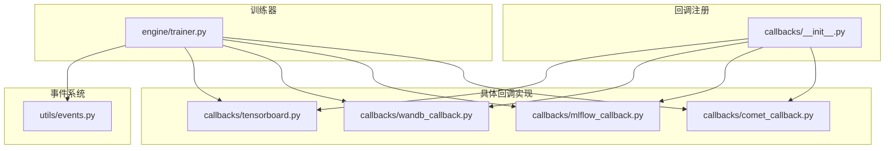
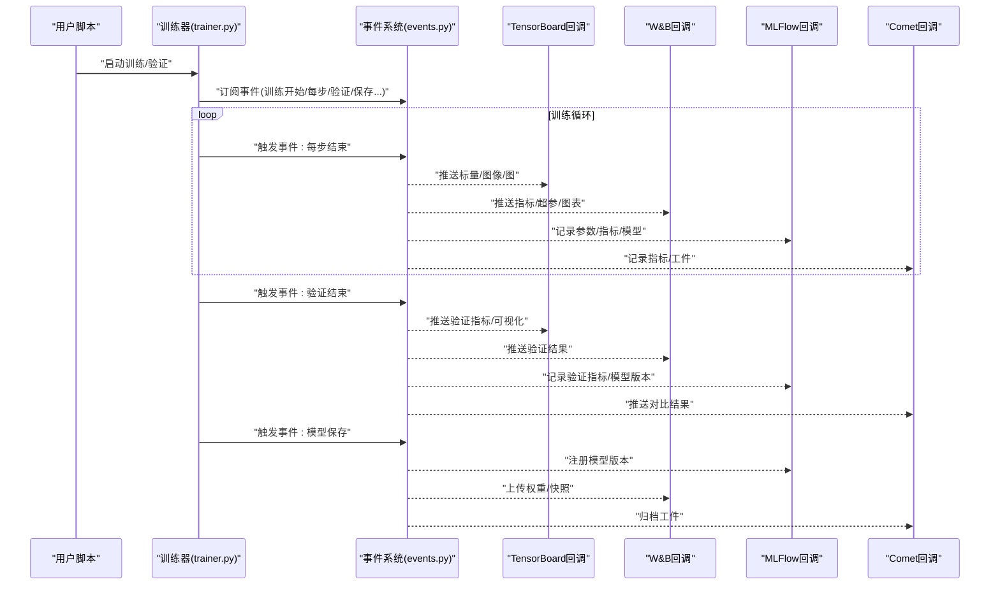
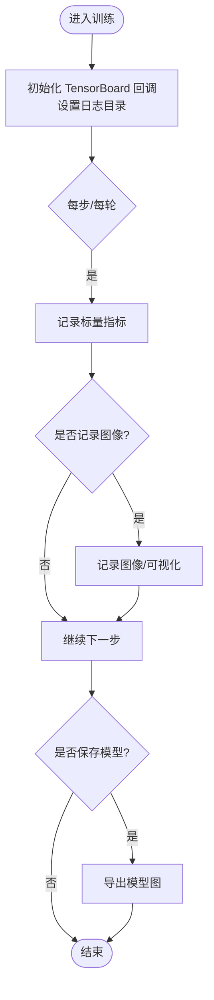
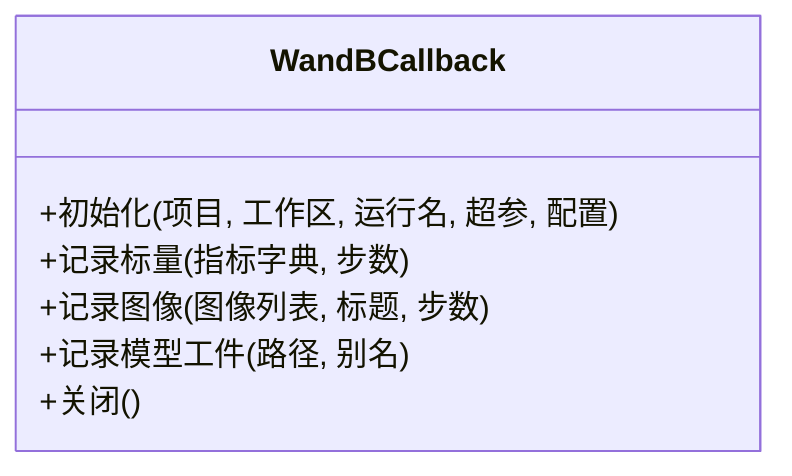
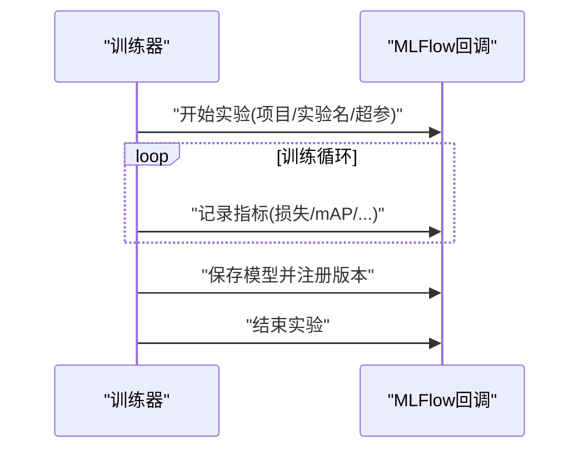
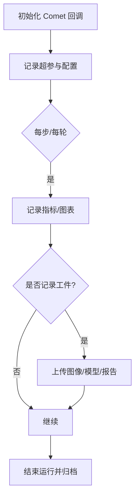
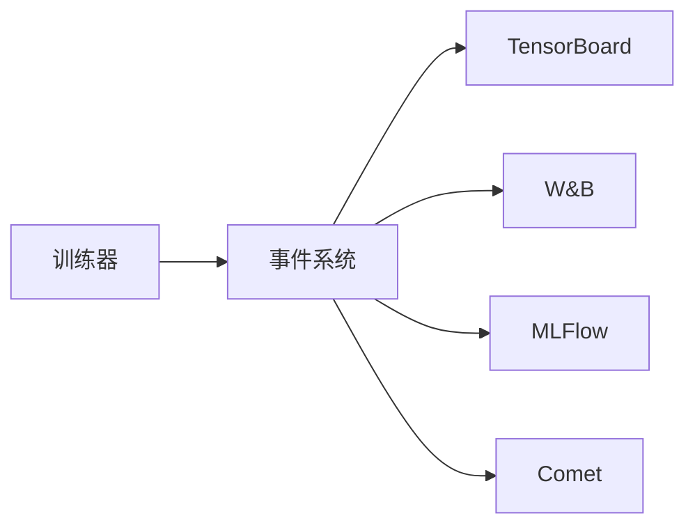
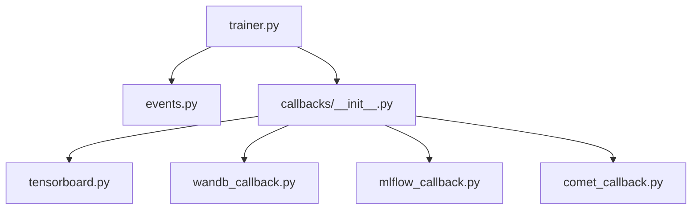

# 日志记录回调

<cite>
**本文引用的文件**
- [callbacks.py](file://ultralytics/utils/callbacks/__init__.py)
- [tensorboard.py](file://ultralytics/utils/callbacks/tensorboard.py)
- [wandb_callback.py](file://ultralytics/utils/callbacks/wandb_callback.py)
- [mlflow_callback.py](file://ultralytics/utils/callbacks/mlflow_callback.py)
- [comet_callback.py](file://ultralytics/utils/callbacks/comet_callback.py)
- [trainer.py](file://ultralytics/engine/trainer.py)
- [events.py](file://ultralytics/utils/events.py)
</cite>

## 目录
1. [简介](#简介)
2. [项目结构](#项目结构)
3. [核心组件](#核心组件)
4. [架构总览](#架构总览)
5. [详细组件分析](#详细组件分析)
6. [依赖关系分析](#依赖关系分析)
7. [性能考量](#性能考量)
8. [故障排查指南](#故障排查指南)
9. [结论](#结论)
10. [附录](#附录)

## 简介
本文件为 YOLO-Master 的“日志记录回调系统”提供详细的 API 文档，聚焦以下集成：
- TensorBoard 集成回调：标量指标、图像可视化、模型图展示等高级功能
- Weights & Biases（W&B）监控回调：配置选项与实验跟踪
- MLFlow 实验管理回调：项目组织、参数记录与模型版本控制
- Comet.ml 集成回调：实时协作与结果对比

目标读者包括希望系统化使用训练期/验证期日志记录的工程师与研究者。文档以代码级事实为依据，辅以流程图与时序图帮助理解调用链与数据流。

## 项目结构
YOLO-Master 将各类日志工具封装为“回调”，在训练器生命周期中按事件触发。关键位置如下：
- 回调注册入口：位于 utils/callbacks 包初始化处，负责导出并统一注册各日志回调
- 具体实现：每个日志工具一个独立模块（如 tensorboard.py、wandb_callback.py、mlflow_callback.py、comet_callback.py）
- 训练器集成：engine/trainer.py 在训练流程中订阅事件并调用对应回调
- 事件总线：utils/events.py 定义事件常量与分发机制

图表来源
- [callbacks.py:1-200](file://ultralytics/utils/callbacks/__init__.py#L1-L200)
- [tensorboard.py:1-200](file://ultralytics/utils/callbacks/tensorboard.py#L1-L200)
- [wandb_callback.py:1-200](file://ultralytics/utils/callbacks/wandb_callback.py#L1-L200)
- [mlflow_callback.py:1-200](file://ultralytics/utils/callbacks/mlflow_callback.py#L1-L200)
- [comet_callback.py:1-200](file://ultralytics/utils/callbacks/comet_callback.py#L1-L200)
- [trainer.py:1-200](file://ultralytics/engine/trainer.py#L1-L200)
- [events.py:1-200](file://ultralytics/utils/events.py#L1-L200)

章节来源
- [callbacks.py:1-200](file://ultralytics/utils/callbacks/__init__.py#L1-L200)
- [trainer.py:1-200](file://ultralytics/engine/trainer.py#L1-L200)
- [events.py:1-200](file://ultralytics/utils/events.py#L1-L200)

## 核心组件
- 回调注册中心（__init__.py）
  - 职责：集中导出并注册 TensorBoard、W&B、MLFlow、Comet 等回调；对外暴露统一的启用开关或默认策略
  - 关键点：根据运行环境或用户配置决定是否加载特定后端；避免未安装依赖导致导入失败
- 训练器集成（trainer.py）
  - 职责：在训练/验证/预测的关键阶段订阅事件，并将指标、图像、模型图等数据推送给已注册的回调
  - 关键点：事件驱动，解耦业务逻辑与日志输出；支持多后端并行写入
- 事件系统（events.py）
  - 职责：定义事件名称与语义（如训练开始、每步结束、验证结束、模型保存等），供回调订阅
  - 关键点：保证回调顺序与幂等性；提供扩展点以便新增回调类型

章节来源
- [callbacks.py:1-200](file://ultralytics/utils/callbacks/__init__.py#L1-L200)
- [trainer.py:1-200](file://ultralytics/engine/trainer.py#L1-L200)
- [events.py:1-200](file://ultralytics/utils/events.py#L1-L200)

## 架构总览
下图展示了训练器通过事件系统调度各日志回调的整体交互。

图表来源
- [trainer.py:1-200](file://ultralytics/engine/trainer.py#L1-L200)
- [events.py:1-200](file://ultralytics/utils/events.py#L1-L200)
- [tensorboard.py:1-200](file://ultralytics/utils/callbacks/tensorboard.py#L1-L200)
- [wandb_callback.py:1-200](file://ultralytics/utils/callbacks/wandb_callback.py#L1-L200)
- [mlflow_callback.py:1-200](file://ultralytics/utils/callbacks/mlflow_callback.py#L1-L200)
- [comet_callback.py:1-200](file://ultralytics/utils/callbacks/comet_callback.py#L1-L200)

## 详细组件分析

### TensorBoard 集成回调
- 能力概览
  - 标量指标：损失、学习率、mAP、PR曲线等随步数/轮次变化
  - 图像可视化：训练/验证样本、预测框、热力图、混淆矩阵截图等
  - 模型图展示：计算图/子图导出，便于结构审查
- 典型用法要点
  - 在训练前启用 TensorBoard 回调，指定日志目录
  - 在每步/每轮结束时自动记录标量与图像
  - 在模型保存时导出图结构（可选）
- 注意事项
  - 大图像批量记录可能影响 IO 与网络（若远程存储）
  - 建议按需采样图像，避免过多冗余

图表来源
- [tensorboard.py:1-200](file://ultralytics/utils/callbacks/tensorboard.py#L1-L200)
- [trainer.py:1-200](file://ultralytics/engine/trainer.py#L1-L200)
- [events.py:1-200](file://ultralytics/utils/events.py#L1-L200)

章节来源
- [tensorboard.py:1-200](file://ultralytics/utils/callbacks/tensorboard.py#L1-L200)

### Weights & Biases（W&B）监控回调
- 能力概览
  - 实验跟踪：项目/工作区/运行名、超参数、指标、图表、媒体工件
  - 实时监控：在线面板查看训练进度与诊断信息
  - 协作与对比：团队共享、A/B 对比、历史回归
- 配置项要点
  - 项目与工作区命名、运行名称、标签
  - 是否开启离线模式、同步频率、最大工件大小
  - 是否记录模型权重与中间产物
- 最佳实践
  - 为每次实验创建独立运行，附带可复现的超参与数据路径
  - 合理控制图像/视频记录频率，避免体积膨胀

图表来源
- [wandb_callback.py:1-200](file://ultralytics/utils/callbacks/wandb_callback.py#L1-L200)

章节来源
- [wandb_callback.py:1-200](file://ultralytics/utils/callbacks/wandb_callback.py#L1-L200)

### MLFlow 实验管理回调
- 能力概览
  - 项目组织：按项目分组实验，支持标签与描述
  - 参数记录：超参数、数据集路径、训练配置
  - 指标记录：训练/验证指标、自定义度量
  - 模型版本控制：保存模型元数据与权重，注册模型版本
- 典型流程
  - 启动实验 -> 记录超参与配置 -> 每步/每轮记录指标 -> 保存模型并注册版本 -> 结束实验
- 注意事项
  - 模型注册需确保后端存储可用（本地/对象存储）
  - 建议为不同任务/数据集划分不同实验

图表来源
- [mlflow_callback.py:1-200](file://ultralytics/utils/callbacks/mlflow_callback.py#L1-L200)
- [trainer.py:1-200](file://ultralytics/engine/trainer.py#L1-L200)

章节来源
- [mlflow_callback.py:1-200](file://ultralytics/utils/callbacks/mlflow_callback.py#L1-L200)

### Comet.ml 集成回调
- 能力概览
  - 实时协作：多人同时查看同一运行，评论与标注
  - 结果对比：跨运行对比指标、可视化与工件
  - 工件管理：图像、模型、报告等一键归档
- 使用要点
  - 初始化时设置 API Key、项目与运行名
  - 按需记录图像与模型工件，控制同步频率
  - 利用标签与注释进行团队协作与检索

图表来源
- [comet_callback.py:1-200](file://ultralytics/utils/callbacks/comet_callback.py#L1-L200)

章节来源
- [comet_callback.py:1-200](file://ultralytics/utils/callbacks/comet_callback.py#L1-L200)

### 概念性总览
以下为不绑定具体文件的通用工作流示意，用于帮助理解日志回调在训练中的角色。

[此图为概念性说明，无需图表来源]

## 依赖关系分析
- 耦合与内聚
  - 回调模块之间相互独立，内聚于各自后端 SDK
  - 训练器仅依赖事件系统与回调接口，保持松耦合
- 外部依赖
  - TensorBoard、W&B、MLFlow、Comet 均为可选第三方库；回调注册中心应做存在性检查与优雅降级
- 潜在循环依赖
  - 当前设计通过事件系统解耦，未见直接循环导入风险

图表来源
- [trainer.py:1-200](file://ultralytics/engine/trainer.py#L1-L200)
- [events.py:1-200](file://ultralytics/utils/events.py#L1-L200)
- [callbacks.py:1-200](file://ultralytics/utils/callbacks/__init__.py#L1-L200)
- [tensorboard.py:1-200](file://ultralytics/utils/callbacks/tensorboard.py#L1-L200)
- [wandb_callback.py:1-200](file://ultralytics/utils/callbacks/wandb_callback.py#L1-L200)
- [mlflow_callback.py:1-200](file://ultralytics/utils/callbacks/mlflow_callback.py#L1-L200)
- [comet_callback.py:1-200](file://ultralytics/utils/callbacks/comet_callback.py#L1-L200)

章节来源
- [callbacks.py:1-200](file://ultralytics/utils/callbacks/__init__.py#L1-L200)
- [trainer.py:1-200](file://ultralytics/engine/trainer.py#L1-L200)
- [events.py:1-200](file://ultralytics/utils/events.py#L1-L200)

## 性能考量
- I/O 与网络
  - 大量图像/视频记录会显著增加磁盘/网络压力，建议采样与压缩
  - 对远端服务（W&B/MLFlow/Comet）的频繁写入可能成为瓶颈，应调整同步频率
- CPU/GPU 占用
  - 回调执行应在非关键路径，避免阻塞训练主循环
- 存储成本
  - 模型工件与中间产物应按需保留，定期清理旧运行

[本节为通用指导，无需章节来源]

## 故障排查指南
- 常见症状与定位
  - 无日志输出：检查回调是否被正确注册与启用；确认后端依赖已安装
  - 指标缺失：核对事件订阅是否正确；确认指标键名一致
  - 图像/模型未上传：检查权限、网络与存储空间；确认工件路径有效
- 快速自检清单
  - 确认训练器已订阅相关事件
  - 确认回调初始化参数（项目/运行名/目录）正确
  - 观察控制台是否有后端 SDK 的错误堆栈
  - 降低记录频率或关闭非必要可视化以隔离问题

章节来源
- [trainer.py:1-200](file://ultralytics/engine/trainer.py#L1-L200)
- [callbacks.py:1-200](file://ultralytics/utils/callbacks/__init__.py#L1-L200)

## 结论
YOLO-Master 的日志记录回调系统以事件驱动为核心，将训练流程与多种日志后端解耦。TensorBoard 适合本地快速调试与可视化；W&B 擅长在线协作与实验追踪；MLFlow 提供完善的实验管理与模型版本控制；Comet 则强化团队协作与结果对比。建议根据团队工作流与基础设施选择单一或组合方案，并通过回调注册中心统一管理。

[本节为总结性内容，无需章节来源]

## 附录
- 术语
  - 回调：在训练生命周期特定事件触发的函数/类实例
  - 工件：图像、模型、报告等可归档的数据产物
  - 事件：训练过程中的关键节点（开始、每步、验证、保存等）
- 参考路径
  - 回调注册入口：[callbacks/__init__.py](file://ultralytics/utils/callbacks/__init__.py)
  - 训练器集成：[engine/trainer.py](file://ultralytics/engine/trainer.py)
  - 事件系统：[utils/events.py](file://ultralytics/utils/events.py)
  - 各回调实现：
    - [callbacks/tensorboard.py](file://ultralytics/utils/callbacks/tensorboard.py)
    - [callbacks/wandb_callback.py](file://ultralytics/utils/callbacks/wandb_callback.py)
    - [callbacks/mlflow_callback.py](file://ultralytics/utils/callbacks/mlflow_callback.py)
    - [callbacks/comet_callback.py](file://ultralytics/utils/callbacks/comet_callback.py)